# Essays
* [Experiências socialistas](#Experiências-socialistas)
    * [A União Soviética](#A-União-Soviética)
        * [Revolução, comunismo de guerra e NEP](#Revolução-comunismo-de-guerra-e-NEP)
        * [Criminosos anarquistas na URSS](#Criminosos-anarquistas-na-URSS)
        * [Desenvolvimento econômico e padrões de vida na era socialista](#Desenvolvimento-econômico-e-padrões-de-vida-na-era-socialista)
        * [Condições de saúde no período socialista](#Condições-de-saúde-no-período-socialista)
        * [A questão Stalin](#A-questão-Stalin)
            * [O grande expurgo](#O-grande-expurgo)
            * [A fome ucraniana (holodomor)](#A-fome-ucraniana-holodomor)
            * [Antissemitismo](#Antissemitismo)
            * [Pessoas inocentes fuziladas por crimes pequenos](#Pessoas-inocentes-fuziladas-por-crimes-pequenos)
            * [Líder não-democrático](#Líder-não-democrático)
            * [As gulags](#As-gulags)
        * [Trabalhadores na União Soviética](#Trabalhadores-na-União-Soviética)
            * [Participação do trabalhador no local de trabalho](#Participação-do-trabalhador-no-local-de-trabalho)
            * [Participação política na URSS](#Participação-política-na-URSS)
        * [Conclusão sobre os trabalhadores na URSS](#Conclusão-sobre-os-trabalhadores-na-URSS)
        * [Conclusão sobre a URSS](#Conclusão-sobre-a-URSS)
    * [Uma resposta ao bearkunin sobre a URSS](#Uma-resposta-ao-bearkunin-sobre-a-URSS)
    * [A Iugoslávia](#A-Iugoslávia)
        * [Iugoslávia pré-guerra](#Iugoslávia-pré-guerra)
        * [Desenvolvimento econômico e de infraestrutura da Iugoslávia](#Desenvolvimento-econômico-e-de-infraestrutura-da-Iugoslávia)
        * [Conquistas na saúde da Iugoslávia](#Conquistas-na-saúde-da-Iugoslávia)
        * [Conquistas educacionais da Iugoslávia](#Conquistas-educacionais-da-Iugoslávia)
        * [Direitos das mulheres na Iugoslávia](#Direitos-das-mulheres-na-Iugoslávia)
        * [Conclusão sobre a Iugoslávia](#Conclusão-sobre-a-Iugoslávia)
    * [A Albânia](#A-Albânia)
        * [Albânia pré-guerra](#Albânia-pré-guerra)
        * [Desenvolvimento econômico e infraestrutural da Albânia](#Desenvolvimento-econômico-e-infraestrutural-da-Albânia)
        * [Conquistas na saúde da Albânia](#Conquistas-na-saúde-da-Albânia)
        * [Conquistas educacionais da Albânia](#Conquistas-educacionais-da-Albânia)
        * [Segurança social na Albânia](#Segurança-social-na-Albânia)
        * [Direitos das mulheres na Albânia](#Direitos-das-mulheres-na-Albânia)
        * [Os problemas da Albânia comunista](#Os-problemas-da-Albânia-comunista)
        * [Conclusão sobre a Albânia](#Conclusão-sobre-a-Albânia)
    * [A Polônia](#A-Polônia)
        * [Desenvolvimento econômico e industrial da Polônia](#Desenvolvimento-econômico-e-industrial-da-Polônia)
        * [Conquistas na saúde da Polônia](#Conquistas-na-saúde-da-Polônia)
        * [Conquistas educacionais da Polônia](#Conquistas-educacionais-da-Polônia)
        * [Direitos das mulheres da Polônia](#Direitos-das-mulheres-da-Polônia)
        * [Conclusão sobre a Polônia](#Conclusão-sobre-a-Polônia)
    * [A Romênia](#A-Romênia)
        * [A farsa do julgamento de Ceausescu](#A-farsa-do-julgamento-de-Ceausescu)
        * [Conclusão sobre a Romênia](#Conclusão-sobre-a-Romênia)
    * [A Hungria](#A-Hungria)
        * [Desenvolvimento econômico e padrão de vida da Hungria](#Desenvolvimento-econômico-e-padrão-de-vida-da-Hungria)
        * [Saúde e bem-estar social da Hungria](#Saúde-e-bem-estar-social-da-Hungria)
        * [Realizações educacionais da Hungria](#Realizações-educacionais-da-Hungria)
        * [Nostalgia pós-comunista na Hungria](#Nostalgia-pós-comunista-na-Hungria)
        * [Conclusão sobre a Hungria](#Conclusão-sobre-a-Hungria)
    * [A China](#A-China)
        * [China antes da Revolução](#China-antes-da-Revolução)
        * [Período Mao Zedong](#Período-Mao-Zedong)
            * [Visão geral dos padrões de vida da China maoísta](#Visão-geral-dos-padrões-de-vida-da-China-maoísta)
            * [Mais pesquisas sobre saúde pública e expectativa de vida do período maoista](#Mais-pesquisas-sobre-saúde-pública-e-expectativa-de-vida-do-período-maoista)
            * [Análise da Grande Fome Chinesa e comparação com a Índia capitalista](#Análise-da-Grande-Fome-Chinesa-e-comparação-com-a-Índia-capitalista)
            * [Conclusão sobre a China maoísta](#Conclusão-sobre-a-China-maoísta)
        * [Políticas chinesas sobre minorias](#Políticas-chinesas-sobre-minorias)
        * [A questão uigur](#A-questão-uigur)
            * [As acusações sobre os uigures](#As-acusações-sobre-os-uigures)
            * [As investigações sobre os uigures](#As-investigações-sobre-os-uigures)
            * [Fatos sobre os uigures e a China](#Fatos-sobre-os-uigures-e-a-China)
            * [Quem é a Radio Free Asia e Adrian Zenz?](#Quem-é-a-Radio-Free-Asia-e-Adrian-Zenz)
            * [Desbancando histórias](#Desbancando-histórias)
            * [Conclusão e considerações finais sobre os uigures](#Conclusão-e-considerações-finais-sobre-os-uigures)
    * [A Alemanha Oriental](#A-Alemanha-Oriental)
        * [Antecedentes históricos e condições iniciais (Segunda Guerra Mundial e era pré-guerra) da Alemanha Oriental](#Antecedentes-históricos-e-condições-iniciais-Segunda-Guerra-Mundial-e-era-pré-guerra-da-Alemanha-Oriental)
        * [Crescimento econômico e desenvolvimento industrial da Alemanha Oriental](#Crescimento-econômico-e-desenvolvimento-industrial-da-Alemanha-Oriental)
        * [Aumentos no padrão de vida da Alemanha Oriental](#Aumentos-no-padrão-de-vida-da-Alemanha-Oriental)
        * [Saúde na Alemanha Oriental](#Saúde-na-Alemanha-Oriental)
        * [Educação e cuidados infantis na Alemanha Oriental](#Educação-e-cuidados-infantis-na-Alemanha-Oriental)
        * [Direitos das mulheres na Alemanha Oriental](#Direitos-das-mulheres-na-Alemanha-Oriental)
        * [O desastre de 1989](#O-desastre-de-1989)
        * [Conclusão sobre a Alemanha Oriental](#Conclusão-sobre-a-Alemanha-Oriental)
    * [Os naxalitas na Índia](#Os-naxalitas-na-Índia)
        * [Questões econômicas e qualidade de vida (terra, salários, saúde, etc) dos naxalitas](#Questões-econômicas-e-qualidade-de-vida-terra-salários-saúde-etc-dos-naxalitas)
        * [Questões sociais (raça, gênero, trabalho forçado, etc) dos naxalitas](#Questões-sociais-raça-gênero-trabalho-forçado-etc-dos-naxalitas)
        * [Conclusão sobre os naxalitas](#Conclusão-sobre-os-naxalitas)
    * [Os sandinistas na Nicarágua](#Os-sandinistas-na-Nicarágua)
        * [Indicadores econômicos e nutricionais da Nicarágua](#Indicadores-econômicos-e-nutricionais-da-Nicarágua)
        * [Conquistas na saúde da Nicarágua](#Conquistas-na-saúde-da-Nicarágua)
        * [Educação e alfabetização na Nicarágua](#Educação-e-alfabetização-na-Nicarágua)
        * [Política social e igualdade de gênero na Nicarágua](#Política-social-e-igualdade-de-gênero-na-Nicarágua)
        * [Conclusão sobre a Nicarágua](#Conclusão-sobre-a-Nicarágua)
    * [Os zapatistas no México](#Os-zapatistas-no-México)
        * [Sistema econômico e padrões de vida zapatistas](#Sistema-econômico-e-padrões-de-vida-zapatistas)
        * [Cuidados de saúde em territórios zapatistas](#Cuidados-de-saúde-em-territórios-zapatistas)
        * [Educação em territórios Zapatistas](#Educação-em-territórios-Zapatistas)
        * [Direitos das mulheres e anti-racismo nas comunidades zapatistas](#Direitos-das-mulheres-e-anti-racismo-nas-comunidades-zapatistas)
        * [Conclusão sobre o EZLN](#Conclusão-sobre-o-EZLN)
    * [A Bolívia](#A-Bolívia)
        * [Realizações econômicas, crescimento e redução da pobreza na Bolívia](#Realizações-econômicas-crescimento-e-redução-da-pobreza-na-Bolívia)
        * [Reformas sociais e conquistas da Bolívia](#Reformas-sociais-e-conquistas-da-Bolívia)
        * [Política externa e anti-imperialismo boliviano](#Política-externa-e-anti-imperialismo-boliviano)
        * [Conclusão sovre a Bolívia](#Conclusão-sobre-a-Bolívia)
* [Mitos](#Mitos)
    * [Mito sobre a origem do dinheiro](#Mito-sobre-a-origem-do-dinheiro)
    * [Espantalho da religião ser o ópio do povo](#Espantalho-da-religião-ser-o-ópio-do-povo)
    * [O imperialismo no mundo moderno](#O-imperialismo-no-mundo-moderno)
    * [O capitalismo não funciona](#O-capitalismo-não-funciona)
    * [O socialismo funciona sim](#O-socialismo-funciona-sim)
    * [Por que a educação no socialismo é melhor](#Por-que-a-educação-no-socialismo-é-melhor)
    * [Invenções soviéticas](#Invenções-soviéticas)
    * [Países socialistas antes do socialismo](#Países-socialistas-antes-do-socialismo)
    * [Lenin não era antissemita](#Lenin-não-era-antissemita)
    * [A violência segundo Lenin](#A-violência-segundo-Lenin)
    * [A origem da teoria da conspiração judaíca-maçom](#A-origem-da-teoria-da-conspiração-judaíca-maçom)
    * [O que realmente é o fascismo e o nazismo](#O-que-realmente-é-o-fascismo-e-o-nazismo)
    * [Mises e Hayek admiravam o fascismo](#Mises-e-Hayek-admiravam-o-fascismo)
    * [O verdadeiro Winston Churchill](#O-verdadeiro-Winston-Churchill)
    * [O socialismo não matou 100 milhões](#O-socialismo-não-matou-100-milhões)
    * [Mitos da revolução russa](#Mitos-da-revolução-russa)
    * [Revoluções não são violentas](#Revoluções-não-são-violentas)
    * [Apenas a luta de classes muda a realidade](#Apenas-a-luta-de-classes-muda-a-realidade)
    * [Mitos da guerra de inverno](#Mitos-da-guerra-de-inverno)
    * [Segunda Guerra Mundial](#Segunda-Guerra-Mundial)
        * [Mitos do pacto Molotov-Ribbentrop](#Mitos-do-pacto-Molotov-Ribbentrop)
        * [Mitos da invasão polonesa](#Mitos-da-invasão-polonesa)
        * [A URSS sabia que Hitler ia atacar](#A-URSS-sabia-que-Hitler-ia-atacar)
        * [A URSS foi a maior responsável pela derrota dos nazistas](#A-URSS-foi-a-maior-responsável-pela-derrota-dos-nazistas)
        * [O plano era deixar os nazistas massacrarem a URSS](#O-plano-era-deixar-os-nazistas-massacrarem-a-URSS)
        * [Hitler não era um grande estrategista](#Hitler-não-era-um-grande-estrategista)
        * [A família britânica e o nazismo](#A-família-britânica-e-o-nazismo)
        * [O mito do massacre de Katyn](#O-mito-do-massacre-de-Katyn)
        * [Sobre os crimes de guerra do Exército Vermelho](#Sobre-os-crimes-de-guerra-do-Exército-Vermelho)
        * [Mitos sobre o nazismo](#Mitos-sobre-o-nazismo)
            * [O nazismo não era socialista](#O-nazismo-não-era-socialista)
            * [Os nazistas não eram sociais-democratas](#Os-nazistas-não-eram-sociais-democratas)
            * [Os nazistas não salvaram a Alemanha](#Os-nazistas-não-salvaram-a-Alemanha)
    * [A questão Rojava/Curdistão](#A-questão-Rojava/Curdistão)
    * [Adam Smith concordava com Marx](#Adam-Smith-concordava-com-Marx)
    * [Mitos sobre Marx](#Mitos-sobre-Marx)
    * [A constituição soviética era respeitada](#A-constituição-soviética-era-respeitada)
    * [A URSS foi o país que mais cresceu no século XX](#A-URSS-foi-o-país-que-mais-cresceu-no-século-XX)
    * [Vargas não era fascista nem o pai dos pobres](#Vargas-não-era-fascista-nem-o-pai-dos-pobres)
    * [A China não começou a crescer com o livre-mercado](#A-China-não-começou-a-crescer-com-o-livre-mercado)
    * [O comunismo resolveu as fomes](#O-comunismo-resolveu-a-fome)
    * [O mito das religiões no socialismo](#O-mito-das-religiões-no-socialismo)
    * [Não havia um fosso entre os EUA e a URSS](#Não-havia-um-fosso-entre-os-EUA-e-a-URSS)
    * [A farsa do discurso secreto](#A-farsa-do-discurso-secreto)
    * [Mitos sobre Che Guevara e Fidel Castro](#Mitos-sobre-Che-Guevara-e-Fidel-Castro)
    * [Como a URSS realmente colapsou](#Como-a-URSS-realmente-colapsou)
    * [O mito dos uigures](#O-mito-dos-uigures)
    * [O mito dos Falun Gong](#O-mito-dos-Falun-Gong)
    * [O mito de Tiananmen](#O-mito-de-Tiananmen)
    * [Mitos do muro de Berlim](#Mitos-do-muro-de-Berlim)
    * [A Rússia não é imperialista](#A-Rússia-não-é-imperialista)
    * [Mito da opinião sobre o socialismo](#Mito-da-opinião-sobre-o-socialismo)
    * [A farsa do 11 de setembro](#A-farsa-do-11-de-setembro)
    * [O verdadeiro motivo da Guerra do Iraque](#O-verdadeiro-motivo-da-Guerra-do-Iraque)
    * [Fidel sobre a China](#Fidel-sobre-a-China)
    * [Sanções são crimes](#Sanções-são-crimes)
    * [A verdade sobre Putin e Navalny](#A-verdade-sobre-Putin-e-Navalny)
    * [A Venezuela não é socialista](#A-Venezuela-não-é-socialista)
    * [Mitos sobre a China na África](#Mitos-sobre-a-China-na-África)
    * [Mitos sobre a China ambiental](#Mitos-sobre-a-China-ambiental)
    * [Contra-história do liberalismo](#Contra-história-do-liberalismo)
    * [O socialismo não destruiu a América](#O-socialismo-não-destruiu-a-América)
    * [A farsa de Zhang-Zhan](#A-farsa-de-Zhang-Zhan)
    * [Eleições em Cuba](#Eleições-em-Cuba)
    * [Como os ricos ficaram ricos](#Como-os-ricos-ficaram-ricos)
    * [A Globo apoiou a ditadura](#A-Globo-apoiou-a-ditadura)
    * [Os países de esquerda são os que menos tem fome](#Os-países-de-esquerda-são-os-que-menos-tem-fome)
    * [Avanços notáveis de Cuba](#Avanços-notáveis-de-Cuba)
    * [Israel na pandemia](#Israel-na-pandemia)
    * [Ser anti-sionista não é ser antissemita](#Ser-anti-sionista-não-é-ser-antissemita)
    * [Mito dos refugiados cubanos](#Mito-dos-refugiados-cubanos)
    * [Golpe da Bolívia](#Golpe-da-Bolívia)
    * [Guaidó não é o presidente legítimo](#Guaidó-não-é-o-presidente-legítimo)
    * [Mitos sobre a China na quarentena](#Mitos-sobre-a-China-na-quarentena)
    * [A seleção soviética](#A-seleção-soviética)
    * [Democratas e republicanos não sabem o que é socialismo](#Democratas-e-republicanos-não-sabem-o-que-é-socialismo)
    * [Estupros no Haiti](#Estupros-no-Haiti)
    * [Ex-países socialistas hoje](#Ex-países-socialistas-hoje)
    * [Países socialistas na pandemia](#Países-socialistas-na-pandemia)
    * [A falsa afirmação de Li-Meng Yan](#A-falsa-afirmação-de-Li-Meng-Yan)
    * [Pan-africanismo não é anticomunista](#Pan-africanismo-não-é-anticomunista)
    * [O problema do socialismo em países centrais](#O-problema-do-socialismo-em-países-centrais)
    * [O socialismo livrou a África da colonização](#O-socialismo-livrou-a-África-da-colonização)
    * [A natureza do capitalismo](#A-natureza-do-capitalismo)
    * [Os socialistas quem criaram as férias de verão e dia das mulheres](#Os-socialistas-quem-criaram-as-férias-de-verão-e-dia-das-mulheres)
    * [Contra o socialista de iPhone e o pobre de direita](#Contra-o-socialista-de-iPhone-e-o-pobre-de-direita)
    * [O setor público e militar quem criou as maiores tecnologias atualmente](#O-setor-público-e-militar-quem-criou-as-maiores-tecnologias-atualmente)
* [Desmistificando o setor público brasileiro](#Desmistificando-o-setor-público-brasileiro)
    * [O caso Petrobrás](#O-caso-Petrobrás)
    * [Por que a educação brasileira é tão ruim](#Por-que-a-educação-brasileira-é-tão-ruim)
    * [Por que o setor público de saúde é tão ruim](#Por-que-o-setor-público-de-saúde-é-tão-ruim)
* [História](#História)
    * [O que é neoliberalismo](#O-que-é-neoliberalismo)
    * [Crimes americanos e anti-comunistas](#Crimes-americanos-e-anti-comunistas)
        * [Nacionais](#Nacionais)
            * [Eugenia](#Eugenia)
            * [Milhares de americanos ficaram doentes em detrimento de testes de bombas atômicas da operação Plumbbob](#Milhares-de-americanos-ficaram-doentes-em-detrimento-de-testes-de-bombas-atômicas-da-operação-Plumbbob)
            * [Os americanos espalharam 300 mil mosquitos Aedes Aegypti no estado da Georgia em 1955 na operação Big Buzz](#Os-americanos-espalharam-300-mil-mosquitos-Aedes-Aegypti-no-estado-da-Georgia-em-1955-na-operação-Big-Buzz)
            * [Os americanos liberaram vários mosquitos que continham febre amarela na Georgia em 1956 como parte da operação May Day](#Os-americanos-liberaram-vários-mosquitos-que-continham-febre-amarela-na-Georgia-em-1956-como-parte-da-operação-May-Day)
            * [Operação Green Run](#Operação-Green-Run)
            * [Operação LAC](#Operação-LAC)
            * [Os americanos espalharam 600 mil mosquitos na Flórida em 1958 como parte da operação Drop Kick para ver o estrago que eles poderiam causar](#Os-americanos-espalharam-600-mil-mosquitos-na-Flórida-em-1958-como-parte-da-operação-Drop-Kick-para-ver-o-estrago-que-eles-poderiam-causar)
            * [MKULTRA e manuais KUBARK](#MKULTRA-e-manuais-KUBARK)
                * [Operação Midnight Climax](#Operação-Midnight-Climax)
            * [Massacre de Wounded Knee](#Massacre-de-Wounded-Knee)
            * [Experimentos com siflis em negros de Tuskegee](#Experimentos-com-siflis-em-negros-de-Tuskegee)
            * [Massacre de Ludlow](#Massacre-de-Ludlow)
            * [Bombardeio de negros do MOVE na Filadélfia em 1978](#Bombardeio-de-negros-do-MOVE-na-Filadélfia-em-1978)
            * [Teste de armas químicas em sua própria população com a operação Sea-Spray](#Teste-de-armas-químicas-em-sua-própria-população-com-a-operação-Sea-Spray)
            * [Operação Top Hat](#Operação-Top-Hat)
            * [Teste de armas químicas em presos de Holmesburg](#Teste-de-armas-químicas-em-presos-de-Holmesburg)
        * [Grande marcha para o oeste]()
        * [Argentina](#Argentina)
            * [Guerra suja](#Guerra-suja)
        * [Brasil](#Brasil)
            * [Ditadura militar brasileira e operação brother sam](#Ditadura-militar-brasileira-e-operação-brother-sam)
            * [Plano cohen](#Plano-cohen)
        * [Bulgária](#Bulgária)
            * [Terror branco búlgaro](#Terror-branco-búlgaro)
        * [China](#China)
            * [Terror branco chinês](#Terror-branco-chinês)
        * [Coreia](#Coreia)
            * [Massacre de No Gun Ri](#Massacre-de-No-Gun-Ri)
            * [Massacre das Ligas Bodo](#Massacre-das-Ligas-Bodo)
            * [Massacre de Jeju](#Massacre-de-Jeju)
            * [Massacre de Gwangju](#Massacre-de-Gwangju)
        * [Espanha](#Espanha)
            * [Terror branco espanhol](#Terror-branco-espanhol)
        * [Filipinas](#Filipinas)
            * [Massacre de Balangiga](#Massacre-de-Balangiga)
        * [Finlândia](#Finlândia)
            * [Terror branco finlandês](#Terror-branco-finlandês)
        * [França](#França)
            * [Primeiro terror branco](#Primeiro-terror-branco)
            * [Segundo terror branco](#Segundo-terror-branco)
            * [Contaminação de LSD pela CIA em pães de Pont-Saint-Esprit](#Contaminação-de-LSD-pela-CIA-em-pães-de-Pont-Saint-Esprit)
        * [Grécia](#Grécia)
            * [Terror branco grego](#Terror-branco-grego)
        * [Hungria](#Hungria)
            * [Terror branco húngaro](#Terror-branco-húngaro)
        * [Índia](#Índia)
            * [Incidente de Bhopal](#Incidente-de-Bhopal)
        * [Indonésia](#Indonésia)
            * [Tentativa de golpe de 1958](#Tentativa-de-golpe-de-1958)
            * [Massacre de 65](#Massacre-de-65)
        * [Rússia](#Rússia)
            * [Terror branco russo](#Terror-branco-russo)
        * [Taiwan](#Taiwan)
            * [Terror branco taiwanês](#Terror-branco-taiwanês)
        * [Vietnã](#Vietnã)
            * [Massacre de My Lay]()
        * [Operação condor](#Operação-condor)
        * [Operação Gládio]()
        * [Bad Nanndorf]()
        * [Guantánamo]()
        * [Escravidão na Líbia]()
        * [Guerra do Iêmen]()
    * [Chile de Pinochet]()
    * [China hoje]()
    * [Vietnã hoje]()
    * [Líbia de Gaddafi]()
    * [Guerra da Síria]()
* [Economia](#Economia)
    * [Não existe problema do cálculo econômico](#Não-existe-problema-do-cálculo-econômico)
    * [A preferência temporal não refutou o socialismo](#A-preferência-temporal-não-refutou-o-socialismo)
    * [Teorema do segundo melhor](#Teorema-do-segundo-melhor)
    * [Cooperativismo e equilíbrio de Nash](#Cooperativismo-e-equilíbrio-de-Nash)
        * [O que é teoria dos jogos](#O-que-é-teoria-dos-jogos)
    * [Marginalismo é pseudociência](#Marginalismo-é-pseudociência)
    * [Teorema Sonnenschein-Mantel-Debreu](#Teorema-Sonnenschein-Mantel-Debreu)
    * [Refutando o teorema de Okishio](#Refutando-o-teorema-de-Okishio)
    * [Teoremas nem sempre representam a realidade](#Teoremas-nem-sempre-representam-a-realidade)
    * [Refutando a teoria da escolha pública](#Refutando-a-teoria-da-escolha-pública)
    * [Contra as definições liberais](#Contra-as-definições-liberais)
    * [A farsa da liberdade econômica](#A-farsa-da-liberdade-econômica)
    * [Corte de direitos tabalhistas não gera mais emprego](#Corte-de-direitos-tabalhistas-não-gera-mais-emprego)
    * [Provando que a planificação é mais eficiente](#Provando-que-a-planificação-é-mais-eficiente)
    * [Modern Monetary Theory](#Modern-Monetary-Theory)
    * [Economia baseada em recursos](#Economia-baseada-em-recursos)
    * [Planificação econômica](#Planificação-econômica)
        * [Cálculo em espécie](#Cálculo-em-espécie)
        * [Teoria do equilíbrio material](#Teoria-do-equilíbrio-material)
        * [Planificação indicativa](#Planificação-indicativa)
        * [Planificação cibernética](#Planificação-cibernética)
    * [Lista de economistas](#Lista-de-economistas)
* [Geral](#Geral)
    * [Council on Foreign Relations](#Council-on-Foreign-Relations)
    * [Comprar roupas socialistas no Brasil](#Comprar-roupas-socialistas-no-Brasil)
* [Críticas](#Críticas)
    * [Em defesa da pirataria](#Em-defesa-da-pirataria)
    * [Em defesa do keynesianismo](#Em-defesa-do-keynesianismo)
    * [O problema do marxismo ocidental](#O-problema-do-marxismo-ocidental)
    * [Contra o sistema ANCAP](#Contra-o-sistema-ANCAP)
        * [Falhas da ética de primeiro uso](#Falhas-da-ética-de-primeiro-uso)
        * [Paradoxo de Sen](#Paradoxo-de-Sen)
    * [Contra o ecofascismo](#Contra-o-ecofascismo)
    * [Contra o punitivismo e o lado oculto de Churchill](#Contra-o-punitivismo-e-o-lado-oculto-de-Churchill)
* [Realidade capitalista](#Realidade-capitalista)
    * [Acumulação primitiva de capital e o cerceamento de terras](#Acumulação-primitiva-de-capital-e-o-cerceamento-de-terras)
    * [Capitalismo matou 120 milhões de fome em 20 anos](#Capitalismo-matou-120-milhões-de-fome-em-20-anos)
    * [O capitalismo trouxe três quartos dos russos a fome](#O-capitalismo-trouxe-três-quartos-dos-russos-a-fome)
    * [França censura muçulmanos](#França-censura-muçulmanos)
    * [EUA censura cientista por divulgar dados da COVID](#EUA-censura-cientista-por-divulgar-dados-da-COVID)
    * [EUA demite funcionária por não jurar lealdade a Israel](#EUA-demite-funcionária-por-não-jurar-lealdade-a-Israel)
    * [Sedition Act](#Sedition-Act)
    * [Israel hackeia redes sociais](#Israel-hackeia-redes-sociais)
    * [A miséria do pobre é o triunfo do rico](#A-miséria-do-pobre-é-o-triunfo-do-rico)
    * [Falsificação das eleições americanas](#Falsificação-das-eleições-americanas)
    * [Campos de concentração americanos](#Campos-de-concentração-americanos)
    * [Campos de concentração brasileiros](#Campos-de-concentração-brasileiros)
    * [Georgia Senate Bill 202](#Georgia-Senate-Bill-202)
    * [Confissão de Smedley Butler](#Confissão-de-Smedley-Butler)
    * [Gaiolas de Hong Kong](#Gaiolas-de-Hong-Kong)
    * [Realidade sul-coreana e fome](#Realidade-sul-coreana-e-fome)
    * [Modelo eleitoral americano](#Modelo-eleitoral-americano)
    * [A verdade sobre as migrações coreanas](#A-verdade-sobre-as-migrações-coreanas)
    * [Kim Jong-Un tem apoio de 80 por cento na Coreia do Sul](#Kim-Jong-Un-tem-apoio-de-80-por-cento-na-Coreia-do-Sul)
    * [Brasil é o terceiro país com mais terra nas mãos de estrangeiros](#Brasil-é-o-terceiro-país-com-mais-terra-nas-mãos-de-estrangeiros)
    * [EUA tenta impedir programa brasileiro de foguetes](#EUA-tenta-impedir-programa-brasileiro-de-foguetes)
    * [PRISM](#PRISM)
    * [EUA espionava Petrobrás para ganhar vantagens em negociações sobre o pré-sal](#EUA-espionava-Petrobrás-para-ganhar-vantagens-em-negociações-sobre-o-pré-sal)
    * [Alessandra Korap diz que não existe democracia para indígenas no Brasil](#Alessandra-Korap-diz-que-não-existe-democracia-para-indígenas-no-Brasil)
    * [Péssimas condições de trabalho da Amazon]()
    * [EUA esterializou e arrancou úteros de mulheres imigrantes](#EUA-esterializou-e-arrancou-úteros-de-mulheres-imigrantes)
    * [A esquecida oposição do projeto Apollo](#A-esquecida-oposição-do-projeto-Apollo)
    * [Fome americana](#Fome-americana)
    * [Resolução 69 160 da ONU](#Resolução-69-160-da-ONU)
    * [Sempre desconfie da Wikipedia](#Sempre-desconfie-da-Wikipedia)
* [Pedagogia](#Pedagogia)
    * [Dualismo educacional](#Dualismo-educacional)
    * [Montessori](#Montessori)
    * [Vygotsky](#Vygotski)
    * [Makarenko](#Makarenko)
    * [Construtivismo](#Construtivismo)
    * [Freirianismo](#Freirianismo)
* [Sociologia](#Sociologia)
    * [Sociedade do espetáculo](#Sociedade-do-espetáculo)
    * [Sociedade do cansaço](#Sociedade-do-cansaço)
* [Criminologia](#Criminologia)
* [Teoria das relações internacionais](#Teoria-das-relações-internacionais)
* [Teoria crítica](#Teoria-crítica)
    * [Indústria cultural](#Indústria-cultural)
        * [Início da indústria cultural](#Início-da-indústria-cultural)
        * [Época de ouro do capitalismo](#Época-de-ouro-do-capitalismo)
        * [Realismo capitalista e o fim da história](#Realismo-capitalista-e-o-fim-da-história)
* [Teoria verde e ambientalismo](#Teoria-verde-e-ambientalismo)
    * [Conservacionismo vs preservacionismo](#Conservacionismo-vs-preservacionismo)

# Experiências socialistas
## A União Soviética
A União das Repúblicas Socialistas Soviéticas foi a primeira nação a se declarar um estado socialista, dedicado à construção do comunismo. Ao longo das sete décadas de sua existência, a URSS passou por muitos estágios e fases de desenvolvimento, de uma sociedade feudal semicapitalista a uma nação capitalista de estado durante os anos da NEP, a um país socialista desenvolvido e, finalmente, a um estado revisionista em regressão em direção ao capitalismo. O objetivo deste é examinar as conquistas do socialismo na URSS até o início dos anos 1960, quando as reformas de mercado e a restauração capitalista começaram a surtir efeito. Também examinaremos os efeitos desastrosos que essas reformas tiveram sobre a saúde e o bem-estar do povo soviético.

Este ensaio será composto por três partes. Esta primeira parte é uma discussão sobre as conquistas do socialismo soviético em termos de desenvolvimento econômico, padrão de vida e saúde. A questão de Stalin e a fome na Ucrânia também serão discutidas. A segunda parte será uma discussão sobre os avanços soviéticos nos direitos das mulheres, bem como a oposição ao racismo (tanto internamente como em sua manifestação global do imperialismo). Também discutiremos a natureza da democracia soviética. A terceira parte discutirá a eventual queda da URSS e os efeitos desastrosos da restauração capitalista e do revisionismo na URSS.

### Revolução, comunismo de guerra e NEP
Quando a revolução de 1917 ocorreu, a Rússia era **uma sociedade feudal atrasada e semicapitalista**. O sistema feudal havia sido abolido recentemente e substituído pela forma mais brutal e primitiva de capitalismo. A nação estava terrivelmente subdesenvolvida, sem sinais de melhora no futuro. Não apenas isso, mas o pequeno crescimento que ocorreu levou à enormes desigualdades. De acordo com o professor [Robert Allen](https://nyuad.nyu.edu/en/academics/divisions/social-science/faculty/robert-allen.html) (ex-Oxford University, agora na NYU):
>Não apenas as bases do avanço imperial eram estreitas, mas o processo de crescimento deu origem a mudanças tão desiguais na distribuição de renda que a revolução dificilmente foi uma surpresa. Os salários reais dos trabalhadores urbanos eram estáticos no final do período imperial, apesar de um aumento significativo na produção por trabalhador... A revolução também foi uma revolta camponesa, e os interesses dos camponeses eram diferentes... Como nas cidades, não houve ganho em salários reais.

[Simon Clarke](https://homepages.warwick.ac.uk/~syrbe/), Professor Emérito de Sociologia da Universidade de Warwick, apóia estas afirmações:
>A agricultura havia atingido os níveis de produtividade da América do Norte em 1913 e os preços do trigo despencaram depois de 1914. A expansão das ferrovias havia terminado seu curso e não havia perspectiva de que a indústria leve protegida se tornasse internacionalmente competitiva. Os comparadores apropriados para as perspectivas do capitalismo russo no século XX não são o Japão, mas a Argentina ou mesmo a Índia. Além disso, o desenvolvimento capitalista russo trouxe pouco ou nenhum benefício para a classe trabalhadora urbana e rural, intensificando os conflitos de classe que eclodiram na Revolução.

Com a revolução de 1917 (e depois da sangrenta guerra civil, com sua política de comunismo de guerra), a economia soviética começou a crescer rapidamente. A [Nova Política Econômica](https://en.wikipedia.org/wiki/New_Economic_Policy) (que nacionalizou a indústria em grande escala e redistribuiu a terra, enquanto permitia a venda privada do excedente agrícola) conseguiu transformar a Rússia de uma sociedade semi-capitalista em uma sociedade capitalista de estado em desenvolvimento, estabelecendo as bases para o socialismo. O Professor Clarke afirma:
>Após o comunismo de guerra, a Nova Política Econômica (NEP) procurou desenvolver a economia russa dentro de uma estrutura quase capitalista.

No entanto, as circunstâncias econômicas passaram a exigir a transição para uma economia socialista planejada:
>No entanto, as barreiras institucionais e estruturais ao desenvolvimento econômico russo eram agora agravadas pelas circunstâncias desfavoráveis da economia mundial, de modo que não havia perspectiva de desenvolvimento liderado pelas exportações, enquanto a baixa renda doméstica fornecia apenas um mercado limitado para a indústria doméstica. Sem um programa de investimento coordenado pelo Estado, a economia soviética cairia na armadilha da baixa renda típica do mundo subdesenvolvido.

Assim, as condições materiais da época tornavam a transição para uma economia socialista uma necessidade.

### Criminosos anarquistas na URSS
O tópico a seguir é uma visão geral detalhada sobre o movimento anarquista anti-soviético na Rússia e na Ucrânia após a Revolução de Outubro. O objetivo deste tópico é lançar luz sobre os atos criminosos e traiçoeiros que os anarquistas anti-soviéticos cometeram que são deliberadamente ou inconscientemente ignorados pela vasta maioria dos anarquistas contemporâneos quando criticam Lenin (que foi coagido por Trotsky) sobre a perseguição do [Exército Negro](https://en.wikipedia.org/wiki/Revolutionary_Insurrectionary_Army_of_Ukraine) de Nestor Makhno.

Eu gostaria de deixar algo claro desde o início que muitos anarquistas modernos falham em reconhecer. Dezenas de anarquistas na Rússia Soviética eram defensores fervorosos do regime soviético; dando sua energia na batalha, suas vidas na frente e sua participação nas instituições soviéticas. Os bolcheviques trabalharam ao lado desses anarquistas e os consideraram seus camaradas.

Quatro anarquistas, Bogatsky, Bleikhman, Shatov e Iatshurk eram membros do Comitê Militar Revolucionário que realizou a Revolução de Outubro - a insurreição que os anarquistas de hoje (erroneamente) denunciam como um golpe de estado. O destacamento armado que cumpria as ordens do governo soviético de dissolver a Assembleia Constituinte era liderado por um anarquista chamado Anatoly Zheleteznyakov. Quase todos os anarquistas se opuseram à Assembleia Constituinte burguesa na Rússia revolucionária, mas os anarquistas de hoje denunciam a decisão dos bolcheviques de dissolvê-la como tendo sido "antidemocrática". Que irônico!

Um trecho de Jeff Hemmer dá mais detalhes sobre o mencionado Vladimir Shatov e outros anarquistas que defenderam firmemente o regime soviético:
>Membro do Comitê Militar Revolucionário em 1917, Chátov tornou-se chefe da polícia em Petrogrado em 1918. Em 1919, ele defendeu Petrogrado contra o avanço do general Yudenich como oficial do Décimo Exército Vermelho e, em 1920, foi nomeado Ministro dos Transportes na República do Extremo Oriente. Vários outros anarquistas seguiram seu exemplo e aceitaram pequenos cargos no governo, incitando seus camaradas a fazer o mesmo ou pelo menos se abster de atividades antibolcheviques que colocariam em risco a revolução. A causa bolchevique atraiu anarquistas de todas as origens, desde ex-terroristas Bandeira Negra como Heitzman e Roschin a Anarco-comunistas como Sandomirskii alemão, que assumiu uma posição no Comissariado de Relações Exteriores de Chicherin, e Alexander Ge, segundo Victor Serge um dos organizadores Terror Vermelho na região de Terek. Outros anarquistas bem conhecidos a serviço dos bolcheviques foram os anarco-sindicalistas Shapiro, que se juntou a Sandomirskii no Comissariado das Relações Exteriores, e Daniil Novomirskii, em 1905, figura proeminente nos círculos sindicalistas de Odessa, que ingressou no Partido Comunista e se tornou um oficial do Comintern em 1919...
>
>Na primavera de 1918, o anarco-comunista Apollon Karelin formou a pró-bolchevique Federação Russa de Anarco-Comunistas em Moscou, argumentando que a ditadura soviética era aceitável como uma fase de transição no desenvolvimento de uma sociedade anarquista livre. Segundo Karelin, a defesa do governo soviético não deveria ser considerada uma afirmação de autoridade, mas um meio de proteger a revolução. Uma visão semelhante foi apresentada pelos universalistas baseados em Moscou, formados em 1920 pelos irmãos Gordin, que anteriormente eram anti-marxistas e antiintelectuais raivosos, e o alemão Askarov, um anarquista-comunista que também era membro do soviete Comitê Executivo Central [como foi Karelin de 1918]. Roschin, o ex-Chernoznamenets e ferrenho antimarxista que, em 1919, passou a ver os bolcheviques como “a guarda avançada da revolução”, parece ter levado essas idéias ainda mais longe; de acordo com Victor Serge, ele tentou desenvolver uma “teoria anarquista da ditadura do proletariado”.
>
>O apoio dos “Anarquistas Soviéticos” foi bem recebido pela liderança bolchevique, que insistiu que os únicos anarquistas perseguidos na Rússia eram elementos criminosos.

É claro que são exatamente esses “elementos criminosos” que discutiremos agora.

>No primeiro período do poder soviético, muitas bandas floresceram na Grande Rússia. Todos foram aniquilados há muito tempo: seus membros mais culpados foram baleados e os demais estão expiando seus crimes em centros de detenção. O mesmo destino aguarda os bandidos da Ucrânia. Unidades firmes e confiáveis ​​foram enviadas a todas as partes da Ucrânia, com a tarefa de encontrar e coletar armas, capturar desertores e exterminar bandos. O expurgo será realizado até o fim.
>
> -- <cite>Leon Trotsky, para soldados ucranianos enganados por bandidos.</cite>

Antes de falar sobre Nestor Makhno e seu Exército Insurrecional Revolucionário da Ucrânia, é preciso primeiro entender de onde veio esse “Exército Negro” Makhnovista. A resposta está nos guardas negros anarquistas que floresceram por toda a Rússia e Ucrânia em 1918. Originalmente criados em Alexandrovsk durante o verão de 1917 por Maria Nikiforova, esses destacamentos anarquistas armados haviam se espalhado para Moscou em janeiro de 1918, e em abril de 1918 já existiam mais de 50 grupos e destacamentos da Guarda Negra, totalizando cerca de 2.000 militantes na cidade.

>Todos os grupos e unidades organizacionais da Guarda Negra foram agrupados em torno do Conselho da MFAG [Federação de Grupos Anarquistas de Moscou] e da sede da Guarda Negra, estacionada na Casa da Anarquia na Malásia Dmitrovka.

Nestor Makhno mais tarde estabeleceria destacamentos semelhantes em diferentes regiões da Ucrânia, que acabaram se transformando no Exército Insurrecional Revolucionário da Ucrânia. De acordo com o historiador anarquista americano Paul Avrich, a MFAG armou os Guardas Negros com rifles, pistolas e granadas. A partir de sua sede na Casa da Anarquia, os líderes da Federação tentaram impor uma medida de disciplina aos Guardas Negros e limitar as atividades dos clubes locais à distribuição de propaganda e à “requisição” de residências privadas. Isso provou ser uma tarefa impossível; uma vez armados, vários grupos e indivíduos isolados sucumbiram à tentação de realizar “desapropriações” e, para piorar as coisas, às vezes agiam em nome da Federação.

Avrich explica:
>Destacamentos armados de Guardas Negros assaltaram bancos, lojas e residências particulares. Muitos de seus camaradas - especialmente os "anarquistas soviéticos" - condenaram tais atos como paródias do ideal libertário, que desperdiçou vidas preciosas, desmoralizou os verdadeiros adeptos do movimento e desacreditou o anarquismo aos olhos do público em geral.

A pilhagem era abundante entre os Guardas Negros. A liderança da MFAG parecia incapaz de disciplinar seus destacamentos. O bolchevique (e ex-anarquista) Victor Serge escreveu:
>Os próprios anarquistas admitiam que elementos suspeitos, aventureiros, criminosos comuns e contra-revolucionários, prosperavam entre eles, mas seus princípios libertários não os permitiam recusar a entrada em suas organizações a qualquer homem, ou sujeitar alguém a um controle real. Eles sentiram intensamente que seu movimento precisava ser expurgado, mas isso era impossível sem autoridade ou uma organização disciplinada. As cisões entre eles e essa reverência aos princípios levavam lentamente ao suicídio político do movimento, que se tornava mais comprometido a cada dia.

A situação era - desculpe o trocadilho - anárquica. Os Guardas Negros estavam fora de controle.
>Vários incidentes, como um ataque a um carro americano, o assassinato de vários agentes da Cheka seguido da execução sumária de vários bandidos, as prisões de “expropriadores” que foram prontamente reclamados pela Federação Anarquista, levaram Dzerzhinsky, o presidente da Cheka, insistir na liquidação da Guarda Negra.

Avrich dá os detalhes desta operação:
>Na noite de 11-12 de abril, destacamentos armados da Cheka invadiram 26 centros anarquistas na capital. A maioria dos anarquistas se rendeu sem lutar, mas no Monastério Donskoi e na própria Casa da Anarquia, os Guardas Negros ofereceram resistência feroz. Uma dúzia de agentes da Cheka foram mortos na luta, cerca de 40 anarquistas foram mortos ou feridos e mais de 500 foram feitos prisioneiros.

Os propagandistas anarquistas com sua “memória seletiva” desonesta levam os eventos desta noite para fora do contexto histórico; tratando-o de forma isolada e ignorando a tendência retrógrada de conflito que os anarquistas Guardas Negros estavam desencadeando na Rússia. Os bolcheviques foram forçados a realizar a tarefa que os anarquistas eram aparentemente incapazes de realizar por conta própria; purgando de suas fileiras os “elementos criminosos” que estavam pilhando e roubando sob a bandeira do anarquismo e causando o caos em toda a Rússia. Como governo eleito e legítimo, era sua obrigação restaurar a ordem.

Os bolcheviques procuraram erradicar esses “elementos criminosos” que eram considerados “pseudo-anarquistas”. Em sua opinião, nenhum anarquista genuíno poderia tolerar atos aleatórios de roubo e violência contra os trabalhadores e os oficiais dos soviéticos. Trotsky declarou em Moscou no dia 14 de abril:
>Esses hooligans são simplesmente invasores e ladrões que comprometem os anarquistas. O anarquismo é uma ideia, embora equivocada, mas o hooliganismo é o hooliganismo. Falei sobre isso com os anarquistas idealistas e eles próprios dizem: 'Muitos desses presidiários, hooligans e criminosos se infiltraram em nosso movimento'. E afirmou que entre esses hooligans há alguns que são anarquistas honestos; se isso for verdade, então é uma grande pena, e é necessário dar a eles sua liberdade o mais rápido possível.

Seu argumento geral era que os "anarquistas honestos" deveriam se distanciar dos "hooligans" para que alguém soubesse de uma vez por todas quem é um ladrão, e quem é um idealista honesto. Este não foi um ataque contra o anarquismo ou os Anarquistas “honestos”. Foi um ataque contra os hooligans, que colocaram a máscara do anarquismo para destruir a ordem, a vida e o trabalho da classe trabalhadora. Mesmo assim, cerca de quinze anarquistas deixaram o salão de forma demonstrativa, criando uma cena assustadora, quebrando a solidariedade e a ordem.

E em pouco tempo os anarquistas iriam recorrer mais uma vez aos seus métodos terroristas. De acordo com Avrich:
>Anarquistas em Rostov, Ekaterinoslav e Briansk invadiram as prisões da cidade e libertaram os prisioneiros no meio de uma guerra civil. No verão de 1918, os Guardas Negros que sobreviveram aos ataques da Cheka nos meses anteriores, contemplaram a apreensão armada da capital, mas Aleksei Borovoi e Daniil Novomirskii os dissuadiram.

Mas de acordo com o historiador Marcel Liebman - evidentemente contra a vontade de Borovoi e Novomirskii - alguns anarquistas estiveram envolvidos na revolta de Esquerda SR em Moscou nos dias 6 e 7 de julho, que foi, obviamente, uma tomada armada da capital que foi rapidamente esmagado.
>Lev Chernyi, secretário da Federação de Anarquistas de Moscou, juntou-se a uma organização chamada Anarquistas Subterrâneos, fundada por Kazimir Kovalevich, membro do Sindicato dos Trabalhadores em Ferrovias de Moscou e um anarquista ucraniano chamado Petr Sobolev. Embora baseados na capital, os Anarquistas Subterrâneos estabeleceram laços com os destacamentos de batalha do sul. No dia 25 de setembro [1919], junto com vários SRs de esquerda, eles bombardearam a sede do Comitê de Moscou do Partido Comunista em Leontiev Street, durante uma reunião plenária. A explosão matou 12 membros do Comitê e feriu 55 outros, incluindo Nikolai Bukharin, o eminente teórico bolchevique e editor do Pravda.

Mas mesmo enquanto o caos se seguiu nas ruas de Moscou - terrorismo conduzido sob a bandeira do anarquismo - os bolcheviques tentaram o seu melhor para encontrar os anarquistas “honestos” no meio do caminho:
>Quando Kamenev em 1920 ofereceu aos anarquistas de Moscou liberdade para publicar seus jornais e administrar seus clubes e livrarias em troca da adoção da disciplina partidária e do expurgo dos elementos criminosos e irresponsáveis ​​que haviam se infiltrado em seus membros, eles rejeitaram indignadamente a oferta.

É claro, então, pelas informações que forneci, que, ao contrário da mitologia anarquista, os bolcheviques não "esmagaram" os anarquistas na Rússia Soviética por razões ideológicas. Os bolcheviques - ao lado dos anarquistas que colaboraram pacificamente com eles - apelaram aos anarquistas sinceros envolvidos em atividades duvidosas para se distanciarem dos hooligans que haviam se infiltrado em suas fileiras. Os “anarquistas” que foram subjugados estavam saqueando, roubando, participando de atos violentos e destrutivos e assassinando figuras do governo. A “repressão” desses terroristas explicitamente anti-soviéticos e contra-revolucionários deve ser vista como nada mais do que uma retaliação atrasada à provocação criminosa.

Leon Trotsky afirma:
>Makhnovismo é um décimo de idealismo e nove décimos de pilhagem e violência.

Os ataques da Cheka aos centros anarquistas em 1918 fizeram com que vários anarquistas anti-soviéticos viajassem para a Ucrânia - onde Nestor Makhno (de acordo com a mitologia anarquista) havia estabelecido uma fortaleza anarquista. Mas, na verdade, a maioria dos lutadores Makhnovistas eram pequenos proprietários camponeses que não podiam se importar menos com o anarquismo.
>O punhado de comunas agrícolas estabelecidas na região de Gulyai-Pole abrangia apenas uma pequena fração de seus seguidores. A esmagadora maioria dos partidários de Makhno estava comprometida com sua própria propriedade privada.

Os Makhnovistas eram um dos vários bandos de guerrilha que se aliaram aos Bolcheviques e se tornaram unidades do Exército Soviético Ucraniano em 1919.
>As forças de Makhno foram designadas a uma seção estrategicamente vital da Frente Sul do Exército Vermelho enfrentando o Exército Branco contra-revolucionário do antigo General czarista Denikin.

Mas mesmo durante seu tempo como comandante do Exército Soviético Ucraniano, Makhno deliberadamente roubou e minou seus aliados bolcheviques. O historiador Arthur Adams escreve:
>Makhno se abastecia, às vezes comandando trens de abastecimento bolcheviques inteiros destinados à Frente Sul. Coletores de alimentos soviéticos e instituições políticas consideravam impossível funcionar na região sob seu domínio.

Os makhnovistas exigiram que o governo bolchevique lhes fornecesse munições para usar na luta contra os brancos. Mas os makhnovistas também se recusaram a permitir que os coletores de grãos soviéticos entrassem na região sob seu controle. Os makhnovistas, portanto, buscaram ajuda econômica dos bolcheviques, mas se recusaram a retribuir o favor; muitas vezes resultando em violentos confrontos entre os guerrilheiros Makhnovistas e os coletores de grãos soviéticos.

Trotsky (comissário para Assuntos Militares e Navais) escreveu:
>Como os makhnovistas estão sentados no ramal ferroviário de Mariupol, eles se recusam a permitir que o carvão e os grãos saiam, exceto em troca de outros suprimentos. Os makhnovistas estão tentando para estabelecer o domínio de gangues e bandas: Quem agarrou algo é o seu legítimo dono, podendo então trocá-lo pelo que não possui. Isso não é troca de produtos, mas roubo de mercadorias.

Em 7 de maio de 1919, outro líder guerrilheiro ucraniano chamado Grigorev - que como Makhno havia colaborado com os bolcheviques - amotinou-se contra o comando do Exército Vermelho. Grigorev declarou que os bolcheviques eram seu novo alvo principal e convocou uma aliança antibolchevique que incluísse os Guardas Brancos. O anti-semitismo dos brancos não era problema para Grigorev - ele próprio era um pogromista. De acordo com a Enciclopédia Judaica, Grigorev foi responsável por pogroms em 40 comunidades e pela morte de cerca de 6.000 judeus durante o verão de 1919.

Makhno - embora inicialmente permanecesse neutro em relação à revolta de Grigorev - também agiu contra os bolcheviques. Em 29 de maio, Makhno recuou para trás das linhas de frente, abandonando seu comando e colaboração com os Reds. O historiador Michael Palij escreve:
>Assim que Makhno deixou o front, ele e seus associados começaram a organizar novos destacamentos partidários na retaguarda dos bolcheviques, que posteriormente atacaram fortalezas, tropas, polícia, trens e coletores de alimentos.

Em julho, Makhno e Grigorev firmaram uma aliança de curta duração que não terminou bem para o último. Embora não entre nisso agora, porque falarei sobre isso com mais detalhes mais tarde. Mas a força combinada dos makhnovistas, grigorevitas e outros destacamentos guerrilheiros que atacavam os bolcheviques ao mesmo tempo enfraqueceu enormemente a força do Exército Vermelho, desempenhando um papel importante no colapso da Frente Sul e permitindo que os Guardas Brancos de Denikin tomassem a maior parte da Ucrânia no outono de 1919.

Após a derrota de Denikin em 1920, Makhno ainda estava lutando contra os Reds, mas mais tarde ele se ofereceu para entrar em uma aliança conjunta contra o novo sucessor de Denikin - o general Branco Wrangel. Preocupados se Makhno era confiável ou não devido às suas traições anteriores, os bolcheviques exigiram que Makhno expurgasse suas fileiras de bandidos e incorporasse suas forças ao Exército Vermelho. Trotsky - dirigindo-se a esta nova aliança makhnovista/bolchevique - escreveu em 10 de outubro de 1920:
>Nós, é claro, podemos apenas dar as boas-vindas ao fato de que os Makhnovitas não desejam, doravante, lutar contra nós, mas conosco, contra Wrangel. Mas nosso pacto com os makhnovitas certamente não deve ser temporário. A classe trabalhadora da Ucrânia nunca pode, e especialmente em condições de tremendo perigo militar, permitir que determinadas unidades às vezes lutem em nossas fileiras e às vezes nos apunhalem pelas costas.

Os bolcheviques buscavam uma aliança estável e contínua com Makhno - nenhuma que se rompesse e vacilasse no minuto em que seu inimigo comum fosse derrotado. Mas, na visão de Makhno, essa aliança era para ser nada mais do que uma conveniência de curto prazo - e por esta razão ele se recusou a reconhecer os regulamentos do Exército Vermelho.

Após a derrota de Wrangel, os Makhnovistas tentaram se estabelecer como uma força de combate autônoma na Crimeia. Se os makhnovistas tivessem sucesso, os bolcheviques teriam perdido a infraestrutura vital e a Ucrânia teria se tornado um ímã para os inimigos do governo bolchevique. Conhecendo o histórico hostil de Makhno - sem mencionar sua disposição de entrar em alianças com duvidosas forças antibolcheviques como Grigorev - os bolcheviques viram isso como a gota d'água. Os bolcheviques, portanto, moveram-se para acabar com o movimento makhnovista de uma vez por todas e conseguiram fazê-lo.

Mitologistas libertários gostam de argumentar que os bolcheviques “esmagaram” os makhnovistas por causa de suas convicções anarquistas formais. Claro - como eu mostrei - este não é o caso. Foram as ações hostis dos Makhnovistas que fermentaram sua morte. Sua ideologia - embora equivocada e utópica - era totalmente irrelevante.

Finalmente, gostaria de falar sobre a conexão entre os makhnovistas e os pogroms anti-semitas. Embora os anarquistas estejam corretos ao argumentar que o próprio Makhno não era um anti-semita, esta declaração não diz absolutamente nada sobre as ações dos lutadores Makhnovistas no terreno. Numerosos relatos de testemunhas oculares de pogroms anti-semitas conduzidos pelos guerrilheiros Makhnovistas foram compilados pelo Instituto YIVO para Pesquisa Judaica. Ainda estou para encontrar um único anarquista que tenha examinado a confiabilidade desta evidência aparentemente contundente. Mas, independentemente, é um fato incontestável que os makhnovistas tinham pogromistas entre suas fileiras.

Como assim? Porque, como aludi anteriormente, Makhno e Grigorev entraram em uma aliança de curta duração contra os bolcheviques em 1919. Mas a disposição de Grigorev de cooperar com todas e quaisquer forças antibolcheviques, incluindo Denikin, conflitava agudamente com as convicções anarquistas de Makhno. Além disso, o histórico de oportunismo militar e imprevisibilidade de Grigorev significava que Makhno não confiava nele. Essa aliança se desfez em menos de um mês, resultando na morte de Grigorev pelas mãos de Makhno e na absorção dos partidários de Grigorev no exército de Makhno. O que se segue é o relato de uma testemunha ocular do anarquista Arishnov:
>Em 27 de julho de 1919, na aldeia de Sentovo, perto de Aleksandriya, em Kherson guberniya, por iniciativa de Makhno houve uma assembléia dos rebeldes de Ekaterinoslav, Kherson e Taurida. De acordo com a ordem do dia, a sessão deveria decidir sobre a tarefa de todos os rebeldes da Ucrânia em relação à situação atual. A massa de camponeses reunida, as seções rebeldes de Grigorev e as unidades de Makhno chegavam a cerca de 20.000 pessoas. Grigorev e Makhno e uma série de outros apoiadores deste ou daquele movimento foram designados como repórteres. Primeiro veio Grigorev. Ele convocou os camponeses e rebeldes a dar todas as suas forças para expulsar os bolcheviques do país, sem desprezar nenhum aliado neste trabalho. Grigorev não se opôs à unificação com Denikin para esse propósito. Mais tarde, quando o jugo do bolchevismo fosse derrubado, o próprio povo decidiria o que fazer.
>
>Essa declaração foi fatal para Grigorev. Chubenko e Makhno, falando imediatamente depois dele, mostraram que a luta com os bolcheviques só poderia ser revolucionária se continuasse em nome da revolução social. A colaboração com os mais perversos inimigos do povo - com os generais - seria uma aventura criminosa e uma contra-revolução. Grigorev chama [nós] para esta contra-revolução; consequentemente, ele é o inimigo do povo. Então Makhno publicamente, perante toda a assembléia, exigiu que Grigorev pagasse imediatamente pelo monstruoso pogrom perpertratado por ele em maio de 1919, em Elisavetgrad, e por uma série de outras ações anti-semitas.
>
>"Esses canalhas como Grigorev degradam todos os rebeldes da Ucrânia, e para eles não pode haver lugar nas fileiras dos trabalhadores honrados da revolução.” Assim, Makhno concluiu sua acusação de Grigorev. Este viu que o caso estava tendo um fim terrível para ele. Ele pegou sua arma. mas ele estava muito atrasado. Simon Karetnik - o assistente mais próximo de Makhno - o jogou no chão com várias balas de seu Colt e Makhno, proclamando triunfantemente "Morte ao Ataman!" atirou nele. Os amigos e membros da equipe de Grigorev teriam corrido para ajudá-lo, mas foram baleados no local por um grupo de homens de Makhno previamente designados para a tarefa. Tudo isso ocorreu em dois ou três minutos diante dos olhos da assembléia.
>
>De acordo com o protocolo decretado pela assembleia, os Makhnovtsy assumiram a responsabilidade pelo ato e suas consequências. Todas as seções partidárias que estavam sob a direção de Grigorev, de acordo com a resolução da assembléia, foram absorvidas pelo exército geral dos rebeldes makhnovistas.

Independentemente das nobres razões de Makhno para matar Grigorev, permanece o fato de que Makhno e seus colegas conscientemente recrutaram em massa para suas fileiras os homens de Grigorev que apenas alguns meses antes haviam massacrado 3.000 judeus em Elisavetgrad. Portanto, é indiscutível que o exército de Makhno continha pogromistas anti-semitas. As evidências do YIVO servem simplesmente para reforçar a acusação de anti-semitismo entre os makhnovistas.

Fontes:
- [What was the role of anarchists in russian revolution? by Jeff Hammer](http://web.archive.org/web/20100705010640/http://www.afurnishedsoul.lu/pdf/anarchists_russianrevolution.pdf)
- [The military writings of Leon Trotsky vol. 2](https://www.marxists.org/archive/trotsky/1919/military/index.htm)
- [The Black Guards](https://libcom.org/history/black-guards)
- [The russian anarchists by Paul Avrich](https://libcom.org/files/Avrich,%20Paul%20-%20The%20Russian%20Anarchists_0.PDF)
- [Russian anarchists and the civil war by Paul Avrich](http://sites.bu.edu/revolutionaryrussia/files/2013/09/Russian-Arnarchists.pdf)
- [Year one of the russian revolution by Victor Serge](https://libcom.org/files/Year%20One%20of%20the%20Russian%20Revolution%20-%20Victor%20Serge.pdf)
- [An appeal to the toiling, oppressed and exhausted peoples of Europe by Leon Trotsky](https://rm3bukz.ga/book.php?id=4MUt1Bjr-EYC)
- [Leninism under Lenin by Marcel Liebman](https://pt.scribd.com/document/143466632/Leninism-Under-Lenin)
- [The origin of communist autocracy: The opposition in the soviet Soviet State, first phase by Leonard Schapiro](https://link.springer.com/book/10.1007/978-1-349-09509-4)
- [The anarchism of Nestor Makhno by Michael Palij](https://theanarchistlibrary.org/library/michael-palij-the-anarchism-of-nestor-makhno-1918-1921.pdf)
- [Hue and cry over Kronstadt by Leon Trotsky](https://www.marxists.org/archive/trotsky/1938/01/kronstadt.htm)
- [History of the Makhnovist Movement by Peter Arshinov](https://theanarchistlibrary.org/library/peter-arshinov-history-of-the-makhnovist-movement-1918-1921)
- [Workers Vanguard No 656 - 22 November 1996](https://pt.scribd.com/document/125412812/Workers-Vanguard-No-656-22-November-1996)
- [Bolsheviks in the Ukraine by Arthur Adams](https://diasporiana.org.ua/wp-content/uploads/books/11695/file.pdf)
- [Encyclopedia Judaica (Vol. 13 PP. 699-700)](https://ketab3.files.wordpress.com/2014/11/encyclopaedia-judaica-v-13-lif-mek.pdf)
- [History of anarchism in Russia by Yemelyan Yaroslavsky](https://ithanarquista.wordpress.com/nestor-makhno-archive/nestor-makhno-archive-english/history-anarchism-russia-yaroslavsky/)
- [The Military Writings of Leon Trotsky vol. 3 by Leon Trotsky](https://www.marxists.org/archive/trotsky/military-pdf/Military-Writings-Trotsky-v3.pdf)
- [Pogroms by Makhno's troops](https://groups.google.com/g/alt.politics.socialism.trotsky/c/UY1DG7rwLSc)
- [History of Makhnovist movement by Peter Arishnov](http://elib.shpl.ru/ru/nodes/38774-arshinov-p-a-istoriya-mahnovskogo-dvizheniya-1918-1921-gg-s-portretom-n-mahno-i-naglyadnoy-kartoy-rayona-i-dvizheniya-berlin-1923)

### Desenvolvimento econômico e padrões de vida na era socialista
Em 1928 (depois que Stalin chegou ao poder como chefe do Partido Comunista), a Rússia Soviética instituiu uma economia totalmente planejada e o primeiro [Plano Quinquenal](https://en.wikipedia.org/wiki/Five-year_plans_of_the_Soviet_Union) foi aprovado. Isso resultou em rápido crescimento econômico. De acordo com Robert Allen:
>O PIB soviético aumentou rapidamente com o início do primeiro Plano Quinquenal em 1928... A expansão da indústria pesada e o uso de metas de produção e orçamentos flexíveis para direcionar as empresas eram adequados às condições da década de 1930, eles foram adotados rapidamente, e levaram a um rápido crescimento do investimento e do consumo.

Os economistas burgueses frequentemente alegavam que esse rápido crescimento veio às custas do consumo per capita e dos padrões de vida. No entanto, pesquisas mais recentes mostraram que isso é falso. Allen afirma:
>Não houve nenhum debate de que o "consumo coletivo" (principalmente serviços de educação e saúde) aumentou acentuadamente, mas a visão padrão era que o consumo privado diminuiu. Pesquisas recentes, no entanto, colocam essa conclusão em questão... Embora o investimento certamente tenha aumentado rapidamente, pesquisas recentes mostram que o padrão de vida também aumentou rapidamente.

O consumo de calorias aumentou rapidamente durante este período:
>As calorias são a dimensão mais básica do padrão de vida, e seu consumo era maior no final dos anos 1930 do que nos anos 1920... Em 1895-1910, a disponibilidade de calorias era de apenas 2100 por dia, o que é muito baixo para os padrões modernos. No final da década de 1920, a disponibilidade de calorias avançou para 2.500... No final da década de 1930, a recuperação da agricultura aumentou a disponibilidade de calorias para 2.900 por dia, um aumento significativo em relação ao final da década de 1920. A situação alimentar durante a Segunda Guerra Mundial era grave, mas em 1970 o consumo de calorias aumentou para 3.400, o que estava no mesmo nível da Europa Ocidental.

No geral, o desenvolvimento da economia soviética durante o período socialista foi extremamente impressionante. De acordo com Robert Allen:
>A economia soviética teve um bom desempenho... O planejamento levou a altas taxas de acumulação de capital, rápido crescimento do PIB e aumento do consumo per capita mesmo na década de 1930.

O crescimento da URSS durante o período socialista excedeu o das nações capitalistas:
>A URSS liderou os países não pertencentes à OCDE e, de fato, alcançou uma taxa de crescimento neste período que excedeu a regressão de catch-up da OCDE, bem como a média da OCDE.

Esse sucesso também é atribuído especificamente à revolução e ao sistema socialista. Como afirma Allen:
>Esse sucesso não teria ocorrido sem a revolução de 1917 ou o desenvolvimento planejado da indústria estatal.

Os benefícios do sistema socialista são óbvios após um estudo mais detalhado. Como Simon Clarke coloca:
>...uma economia capitalista não teria criado os empregos industriais necessários para empregar o trabalho excedente, uma vez que os capitalistas só empregariam trabalho enquanto o produto marginal do trabalho excedesse o salário. A industrialização patrocinada pelo Estado não enfrentou tais restrições, uma vez que as empresas foram incentivadas a expandir o emprego de acordo com as demandas do plano.

O crescimento econômico também foi auxiliado pela liberação das mulheres e o consequente controle sobre a taxa de natalidade, bem como a participação das mulheres na força de trabalho. Allen afirma:
>O rápido crescimento da renda per capita estava condicionada não apenas sobre a rápida expansão do PIB, mas também sobre o lento crescimento da população. Isso se deveu principalmente a uma rápida transição da fertilidade, e não a um aumento na mortalidade por coletivização, repressão política ou Segunda Guerra Mundial. A queda nas taxas de natalidade deveu-se principalmente à educação e ao emprego das mulheres fora de casa. Essas políticas, por sua vez, foram resultados da ideologia iluminista em sua variante comunista.

As críticas ao trabalho de Allen corroboraram suas declarações. De acordo com Simon Clarke:
>Allen mostra que a estratégia stalinista funcionou, em termos estritamente econômicos, até por volta de 1970... O livro de Allen convincentemente estabelece a superioridade de uma economia planejada sobre uma capitalista em condições de excedente de trabalho (que é a condição na maior parte do tempo).

Outros estudos confirmaram as descobertas de que os padrões de vida da URSS aumentaram rapidamente. De acordo com a economista [Elizabeth Brainerd](https://www.ebrainerd.com/) (ex-Williams College, agora na Brandeis University):
>Melhorias notavelmente grandes e rápidas na altura da criança, estatura adulta e mortalidade infantil foram registradas de aproximadamente 1945 a 1970... As estimativas ocidentais e soviéticas do crescimento do PIB na União Soviética indicam que o PIB per capita cresceu em cada década na era pós-guerra, às vezes ultrapassando de longe as taxas de crescimento das economias ocidentais desenvolvidas... As medidas convencionais de crescimento do PNB e do consumo das famílias indicam uma longa e ininterrupta escalada do padrão de vida soviético de 1928 a 1985; mesmo as estimativas ocidentais dessas medidas apoiam essa visão, embora em uma taxa de crescimento mais lenta do que as medidas soviéticas.

Infelizmente, após a introdução de reformas de mercado e outras políticas revisionistas, os padrões de vida começaram a se deteriorar (embora algumas medidas continuassem a aumentar, embora mais lentamente). Brainerd afirma:
>Três medidas diferentes de saúde da população mostram uma melhoria consistente e grande entre aproximadamente 1945 e 1969: altura da criança, altura do adulto e mortalidade infantil, todas melhoraram significativamente durante este período. Essas três medidas biológicas do padrão de vida também corroboram a evidência de alguma deterioração nas condições de vida a partir de 1970, quando a mortalidade infantil e adulta estava aumentando e a estatura infantil e adulta parou de aumentar e em algumas regiões começou a diminuir.

O crescimento econômico também começou a desacelerar nessa época. De acordo com Robert Allen:
>Após a Segunda Guerra Mundial, a economia soviética voltou a crescer rapidamente. Em 1970, a taxa de crescimento estava caindo e a produção per capita estava estática em 1985.

A Guerra Fria foi outro fator que contribuiu para desacelerar as taxas de crescimento:
>A Guerra Fria foi um fator adicional que reduziu o crescimento soviético depois de 1968. A criação de armamentos de alta tecnologia exigiu uma alocação desproporcional de pessoal e recursos de Pesquisa & Desenvolvimento para os militares. A inovação em máquinas e produtos civis diminuiu em conformidade. Metade da redução na taxa de crescimento do PIB per capita deveu-se ao declínio no crescimento da produtividade, e essa redução fornece um limite superior para o impacto da corrida armamentista com os Estados Unidos.

Em suma, a URSS alcançou resultados econômicos maciçamente positivos até os anos 1970, quando as políticas revisionistas e a Guerra Fria começaram a causar uma estagnação. Agora, vamos passar do desenvolvimento econômico e falar sobre os padrões de saúde da população soviética.

### Condições de saúde no período socialista
As condições de saúde na Rússia czarista eram deploráveis; estava entre as nações menos saudáveis da Europa (possivelmente em todo o mundo). De acordo com o Professor Reiner Dinkel (Universidade de Munique):
>Sem dúvida, a União Soviética era um dos países europeus mais subdesenvolvidos na época da Revolução de Outubro. Em termos de expectativa de vida, ficou atrás dos outros países industrializados da Europa por cerca de 15 anos.

No entanto, após a revolução socialista, as condições de saúde começaram a aumentar rapidamente. No final do período socialista, os padrões de saúde (medidos pela expectativa de vida e taxas de mortalidade) eram superiores aos da Europa Ocidental e dos EUA. O professor Dinkel afirma:
>Um dos avanços mais notáveis do socialismo foi e geralmente era visto como a melhoria na provisão de saúde pública para a população como um todo. De acordo com essa suposição, as taxas de mortalidade na União Soviética diminuíram rapidamente nas primeiras duas décadas após a Segunda Guerra Mundial. Em 1965, a expectativa de vida de homens e mulheres em todas as partes da União Soviética, que ainda incluía vastas regiões subdesenvolvidas com condições de vida desfavoráveis, era tão alta ou até maior do que nos Estados Unidos. Tal desenvolvimento se encaixa perfeitamente no quadro do desenvolvimento industrial emergente e na melhoria geral das condições de vida.

Mesmo os intelectuais reacionários foram forçados a reconhecer essas realizações; de acordo com Nicholas Eberstadt (um consultor de think tank conservador), os padrões de saúde na União Soviética durante o período socialista ultrapassaram os dos EUA e da Europa Ocidental:
>Durante grande parte deste século, a nação na vanguarda da revolução na saúde foi a União Soviética. Em 1897, a Rússia Imperial ofereceu ao seu povo uma expectativa de vida de talvez trinta anos. Na Rússia europeia, pelo que podemos perceber, a mortalidade infantil (ou seja, a morte no primeiro ano) atingiu cerca de uma criança em quatro, e no interior asiático da Rússia o número de mortes foi provavelmente mais próximo de um em três. No entanto, no final da década de 1950, o cidadão soviético médio podia esperar viver 68,7 anos: mais do que seu homólogo americano, que havia começado o século com uma vantagem de dezessete anos. Em 1960, a taxa de mortalidade infantil soviética, mais alta do que qualquer na Europa até os anos 20, era menor do que a da Itália, Áustria ou Alemanha Oriental, e parecia certa reduzir nações como Bélgica e Alemanha Ocidental a qualquer ano.

Ele até observa que essas conquistas fizeram o socialismo parecer quase imbatível:
>Diante dessas e de outras realizações materiais igualmente impressionantes, as afirmações soviéticas sobre a superioridade de seu sistema “socialista”, sua relevância para os países pobres e a inevitabilidade de seu triunfo sobre a ordem capitalista não foram facilmente refutadas.

Embora as condições de saúde tenham começado a declinar após a introdução de políticas revisionistas em meados dos anos 60, as conquistas do sistema socialista na área de saúde permanecem incontestáveis.

### A questão Stalin
Joseph Stalin foi o principal arquiteto do período socialista na URSS. Como resultado, ele foi vítima de talvez a mais extensa campanha de difamação da história moderna. Alegações de que ele matou dezenas de milhões de pessoas, prendeu vítimas sem justa causa e deliberadamente deixou camponeses ucranianos famintos são apenas algumas das acusações de propaganda feitas contra ele. Como tal, é dever de qualquer socialista informado combater esta propaganda.

Antes de tudo, eu recomendo este [artigo](https://cienciaproletarialivre.com/2019/03/06/6-mitos-sobre-stalin-que-voce-provavelmente-ja-acreditou/).

Stalin não era um ditador, este é um mito desatualizado. O poder estava oficialmente investido nas mãos de vários órgãos coletivos de liderança, como o Soviete Supremo, o Presidium, o Sovnarkom, o Comitê Central e o Politburo, todos eleitos, assim como Stalin. Ele não tinha capacidade de tomar decisões individualmente e há inúmeros exemplos de como ele perdeu para a maioria, se você olhar bem. Vou te dar três exemplos:
- Stalin tentou demitir-se do secretário-geral quatro vezes, duas vezes devido ao testamento de Lênin, uma vez devido a um pedido de Kamenev e Zinoviev e uma vez devido à deterioração da saúde, mas o partido não permitiu.
- Quando Beria foi nomeado chefe do NKVD em 1939, Stalin se opôs a isso e preferiu Malenkov, mas o Presidium o derrotou em votos.
- Enquanto a nova constituição soviética estava sendo criada ao longo de 1935 e 1936, Stalin pressionou por eleições multipartidárias contestadas, mas o Comitê Central temia que isso levasse à derrubada do comunismo, de modo que nunca foi implementado. Além do mais, o historiador russo Yuri Zhukov afirma que se Stalin tivesse continuado a pressionar por essas reformas à medida que o Grande Expurgo se intensificou, ele teria sido eliminado, julgado por traição e executado.

Na verdade, até 1941, Stalin nem era o indivíduo mais poderoso do país. Remeto a você esta citação de Sidney Webb:
>Às vezes, afirma-se que, embora a forma possa ser diferente, o fato é que, enquanto o Partido Comunista controla toda a administração, o próprio Partido e, portanto, indiretamente, todo o estado, é governado pela vontade de uma única pessoa, Josef Stalin. Em primeiro lugar, é preciso notar que, ao contrário de Mussolini, Hitler e outros ditadores modernos, Stalin não é investido por lei de qualquer autoridade sobre seus concidadãos, nem mesmo sobre os membros do Partido a que pertence. Ele não tem nem mesmo o amplo poder que o Congresso dos Estados Unidos temporariamente conferiu ao presidente Roosevelt, ou aquele que a Constituição americana confia por quatro anos a cada presidente sucessivo. No que diz respeito ao grau ou dignidade, Stalin não é de forma alguma o mais alto funcionário da URSS, ou mesmo do Partido Comunista. Ele não é, e nunca foi, presidente do Presidium do Comitê Executivo Central do Congresso de União Soviética - um cargo há muito ocupado por Sverdlov e agora por Kalinin, que é comumente tratado como o presidente da URSS. Ele não é (como Lênin era) o presidente do Sovnarkom da RSFSR, o membro dominante da Federação ou da própria URSS, o lugar agora ocupado por Molotov, que pode ser levado para corresponder ao primeiro-ministro de uma democracia parlamentar. Ele nem mesmo é um Comissário do Povo, ou membro do Gabinete, seja da URSS ou de qualquer uma das repúblicas constituintes. Até 1934, ele não ocupou nenhum outro cargo na máquina da constituição além daquele, desde 1930 apenas, de membro (um entre dez) do Comitê de Trabalho e Defesa (STO). Mesmo no Partido Comunista, ele não é o presidente do Comitê Central do Partido, que pode ser considerado o membro mais bem colocado; na verdade, ele nem mesmo é o presidente do presidium deste Comitê Central. Ele é, de fato, apenas o Secretário Geral do Partido, recebendo seu salário dos fundos do Partido e ocupando seu cargo por indicação do Comitê Central do Partido, e, como tal, também um membro (um entre nove) de seus mais importantes subcomitê, o Politburo.

Tudo isso dito e feito, o que é verdade é que Stalin detinha uma enorme influência sobre o partido e o governo, o que significa que era de fato muito mais poderoso do que suas posições oficiais sugeriam no papel. Isso NÃO significa que as pessoas estivessem subordinadas a Stalin por medo da execução, o que significa que Stalin era uma figura ideológica extremamente respeitada e, portanto, as pessoas confiavam nele e estavam mais inclinadas a concordar com ele por causa disso. Refiro-me a esta citação de H.G. Wells:
>Nunca conheci um homem mais franco, justo e honesto, e a essas qualidades, e a nada de oculto e sinistro, ele deve sua tremenda ascendência indiscutível na Rússia. Eu tinha pensado antes de vê-lo que ele poderia estar onde estava porque os homens tinham medo dele, mas eu sei que ele deve sua posição ao fato de que ninguém tem medo dele e todos confiam nele.

Se eu tivesse que avaliar quanto poder individual Stalin tinha, diria que, durante a Segunda Guerra Mundial, foi comparável ao de Winston Churchill e, na verdade, consideravelmente menor do que o do presidente dos Estados Unidos. Remeto para outra citação de Sidney Webb:
>Supondo que aceitemos o significado primário do termo ditador, conforme definido no The New English Dictionary - “um governante ou governador cuja palavra é lei; um governante absoluto do estado - e que prescreve com autoridade um curso de ação ou dita o que deve ser feito ”- Stalin não é um ditador. Em maio de 1941, Stalin até então satisfeito por ser um membro do Presidium, alarmado com a ameaça de um exército alemão vitorioso invadindo a Ucrânia, assumiu, com o consentimento do Presidium, o cargo de primeiro-ministro e ministro da defesa, deixando Molotov como secretário estrangeiro; exatamente da mesma maneira, e por uma razão semelhante - a guerra mundial - que Winston Churchill, com o consentimento da Câmara dos Comuns, tornou-se primeiro-ministro e ministro da defesa com Chamberlain... Nem o primeiro-ministro do gabinete britânico nem o membro que preside o Sovnarkom têm algo parecido com o poder autocrático do presidente dos EUA, que não apenas seleciona seu gabinete, sujeito apenas à aprovação por uma maioria simples do Senado, mas também é comandante-em-chefe das Forças Armadas americanas e, sob a lei Lend Lease, tem o poder de salvaguardar de uma forma ou de outra a chegada de munições e alimentos aos portos britânicos. Ao declarar, em maio de 1941, o estado de emergência nacional ilimitada, o presidente Roosevelt legalmente assume a virtual ditadura dos Estados Unidos. Ele tem o poder de assumir o transporte, de comandar o rádio para fins de propaganda, de controlar as importações em todas as transações de câmbio, de requisitar navios e de suspender as leis que regem o horário de trabalho, e, o mais importante de tudo, decidir sobre as prioridades industriais e, se necessário, para assumir o controle de plantas industriais.

Lembre-se de que a Segunda Guerra Mundial foi o auge dos poderes de Stalin, foi nessa época que ele ocupou simultaneamente cinco diferentes cargos de liderança: secretário-geral do partido, presidente do Sovnarkom, ministro da defesa, presidente do Comitê de Defesa do Estado e presidente do Stavka (alto comando militar). Embora isso tornasse Stalin muito poderoso, ele ainda não conseguia tomar decisões por conta própria e era inteiramente responsável perante o órgão que o elegeu em primeiro lugar, ou seja, o Presidium do Soviete Supremo. Durante o resto do mandato de Stalin, no entanto, ele não foi nem de longe tão poderoso assim. Até 1930, o primeiro-ministro, a presidência e o Politburo eram todos controlados por membros da Oposição de Direita (Rykov, Kalinin, Bukharin, Tomsky etc.), então Stalin não conseguiu o que queria. De 1930-1941, Stalin conseguiu o que queria no sentido de que seu programa político estava sendo executado, mas ele próprio não detinha os cargos de poder, ao contrário, seus aliados como Molotov. O que é importante notar aqui é que o sistema político soviético funcionava quase da mesma maneira que as democracias ocidentais. Stalin conseguiu o que queria não porque fosse um ditador, mas porque seu programa era apoiado pela maioria no parlamento e, por extensão, pelas massas (ver o referendo do partido de 1927, Stalin derrotou Trotsky em uma votação direta entre os dois) Todas as posições de liderança eram eleitos por delegados representativos, que por sua vez eram eleitos a partir de seus Sovietes locais, isto é, conselhos de trabalhadores, e o povo diretamente nas eleições. Ao contrário da crença popular, Stalin não tinha o poder de nomear pessoalmente ninguém, todas as posições de liderança dentro do Partido Comunista foram eleitas e ratificadas nos Congressos do Partido, com a presença de milhares de delegados representando milhões de membros do partido. Além do mais, mesmo se aceitarmos que Stalin tinha controle total sobre o Soviete Supremo (ele não tinha), precisamos dissipar o mito de que o governo central em Moscou tinha controle total sobre o país. Como em qualquer democracia ocidental, as questões relativas a repúblicas sindicais, oblasts autônomos, regiões, municipalidades e locais de trabalho eram tratadas por governos locais, conselhos e sindicatos, é ridículo afirmar que Stalin teve alguma influência sobre isso.

Agora, neste ponto, provavelmente é melhor falarmos um pouco sobre os expurgos. Muitas pessoas acreditam erroneamente que Stalin apenas perseguiu qualquer um que discordasse dele e, portanto, ele era um ditador de fato. Em suma, os expurgos foram um meio necessário para eliminar os conspiradores fascistas do país (especialmente importante na esteira da Segunda Guerra Mundial), mas saíram de controle devido a forças fora do controle de Stalin, eles não tinham nada a ver com a manutenção de um controle individual no poder. Alguns bons historiadores sobre o assunto incluem J Arch Getty, Robert Thurston (ambos liberais) e Grover Furr.

Para uma visão precisa do sistema político soviético e de sua estrutura democrática de baixo para cima, leia Sheila Fitzpatrick (outro liberal) e a [constituição soviética de 1936](https://www.marxists.org/reference/archive/stalin/works/1936/12/05.htm). Também recomendo a leitura de Pat Sloan e Albert Syzmanski.

Só gostaria de esclarecer, não nego que a União Soviética teve muitos elementos burocráticos, ou talvez até antidemocráticos, nem nego que Stalin e a posição de secretário-geral tiveram grande poder e influência sobre o partido, o governo e o país, mas chamar Stalin de ditador é totalmente errado, mesmo os historiadores anticomunistas mais fervorosos não acreditam mais nisso.

A CIA também lançou um [paper](https://www.cia.gov/readingroom/docs/CIA-RDP80-00810A006000360009-0.pdf) sobre as considerações sobre a Era Stalin onde ela afirma que Stalin não era um líder antidemocrático e totalitário como circulava pelo Ocidente.

Em primeiro lugar, devemos lembrar as extensas conquistas discutidas acima, que melhoraram muito a vida de centenas de milhões de pessoas. Essas conquistas foram o resultado do sistema socialista, construído principalmente sob Joseph Stalin. Mesmo os reacionários foram incapazes de negar isso. De acordo com o comentarista de direita Nicholas Ebserstadt:
>Os resultados de Stalin foram incontestáveis. Este é um ponto que muitas vezes esquecemos no Ocidente. Stalin herdou um país que foi a principal vítima da Primeira Guerra Mundial e legou a seus sucessores uma superpotência. É apenas uma medida do sucesso do 'Líder', e sua compreensão da resistência de sua nação, que entre 1940 e 1953... a URSS dobrou sua produção de carvão e aço, triplicou sua produção de cimento e industrial e aumentou sua reserva de mão de obra qualificada por um fator de dez. Essas taxas de crescimento foram geometricamente mais altas do que no Ocidente menos devastado e sem Terror.

Fontes:
- [Soviet Democracy by Pat Sloan](https://mltheory.files.wordpress.com/2017/06/pat-sloan-soviet-democracy-victor-gollancz-1937.pdf)
- [Is the Red Flag Flying? The Political Economy of the Soviet Union by Albert Szymanski](https://archive.org/details/IsTheRedFlagFlying)
- [Stalin and the Struggle for Democratic Reform by Grover Furr](http://marxism.halkcephesi.net/Grover%20Furr/index.htm)
- [The Stalin Era by Anna Louise Strong](https://www.prisoncensorship.info/archive/books/SovietUnion/StalinEra_StrongAL.pdf)
- [Domenico Losurdo: Towards a Critique of Totalitarianism](https://mirror.explodie.org/Losurdo___Critique_of_Totalitarianism_%282004%29.pdf)
- [Stalin and Hitler: Twin Brothers or Mortal Enemies?](http://crisiscritique.org/ccmarch/losurdo.pdf)
- [Stalin: History and Criticism of a Black Legend by Domenico Losurdo](https://drive.google.com/drive/folders/1Dg1i8cmId3a-p_Ydz46p1jvPP6Hwc3bm)
- [A review of Losurdo’s book by scholar Roland Boer](https://stalinsmoustache.org/2014/08/29/losurdo-on-stalin-a-review/)
- [Kruschev Lied by Grover Furr](https://ia902707.us.archive.org/5/items/pdfy-nmIGAXUrq0OJ87zK/Khrushchev%20Lied.pdf)
- [Critical review of Kruschev Lied by Roger Keeran (author of Socialism Betrayed)](https://mltoday.com/khrushchev-lied-but-what-is-the-truth)
- [Grover Furr’s reply to Roger Keeran’s criticism](https://mltoday.com/rejoinder-to-roger-keeran/)
- [Stalin: a Marxist-leninist perspective](https://revolutionaryleftradio.libsyn.com/joseph-mother-fucking-stain)
- [Some points on Stalin and Mao](https://marxistleninist.wordpress.com/2008/09/25/some-points-on-stalin-and-mao/)
- [Anti-Stalinism is left-wing racism: part 1](https://www.fort-russ.com/2018/07/anti-stalinism-is-left-wing-racism-part-1/)
- [Reconstructing J.V. Stalin: exposing the myths, lies and fraud](https://thesanghakommune.org/2017/07/12/reconstructing-jv-stalin-exposing-the-myths-lies-fraud/amp/)
- [The positive achievements of Stalin and his regime](https://barbradozier.wordpress.com/2013/01/25/the-positive-achievements-of-stalin-and-his-regime)
- [The Essential Stalin](http://marxism.halkcephesi.net/trotskyism/the%20essential%20Stalin.htm)
- [Another View of Stalin](https://stalinsocietypk.files.wordpress.com/2013/05/another-view-of-stalin1.pdf)
- [The Real Stalin series by Dennis McKinsey](https://espressostalinist.com/the-real-stalin-series/)
- [The Truth About Stalin by Wilf Dixon](http://www.oneparty.co.uk/index.html?http%3A//www.oneparty.co.uk/html/wilftas.html)
- [Stalin’s place in history - Mao](https://www.marxists.org/reference/archive/mao/selected-works/volume-7/mswv7_467.htm)
- [History of the Communist Party of the Soviet Union (Bolsheviks)](https://www.marxists.org/reference/archive/stalin/works/1939/x01/index.htm)
- [Stalin and the USSR - Myth and Reality](https://youtu.be/v6GO_GxdtZQ)
- [Stalin and the myth of the “Old Bolsheviks”](https://mltheory.wordpress.com/2016/12/20/stalin-the-myth-of-the-old-bolsheviks/)
- [Socialism in one country - what it really means](https://mltheory.wordpress.com/2017/05/25/socialism-in-one-country-what-it-really-means/)
- [On The Question of Stalin (By Mao Tse-tung)](https://www.marxists.org/subject/china/documents/polemic/qstalin.htm)
- [Che Guevara: “I came to Communism because of Stalin”](http://houstoncommunistparty.com/che-guevara-i-came-to-communism-because-of-stalin/)
- [Remorse of a dissident: Alexander Zinoviev on Stalin and the dissolution of the USSR](https://communismgr.blogspot.co.uk/2016/08/the-remorse-of-dissident-alexander.html)
- [Bill Bland: Stalin - the myth and the reality](https://espressostalinist.com/2015/06/20/bill-bland-stalin-the-myth-and-reality/)
- [On Stalin by W.E.B. Du Bois](https://www.marxists.org/reference/archive/stalin/biographies/1953/03/16.htm)
- [Review: Stalin’s Wars: From World War to Cold War 1939-1953](https://mltoday.com/article/51-review-stalins-wars-from-world-war-to-cold-war-19391953/29-books-arts-and-literature)
- [Stalingrad by Antony Beevor: a piece of Nazi war propaganda](http://neodemocracy.blogspot.co.uk/2017/09/stalingrad-by-antony-beevor-piece-of.html)

#### O grande expurgo
Os expurgos do final dos anos 1930 são uma marca negra definitiva no legado do socialismo soviético; isso não pode ser negado. Dito isto, eles foram objeto de décadas de distorções e exageros injustificados e intoleráveis por parte dos acadêmicos burgueses, necessitando de uma resposta completa.

Em primeiro lugar, vamos estabelecer os fatos de quantas pessoas realmente morreram nos expurgos. Embora os ocidentais sejam frequentemente tratados com números que variam de 20 a 50 milhões, os números verdadeiros (embora ruins o suficiente por si só) estão longe de ser tão altos. De acordo com o Professor [J. Arch Getty](https://history.ucla.edu/faculty/j-arch-getty):
>De 1921 até a morte de Stalin, em 1953, cerca de 800.000 pessoas foram condenadas à morte e fuziladas, 85% delas nos anos do Grande Terror de 1937-1938. De 1934 até a morte de Stalin, mais de um milhão morreram nos campos do gulag.

A esses números deve ser acrescentada uma ressalva importante: ao contrário da opinião popular, a grande maioria dos presos do gulag não eram presos políticos inocentes. O professor Getty observa que os condenados por "crimes contra-revolucionários" representavam entre 12% e 33% (dependendo do ano) da população do gulag, sendo o restante condenado por crimes comuns. Ele também rejeita a alegação comum de que as nacionalidades não russas foram visadas de forma desproporcional. Para citar seu artigo na American Historical Review:
>A tão esperada evidência de arquivo sobre a repressão no período dos Grandes Expurgos mostra que os níveis de prisões, prisioneiros políticos, execuções e populações em geral dos campos tendem a confirmar as ordens de magnitude indicadas por aqueles rotulados como "revisionistas" e ridicularizados por aqueles propondo altas estimativas... inferências de que o terror caiu especialmente em nacionalidades não russas não são corroboradas pelos dados da população do campo da década de 1930. A afirmação frequente de que a maioria dos prisioneiros do campo era "política" também parece não ser verdade.

Esses números são confirmados em um [relatório da CIA sobre o assunto](https://www.cia.gov/readingroom/docs/CIA-RDP80T00246A032000400001-1.pdf).

Além disso, os campos gulag não eram campos da morte como os dos nazistas; eram prisões, embora severas. Até mesmo estudiosos anticomunistas notáveis (como aqueles que trabalharam no infame Livro Negro do Comunismo) admitiram isso. Para citar novamente o Professor Getty:
>Os campos de Stalin eram diferentes dos de Hitler. Dezenas de milhares de prisioneiros eram libertados todos os anos após o cumprimento de suas sentenças. Agora sabemos que antes da Segunda Guerra Mundial mais presos escapavam anualmente dos campos soviéticos do que morriam lá. [...] Werth, um conceituado especialista francês sobre a União Soviética, cujas seções do Livro Negro sobre os comunistas soviéticos são sóbrios e contundentes, disse ao Le Monde: "Não existiam campos de extermínio na União Soviética".

Também deve ser notado que, ao contrário da concepção popular da URSS de Stalin como um lugar de "terror total" (para citar Hannah Arendt), a maioria da população não se sentiu ameaçada pelos expurgos. Referindo-se à época do Grande Expurgo, o professor [Robert Thurston](http://miamioh.edu/cas/academics/departments/history/about/faculty/emeriti-faculty/thurston/index.html) observa que "minhas evidências sugerem que o medo generalizado não existia no caso em questão". Ele também observa que o Grande Expurgo foi um acontecimento excepcional, que não pode ser usado para caracterizar a era stalinista como um todo:
>Não vou simplesmente sugerir, mas declarar abertamente que a Ezhovshchina (Grande Expurgo) foi uma aberração. A tortura era incomum até agosto de 1937, quando se tornou a norma; terminou abruptamente com a ascensão de Beria à chefia do NKVD no final de 1938. Prisões em massa seguiram o mesmo padrão... Uma campanha por procedimentos judiciais mais regulares, justos e sistêmicos que começou em 1933-1934 foi interrompida e oprimida pelo Terror em 1937. Foi retomado na primavera de 1938, com mais força e eficácia do que antes. Assim, mais de uma tendência foi quebrada pela Ezhovshchina, apenas para reaparecer depois dela.

Ele também aponta que algumas prisões que ocorreram durante o Grande Expurgo foram baseadas em crimes anteriormente ignorados (embora indiscutivelmente ainda legítimos) contra o estado soviético, como lutar com as forças reacionárias durante a Guerra Civil:
>Pessoas foram repentinamente presas em 1937 por coisas que aconteceram muitos anos antes, mas foram ignoradas desde, por exemplo, servindo em um exército branco.

Surge a pergunta: por que prender ex-soldados do Exército Branco, entre outros? A resposta está no medo geral da contra-revolução que permeou o partido naquela época. De acordo com o professor [James Harris](https://ahc.leeds.ac.uk/history/staff/64/professor-james-harris):
>Em meados da década de 1930, a ascensão dos nazistas na Alemanha e dos militaristas no Japão, ambos estridentemente anticomunistas, representou uma ameaça muito real para a URSS. A guerra estava então no horizonte, e Stalin sentiu que não tinha escolha a não ser tomar uma ação preventiva contra o que ele via como uma potencial quinta coluna - um grupo que minaria o coletivo maior.

Lembre-se que desde o momento de sua fundação (ainda um evento recente, nesta época), a União Soviética havia sido [invadida por múltiplas potências capitalistas](https://www.warhistoryonline.com/world-war-i/the-day-that-the-usa-invaded-russia-and-fought-with-the-red-army-x.html) (incluindo os Estados Unidos) no início da década de 1920, e também tinha sido objeto de espionagem e espionagem interna. sabotar. Combinado com a iminente ameaça de guerra com uma Alemanha nazista cada vez mais poderosa, não é de surpreender que esses fatores se juntaram para formar uma atmosfera de paranóia, que se prestou ao tipo de excesso violento visto durante o expurgo. Isso coincide com a interpretação do professor Thurston dos eventos, de seu livro Life and Terror in Stalin's Russia:
>...entre 1934 e 1936, a prática policial e judicial relaxou significativamente. Então, uma série de eventos, junto com a situação internacional tensa e as memórias da atividade real do inimigo durante a selvagem Guerra Civil Russa, combinaram-se para empurrar os líderes e as pessoas em uma caçada histérica por supostos 'destruidores'. Depois do final de 1938, no entanto, a polícia e os tribunais tornaram-se dramaticamente mais brandos.

Essa atmosfera geral de medo (não dos expurgos, mas dos inimigos externos e internos) é provavelmente o motivo pelo qual a maioria do povo soviético parecia apoiar as ações do governo durante o período de expurgo. De acordo com o professor Thurston:
>As várias reações à prisão catalogadas acima sugerem que o medo geral não existia na URSS em qualquer momento no final dos anos 1930... As pessoas que permaneceram em liberdade muitas vezes sentiram que algum evento nos antecedentes dos indivíduos detidos justificava suas prisões. A sensação de que alguém poderia ser o próximo, a base de sistemas teóricos de terror, raramente aparece.

No geral, talvez o resumo mais sucinto desta questão seja aquele fornecido no livro do Professor Thurston, no qual ele afirma:
>Nunca houve um longo período de stalinismo sem uma séria ameaça estrangeira, grande deslocamento interno ou ambos, o que torna impossível identificar sua verdadeira natureza.

Como marxistas, devemos estar bem cientes de que as condições materiais moldam as estruturas ideológicas e políticas. A selvageria da Guerra Civil Russa, as múltiplas invasões das potências capitalistas e a crescente ameaça de uma guerra contra o fascismo tornam a atmosfera paranóica do final dos anos 1930 compreensível, se não tolerável; no entanto, mesmo enquanto discutimos as causas genuínas do Expurgo e rejeitamos o histérico jogo de lama anticomunista dos Guerreiros Frios, ainda devemos reconhecer a marca negra que o Expurgo deixou no legado de Stalin.

Fontes:
- [Origins of Great Purges by J Arch Getty](https://books.google.com.br/books/about/Origins_of_the_Great_Purges.html?id=R5zx54LB-A4C&redir_esc=y)
- [Life & Terror in Stalin's Russia - 1934-1941 by Robert Thurston](https://www.amazon.com.br/Life-Terror-Stalins-Russia-1934-1941/dp/0300064012)
- [Yezhov vs Stalin: The causes of the mass repressions of 1937-1938 in the USSR by Grover Furr](https://msuweb.montclair.edu/~furrg/research/furr_yezhov_jls17.pdf)
- [The Moscow Trials (Part 3: the Great Purge) by Finnish Bolshevik](https://www.youtube.com/watch?v=NrrDMyAz1SU&t=1894s)
- [The Purges and Repressions in the USSR by Tovarishch Endymion](https://www.youtube.com/watch?v=RbEmfzJeY48&t=2s)

#### A fome ucraniana (holodomor)
Talvez a acusação mais perniciosa contra Stalin seja que ele orquestrou a terrível fome do início dos anos 1930 para esmagar uma revolta nacionalista ucraniana. Essa calúnia desprezível (que é propagada em grande parte por grupos nacionalistas e neofascistas ucranianos) é facilmente refutada pelo exame do consenso histórico.

A fome de 1931-1932, não foi causada pelo Estado soviético, nem foi planejada ou premeditada por Stalin. Primeiro, porque não morreram apenas ucranianos, mas também russos, bielorrussos e cazaques. Os camponeses ricos da Ucrânia, que exploravam a mão de obra  do campesinato local, opondo-se à coletivização. Os próprios kulaks, que haviam enriquecido com a NEP de Lenin, recusaram-se a colher os frutos e grãos, principalmente depois que muitos camponeses sem-terra optaram por migrar para outras regiões da União Soviética, trabalhando em fazendas coletivas (as kolkhoses), em vez de ficar naquela região, sendo explorados, fora que quando o preço dos grãos caiam, eles faziam açambarcamento das mercadorias e se recusavam a vendê-los, a URSS não podia continuar se submetendo às vontades do livre-mercado, senão ocorreria outra crise das tesouras. Grupos de extrema-direita anti-comunistas, como a Organização Militar Ucraniana, atearam fogo nas suas plantações, atiraram nos rebanhos, matando animais, visando sabotar o processo de coletivização. Haviam, à época, 10 milhões de “kulaks”, para uma população camponesa total de 120 milhões de pessoas. Cerca de 1 milhão e 800 mil deles, por causa da pressão dos kulaks, optaram por migrar. Toda mentira sobre o Holodomor começou quando William Randolph Hearst, magnata da imprensa estadunidense, conhecido antes da Segunda Guerra como "o fascista nº1 da América", viajou para Alemanha em 1934, cerca de 1 ano depois da ascensão de Hitler ao poder. Nessa viagem ele travou contato principalmente com Alfred Rosenberg, ideólogo do Partido Nazista, que, terminada a Segunda Guerra (1945), acabou  julgado e executado no Tribunal de Nuremberg por crimes contra a humanidade. No ano seguinte à viagem (1935), os jornais de Hearst começaram a espalhar a farsa do “holocausto ucraniano”. Hearst havia começado sua vida como empresário em 1887 após assumir o controle do jornal The San Francisco Examiner, que era do seu pai.

Douglas Tottle ressalta em Fraud, Famine and Fascism, p. 49-51:
>É uma questão de algum significado que as alegações do cardeal Innitzer de fome-genocídio foram amplamente promovidas ao longo da década de 1930, não apenas pelo principal propagandista de Hitler, Goebbels, mas também pelos fascistas americanos.
>Devemos relembrar que Hearst deu início à sua campanha contra a fome com uma transmissão de rádio baseada principalmente em material do "comitê de ajuda" do cardeal Innitzer. Em Organized Anti-Semitism in America, o livro de 1941 expondo grupos e atividades nazistas nos Estados Unidos antes da guerra, Donald Strong observa que o líder fascista americano, padre Coughlin, usou extensivamente o material de propaganda nazista. Isso incluía acusações nazistas de "atrocidades cometidas por judeus comunistas" e porções textuais de um discurso de Goebbels referindo-se ao "apelo de Innitzer de julho de 1934, de que milhões de pessoas estavam morrendo de fome em toda a União Soviética".

Se mudando para Nova Iorque, Hearst comprou o The New York Journal e criou então a noção de "imprensa marrom", sendo por isso considerado "o pai do sensacionalismo". Neste ínterim, entrou em uma guerra de negócios com Joseph Pulitzer, dono do New York World. Porém, foi Walter Dushnyck, um colaborador dos nazistas e terrorista da “Organização Militar Ucraniana” (que apoiou os nazistas quando estes ocuparam parte da Ucrània em 1941), o homem por trás da farsa. Dushnyck refugiou-se nos EUA após a II Guerra. Dushnyck publicou o livro "50 anos atrás: o Holocausto de Fome na Ucrânia" (50 Years Ago: The Famine Holocaust in Ukraine, 1983), um panfleto repleto de referências nazistas, incluindo a capa, como uma caveira branca sob uma foice e um martelo vermelhos. Este livro continha as fotos do "genocídio ucraniano” publicadas originalmente no jornal de Hitler, o “Völkischer Beobachter” e nos de seu apoiador americano, William Randolph Hearst (cuja vida inspirou o filme Cidadão Kane). Cabe lembrar que Hearst tinha estreita relação com o senador  Joseph McCarthy, sendo um dos nomes fortes por trás do movimento de  "caça  aos comunistas" iniciado por ele na década de 1950, no que ficou conhecido como Macarthismo. Por meio do Comitê de Atividades Anti-Americanas, McCarthy liderou um comitiva inquisitorial que perseguiu qualquer que tivesse a mínima conexão com o marxismo, como o roteirista Dalton Trumbo, os diretores Edward Dmytryk, John Huston, além de Orson Welles (que Hearst fez de tudo para derrubar quando este lançou Cidadão Kane), e dos atores Humphrey Bogart, Lauren Bacall, Gregory Peck, Katharine Hepburn, Kirk Douglas, Burt Lancaster, Gene Kelly e até mesmo Frank Sinatra. Outro responsável por disseminar essas mentiras sobre a URSS foi o escritor Robert Conquest (homenageado por George W. Bush), nos livros O Grande Terror (The Great Terror, 1968) e Colheita Amarga (The Harvest of Sorrow, 1986). O que poucos sabem é que Conquest trabalhou até meados da década de 50 para o Information Research Department (Departamento de Pesquisa de Informação), um organismo secreto do Foreign Office (Ministério dos Negócios Estrangeiros) criado em 1948 pelo governo britânico para estudar o comunismo e combater ativamente a sua influência interna e externamente, promovendo um eficaz relacionamento com jornalistas dos principais jornais, dirigentes sindicais, etc. Datam desse tempo os seus primeiros textos sobre a União Soviética. Holodomor nem é a grafia correta, e sim haladamor ou golodomor, mas colocaram holodo- para parecer-se com o holocausto e assim difamar a URSS. Não morreram 4 milhões de cazaques pela fome, já que o número de cazaques na época era 3,9 milhões. Muitos fugiram e se tornaram indetectáveis. As estimativas reais são de apenas quase 2 mil mortes.

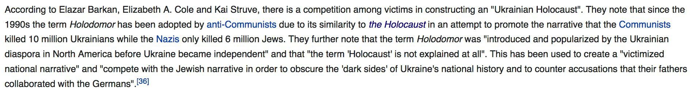

Robert Conquest, para escrever seu livro, teve como ajudante James Mace que, assim como  Nicolas Werth (organizador do "Livro negro do comunismo”), adotaram um método estatístico cientificamente falho criado por Dushnyck para "medir" a quantidade de mortos na fome de 1931-32. O método de Dushnyck pode ser avaliado pelo seguinte trecho de seu livro:
>Tomando os dados do censo de 1926 e os do censo de 1939 e a média de aumento [da população] antes da coletivização (2.36% ao ano), podemos calcular que a Ucrânia perdeu 7 milhões e 500 mil pessoas entre os dois censos.

Logo, ele conclui, aleatóriamente, que esses seriam os mortos de fome entre 1932 e 1933. Não tem provas, apenas convicções. O método de Dushnyck tem outras falhas:
1) Ignora que uma parte da população que no censo de 1926 era classificada como ucraniana – cerca de 2 a 3 milhões de cossacos – foi, no censo de 1939, reclassificada como russa, pela simples razão de que viviam da Rússia e não na Ucrânia.
2) Pressupõe que, entre 1926 e 1939 ninguém morreu de outra causa que não a fome, como frio, pneumonia, velhice, etc.
3) Ignora que na URSS e outros países, durante esse período, ocorreram duas grandes epidemias tifo (200.000 casos) e malária (6 milhões de casos), ambas sem tratamento conhecido na época, além de consumo de trigo infectada pela ferrugem conduzindo sintomas similares à fome, micotoxicose e a morte.
4) Pressupõe que o número de mulheres na idade reprodutiva e com vida sexual ativa tivesse se mantido inalterado no período.
5) Ignora as mortes na guerra e as quedas nas taxas de natalidade e fecundidade entre 1914 (início da I Guerra Mundial) e 1921 (fim da Guerra Civil).
6) Pressupõe que a taxa de natalidade permaneceu constante durante os 13 anos em que a URSS passou por uma extraordinária transformação, com industrialização pesada sendo realizada, a reforma agrária por meio da coletivização da agricultura além da preparação da defesa do país para a guerra, passos indispensáveis para a construção do socialismo.

Ou seja, pelo método de Dushnyck, adotado por outros autores como Robert Conquest e Nicolas Werth, a transformação da União Soviética, de país agrário a potencia industrial, bem com a passagem pela Guerra Civil (1918-1921) e pela Segunda Guerra Mundial (1939-1945) não teriam afetado a taxa de natalidade. Em consequência dessa falha metodológica pessoas que nunca nasceram foram considerados mortas em genocídio que nunca se provou. Pois a taxa de natalidade, evidentemente, caiu entre 1926 e 1939 – e caiu significativamente. Segundo Dushynck e os seguidores de seu método, teriam morrido 10 milhões de pessoas na fome de 1931-1932. Todavia, Rússia, Ucrânia e muitos países do mundo, até meados do século XX, quando se consolidou a chamada "Revolução Verde", enfrentavam crises periódicas de fome.

Entre 1891 e 1892, no Império Russo, governado pelo czarismo, a fome matou entre 13 e 35 milhões de pessoas, em decorrência, além das técnicas precárias de cultivo, do rigoroso inverno no qual as temperaturas chegaram a -31º C.

[Alexander Dallin](https://creees.stanford.edu/events/alexander-dallin-lecture-russian-east-european-and-eurasian-affairs), da Universidade de Stanford, escreve:
>Não há provas de que foi intencionalmente dirigido contra os ucranianos... isso estaria totalmente em desacordo com o que sabemos - não faz sentido.

[Moshe Lewin](https://www.upenn.edu/emeritus/memoriam/Lewin.html), da Universidade da Pensilvânia, declarou:
>Isso é uma porcaria, uma besteira... Eu sou um anti-Stalinista, mas não vejo como essa campanha [genocídio] acrescenta ao nosso conhecimento. É adicionar horrores, adicionar horrores, até que se torne uma patologia.

[Lynne Viola](https://history.utoronto.ca/people/lynne-viola), da Universidade de Toronto, escreve:
>Eu o rejeito absolutamente... Por que, em nome de Deus, esse governo paranóico conscientemente produziria uma fome quando eles estavam apavorados com a guerra [com a Alemanha]?

[Mark Tauger](https://history.wvu.edu/faculty-and-staff/faculty/mark-b-tauger), professor de história da West Virginia University (revisando o trabalho de [Stephen Wheatcroft](https://pursuit.unimelb.edu.au/individuals/professor-stephen-wheatcroft) e [R.W. Davies](https://www.birmingham.ac.uk/staff/profiles/gov/davies-bob.aspx)) tem a dizer:
>A mídia popular e a maioria dos historiadores por décadas descreveram a grande fome que atingiu a maior parte da URSS no início dos anos 1930 como "causada pelo homem", muitas vezes até mesmo um "genocídio" que Stalin perpetrou intencionalmente contra os ucranianos e às vezes outros grupos nacionais para destruí-los como nações... Essa perspectiva, entretanto, está errada. A fome que ocorreu não se limitou à Ucrânia ou mesmo às áreas rurais da URSS, não foi fundamentalmente ou exclusivamente causada pelo homem e estava longe da intenção de Stalin e outros na liderança soviética criar um desastre. Uma pequena mas crescente literatura baseada em novos documentos de arquivo e uma abordagem crítica de outras fontes mostrou as falhas na interpretação “genocídio” ou “intencionalista” da fome e desenvolveu uma interpretação alternativa.

Pesquisas mais recentes descobriram causas naturais para a fome na Ucrânia. Notas de Tauger:
>...a URSS experimentou um desastre ambiental incomum em 1932: clima extremamente úmido que deu origem a graves infestações de doenças de plantas, especialmente ferrugem. A Ucrânia teve o dobro ou o triplo das chuvas normais em 1932. Tanto as condições climáticas quanto a ferrugem se espalharam do Leste Europeu, como documentaram os fitopatologistas da época. Patologistas de plantas soviéticos, em particular, estimaram que a ferrugem e outras doenças fúngicas reduziram a colheita potencial em 1932 em quase nove milhões de toneladas, que é a maior perda de colheita documentada por qualquer causa na história soviética.

Anna Louise Strong diz:
>PERGUNTA: É verdade que durante 1932-33 vários milhões de pessoas morreram de fome na Ucrânia e no Norte do Cáucaso porque eram politicamente hostis aos soviéticos?
>
>RESPOSTA: Não é verdade. Visitei vários lugares nessas regiões durante esse período. Houve uma séria escassez de grãos na safra de 1932 devido principalmente às ineficiências do período organizacional da nova agricultura mecanizada em grande escala entre os camponeses não acostumados com as máquinas. A isso foi adicionada a sabotagem por kulaks despossuídos, a saída das fazendas por 11 milhões de trabalhadores que foram para novas indústrias, o efeito cumulativo da crise mundial em deprimir o valor das exportações agrícolas soviéticas e uma seca em cinco regiões de grãos básicos em 1931 .
>
>A colheita de 1932 foi melhor do que a de 1931, mas não foi toda colhida; por conta de promessas superotimistas dos distritos rurais, Moscou descobriu a situação real apenas em dezembro, quando uma quantidade considerável de grãos estava sob a neve.

Não foi um genocídio:
- A maioria dos administradores governamentais da URSS eram Ucrânianos étnicos.
- Ucrânia era uma área multiétnica.
- O governo soviético deu um total de 13.000.000 para os cuidados de saúde e sistemas sociais Ucranianos entre 1929 e 1934.

Em 1987, Hans Blumenfeld ressalta:
>em 1920, quando a NEP foi implementada e a União Soviética passou do comunismo de guerra para um estágio temporário onde existia um mercado livre, as temidas consequências do mercado tornaram-se evidentes. Apesar da reforma agrária anterior, quase 3 milhões de camponeses, rapidamente ficaram novamente sem terra, porque os kulaks os levaram à falência e compraram suas terras por um preço baixo. Isso resultou em 10 ou 11% da população (kulaks) possuindo tanta terra e também cavalos e maquinários em comparação com o resto da população camponesa que eles produziram 56% dos alimentos comercializados. Em grande parte, os kulaks decidiriam se as cidades receberiam alimentos ou não. A especulação de Kulak no mercado de alimentos causou uma escassez já em 1927, quando a parcela de grãos comercializada era de apenas um terço dos anos anteriores à guerra, embora a produção tivesse excedido os números anteriores à guerra. Essa ineficácia foi o que deu início à ideia de coletivização, com Lenin escrevendo a ideia básica antes de sua morte e Stalin elaborando os planos e implementando-os. Entre as muitas ações do programa de coletivização estava o confisco de terras agrícolas e das máquinas e animais que estavam sobre elas (propriedade privada, NÃO propriedade pessoal). No entanto, houve alguns problemas;
>
>“A coletivização não foi um processo ordenado, seguindo regras burocráticas. Consistia em ações dos camponeses pobres, incentivados pelo Partido. Os camponeses pobres estavam ansiosos para expropriar os “kulaks”, mas menos ansiosos para organizar uma economia cooperativa. Em 1930 o Partido já havia enviado quadros para conter e corrigir os excessos ... Depois de ter exercido a contenção em 1930, o Partido voltou a se movimentar em 1932. Como resultado, naquele ano a economia kulak deixou de produzir, e o novo coletivo economia ainda não produzia totalmente.

Neste período, houve o dilúvio do rio Volga, incêndios florestais, seca e os administradores da RSSC e a RSSU não denunciaram o mal gerenciamento dos bens coletivos na época, o que complicou a reação do governo central, então eles continuaram exportando normalmente a quantidade de colheitas.

O governo do Stalin reagiu:
- Investindo nos sistemas de saúde afetados;
- Importando e distribuindo colheitas;
- Desenvolvendo e melhorando o sistema Sovkhoz.

Em The Stalin Era, Anna comenta sobre o fim da fome:
>A conquista do pão foi alcançada naquele verão, uma vitória arrebatada de um grande desastre. A safra de 1933 superou a de 1930, que até então detinha o recorde. Desta vez, o novo recorde não foi feito por uma explosão de semi-organizados entusiasmo, mas por eficiência crescente e organização permanente... Esta cooperação nacional venceu a seca de 1934, garantindo uma safra total para a URSS igual ao máximo de todos os tempos de 1933.

>O Bureau Político acredita que a escassez de grãos na Ucrânia é muitas vezes pior do que o que foi descrito no telegrama do camarada Kosior; portanto, o Bureau Político recomenda que o Comitê Central do Partido Comunista da Ucrânia tome todas as medidas ao seu alcance para evitar a ameaça de não semear [safras] na Ucrânia.
>
><cite>Assinado: Secretário do Comitê Central - J. STALIN Do Arquivo do Presidente da Federação Russa. Fond 3, Record Series 40, File 80, Page 58.</cite>

Deve-se notar que isso não isenta o Estado soviético de toda e qualquer responsabilidade pelo sofrimento ocorrido; pode-se acusar o governo de resposta insuficientemente rápida e observar que os relatórios iniciais costumam ser minimizados para evitar balançar o barco. Mas está claro que a fome não foi deliberada, não foi um genocídio e (para citar Tauger) "não foi fundamentalmente ou exclusivamente causada pelo homem".

Fontes:
- [A “grande fome” na Ucrânia (Holodomor): um dos maiores mitos do século XX](https://andrezasantana-11112.medium.com/a-grande-fome-na-ucr%C3%A2nia-holodomor-um-dos-maiores-mitos-do-s%C3%A9culo-xx-22b1be62d6b6)
- [What about Stalin, the purges, the holodomor, etc? A revleft podcast.](https://revolutionaryleftradio.libsyn.com/joseph-mother-fucking-stain)
- [Fraud, Famine and Fascism by Doug Tottle](http://rationalrevolution.net/special/library/tottlefraud.pdf)
- [The 1932 Harvest and the Famine of 1933 by Mark Tauger](https://drive.google.com/file/d/0B-eTgjCs2lzpQllPVzQ2UFd3aWM/view?usp=sharing)
- [Natural Disaster and Human Actions in the Soviet Famine of 1931-1933 by Mark Tauger](https://drive.google.com/file/d/0B-eTgjCs2lzpNExnSEVhMjBLRlE/view?usp=sharing)
- [The Years of Hunger: Soviet Agriculture, 1931-1933 by Davies and Wheatcroft](http://gen.lib.rus.ec/book/index.php?md5=32DAA2871728468189A57E0233492A3A)
- [Lies concerning the History of the Soviet Union by Mario Sousa](http://www.mariosousa.se/LiesconcerningthehistoryoftheSovietUnion.html)
- [The Soviet famine of 1932-1933 reconsidered](http://www.tandfonline.com/doi/abs/10.1080/09668130801999912)
- [Archive of writings of Professor Mark Tauger on the famine scourges of the early years of the Soviet Union](https://www.newcoldwar.org/archive-of-writings-of-professor-mark-tauger-on-the-famine-scourges-of-the-early-years-of-the-soviet-union/)
- [Blood Lies by Grover Furr](http://www.readmarxeveryday.ml/bloodlies/index.html)
- [Pages 95-111 of Another View of Stalin by Ludo Martens - Collectivization and the ‘Ukrainian Holocaust’](https://stalinsocietypk.files.wordpress.com/2013/05/another-view-of-stalin1.pdf)
- [J Arch Getty reviews “Harvest of Sorrow”](https://www.lrb.co.uk/v09/n02/j-arch-getty/starving-the-ukraine)
- [Mark Tauger reviews The Years of Hunger by Davies and Wheatcroft](https://eh.net/book_reviews/the-years-of-hunger-soviet-agriculture-1931-1933/)
- [Stop spreading Nazi propaganda: on Holodomor](https://socialistmlmusings.wordpress.com/2017/02/15/stop-spreading-nazi-propaganda/)
- [The Holodomor Hoax: Joseph Stalin’s crime that never took place](http://www.greanvillepost.com/2015/08/10/the-holodomor-hoax-joseph-stalins-crime-that-never-took-place/)
- [Real Stalin series: famine of 1932](https://espressostalinist.com/the-real-stalin-series/famine-of-1932/)
- [In search of a Soviet Holocaust: A 55 year old famine feeds the Right](https://msuweb.montclair.edu/~furrg/vv.html)
- [The Ukrainian famine: only evidence can disclose the truth](https://www.counterpunch.org/2017/03/31/the-ukrainian-famine-only-evidence-can-disclose-the-truth/)
- [The “Holodomor” and the film “Bitter Harvest” are Fascist lies](https://www.counterpunch.org/2017/03/03/the-holodomor-and-the-film-bitter-harvest-are-fascist-lies/)
- [Holodomor Hoax: the anatomy of a lie invented by West’s propaganda machine](https://sputniknews.com/politics/201510191028730561-holodomor-hoax-invented-hitler-west)
- [The famine of 1932-33 in Ukraine the eyes of historians, the language of documents](http://www.archives.gov.ua/Sections/Famine/Publicat/Fam-Pyrig-1932.php)
- [How many people did Joseph Stalin really kill?](https://anti-imperialism.org/2016/02/16/how-many-people-did-joseph-stalin-really-kill/)
- [Evidence that Stalin was unaware of conditions in the Ukraine and tried to relieve the situation when he was informed](http://www.stalinsociety.org/2015/10/03/fighting-the-holodomor-myth-archival-evidence-that-stalin-was-unaware-of-conditions-in-the-ukraine-and-tried-to-relieve-the-situation-when-he-was-informed/)
- [Why the Holodomor narrative is wrong](https://www.youtube.com/watch?v=mUEi7v2TMpQ)
- [Holodomor series - part 1 - fraudulent photos](https://www.youtube.com/watch?v=QzXFXdOz_8Q)
- [Food shortages and problems in the USSR](https://www.youtube.com/watch?v=NUO7_SiJCpw)
- [Did Stalin continue to export grain as Ukraine starved?](https://youtu.be/SMBJ_nQ4sTA)
- [Famines are always because of Communism](https://i.redd.it/j22mvokwzo1z.jpg)
- [Soviet Agriculture, 1977](https://archive.org/details/SovietAgricultureMorozov)

Também recomendo a leitura dos livros **Stalin: um novo olhar** de Ludo Martens, **Stalin: a história crítica de uma lenda negra** de Domenico Losurdo e **Um Stalin desconhecido** pela família Medvedev (que é liberal e anti-stalin, mas rejeita a narrativa mitíca que se tem sobre Stalin). Também recomendo o prof. Mark Tauger é um dos pesquisadores mais respeitados do mundo no tema história da agricultura soviética,  prof. Annie Lacroix-Riz, acadêmica da universidade Paris VII - Denis Diderot, que defende ser o "holodomor" um cavalo de batalha anticomunista.

#### Antissemitismo
Em primeiro lugar, todas as nacionalidades sob Stalin tinham direitos iguais, não importando a raça que pertenciam. Isso pode ser visto no Artigo 123 da Constituição Soviética de 1936. Afirma que:
>A igualdade de direitos dos cidadãos da URSS, independentemente de sua nacionalidade ou raça, em todas as esferas da vida econômica, estatal, cultural, social e política, é uma lei indestrutível. Qualquer restrição direta ou indireta dos direitos de, ou, inversamente, qualquer estabelecimento de privilégios diretos ou indiretos para os cidadãos em razão de sua raça ou nacionalidade, bem como qualquer defesa de exclusividade racial ou nacional ou ódio e desprezo, é punível por lei.

Esta lei não exclui a população judaica, já que o próprio Stalin disse isso sobre o anti-semitismo respondendo a um pedido da Agência Telegráfica Judaica da América:
>O anti-semitismo, como uma forma extrema de chauvinismo racial, é a mais perigosa remanescência do canibalismo. Na URSS, o anti-semitismo é estritamente perseguido por lei como um fenômeno profundamente hostil ao sistema soviético. Os anti-semitas ativos são punidos pelas leis da URSS.

Sob Stalin, toda a população soviética era capaz de ler e escrever, ou seja, alfabetizou-se. O império russo tinha uma taxa de alfabetização de 21% (1897), enquanto sob Stalin, 100% da população era totalmente alfabetizada em 1950, independentemente da raça ou sexo.

A política de Korenizatsiya começou em 1913, mas o efeito total disso foi sob o camarada Stalin. Stalin afirma que o chauvinismo russo é um grande perigo para a União Soviética e insiste na criação do Soviete das Nacionalidades, que se tornou uma das 2 câmaras do Soviete Supremo. Conforme declarado no artigo 37 da constituição soviética de 1936:
>Ambas as Câmaras do Soviete Supremo da União das Repúblicas Socialistas Soviéticas, o Soviete da União e o Soviete das Nacionalidades, têm direitos iguais.

Enquanto:
>O Soviete das Nacionalidades é eleito pelos cidadãos da URSS de acordo com a União e Repúblicas Autônomas, Regiões Autônomas e áreas nacionais com base em vinte e cinco deputados de cada República da União, onze deputados de cada República Autônoma, cinco deputados de cada Região Autônoma e um deputado de cada área nacional.

Nos termos do artigo 35 da Constituição Soviética. Isso mostra que os russos não étnicos desempenharam um grande papel na URSS e na criação de leis, políticas e na eleição de altos funcionários.

No entanto, para descobrir o quanto Stalin era um “nacionalista russo do mal”, devemos olhar para o número de pessoas enviadas aos gulags. Portanto, ao todo, em 1939, havia 810 mil russos nos gulags. Além disso, a população russa em 1939 era de 108.377.000, portanto, podemos ver que 0,75% da população russa estava em gulags (prisões). Agora, vamos examinar os outros grupos étnicos, como ucranianos e cazaques. A população ucraniana em 1939 era de 33.425.000, enquanto o número deles nas gulags era de 182.536, ou seja, 0,55% da população. A população do Cazaquistão era de 6.081.000, enquanto o número de gulags era de 17.333, ou seja, 0.28% da população. Assim, podemos dizer que mais russos estavam em gulags em comparação com outros grupos étnicos durante a época de Stalin.

Podemos aplicar o mesmo aos judeus (Stalin até ajudou a criar Israel), alguns dos amigos mais próximos de Stalin eram judeus como - Lazar Kaganovich, enquanto muitos judeus soviéticos famosos receberam o "Prêmio Estatal de Stalin". Isso inclui:
- Sergei Eisenstein
- Yuli Raizman
- Mikhail Romm

Portanto, no geral, podemos dizer que Stalin era de fato um verdadeiro comunista soviético e não era um nacionalista russo e não odiava o povo judeu.

#### Pessoas inocentes fuziladas por crimes pequenos
Para desmascarar esses mitos, usarei artigos do Código Penal da RSFSR 1926 (algumas edições de 1956).

>Mas a minha avó roubou pão e foi condenada perpétua no Gulag.

Este é o tipo de declaração que um capitalista ou anti-stalinista faz. No entanto, se olharmos para o Código Penal, ele afirma:
>Para combater os crimes mais graves que ameaçam as fundações do poder soviético e do sistema soviético, até que o Comitê Executivo Central da União da República Socialista Soviética cancele, nos casos especialmente indicados nos artigos deste Código, a execução é utilizada como medida excepcional para proteger o estado dos trabalhadores
>
> Artigo 21.º do Código Penal da RSFSR

>Uma criança roubou alguma coisa, mas foi condenada à morte mesmo assim, porque Stalin e a URSS são maus.

Outra declaração falsa que ouvi muitas vezes. Em contrapartida, afirmo sempre que:
>Os menores de dezoito anos à data do crime e as mulheres grávidas não podem ser condenadas à morte
>
> Artigo 22.º do Código Penal da RSFSR

Estes são os únicos crimes sob os quais um tribunal pode condená-lo à morte (crimes contra-revolucionários):
1. Trair a pátria-mãe, ou seja, aqueles que - ameaçam a independência do Estado ou a inviolabilidade do seu território, tais como espionagem, emissão de segredos militares ou de Estado, passagem para o lado do inimigo, fuga ou fuga para o estrangeiro. Artigo 58, parágrafo 1a, do Código Penal da RSFSR.
2. Qualquer tipo de levante armado ou invasão de fins contra-revolucionários no território soviético por gangues armadas, tomando o poder no centro ou no terreno para os mesmos fins e, em particular, com o objetivo de arrancar à força qualquer parte de seu território a URSS e uma república sindical separada ou a rescisão dos prisioneiros da União SSR com tratados de estados estrangeiros. Artigo 58, parágrafo 2, do Código Penal da RSFSR.
3. Prestar assistência à burguesia internacional em qualquer forma ou formato. Artigo 58, parágrafo 4
4. Espiar, isto é, transferir, abduzir ou coletar informações ultrassecretas (contadas como secretas) com o objetivo de entregá-las a organizações contra-revolucionárias ou indivíduos privados. Artigo 58 parágrafo 6 do Código Penal da RSFSR.
5. Sabotagem contra-revolucionária, ou seja, o não cumprimento deliberado de certos deveres ou seu desempenho deliberado e descuidado com o propósito especial de enfraquecer o poder do governo e as atividades do aparelho de estado. Artigo 58, parágrafo 14, do Código Penal da RSFSR.

Estes são os únicos crimes em que um tribunal pode condená-lo à morte (crimes perigosos):
1. Motins em massa, acompanhados de pogroms, a destruição de ferrovias ou outros meios de comunicações, assassinatos e outras ações semelhantes. Artigo 59 parágrafo 2 do Código Penal da RSFSR.
2. Atividade criminosa, ou seja, a organização de gangues armadas e sua participação nos ataques organizados a instituições soviéticas e pessoais ou a cidadãos individuais, paradas de trens e destruição de ferrovias e outros meios de comunicação e centros de comunicação. Art 59 parágrafo 3 do Código Penal da RSFSR.
3. Roubo de armas, peças de armas e munições. Art 59 parágrafo 3a do Código Penal da RSFSR.
4. Propaganda ou agitação destinada a incitar o ódio ou ódio étnico ou religioso, bem como a distribuição ou produção e armazenamento de literatura da mesma natureza. Art 59 parágrafo 7 do Código Penal da RSFSR.
5. Falsificação ou venda de moedas metálicas falsificadas, bilhetes do estado, bilhetes do Banco do Estado da URSS, papéis do governo, bem como falsificação ou venda de moeda estrangeira falsificada. Aer 59 parágrafo 8 do Código Penal da RSFSR.
6. Contrabando de qualquer forma. Art 59 parágrafo 9 do Código Penal da RSFSR


Este é o único crime em que um tribunal pode condená-lo à morte (indivíduos):
1. Matar outro indivíduo intencionalmente. Art. 136 do Código Penal da RSFSR

Tenham em mente que se você infringir alguma dessas leis, o tribunal decide se vocês seriam ou não condenados à morte. No entanto, em algumas circunstâncias (o tribunal decide), você poderia ser mandado para a prisão em vez de ser baleado, de 3 meses a 10 anos (o que não era raro). Assim, podemos concluir que a URSS de Stalin não atirou em pessoas aleatoriamente sem motivo, pois os tribunais precisavam de legislação adequada para poder condenar pessoas à morte, nem atirou em pessoas por crimes menores. As sentenças de morte seriam aplicadas aos crimes mais severos contra o Estado e a classe trabalhadora.

#### Líder não-democrático
Em primeiro lugar, Stalin não foi um psicoditador que subiu ao poder por causa de sua violência, ele subiu para seus cargos importantes por meio de eleições. Se você der uma olhada no capítulo 3, artigos 30-34 da [Constituição Soviética de 1936](https://www.marxists.org/reference/archive/stalin/works/1936/12/05.htm), verá que o Soviete Supremo age de forma semelhante a um Parlamento, como nas democracias parlamentares de o Reino Unido e a Holanda, onde o povo não elege diretamente o primeiro-ministro, mas sim vota para o Parlamento e o Parlamento elege um primeiro-ministro, adota novas leis, etc. Os soviéticos fizeram exatamente isso, mas com delegados, “O Soviete da União é eleita pelos cidadãos da URSS de acordo com as áreas eleitorais na base de um deputado para cada 300.000 habitantes”. A legislação (art. 39-40 da constituição de 1936), políticas e diferentes posições no partido (art. 48 da constituição de 1936) também são escolhidos pelo Soviete Supremo por voto popular. Assim, podemos concluir que a URSS de Stalin não foi uma ditadura autoritária desagradável, já que ele havia entrado em confronto com os órgãos às vezes e foi derrotado tanto pelo Politburo quanto pelo Soviete Supremo.

#### As gulags
Toda a retórica que se vê hoje sobre gulags partem do livro de caráter sensacionalista, beirando a ficção, "Arquipélago Gulag", mas ok, vamos aos fatos:
1. Gulag era um nome de sistema prisional
2. Gulags não foram feitas por Lenin ou Stalin, e sim pelo czar
3. A grande maioria das pessoas no Gulag eram criminosos condenados, não prisioneiros políticos
4. Os presos políticos incluíam conspiradores contra o governo. Houveram conspirações contra o governo por trotskistas, direitistas e muitos oficiais militares.
5. A maior parte das pessoas que entraram na gulag, saíram vivas
6. O relato de Solzhenitsyn sobre o Gulag foi altamente ficcional. O estado real do Gulag dependia do nível de segurança envolvido, da gravidade da ofensa, da turma de trabalho e, em muitos casos, da personalidade dos funcionários da prisão. Isso é típico da vida na prisão em qualquer lugar. Alguns guardas são sádicos, outros não.
7. Apenas uma pequena porcentagem da população soviética estava na Gulag.
8. Os prisioneiros eram pagos. Recompensas e bônus dados por trabalho duro.

Com isso, podemos fazer a síntese de que era um sistema totalmente complexo, e nenhuma gulag era igual à outra, elas eram diferentes com bases nas necessidades e realidades materiais de cada região. Recomendo os escritos sobre as gulags de Stalin, são bem complexas -- melhor que a proposta de Trotsky que até hoje quem lê entende umas 5 coisas diferentes, não cumpria com as demandas e realidade soviética e por isso não foi escolhida pelo povo.

Na década de 50, a CIA analisou todo o caso das gulags secretamente e concluiu que:
1. Até 1952, os presos recebiam comida em quantidade garantida, além de comida extra pelo cumprimento excessivo das cotas
2. De 1952 em diante, o sistema Gulag operou com "responsabilidade econômica" de forma que quanto mais os prisioneiros trabalhavam, mais eles eram pagos.
3. Cumprindo as normas em 105%, um dia de sentença era contado como dois, reduzindo assim o tempo gasto no Gulag em um dia a cada dia.
4. Além disso, por causa da reconstrução socialista pós-guerra, o governo soviético tinha mais fundos e então aumentou o suprimento de comida dos prisioneiros.
5. Até 1954, os presos trabalhavam 10 horas por dia, enquanto os trabalhadores 8 horas por dia. De 1954 em diante, tanto prisioneiros quanto trabalhadores trabalhavam 8 horas por dia.
6. Um estudo da CIA de um campo de amostragem mostrou que 95% dos prisioneiros eram criminosos tradicionais.
7. Em 1953, a anistia foi concedida a 70% dos "criminosos comuns" de um campo de amostragem estudado pela CIA. Nos 3 meses seguintes, a maioria deles foi presa novamente por cometer novos crimes.

Paper da CIA: https://www.cia.gov/readingroom/docs/CIA-RDP80T00246A032000400001-1.pdf

O trabalho, no entanto, realmente era forçado, mas era remunerado. Pagos a partir de 1952 e pagos com mais comida antes de 1952. De acordo com as fantasias burguesas, o “regime” soviético procurou deliberadamente matar de fome as populações do Gulag. No entanto, na verdade, houve esforços soviéticos para aumentar o suprimento de alimentos dos prisioneiros, após a Segunda Guerra Mundial.

Em Triumph of Evil, p. 77-78:
>Como os mitos de milhões de execuções, os contos de fadas de que Stalin fez com que dezenas de milhões de pessoas fossem presas e permanentemente lançadas em prisões ou campos de trabalho forçados para morrer no intervalo 1930-1953 (Conquest, 1990) parecem ser falsos. Em particular, os arquivos soviéticos indicam que o número de pessoas em prisões, gulags e campos de trabalho soviéticos nas décadas de 1930, 1940 e 1950 era em média de 2 milhões, dos quais 20-40% eram libertados a cada ano, (Getty, Rittersporn, e Zemskov, 1993). Essa média, que inclui anos desesperadores da Segunda Guerra Mundial, é semelhante ao número de presos nos Estados Unidos na década de 1990 (Catalinotto, 1998a) e é apenas ligeiramente maior como porcentagem da população. Deve-se notar também que a taxa anual de mortalidade da população soviética internada era de cerca de 4%, o que incorpora o efeito das execuções de prisioneiros (Getty, Rittersporn e Zemskov, 1993). Excluindo os desesperados anos da Segunda Guerra Mundial, a taxa de mortalidade nas prisões, gulags e campos de trabalho soviéticos era de apenas 2,5% (Getty, Ritterspom e Zemskov, 1993), que é ainda inferior à média dos cidadãos "livres" capitalistas Rússia sob o czar em tempo de paz em 1913 (Wheatcroft, 1993). Esta descoberta não é muito surpreendente, dado que cerca de 1/3 das pessoas confinadas nem sequer eram obrigadas a trabalhar (Bacon, 1994), e dado que a semana de trabalho máxima era de 84 horas, mesmo nos campos de trabalho soviéticos mais difíceis durante o período mais desesperador anos de guerra (Rummel, 1990). A última semana de trabalho máxima (e incomum) na verdade se compara favoravelmente às semanas de trabalho de 100 horas que existiam mesmo para crianças "gratuitas" de 6 anos durante o tempo de paz na revolução industrial capitalista (Marx e Engels, 1988b), embora possa parecer alto em comparação com a jornada de 7 horas trabalhada pelo típico cidadão soviético sob Stalin (Davies, 1997). Além disso, também deve ser mencionado que a maioria das prisões sob Stalin foram motivadas por uma tentativa de erradicar crimes civis como banditismo, roubo, uso indevido de cargo público para ganho pessoal, contrabando e estelionatos, com menos de 10% de as prisões durante o governo de Stalin foram por motivos políticos ou questões de polícia secreta (Getty, Ritterspom e Zemskov, 1993). Os arquivos soviéticos revelam muito mais dissidência política permitida na União Soviética de Stalin (incluindo uma quantidade generalizada de críticas às políticas governamentais individuais e aos líderes locais) do que normalmente se percebe no Ocidente (Davies, 1997). Dado que a polícia regular, a polícia política ou secreta, os guardas prisionais, algumas tropas da guarda nacional e os bombeiros (que estavam no mesmo ministério da polícia) representavam apenas 0,2% da população soviética sob Stalin (Thurston, 1996), grave a repressão teria sido impossível mesmo se a União Soviética quisesse exercê-la. Em comparação, os EUA hoje têm muitas vezes mais policiais como porcentagem da população (cerca de 1%, sem mencionar guardas prisionais, tropas da guarda nacional e bombeiros incluídos nos números usados ​​para calcular a proporção muito menor de 0,2% para os soviéticos União).

Também:
>Comecemos com a questão da natureza do sistema penal soviético. Depois de 1930, o sistema penal soviético incluiu prisões, campos de trabalho, as colônias de trabalho do gulag, zonas abertas especiais e obrigação de pagar multas. Quem quer que fosse detido em prisão preventiva era geralmente enviado para uma prisão normal enquanto ocorriam as investigações para estabelecer se ele era inocente e, portanto, poderia ser posto em liberdade ou se deveria ir a julgamento. Um acusado em julgamento pode ser considerado inocente (e posto em liberdade) ou culpado. Se for considerado culpado, ele poderá ser condenado a pagar multa, pena de prisão ou, o que é mais incomum, ser executado. Uma multa pode ser uma determinada porcentagem de seu salário por um determinado período de tempo. Os condenados a penas de prisão podem ser colocados em diferentes tipos de prisão, dependendo do tipo de crime envolvido.
>
>Para os campos de trabalho do gulag foram enviados aqueles que cometeram crimes graves (homicídio, roubo, estupro, crimes econômicos, etc.), bem como uma grande proporção dos condenados por atividades contra-revolucionárias. Outros criminosos condenados a penas superiores a 3 anos também podem ser enviados para campos de trabalho forçado. Depois de passar algum tempo em um campo de trabalhos forçados, um prisioneiro pode ser movido para uma colônia de trabalho ou para uma zona aberta especial.
>
>Os campos de trabalho eram áreas muito grandes onde os prisioneiros viviam e trabalhavam sob estreita supervisão. Para eles, trabalhar e não ser um fardo para a sociedade era obviamente necessário. Nenhuma pessoa saudável sobreviveu sem trabalhar. É possível que hoje em dia as pessoas pensem que isso foi uma coisa terrível, mas é assim que as coisas são. O número de campos de trabalhos forçados existentes em 1940 era de 53.
>
>Havia 425 colônias de trabalho de gulag. Essas unidades eram muito menores do que os campos de trabalho, com um regime mais livre e menos supervisão. Para eles, foram enviados prisioneiros com penas de prisão mais curtas - pessoas que cometeram crimes menos graves ou crimes políticos. Trabalhavam em liberdade nas fábricas ou no campo e faziam parte da sociedade civil. Na maioria dos casos, todo o salário que recebia com seu trabalho pertencia ao prisioneiro, que, a esse respeito, era tratado da mesma forma que qualquer outro trabalhador.
>
>As zonas abertas especiais eram geralmente áreas agrícolas para aqueles que haviam sido exilados, como os kulaks que foram expropriados durante a coletivização. Outras pessoas consideradas culpadas de delitos criminais ou políticos menores também podem cumprir suas penas nessas áreas.

Fontes:
- [Another View of Stalin (section on the Gulag)](https://stalinsocietypk.files.wordpress.com/2013/05/another-view-of-stalin1.pdf)
- [Solzhenitsyn's Archipelago of Lies (1974 scanned book)](https://archive.org/details/ArchipelagoOfLies)
- [The Soviet Union had a progressive penal system](https://espressostalinist.com/the-real-stalin-series/gulag/)
- [Re-education?](http://moufawad-paul.blogspot.com/2012/03/re-education.html)
- [Lies concerning the history of the Soviet Union](http://www.northstarcompass.org/nsc9912/lies.htm)
- [The Gulag archipelago shouldn’t be taken seriously](https://mltheory.wordpress.com/2017/05/08/the-gulag-archipelago-shouldnt-be-taken-seriously/)
- [Original documents on the death rate of prisoners in the Gulag system 1930-1956](http://www.alexanderyakovlev.org/fond/issues-doc/1009320)
- [Victims of the Soviet Penal System in the Pre-War Years: a first approach on the basis of archival evidence (by J. Arch Getty, Gábor T. Rittersporn, Viktor N. Zemskov)](http://www.cercec.fr/materiaux/doc_membres/Gabor%20RITTERSPORN/Victims%20of%20the%20Gulag.pdf)
- [What were the chances to be sent to the Gulag?](http://www.northstarcompass.org/nsc0901/gulag.htm)

### Trabalhadores na União Soviética
Uma das alegações mais comuns levantadas contra a URSS (e os estados socialistas em geral) por anticomunistas de esquerda é que não era "socialismo real", porque os trabalhadores não tinham controle direto sobre a produção. Essa afirmação pode ser encontrada nos escritos de Noam Chomsky, Murray Bookchin, Alexander Berkman, Emma Goldman e vários outros esquerdistas anti-soviéticos. Alega-se que os ganhos indiscutíveis obtidos pela classe trabalhadora nos estados socialistas (como [grandes melhorias em sua saúde e bem-estar](https://journals.sagepub.com/doi/abs/10.2190/B2TP-3R5M-Q7UP-DUA2)) são irrelevantes, porque essas revoluções foram "burocráticas" e, portanto, ilegítimas.

#### Participação do trabalhador no local de trabalho
Ao discutir este tópico, é útil começar no nível do local de trabalho individual. O professor Robert Thurston (Miami University em Ohio) afirma que "nos níveis mais baixos da sociedade, nos assuntos do dia-a-dia e na implementação de políticas, [o sistema soviético] era participativo". Ele observa que os trabalhadores eram frequentemente incentivados a participar da tomada de decisões:
>O regime regularmente instava seu povo a criticar as condições locais e seus líderes, pelo menos abaixo de um certo nível exaltado. Por exemplo, em março de 1937, Stalin enfatizou a importância dos "laços do partido com as massas". Para mantê-los, era necessário "ouvir atentamente a voz das massas, a voz dos membros da base do partido, a voz dos chamados 'pequenos', a voz do povo comum".

Não eram palavras vazias ou propaganda barata; embora houvesse limites para as críticas, o professor Thurston observa que "tais limites permitiam muitas coisas que eram profundamente significativas para os trabalhadores, incluindo alguns aspectos das normas de produção, taxas e classificações salariais, segurança no trabalho, moradia e tratamento por parte dos administradores". Os trabalhadores tiveram voz em diversos órgãos oficiais e, em geral, tiveram suas demandas atendidas:
>O Comissariado da Justiça também ouviu e respondeu aos apelos dos trabalhadores. Em agosto de 1935, o promotor da cidade de Saratov relatou que de 118 casos relacionados a salários recentemente administrados por seu escritório, 90% ou 73,6%, haviam sido resolvidos em favor dos trabalhadores.

Os trabalhadores também participaram da supervisão direta dos gerentes:
>Os trabalhadores participaram às centenas de milhares em inspetorias especiais, comissões e brigadas que fiscalizavam o trabalho de gestores e instituições. Essas agências às vezes detinham um poder significativo.

Os direitos dos trabalhadores soviéticos foram frequentemente observados em relatos posteriores da era socialista:
>Um emigrado lembrou que sua madrasta, uma operária de fábrica, 'muitas vezes repreendia o patrão' e também reclamava das condições de vida, mas nunca foi presa. John Scott, um americano empregado por anos no final dos anos 1930 como soldador em Magnitogorsk, participou de uma reunião em uma fábrica de Moscou em 1940, onde os trabalhadores puderam 'criticar o diretor da fábrica, fazer sugestões sobre como aumentar a produção, aumentar a qualidade, e custos mais baixos.'

Esses fatos são ainda mais impressionantes quando lembramos o estado sombrio dos direitos dos trabalhadores nas nações capitalistas neste momento:
>Isso ocorreu em uma época em que os trabalhadores americanos, em particular, lutavam por um reconhecimento sindical básico, que mesmo quando conquistado não proporcionava muita influência formal no local de trabalho.

Thurston faz a seguinte observação:
>Longe de basear seu domínio nos meios negativos de coerção, o regime soviético no final dos anos 1930 promoveu um papel político limitado, mas positivo para a população... Conceitos anteriores do estado soviético requerem repensar: os trabalhadores que destituíram os administradores, alcançaram a prisão de seus alvos, e ganhou a reintegração nas fábricas o fez por meio de organizações que constituíam parte do aparelho de estado e exerciam poderes de estado.

Ele também observa que "não existia nenhuma divisão nítida entre o Estado e a sociedade", embora diferentes níveis do Estado exerçam diferentes poderes.

Em suma, embora a União Soviética tivesse elementos autoritários (como era inevitável dadas as condições; a URSS havia sido devastada pela guerra civil e invadida por várias nações capitalistas), havia também um forte elemento de controle dos trabalhadores, dando à URSS uma reivindicação legítima de ser um Estado operário.

#### Participação política na URSS
Os trabalhadores não tinham apenas o direito de participar na tomada de decisões no local de trabalho; eles também tinham voz nas decisões de política nacional. O professor [Kazuko Kawamoto](https://researchmap.jp/read0148263/?lang=english) (Universidade Hitotsubashi) afirma que a URSS tinha "uma face mais democrática do que normalmente se imagina, especialmente entre os ocidentais". Como eles dizem:
>O regime soviético era democrático em seu próprio sentido da palavra... a participação por meio do envio de cartas e da participação em discussões deu ao autogoverno uma certa realidade e ajudou a legitimar o regime soviético. Portanto, ouvir as pessoas era uma obrigação importante para as autoridades... o governo incentivou as pessoas a enviarem cartas às autoridades e usou ativamente as discussões de todas as pessoas.

Essas discussões de todas as pessoas existiam desde os primeiros dias da União Soviética e tinham grande significado (ao contrário das suposições dos estudiosos ocidentais):
>Embora a primeira discussão geral tenha sido conduzida com a aprovação da constituição de Stalin de 1936 com base no fato de que as antigas classes dominantes não existiam mais, a publicação e a discussão pública de projetos de lei eram comuns antes da constituição em nome da participação das massas. Os estudiosos ocidentais geralmente interpretam isso como uma tentativa de dar uma cara de legitimidade ao processo, entendendo as discussões como uma mera formalidade. No entanto, esse não é o caso dos Princípios aqui discutidos. As discussões não foram um disfarce nem uma mera formalidade.

Os legisladores participaram diretamente dessas reuniões, alterando os projetos de lei de acordo com a opinião popular. O professor Kawamoto afirma que “é importante ressaltar que os membros do subcomitê participaram ativamente da discussão, reescrevendo o rascunho ao mesmo tempo”.

Também se observou que os cidadãos soviéticos "acreditavam que tinham o direito de exigir mudanças nas políticas, e os redatores dos projetos, incluindo especialistas, funcionários e deputados, sentiram-se obrigados a responder a essas demandas". O processo de coleta de opinião pública foi intenso o suficiente para muitas vezes desacelerar o processo de legislação:
>Com relação ao processo de criação dos Princípios, a participação direta funcionou amplamente conforme o esperado na ideologia da democracia soviética, embora tenha demorado muitos anos.

Como diz o professor Kawamoto, "a razão pela qual demorou tanto estava profundamente enraizada nas idéias da democracia soviética". Compare isso com a democracia burguesa, onde os [legisladores normalmente desconsideram a opinião das massas](https://scholar.princeton.edu/sites/default/files/mgilens/files/gilens_and_page_2014_-testing_theories_of_american_politics.doc.pdf). Isso pode acelerar o processo legislativo, mas resulta em [níveis extremamente altos de descontentamento popular](https://www.washingtonpost.com/news/rampage/wp/2015/09/23/americans-have-grown-to-really-really-hate-their-government/).

Além dos meios de participação popular já mencionados, as autoridades soviéticas também viajaram por todo o país para reunir informações sobre a opinião popular. Usando o desenvolvimento da lei da família soviética como exemplo, o Professor Kawamoto afirma:
>Os fabricantes de rascunhos não eram apenas destinatários passivos de cartas, mas também viajavam por toda a União Soviética para ouvir o povo. Quando o trabalho nas Comissões de Propostas Legislativas estava chegando ao fim, membros da subcomissão e funcionários que trabalhavam para eles visitaram várias repúblicas sindicais de abril a junho de 1962 para pesquisar a prática do direito de família e coletar opiniões sobre normas importantes no projeto do Princípios... Depois dessas viagens de pesquisa, a comissão concluiu o esboço e o apresentou ao Comitê Central do Partido em julho.

Embora a democracia soviética tivesse suas falhas (como mencionado, o processo era frequentemente bastante lento e havia limites para a extensão das críticas), seria altamente impreciso descrever a URSS como uma sociedade "totalitária", sem estruturas democráticas; pelo contrário, a URSS praticava sua própria forma de democracia, e o fazia de maneira bastante eficaz.

### Conclusão sobre os trabalhadores na URSS

A União Soviética se desenvolveu sob condições de extrema pressão, enfrentando a invasão das potências capitalistas, a invasão nazista e a espionagem do Ocidente. Dadas as dificuldades que enfrentou, é notável que a URSS tenha conseguido desempenhar um papel político positivo para os trabalhadores, especialmente em um momento em que os trabalhadores do mundo capitalista ainda lutavam por direitos sindicais básicos.

A URSS era um Estado operário legítimo, no qual o proletariado detinha o poder no local de trabalho e exercia uma influência significativa nas decisões de política nacional. Compare isso com a total falta de influência popular nos estados burgueses, e isso é ainda mais fácil de avaliar.

Fontes:
- [University of Oxford | Farm to Factory: A Reassessment of the Soviet Industrial Revolution](https://citeseerx.ist.psu.edu/viewdoc/download?doi=10.1.1.507.8966&rep=rep1&type=pdf)
- [Williams College | Reassessing the Standard of Living in the Soviet Union: An Analysis Using Archival and Anthropometric Data](https://web.williams.edu/Economics/brainerd/papers/ussr_july08.pdf)
- [University of Warwick | Review of "Farm to Factory"](https://www.jstor.org/stable/25149595)
- [Oxford University Press | The Health Crisis in the USSR](https://academic.oup.com/ije/article/35/6/1384/660149)
- [University of Munich | Declining Life Expectancy in a Highly Developed Nation: Paradox or Statistical Artifact?](https://link.springer.com/chapter/10.1007%2F978-3-642-95874-8_22)
- [University of Melbourne | The Scale and Nature of German and Soviet Mass Killings and Repressions](http://sovietinfo.tripod.com/WCR-German_Soviet.pdf)
- [American Historical Review | Victims of the Soviet Penal System in the Pre-War Years](http://sovietinfo.tripod.com/GTY-Penal_System.pdf)
- [CIA (Freedom of Information Act) | Report on Soviet Gulags](https://www.cia.gov/readingroom/docs/CIA-RDP80T00246A032000400001-1.pdf)
- [CIA (Freedom of Information Act) | Report on Stalin](https://www.cia.gov/readingroom/docs/CIA-RDP80-00810A006000360009-0.pdf)
- [Yale University Press | Life and Terror in Stalin's Russia, 1934-1941](https://www.jstor.org/stable/j.ctt32bw0h)
- [Slavic Review (Cambridge University Press) | On Desk-Bound Parochialism, Commonsense Perspectives, and Lousy Evidence: A Response to Robert Conquest on the USSR](https://www.jstor.org/stable/2499177?seq=1#metadata_info_tab_contents)
- [Slavic Review | Fear and Belief in the USSR's "Great Terror": Response to Arrest, 1935-1939](https://www.cambridge.org/core/journals/slavic-review/article/fear-and-belief-in-the-ussrs-great-terror-response-to-arrest-19351939/748662F55C0CCEE8096BDA2BB2CCCEE0)
- [History News Network | Historian James Harris Says Russian Archives Show We've Misunderstood Stalin](https://historynewsnetwork.org/article/163498)
- [Village Voice | In Search of a Soviet Holocaust: A Fifty Year-Old Famine Feeds the Right](https://msuweb.montclair.edu/~furrg/vv.html)
- [EH Reviews | The Years of Hunger: Soviet Agriculture, 1931-1933](https://eh.net/book_reviews/the-years-of-hunger-soviet-agriculture-1931-1933/)
- [International Council for Central and East European Studies | Reassessing the History of Soviet Workers: Opportunities to Criticize and Participate in Decision-Making, 1935-1941](https://www.docdroid.net/t9gG4jQ/thurston-robert-reassessing-the-history-of-soviet-workers-opportunities-to-criticize-and-participate-in-decision-making.pdf)
- [Japanese Political Science Review | Rethinking Soviet Democracy](http://jpsa-web.org/eibun_zassi/data/pdf/JPSA_Kawamoto_final_July_9_2014.pdf)

### Conclusão sobre a URSS
Durante seu período socialista, a União Soviética fez algumas das conquistas mais impressionantes da história moderna. O sistema socialista transformou uma nação de camponeses analfabetos e famintos em uma superpotência, com uma das economias de crescimento mais rápido da Terra, uma das populações mais educadas e saudáveis do mundo e algumas das conquistas industriais e tecnológicas mais impressionantes até hoje. Forneceu um modelo a ser seguido pelos oprimidos do mundo, como foi mostrado na China, Cuba, Vietnã e muitas outras nações.

## Uma resposta ao bearkunin sobre a URSS
O @bearkunin no medium, escreveu um [artigo contestando conquistas soviéticas](https://medium.com/@bearkunin/soviet-union-facts-and-fictions-part-1-the-economy-2a79ff1013a7) detalhadas abaixo:

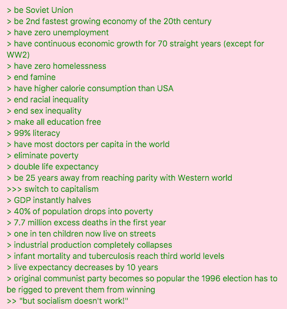

Primeiramente, o que eu tenho a dizer é que: Fiquem longe de posts como esses, parece argumento tirado do 4chan com tanta desinformação que há. Vou fazer um resumo dos argumentos centrais dele.

>2ª economia de crescimento mais rápido do século 20 (cresceu durante a Grande Depressão)
>
>**Errado**. Este argumento geralmente se refere a esta fonte, mas este enredo só se preocupa com o período de 1928 a 1970.

A razão pela qual desconsideramos os dados de 1970 em diante é porque, a essa altura, a URSS tinha basicamente revertido para uma economia capitalista. Em 1965, as reformas Kosygin descentralizaram e privatizaram a economia, o que coincidiu com a estagnação econômica.

>Se você considerar o período de 1928 a 1989, a Coréia do Sul, Japão, Taiwan, Portugal, Finlândia, Cingapura, Itália, Noruega e Tailândia cresceram mais rápido do que a URSS.

Todos esses países se beneficiaram com o financiamento dos EUA por meio do Plano Marshall. A Finlândia estava economicamente muito mais perto da URSS através do Tratado YYA do que do Ocidente. A Finlândia só mudou economicamente para um foco ocidental por volta de 1985, quando a EEC estava crescendo em importância econômica e o setor soviético estava começando a desmoronar.  É preciso lembrar que a economia da URSS foi afetada negativamente pelo isolamento, pelos danos da guerra e pelo financiamento de países socialistas em todo o mundo. Além disso, a URSS não se beneficiou da exploração imperialista do terceiro mundo da mesma forma que o Ocidente.

>0% desemprego
>
>**Semi-errado**. Havia desemprego, mas o que eles faziam quando o desemprego estava alto era que "os empregadores preferiam cortar salários, reduzir horas de trabalho e dar aos funcionários férias sem vencimento, uma reminiscência das táticas da era soviética quando o desemprego estava praticamente fora da lei e mascarando o verdadeiro estado do mercado de trabalho."

Mais uma vez, essa pessoa usa evidências do período dos anos 1970 e 1980 para justificar essa afirmação, ou seja, quando a economia havia sido em grande parte revertida ao capitalismo e as empresas operavam de acordo com a motivação do lucro. Durante a era Stalin, a URSS literalmente teve desemprego NEGATIVO, dezenas de milhares de ocidentais emigraram durante a industrialização, enquanto seus próprios países ficaram presos no meio da Grande Depressão. Além disso, reduzir os salários das pessoas para erradicar o desemprego é melhor do que ter desemprego em massa em primeiro lugar, como é o caso cada vez mais nos países capitalistas. Finalmente, não apenas o desemprego na URSS era completamente minúsculo e baseado inteiramente em evidências anedóticas, a maior parte, senão tudo, era desemprego friccional (mudança de emprego). Esta é uma distinção importante, porque difere significativamente do desemprego em massa no Ocidente, onde simplesmente não há empregos suficientes em primeiro lugar. As fontes de suas reivindicações foram um artigo do Telegraph e um artigo do JSTOR. O artigo do Telegraph é francamente uma merda de propaganda imperialista anti-Rússia. É um daqueles artigos que tentam afirmar que a Rússia moderna é secretamente a URSS para torná-la mais assustadora. Não vejo fontes para isso. Eu também folheei o artigo e nem mesmo diz o que o artigo do Telegraph diz. A pessoa que escreveu esse post é provavelmente um cracker presunçoso que simplesmente escolhe o primeiro artigo no JSTOR com as palavras "desemprego" e "URSS" e diz "veja, há pessoas que concordam comigo". O artigo do JSTOR também é uma merda. Pelo que entendi, afirma que os economistas soviéticos apenas reconhecem o desemprego friccional. Outras pessoas que não têm emprego são consideradas pela URSS aquelas que rejeitaram uma oferta de emprego. Ele nem mesmo tenta argumentar contra isso. O artigo então diz que a URSS e os EUA têm definições diferentes de "desemprego". Passou a utilizar dados de entrevistas e estimar o número de pessoas que não trabalharam por determinado período, e considerou todas desempregadas. Se os empregos estavam disponíveis ou não; se essas pessoas rejeitaram a oferta de emprego não foram atendidas. O mais importante é que a URSS foi capaz de escapar completamente das crises periódicas que levaram a picos massivos de desemprego frequentemente vistos no mundo capitalista.

>Além disso, é enganoso porque estar desempregado era um crime na URSS que poderia levar à prisão.

O emprego obrigatório é melhor do que o desemprego involuntário.

>0% sem-teto
>
>**Errado**. [Fonte](https://np.reddit.com/r/AskHistorians/comments/4ljfhy/were_there_homeless_people_in_the_ussr/d3ofuqb)

Essa pessoa até admite que a falta de moradia foi erradicada sob Kruschev, mas rebate dizendo que a moradia era "insatisfatória", então basicamente apertada e de baixa qualidade. Bem, pelos padrões do Ocidente, ele provavelmente está certo. Mas pelos padrões do resto do mundo? Tenho certeza que as pessoas na África e na América Latina ficariam mais do que satisfeitas com as condições de vida soviéticas. Esse é o ponto, não estou interessado em comparar os padrões de vida dos países socialistas com os do Ocidente, porque é bastante óbvio que o resto do mundo nunca poderia ser tão rico quanto eles. Essa pessoa então passa a fazer referência à era capitalista dos anos 70 e 80 NOVAMENTE, eu não acho que preciso continuar explicando por que esse não é um bom argumento, sem mencionar que qualquer evidência anedótica de sem-teto na União Soviética que essas pessoas encontram ainda está minúsculo em comparação com a maioria dos países capitalistas. Finalmente, também vale a pena mencionar que 50% das casas soviéticas foram totalmente queimadas durante a Segunda Guerra Mundial.

>salvou o mundo da Alemanha nazista
>
>...depois de se aliar a Hitler e invadir a Polônia, Finlândia e o Báltico.

Que desvio de merda. Em primeiro lugar, "aliar-se a Hitler" não muda o fato de que os soviéticos realmente salvaram o mundo da Alemanha nazista, é um fato indiscutível, 80-90% das baixas nazistas foram infligidas na Frente Oriental. Em segundo lugar, ele não se aliou a Hitler, o que é simplesmente falso, ele assinou um pacto de não agressão com os nazistas depois que todos os outros países da Europa já haviam feito o mesmo. Foram a Grã-Bretanha e a França, portanto, aliadas de Hitler? NÃO! Na verdade, pela sua própria lógica, a Grã-Bretanha era mais aliada de Hitler do que a União Soviética, já que eles deixaram os nazistas tomarem a Áustria, a Tchecoslováquia e a Polônia Ocidental antes de decidirem intervir. A propósito, os soviéticos apenas assinaram o pacto com Hitler COMO ÚLTIMO RECURSO, eles já haviam tentado formar uma aliança antifascista com a Grã-Bretanha e a França POR ANOS. Na verdade, os soviéticos foram os únicos que se preocuparam em ajudar a prevenir a propagação do fascismo, enviando suprimentos para a Espanha republicana e a China nacionalista quando ninguém mais o fez. Aqui está uma pequena lição de história. Pouco antes de Stalin assinar o pacto com Hitler, ele ofereceu enviar um milhão de soldados através da Polônia para a fronteira alemã, se a Grã-Bretanha e a França TAMBÉM atacassem a Alemanha pelo oeste. Adivinha o que aconteceu? Grã-Bretanha, França e Polônia recusaram a oferta porque odiavam o comunismo tanto quanto o nazismo, eles queriam que a Alemanha e a União Soviética se destruíssem antes de intervir. Portanto, os EUA e o Reino Unido atrasaram a abertura de uma segunda frente para 3 anos, altura em que o Exército Vermelho sofreu milhões de baixas. Até o próprio Harry Truman disse que "se a Alemanha estiver ganhando, vamos ajudar a Rússia, se a Rússia estiver ganhando, vamos ajudar a Alemanha, vamos deixá-los se destruírem". Agora, neste ponto, entre na pele dos soviéticos. Eles não tinham aliados, só haviam começado sua industrialização uma década antes e estavam completamente despreparados para um conflito com os nazistas, que presumiam que poderiam atacá-los a qualquer momento. Diante de tudo isso, o pacto com Hitler era basicamente a única opção que restava. Esses 2 anos extras fora do conflito deram-lhes tempo para organizar e preparar o exército, terminar a industrialização e, o mais importante, evacuar todas as fábricas para a Sibéria. O Exército Vermelho estava, sem dúvida, completamente despreparado em 1939, tudo que você precisa fazer é olhar para a Guerra de Inverno, onde os finlandeses mataram os soviéticos na proporção de 10/1, para ver isso. Se os nazistas tivessem invadido a União Soviética em 1939, é provável que Hitler tivesse vencido. No que diz respeito aos soviéticos que anexaram a Polônia oriental, a Finlândia e o Báltico, eles tinham razões justificáveis ​​para fazê-lo. Não apenas criou uma barreira entre os nazistas, mas também significou que milhões de judeus nesses países escaparam da perseguição nazista.

>Inventou viagem espacial
>
>**Verdadeiro**. Devo acrescentar que eles fizeram isso por motivos militares.

Não é um argumento, eu poderia dizer o mesmo sobre o celular, que foi desenvolvido principalmente no setor estatal com vários componentes-chave desenvolvidos pelos militares dos EUA (como bateria de ion-lítio, touchscreen, GPS e internet), mas acho que isso desmascararia a gloriosa inovação do livre-mercado, lol.

>Acabou com o ciclo de séculos de fome na Europa Oriental
>
>**Verdadeiro**. Houve fomes até 1947.

Referir-se à fome de 1947 é extremamente hipócrita, considerando que a fome em particular foi causada quase inteiramente pelos danos da guerra. A União Soviética encerrou o ciclo de fome em 1934, e naquele ponto a coletivização dobrou a produção de grãos, com o suficiente em reservas de emergência estaduais para alimentar o país por dois anos no caso de outra escassez.

>Maior consumo calórico diário do que nos EUA
>
>**Errado**.

Eu realmente não tenho nada a acrescentar aqui, esta pessoa está alegando que a FAO inflou os dados soviéticos e que a CIA mentiu em seu report secreto de 1983. De qualquer forma, está bastante claro que o cidadão médio do Bloco Oriental não estava lutando por comida, como afirma a narrativa burguesa desonesta. Direi que comparar a União Soviética, um país isolado e dilacerado pela guerra, aos Estados Unidos, sem dúvida o maior império econômico global da história mundial, não é exatamente justo.

>Acabou com a desigualdade racial
>
>**Errado**. [Fonte](https://en.wikipedia.org/wiki/Racism_in_the_Soviet_Union)

Lol, a porra de um artigo da Wikipedia que cita a porra do Robert Conquest de todas as pessoas, que patético. A URSS garantia igualdade de poder político para todas as etnias por meio do Soviete de Nacionalidades. Além disso, muitos afro-americanos realmente desertaram para a União Soviética a fim de obter maiores direitos civis. Paul Robeson, um negro americano e voz da versão em inglês do hino da URSS, disse que a primeira vez que pisou em solo soviético, foi a primeira vez que se sentiu um “ser humano completo”. Em relação ao artigo da Wikipedia e sua lista de suposta "limpeza étnica" na União Soviética, ele se refere à fome do Holodomor (mito da propaganda nazista), várias operações do NKVD durante o Grande Expurgo (cometido por Yezhov, que mais tarde foi executado por seus crimes, pelas costas de Stalin), perseguição de judeus (nenhuma evidência de que isso foi motivado por intenções anti-semitas) e deportações em massa durante a Segunda Guerra Mundial (cometidas por razões não raciais a fim de evacuar civis da zona de guerra, e porque vários grupos foram considerados culpados de colaborar com os nazistas). É importante mencionar que vários países realizaram deportações durante a Segunda Guerra Mundial, nomeadamente a América, que colocou 100.000 cidadãos nipo-americanos em campos de concentração literais. As etnias deportadas na União Soviética não foram presas ou fuziladas, elas foram reassentadas, há uma grande diferença.

>Acabou com a desigualdade de gênero
>
>Isso **depende** do que eles querem dizer com desigualdade de gênero

Não é um argumento. O fato é que os direitos das mulheres na União Soviética eram significativamente mais avançados do que no resto do mundo. Acho que você pode apontar para a criminalização do aborto sob Stalin, que é um argumento legítimo, mas essa proibição foi suspensa em 1955 e, independentemente, a União Soviética foi o primeiro país a permitir o aborto em todas as circunstâncias.

>Educação gratuita em todos os níveis
>
>**Verdadeiro**. No entanto, isso não significa que a educação foi tão boa quanto a ocidental.

Ele fornece absolutamente nenhuma evidência para esta afirmação. Eu já expliquei na secção [O socialismo funciona sim](#O-socialismo-funciona-sim). Por exemplo, Cuba é elogiada por ter as melhores escolas médicas do mundo e atualmente há 20.000 estudantes internacionais de todo o mundo matriculados na Escola Latino-Americana de Medicina. Além disso, na Alemanha pós-Segunda Guerra Mundial, milhões de alemães ocidentais obtiveram educação superior no leste antes de emigrar para o oeste em busca de salários mais altos.

>Taxa de alfabetização de 99%
>
>**É verdade** que as repúblicas da ex-URSS ainda têm altas taxas de alfabetização, apesar do capitalismo.

Ok, e? A taxa de alfabetização ainda caiu após a restauração capitalista, e os países historicamente comunistas sempre tiveram taxas de alfabetização mais altas do que o resto do mundo.

>A maioria dos médicos per capita do mundo
>
>**Verdadeiro**. "Em 1985, durante a era soviética, havia 3,9 médicos para cada 1.000 pessoas. No mesmo ano, nos Estados Unidos, eram 1,7, enquanto no Japão o número era 1,5." Mas os cuidados de saúde nem sempre eram gratuitos: "Também contrariamente ao seu projeto, os cuidados de saúde soviéticos não são gratuitos. Os pacientes tratados no sistema público muitas vezes são obrigados a pagar médicos e enfermeiras por baixo da mesa para garantir que os medicamentos sejam administrados ou que uma operação seja realizada. Um jornal soviético publicou recentemente alguns amostra “preços”: 500 rublos para uma operação ou entrega (o salário médio mensal na URSS é de 200 rublos), 300 rublos para uma internação de 20 dias, 25 rublos ou a doação de uma unidade de sangue por um parente para garantir admissão ao hospital. A maioria dos pacientes deve adquirir medicamentos e eletrodomésticos a preços que incluem “sobretaxas” exigidas pelos vendedores que conseguem superar os obstáculos burocráticos e a falta de suprimentos.” [Fonte](https://nintil.com/the-soviet-union-healthcare/)

Eu não posso comentar sobre o quão precisa esta fonte é, mas PELA MILÉSIMA VEZ, essa pessoa está escolhendo informações do período de reforma capitalista dos anos 1980.

>Eliminou a pobreza
>
>**Errado**. “A URSS conseguiu reduzir a desigualdade e a pobreza em relação aos tempos pré-revolucionários e conseguiu trazer um nível de igualdade comparável ao dos países nórdicos. No entanto, não teve sucesso em eliminar a pobreza, as desigualdades entre as repúblicas, as diferenças entre as áreas urbanas e rurais, e até mesmo as 'distinções entre trabalho físico e mental'." [Fonte](https://nintil.com/2017/03/14/the-soviet-union-poverty-and-inequality)

Então, basicamente, eles não alcançaram o comunismo pleno, o que ninguém nega. A URSS eliminou a pobreza no sentido de que todos tivessem suas necessidades básicas, isso é um fato inegável. Devo também mencionar que essa pessoa usou a mesma fonte duas vezes seguidas e, imagine meu choque, ele usou dados exclusivamente da década de 70.

>Mudança para o capitalismo em 1991
>
>**Na minha opinião**, o período após a URSS pode ser dividido em duas épocas: a transição de 1991-1999 e a posterior. Os pró-URSS só olham para a fase de transição em que o capital estava deixando o país em massa, [com cerca de U$ 150 bilhões saindo entre 1992 e 1999](https://www.investopedia.com/articles/investing/012116/russian-economy-collapse-soviet-union.asp). As coisas realmente pioraram naquela época, mas depois que o mundo viu que a ex-URSS não voltou a ser socialista, [o capital estava indo para os estados da ex-URSS e tudo ficou melhor](https://static.businessinsider.com/image/4eaf0d346bb3f7f10900000e/image.jpg) do que na época da URSS. A expectativa de vida cresceu 10 anos em 20 anos, enquanto quase estagnou na URSS desde o final dos anos 1960 ([Fonte](https://en.actualitix.com/chart/est/estonia-life-expectancy-at-birth.png)). O PIB PC cresceu exponencialmente ([Fonte](https://en.wikipedia.org/wiki/Economy_of_the_Soviet_Union#/media/File:FormerUSSRRepublicsGDPPC.svg)), etc etc

Ele literalmente postou um gráfico da Estônia. A Estônia não é a URSS. Se você olhar a expectativa de vida de todas as outras repúblicas pós-soviéticas, o aumento na expectativa de vida foi mínimo. Uma em cada 15 repúblicas conseguiu que sua expectativa de vida não diminuísse tanto quanto as outras - isso não ajuda em nada seu argumento. Fora a quantidade de emprego e a qualidade de vida nos ex-estados soviéticos (onde ainda há muita nostalgia de sua época soviética).

O resto do post é basicamente uma tentativa de refutar as estatísticas pró-URSS citando a Wikipedia, o que não vale o meu tempo.

## A Iugoslávia
A República Federal Socialista da Iugoslávia foi um ator chave na geopolítica do século 20, mas muitas pessoas no Ocidente sabem muito pouco sobre ela. Socialistas e não-socialistas são frequentemente extremamente incultos sobre este país em particular e suas várias realizações; muitas vezes, tudo o que se sabe é que foi liderado por Tito, um dos chefes de estado mais populares do século XX. Embora seja uma informação útil, dificilmente é uma análise socialista suficiente desta grande nação. Examinemos então a Iugoslávia em detalhes e façamos uma análise apropriada.

A Universidade de Rochester oferece a seguinte avaliação geral da era comunista na Iugoslávia:
>A história da Iugoslávia desde 1945 abrange um período de rápida modernização econômica, política e social refletida no crescimento urbano e industrial, melhorias na alfabetização e bem-estar econômico, mudanças na estrutura familiar patriarcal tradicional, moderação das hostilidades étnicas e integração em economia internacional. No entanto, de forma dialética, também abrange um período de declínio econômico e intensa reação étnica. Em um sentido muito real, o caminho para o colapso da federação iugoslava, como o colapso da federação soviética, foi pavimentado pela política em relação às nacionalidades que cada um adotou, mas foi precipitado pelo envolvimento na economia global.

Agora que temos uma breve impressão da ascensão e queda da nação, vamos entrar em mais detalhes.

### Iugoslávia pré-guerra
Para entender as conquistas do socialismo na Iugoslávia, devemos primeiro entender como eram as condições antes do socialismo. A Universidade de Rochester dá esta avaliação da Iugoslávia antes da guerra:
>O país permaneceu em grande parte subdesenvolvido durante os anos entre as guerras. 77% da população eram camponeses. As taxas de analfabetismo de pessoas com mais de 10 anos variaram entre 83,8% na Macedônia e 8,8% na Eslovênia, com o número nacional sendo 51,5% em 1921. A mortalidade e a fertilidade eram altas, as epidemias eram comuns, apesar dos programas inovadores criados por Andrija Stampar, o público croata líder da saúde e o governo foram ineficazes no fornecimento de serviços de saúde preventivos e curativos, bem como a infraestrutura necessária. Altos impostos e preços agrícolas em declínio durante os anos de depressão da década de 1930 podem ter contribuído para a hostilidade dos camponeses ao governo e para seu apoio aos guerrilheiros durante a Segunda Guerra Mundial, que foi tanto uma guerra civil quanto uma guerra contra os invasores alemães.

De acordo com o Comitê de Helsinque:
>Desenvolvimento social geral da Iugoslávia de 1918 a 1941 foi extremamente lento, de modo que o país estava no extremo inferior das tendências europeias (pobreza populacional, analfabetismo, baixo nível de cultura de saúde, mobilidade deficiente, etc.), com uma perspectiva bastante fechada... No período entre guerras, a infraestrutura habitacional fora das cidades era ruim ou inexistente, sem eletricidade, água e esgoto. As condições de vida nos assentamentos dos trabalhadores municipais ou periféricos eram ruins.

Em suma, a Iugoslávia antes da guerra era uma nação economicamente subdesenvolvida, atormentada por altos níveis de analfabetismo, altas taxas de mortalidade, baixa expectativa de vida e epidemias de doenças. Agora que entendemos um pouco mais sobre o estado de coisas quando os comunistas assumiram o controle, vamos agora ver o que eles acharam dessa situação.

### Desenvolvimento econômico e de infraestrutura da Iugoslávia
Antes da Segunda Guerra Mundial (e da aquisição comunista), a economia da Iugoslávia estava estagnada. De acordo com o Comitê de Helsinque:
>De 1921 até a eclosão da Segunda Guerra Mundial, o país não se caracterizou por nenhum progresso econômico excepcional. Nisso, porém, não era diferente da maioria dos países vizinhos, quer se trate, por exemplo, da Grécia, da Hungria ou da Bulgária. Em parte, isso foi consequência do crescimento demográfico, mas já que estamos falando de várias décadas, é claro que no geral a economia estava estagnada e que não é possível falar de qualquer progresso significativo em relação ao desenvolvimento econômico em território iugoslavo no tempo antes do estabelecimento do estado comunista.

Após a aquisição comunista, um novo sistema econômico foi estabelecido, baseado na autogestão dos trabalhadores dentro das empresas estatais. Este sistema é descrito pela Enciclopédia Britânica em seu artigo sobre a Iugoslávia:
>Depois de 1945, o governo comunista nacionalizou grandes propriedades rurais, empresas industriais, serviços públicos e outros recursos e lançou um árduo processo de industrialização. Após uma ruptura com a União Soviética em 1948, na década de 1960 a Iugoslávia passou a confiar mais nos mecanismos de mercado. Uma característica distintiva deste novo “sistema iugoslavo” foi a “autogestão dos trabalhadores”, que atingiu sua forma mais plena na Lei de 1976 sobre Trabalho Associado. Segundo essa lei, os indivíduos participavam da gestão de empresas iugoslavas por meio das organizações de trabalho em que estavam divididos. As organizações de trabalho podem ser "Organizações Básicas de Trabalho Associado" (as subdivisões de uma única empresa) ou "Organizações Complexas de Trabalho Associado" unindo diferentes segmentos de uma atividade geral (por exemplo, manufatura e distribuição). Cada organização de trabalho era governada por um conselho de trabalhadores, que elegia um conselho de administração para dirigir a empresa.

Esse sistema levou a um crescimento econômico dramático. De acordo com o Comitê de Helsinque:
>O desenvolvimento nos anos posteriores à Segunda Guerra Mundial, se deixarmos de lado os anos do bloqueio soviético, é caracterizado por um significativo crescimento e desenvolvimento econômico, se este último for expresso, novamente, pelo PIB per capita. Enquanto nos primeiros vinte anos ou mais o PIB per capita aumentou pouco menos de 40%, no período de 1952 a 1979 ele aumentou pouco menos de 5 vezes. Como em ambos os casos se tratava de reconstruir o país após a devastação da grande guerra, não há dúvida de que a Iugoslávia após a Segunda Guerra Mundial alcançou um desenvolvimento econômico incomparavelmente melhor do que após a Primeira Guerra Mundial.

O país passou por um grande processo de urbanização sob os comunistas:
>Uma grande onda de urbanização ocorreu na segunda metade do século, quando foram construídos assentamentos com edifícios residenciais maiores e arranha-céus. Novas cidades ou complexos urbanos maiores, como Nova Belgrado, Novo Zagreb, Nova Gorica, Velenje e Split 3, também foram construídos. Do ponto de vista do planejamento urbano, a reconstrução de Skopje após o desastroso terremoto de 1963 foi especialmente bem-sucedida. Esses novos assentamentos foram baseados no planejamento urbano contemporâneo e em conceitos arquitetônicos como edifícios residenciais com equipamentos sociais, rodeados por áreas verdes e sem acesso direto às principais vias. Jardins de infância e escolas, parques, centros de saúde, comércio e instalações de artesanato de pequena escala também foram construídos de acordo com o plano.

A péssima situação habitacional melhorou dramaticamente, assim como o acesso a serviços essenciais (eletricidade, água, saneamento, etc):
>A cada ano, do início da década de 1960 até a década de 1980, 100-150 mil apartamentos foram construídos e um terço deles foi construído pelo setor de propriedade social. Estes apartamentos foram atribuídos aos trabalhadores com base no direito de ocupação adquirido nas empresas e instituições onde trabalharam. Uma pesquisa mostra que nos anos de pico da construção de moradias, ou seja, durante o final da década de 1970 e início da década de 1980, todas as famílias com três trabalhadores tinham eletricidade, quase todas tinham água e esgoto, um terço tinha aquecimento central e oito de dez tinham banheiro e lavabo no apartamento.

Infelizmente, a economia iugoslava acabou por começar a estagnar, um problema que foi agravado pela interferência do FMI, bem como pelas tensões regionais inflamadas que ressurgiram após a morte de Tito. De acordo com a Enciclopédia Britânica:
>A inflação e o desemprego surgiram como problemas graves, especialmente durante a década de 1980, e a produtividade permaneceu baixa. Esses defeitos no sistema foram corrigidos por empréstimos estrangeiros massivos e descoordenados, mas depois de 1983 o Fundo Monetário Internacional exigiu uma ampla reestruturação econômica como uma pré-condição para um maior apoio. O conflito sobre como atender a essa demanda ressuscitou antigas animosidades entre as regiões mais ricas do norte e oeste, que eram obrigadas a contribuir com fundos para programas de desenvolvimento administrados pelo governo federal, e as regiões mais pobres do sul e leste, onde esses fundos eram frequentemente investidos em empresas relativamente ineficientes ou em projetos de prestígio improdutivos. Essas diferenças contribuíram diretamente para a desintegração da segunda Iugoslávia.

Apesar disso, o rápido crescimento econômico gerado pelo sistema socialista na Iugoslávia continua impressionante, e sua eventual queda serve como um alerta sobre os terríveis perigos de depender excessivamente de investimento estrangeiro, especialmente de instituições burguesas.

### Conquistas na saúde da Iugoslávia
A Iugoslávia pré-guerra era assolada por péssimas condições de saúde, situação que só foi agravada pela Segunda Guerra Mundial. De acordo com o Comitê de Helsinque:
>No que diz respeito aos cuidados de saúde da população no Reino da Iugoslávia, era o nível mais baixo de acordo com os padrões europeus. De acordo com dados de 1930, havia 12.204 membros do pessoal médico, incluindo 4.545 médicos e 208 dentistas. Havia também 172 hospitais e 22.895 leitos hospitalares. Na Iugoslávia até 1939, havia 18.193 membros do pessoal médico, incluindo 5.131 médicos e 380 dentistas, o que implica que havia um médico por 3.060 habitantes e um dentista por 41.324 habitantes. Desse número de médicos, 927 trabalhavam em 169 hospitais com 23.534 leitos (apenas 429 mais de vinte anos antes).

Como resultado, os comunistas fizeram da provisão de cuidados de saúde um aspecto fundamental de sua política. De acordo com a NYU:
>A política de saúde na antiga Iugoslávia baseava-se na promessa de crescimento: expansão das unidades de saúde existentes e construção de novas, aumento da oferta de profissionais de saúde e medicamentos e, em última análise, melhoria do estado da saúde. A promessa foi repetida com tanta frequência que as pessoas passaram a considerar esses benefícios sociais "como seu devido direito", uma premissa importante do socialismo.

Isso resultou em enormes aumentos nas condições de saúde do país:
>Em 1978, o número de leitos hospitalares, em comparação com 1939, triplicou de 19 para 60 leitos por 10.000 habitantes; o número de faculdades de medicina aumentou de três para onze, resultando em um aumento de cinco vezes no número de médicos; e o seguro saúde foi estendido para cobrir 82% da população. A taxa de mortalidade infantil de 35,6 por 1.000 habitantes em 1978 era apenas um quarto do valor anterior à Segunda Guerra Mundial. Além disso, a difteria, a malária e a tifo foram eliminadas.

Essas melhorias também são discutidas pelo Comitê de Helsinque:
>Na Iugoslávia socialista, a situação melhorou radicalmente. Até 1950, havia apenas 5.138 médicos e 196 dentistas, enquanto já em 1952 havia 6.548 médicos (já que se formaram as primeiras gerações de estudantes de medicina do pós-guerra), enquanto o número de dentistas diminuiu para 184. Até 1987, os iugoslavos a população era atendida por 43.869 médicos e 9.232 dentistas, o que significa que havia um médico por 533 habitantes e um dentista por 2.535 habitantes. Em 1950, em comparação com 1939, o número de leitos hospitalares aumentou mais do que duas vezes - havia 53.760 leitos hospitalares. Em 1960, esse número também havia aumentado mais do que duas vezes, de modo que havia 102.329 leitos hospitalares, enquanto até 1988 esse número aumentou para 142.957.

O acesso à saúde foi expandido em todo o país:
>Além disso, graças ao desenvolvimento da rede rodoviária, melhores comunicações e políticas sociais diferenciadas, os cuidados de saúde tornaram-se acessíveis a um número significativamente maior de pessoas. Além dos médicos, o número de equipes médicas também aumentou. De acordo com os dados de 1962, havia um total de 112.946 trabalhadores médicos; em 1975 - 193.374, e em 1987 - 303.105... Compreensivelmente, os serviços médicos mais avançados eram fornecidos nos centros urbanos, mas os centros de reabilitação de spa estavam sendo desenvolvidos e os cuidados básicos de saúde também alcançavam as áreas rurais. Até 1989, além dos hospitais, foram abertos 8.384 centros médicos gerais e especializados e 4.425 consultórios odontológicos.

A mortalidade infantil e infantil foi significativamente reduzida:
>A melhoria da assistência social patrocinada pelo Estado para a população também resultou em um grande declínio nas taxas de mortalidade infantil, devido ao qual o Reino da Iugoslávia se classificou entre os países europeus mais atrasados.

A expectativa de vida aumentou dramaticamente:
>A expectativa de vida também aumentou significativamente. Em 1931, a expectativa de vida para mulheres e homens era de 46,1 e 45,1 anos, respectivamente. Já em 1948, os níveis de expectativa de vida aumentaram para 53 anos para as mulheres e 48,6 anos para os homens... Até 1981, a expectativa de vida no nível iugoslavo aumentou para 73,2 para as mulheres e 67,7 para os homens. Seu aumento continuou, de modo que em 1990 a expectativa de vida para as mulheres na Iugoslávia era de 74,9 e para os homens de 69,1 anos, através do qual as diferenças regionais foram reduzidas.

A taxa de mortalidade diminuiu rapidamente sob o comunismo; eventualmente, as taxas de mortalidade na Iugoslávia tornaram-se mais baixas do que aquelas na Europa Ocidental:
>Finalmente, a taxa de mortalidade também diminuiu: de 21 mortes por 1.000 habitantes em 1921 para 15 mortes por 1.000 habitantes até 1939. Depois de 1945, a taxa de mortalidade continuou a diminuir de um máximo de 14,2 mortes por 1.000 habitantes para um mínimo de 8,1 mortes por 1.000 habitantes em 1966. Ao final do período de observação, a taxa de mortalidade era de 9 óbitos por 1.000 habitantes, sendo menor que na Alemanha (9,2), França (9,3) ou Grã-Bretanha (11,2).

Observe que, embora tenha havido alguma redução na taxa de mortalidade sob o governo pré-comunista, a melhora foi muito mais rápida sob os comunistas e coincidiu com melhorias drásticas na mortalidade infantil e na expectativa de vida em comparação com o período pré-comunista.

Para resumir, o Comitê de Helsinque diz:
>A nutrição e a higiene influenciaram fortemente a saúde da população... O desenvolvimento da medicina e das instituições de saúde no pós-guerra possibilitou uma maior disponibilidade de médicos e um aumento de quase cinco vezes no número de leitos hospitalares (em 1986 eram cerca de 143.000), enquanto todos os serviços eram cobertos por um seguro de saúde obrigatório. Também foram organizados exames médicos regulares e vacinação obrigatória da população. A medicina do trabalho e o sistema de segurança do trabalho proporcionavam maior segurança aos empregados. Pensões e lares para idosos inspiraram confiança nos cuidados no final da vida. Graças a melhores condições de saúde e higiene, bem como melhores condições socioeconômicas, a expectativa de vida estimada para os nascidos no início da década de 1980 era de 68 anos para os homens e 73 para as mulheres, ou seja, cerca de vinte anos a mais do que para as gerações nascidas na década de 1940. Pelas mesmas razões, a mortalidade infantil diminuiu de 143 por mil na década de 1930 para 27 por mil em meados da década de 1980, variando de 12,6 por mil na Eslovénia a 54,3 por mil no Kosovo.

Os avanços gerais feitos pelo governo comunista na Iugoslávia são notáveis.

### Conquistas educacionais da Iugoslávia
Outra área em que os comunistas melhoraram dramaticamente a Iugoslávia é a da educação. A Iugoslávia do pré-guerra estava extremamente atrasada no que diz respeito à educação. De acordo com o Comitê de Helsinque:
>No Reino da Iugoslávia, apesar dos esforços específicos para elevar o nível educacional da população, não houve avanços significativos neste campo. Em 1921, o número de analfabetos com mais de 10 anos chegava a 4.402.059 (50,5% da população), enquanto no censo de 1931 seu número havia aumentado para 4.408.471 (44,6% da população com mais de 10 anos).

Depois que os comunistas assumiram o controle durante a Segunda Guerra Mundial, a situação melhorou rápida e dramaticamente:
>Já de acordo com o censo de 1948, esse número era consideravelmente menor - 3.162.941 (25,4% da população). Esta diminuição foi o resultado de uma campanha de alfabetização em massa durante a guerra e em suas consequências... Esforços consideráveis ​​foram feitos no sentido de educar a população, de modo que o número de analfabetos com mais de 10 anos diminuiu continuamente, acompanhado de um aumento no total população, de modo que em 1961 havia 3.066.165 (21%) dessas pessoas; em 1971 - 2.549.571 (15,1%) e em 1981 - 1.780.902 (9,5%). Desse número, 1.576.238 tinham mais de 39 anos ou, em outras palavras, nasceram antes de 1945.

O acesso à educação foi drasticamente expandido pelos comunistas:
>A partir de 1945, a rede educacional se expandiu rapidamente, tanto em número de escolas como em termos de diversidade de ensino, ao mesmo tempo em que aumentava o número de anos obrigatórios do ensino fundamental e em 1958 era introduzido o ensino fundamental obrigatório de oito anos. No território da Iugoslávia, em 1946, havia 10.666 escolas primárias com 1.441.679 alunos e 23.270 professores o que, considerando o número de professores, era um grande declínio em relação a 1939. Em 1975/78, o número de escolas primárias na Iugoslávia havia crescido para 13.442, mas depois começou a diminuir, principalmente devido à fusão de escolas menores, o que foi possível graças à melhoria do transporte e maior mobilidade estudantil.

Em suma, a situação educacional na Iugoslávia melhorou dramaticamente durante o período socialista, com uma redução drástica do analfabetismo e uma expansão massiva da rede educacional em todo o país.

### Direitos das mulheres na Iugoslávia
A Iugoslávia do pré-guerra tinha uma visão fortemente reacionária dos direitos das mulheres, que mudou rapidamente no período socialista. De acordo com o Comitê de Helsinque:
>A emancipação das mulheres no Reino da Iugoslávia foi o resultado de esforços individuais, enquanto na Iugoslávia socialista foi o resultado de uma política organizada. Embora existisse um movimento feminista no Reino da Iugoslávia, ele permaneceu à margem da influência social, enquanto o status da mulher era mais bem expresso no Código Civil, em que uma mulher casada não tinha capacidade legal. Essa anacrônica disposição legal foi abolida já em 1946, com o término da vigência do Código Civil.

Os comunistas promoveram ativamente a emancipação das mulheres:
>Compreensivelmente, as mulheres obtiveram o direito de voto, as relações conjugais foram liberalizadas, o ativismo político das mulheres foi promovido através da Frente Feminina Antifascista e outras organizações de massa, e as mulheres assumiram cada vez mais funções sociais e políticas, enquanto as soluções jurídicas em todas as esferas da vida tentou garantir a igualdade de gênero. Um aumento considerável no número de divórcios também pode ser considerado uma expressão da emancipação da mulher.

O acesso educacional das mulheres melhorou dramaticamente:
>Nos cursos de alfabetização realizados durante o período de 1948–1950, até 70% dos participantes eram mulheres, embora a alfabetização e a escolaridade das meninas encontrassem resistência em ambientes conservadores, principalmente por motivos religiosos e patriarcais. De 1921 a 1981, a porcentagem de mulheres analfabetas diminuiu de 60% para 14,7%.

As mulheres foram integradas à economia, da qual anteriormente haviam sido amplamente excluídas:
>Depois de 1945, a proporção da população masculina na população economicamente ativa estava diminuindo, enquanto a taxa da população economicamente ativa na população feminina era relativamente estável e variava de 30,7% a 35,1%. Isso significa que o número absoluto da população feminina economicamente ativa (e, portanto, a parcela da população economicamente ativa) estava aumentando na proporção do aumento da parcela da população feminina na população total. No entanto, este não foi o caso da população masculina. Este é um testemunho muito confiável da emancipação das mulheres em comparação com o período pré-guerra, que ficou especialmente evidente depois de 1961.

Os comunistas, portanto, fizeram uma série de melhorias enormes no status dos direitos das mulheres na Iugoslávia.

### Conclusão sobre a Iugoslávia
Os comunistas na Iugoslávia conseguiram melhorar drasticamente a vida do povo. A economia foi muito desenvolvida, a infraestrutura foi expandida dramaticamente e a política social foi muito avançada. A era socialista foi uma época de tremenda melhoria e esperança para o povo. Como afirma o Comitê de Helsinque:
>Esse quadro de elevação do padrão de vida ficará mais completo se levarmos em consideração o nível de desenvolvimento tecnológico alcançado, elevados padrões de saúde e higiene e maior escolaridade da população. Se a questão do progresso fosse colocada sob o aspecto da vida cotidiana, isso se refletiria no desejo de eletricidade, estradas pavimentadas, um apartamento ou casa confortável, um casamento por amor e não um casamento arranjado, terra fértil, segurança no emprego, como bem como o desejo de que as crianças tenham uma vida melhor no futuro. São justamente essas questões que são temas de conversa no premiado longa metragem Train Without a Timetable (Veljko Bulajić, 1959): “Também há eletricidade e uma estrada estadual ali, e você pode ter um rádio em casa. Pode tocar e cantar para você o dia todo! Tal como num sonho...” Este sonho fez parte das mudanças que o século XX trouxe ao quotidiano, incluindo o aumento das oportunidades e necessidades. A Iugoslávia estava sintonizando o ritmo do século com seu próprio nível de desenvolvimento e prioridades políticas.

Isso é algo que todos podemos apreciar.

O exemplo da Iugoslávia é a evidência mais contundente dessa tendência retrógrada da esquerda. É também uma prova viva do que está em jogo. Durante as últimas quatro décadas de existência da União Soviética, o imperialismo dos EUA agiu de forma mais ou menos amigável com a Iugoslávia. Embora fosse liderada por um Partido Comunista, a Iugoslávia manteve a "neutralidade" no conflito EUA-União Soviética. A liderança da Iugoslávia introduziu reformas de mercado, abandonou em grande parte o monopólio do comércio exterior, integrou o país à economia capitalista mundial, endividou-se fortemente com os bancos ocidentais, permitiu que o desemprego em grande escala se desenvolvesse de acordo com o princípio do "mercado" e sua necessidade para uma força de trabalho flexível e começou a seguir os ditames do Fundo Monetário Internacional. No final da década de 1980, a Iugoslávia era caracterizada pela maioria da esquerda como um “país capitalista” com a clara implicação de que não havia mais nada para a esquerda defender. Mas porque a Liga dos Comunistas continuou a manter o poder na Iugoslávia, ela emergiu como uma força de resistência quando o imperialismo alemão iniciou um esforço em grande escala para desmembrar o país em 1990 e 1991. A derrubada do governo socialista da Alemanha Oriental em 1989 e sua reincorporação na Alemanha Ocidental desencadeou um intenso impulso do imperialismo alemão para ampliar sua esfera de influência. Financiou e secretamente organizou a secessão da Eslovênia e da Croácia, as repúblicas mais ocidentais da Iugoslávia multinacional. Isso, por sua vez, desencadeou uma disputa imperialista previsível e clássica entre Alemanha, França, Inglaterra e, finalmente, os Estados Unidos para dividir a Iugoslávia em esferas de influência para a penetração neocolonial.

Diante dessa campanha contra-revolucionária de inspiração imperialista, a Liga dos Comunistas, liderada por Slobodan Milosevic, mudou abruptamente de curso. A privatização da indústria foi desacelerada e, em alguns casos, revertida. A cooperação com o FMI foi reduzida ou interrompida. O imperialismo demonizou a liderança iugoslava, impôs sanções econômicas e iniciou um curso de mudança de regime. A Iugoslávia lutou contra as forças da desintegração. Ela teve que confiar mais em sua base de classe trabalhadora. Esta teria sido uma virada impossível para um regime totalmente capitalista, um regime que não teve suas raízes na revolução social e na propriedade socializada. A única maneira de o imperialismo ter sucesso na Iugoslávia era travar uma guerra de bombardeio total. De 24 de março a 4 de junho de 1999, a força aérea imperialista coletiva da OTAN lançou 23.000 bombas e mísseis na Sérvia até que o governo iugoslavo decidiu deixar Kosovo cair nos braços dos imperialistas (e como consequência, Kosovo hoje é a cidade com a maior taxa de câncer da Europa). Sem pausa, a pressão imperialista se intensificou após a conclusão da guerra de 1999 para levar a cabo a derrubada contra-revolucionária final do governo iugoslavo e sua substituição por uma força servil por procuração.

Tendo abandonado por muito tempo uma defesa política da Iugoslávia com base no fato de que nada restava, no sentido social e econômico, da revolução iugoslava inicial, grandes setores da esquerda internacional permaneceram à margem em 1999, assistindo a carnificina. Outros realmente apoiaram a guerra da OTAN ou deram apoio a alguma forma variante de desmembramento patrocinado pelo imperialista, proferindo proclamações vulgarizadas sobre "autodeterminação" para Kosovo. A verdadeira autodeterminação, nessas circunstâncias, significava apenas uma coisa: defender militantemente o governo iugoslavo enquanto este resistia à agressão imperialista e à contra-revolução. O exemplo iugoslavo prova que existe uma conexão orgânica entre imperialismo e contra-revolução em todas as sociedades com governos criados por uma reviravolta socialista. Apesar do surgimento de lideranças conservadoras e não revolucionárias nos governos de orientação socialista, nunca houve uma parceria estável de longo prazo entre qualquer um desses regimes e o imperialismo ou qualquer governo imperialista único.

A própria existência de um partido comunista como partido governante - que se baseia nos interesses da classe trabalhadora - significa que a relação com o imperialismo é inerentemente instável. A razão para a instabilidade é que o mero controle do poder pelos partidos comunistas constitui um obstáculo à tomada total e completa e à reescravização neo-colonial do país pelo imperialismo. Em sua busca sistemática e inerente por superlucros, o imperialismo é levado à contra-revolução com o objetivo principal de derrubar o domínio político do partido comunista. O impulso para a contra-revolução está na própria natureza da besta. Embora a Iugoslávia seja um exemplo desse fenômeno contra-revolucionário, pode-se olhar para a história recente da China para observar um processo quase idêntico, mais notavelmente os eventos que levaram à supressão do movimento contra-revolucionário da Praça Tiananmen em 1989. Foi a liderança do Partido Comunista da China, em particular a liderança de Deng Xiaoping, que tomou medidas para suprimir um movimento de massa que ocupou a Praça Tiananmen por sete semanas em 1989, o mesmo ano em que a maioria dos governos do bloco socialista na Europa Oriental foi derrubada.

Fontes:
- [University of Rochester | The Making and Breaking of Yugoslavia and Its Impact on Health](https://www.ncbi.nlm.nih.gov/pmc/articles/PMC1448556/)
- [NYU | The Once and Future Health System in the Former Yugoslavia](https://www.nyu.edu/projects/rodwin/future.html)
- [Helsinki Committee | Yugoslavia From a Historical Perspective](http://www.yuhistorija.com/doc/yugoslavia%20from%20a%20historical%20perspective.pdf)
- [Encyclopedia Britannica | Yugoslavia (1929-2003)](https://www.britannica.com/place/Yugoslavia-former-federated-nation-1929-2003#ref759937)
- [The Espresso Stalinist | Yugoslav Revisionism](https://espressostalinist.com/marxism-leninism-versus-revisionism/titoism/)
- [The year was 1991: the demise of Yugoslavia and the Soviet Union](https://www.globalresearch.ca/the-defining-year-was-1991-the-demise-of-yugoslavia-and-the-soviet-union/5628115)
- [The rational destruction of Yugoslavia - Michael Parenti](http://www.michaelparenti.org/yugoslavia.html)
- [US-NATO jets bomb Serb auto plant](https://www.wsws.org/en/articles/1999/04/balk-a10.html?view=article_mobile)
- [The US war on Yugoslavia - by Michael Parenti](https://youtu.be/GEzOgpMWnVs)
- [Sean Gervasi exposing US, German role in Balkans](https://youtu.be/ePw0Wp7lsxA)
- [Yugoslavia - the avoidable war](https://youtu.be/u04IL4Od8Qo)
- [Croatia - neoliberalism and corruption](https://www.jacobinmag.com/2016/07/croatia-karamarko-neoliberalism-corruption-bridge/)
- [The Weight of Chains (full movie)](https://www.youtube.com/watch?v=xw49iL6zGyQ&feature=youtu.be)
- [Srebrenica’s legacy should be one of peace, not war](https://www.rt.com/op-edge/273142-srebrenica-massacre-anniversary-balkans/)
- [Harpal Brar - NATO’s predatory war on Yugoslavia (book)](http://www.cpgb-ml.org/index.php?secName=books&subName=display&bookId=15)

## A Albânia
A República Socialista Popular da Albânia é uma espécie de enigma. É simultaneamente uma das mais conhecidas e menos compreendidas de todas as nações socialistas. A única coisa que a maioria das pessoas sabe sobre a Albânia socialista é que foi liderada durante a maior parte de sua existência por Enver Hoxha, um homem que odiava o revisionismo e adorava bunkers. Mas há muito mais nesta nação do que a maioria de nós sabe, e isso deve ser estudado; oferece um caso exemplar das conquistas de que o socialismo é capaz, e uma história de advertência sobre os perigos do isolacionismo e do dogmatismo.

### Albânia pré-guerra
Antes da Segunda Guerra Mundial, a Albânia era a nação mais pobre da Europa. O país nem havia passado por uma verdadeira revolução industrial e, como tal, dependia quase inteiramente da agricultura. Como resultado disso, junto com as relações de propriedade semifeudais que existiam na época, a Albânia tinha uma das rendas per capita mais baixas do mundo. De acordo com o livro de 1999 de James O'Donnell, A Coming of Age: Albania Under Enver Hoxha, publicado pela Columbia University Press:
>Antes da Segunda Guerra Mundial, a economia albanesa estava em frangalhos. [...] A contribuição total da produção industrial para o produto material líquido foi de apenas 4,4% (outra fonte diz que este número era na verdade menos de 4%) em 1938. [...] Além disso, em 1927 e 1928, o per capita a renda média anual era de apenas $40,07, em comparação com a Bulgária $67,57, a Grécia $75,75, a Iugoslávia $76,93 e a Romênia $77,74. Assim, antes da Segunda Guerra Mundial, devido ao estado primitivo da economia albanesa, os albaneses ganhavam cerca de apenas metade a dois terços do que seus vizinhos pobres dos Bálcãs.

Apesar da forte dependência da Albânia da agricultura, até mesmo esse setor era criticamente subdesenvolvido antes da Segunda Guerra Mundial. A maioria dos camponeses do país não tinha terra e, para começar, apenas uma pequena porção das terras do país estava sendo cultivada:
>90% da renda nacional total era derivada da agricultura, apesar de haver apenas 7% a 9% das terras cultivadas. Além disso, em 1938, 88% da população vivia em áreas rurais, mas 53% dos camponeses não tinham terra. Mais de 40% das terras cultiváveis ​​pertenciam a grandes proprietários e apenas 3% aos camponeses. O nível de mecanização era extremamente primitivo, pois havia apenas trinta e dois tratores em todo o país.

As coisas só pioraram depois da guerra, que matou quase 8% da população (a parte mais ativa da força de trabalho). Apesar de algumas construções de infraestrutura pelos ocupantes fascistas, o efeito geral sobre a nação foi calamitoso. O'Donnell escreve:
>Este quadro econômico sombrio regrediu ainda mais durante a Segunda Guerra Mundial e a Albânia se viu em uma posição econômica bastante precária quando Enver Hoxha e o Partido do Trabalho Albanês assumiram o poder. A luta destruiu muito do material útil existente para fins econômicos. Na verdade, os danos per capita da Albânia foram estimados como os mais altos da Europa.

Por pior que fosse a situação econômica da Albânia pré-comunista, as coisas podem ter sido ainda piores no que diz respeito à saúde. Os recursos médicos eram lamentavelmente escassos, enquanto a expectativa de vida e as taxas de mortalidade estavam entre as piores do mundo. De acordo com um estudo de 1998 da London School of Economics:
>Quando os comunistas assumiram o poder na Albânia em 1945, o estado de saúde da população e o sistema de saúde albanês estavam em péssimo estado. [...] O número de médicos era muito baixo - apenas 102 médicos albaneses e um número muito pequeno de médicos estrangeiros. Assim, o número de médicos (médicos e dentistas) por 10.000 da população era de apenas 1,17, enquanto o número de leitos para 1.000 da população era de apenas 0,98. [...] De acordo com a Liga das Nações em 1941, a taxa bruta de mortalidade para a Albânia em 1938 era de 17,7 por mil. Em um estudo posterior, um número sobre a expectativa de vida ao nascer é dado para 1938 como 38 anos. Mesmo esses números não são considerados precisos, porque o registro de óbitos não estava completo. [...] A maioria dos moradores morreu sem qualquer intervenção médica. No início dos anos 20, mais da metade das 2.540 aldeias do país nunca haviam sido visitadas por um médico.

A educação era outro problema sério; nas áreas rurais, era praticamente inexistente. Para citar o estudo acima mencionado da LSE:
>O fim da Segunda Guerra Mundial encontrou a Albânia em um estado educacional muito pobre. Naquela época, 80% da população era analfabeta, e nas áreas rurais esse número chegava a 90-95%. O analfabetismo era generalizado nas áreas rurais e, em particular, entre as mulheres. Imediatamente após a tomada do poder em 1944, o regime comunista deu alta prioridade à abertura de escolas e à organização de todo o sistema educacional segundo as linhas comunistas. Uma intensa campanha contra o analfabetismo começou imediatamente.

Finalmente, deve-se notar que a Albânia pré-comunista era uma das sociedades mais reacionárias da Terra no que diz respeito aos direitos das mulheres. Para citar o estudo acima mencionado:
>Para a maioria das mulheres, a vida tradicional albanesa foi caracterizada pela discriminação e desigualdade em comparação com os homens, reforçada por uma ampla gama de normas culturais. [...] No período pré-guerra imediato havia apenas 21 professoras no país, algumas médicas e nenhuma engenheira, agrônoma ou química. Apenas 2,4% dos alunos do ensino médio eram meninas.

O Código de Leke (o código de leis albanês tradicional do pré-guerra relativo às mulheres) era severamente discriminatório. Até mesmo o assassinato de uma mulher grávida era punido de forma diferente, dependendo do sexo do feto que ela carregava:
>...a morta é para ser aberta, para ver se o feto é menino ou menina. Se for um menino, o assassino deve pagar 3 bolsas [uma determinada quantia em moeda local] pelo sangue da mulher e 6 bolsas pelo sangue do menino; se for menina, além das três bolsas para a mulher assassinada, deverão ser pagas 3 bolsas para a menina.

De tudo isso, podemos ver claramente que a Albânia pré-comunista era uma sociedade desesperadamente pobre e semifeudal, com estatísticas de saúde e educacionais terríveis, e algumas das mais intensas discriminações contra as mulheres vistas em qualquer lugar do mundo. Dito isso, vamos ver o que os comunistas foram capazes de fazer com essa situação.

### Desenvolvimento econômico e infraestrutural da Albânia
Quando os comunistas chegaram ao poder, eles rapidamente começaram a transformar a economia do país. Isso começou com uma ampla lei de reforma agrária, que buscava eliminar as relações de propriedade semifeudais que existiam na Albânia na época. O'Donnell escreve:
>A construção da economia albanesa começou para valer com a aprovação da Lei da Reforma Agrária em agosto de 1945. Essa lei retirou do país todas as extensas propriedades pertencentes aos beis e grandes proprietários de terras. Todas as florestas e pastagens e todas as terras pertencentes a pessoas com renda não agrícola foram desapropriadas sem compensação. [...] Cada um dos camponeses sem terra recebia cinco hectares por família, com mais para cada filho casado que vivia na propriedade da família. [...] Essa lei é significativa porque demonstrou aos camponeses a viabilidade do novo governo.

A reforma agrária teve um efeito profundo na distribuição de terras na Albânia, tornando-se "um desenvolvimento significativo em termos de conduzir gradualmente a Albânia ao século XX". Citar:
>A Albânia foi transformada de uma terra de grandes propriedades em uma das 70.000 pequenas fazendas. Antes desta lei, 52,43% de todas as terras na Albânia pertenciam a grandes proprietários, 28,07% das terras eram propriedade de pequenos agricultores e o estado era propriedade de 18,71%. Depois que a Lei da Reforma foi aprovada, os beis possuíam apenas 16,38% da terra, os pequenos agricultores possuíam 43,17% e os camponeses anteriormente sem terra possuíam 34,63%.

No setor industrial, os comunistas rapidamente se moveram para nacionalizar a pequena indústria que existia, e então começaram a se concentrar no rápido desenvolvimento da capacidade industrial do país. O'Donnell escreve:
>O crescimento da indústria da Albânia foi surpreendente, tanto em velocidade quanto em extensão. Quando se considera a extensão dos danos causados ​​na Albânia durante a Segunda Guerra Mundial, é bastante impressionante que a Albânia foi capaz de se recuperar desses danos e em 1946 igualou seu nível de produção industrial antes da guerra. No entanto, ainda mais impressionante é o fato de que, em 1948, a Albânia dobrou sua produção industrial anterior à guerra. Todos devem concordar que este foi um começo bastante encorajador para o novo governo popular.

Um resumo geral da situação econômica ao longo das primeiras décadas da Albânia socialista pode ser encontrado no estudo acima mencionado da London School of Economics:
>O crescimento do Produto Material Líquido de um plano de cinco anos para o próximo foi, em média, quase 44%, com a indústria registrando as taxas de crescimento mais rápidas durante este período. O crescimento médio da indústria de 1951 a 1975 foi de 82,5%. A participação da agricultura caiu de 80% durante o primeiro plano quinquenal (1951-55) para 36% no quinto plano (1971-75), enquanto os números correspondentes para a indústria foram de 14% e 35%, respectivamente.

O desenvolvimento da infraestrutura também foi notavelmente substancial. Talvez o mais importante desses desenvolvimentos tenha sido a eletrificação de todo o país, que a Albânia foi uma das primeiras nações da Terra a alcançar. O'Donnell escreve:
>Uma das grandes conquistas, com as implicações de mais longo alcance em muitas esferas da vida albanesa; econômica, cultural, social, educacional, etc. que a Albânia alcançou ao longo de todo o período dos anos de Enver Hoxha no poder foi a eletrificação do país. Antes do governo de Hoxha, muitas aldeias remotas nas montanhas não só não tinham eletricidade, como é bem provável que nem soubessem da sua existência. A Albânia atingiu a eletrificação total antes do previsto em 25 de outubro de 1970. A importância desta conquista não pode ser subestimada. Este foi um dos fatores mais significativos na história da Albânia em termos de trazer a Albânia para o mundo moderno.

A infraestrutura física e de transporte também foi desenvolvida. De acordo com o referido estudo da London School of Economics:
>O sistema de rodovias do país foi amplamente expandido e, em 1985, consistia em 6.900 quilômetros de estradas capazes de transportar o tráfego de veículos motorizados e com uma pequena rede ferroviária de cerca de 603 quilômetros.

Infelizmente, quando a Albânia entrou na década de 1980, sérios problemas econômicos começaram a surgir, causados ​​em grande parte pelas políticas isolacionistas perpetradas por Hoxha, bem como uma falta geral de investimento na economia e uma adesão rígida ao modelo econômico stalinista:
>Em contraste com o período anterior, a década de oitenta testemunhou uma desaceleração acentuada da atividade econômica, que praticamente estagnou durante a segunda metade da década, refletindo o isolamento autoimposto da Albânia desde 1976 e o ​​surgimento de graves desequilíbrios internos e externos. [...] Muitos são os motivos que colocaram a economia albanesa em um beco sem saída na década de oitenta. Mais significativos são os objetivos e métodos ortodoxos de gestão da liderança comunista; a falta de investimento na economia, o que acarretou a carência de tecnologia avançada; e, acima de tudo, o auto-isolamento do país, que levou a economia albanesa a um colapso total em 1990.

O'Donnell concorda amplamente com esses sentimentos, observando que "Enver Hoxha e o resto da liderança do Partido do Trabalho Albanês definitivamente se contaminaram com a mecanicidade de seus seguidores". Ele também aponta a falta de tecnologia moderna como um problema sério:
>Não há dúvida de que a economia albanesa teve sua cota de problemas, especialmente nos últimos anos da liderança de Enver Hoxha. A economia precisava desesperadamente de uma infusão de tecnologia ocidental moderna. A tecnologia albanesa estava obsoleta quando foi recebida dos chineses e soviéticos e certamente não poderia competir com os métodos mais modernos do mundo em 1985.

Mesmo apesar desses problemas, não se pode negar que a era socialista na Albânia foi uma época de imenso desenvolvimento econômico e infraestrutural, que trouxe uma melhora drástica na vida de milhões de pessoas. O'Donnell escreve que "a economia albanesa deve ser considerada um sucesso dentro dos parâmetros albaneses." Ele continua:
>Apesar das deficiências óbvias da economia albanesa, é inegável que o desenvolvimento econômico ocorreu na Albânia sob Enver Hoxha. [...] Quando se considera que a Albânia antes da guerra praticamente não tinha indústria, os avanços que foram feitos são extremamente impressionantes devido às circunstâncias em que a Albânia se encontrava após a Segunda Guerra Mundial, a decisão do Partido do Trabalho Albanês de implementar uma economia centralizada fazia muito sentido. [...] Do lado positivo, uma análise objetiva deve concluir que o plano de Enver Hoxha de mobilizar todos os recursos da Albânia sob a arregimentação de um plano central foi eficaz e bem sucedido, os resultados alcançados, especialmente nas fases iniciais o planejamento e a construção da base econômica foram impressionantes e positivos.

Em suma, o governo comunista na Albânia foi capaz de realizar um impressionante desenvolvimento econômico e de infraestrutura, com várias décadas de rápido crescimento, especialmente no setor industrial. No entanto, o país acabou enfrentando sérios problemas, causados ​​em grande parte pela insistência dogmática na autossuficiência e na adesão excessiva ao modelo stalinista encorajada por Enver Hoxha.

### Conquistas na saúde da Albânia
Devido às condições de saúde extraordinariamente ruins que a população enfrentava antes de 1945, o novo governo comunista rapidamente fez da saúde uma prioridade:
>Conforme explicado anteriormente, quando os comunistas assumiram o poder na Albânia em 1945, o estado de saúde da população e o sistema de saúde albanês estavam em muito mau estado. [...] Para fazer frente a essa situação, o governo, a partir de 1947, introduziu um amplo plano de seguro social e médico. A maioria dos tratamentos médicos (embora não os medicamentos) era fornecida gratuitamente. Foi introduzida legislação para proteger a mãe e o filho e instituiu o regime de pensões, bem como outros regulamentos sobre as condições e controle sanitário e o tratamento de doenças infecciosas.

Os resultados dessas políticas podem ser vistos claramente ao se olhar para as estatísticas de saúde na Albânia. Por exemplo, pegue este gráfico que mostra o aumento na expectativa de vida ao nascer de 1950-1990, retirado do estudo LSE mencionado anteriormente (lembre-se de que a expectativa de vida em 1938 era de aproximadamente 38 anos):

```
1950 - 51.6
1954-55	- 55.0
1960 - 62.0
1964-65	- 64.1
1969 - 66.5
1975-1976 - 67.0
1979 - 68.0
1989 - 70.7
```

A partir dessas estatísticas, fica claro que os comunistas alcançaram um enorme aumento na expectativa de vida, de 38 anos em 1938 para 68 anos em 1979, um aumento de trinta anos em apenas quatro décadas. Continuou a melhorar até 1989, embora de forma mais lenta. Os comunistas também conseguiram eliminar várias doenças infecciosas que assolavam o país, especialmente a malária, que havia sido a maior causa de morte na Albânia antes da guerra:
>Uma série de doenças endêmicas foram controladas, incluindo malária, tuberculose e sífilis. Se olharmos para a transição da mortalidade de 1950 a 1990, é claro que o padrão muda conforme a expectativa de vida aumenta. Assim, as doenças infecciosas e parasitárias (incluindo a tuberculose) diminuem e quase desaparecem nas décadas de setenta e oitenta.

Resumindo a questão do desenvolvimento médico durante a era socialista, O'Donnell escreve que "é inquestionável que grandes avanços foram feitos na área de saúde". Ele continua:
>A expectativa de vida e as taxas de mortalidade infantil foram muito melhoradas. Os serviços de saúde como um todo, em termos de qualidade e, mais importante, em termos de disponibilidade foram melhorados exponencialmente.

Os comunistas albaneses alcançaram uma série de realizações extremamente impressionantes no campo da saúde. Infelizmente, isso também começou a sofrer no final do período comunista, quando a falta de investimento e o isolamento auto-imposto cobraram seu preço, causando a falta de tecnologia médica. O'Donnell escreve:
>Deve-se aplaudir objetivamente as melhorias feitas que foram substanciais e de fato um desenvolvimento positivo. No entanto, por outro lado, deve-se também condenar objetivamente a escassez de equipamentos e suprimentos modernos devido a preocupações ideológicas e isolamento.

Mesmo assim, ele conclui argumentando:
>A assistência médica deve ser considerada um desenvolvimento positivo na história dos anos de Enver Hoxha no poder na Albânia.

### Conquistas educacionais da Albânia
A educação era outra das principais prioridades do governo comunista e recebeu atenção substancial assim que assumiram o poder. De acordo com o estudo da LSE acima mencionado:
>Imediatamente após a tomada do poder em 1944, o regime comunista deu alta prioridade à abertura de escolas e à organização de todo o sistema educacional segundo as linhas comunistas. Uma intensa campanha contra o analfabetismo começou imediatamente.

Essa ênfase resultou em melhorias gerais substanciais para o sistema educacional, com um grande aumento na acessibilidade e frequência. O estudo LSE:
>Em termos de matrículas, a Albânia tinha um sistema de ensino de base ampla, com quase 90% dos alunos concluindo a escola básica obrigatória de 8 anos e 74% deles continuando na escola secundária. Destes, mais de 40% foram para a universidade. Segundo dados oficiais, no final de 1972 havia 700.000 alunos em idade escolar e universitários, o que significava que um em cada três cidadãos estava matriculado em algum tipo de instituição de ensino. O número de jardins de infância nas áreas urbanas aumentou 112% de 1970 a 1990, enquanto nas áreas rurais aumentou 150%. O número de escolas primárias nas áreas urbanas, no mesmo período, aumentou 31% e nas áreas rurais 24%. O número total de escolas secundárias aumentou 291% e o das escolas secundárias 60%. Uma tendência semelhante é observada no número de alunos que se formaram. Assim, o número de alunos que concluíram o ensino fundamental no período 1970-1990 aumentou 74,8%, no ensino médio o número aumentou 914,2% e, na universidade, 147%. A mensalidade da educação era gratuita. Os alunos cujas famílias tinham baixa renda tinham direito a bolsas de estudo, que lhes davam hospedagem gratuita, alimentação, etc.

A eliminação do analfabetismo é uma das conquistas mais importantes da era socialista na Albânia. O'Donnell escreve:
>Em termos de educação, onde a grande maioria da população era anteriormente analfabeta, como resultado do sistema educacional de Hoxha, quase todos os albaneses sabem ler e escrever. Esta é, sem dúvida, uma conquista positiva e significativa

O estudo da LSE concorda amplamente com esta avaliação:
>No final da década de oitenta, a Albânia tinha uma taxa de analfabetismo inferior a 5%, situando-se entre os países desenvolvidos. [...] A realização da educação universal deve ser considerada uma das principais conquistas do regime comunista.

Em suma, a educação se destaca como um dos principais desenvolvimentos positivos da era socialista, algo que mesmo os oponentes do regime geralmente consideram uma grande conquista.

### Segurança social na Albânia
O sistema de seguridade social era uma das principais prioridades do governo comunista. Com base no modelo soviético, os comunistas desenvolveram um sistema de bem-estar social do berço ao túmulo em todo o país. O estudo LSE acima mencionado:
>O seguro social foi introduzido pela primeira vez pelo governo comunista albanês em 1947. O esquema inicial de previdência social cobria aproximadamente 75.000 pessoas. O programa de seguro social era administrado por organizações estaduais e cobria assistência médica, indenização por invalidez, aposentadoria por idade, abono de família e descanso e recreação. Várias modificações foram feitas posteriormente no programa básico. A lei de 1953 forneceu um programa muito semelhante ao da União Soviética, ou seja, um sistema clássico de segurança social do berço ao túmulo. Durante vários anos, os sindicatos administraram um grande número de atividades de seguro social. Em 1965, o estado assumiu a administração de todas as fases, exceto as de descanso e recreação.

A licença maternidade e o seguro de invalidez foram fornecidos:
>Se as pessoas perdessem a capacidade de trabalhar total ou parcialmente, recebiam pensões de invalidez. O valor da pensão variava entre 40-85% do salário dependendo da escala de invalidez, causa da invalidez e número de anos de trabalho. As mulheres grávidas tinham licença de oitenta e quatro dias em circunstâncias normais e eram pagas a 95% do seu salário se tivessem trabalhado por mais de cinco anos e 75% se tivessem trabalhado menos de cinco. O período de licença-gravidez foi estendido para seis meses em 1981. As trabalhadoras podiam ficar em casa por períodos limitados para cuidar dos doentes e durante esse período recebiam 60% do seu salário.

Pensões de velhice também foram fornecidas a todos os trabalhadores aposentados:
>As pensões de velhice foram baseadas na idade e anos de trabalho. Os pagamentos foram calculados à taxa de 70% do salário médio mensal do trabalhador. Duas exceções foram os veteranos da Segunda Guerra Mundial e os líderes do Partido que receberam um adicional de 10%. A lei também previa pensões para viúvas e órfãos.

Todos os trabalhadores tiveram licença de trabalho garantida, com remuneração:
>Todos os segurados tinham direito a férias remuneradas. A duração das férias dependia do tipo de trabalho e da duração do vínculo empregatício.

O seguro de cuidados infantis também era um aspecto do sistema de seguridade social:
>Quando crianças menores de sete anos estavam doentes, um dos pais tinha licença de até dez dias durante um período de três meses. Um pagamento único foi feito à família para cada criança nascida. Em caso de morte, uma quantia fixa foi paga à família para despesas de funeral.

Eventualmente, o sistema foi expandido para incluir camponeses em cooperativas agrícolas:
>A partir de 1 de julho de 1972, o sistema de pensões e segurança social foi estendido aos camponeses que trabalhavam em cooperativas agrícolas. O objetivo era diminuir as diferenças entre as áreas urbanas e rurais. Algumas cooperativas agrícolas já haviam introduzido algumas formas de pensões e seguro social que fornecem ajuda para seus membros na velhice e quando eles não podiam trabalhar. O financiamento desse sistema de seguridade social no meio rural veio das contribuições das cooperativas com algum subsídio do Estado.

A provisão de um sistema de bem-estar social do berço ao túmulo é uma enorme conquista e um dos principais avanços feitos pelo governo comunista.

### Direitos das mulheres na Albânia
A Albânia antes da guerra era uma das sociedades mais reacionárias da Terra no que diz respeito aos direitos das mulheres:
>Para a maioria das mulheres, a vida tradicional albanesa era caracterizada pela discriminação e desigualdade em comparação com os homens, reforçada por uma ampla gama de normas culturais. No período pré-guerra imediato, havia apenas 21 professoras no país, duas mulheres médicas e nenhuma engenheira, agrônoma ou química. Apenas 2,4% dos alunos do ensino médio eram meninas.

Para corrigir esta situação, os comunistas colocaram uma enorme ênfase nos direitos das mulheres:
>Quando os comunistas chegaram ao poder, consideraram a emancipação das mulheres uma medida política importante, vinculando-a ao destino do socialismo e do comunismo. [,,,] A igualdade entre homens e mulheres foi enfatizada continuamente e até mesmo incluída na Constituição. A Introdução à Constituição do PSR da Albânia diz que “No processo incessante da revolução, a mulher albanesa conquistou a igualdade em todos os campos, tornou-se uma grande força social e está avançando em direção à sua emancipação completa.” O artigo 41 da constituição diz : “A mulher goza de direitos iguais aos do homem no trabalho, na remuneração, nas férias, na previdência social, na educação, em todas as atividades sócio-políticas e também na família.”

As mulheres tornaram-se uma parte ativa da força de trabalho, embora antes fossem quase totalmente excluídas:
>Direitos iguais incluem, entre outros, o direito igual a ter um emprego. Creches e jardins de infância subsidiados, lavanderias e cantinas em ambos os locais de trabalho e em áreas residenciais foram fornecidos para facilitar o trabalho das mães. Em 1980, as mulheres representavam 46% da população economicamente ativa, um aumento de mais de um quarto em comparação com 1960.

As mulheres também fizeram grandes avanços no acesso à educação, bem como em cargos de poder governamental:
>As oportunidades educacionais para mulheres também melhoraram consideravelmente. A Tabela 2.5 mostra o aumento do percentual de estudantes mulheres concluintes de acordo com as especialidades. A tabela mostra que o aumento do percentual no período 1960-1990, para as engenheiras foi de 258,6%, enquanto o para as agrônomas foi de 206%, para os economistas de 192%. A mesma política foi adotada para a participação das mulheres nos governos do país.

Edwin E. Jacques discute essa questão em seu [livro](https://books.google.com/books/about/The_Albanians.html?id=IJ2s9sQ9bGkC) The Albanians: An Ethnographic History from Prehistoric Times to the Present. Segundo Jacques, durante a Revolução Cultural e Ideológica, as mulheres foram incentivadas a ocupar todos os cargos, inclusive cargos governamentais, o que resultou em 40,7% dos Conselhos Populares e 30,4% da Assembleia Popular composta por mulheres, incluindo duas mulheres em o Comitê Central em 1985. Em 1978, 15,1 vezes mais mulheres frequentavam escolas de oito anos do que em 1938 e 175,7 vezes mais mulheres frequentavam escolas secundárias. Em 1978, 101,9 vezes mais mulheres frequentavam escolas superiores do que em 1957.

Mesmo os oponentes do regime comunista em geral reconheceram os desenvolvimentos positivos que ele fez em termos dos direitos das mulheres. Por exemplo, veja o seguinte [artigo do Telegraph](https://www.telegraph.co.uk/women/life/growing-up-under-communist-rule-made-me-the-tough-feminist-i-am/), de autoria de um escritor reacionário que cresceu na Albânia comunista:
>Inspirado pelo debate em curso sobre as desigualdades das mulheres, refleti recentemente sobre minha própria política de infância e cheguei à surpreendente conclusão de que o lugar para procurar soluções para a desigualdade de gênero é o modelo comunista.

Ela comenta sobre o incentivo comunista às mulheres na força de trabalho:
>A promessa comunista de que as mulheres deveriam ser iguais na força de trabalho não era vazia. As mulheres foram positivamente encorajadas pelas campanhas governamentais a embarcar em todas as profissões, incluindo empregos “masculinos”, com base no fato de terem lutado em grande número ao lado dos homens como guerrilheiros durante a Segunda Guerra Mundial. Para isso, receberam estágios, qualificações profissionais e bolsas de estudo. [...] Ao crescer, nunca encontrei qualquer sugestão de que as mulheres nessas profissões fossem de alguma forma menos capazes do que os homens em virtude de seu gênero e papel adicional como mães. No geral, eles não enfrentaram barreiras de discriminação de gênero. Lembro-me de meus pais e seus amigos elogiarem frequentemente as excelentes médicas e professoras. [...] Essa forma de parceria igualitária era comum na sociedade albanesa em que cresci e, principalmente, o papel das mulheres na família informava como as mulheres eram vistas no local de trabalho e vice-versa. Se os homens sugeriam que as mulheres deveriam ser relegadas à casa, eles eram ridicularizados por suas idéias anacrônicas.

Quando até mesmo um escritor reacionário cujos pais a enviaram para aulas clandestinas de italiano (a língua dos ocupantes fascistas) elogia as políticas comunistas em relação aos direitos das mulheres, isso é uma forte indicação de seu sucesso.

### Os problemas da Albânia comunista
Apesar das grandes conquistas do governo comunista, houve enormes falhas que acabaram por derrubar a nação. Estes foram:

1. O rígido anti-revisionismo de Hoxha, que se recusou a permitir qualquer desvio do modelo stalinista, mesmo quando certas políticas não faziam mais sentido para as condições atuais.
2. O isolamento auto-imposto da nação, enquanto Hoxha queimava pontes com outras nações socialistas que não compartilhavam sua interpretação doutrinária do marxismo.
3. A paranóia que resultou deste isolamento, incluindo a infame campanha de bunker, realizada para evitar uma temida invasão da URSS ou da Iugoslávia. Em média, cada bunker custa tantos recursos quanto um apartamento de dois quartos, e os recursos totais dedicados a construí-los poderiam ter resolvido facilmente o déficit habitacional do país.
4. Quase entrou em falência por causa do FMI.

Esses problemas deveriam servir como um alerta para todas as gerações subsequentes de socialistas e comunistas, pois mesmo as grandes conquistas do socialismo na Albânia não foram suficientes para evitar que as falhas acima mencionassem tudo.

### Conclusão sobre a Albânia
A República Socialista Popular da Albânia é um caso complicado para analisarmos. A seguinte avaliação da revolução é dada pelo estudo LSE:
>No geral, como podemos caracterizar a Albânia comunista? Claramente, apesar do considerável desenvolvimento econômico em relação ao seu nível anterior, permaneceu pobre e principalmente rural. No entanto, a agenda social do desenvolvimento avançou muito mais. A educação e a seguridade social tornaram-se virtualmente universais e os cuidados de saúde estavam disponíveis para todos. Além disso, a discriminação tradicionalmente severa contra as mulheres foi bastante reduzida.

Algumas conquistas dos comunistas são reconhecidas até pelos reacionários:
>A redução das tradições de longa data de discriminação contra as mulheres e o fornecimento de educação universal e atenção primária à saúde foram conquistas que até mesmo os inimigos do regime reconhecem.

Os comunistas também desenvolveram muito a economia do país, desenvolveram sua infraestrutura e a libertaram do domínio estrangeiro. Um dos melhores resumos das conquistas do socialismo na Albânia é dado pela Enciclopédia Britânica, em seu [artigo](https://www.britannica.com/biography/Enver-Hoxha) sobre Enver Hoxha:
>A economia da Albânia foi revolucionada sob o longo governo de Hoxha. As terras agrícolas foram confiscadas de ricos proprietários de terras e reunidas em fazendas coletivas que eventualmente permitiram que a Albânia se tornasse quase totalmente autossuficiente em plantações de alimentos. A indústria, que antes era quase inexistente, recebeu enormes quantias de investimento, de modo que na década de 1980 havia crescido e contribuído com mais da metade do produto interno bruto. A eletricidade foi levada a todos os distritos rurais, as epidemias de doenças foram eliminadas e o analfabetismo tornou-se uma coisa do passado.

Apesar de tudo isso, no entanto, as falhas do isolacionismo e do dogmatismo rígido impediram a nação de avançar após 1975 e, por fim, causaram sua queda. Que isso sirva de aviso: o idealismo e o isolamento são fatais para qualquer revolução.

Fontes:
- [Columbia University Press | "A Coming of Age: Albania Under Enver Hoxha" by James O'Donnell](https://espressostalinist.files.wordpress.com/2010/12/a-coming-of-age.pdf)
- [London School of Economics | Mortality Transition in Albania, 1950-1990](http://etheses.lse.ac.uk/2870/1/U615819.pdf)
- [Google Books | "The Albanians: An Ethnographic History from Prehistoric Times to the Present" by Edwin Jacques](https://books.google.com/books/about/The_Albanians.html?id=IJ2s9sQ9bGkC)
- [The Telegraph | Growing Up Under Communist Rule Made Me the Tough Feminist I Am Today](https://www.telegraph.co.uk/women/life/growing-up-under-communist-rule-made-me-the-tough-feminist-i-am/)
- [Encyclopedia Britannica | Enver Hoxha](https://www.britannica.com/biography/Enver-Hoxha)

## A Polônia
A República Popular da Polônia era uma nação complexa, com uma história política carregada. A nação foi atormentada por contradições e conflitos internos, devido a vários fatores, incluindo a influência predominante da Igreja Católica e muitos afirmam que a Polônia nunca teve uma revolução socialista, que o PPR foi estabelecido por meio de influência externa da URSS. Esta é uma visão anacrônica.

Isso é problemático e, em minha opinião, apenas uma meia verdade. Embora seja improvável que a Polônia tivesse estabelecido e consolidado o socialismo sem a presença e assistência da União Soviética, isso não quer dizer que não houve uma verdadeira revolução da classe trabalhadora que levou os comunistas ao poder. Para provar isso, citarei pesadamente o [Class Struggle in Socialist Poland](https://archive.org/details/ClassStruggleInSocialistPoland), um livro escrito pelo sociólogo marxista polonês-americano Albert Syzmanski, que descreve a história da República Popular da Polônia e suas várias crises. Para evitar quaisquer acusações de parcialidade ou propaganda, Syzmanski deliberadamente apenas cita fontes acadêmicas ocidentais no livro:
>Tal como acontece com meu livro sobre a URSS, é utilizado o princípio de usar fontes quase inteiramente pró-ocidentais e anticomunistas para estabelecer os fatos e, em seguida, interpretar esses fatos dentro da estrutura da análise de classe marxista. O princípio historiográfico de que se aqueles que estão argumentando contra uma hipótese fornecem evidências a favor dela, tais evidências têm uma alta probabilidade de serem verdadeiras, fundamenta este método. Temos sorte não só de ter uma literatura bastante rica sobre a Polônia, como é o caso da URSS, mas também de ter um estabelecimento sociológico bem desenvolvido na Polônia que durante anos, e especialmente durante 1980-81, produziu informações objetivas sobre Opinião pública polonesa. O fato de a Polônia ter sido relativamente aberta aos ocidentais desde meados da década de 1950 também facilitou muito o acúmulo de fatos sobre essa sociedade no Ocidente.

Syzmanski começa o livro expondo suas afirmações, primeiro que a implementação do socialismo na Polônia foi popular, endógena e autêntica:
>Será mostrado que, ao contrário da impressão de muitos no Ocidente, a classe trabalhadora polonesa tem uma longa tradição revolucionária e que o marxismo tem raízes profundas nesta classe. Além disso, será demonstrado que houve uma genuína revolução operária/camponesa na Polônia em 1944-48 que foi protegida, mas de forma alguma causada, pela presença do Exército Soviético.

Em segundo lugar, que os vários incidentes de descontentamento na Polónia, embora muitos em número, não foram causados pelo sentimento anticomunista, sentimento anti-soviético ou a percepção da natureza antidemocrática do "regime", mas sim movimentos pró-socialistas visando para reverter erros de política específicos do governo:
>Deve-se enfatizar que nem os membros em massa do Solidariedade nem a maioria dos participantes da classe trabalhadora em manifestações públicas anteriores se opuseram ao socialismo, nem seus protestos foram dirigidos principalmente contra a liderança geral do Partido Comunista na sociedade polonesa. O impulso da participação da classe trabalhadora em greves, manifestações e sindicatos "independentes" concentrou-se, em vez disso, em duas questões: um aumento dos padrões de vida e a institucionalização de um modelo mais descentralizado de socialismo. No entanto, o descontentamento da classe trabalhadora nessas duas questões foi manipulado por intelectuais fortemente anticomunistas que assumiram a liderança do Solidariedade no outono de 1981 com a intenção de derrubar o regime. A consequência de seu sucesso pode muito bem ter sido a destruição de qualquer forma de socialismo na Polônia.

Ele passa a fornecer uma visão geral do movimento marxista da classe trabalhadora na Polônia antes da Segunda Guerra Mundial, a fim de demonstrar que a República Popular se manifestou naturalmente. Acontece que essa história é rica, que remonta ao século 19, quando o povo polonês foi subjugado pelo Império Russo. Depois disso, ele detalha o processo pelo qual, durante a Segunda Guerra Mundial e a ocupação nazista da Polônia, as forças progressistas restantes no país começaram a organizar um movimento de resistência, independente do governo fascista polonês exilado em Londres antes da guerra, que se recusou a cooperar com a esquerda. Os comunistas formaram o Partido dos Trabalhadores Poloneses em 1942 e, junto com o Partido Camponês, o Partido Social Democrata e o Partido Nacional Democrático, formaram um governo provisório em 1944 conhecido como Conselho Nacional, que atuou como órgão representativo dos vários comitês e conselhos surgindo em todo o país. Devido à política da Frente Popular de formar uma ampla coalizão e defender reformas democráticas ao invés de uma revolução socialista completa, os comunistas foram capazes de reunir um apoio considerável, que solidificou sua legitimidade em oposição ao agora impopular governo exilado:
>O governo de Londres no exílio foi abandonado pelos três partidos de massa não comunistas. Mantendo sua base apenas entre as forças mais direitistas e anti-semitas no exterior e em casa, foi reduzido a um traseiro virtualmente irrelevante. Imediatamente após a reconstituição do governo provisório, os Estados Unidos e o Reino Unido reconheceram oficialmente o novo governo como o governo legítimo da Polônia.

Na verdade, os comunistas estavam tão comprometidos com a democracia durante este período que, quando o Exército Vermelho libertou a Polônia e o Conselho Nacional se tornou o governo legítimo, o Partido dos Trabalhadores Poloneses concordou em reorganizar o gabinete para incluir também os exilados poloneses de Londres. reduzindo sua própria influência para apenas 5 dos 21 ministérios, enquanto antes eles detinham 7 de 16. Na próxima seção do livro, focada na Polônia do pós-guerra, Syzmanski mostra como o país se tornou socialista predominantemente devido à demanda popular ao invés da força estatal ou influência soviética, começando com os trabalhadores industriais assumindo as fábricas:
>Não surpreendentemente, dada a devastação provocada pelos nazistas e a década e meia anterior da ditadura militar, a libertação da Polônia pelo Exército Vermelho em 1944 e 1945 foi recebida com entusiasmo, especialmente pela classe trabalhadora. Na maioria dos casos, as fábricas polonesas foram administradas durante a ocupação por alemães que foram evacuados com o exército alemão em retirada. Com a saída do Exército Alemão, os trabalhadores geralmente continuaram por conta própria, formando conselhos de trabalhadores e elegendo seus próprios supervisores. Como aconteceu em quase toda a Europa ocupada, ocorreu uma transformação socialista espontânea da economia, com os trabalhadores assumindo a produção. A principal diferença entre a Europa Oriental e Ocidental a esse respeito era que o Exército Vermelho não restaurou as fábricas à propriedade privada, em vez disso (pelo menos no início) permitiram que os trabalhadores continuassem.

Embora o campesinato estivesse inicialmente cético em relação a uma possível aquisição comunista, eles também foram conquistados pelo programa de reforma agrária sem precedentes do governo:
>Uma das primeiras ações do regime foi implementar uma reforma agrária radical, entregando todas as terras às famílias de camponeses. O regime distribuiu 10 milhões de acres para cerca de 1,5 milhão de camponeses sem terra e praticamente sem terra. O estado manteve cerca de 5 milhões de acres, principalmente para fazendas estaduais. Essa reforma neutralizou a oposição política ao regime entre os camponeses e conquistou um apoio considerável do governo nas áreas rurais.

O Partido dos Trabalhadores Poloneses inicialmente continuou sua política de tempo de guerra de apaziguar os partidos não-comunistas e se contentou com um sistema de democracia liberal:
>Antes de outubro de 1944, a política do Partido Comunista, no entanto, era a eventual restauração da maioria das fábricas à propriedade privada, a fim de criar uma ampla "frente democrática" de forças antifascistas que realizaria reformas "democráticas" básicas (ainda não socialistas).

No entanto, o plano mudou quando ficou claro que a maioria da classe trabalhadora era favorável tanto à nacionalização quanto à reforma agrária, portanto essas políticas foram implementadas:
>Abandonando sua ampla estratégia de frente popular, projetada para conquistar pequenos e médios capitalistas progressistas, os comunistas adotaram uma estratégia agressiva destinada a conquistar os trabalhadores e camponeses espontaneamente politizados, que tomavam as fábricas e as terras por conta própria.

Além dessas políticas serem implementadas devido principalmente à iniciativa do povo, elas continuaram a ser apoiadas também nas consequências imediatas, enquanto a classe capitalista simultaneamente se tornava cada vez mais ilegítima:
>A nacionalização de grandes e médias empresas industriais foi tão popular quanto a reforma agrária e foi apoiada por todos os principais partidos, incluindo o Partido dos Camponeses Poloneses, bem como pela maior parte do submundo amargamente anti-russo/anti-semita. A velha e rica burguesia e a aristocracia foram desacreditadas por sua liderança no estado entre guerras e depois dizimadas durante a ocupação nazista. Não havia apoio popular para um retorno ao antigo sistema econômico. O socialismo total estava no ar e tinha, de fato, sido espontaneamente posto em prática pelos trabalhadores imediatamente após a libertação. Em um referendo popular realizado em abril de 1946, 77% da população declarou-se a favor das recentes reformas econômicas.

Na verdade, esses altos níveis de apoio ao socialismo foram mantidos por décadas:
>Um resumo das pesquisas de atitude por sociólogos poloneses, relatadas na Scientific American em 1981, concluiu: Nossas pesquisas no final dos anos 1950 e início dos anos 1960 mostraram que "o experimento de aprendizagem social em escala nacional" conduzido pelo novo regime teve sucesso em um certo grau. As grandes mudanças na organização social e econômica da sociedade - a nacionalização da indústria, reforma agrária, planejamento econômico, a abolição da estrutura de classes pré-guerra - foram aceitas pelo povo.

Apesar disso, os comunistas mantiveram sua doutrina da Frente Popular voltada para uma democracia pluralista por vários anos, enquanto muitos dos outros partidos foram gradualmente conquistados pelo marxismo:
>Os comunistas poloneses, seguindo a lógica da Frente Popular do movimento comunista internacional, fortemente enfatizada de 1941 a 1947, fizeram todos os esforços (assim como a URSS) para construir uma coalizão de centro-esquerda tão ampla quanto possível. Governos de coalizão envolvendo comunistas, social-democratas, camponeses e partidos moderados de classe média eram a regra na maior parte da Europa - França, Itália, Finlândia, Tchecoslováquia, Hungria - assim como na Polônia. Até mesmo oficiais do antigo exército foram permitidos no novo exército, a menos que fossem claramente de direita. Boleslaw Bierut, chefe do novo governo de coalizão, declarou: "Estamos prontos para incluir no novo governo os mais amplos círculos de oposição que compartilham plenamente das decisões da Conferência da Crimeia [Ialta]". Ao longo de 1947, todos os partidos de centro e esquerda, bem como a Igreja Católica, funcionaram com um alto grau de liberdade.

Embora uma política mais agressiva em relação à oposição tenha sido adotada posteriormente, isso foi o resultado de uma culminação de fatores relativos à reação dos capitalistas contra as políticas socialistas do governo. Em primeiro lugar, os poloneses de Londres continuaram a agitar contra os comunistas por meio de sua ala militar, o Exército da Pátria Polonês, que lançou uma insurgência que o governo, auxiliado pelo Exército Vermelho, não teve escolha a não ser reprimir violentamente:
>O Exército da Pátria Polonês continuou a funcionar após a libertação, recebendo ordens dos poloneses cada vez mais direitistas e anticomunistas de Londres e lutando contra o novo regime. Em outubro de 1945, o governo declarou anistia para os soldados rasos do Exército da Pátria. A maioria dos oficiais do Exército da Pátria ordenou a seus membros que parassem de resistir ao governo e aceitassem a anistia. Cerca de 200.000 apoiadores do Exército da Pátria o fizeram. Alguns grupos de direita menores continuaram a se envolver em atos de terrorismo, recusaram-se a aceitar a anistia e, apesar do declínio de sua base popular, concentraram-se em assassinar membros do Exército Soviético e judeus.

Em segundo lugar, os remanescentes de direita dentro do governo provisório decidiram se separar da coalizão e formar um novo partido, o que foi uma violação direta da doutrina da Frente Popular. Este novo desenvolvimento tornou-se mais preocupante com o passar do tempo, desde que os elementos anti-semitas restantes dentro da Polônia, dos quais todos os países da Europa haviam assumido o compromisso coletivo de se livrar, começaram a aderir ao novo partido:
>Em setembro de 1945, o Partido dos Camponeses se dividiu, com Mikolajczyk estabelecendo um novo Partido dos Camponeses da Polônia (que obteve a maioria) e um Partido dos Camponeses de orientação pró-comunista (a minoria). O Partido dos Camponeses Poloneses de Mikolajczyk favoreceu não apenas uma reforma agrária radical - terra a ser dada a famílias camponesas individuais - mas também a expropriação sem compensação de todas as empresas que empregam mais de 100 trabalhadores por turno, bem como a nacionalização com compensação de capital médio. Em 1944-47, praticamente todos na Polônia apoiavam o socialismo. Ambos os partidos camponeses participaram do governo provisório até janeiro de 1947. No entanto, as forças anticomunistas na Polônia começaram a se agrupar em torno de Mikolajczyk e seu Partido dos Camponeses poloneses, enquanto as forças revolucionárias se agruparam em torno da aliança Socialista-Comunista.

Na eleição que se seguiu entre o anticomunista Partido do Povo Polonês e a coalizão de esquerda chamada Bloco Democrático, o último grupo, liderado pelos comunistas, venceu de forma esmagadora. Embora muitas vezes se afirme que o resultado foi flagrantemente fraudulento, a realidade é muito mais matizada, é certo que houve algum jogo sujo, mas quase certamente não foi o suficiente para mudar o resultado final:
>Não conseguindo chegar a um acordo com a aliança comunista-socialista, o Partido dos Camponeses Poloneses de Mikolajczyk fez uma lista separada da Frente Democrática, em um claro confronto com a esquerda. A Frente Democrática foi favorecida pela Lei Eleitoral de setembro de 1946, que desqualificou cerca de 1 milhão de pessoas (cerca de 8% do eleitorado) de votar em razão da colaboração com os alemães ou apoio às organizações secretas fascistas, bem como pelo fato das eleições terem sido realizadas (provavelmente propositalmente) em meados de janeiro, quando as estradas rurais estavam cobertas de neve e os camponeses espalhados pelas áreas remotas do campo tiveram mais dificuldade do que os moradores das cidades em chegar às urnas. Além de desqualificar grande parte da direita radical e definir o momento da eleição para minimizar a participação dos camponeses, o governo se envolveu em uma série de outras medidas para garantir a derrota esmagadora do partido de Mikolajczyk, incluindo a desqualificação das listas do Partido dos Camponeses em 10 dos 52 distritos como sendo compostos de direitistas e quase certamente falsificando resultados em algumas áreas onde aos observadores do Partido dos Camponeses foi negado o direito de supervisionar o processo de votação. Os retornos anunciados deram ao partido de Mikolajczyk apenas 10,3% dos votos (e 28 dos 444 assentos no Sejm), em comparação com 80,1% dos votos para a Frente Democrática. A crescente identificação de Mikolajczyk com a direita tradicional que se reunia em torno dele durante a campanha eleitoral fez com que muitos progressistas de seu partido rompessem com ele e apoiassem a lista do governo. Embora os bispos poloneses instruíssem todos os católicos a votarem contra o comunismo "ateísta" (de fato para Mikolajczyk), muitos camponeses votaram na Frente Democrática na chapa pró-governo do Partido dos Camponeses / Nova Libertação. Não está nada claro que, em um concurso totalmente aberto, Mikolajczyk teria replicado o sucesso do Partido dos Camponeses Húngaros e conquistado a maioria dos votos. Um líder comunista admitiu: "Se soubéssemos antes das eleições de janeiro pela grande margem que ganharíamos, não teríamos nos envolvido nessas pressões e desonestidades menores que ocorreram em muitas localidades".

Não muito depois disso, os membros anticomunistas restantes do governo foram removidos por atividades contra-revolucionárias, e os vários partidos da coalizão de esquerda formaram uma entidade monolítica chamada Partido dos Trabalhadores Unidos Polonês, efetivamente confirmando o estabelecimento de um estado socialista na Polônia. Embora pareça um tanto autoritário, é totalmente razoável quando colocado no contexto adequado, sendo a escalada da Guerra Fria, a expulsão forçada de comunistas dos governos da Europa Ocidental sancionada pelos Estados Unidos e a ameaça de mudança para o regime imperialista. A seguinte citação vem de uma [biografia de Stalin](http://www.bard.edu/library/arendt/pdfs/Deutscher_Stalin.pdf) escrita pelo marxista polonês Isaac Deutscher que, apesar de ser claramente um simpatizante do comunismo, também é um trotskista, portanto, há poucos motivos para suspeitar que ele seja tendencioso:
>Atrás de seu escudo militar, Stalin acelerou a revolução na Europa Oriental. Se o poder econômico da América permitisse a Washington exercer um controle político indireto e discreto sobre seus aliados da Europa Ocidental, a Rússia só poderia prevalecer na Europa Oriental por meio de controle político direto e força bruta. A impressão que a oferta do Plano Marshall causou mesmo na Europa oriental mostrou quão favorável havia para a penetração americana. Os remanescentes da burguesia polonesa, húngara e da Alemanha Oriental e grande parte do campesinato individualista oravam pela aniquilação nuclear da Rússia e do comunismo. As classes trabalhadoras estavam morrendo de fome. A contra-revolução ainda poderia reunir uma força considerável. É verdade que na Iugoslávia, Tchecoslováquia e Bulgária o comunismo ainda era esmagadoramente popular; mas no resto da Europa oriental era fraco ou, pelo menos, incapaz de se manter firme por suas próprias forças. Stalin agora resolveu estabelecê-lo irrevogavelmente; e assim, enquanto os comunistas eram expulsos dos governos da Itália e da França, ele providenciou para que os anticomunistas fossem expulsos dos governos da Europa Oriental e suprimidos. Ele instalou o sistema de partido único em toda a esfera de influência soviética.

Além disso, Deutscher acredita que os soviéticos inicialmente não tinham intenção de exportar o socialismo para a Polônia, ou qualquer parte do Leste Europeu, e só voltaram a isso depois desses eventos:
>Tampouco Stalin deu qualquer impressão clara de que patrocinaria a revolução nos países da zona russa. Os propagandistas comunistas falavam uma língua nacionalista e até clerical. O rei Miguel da Romênia foi deixado em seu trono; e ele até recebeu uma das mais altas ordens militares russas por sua parte no golpe em consequência do qual a Romênia se separou da Alemanha. Os generais soviéticos e os líderes comunistas locais prestaram homenagem ao clero ortodoxo grego nos países balcânicos. Na Polônia, eles cortejaram o clero católico romano. Não se falava ainda em socialização da indústria. Apenas as reformas agrárias há muito esperadas foram iniciadas.

Essa posição também é apoiada por muitos outros, incluindo o escritor, jornalista e historiador Alexander Werth, embora seu raciocínio seja um pouco diferente:
>A Finlândia, que não representava mais nenhum perigo para a União Soviética após a Segunda Guerra Mundial, continua a ser uma democracia do tipo ocidental até hoje, assim como a Áustria. Foi até mesmo sugerido por um historiador americano que Stalin teria ficado perfeitamente satisfeito se meia dúzia de "Finlândias" pudesse ter sido criada na Europa Oriental. Mas isso dificilmente foi possível em um país como a Polônia, com sua longa tradição de russo-fobia, nem muito fácil em países como Romênia e Hungria, uma vez que a Guerra Fria, com seu desafio à “esfera de influência” da Rússia, havia começado sério, o que aconteceu desde o momento em que terminou a Segunda Guerra Mundial.

Finalmente, Nikita Kruschev, apesar de ser um dos críticos mais severos de Stalin, refuta a noção de que ele teve qualquer influência sobre os assuntos poloneses durante os anos imediatos do pós-guerra, contando uma anedota sobre os expurgos que ocorreram:
>Então, um dia, quando eu estava na casa de Stalin, ele recebeu um telefonema. Ele ouviu impassível, desligou e voltou para a mesa onde eu estava sentado. Como era seu hábito, ele não se sentou, mas caminhou pela sala. “Era Beirute ligando,” ele disse. “Eles prenderam Gomulka. Não tenho certeza se foi a coisa certa a fazer. Eu me pergunto se eles têm motivos suficientes para prendê-lo.”
>
>Em relação a prisão de Gomulka, não posso concordar que Stalin foi o responsável. Eu sabia com certeza, ouvi de Stalin, que ele não ordenou a prisão de Gomulka; pelo contrário, ele até expressou dúvidas sobre a prisão. Ele confiava em Gomulka.

Terminarei fornecendo duas fontes adicionais, que são relatos de testemunhas oculares de pessoas que visitaram a Polônia no pós-guerra, testemunharam a transforma��ão socialista e confirmaram que foi um processo democrático popular independente da URSS.

Fontes:
- [Transnational Economic Systems](https://drive.google.com/file/d/0B7iUwYR74MlbcFBxbWxsdHNLMHM/view), escrito pela antropóloga econômica Dorothy Douglas
- [I Saw the New Poland](https://www.revolutionarydemocracy.org/archive/polblurb.htm), escrito pela jornalista americana Anna Louise Strong

### Desenvolvimento econômico e industrial da Polônia
Antes da Segunda Guerra Mundial, a Polônia estava atrás do resto da Europa em termos de desenvolvimento industrial. Para piorar a situação, a Segunda Guerra Mundial devastou totalmente as cidades e centros econômicos do país, deixando a economia em ruínas. De acordo com o Anuário Estatístico das Nações Unidas de 1948, a produção industrial da Polônia em 1945 era de apenas 48% do que era em 1938 (pág. 126). Isso reflete os danos causados ​​à economia polonesa pela Segunda Guerra Mundial.

Depois que o sistema socialista entrou em vigor, a economia começou a crescer rapidamente. O Anuário Estatístico da ONU de 1948 mostra que a produção industrial da Polônia em 1948 já era 153% do que era em 1938 (pág. 126). Isso significa que a produção industrial cresceu mais de 300% de 1945 a 1948 (combinando a recuperação do pós-guerra com a introdução do sistema socialista).

Esse crescimento continuou por várias décadas. O Anuário Estatístico da ONU de 1978 mostra que a produção industrial em 1977 era 193% do que era em 1971, em comparação com apenas 44% em 1960 (pág. 168). Isso resulta em um aumento de quase 500% na produção industrial entre 1960 e 1977 (mais do que dobrando entre 1960 e 1970, do que aumentando 93% a partir daí). Isso demonstra a imensa produtividade do sistema socialista.

### Conquistas na saúde da Polônia
Antes dos comunistas assumirem, a Polônia era uma nação terrivelmente insalubre. De acordo com a University of Bath (uma das melhores universidades de pesquisa na Grã-Bretanha):
>Antes da Segunda Guerra Mundial, a Polônia era um dos países com pior saúde na Europa. Na década de 1930, a expectativa de vida na Polônia era de cerca de 46 anos para ambos os sexos; no mesmo período, na Alemanha, foram mais de 61 anos. A mortalidade infantil foi estimada em 150 mortes por 1.000 nascidos vivos. A situação foi agravada pela Segunda Guerra Mundial; entre 1939 e 1945, a esperança de vida na Polónia caiu 20-25 anos.

Essas estatísticas são verificadas no Anuário Estatístico da ONU de 1948 (pág. 58), que incluiu dados de 1931 em diante, refletindo as condições precárias de saúde na Polônia pré-comunista. Assim que o sistema socialista entrou em vigor, as coisas começaram a melhorar rapidamente. De acordo com a University of Bath:
>A transformação da saúde que ocorreu na Polônia após a Segunda Guerra Mundial ocorreu muito rapidamente. O controle de doenças infecciosas e mortalidade infantil tornou-se uma prioridade de Estado na República Popular da Polônia do pós-guerra. A expectativa de vida na Polônia aumentou para 70 anos e a mortalidade infantil diminuiu para 30 mortes por 1000 nascidos vivos.

Assim, podemos ver que a expectativa de vida aumentou em décadas e a mortalidade infantil caiu 80%. Essas mudanças (e outras semelhantes em outras nações socialistas) levaram a Europa Central e Oriental a quase fechar a lacuna da saúde com a Europa Ocidental, que havia sido tão pronunciada antes do socialismo:
>A transição epidemiológica que no Reino Unido ou na Alemanha levou quase um século, na Polônia e em muitos outros países da Europa Central e Oriental (CEE), ocorreu nas duas décadas seguintes à Segunda Guerra Mundial. Este processo levou a região CEE a quase fechar a lacuna de saúde que a separava da Europa Ocidental na década de 1960.

No lado negativo, a República Popular da Polônia viu um consumo cada vez maior de álcool e cigarros, o que levou a um aumento nas taxas de mortes evitáveis. Este problema também ocorreu em outras nações do bloco soviético:
>Na Polónia, o consumo de vodka e a prevalência do tabagismo atingiram alguns dos níveis mais elevados da Europa. Este aumento dramático na exposição a fatores de risco de estilo de vida (um aumento na venda de cigarros de 20 bilhões de cigarros por ano após a Segunda Guerra Mundial para cerca de 100 bilhões na década de 1980, e um aumento no consumo de álcool de 3 litros por ano para quase 9 litros no mesmo período), levou a Polônia e a região CEE a uma catástrofe de saúde causada pelo aumento de doenças crônicas.

Apesar desses problemas (que não foram resultado do socialismo, mas sim do consumo excessivo de álcool e fumo), as conquistas da saúde da República Popular da Polônia continuam impressionantes.

### Conquistas educacionais da Polônia
A Polónia pré-comunista viu o analfabetismo generalizado e a falta de educação. De acordo com um artigo de 1935 da revista polonesa New Courier (não deve ser confundido com a New Courier de Varsóvia, um veículo de propaganda nazista fundado em 1939):
>Na Polónia, no povoado de Kobrin, menos de 75% escrevem e lêem nas cidades e apenas 52% no campo. Em Kosowski poviat, 82% em cidades pequenas e 43% em áreas rurais. No povoado de Koszalin, onde não há cidades, há apenas 30% que sabem ler e escrever.
>
>Polesie é de fato uma das áreas da Commonwealth que é econômica e culturalmente negligenciada, mas, deve-se lembrar, não é a mais negligenciada. Infelizmente, os dados dos poviats da Província de Varsóvia, ou seja, de uma posição economicamente bastante elevada e em órbita da influência da capital, mostram que a condição não é muito melhor lá também. No poviat de Płońsk, 73% escrevem e lêem nas cidades. População, 68% no campo, 77% em Sierpc e 68% em Ciechanów 80% (cidades) e 70% (aldeia).
>
>As estatísticas do censo são atuais tanto quanto há três anos. E os números dessa estatística não são apenas perigosos, eles são assustadores.

Após a conquista comunista, o sistema educacional foi drasticamente melhorado. O nível de analfabetismo foi reduzido drasticamente. De acordo com a Enciclopédia Polonesa publicada pela PWN (a principal editora de obras de referência científica e acadêmica na Polônia):
>Já em 1960, o censo mostrava 645.000 analfabetos totais e 270.000 semianalfabetos entre aqueles com mais de 50 anos. Em 1988, a taxa de analfabetismo na Polônia era de 2%.

Embora o PWN coloque as taxas de alfabetização pré-comunista um pouco mais altas do que o New Courier, ainda podemos ver a melhoria drástica na situação educacional feita sob os comunistas, particularmente nas áreas rurais.

### Direitos das mulheres da Polônia
As mulheres obtiveram grandes ganhos na República Popular da Polônia. Os direitos reprodutivos e o aborto são um grande exemplo disso. Antes da era comunista, o aborto só era legal em casos de atividade sexual criminosa. De acordo com a Brown Political Review:
>No início do século 20, o aborto era ilegal em qualquer circunstância na Polônia. Mas em 1932, a Polônia promulgou um código que legalizou o aborto nos casos de um ato criminoso, ou seja, estupro, incesto e sexo com menores. Esta foi a primeira lei de aborto que perdoou o aborto em caso de crime. A lei permaneceu nos livros de 1932 a 1956.

No entanto, foi apenas na era comunista que o aborto se tornou totalmente legal, bem como disponível gratuitamente:
>Em 1956, o Sejm polonês (a câmara dos deputados do parlamento), de acordo com a ortodoxia do Partido Comunista, legalizou o aborto quando as mulheres expressarem “difíceis condições de vida”. Durante as décadas de 60 e 70, o aborto tornou-se disponível gratuitamente em hospitais públicos e clínicas privadas. Embora o sistema soviético encorajasse as mães a engravidar, a lei deixava que os médicos decidissem se o aborto deveria ser realizado e, em grande parte, garantia fácil acesso à operação.

Até mesmo comentaristas reacionários reconheceram a igualdade de gênero na era comunista. De acordo com o The Guardian:
>Estampado no DNA dessa sociedade, desde os anos do pós-guerra até 1991, estava que todos tinham que trabalhar; para isso, deveria haver igualdade de acesso à educação, cuidados infantis (principalmente ligados aos locais de trabalho) e cuidados aos idosos.

O emprego para mulheres era extremamente alto na era comunista, e caiu drasticamente depois:
>Ao longo dos anos comunistas, a participação feminina na força de trabalho era incrivelmente alta, frequentemente citada em 90%. Com o colapso do comunismo, a participação caiu para 68% e agora está em 45%.

Uma mulher polonesa é citada como tendo dito:
>O regime não fazia absolutamente nenhuma distinção entre homens e mulheres. Eu nunca pensei sobre a divisão - todo avanço na sociedade estava aberto a homens e mulheres igualmente.
>
>No que diz respeito à educação era absolutamente igual, na medida em que nas universidades técnicas - as de alto padrão de engenharia - acho que 30% dos alunos eram mulheres (isso foi na década de 1960 - cursos de engenharia no Imperial College Londres ainda tem uma proporção de homens para mulheres de 5:1 hoje).

Tenha em mente que este artigo do The Guardian foi escrito de uma perspectiva firmemente anticomunista, e mesmo assim reconhece que "o fim do comunismo na Polônia não ajudou as mulheres polonesas". Isso demonstra as melhorias nos direitos das mulheres feitas durante os comunistas.

### Conclusão sobre a Polônia

A República Popular da Polônia dificilmente era uma nação perfeita. Teve numerosos conflitos internos, devido à influência social reacionária da igreja, bem como ao fato de que o socialismo polonês não se originou com uma revolução interna, mas sim com a influência soviética externa. Ainda assim, o socialismo na Polônia conseguiu melhorar muito a saúde da população, desenvolver a economia em um ritmo rápido e melhorar muito o sistema educacional.

Em suma, camaradas, devemos aprender algumas lições importantes da República Popular da Polônia:
1. Mesmo nessas condições não ideais, o socialismo é capaz de proporcionar um desenvolvimento econômico superior e qualidade de vida quando comparado ao capitalismo.
2. É essencial que uma revolução se concentre em eliminar os elementos reacionários da cultura nacional, para evitar uma situação semelhante à da Polônia, onde a Igreja Católica controlava amplamente a esfera social. No entanto, devemos também evitar ir longe demais nisso e perseguir a religião e as pessoas religiosas. A revolução não se opõe às crenças pessoais das pessoas; são as instituições religiosas reacionárias (como a Igreja Católica) que devem ser combatidas.
3. Não devemos ser conservadores na Revolução, não adianta tentar manter relações sociais já fragilizadas e arruinadas pela Revolução.

Essas são lições que devem ser aprendidas.

## A Romênia
A Romênia foi inicialmente um país socialista realmente promissor. Quando as primeiras eleições livres ocorreram após a Segunda Guerra Mundial, a frente única de esquerda assumiu o poder e aboliu a monarquia opressora de Antoniescu, e proclamou uma das primeiras Repúblicas Populares da Europa. O primeiro chefe de estado do novo regime foi Gheorghe Gheorghiu-Dej, um quadro histórico da ala comunista na Frente de Esquerda, e ele perseguiu uma política externa e econômica bastante independente. Mesmo sendo marxista-leninista, Gheorghiu-Dej achava que era tolice pensar que a única ajuda necessária para os romenos eram os soviéticos, e que uma relação comercial respeitosa, mas não submissa, deveria ser mantida com os países capitalistas; afinal, a União Soviética teve sua industrialização nos anos 20 com a [ajuda de algumas corporações ocidentais](https://cyberleninka.ru/article/v/rol-kontsessiy-v-ekonomike-sovetskoy-rossii-v-1920-1930-e-gody). Durante seu período, ele se opôs ao traidor Kruschev e sua política de "desestalinização", elevou muito o padrão de vida de seu país e realizou uma das reformas agrárias [mais bem-sucedidas do Bloco Oriental](http://documents.worldbank.org/curated/en/308951468762951181/pdf/multi-page.pdf). A era Gheorghiu-Dej é muito apreciada pelos romenos hoje em dia, que o consideram um dos maiores líderes que a Romênia já teve. Por câncer de pulmão, ele morreu em 1965 e o partido escolheu seu jovem aluno Nicolae Ceausescu como seu sucessor.

Embora Ceausescu fosse um dos oradores mais proeminentes do Partido Comunista Romeno, ele não tinha experiência e era mais um cuadre político do que um teórico; é por isso que ele, durante seus primeiros anos no poder, seguiu uma política bastante neutra: ele proclamou a Romênia um país socialista, mas estabeleceu relações mais amigáveis ​​com o Ocidente; ele foi contra as ordens traiçoeiras de Kruschev e continuou uma política econômica independente, mas foi um dos primeiros países a aderir ao Fundo Monetário Internacional (FMI).

Em 1968, Ceausescu, percebendo sua falta de uma teoria política real, decidiu viajar para praticamente todos os países socialistas do planeta e tentar montar uma teoria socialista real por conta própria. Ele visitou a Coreia do Norte de Kim Il Sung, o Peru do general Velasco, a China de Mao e o Vietnã do Norte. No que é conhecido hoje como suas [teses de julho]( http://thetarpit.org/posts/y03/05a-july-theses.html), ele desenvolveu uma linha teórica quase maoísta e neo-estalinista, onde o postulado central era que a filosofia marxista deveria ser estendida em todos os campos educacionais e culturais para assegurar as conquistas da revolução. Mas, para sua desgraça, havia um campo onde deveria ter sido mais cuidadoso: o econômico.

Dado que, durante seu período de fundação, o Fundo Monetário Internacional era visto como uma entidade econômica neutra, a Romênia Socialista, pensando que não havia como a Comunidade Ocidental Internacional tomar medidas arriscadas em um estado neutro que não se envolvesse nas questões da Guerra Fria, pediu um empréstimo à entidade apoiada pela ONU para a aceleração de seu programa industrial. Depois de um tempo, as cláusulas leoninas do empréstimo começaram a se tornar cada vez mais evidentes. Ceausescu, diante do [aumento interminável da dívida](https://en.wikipedia.org/wiki/Foreign_debt_of_the_Socialist_Republic_of_Romania), teve que colocar o país em um período de austeridade quase perpétua ou declarar falência, coisa que praticamente destruiria a economia da Romênia. Ainda mais com o problema social dos orfanatos e por políticas conservadoras de Ceausescu.

Durante a década negra da contra-revolução na Europa Oriental, a Romênia finalmente pagou toda a dívida. Na verdade, durante o ano da queda de Ceausescu, a maior parte da receita do país não era o famoso mas instável petróleo, mas os sempre confiáveis ​​manufaturados que eram exportados para o exterior. Mas espere, há mais; exatamente durante a semana do início da contra-revolução na Romênia, Ceausescu e o Partido Comunista finalmente anunciaram o fim do período de austeridade (https://ioncoja.ro/jalea-din-economie/) e o empreendimento de mais reformas de estado de bem-estar.

Um general desonesto depôs o Ceausescu, que a princípio tentou correr para o campo e lutar contra a burguesia em poder; mas ele foi capturado pouco depois e julgado por um tribunal de juízes sem rosto que condenou ele e sua esposa à morte por crimes que mais tarde foram provados ter sido inventados apenas por causa disso.

### A farsa do julgamento de Ceausescu
Nicolae Ceausescu viu sua Romênia viver suas décadas de ouro, junto da Iugoslávia. Mas com a queda do socialismo mundo afora, fomentou toda uma ofensiva de difamação contra ele, e logo foi capturado por minorias apoiadas pela OTAN e fuzilado AO VIVO junto de sua esposa. Hoje a Romênia é um dos países mais pobres da Europa. No entanto, a execução e o julgamento de Nicolae foi ilegítima:
- O julgamento foi realizado sem uma investigação criminal prévia.
- Os suspeitos não foram examinados psiquiatricamente, o que era obrigatório por lei.
- Os suspeitos não puderam escolher seus advogados.
- A acusação de genocídio nunca foi provada. Quatro assessores de Nicolae mais tarde [admitiram cumplicidade em genocídio em 1990](https://www.latimes.com/archives/la-xpm-1990-01-28-mn-1255-story.html). A Pro TV declarou que 860 pessoas haviam morrido após 22 de dezembro de 1989 (ou seja, quando o casal "ditatorial" não estava mais no comando). Outra fonte indica o número de 306 pessoas mortas entre 17 e 22 de dezembro de 1989.
- O tribunal não se deu ao trabalho de encontrar e provar a verdade. [Nenhuma evidência foi apresentada ao tribunal](https://www.mediafax.ro/marius-tuca-show/interviu-integral-marius-tuca-show-gen-c-tin-lucescu-despre-procesul-ceausestilor-nu-a-existat-niciun-fel-de-dosar-nu-am-stiut-nici-eu-nici-procurorul-18621319).
- Os Ceaușescus [foram acusados de ter US$ 1 bilhão](https://en.wikisource.org/wiki/Transcript_of_the_closed_trial_of_Nicolae_and_Elena_Ceaușescu) em contas bancárias estrangeiras. [Nenhuma dessas contas foi encontrada](https://adevarul.ro/news/societate/nicolae-elena-ceausescu-Impreuna-luptat-murim-impreuna-1_50ad82ad7c42d5a663967ee4/index.html).
- Nicolae negou abertamente o tribunal. Um dos advogados dos Ceaușescus afirmou, antes da execução, que como o casal não reconheceu o tribunal, não havia como recorrer do veredicto.
- O veredicto dos juízes permitiu apelar para um tribunal superior. Os Ceaușescus foram executados alguns minutos após o veredicto, tornando essa provisão [nula](https://web.archive.org/web/20121020020554/http://www.avoconsult.ro/procese-cazuri-celebre-procesul-sotilor-ceausescu-aspecte-de-teorie-si-practica-judiciara-cel-mai-controversat-proces-romanesc.html).
- A pessoa que assinou o decreto de organização do tribunal, o líder do golpe Ion Iliescu, não tinha poder legal para fazê-lo. A ordem foi escrita à mão em um banheiro no Ministério da Defesa romeno.
- A lei romena proibia a execução da sentença de morte menos de dez dias após um veredicto, para dar tempo aos advogados do réu para recorrer. Após a execução de Ceaușescus, a pena de morte foi abolida na Romênia.
- Os líderes do golpe disseram que a execução dos Ceaușescus era necessária para impedir que terroristas atacassem a nova ordem política. [Não foi encontrado nenhum terrorista ou célula terrorista ativa](https://web.archive.org/web/20121020020554/http://www.avoconsult.ro/procese-cazuri-celebre-procesul-sotilor-ceausescu-aspecte-de-teorie-si-practica-judiciara-cel-mai-controversat-proces-romanesc.html) na Romênia. Uma visão mais recente da acusação de crimes contra a humanidade afirma que o novo regime orquestrou ["uma psicose do terrorismo"](https://www.capital.ro/breaking-news-lovitura-cumplita-pentru-ion-iliescu-ce-au-decis-judecatorii.html) por meio de ações diversificadas.
- Inicialmente, [Iliescu não desejava realizar as execuções imediatamente](https://books.google.com/books?id=vBssmkvaSoQC&pg=PA136), e preferiu um julgamento formal a ser realizado várias semanas depois. O general Victor Stănculescu insistiu na execução apressada do casal como algo imperativo para que o exército romeno apoiasse a recém-criada Frente Nacional de Salvação. Após algumas horas debatendo essa opção, Iliescu concordou com Stănculescu e assinou o decreto de organização do tribunal.

Antes da execução, Nicolae Ceaușescu declarou: "Poderíamos ter sido fuzilados sem essa farsa!"

### Conclusão sobre a Romênia
A Romênia, pelo menos na época anterior aos empréstimos excessivos do Fundo Monetário Internacional e às medidas de austeridade, era um país com um governo que fazia o possível para tornar o país autossuficiente e, economicamente falando, competente. O período em que todos os romenos concordam em ser os piores foi aquele com as medidas de austeridade, que viriam por causa das cláusulas leoninas e armadilhas que os países ocidentais colocaram no caminho do país para desestabilizá-lo e torná-lo o mais contra-revolucionário possível.

Ceausescu, embora fosse extremamente ingênuo em matéria de política externa, não era um político mal intencionado, mas um verdadeiro crente do socialismo e um aliado da causa marxista.

Com isso, temos duras lições a aprender com a Romênia:
1. Não podemos jamais confiar em instituições que se dizem "neutras", Bakhtin mesmo destrói o argumento de neutralidade ideológica em suas teses, mais tarde confirmados por uma derivação da hipótese Sapir-Whorf / línguistica relativista; como dizia Sankara: "Quem te alimenta, te controla"

## A Hungria
Desta vez veremos a República Popular da Hungria, uma das nações mais interessantes do Pacto de Varsóvia. É também a nação com talvez a melhor recordação entre o povo; pesquisas nos últimos anos revelaram que mais de 70% dos húngaros acham que a vida era melhor sob o comunismo. Como tal, é apropriado que estudemos e aprendamos mais sobre esta nação. 

### Desenvolvimento econômico e padrão de vida da Hungria
Antes do estabelecimento da República Popular da Hungria, a Hungria era uma nação semifeudal, com muito pouco desenvolvimento industrial e notavelmente baixa qualidade de vida. No entanto, apesar das condições turbulentas, o sistema socialista ainda conseguiu desenvolver rapidamente a economia da Hungria. De acordo com a Divisão de Pesquisa Federal dos EUA:
>Apesar da guerra, depressão, revolução, ocupação estrangeira e períodos de quase caos, a economia da Hungria avançou no século XX de um estado quase feudal para um estágio de desenvolvimento industrial de nível médio.

As notas da Enciclopédia Britânica:
>Historicamente, antes da Segunda Guerra Mundial, a Hungria era principalmente agrária. A partir de 1948, uma política de industrialização forçada baseada no padrão soviético mudou o caráter econômico do país. Foi introduzida uma economia de planejamento centralizado e milhões de novos empregos foram criados na indústria (principalmente para mulheres) e, posteriormente, nos serviços.

Isso é especialmente impressionante quando se considera a grave falta de recursos naturais que a economia húngara enfrenta, o que a forçou a depender quase inteiramente das importações soviéticas. A Divisão de Pesquisa Federal dos EUA declara:
>A falta geral de matérias-primas no país tornou necessário o comércio exterior, uma preocupação que dominou as políticas econômicas dos governos húngaros desde 1918, quando o país perdeu grande parte do território que detinha antes da Primeira Guerra Mundial [...] A União Soviética era o principal fornecedor de matérias-primas da Hungria.

Imediatamente após o estabelecimento da República Popular da Hungria, a nação instituiu uma economia planejada de estilo soviético tradicional. No entanto, no final da década de 1960, um plano de reforma econômica (conhecido como Novo Mecanismo Econômico, ou NEM) foi instituído, o que restaurou de alguma forma o papel das forças de mercado, ao mesmo tempo que retinha a propriedade estatal sobre os meios de produção, distribuição e troca.

A década de 1960 viu o estado se concentrando na expansão da indústria. De acordo com a Divisão de Pesquisa Federal dos EUA:
>Durante a década de 1960, o governo deu alta prioridade à expansão dos ramos de engenharia e química do setor industrial. A produção de ônibus, máquinas-ferramenta, instrumentos de precisão e equipamentos de telecomunicações recebeu a maior atenção no setor de engenharia. O setor químico concentrava-se na produção de fertilizantes artificiais, plásticos e fibras sintéticas. Os mercados húngaro e Comecon eram os principais alvos do governo, e as políticas resultaram no aumento das importações de energia, matérias-primas e produtos semiacabados.

Após este período, a economia mudou o foco para a produção de consumo com a introdução do NEM:
>Em meados da década de 1960, o governo percebeu que a política de expansão industrial que vinha seguindo desde 1949 não era mais viável. Embora a economia estivesse crescendo de forma constante e o padrão de vida da população estivesse melhorando, fatores-chave limitaram o crescimento... O governo introduziu o NEM em 1968 para melhorar a eficiência da indústria e tornar seus produtos mais competitivos nos mercados mundiais.

Esta época foi marcada por altas taxas de crescimento econômico. A Hungria atingiu o nível de uma nação de desenvolvimento médio:
>De 1968 a 1972, o NEM e um ambiente econômico favorável contribuíram para o bom desempenho econômico. A economia cresceu de forma constante, nem o desemprego nem a inflação eram aparentes, e a balança de pagamentos em moeda conversível do país estava em equilíbrio, pois as exportações para os mercados ocidentais cresceram mais rapidamente do que as importações. As fazendas e fábricas cooperativas aumentaram rapidamente a produção de bens e serviços que faltavam antes da reforma. Por volta de 1970, a Hungria alcançou o status de país de desenvolvimento médio. Sua indústria estava produzindo de 40% a 50% do produto interno bruto, enquanto a agricultura contribuía com menos de 20%.

Em meados da década de 1980, a Hungria alcançou um padrão de vida muito alto em comparação com a era pré-comunista. A disponibilidade de alimentos era alta e a seleção era relativamente diversa. Relatórios da Divisão de Pesquisa Federal dos EUA:
>Em 1986, o consumo per capita de carne da Hungria era o mais alto da Europa Oriental, enquanto o consumo de ovos estava entre os mais altos. O consumo per capita de carne, peixe, leite e produtos lácteos, ovos, vegetais, batatas, café, vinho, cerveja e bebidas destiladas aumentaram significativamente entre 1950 e 1984.

Os húngaros também tinham altas taxas de propriedade de vários bens de consumo, e a qualidade dos bens também estava aumentando:
>Em 1984, 96 em cada 100 residências possuíam uma máquina de lavar, todas as residências possuíam uma geladeira e a proporção de aparelhos de televisão para residências era de 108 para 100. A qualidade e a variedade dos bens de consumo duráveis ​​à venda também haviam melhorado.

Apesar dessas boas estatísticas, a economia húngara não estava livre de problemas; um excesso de confiança na ortodoxia stalinista (particularmente nos primeiros anos) fez com que a Hungria se apoiasse fortemente no desenvolvimento da indústria pesada, ignorando outras formas de produção que teriam se adaptado melhor às condições materiais da nação. Além disso, as empresas e fazendas do país sofreram com os baixos níveis de produtividade relativa, o que contribuiu para uma desaceleração do crescimento na década de 1980. A Enciclopédia Britânica resume essas questões:
>Embora a modernização econômica do tipo soviético gerasse rápido crescimento, ela se baseava em um padrão estrutural do início do século 20 e em tecnologia ultrapassada. As indústrias pesadas de ferro, aço e engenharia receberam a mais alta prioridade, enquanto os serviços de infraestrutura e comunicação modernos foram negligenciados. Novas tecnologias e indústrias de alta tecnologia foram subdesenvolvidas e ainda mais prejudicadas pelas restrições ocidentais (o Comitê Coordenador para Controles Multilaterais de Exportação) à exportação de tecnologia moderna para o bloco soviético.

Finalmente, em 1982, a Hungria se tornou a segunda nação do Bloco de Leste a ingressar no FMI. Este foi um erro tremendo, pois várias condições de empréstimo durante a década de 1980 acabaram contribuindo para o colapso do sistema socialista e sua substituição por uma tensão brutal do capitalismo.

No geral, a economia húngara oferece várias lições para socialistas e comunistas modernos:
1. O desenvolvimento econômico deve se concentrar na vantagem comparativa de uma dada nação, ao invés da dependência dogmática da indústria pesada.
2. A produção de bens de consumo e um padrão de vida crescente são essenciais para ganhar (e manter) o apoio do povo.
3. O sistema econômico socialista, quando adequadamente dirigido, é de fato capaz de transformar estados semifeudais em países desenvolvidos. As outras nações do Bloco de Leste (junto com a China) também provam isso.

### Saúde e bem-estar social da Hungria
Os cuidados de saúde na Hungria pré-comunista eram de baixa qualidade e a população sofria de problemas de saúde e baixa expectativa de vida. No entanto, após o estabelecimento da República Popular da Hungria, as condições de saúde começaram a melhorar significativamente. Relatórios da Divisão de Pesquisa Federal dos EUA:
>Depois que o governo comunista assumiu o poder na Hungria, dedicou muita atenção ao atendimento das necessidades específicas de saúde e segurança social da população. Em comparação com os padrões anteriores à guerra, o cidadão médio recebeu cuidados de saúde e assistência social muito melhores como resultado da política do governo.

As notas da Enciclopédia Britânica:
>Após a Segunda Guerra Mundial, os cuidados de saúde melhoraram dramaticamente sob o socialismo estatal, com aumentos significativos no número de médicos e leitos hospitalares na Hungria. Na década de 1970, o atendimento médico gratuito era garantido a todos os cidadãos.

O sistema de previdência social também melhorou significativamente, oferecendo cobertura à grande maioria dos trabalhadores da Hungria. A Divisão de Pesquisa Federal dos EUA observa:
>No final da década de 1980, o sistema previdenciário do país cobria cerca de 85% da população em idade de aposentadoria. Trabalhadores do sexo masculino podiam se qualificar para pensões aos 60 anos, e as trabalhadoras aos 55.

Esses avanços são confirmados pela Enciclopédia Britânica:
>Uma ampla gama de serviços sociais foi fornecida pelo governo comunista, incluindo pensão alimentícia, extensa licença-maternidade e um sistema de aposentadoria para o qual os homens se tornaram elegíveis aos 60 anos e as mulheres aos 55.

No entanto, essas melhorias no bem-estar social tiveram uma desvantagem estranha. À medida que as pessoas começaram a viver mais e o acesso ao bem-estar social foi expandido, o sistema foi colocado sob mais pressão. A Divisão de Pesquisa Federal dos EUA declara:
>O número de aposentados havia aumentado rapidamente desde o final da Segunda Guerra Mundial, à medida que as pessoas viviam mais e a cobertura previdenciária se expandia para incluir segmentos adicionais da população.

Além disso, vários males sociais, como o alcoolismo, começaram a representar um problema para a saúde pública:
>Em meados da década de 1980, as autoridades também discutiam a crescente incidência de abuso de substâncias. A incidência de alcoolismo havia aumentado durante a geração anterior, e uma alta porcentagem de vítimas de suicídio eram alcoólatras. Em 1986, o consumo de álcool por pessoa por ano era de 11,7 litros; o consumo de bebidas fortes (4,8 litros por pessoa) era o segundo maior do mundo.

Para agravar essas questões, o governo húngaro gastou uma porcentagem preocupantemente baixa do PIB em saúde:
>Analistas ocidentais estimam que a Hungria gasta apenas 3,3% de seu produto interno bruto especificamente em serviços de saúde (os 6% listados na maioria dos dados estatísticos na verdade incluem alguns serviços sociais). Essa porcentagem foi a mais baixa de qualquer país do Leste Europeu, exceto a Romênia (em comparação, os Estados Unidos gastaram 11% do PIB em saúde).

Apesar destes problemas, o sistema socialista na Hungria proporcionou objetivamente benefícios claros às pessoas em termos de saúde e bem-estar social. Existem várias lições importantes que podemos aprender com a experiência húngara:

1. É essencial que os recursos adequados sejam dedicados à saúde e ao bem-estar social. A austeridade não beneficia ninguém nessas questões, porque o declínio resultante na qualidade e disponibilidade levará à instabilidade e inquietação, para não mencionar uma redução nos padrões de vida. A ditadura do proletariado deve colocar as necessidades e interesses do proletariado como prioridade máxima; caso contrário, qual é o ponto?
2. Também é essencial que um governo socialista tome medidas para resolver problemas sociais como o alcoolismo e o vício em drogas, que contribuíram maciçamente para o declínio da saúde em todo o Bloco de Leste nas décadas de 1970 e 1980. A importância dessas questões pode ser vista comparando o Bloco de Leste com outras nações socialistas, como Cuba, que não tem problemas tão generalizados de abuso de substâncias e que tem visto melhorias constantes e estáveis ​​nos resultados de saúde por décadas (mesmo durante o período especial "após a queda da URSS).
3. Apesar desses fatores, o sistema socialista na Hungria conseguiu melhorar muito a saúde da população, bem como o acesso dos trabalhadores ao bem-estar social. Essas melhorias não devem ser ignoradas.

### Realizações educacionais da Hungria
A Hungria pré-comunista tinha um sistema educacional altamente elitista, amplamente dominado por instituições religiosas. Relatórios da Divisão de Pesquisa Federal dos EUA:
>Antes da tomada do poder pelos comunistas em 1947, a religião era a principal influência na educação. O status social e material dos alunos influenciava fortemente o tipo e a extensão da escolaridade que recebiam. A educação acima do nível elementar geralmente estava disponível apenas para a elite social do país. Nas escolas secundárias e superiores, apenas 5% dos alunos vinham de famílias de trabalhadores ou camponeses. Apenas cerca de 1% ou 2% de todos os alunos ingressaram no ensino superior.

No entanto, depois que os comunistas chegaram ao poder, o sistema educacional foi drasticamente reformado. As notas da Enciclopédia Britânica:
>Tudo isso mudou após a conquista comunista da Hungria após a Segunda Guerra Mundial. Em 1948, as escolas foram nacionalizadas e o estilo elitista alemão de educação foi substituído por uma educação de massa ao estilo soviético, consistindo em oito anos de escola geral e quatro anos de educação secundária. Este último consistia em escolas de segundo grau preparatórias para a faculdade que se aproximavam dos quatro anos superiores do gimnázium, bem como das escolas profissionais mais numerosas e diversificadas (technikumok) que preparavam os alunos para faculdades técnicas ou universidades, mas na maioria dos casos simplesmente levavam diretamente para o meio empregos de nível.

O sistema educacional foi amplamente expandido. A Divisão de Pesquisa Federal dos EUA declara:
>A frequência à escola era obrigatória dos seis aos dezesseis anos. Todos os alunos frequentaram escolas gerais por pelo menos oito anos. A mensalidade era gratuita para todos os alunos de seis anos de idade até o nível universitário. A maioria dos alunos realmente começou a estudar aos cinco anos de idade; em 1986, aproximadamente 92% de todas as crianças em idade de jardim de infância frequentavam 1 dos 4.804 jardins de infância do país. Em 1980, todas as cidades e dois terços das aldeias tinham jardins de infância. Os pais pagavam uma taxa pelos serviços pré-escolares com base na renda, mas essas instituições eram fortemente subsidiadas pelos conselhos locais ou empresas que as patrocinavam.

Essas reformas tiveram sucesso em expandir drasticamente os padrões educacionais em toda a Hungria:
>Em 1980, apenas 29% dos homens com 15 anos ou mais e 38% das mulheres com 15 anos ou mais não tinham concluído oito anos de escola geral, em comparação com 78% desses homens e 80% dessas mulheres em 1949. Cerca de metade dos alunos que concluíram as escolas gerais concluíram posteriormente a sua formação em dois anos, através da formação profissional e técnica. Os alunos restantes continuaram seus estudos em um ginásio de quatro anos ou escola comercial.

No entanto, o sistema sofria de problemas semelhantes aos sistemas de saúde e previdência social. Especificamente, foi subfinanciado; a Hungria gastou uma porcentagem muito baixa do PIB em educação em comparação com outras nações, o que resultou em escassez:
>Os críticos observaram, entre outras coisas, que embora a Suíça gastasse 18,8% de seu orçamento nacional em educação, o Brasil 18,4% e o Japão 19,2%, a Hungria destinava apenas 6,6% de seu orçamento estadual à educação. Na década de 1980, o país enfrentou escassez de salas de aula e professores, de modo que as classes do ensino fundamental às vezes continham até quarenta crianças. Em muitas áreas, as escolas tinham turnos matinais e vespertinos alternados para aumentar as instalações e o pessoal. Além disso, nem todos os professores receberam treinamento adequado.

Assim, a principal lição que podemos aprender com a República Popular da Hungria nesta área é que a educação deve ser devidamente financiada, a fim de garantir que todas as pessoas tenham acesso a uma educação de qualidade suficiente. É essencial que sejam disponibilizados suprimentos suficientes, bem como recursos para contratar e treinar pessoal suficiente.

### Nostalgia pós-comunista na Hungria
Apesar das questões da República Popular da Hungria, muitas pessoas na Hungria desde então anseiam pelo retorno do sistema socialista. Uma pesquisa conduzida pelo Pew Research Center encontrou o seguinte:
>Notáveis ​​72% dos húngaros dizem que a maioria das pessoas em seu país está realmente pior economicamente hoje do que sob o comunismo. Apenas 8% dizem que a maioria das pessoas na Hungria está em melhor situação e 16% dizem que as coisas estão quase iguais.

Mesmo as fontes de notícias reacionárias foram incapazes de ignorar a opinião favorável que muitos húngaros têm do antigo sistema socialista. O Daily Mail (um dos jornais de direita mais linha-dura da Grã-Bretanha) publicou um artigo de uma mulher da Hungria, que fez algumas declarações interessantes:
>Quando as pessoas me perguntam como foi crescer atrás da Cortina de Ferro na Hungria nas décadas de 1970 e 1980, a maioria espera ouvir histórias de polícia secreta, filas de pão e outras manifestações desagradáveis ​​da vida em um Estado de partido único.
>
>Eles ficam invariavelmente desapontados quando eu explico que a realidade era bem diferente, e a Hungria comunista, longe de ser o inferno na terra, era na verdade um lugar divertido para se viver.
>
>Os comunistas proporcionaram a todos emprego garantido, boa educação e saúde gratuita. O crime violento era praticamente inexistente.

O autor observa que a vida cultural foi expandida para incluir todos os húngaros, não apenas as classes altas:
>A cultura era considerada extremamente importante pelo governo. Os comunistas não queriam restringir as coisas boas da vida às classes alta e média - o melhor da música, literatura e dança eram para todos desfrutarem.
>
>Isso significava que subsídios generosos eram dados a instituições, incluindo orquestras, óperas, teatros e cinemas. Os preços dos ingressos eram subsidiados pelo Estado, tornando acessíveis as visitas à ópera e ao teatro.
>
>'Casas culturais' foram abertas em cada cidade e vila, para que as pessoas da classe trabalhadora provinciana, como meus pais, pudessem ter fácil acesso às artes cênicas e aos melhores artistas.

Ela observa que a publicidade e a cultura consumista eram praticamente inexistentes na Hungria:
>Embora vivêssemos bem sob o "comunismo goulash" e sempre houvesse comida suficiente para comermos, não fomos bombardeados com propaganda de produtos de que não precisávamos.

Ela lamenta que as perspectivas da classe trabalhadora comum do Bloco Oriental sejam normalmente ignoradas pelo Ocidente:
>Quando o comunismo na Hungria acabou em 1989, não fiquei apenas surpresa, mas triste, como muitos outros. Sim, havia gente marchando contra o governo, mas a maioria das pessoas comuns - eu e minha família incluída - não participou dos protestos.
>
>Nossa voz - a voz daqueles cujas vidas foram melhoradas pelo comunismo - raramente é ouvida quando se trata de discussões sobre como era a vida atrás da Cortina de Ferro.
>
>Em vez disso, os relatos que ouvimos no Ocidente são quase sempre da perspectiva de emigrados ricos ou dissidentes anticomunistas com um machado para moer.

Finalmente, ela observa que as perdas da era pós-comunista excederam em muito qualquer ganho potencial:
>As pessoas não têm mais segurança no emprego. A pobreza e o crime estão aumentando. A classe trabalhadora não pode mais se dar ao luxo de ir à ópera ou ao teatro. Como na Grã-Bretanha, a TV se emburreceu a um grau preocupante - ironicamente, nunca tivemos o Big Brother sob o comunismo, mas o temos hoje.
>
>O mais triste de tudo é que o espírito de camaradagem de que gostávamos quase desapareceu. Nas últimas duas décadas, podemos ter ganhado shoppings, 'democracia' multipartidária, telefones celulares e internet. Mas perdemos muito mais.

Ao realmente ouvir os relatos de pessoas que viveram sob o socialismo, bem como examinar as pesquisas, podemos ver o que a classe trabalhadora realmente sente sobre o socialismo, bem como sobre o capitalismo implacável que o sucedeu.

### Conclusão sobre a Hungria

A República Popular da Hungria era uma nação interessante, que tinha uma série de falhas, mas mesmo assim proporcionava um alto padrão de vida ao seu povo. É lembrado com carinho por aqueles que viveram sob ele, e suas conquistas, embora geralmente ignoradas no Ocidente, não devem passar despercebidas por quem se diz socialista ou comunista. Devemos estudar a Hungria (junto com todas as outras nações socialistas) para aprender as lições importantes que ela tem a oferecer.

Fontes:
- [US Federal Research Division | Hungary: A Country Study](https://www.loc.gov/item/90006426/)
- [Encyclopedia Britannica | Hungary](https://www.britannica.com/place/Hungary/Health-and-welfare#ref34853)
- [Pew Research Center | Hungary: Better Off Under Communism?](https://www.pewresearch.org/fact-tank/2010/04/28/hungary-better-off-under-communism/)
- [Daily Mail | Life in Communism Hungary](https://www.dailymail.co.uk/news/article-1221064/Oppressive-grey-No-growing-communism-happiest-time-life.html)

## A China
A China está caminhando para ser a nova superpotência mundial, o país com maior crescimento das últimas décadas (comparável ao crescimento da URSS mas não tão grande quanto), com taxas de inflação e câmbio controladas, e caminhando para construir a maior rota comercial do mundo, apelidade de [Belt & Road](https://en.wikipedia.org/wiki/Belt_and_Road_Initiative) e caminhando para se tornar o maior Estado de bem-estar social desde Hu Jintao e um avanço enorme colocando Xi Jinping ao lado de Marx, Engels, Lenin e Stalin. Este país também é o mais atacado atualmente, e o mais controverso, então neste ensaio, iremos desmistificar e falar um pouco mais sobre este enorme e complexo país.

### China antes da Revolução
A China antes da revolução era um país pobre, que não tinha experienciado ainda sua revolução industrial, grande parte da população era rural, era um dos países mais pobres do mundo e com alta taxa de mortalidade e mortalidade infantil, população analfabeta, 800 mil chineses morriam todos os anos e o Haiti de hoje era uma utopia para a China, tendo em vista que ela tinha 7% do PIB per capita haitiano atualmente. A China era escrava das potências imperialistas, submetida a seus interesses comerciais, uma população corrompida pelo ópio, onde trabalhadores comiam cascos de árvores e vendiam seus filhos para pagar os donos de terra, além de enfrentar crises de fome frequentemente.

### Período Mao Zedong
A maioria das pessoas (incluindo muitos que se dizem socialistas) têm uma impressão muito enganosa de Mao Zedong. Eles tendem a confiar nos mitos e ficções burgueses como suas únicas fontes de informação sobre ele e, portanto, carecem de uma compreensão adequada de suas imensas realizações (que são ignoradas), bem como de suas falhas (que são exageradas e descaracterizadas).

Como a ideologia de Mao continua a ser a força motriz por trás do setor mais ativo e revolucionário do movimento comunista internacional (como demonstrado pelos naxalitas na Índia, o NPA nas Filipinas e muitos outros), é importante que tenhamos um entendimento correto das políticas maoístas e dos imensos ganhos que elas trouxeram para o povo chinês.

#### Visão geral dos padrões de vida da China maoísta
NÃO, a China não começou a crescer após a abertura econômica de Deng em 1978. De 1949 à 1976, a expectativa de vida chinesa aumentou em 31 anos, mais que um ano por ano cronológico. Só para fins de comparação, a Índia após a independência de 47, aumentou sua expectativa de vida em 19 anos. Os índices da Índia não são negativos, o da China que é extraordinário. De 1949 à 1978, teve expectativa de vida maior que os EUA (0,9%), Reino Unido (1%) e Japão (1,3%). A China teve um aumento de 2,3% ao ano. Os números de pobreza calculado pela ONU, que mostra os critérios de pobreza de menos que $1,90 por dia, reajustado aos diferentes padrões de preços de cada país, em 1981, 2 bilhões de pessoas viviam na pobreza, em 2010, esse número caiu para 1.000.120.000. O número de pobreza foi reduzido em 880 milhões, e 728 milhões eram da China. 30 milhões dessas pessoas também eram do Vietnã, país também socialista. Os países socialistas juntos contribuíram 85% para a redução da pobreza, enquanto os capitalistas apenas 15%.

Nossa fonte principal nesta seção será um estudo aprofundado conduzido por Amartya Sen, Professor de Economia na Universidade de Harvard e membro do Trinity College na Universidade de Cambridge. Sen recebeu o Prêmio Nobel de Ciências Econômicas por seu trabalho comparando os padrões de vida na República Popular da China (especialmente durante o período maoísta) com os da Índia:
- [Harvard University | Perspectives on the Economic and Human Development of India and China](https://books.google.com/books?id=IZUPXjnGnhEC&printsec=frontcover&dq=inauthor:%22Amartya+Kumar+Sen%22+china+india+famine&hl=en&sa=X&ved=0ahUKEwjGsY2Lx5fjAhVjdt8KHTRIDSoQ6AEIKjAA#v=onepage&q&f=false)

Os resultados do estudo podem ser resumidos pela seguinte observação, na qual Sen discute as conquistas decididamente superiores da China e as atribui diretamente à ideologia socialista do período maoísta:
>Por causa de seu compromisso radical com a eliminação da pobreza e com a melhoria das condições de vida - um compromisso no qual as idéias e ideais maoístas e marxistas desempenharam um papel importante - a China alcançou muitas coisas que a liderança indiana falhou em pressionar e buscar com qualquer vigor. A eliminação da fome generalizada, analfabetismo e problemas de saúde se enquadra solidamente nesta categoria. Quando a ação do Estado opera na direção certa, os resultados podem ser bastante notáveis, como é ilustrado pelas conquistas sociais do período pré-reforma [maoísta].

Outro comentário importante que resume os resultados do estudo é o seguinte:
>Argumentamos, em particular, que as conquistas relacionadas à educação, saúde, reformas agrárias e mudança social no período pré-reforma [maoísta] deram contribuições significativamente positivas para as conquistas do período pós-reforma. Isso não ocorre apenas em termos de seu papel na alta expectativa de vida sustentada e nas conquistas relacionadas, mas também no fornecimento de apoio firme para a expansão econômica com base em reformas de mercado.

Sen afirma aqui que o período maoísta testemunhou enormes aumentos na qualidade de vida do povo chinês, bem como desenvolvimentos econômicos importantes, sem os quais a expansão econômica após as reformas de mercado de 1979 muito provavelmente não teria ocorrido.

Sen observa que durante o período maoísta, uma "redução notável na desnutrição crônica ocorreu", atribuindo isso às políticas socialistas implementadas pelo governo de Mao:
>Os processos casuais pelos quais a redução da desnutrição foi alcançada envolveram ampla ação do Estado, incluindo políticas redistributivas, suporte nutricional e, claro, cuidados de saúde (uma vez que a desnutrição é frequentemente causada por parasitas e outras doenças).

Sen concentra mais atenção nos avanços notáveis ​​na área da saúde durante o período maoísta:
>As conquistas da China no campo da saúde durante o período pré-reforma incluem uma redução dramática da mortalidade infantil e infantil e uma notável expansão da longevidade.

Observa-se também que a expectativa de vida na China aproximadamente dobrou durante o período maoísta, de aprox. 35 anos em 1949, a 68 anos em 1981 (quando as reformas Denguista começaram a surtir efeito). Isso é mais elaborado na próxima fonte.

Sobre a questão da educação, Sen observa que as enormes melhorias (incluindo aumentos dramáticos na alfabetização) podem ser atribuídas principalmente ao período maoísta pré-reforma:
>O avanço da China no campo da educação elementar já havia ocorrido antes do início do processo de reforma econômica no final dos anos setenta. Os dados do censo indicam, por exemplo, que as taxas de alfabetização em 1982 para o grupo de 15-19 anos já eram tão altas quanto 96% para homens e 85% para mulheres.

Vamos examinar a questão da saúde pública com mais detalhes.

#### Mais pesquisas sobre saúde pública e expectativa de vida do período maoista
Outra excelente fonte sobre saúde pública na China maoísta vem do jornal Population Studies, em um estudo conduzido por pesquisadores da Universidade de Stanford e do National Bureau for Economic Research:
- [Population Studies | An Exploration of China's Mortality Decline Under Mao: A Provincial Analysis, 1950-1980](https://www.ncbi.nlm.nih.gov/pmc/articles/PMC4331212/)

Um comentário importante é o seguinte:
>O crescimento da expectativa de vida ao nascer da China de 35 a 40 anos em 1949 para 65,5 anos em 1980 está entre os aumentos sustentados mais rápidos na história global documentada.

Isso por si só já mostra os enormes benefícios alcançados pelas políticas socialistas de Mao Zedong. Informações mais importantes são fornecidas no estudo, tratando de recursos hospitalares e médicos:
>O suprimento de médicos e hospitais cresceu dramaticamente sob Mao devido a uma variedade de fatores (incluindo aumentos no financiamento do governo, a introdução de seguro social para funcionários públicos urbanos e o lançamento do Sistema Médico Cooperativo Rural da China em meados da década de 1950). Os Esquemas Médicos Cooperativos Rurais (CMS) foram vigorosamente promovidos e se espalharam no final dos anos 1960 como parte da Revolução Cultural.

O estudo confirma a análise de Sen da educação:
>A China fez grandes avanços na educação primária e secundária com Mao.

Ele também cita outra pesquisa que descobriu que os ganhos rápidos na saúde chinesa podem ser atribuídos às políticas socialistas específicas implementadas:
>O declínio da mortalidade na China entre 1953 e 1957, que se assemelha ao dos EUA entre 1900 e 1930, foi "principalmente devido à organização social única das práticas de saúde pública chinesas".

Observe que a China alcançou em quatro anos o que os Estados Unidos levaram trinta anos para realizar, devido aos seus sistemas diferentes (ou seja, socialismo versus capitalismo). O estudo também confirma o imenso sucesso dos programas de vacinação maoísta:
>Esforços sistemáticos para vacinar a população contra poliomielite, sarampo, difteria, tosse convulsa, escarlatina e cólera foram rápidos e supostamente bem-sucedidos (a China quase erradicou a varíola em apenas três anos, com os últimos casos documentados ocorrendo no Tibete e em Yunnan, em 1960).

Citações adicionais para as reivindicações nas citações acima são fornecidas no estudo original.

#### Análise da Grande Fome Chinesa e comparação com a Índia capitalista
Ao analisar este tópico, podemos olhar para outro trabalho de Amartya Sen, seu livro Hunger and Public Action, escrito com John Dreze:
- [Harvard University | Hunger and Public Action](https://scholar.harvard.edu/sen/publications/hunger-and-public-action)

Sen e Dreze apontam que, embora a fome chinesa tenha sido devastadora, ela empalidece em comparação com as taxas de mortalidade comuns que ocorrem sob o capitalismo em uma nação comparável como a Índia:
>... É importante notar que, apesar do tamanho gigantesco do excesso de mortalidade na fome chinesa, a mortalidade extra na Índia devido à privação regular em tempos normais ofusca amplamente a primeira. Comparando a taxa de mortalidade da Índia de 12 por mil com a da China de 7 por mil, e aplicando essa diferença à população indiana de 781 milhões em 1986, obtemos uma estimativa do excesso de mortalidade normal na Índia de 3,9 milhões por ano. Isso implica que a cada oito anos ou mais pessoas morrem na Índia por causa de sua taxa de mortalidade regular mais alta do que na China na gigantesca fome de 1958-61. A Índia parece conseguir encher seu armário com mais esqueletos a cada oito anos do que a China colocou lá em seus anos de vergonha.

Isso representa mais de 100 milhões de mortes em excesso somente na Índia, de 1947 (quando a Índia se tornou independente) até 1980. Como disse Paul Heideman, em um [artigo](https://www.jacobinmag.com/2018/08/capitalism-socialism-khmer-rouge-cambodia-china-famine-friedersdorf) na Jacobin:
>Em outras palavras, embora a Índia não tenha experimentado um período concentrado de fome que possa ser facilmente identificado e pendurado no pescoço de uma ideologia particular, suas condições normais para a segunda metade do século XX, na qual uma distribuição extraordinariamente desigual de terras obtida, criaram uma mortalidade excessiva que, a longo prazo, superou a da pior fome do século.

Isso demonstra os efeitos que o capitalismo tem em uma nação em desenvolvimento. Isso é ainda mais chocante quando comparado aos imensos ganhos obtidos na República Popular da China, descritos nas seções anteriores desta discussão.

Podemos ver esta questão com mais detalhes no [artigo](https://monthlyreview.org/commentary/did-mao-really-kill-millions-in-the-great-leap-forward/) da Monthly Review sobre Mao:
>Mao Zedong chegou ao poder em 1949. Entre 1900 e 1948, a China tinha em média cerca de 800.000 pessoas morrendo de fome por ano. Isso foi antes de Mao chegar ao poder. Por alguma razão, os críticos capitalistas esperam que Mao seja literalmente capaz de fazer mágica e transformar um país dominado pela fome em um país com segurança alimentar durante a noite. Não é assim que a palavra real funciona. Sim, houve uma fome, mas ocorreu em 1958, apenas uma década após a revolução, e durou cerca de três anos. Ainda era muito cedo na transformação do país antes que ele tivesse totalmente estabelecido a segurança alimentar. Existem três coisas que devem ser observadas. Primeiro, esta foi a última fome na história da China. Mao não deve ser visto como a pessoa que causou a fome, mas a pessoa que aboliu a fome industrializando e coletivizando os campos do país. Em segundo lugar, não se deve ignorar a tendência geral acontecendo no momento. Embora em 1958 o país não tivesse se desenvolvido o suficiente para ir além da fome, estava se desenvolvendo em um ritmo incrivelmente rápido. Na verdade, sob Mao, a expectativa de vida da população quase dobrou. Isso leva em consideração as pessoas que morreram de fome, mas o fato é que o país estava se desenvolvendo tão rápido que não compensou essa tendência. Em terceiro lugar, a porcentagem de erro humano em relação aos desastres naturais que contribuiu para isso não muda o fato de que não há evidência de intencionalidade. Mao não matou ninguém. Erros são erros, e retrospectiva é 20/20. Pessoas que chamam Mao de “assassino” ou “açougueiro”, parece ter a implicação de que ele matou milhões intencionalmente, quando na realidade ele estava tentando desenvolver o país o mais rápido possível para que as pessoas não tivessem que viver na pobreza abjeta não mais. Isso não significa negar que as falhas na política governamental podem ter agravado a fome, sem dúvida isso é verdade. Mas é impossível saber o quão diferente poderia ter sido com políticas diferentes. Os números em si são sempre exagerados para que o número de mortos seja o mais alto possível, e então toda a culpa é colocada em Mao pessoalmente, sem qualquer consideração pelo grande número de desastres naturais acontecendo na época e pela longa história de fome do país, bem como o conhecimento limitado que o próprio Mao tinha. Quando os capitalistas apontam para a fome, a implicação subjacente é que o capitalismo de alguma forma resolveria a fome, o que é incrivelmente duvidoso. As pessoas ainda lutam contra a fome nos países capitalistas desenvolvidos. Em 1950, a China tinha um PIB per capita de cerca de 7% do Haiti hoje. O Haiti é uma utopia em comparação com o que foi a China. O capitalismo resolveu a fome no Haiti? Claro que não.

#### Conclusão sobre a China maoísta
A República Popular da China sob Mao Zedong fez enormes avanços nos padrões de vida, melhorando dramaticamente a vida de centenas de milhões de pessoas. Enquanto o establishment burguês continua a deturpar e distorcer o legado de Mao Zedong, ele continua sendo uma figura inspiradora para bilhões de pessoas ao redor do mundo que se beneficiaram, seja diretamente (por meio das melhorias mencionadas acima) ou indiretamente (por meio de sua influência nos movimentos revolucionários globais), de seu trabalho.

### Políticas chinesas sobre minorias
Primeiro, uma (semi-)breve cartilha sobre a política étnica chinesa. A China é muito mais diversificada do que a maioria no Ocidente pensa. Oficialmente, existem 55 grupos étnicos minoritários reconhecidos na China, e a constituição da RPC estabelece seus direitos:

>Na construção do socialismo é imperativo contar com os trabalhadores, camponeses e intelectuais e se unir com todas as forças que podem ser unidas. Nos longos anos de revolução e construção, formou-se sob a liderança do Partido Comunista da China uma ampla frente única patriótica composta por partidos democráticos e organizações populares e que abrange todos os trabalhadores socialistas, todos os construtores do socialismo, todos os patriotas que apóiam o socialismo e todos os patriotas que defendem a reunificação da pátria mãe. Essa frente única continuará a ser consolidada e desenvolvida. A Conferência Consultiva Política do Povo Chinês é uma organização amplamente representativa da frente única, que desempenhou um papel histórico significativo e continuará a fazê-lo na vida política e social do país, promovendo a amizade com os povos de outros países e no a luta pela modernização socialista e pela reunificação e unidade do país. O sistema de cooperação multipartidária e consulta política liderado pelo Partido Comunista da China existirá e se desenvolverá na China por muito tempo.
>
>A República Popular da China é um estado multinacional unitário construído conjuntamente por pessoas de todas as suas nacionalidades. Relações socialistas de igualdade, unidade e assistência mútua foram estabelecidas entre eles e continuarão a ser fortalecidas. Na luta para salvaguardar a unidade das nacionalidades, é necessário combater o chauvinismo nacional, principalmente o chauvinismo Han, e também combater o chauvinismo nacional local. O estado faz o possível para promover a prosperidade comum de todas as nacionalidades do país.

Isso inclui o direito à expressão religiosa. Existem budistas, taoístas, cristãos, muçulmanos e judeus na China, bem como praticantes de religiões populares. A constituição dá proteção a esses grupos, apesar do status da RPC como um estado ateu:

>Artigo 36 [Religião]
>(1) Os cidadãos da República Popular da China gozam de liberdade de crença religiosa.
>(2) Nenhum órgão estatal, organização pública ou indivíduo pode obrigar os cidadãos a acreditar ou não em qualquer religião; nem podem discriminar cidadãos que acreditam ou não acreditam em qualquer religião.
>(3) O estado protege as atividades religiosas normais. Ninguém pode fazer uso da religião para se envolver em atividades que perturbem a ordem pública, prejudiquem a saúde dos cidadãos ou interfiram no sistema educacional do Estado.
>(4) Organismos religiosos e assuntos religiosos não estão sujeitos a qualquer domínio estrangeiro.

Devido à lacuna de desenvolvimento entre os grupos minoritários (que constituem cerca de 8,5% da população) e a maioria do povo Han, o governo consagrou direitos especiais para esses grupos. Eles são os seguintes:

>A igualdade total entre grupos étnicos é um princípio constitucional da China. A Constituição da República Popular da China (doravante denominada "Constituição") estipula: "Todos os grupos étnicos na República Popular da China são iguais." Com base neste princípio, a Lei da Autonomia Étnica Regional da República Popular da China (doravante denominada "Lei da Autonomia Étnica Regional") e outras leis e regulamentos estabelecem estipulações claras e detalhadas sobre a igualdade entre grupos étnicos.
>
>Na China, a definição de igualdade total entre grupos étnicos inclui três aspectos: primeiro, independentemente do tamanho da população, duração da história, área de residência, nível de desenvolvimento econômico e social, diferenças nas línguas faladas e escritas, crenças religiosas, tradição e costumes, todo grupo étnico tem status político igual; em segundo lugar, todos os grupos étnicos na China têm não apenas igualdade política e jurídica, mas também igualdade econômica, cultural e social; terceiro, os cidadãos de todos os grupos étnicos são iguais perante a lei, gozam dos mesmos direitos e desempenham os mesmos deveres.
>
>Com esforços incessantes ao longo dos últimos 60 anos, a China basicamente estabeleceu um sistema jurídico com características chinesas para garantir a igualdade de todos os seus grupos étnicos. O direito à igualdade entre todos os grupos étnicos é garantido por lei.
>
>- A liberdade e os direitos da pessoa são invioláveis. A Constituição e as leis da China estipulam que o estado respeita e salvaguarda os direitos humanos. A violação da liberdade pessoal de cidadãos de qualquer grupo étnico é proibida; A detenção ilegal ou privação ou restrição da liberdade dos cidadãos da pessoa por outros meios é proibida. A dignidade pessoal dos cidadãos de todos os grupos étnicos é inviolável e seus direitos de reputação, nome pessoal e retrato são protegidos por lei. Insultos, calúnias, acusações falsas ou tramas dirigidas contra cidadãos por qualquer meio são proibidos. Antes da fundação da República Popular da China em 1949, cerca de um milhão de pessoas viviam sob o sistema escravista nas áreas povoadas por Yi de Sichuan e outros lugares, e cerca de quatro milhões de pessoas viviam sob o sistema de servidão no Tibete e Xishuangbanna em Yunnan. A massa de pessoas de minorias étnicas nessas áreas eram vassalos de senhores feudais, nobres, templos ou proprietários de escravos; eles não tinham liberdade pessoal e podiam ser comprados e vendidos, ou dados como presentes por seus proprietários à vontade. No Tibete, por exemplo, a Lei dos Treze Pontos e a Lei dos Dezesseis Pontos, formuladas no século 17 e usadas por mais de 300 anos, dividiam as pessoas estritamente em três classes e nove classes. De acordo com essas leis, o valor da vida de uma pessoa de classe alta da classe alta era medido pelo peso de seu corpo em ouro, enquanto o valor da vida da pessoa de classe mais baixa da classe baixa, responsável por mais de 95% da população total do Tibete era tão barato quanto uma corda de palha. Para proteger os direitos humanos das pessoas nessas áreas, o novo governo chinês promoveu reformas democráticas na região na década de 1950, erradicando os sistemas escravista e servil. Os servos e escravos sob o antigo sistema obtiveram sua liberdade pessoal e tornaram-se senhores da nova sociedade.
>
>- Todas as pessoas são iguais perante a lei. Cada cidadão chinês goza igualmente dos direitos e desempenha igualmente os deveres prescritos na Constituição e nas leis; os legítimos direitos e interesses de cada cidadão estão sob igual proteção, e quaisquer atos cometidos por qualquer pessoa que violem a lei devem ser investigados nos termos da lei, com igual aplicação das leis. Ninguém pode ter o privilégio de estar acima da lei. A fim de garantir o direito das minorias étnicas de usarem suas línguas nativas faladas e escritas em processos judiciais, o Artigo 11 da Lei de Processo Civil da República Popular da China prescreve: "Cidadãos de todos os grupos étnicos têm o direito de usar seu idioma nativo línguas faladas e escritas em processos civis. Quando pessoas de uma minoria étnica vivem em uma comunidade concentrada ou onde vários grupos étnicos vivem juntos em uma área, os tribunais populares devem conduzir audiências e emitir documentos legais nas línguas faladas e escritas comumente usadas pelos grupos étnicos locais. Os tribunais populares fornecerão traduções para qualquer participante no processo judicial que não esteja familiarizado com as línguas faladas ou escritas comumente usadas pelos grupos étnicos locais. A Lei de Processo Penal da República Popular da China, a Lei de Processo Administrativo da República Popular da China e a Lei Orgânica dos Tribunais Populares da República Popular da China incluíram disposições semelhantes.
>
>- Todos os grupos étnicos participam da administração dos assuntos do Estado em pé de igualdade. Na China, a minoria étnica e os povos Han participam como iguais na gestão dos assuntos do governo estadual e local em vários níveis. O artigo 34 da Constituição declara: "Todos os cidadãos da República Popular da China que tenham completado 18 anos têm o direito de votar e se candidatar, independentemente de etnia, raça, sexo, ocupação, origem familiar, crença religiosa, educação , status de propriedade ou tempo de residência." Além disso, as leis fornecem outras garantias especiais para os direitos das minorias étnicas de participarem na gestão dos assuntos do Estado. O Congresso Nacional do Povo (NPC) e os congressos populares locais são os órgãos por meio dos quais o povo chinês de todos os grupos étnicos exerce o poder de Estado. De acordo com a Lei Eleitoral da Assembleia Popular Nacional e dos Congressos Populares Locais da República Popular da China, onde a população total de uma minoria étnica em uma área é inferior a 15 por cento da população local total, o número de pessoas representadas por cada deputado dessa minoria étnica pode ser apropriadamente menor do que o número de pessoas representadas por cada um dos outros deputados no congresso popular local, mas as minorias étnicas com populações excepcionalmente pequenas devem ter, cada uma, pelo menos um deputado. Em todos os NPCs, as proporções de deputados de minorias étnicas entre o número total de deputados foram maiores do que as proporções de suas populações na população total do país nos períodos correspondentes. Dos 161 membros do 11º Comitê Permanente do APN realizado em março de 2009, 25 eram de minorias étnicas, representando 15,53 por cento do total.
>- Todos os grupos étnicos gozam da liberdade de crença religiosa em pé de igualdade. A liberdade de crença religiosa na China significa que todo cidadão tem a liberdade de acreditar ou não em qualquer religião. O artigo 36 da Constituição estipula: "Os cidadãos da República Popular da China gozam de liberdade de crença religiosa. Nenhum órgão estatal, organização pública ou indivíduo pode obrigar os cidadãos a acreditar ou não acreditar em qualquer religião; nem podem discriminar cidadãos que acreditam ou não acreditam em qualquer religião. " O Conselho de Estado promulgou o Regulamento sobre Assuntos Religiosos para colocar este princípio constitucional em prática. Na China, todas as atividades religiosas normais, incluindo aquelas de minorias étnicas, são protegidas por lei. Locais para atividades religiosas são encontrados em toda a China, basicamente atendendo às necessidades dos crentes religiosos. Por exemplo, existem mais de 24.300 mesquitas em Xinjiang e 28.000 clérigos muçulmanos. No Tibete, há mais de 1.700 locais para atividades do budismo tibetano, com 46.000 monges e freiras vivendo em templos. As atividades budistas tradicionais são realizadas normalmente - de estudos de sutra e debates a tonsura e abhisheka (consagração) e outras práticas budistas, bem como o sistema de graus acadêmicos e ordenação por meio de exames. Bandeiras de oração, pilhas de Mani e crentes budistas-tibetanos são vistos em todo o Tibete. Além disso, o governo chinês também ajuda grupos religiosos a construir seminários para treinar clérigos de minorias étnicas, subsidia o conserto de alguns locais religiosos em áreas minoritárias e dá mesadas a religiosos pobres de minorias étnicas.
>
>- Todos os grupos étnicos na China têm o direito de usar e desenvolver suas próprias línguas faladas e escritas. “Todos os grupos étnicos têm a liberdade de usar e desenvolver suas próprias línguas faladas e escritas” é uma disposição da Constituição. Nas atividades políticas do estado, como reuniões importantes realizadas pelo NPC e pela Conferência Consultiva Política do Povo Chinês (CCPPC), estão disponíveis documentos em mongol, tibetano, uigur, kazak, coreano, yi, zhuang e outras línguas de minorias étnicas , e a interpretação do idioma entre o chinês Han e esses idiomas é fornecida. Além do chinês han, também há inscrições em mongol, tibetano, uigur e zhuang nas notas do RMB da China. Todos os órgãos de governo autônomo em áreas autônomas étnicas usam uma ou mais línguas de suas áreas em suas atividades oficiais. As línguas de minorias étnicas são amplamente utilizadas e desenvolvidas na educação, imprensa e publicações, rádio e TV, cinema, Internet, telecomunicações e muitos outros campos da vida social.
>
>- Todos os grupos étnicos têm a liberdade de preservar ou mudar seus próprios costumes e costumes. Está claramente estipulado na Constituição que todos os grupos étnicos “têm o direito de preservar e reformar seus próprios costumes e costumes”. O estado acorda total respeito e garante efetivamente a prática dos costumes e costumes das minorias étnicas em roupas, decorações, comida, bebida, estilo de vida, casamentos, festivais, cerimônias e funerais. Por exemplo, para garantir que os muçulmanos tenham acesso à sua dieta especial, regulamentos sobre o fornecimento e gestão de alimentos halal foram elaborados em 16 províncias (regiões autônomas e municípios diretamente sob o governo central), incluindo Pequim, Jiangsu e Xinjiang , bem como algumas cidades importantes como Guangzhou, Kunming e Chengdu. Outras áreas também fizeram especificações relevantes em seus regulamentos abrangentes. Os direitos das minorias étnicas de celebrar seus próprios festivais também estão garantidos. As leis e regulamentos da China prescrevem que os governos populares nas áreas autônomas podem decretar suas próprias políticas de férias de acordo com os costumes das minorias étnicas relevantes; trabalhadores de minorias étnicas podem desfrutar de feriados remunerados ao participarem de seus próprios festivais e celebrações importantes, à luz das políticas relevantes do estado. Para evitar violações dos costumes e costumes das minorias étnicas, as leis e regulamentos da China estabelecem requisitos claros para organizações e funcionários nas áreas de imprensa e publicações, literatura e arte e pesquisa acadêmica. A Lei Criminal da China prevê o "crime de violação dos costumes e costumes das minorias étnicas", e os atos que violem os costumes e costumes das minorias étnicas serão investigados de acordo com a lei.

O desenvolvimento da linguagem tem sido fundamental. Pouco depois de sua fundação, a RPC liderou os esforços para padronizar os escritos e alfabetos para os idiomas locais:

>Na década de 1950, o estado conduziu uma pesquisa sobre as línguas faladas e escritas de suas minorias étnicas, com base na qual o estado estabeleceu instituições especiais para fazer pesquisas sobre essas línguas e ajudar as pessoas das minorias a criar ou melhorar seus scripts. De todas as 55 minorias étnicas na China, 53 têm suas próprias línguas faladas, exceto o hui e o manchu, que usam a língua han. Entre eles, 22 usam 28 scripts, e 12 grupos étnicos, incluindo os Zhuang, Bouyei e Miao, usam 16 scripts que foram criados ou aprimorados com a ajuda do governo. Agora, há aproximadamente 60 milhões de minorias na China que usam regularmente suas próprias línguas faladas, representando mais de 60% da população total das minorias étnicas, e cerca de 30 milhões de minorias que usam regularmente seus próprios scripts. Existem 154 estações de rádio e televisão que usam as línguas das minorias étnicas em áreas étnicas autônomas, e a Central Popular de Radiodifusão e as estações locais de transmissão transmitem em 21 línguas minoritárias diariamente. As editoras especializadas em publicações para as minorias étnicas aumentaram de 17 em 1978 para 38, localizadas em Pequim e em 13 outras províncias, regiões autônomas e municípios diretamente subordinados ao governo central, e o número de línguas minoritárias que usam cresceu de cinco para 26. Em 2008, um total de 5.561 títulos de livros em línguas minoritárias foram publicados, com uma tiragem total de 64,44 milhões, 6,41 vezes e 6,37 vezes os números em 1978, respectivamente. As regiões autônomas da Mongólia Interior, Xinjiang e Tibete estipularam e aplicaram regulamentos relevantes e regras de implementação detalhadas relativas ao uso e desenvolvimento de suas próprias línguas faladas e escritas.
>
>Para fazer com que os povos minoritários compartilhem os frutos da era da informação, o estado tem adotado diversas medidas para promover a normalização, padronização e processamento da informação dos roteiros das minorias étnicas. Até agora, o estado formulou padrões nacionais para conjuntos de caracteres codificados, teclados e fontes da Mongólia, Tibete, Uigur (Kazak, Kirgiz), Coreano, Yi, Dai e outros, que, enviados pela China, foram incluídos na última edição das normas internacionais. Vários sistemas de publicação eletrônica e sistemas de automação de escritório foram desenvolvidos, e alguns sites e páginas da web em línguas minoritárias foram construídos. Alguns softwares relevantes já podem ser operados via Windows.

Isso se estende ao sistema escolar, onde a educação bilíngue cria um ambiente envolvente para que as crianças de minorias aprendam mandarim, a língua franca do país:

>O governo chinês sempre atribuiu importância ao desenvolvimento da educação nas áreas minoritárias. Após a fundação da República Popular da China em 1949, o estado convocou uma série de conferências de trabalho para fazer planos para promover a educação entre as minorias étnicas. A Constituição, a Lei da Autonomia Étnica Regional e a Lei da Educação Obrigatória incluem expressamente disposições sobre como ajudar as minorias étnicas a desenvolver a educação. Nos departamentos administrativos educacionais centrais e locais em todos os níveis, os escritórios encarregados da administração da educação das minorias étnicas foram especialmente criados para implementar e fazer cumprir as políticas estaduais sobre a educação das minorias étnicas e para estudar e lidar com questões especiais. Subsídios especiais para a educação das minorias étnicas foram atribuídos tanto a nível central como local, a fim de atender às necessidades de despesas devido a razões étnicas e geográficas para as minorias étnicas. Especialmente desde a adoção das políticas de reforma e abertura, as áreas minoritárias têm assistido a um desenvolvimento sem precedentes no ensino básico, ensino profissional e ensino superior, bem como na formação de professores, "educação bilingue" e educação em unidade étnica. Em 2002, a Decisão sobre o Aprofundamento da Reforma e Aceleração do Desenvolvimento da Educação das Minorias Étnicas, emitida pelo Conselho de Estado, esclareceu ainda mais as políticas gerais e específicas e especificou planos gerais a esse respeito. Em 2005, no Delineamento do Décimo Primeiro Plano Quinquenal de Educação Nacional, está claramente estipulado que o país seguirá os princípios do planejamento regional e da orientação enquadrada, sendo enfatizado que os recursos públicos educacionais serão direcionados a favor da as zonas rurais, as regiões central e ocidental, as zonas pobres, as zonas fronteiriças e as zonas habitadas por minorias étnicas.
>
>Nos últimos anos, o estado tem implementado sucessivamente o projeto de educação obrigatória em áreas pobres, o projeto de reforma de prédios escolares em ruínas nas escolas primárias e secundárias rurais, e o projeto de universalização e basicamente universalização da escolaridade obrigatória de nove anos. eliminar o analfabetismo entre jovens e adultos de meia-idade nas regiões ocidentais. As finanças centrais investiram um total de mais de 29 bilhões de yuans, melhorando muito as condições das escolas nas áreas minoritárias. Atualmente, em todo o país existem 20.906 escolas primárias de minorias étnicas e 3.536 escolas secundárias de minorias étnicas. Outras escolas de vários níveis e vários tipos matriculam também alunos de minorias e concedem-lhes o devido tratamento preferencial. Em 2004, o estado começou a implementar nas áreas rurais do oeste da China a política de "Duas Isenções e Um Subsídio" (isenção de taxas acessórias e pagamento de livros didáticos e subsídio para embarque), que trouxe benefícios para a grande maioria dos alunos minoritários. Desde 2006, a reforma do mecanismo de financiamento do ensino obrigatório rural foi realizada nas regiões ocidentais como um primeiro passo. Para as minorias étnicas e áreas de minorias com dificuldades especiais, o estado aloca fundos especiais. Por exemplo, a cada ano cerca de 120 milhões de yuans são alocados para escolas primárias e secundárias rurais em áreas agrícolas e pastorais do Tibete para implementar as "Três Ofertas" - oferecendo refeições gratuitas, oferecendo hospedagem gratuita e oferecendo educação gratuita. No final de 2008, nas áreas minoritárias, o número de municípios que haviam alcançado as metas de universalização da escolaridade obrigatória de nove anos e basicamente eliminação do analfabetismo de jovens e de meia-idade era de 674, correspondendo a 96,6% da o número total de condados nessas áreas.
>
>A fim de fortalecer a compreensão e a comunicação entre os grupos étnicos, para melhorar as relações étnicas de igualdade, unidade, assistência mútua e harmonia, e para promover o desenvolvimento comum de todos os grupos étnicos, por muitos anos o governo chinês se comprometeu a desenvolver ensinos "bilíngues" (ensino com uma língua das minorias étnicas e a língua chinesa Han) em áreas habitadas por minorias étnicas, com bons resultados. Em 2007, havia no país mais de 10.000 escolas usando 29 scripts de 21 minorias étnicas para realizar o ensino bilíngue, e o número total de alunos que frequentavam essas escolas era de mais de seis milhões.

Também:
>Além disso, devido às diferentes políticas de planejamento familiar para as minorias e os han, a taxa de fertilidade da maioria das minorias em Xinjiang é maior do que a dos han. De acordo com os dados do censo nacional de 1990, a taxa de fertilidade total de Han em 1989 era de 2,29, enquanto a de uigur era de 4,65, a mais alta do país (Zhang e Huang, 1993). A alta taxa de fertilidade aumentou a população uigur de 3,61 milhões em 1953 para 5,96 milhões em 1982 e 9,24 milhões em 2005. Posteriormente, a tendência levou a um aumento anual substancial no número de crianças em idade escolar, pressionando a operação e desenvolvimento de escolas. Se esses alunos não tivessem habilidades bilíngües, eles não teriam escolha a não ser buscar oportunidades de emprego dentro de sua própria comunidade étnica compacta, e a questão do emprego entre os jovens uigures se tornaria cada vez mais terrível. Essa possibilidade traz à tona a necessidade de realizar a educação bilíngue nas comunidades uigur.

Fontes:
- [Chinese Constitution Translated Into English](https://www.wipo.int/edocs/lexdocs/laws/en/cn/cn147en.pdf)
- [China's Ethnic Policy and Common Prosperity and Development of All Ethnic Groups](http://www.china-un.ch/eng/rqrd/jblc/t954506.htm#:~:text=In%20China%2C%20the%20definition%20of,customs%2C%20every%20ethnic%20group%20has)
- [The development of minority education and the practice of bilingual education in Xinjiang Uyghur Autonomous Region](https://mirror.explodie.org/Front.edu.china.pdf)

### A questão uigur
Os uigures são uma etnia de origem turcomena (embora haja controvérsias) de maioria islâmica que habita o sul da China, principalmente a área de Xinjiang. **Mas desde o início do século XXI existem alegações de mídias ocidentais - como a Reuters, Radio Free Asia, BBC, Washington Post, CFR, LA times, The Guardian e similares - e dos próprios uigures de que eles estejam sendo vítimas de perseguição na China, através da existência de supostos campos de concentração próprios para o grupo, onde, supostamente, os chineses estariam forçando o aborto em uigures**. Há até mesmo influenciadores digitais especialistas nestas áreas.

Mas essa história é mesmo verdade? Isso é o que vamos analisar hoje.

#### As acusações sobre os uigures
Algumas das supostas proibições ao grupo seriam a proibição de:
- uso de véus
- idiomas e dialetos populares próprios
- barba
- recitar o alcorão em funerais
- realização de chamadas internacionais
- porte de livros sobre a religião e a cultura uigur
- utilização de roupas com símbolos muçulmanos
- orar em sua residência, caso visitas estejam presentes

Contudo, apenas vemos as mídias ocidentais - como a Reuters - espalharem esse tipo de acusação, nunca uma fonte primária sequer - como um documento, vídeos ou projetos legislativos - mas, apenas uma “confiança na palavra”. Portanto, é impossível chegar a uma conclusão sem ser da China, ou mais especificamente um uigur.

#### As investigações sobre os uigures
Uma [investigação coordenada pelo usuário @rsahtion](https://medium.com/@bobbyarlan/a-reddit-ama-claiming-to-be-a-uiyghur-quickly-exposes-a-cia-asset-slandering-china-1d667c098b77) na plataforma Medium demonstrou que uma das ativistas pelos ‘direitos’ uigures está intimamente ligada à CIA, serviços nacionais de segurança e à Baia de Guantánamo (local onde habita a prisão mais secreta dos Estados Unidos) onde lá trabalhava justamente quando havia prisoneiros sendo utilizados em experimentos de tortura. 

Já os próprios americanos em 2005 [investigaram](https://web.archive.org/web/20090620050738/http://www.america.gov/st/washfile-english/2006/None/20060416141157uhyggep0.5443231.html) os Falun Gong (grupo que assim como os uigures, tem denunciantes sobre “abusos de direitos humanos” na China) e os uigures e não encontraram nenhuma irregularidade. A China também [já recebeu mais de mil fiscalizadores e diplomatas em Xinjiang](https://www.globaltimes.cn/content/1180917.shtml), e diz estar completamente aberta para receber a ONU na região para analisar o ocorrido e as acusações. [2](https://www.chinadaily.com.cn/a/201909/04/WS5d6f2e32a310cf3e35569a8d.html).

Ainda há a questão dos mapas sobre a região. Há [vídeos](https://www.youtube.com/watch?v=v_XI-aiCa34&ab_channel=ChinaDaily) no YouTube sobre isso, [threads](https://twitter.com/_tchiek/status/1299386623390617601?s=20) no Twitter e até mesmo [sites](https://www.globaltimes.cn/content/1208288.shtml) destinados a oferecer imagens reais e atualizadas de Xinjiang (a maioria das imagens que se vê pela internet são de 2014 ou até mesmo de antes de 2009). Também há filmagens sobre a região:
- [244集 从美食美女到西域风情，走进新疆喀什的真实生活 | 冒險雷探長Lei's adventure](https://www.youtube.com/watch?v=0vvk7z8rvGY&ab_channel=冒险雷探长)
- [246集 最被误解的中国城市？走进新疆之窗乌鲁木齐国际大巴扎 | 冒險雷探長Lei's adventure](https://www.youtube.com/watch?v=Xz1HuV-wNIk&ab_channel=冒险雷探长)
- [256集 新疆八卦城探秘柯尔克孜族的古老传说｜冒险雷探长Lei's adventure](https://www.youtube.com/watch?v=FTIwST9kIuk&ab_channel=冒险雷探长)

A **Qiao Collective**, grupo criado por nacionalistas chineses para se defender das acusações e propagandas anti-China vindas do Ocidente, oferece um [artigo](https://www.qiaocollective.com/en/education/xinjiang) completo sobre a análise do caso em questão, desde as políticas aplicadas aos uigures até a história sobre o caso em questão. Também há um [vídeo completo](https://www.youtube.com/watch?v=EovpQE6dZeE&t=130s) sobre o tema.

Também é importante ressaltar que os jornais anti-China procuram qualquer brecha para acusar a China, como [neste caso](https://www.globaltimes.cn/content/1174468.shtml) onde um uigur supostamente desapareceu, mas foi encontrado posteriormente vivendo normalmente em sua casa.

#### Fatos sobre os uigures e a China
Uma pequena fração de uigures exigem seu próprio país, chamado de "Turquistão" (já que eles se dizem provenientes dos turcos, apesar de haver controvérsias históricas) cobrindo toda a província chinesa de Xinjiang. Nenhum país na história mundial tolerou o separatismo e a secessão. Os uigures representam **0,7% da população chinesa**, e os separatistas querem Xinjiang, região que possui **4 vezes o tamanho da Alemanha** e **16% da área terrestre chinesa**.

Os uigures que vivem em áreas urbanas como **Urumqi** são seculares e definitivamente não querem viver em um estado islâmico administrado por "extremistas" religiosos.

Além disso, existem milhares de uigures no Afeganistão. E adivinha? Os EUA os matam, capturam e enviam para Guantánamo. Essas ações são melhores do que a China enviando jihadistas para programas de educação e treinamento profissional? Além de que a Malásia tem seus próprios campos de desradicalização que [recebem elogios](https://www.youtube.com/watch?v=poTDSEQwoZA) nas notícias da BBC.

Entretanto, vale ressaltar a hipocrisia dos Estados Unidos em relação ao assunto. O país gastou [quase 2 trilhões de dólares em fundos diretos com finalidade de bombardear países muçulmanos](https://www.crfb.org/blogs/government-has-spent-2-trillion-wars-middle-east), causando [mais de 50 milhões de refugiados muçulmanos](https://www.unicef.org/press-releases/nearly-50-million-children-uprooted-worldwide) nos últimos vinte anos. Jihadistas uigures de países como Afeganistão ou Síria são considerados terroristas quando ameaçam ou entram em conflito com os Estados Unidos e a OTAN (Organização do Tratado do Atlântico Norte) porém, quando voltam ou viajam para a China, se tornam supostas vítimas.

Além disso, durante a década de 80, os Estados Unidos **recrutaram, financiaram e armaram vários militantes islâmicos**, os mujahideens para lutar no Afeganistão contra a antiga União Soviética. Não é de se surpreender que os uigures aderiram a essa jiha, tendo em vista que o Afeganistão faz fronteira com Xinjiang. Militantes uigures agiram com Bin Laden e criaram o grupo **ETIM**, ou **Movimento Islâmico do Turquistão Oriental**, que é designado como um grupo terrorista pela ONU. Coincidentemente, recentemente os EUA [os retirou da lista de grupos terroristas](https://www.federalregister.gov/documents/2020/11/05/2020-24620/in-the-matter-of-the-designation-of-the-eastern-turkistan-islamic-movement-also-known-as-etim-as-a). [2](https://moderndiplomacy.eu/2020/12/13/turkestan-islamic-party-desires-to-be-a-national-liberation-movement-after-us-de-blacklist/).

Esses mesmos terroristas incentivaram vários ataques na China desde a década de 90, que variam de ataques com facas e carros até tumultos massivos e ataques suicidas, e [inclusive um atentado terrorista a um aeroporto](https://www.bbc.com/news/world-asia-28305109). Dezenas de milhares de uigures foram para a China e [se juntaram com o ISIS e Al Qaeda](https://smallwarsjournal.com/jrnl/art/china-xinjiang-and-uyghurs-global-jihadist-propaganda). Há também um [documentário](https://www.youtube.com/watch?v=BjgSOYRZqIo) sobre o terrorismo em Xinjiang. Sem análise histórica, há a predominância do argumento de que eles simplesmente odeiam os uigures sem motivo.

Quase 100 estudiosos e líderes religiosos em Xinjiang [refutaram Pompeo](https://www.globaltimes.cn/content/1158473.shtml) com uma carta conjunta:
>Você disse que Xinjiang está massacrando sistematicamente a cultura uigur, mas onde está sua evidência? A constituição da República Popular da China estipula que o estado protege os direitos e interesses legais de cada grupo étnico e ajuda as regiões de minorias étnicas a alcançar um ritmo mais rápido de desenvolvimento econômico e cultural. Xinjiang tem se empenhado muito na proteção, herança e promoção da cultura de cada minoria étnica. Cursos em línguas de minorias étnicas são oferecidos por todas as escolas sob o sistema educacional obrigatório... Suas alegações de que Xinjiang está encerrando as crenças islâmicas e que o governo chinês persegue severamente os crentes de várias religiões não são baseadas em fatos. É uma política básica de longa data do governo chinês respeitar e proteger a liberdade de crença religiosa. Xinjiang nunca associou a repressão ao terrorismo e extremismo a nenhum grupo étnico ou religião específica. O governo local de Xinjiang protege as atividades religiosas normais e cumpre as exigências religiosas razoáveis ​​dos crentes de acordo com a lei. Em Xinjiang, existem 24.400 mesquitas e 29.000 clérigos religiosos. Existem 10 faculdades religiosas, incluindo o Instituto Islâmico de Xinjiang, matriculando mais de 1.300 alunos anualmente. Em Xinjiang, para cada 530 muçulmanos há uma mesquita, um número que ultrapassa muitos países muçulmanos.

Conselho de Segurança da ONU [sobre o ETIM](https://www.un.org/securitycouncil/sanctions/1267/aq_sanctions_list/summaries/entity/eastern-turkistan-islamic-movement):
>O Movimento Islâmico do Turquestão Oriental (ETIM) é uma organização que tem usado a violência para promover seu objetivo de estabelecer um chamado “Turquistão Oriental” independente dentro da China. Desde a sua criação, o ETIM manteve laços estreitos com o Talibã, a Al-Qaeda (QDe.004) e o Movimento Islâmico do Uzbequistão (QDe.010). Foi fundada por Hasan Mahsum de Xinjiang, China, que foi morto por tropas paquistanesas em outubro de 2003. A ETIM é atualmente liderada por Abdul Haq (QDi.268), que também era membro do Conselho Shura da Al-Qaeda em 2005.

Depois de 25 anos de luta, a China reprimiu os separatistas e terroristas uigures. O resultado foi que desde 2017 não houve sequer nenhum atentado terrorista uigur. Nenhum país no mundo encontrou uma solução fácil, ou não-autoritária, para lidar com o jihadismo e mudá-los, como disse, não há análise sem contexto histórico-social. Embora a China pudesse fazer um trabalho melhor com mais transparência, os esforços gerais são razoáveis. **Só Xinjiang tem mais de 20.000 mesquitas, além de que todas as grandes cidades da China tem grandes mesquitas, algumas construídas há mil anos**.

Há um [interesse enorme](https://rainershea612.medium.com/u-s-xinjiang-propaganda-is-about-preparing-for-a-ukraine-style-fascist-coup-in-eastern-china-733763348058) dos americanos em Xinjiang, e há [vídeos](https://youtu.be/LE9aZXqw1r4) que explicam porque. Também há mais vídeos interessantes:
- [CGTN Exclusive: Western propaganda on Xinjiang 'camps' rebutted](https://www.youtube.com/watch?v=Wb-MNi8E-TA)
- [A look at vocational education and training programs in Xinjiang](https://www.youtube.com/watch?v=Hb4v7g6yM0Y&ab_channel=CGTN)
- [CGTN finds Mihrigul Tursun's claims false](https://www.youtube.com/watch?v=rsQxjFCh5zU&ab_channel=CGTN)
- [What's China's 're-education camp' in Xinjiang really about?](https://www.youtube.com/watch?v=U3YBomwuB10&ab_channel=CGTN)
- [What you probably don't know about Xinjiang](https://www.youtube.com/watch?v=THTmagqjhNQ)
- [CGTN Exclusive: Inside Xinjiang's boarding schools 新疆寄宿制學校真相](https://www.youtube.com/watch?v=x99g4kua5s0&ab_channel=CGTN)
- [What changes have boarding schools brought to students in Xinjiang?](https://www.youtube.com/watch?v=XRorvkxIDPg&ab_channel=CGTN)
- [Qiao Collective | The U.S. is Set on a Path to War with China. What Is to be Done?](https://www.qiaocollective.com/en/articles/what-is-to-be-done)
- [Uyghur 'unrest' was a CIA narrative planned to destabilize China, top US army Chief admits. 2018](https://www.youtube.com/watch?v=00Cvx0R8iDo)

Os uigures tradicionalmente seguem o sufismo, uma versão bastante moderada do islamismo, diferentemente do wahabismo da Arábia Saudita. As mulheres uigures usam roupas coloridas lindas, adoram dançar e cantar e não usam burcas. A tradição uigur inclui até bebidas alcoólicas leves (chamadas de museles). Você pode observar isso no artigo da [celebração da cultura uigur](http://www.xinhuanet.com/english/2017-07/19/c_136455823.htm). Mas se você observar as mulheres separatistas uigures, elas estão sempre encobertas como as seitas ultraortodoxas. Isso mostra que quem está financiando esses radicais são grupos fundamentalistas reacionários, como o ISIS.

A população uigur **dobrou nos últimos 40 anos**. Eles praticamente foram isentos da política de filho único até 2013, **além do PIB de Xinjiang ter crescido 10 vezes nos últimos 20 anos**. Existem muitos atletas, cantores, dançarinos, políticos que são uigures. Os uigures recebem [tratamento preferencial](https://www.tandfonline.com/doi/full/10.1080/24761028.2019.1625178) para admissão na faculdade e em outras áreas, além de que escolas de Xinjiang obrigatoriamente oferecem cardapio da culinária Halal. Ao contrário da França, que baniu véus em escolas e ao sair de casa, e tem uma ampla campanha islamofóbica de extrema-direita (a hipocrisia é tão grande que tenho um amigo liberal que mora na França e ele cai em propagandas ocidentais sobre os uigures e acha que a França e todos os outros países europeus são "exemplos de democracia" - talvez não seja de se espantar, já que o mesmo trabalha na ANSSI). Há uma [análise mais aprofundada](https://threadreaderapp.com/thread/1004884261051092993.html) sobre as políticas da China em relações às minorias.

A China se recusa a entrar nesses “campos de concentração”? Falso. Muitos conspiradores da internet fizeram o mesmo ponto, isto é, se realmente não há nada de errado com o que eles estão fazendo nesses campos, então por que eles não permitiriam a entrada nesses campos? Eles permitem, permitiram muitas vezes.

1. Janeiro de 2019: [a China convidou observadores da ONU](https://www.dawn.com/news/1456065).
2. Junho de 2019: [a China convidou o alto comissário da ONU](https://www.telesurenglish.net/news/China-Invites-UN-to-Visit-Education-Centers-in-Xinjiang-20190613-0004.html).

Muitos meios de comunicação como a BBC e a Vice também fizeram documentários sobre o assunto, com a BBC tendo a oportunidade de realmente entrar nas escolas de treinamento vocacional. O resultado? Não importa o quanto a BBC tente retratar as escolas como o inferno na terra, incluindo descaradamente [palavras mal-traduzidas do entrevistado](https://medium.com/@sunfeiyang/breaking-down-the-bbcs-visit-to-hotan-xinjiang-e284934a7aab), usando imagens de satélite fora do contexto e inventando mentiras sobre um "graffiti que eles por acaso encontraram em uma parede", o documentário não mostra nada das acusadas de “violações dos direitos humanos”, o que, é claro, perturba os defensores da conspiração. Apesar dos esforços da China para limpar seu próprio nome, os conspiradores do Ocidente ainda se recusam a aceitar a realidade e afirmam que essas "filmagens internas" são planejadas e falsificadas para enganar os telespectadores. Basta dar uma olhada na seção de comentários do [documentário da BBC](https://www.youtube.com/watch?v=WmId2ZP3h0c). É difícil acreditar que existe de alguma forma uma coexistência entre pessoas que pensam que a China tem algo a esconder para não permitir o acesso interno e pessoas que pensam que a China falsificou o acesso interno. A verdade sempre esteve lá, mas pode não ser a verdade que algumas pessoas querem ver.

O público dos EUA obtém a [realidade alternativa](https://www.peoplesworld.org/article/in-xinjiang-controversy-china-is-the-target-of-u-s-violence-against-muslims/) dos eventos:
>Um exame cuidadoso revela que essas acusações estão intimamente ligadas a um ataque multifacetado, de décadas, do imperialismo dos EUA contra muçulmanos e supostos muçulmanos em toda a Ásia, norte da África e os EUA. Essa estratégia incluiu o fornecimento de armas a grupos islâmicos ultradireitistas, treinamento militar e apoio financeiro em países de maioria muçulmana como uma política de desestabilização, caracterizando todos os muçulmanos como uma ameaça terrorista e, finalmente, usando isso como justificativa tanto para a opressão de muçulmanos em casa, quanto para a invasão e ocupação da maioria dos países muçulmanos no exterior.

O prêmio de acusação mais ridícula vai para a alegação de que o cabelo falso é trançado com "Cabelo de detido Uigur".. Alguns meios de comunicação cobriram o tópico de que os EUA apreenderam recentemente US$800.000 em produtos sintéticos para cabelo chineses, e com alguma estranha conexão com o fato de que as cabeças dos prisioneiros chineses são raspadas (assim como os prisioneiros de todos os outros países, assim a alegação nasceu). No entanto, o desmascaramento da alegação está nos artigos que as reportam. Por que eles usam palavras como “suspeito”, “alegado” e “supostamente” quando é bastante simples dizer a diferença entre cabelo real e cabelo sintético? Eu perguntei a muitas pessoas que têm experiência com extensões de cabelo falsas se o cabelo sintético tem uma sensação ou toque diferente do cabelo real. Minha irmã também possui um, que ela me deixou tocá-lo. O resultado é quase certo que extensões de cabelo e fios de cabelo sintéticos são muito diferentes do cabelo real. Se as pessoas que apreenderam a carga de cabelo não são idiotas, por que os relatórios ainda usam palavras como "suspeito", quando alegremente chegariam à conclusão de "sim, com certeza têm cabelo de verdade"? Em segundo lugar, a extensão de cabelo e o cabelo falso trançado com cabelo real existem, mas são comparativamente muito caros. Eu pude ver os palhaços chegando à conclusão de que "oh, isso deve significar que as extensões de cabelo são feitas de cabelo de detidos para ganhar muito dinheiro." Você pode vender seu cabelo comprido sem tingimento por um bom preço, isso é um fato conhecido se você tiver experiência com a indústria da beleza ou de cosplay, e na maioria das barbearias chinesas, você pode vender seu cabelo na hora, se quiser. Assim, mesmo que o cabelo apreendido seja trançado de cabelo real, isso não é prova de que seja feito de cabelo de prisioneiros detidos que ninguém tem a prova de que eles existam. 

A China também [proíbe linguagem anti-islâmica](https://www.globaltimes.cn/content/1067405.shtml) nas redes sociais:
>"É necessário remover oportunamente as frases radicais que discriminam o Islã e são tendenciosas contra os muçulmanos para evitar o agravamento do ódio online contra o grupo. Essas frases minam gravemente a harmonia religiosa e a unidade étnica", disse Xiong Kunxin, professor da Universidade Minzu em Pequim da China. Para alcançar a unidade nacional e a estabilidade social, as minorias étnicas, incluindo o povo Hui e Uigur, desfrutam de políticas favoráveis, incluindo o recebimento de pontos extras nos exames de admissão à faculdade na China, políticas de planejamento familiar mais brandas e garantia de uma certa proporção de cargos no governo.

Também é mentira que a [ONU reportou a China como tendo campos de concentrações](https://thegrayzone.com/2018/08/23/un-did-not-report-china-internment-camps-uighur-muslims/) para uigures. Eles nunca conseguiram achar nenhuma prova.

O [Relatório Final](https://www.govinfo.gov/content/pkg/CRECB-2005-pt18/html/CRECB-2005-pt18-Pg24156.htm) da Comissão do 11 de setembro:
>Claro, como todos sabemos, um dos maiores desastres de politização da inteligência que ocorreu antes mesmo da guerra do Iraque foi sobre a politização da inteligência na União Soviética... Levivier também entrevistou um analista da CIA sobre o papel dos Mujahedin. Este agente da CIA disse: “A política de guiar a evolução do Islã e de ajudá-los contra nossos adversários funcionou maravilhosamente bem no Afeganistão contra o Exército Vermelho. As mesmas doutrinas ainda podem ser usadas para desestabilizar o que resta do poder russo e, especialmente, para conter a influência chinesa na Ásia Central."

Uma [resolução](https://undocs.org/pdf?symbol=en/A/HRC/41/G/17) das Nações Unidas para as nações do sul global:
>Expressamos nossa firme oposição à prática de países relevantes de politizar questões de direitos humanos, denunciando e envergonhando, e exercendo publicamente pressões sobre outros países. Elogiamos as notáveis realizações da China no campo dos direitos humanos ao aderir à filosofia de desenvolvimento centrado nas pessoas e proteger e promover os direitos humanos por meio do desenvolvimento. Também apreciamos as contribuições da China para a causa internacional dos direitos humanos.

[Investigação](https://www.worldbank.org/en/news/statement/2019/11/11/world-bank-statement-on-review-of-project-in-xinjiang-china) do Banco Mundial em Xinjiang:
>Quando as alegações são feitas, o Banco Mundial as leva a sério e as analisa minuciosamente. Em linha com a prática padrão, imediatamente após receber uma série de alegações graves em agosto de 2019 em conexão com o Projeto de Educação e Treinamento Técnico e Profissional de Xinjiang, o Banco Mundial lançou uma análise de apuração de fatos e os gerentes seniores do Banco Mundial viajaram para Xinjiang para coletar informações diretamente. A equipe realizou uma revisão completa dos documentos do projeto, envolveu-se em discussões com a equipe do projeto e visitou escolas diretamente financiadas pelo projeto, bem como suas escolas parceiras que foram objeto de denúncias. A revisão não fundamentou as alegações.

A Organização de Cooperação Islâmica (organização islâmica internacional na qual mantém [estreita colaboração](http://www.inp.net.pk/china-lauds-oics-resolution-on-xinjiang/) com a China) elogia o manejo chinês de Xinjiang:
>Congratula-se com os resultados da visita realizada pela delegação do Secretariado-Geral a convite da República Popular da China; louva os esforços da República Popular da China na prestação de cuidados aos seus cidadãos muçulmanos; e espera uma maior cooperação entre a OIC e a República Popular da China.

Delegados da mídia egípcia [visitam](https://www.thenews.com.pk/latest/430738-egyptian-media-delegates-provide-a-detailed-insight-of-the-situation-in-xinjiang) Xinjiang:
>O relatório recentemente publicado também traz alguns fatos interessantes relacionados à liberdade religiosa em oposição à propaganda ocidental. O relatório fornece um forte testemunho dos delegados visitantes que afirmam claramente, “nas casas de culto, como a Mesquita Id Kah em Kashgar, abundam as instalações modernas, fornecendo água, eletricidade e ar condicionado. Clérigos locais disseram aos visitantes que suas atividades religiosas estavam muito bem protegidas”. "As condições aqui são muito boas", disse Abdelhalim Elwerdany, do jornal egípcio Al-Gomhuria. "Pude sentir que os muçulmanos locais desfrutam plenamente da liberdade religiosa."

A Reuters em um [artigo](https://www.reuters.com/article/uk-mideast-crisis-syria-china/syria-says-up-to-5000-chinese-uighurs-fighting-in-militant-groups-idUSKBN1840UP) afirma:
>Até 5.000 uigures étnicos da região de Xinjiang, que é propensa à violência, estão lutando em vários grupos militantes na Síria, disse o embaixador sírio na China na segunda-feira, acrescentando que Pequim deveria estar extremamente preocupada com isso.

#### Quem é a Radio Free Asia e Adrian Zenz?
A **Radio Free Asia** foi criada nos anos 50 como mídia anti-comunista pela **Fundação Ásia** como projeto da CIA para fortalecer o anti-comunismo no continente asiático. Hoje, a Radio Free Asia é bancada diretamente pelo congresso americano e sediada em Washington. Eles foram os primeiros a afirmarem a existência de campos de concentração, na qual tinha associação com **Gay McDougall**, a primeira pessoa a denunciar na ONU as barbaridades do estado chinês, sem nenhuma prova ou fonte primária. Os EUA também financia separatistas uigures através de organizações [como a NED](https://www.ned.org/wp-content/themes/ned/search/grant-search.php?organizationName=&region=Asia&projectCountry=China&amount=&fromDate=&toDate=&projectFocus%5B%5D=&search=&maxCount=10&orderBy=CountryR&start=1&sbmt=1), que [financia grupos terroristas uigures](https://www.ned.org/uyghur-human-rights-policy-act-builds-on-work-of-ned-grantees/).

**Adrian Zenz**, antropólogo alemão, é o maior líder desses estudos sobre barbaridades contra os uigures, no qual levantou relatórios incompletos em 2019 sobre a quantidade de uigures nesses campos de concentração. A **Newsweek** japonesa disse que os números vieram de uma organização uigur sediada na Turquia, que afirma ter recebido esses números de uma fonte pública chinesa. Entretanto, Adrian não possuía os dados de toda a província de Xinjiang, ele se baseou nos dados de alimentação de 27 condados dos 64 que existem na província e, nesses dados, chegou à conclusão de que 600.000 pessoas estariam presas, dentre essas pessoas, seriam cazaques, uigures, ou uma das outras 53 etnias que existem na China - de uma população total de 4 milhões e meio de pessoas. Após a ‘descoberta’ desses números, ele os arredondou para 10% da população total e aplicou pro resto de Xinjiang. 

Adrian também é teólogo, cristão e diz ter sido enviado por Deus para investigar as minorias chinesas, entretanto, ele não fala chinês, nem o dialeto uigur, nunca pisou em Xinjiang e, além disso, é ligado à **Fundação Memória Ás Vítimas Do Comunismo**.

O problema é que em Xinjiang, os uigures são apenas 46% da população, então é impossível saber quais são os dados de prisões comuns, o que são dados de supostos campos de concentração e qual a porcentagem de cada etnia que realmente está presa.  Em um [evento em Genebra](https://www.youtube.com/watch?v=tWey4fZWZAI), Zenz disse que havia 1 milhão e meio de presos. Já na entrevista para a **Radio Free Asia**, ele falou em **1.000.800 presos**. Coincidentemente, o estudo foi publicado pouco antes da câmara dos Estados Unidos passar os **Atos de direito de Xinjiang**, que autoriza o governo norte-americano a impor sanções à região. 

Adrian Zenz divulgou um relatório sobre a esterilização de uigures. Este artigo de Adrian foi somente publicado em uma revista ligada à **OTAN** e mais em lugar nenhum. Com base nos dados que ele obteve do governo chinês. A China má está cometendo o genocídio uigur, ao contrário da luz brilhante da retidão e pureza moral dos Estados Unidos (que nunca, jamais, jamais faria qualquer coisa para prejudicar qualquer muçulmano).

Em seu [relatório](https://web.archive.org/web/20200629192118/https://jamestown.org/wp-content/uploads/2020/06/Zenz-Internment-Sterilizations-and-IUDs.pdf?x60014), Zenz afirma que 80% dos DIUs na China foram feitos em Xinjiang:
>Em 2018, 80% de todas as novas colocações de DIU [Dispositivo intrauterino] na China foram realizadas em Xinjiang, apesar do fato de que a região representa apenas 1,8% da população do país.
>
>Em 2014, 2,5% dos DIUs recém-colocados na China foram colocados em Xinjiang. [38] Em 2018, essa parcela subiu para 80%, muito acima da parcela de 1,8% de Xinjiang na população da China. [39]

Sempre o pesquisador diligente, Zenz fornece a seguinte fonte primária chinesa:
>[38] Fonte: Anuários estatísticos de saúde e higiene de 2015 e 2019, tabela 8-8-2.

Este é o [anuário estatístico chinês de saúde e higiene de 2019](https://web.archive.org/web/20200712091001/https://s2.51cto.com/oss/201912/05/1822362d5f7ccc8ff5d87ecdba23e64c.pdf). É um documento e tanto, com várias centenas de páginas.

Se você seguir pela árdua tarefa de rolar para a página 228, encontrará a tabela 8-8-2 de Zenz:

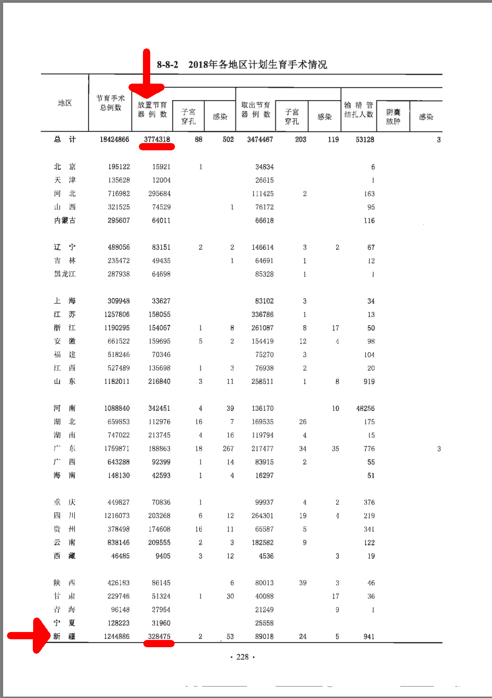

A coluna relevante é 放置节育器例数, o número de DIUs implantados. Temos um total (总计) de 3,8 milhões, com Xinjiang (新疆) respondendo por 328.475. Assim, 8,7% dos DIUs da China ocorreram em Xinjiang. (Uma observação, mas o que realmente se destaca nesta tabela não é Xinjiang, mas Henan. Em toda a China, 86% das vasectomias e 26% dos litígios tubários aconteceram em Henan. Ao contrário do DIU, esses são procedimentos de esterilização reais que não podem ser revertidos)

Assim, parece que os assistentes chineses ajudando Zenz adicionaram uma casa decimal por engano. Ou Zenz está mentindo. Mas tenho certeza de que um camarada sênior "Vítimas do Comunismo", "liderado por Deus" para destruir a China, não faria nada furtivo assim. Afinal, não é como se ele [tivesse convencido as testemunhas uigures a mudar suas histórias](https://twitter.com/DanielDumbrill/status/1277704695222603776) ou algo assim.

P.S: Alguns observadores mais astutos podem notar que baseei minha pesquisa em uma investigação do Global Times. Mas todos nós sabemos que todo mundo acredita que o Global Times é propaganda chinesa. Portanto, decidi confirmar a verdade mostrando a você a própria fonte primária.

Tursunay Ziyawundun é a pessoa que iniciou a [alegação de esterilização forçada/castração química](https://apnews.com/269b3de1af34e17c1941a514f78d764c), que é muito comum na internet hoje. O problema? Ela afirmou em sua [entrevista com a Buzzfeed](https://www.buzzfeednews.com/article/meghara/china-uighur-xinjiang-kazakhstan)  que "não foi espancada ou abusada". Por que ela mudou seu testemunho? Uma explicação simples seria que, se ela alegasse ter sido abusada fisicamente, ela teria sido solicitada a mostrar evidências corporais, algo que desmascararia imediatamente sua alegação. Agora, 7 meses depois, ela pode reivindicar o que quiser e pode simplesmente ignorar qualquer pedido de apresentação de evidências corporais. A Global Times explica com mais detalhes em um [artigo](https://www.globaltimes.cn/content/1193454.shtml) sobre as falhas no método de Adrian Zenz.

O mesmo também justifica o fato de haver campos de concentrações na Alemanha Nazista e o Ocidente não se preocupar porque Hitler "salvou" a Alemanha.

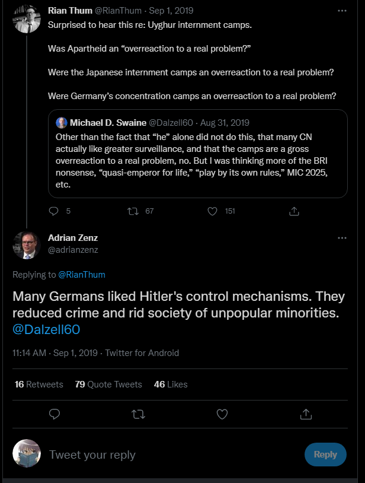

O mesmo também [acredita que os judeus](https://books.google.com.br/books?id=lRtSQB3HHJcC&q=jews&redir_esc=y#v=onepage&q=fiery%20furnace&f=false) que se recusam a se converter ao cristianismo serão "eliminados" e colocados em uma "fornalha ardente" (soa familiar?).


#### Desbancando histórias
Em primeiro lugar, é importante compreender o fato de que os depoimentos são evidências anedóticas, fortemente sujeitas a vieses de percepção. A sociedade hoje sofre de falsa vitimização porque as pessoas tendem a acreditar na suposta vítima e desconsiderar qualquer coisa vinda do réu. No caso de falsidade de depoimentos, o réu é quem mais sofre.

Sayragul Sauytbay está em um nível totalmente novo de criatividade e desonestidade. Suas [alegações](https://www.dailymail.co.uk/news/article-7599941/Whistleblower-escaped-Chinese-education-camp-reveals-horrors.html) foram inspiradas em ficções de fantasia sombrias, incluindo:
>"Ver uma velha tendo sua pele esfolada."
>“Morreram de fome durante uma semana inteira, mas foram alimentados à força com carne de porco de churrasco às sextas-feiras.“
>“Estuprada pessoalmente na frente de 200 presidiários.”

Tudo isso parece horrível até que você olhe para o [depoimento original](https://www.theglobeandmail.com/world/article-everyone-was-silent-endlessly-mute-former-chinese-re-education/) dela, sendo que "Eu não vi nenhuma violência".

**Merdan Ghappar**, um modelo uigur, teria supostamente roubado um celular e mantido esse celular dentro de um campo de concentração de uigures. Ele manteve esse celular escondido por mais de duas semanas sem carregar, entrando em contato com terceiros. Tudo isso enquanto estava supostamente preso em um campo de concentração e algemado na cama.

[A BBC analisou as mensagens enviadas](https://www.bbc.com/news/world-asia-china-53650246) por Ghappar no aplicativo WeChat para publicar sua história, mas os chineses notaram que as capturas de tela diferiam dos originais quando a história apareceu em março, já que partes do texto haviam sido removidas, como ofensas.

Você provavelmente já viu a imagem de satélite dos supostos campos que abrigam esses 2 milhões de detidos. Pegue uma das áreas mais movimentadas do mundo, Nova York Manhattan. Este lugar acomoda regularmente 1,6 milhão de pessoas e é, sem dúvida, um lugar bem lotado. Como não há arranha-céus nessas imagens de satélite, a área de ocupação dos 2 milhões de acampamentos uigures deve ocupar outra metade de um Manhattan extra. Onde estão as imagens de satélite dos campos do tamanho de uma cidade ao redor de Xinjiang? Se isso não dá uma ideia de quão ridículo é o número 2 milhões, a população total de presidiários dos EUA é de 2,3 milhões. Existem 1.719 prisões estaduais, 102 penitenciárias federais, 942 penitenciárias juvenis, 3.283 penitenciárias locais e 79 penitenciárias indianas, além de prisões militares, centros de detenção de imigração, centros de detenção civil e prisões. As prisões dos Estados Unidos também são conhecidas por operar constantemente em sua capacidade máxima. Deveria haver mais de 6 mil instalações de tamanhos diferentes na província de Xinjiang, não apenas algumas dezenas de pequenas estruturas do tamanho de escolas primárias.

A própria BBC também recrutou especialistas em arquiteturas de presídios que usando uma lista de imagens aéreas da região, [identificaram 44 prédios](https://www.bbc.com/portuguese/internacional-45999030) que poderiam ser centros de detenção. Contudo, para ter 1 milhão de presos nesses 44 prédios, daria mais ou menos 23 mil pessoas por prédio. Analisando um prédio só, eles disseram que haveria cerca de 11 mil pessoas e que seria um dos maiores que eles viram nas imagens.

Pelo que eu posso rastrear, existem atualmente 2 fontes para números na casa dos milhões, o Congresso Mundial Uyghur e o “estudo” de Adrian Zenz. O número do Congresso Mundial Uyghur é fácil de desmascarar (não dizendo que o de Zenz é difícil). Há um [vídeo](https://www.youtube.com/watch?v=A8uZZjB4kfM) do presidente do WUC, Omer Kanat, respondeu à alegação de 1 milhão de uigures.

O estudo de Adrian Zenz é um pouco mais complicado de desmascarar porque há um "estudo" real para se olhar. Depois de olhar para o estudo real e fazer algumas pesquisas sobre Adrian Zenz, pode-se descobrir rapidamente que ele não tem um histórico na condução de trabalhos aprovados academicamente. Ele não recebeu educação em assuntos relacionados à estatística e tem um longo histórico de fazer algumas afirmações muito “questionáveis”. Ele alegou que foi "enviado por Deus para punir Pequim" e conecta ativamente a homossexualidade, a igualdade de gênero e a proibição de punições corporais ao poder do "Anticristo". Desde então, sua página da Wikipedia removeu qualquer conteúdo sobre suas crenças “não convencionais”, mas os arquivos ainda podem ser encontrados na internet.

Em relação ao estudo real, não há nada de substancial. A maioria dos parágrafos é dedicada a fornecer informações sobre as informações geológicas e geográficas de Xinjiang. A conclusão de “milhões de detidos” é feita entrevistando apenas 8 supostos ex-detentos. Não há mais informações úteis no estudo de Zenz sobre este tópico. É justo concluir, com uma relação com suas visões cristãs fundamentalistas e histórico de crenças questionáveis ​​pelos padrões de hoje, que o estudo de Adrian Zenz é, em última análise, [impróprio para ser citado por qualquer artigo](https://thegrayzone.com/2019/12/21/china-detaining-millions-uyghurs-problems-claims-us-ngo-researcher/).

Há um [vídeo](https://www.youtube.com/watch?v=xU_w5UzdZEs) sobre imagens do drone de homens com os olhos vendados, algemados e barbeados que supostamente seriam uigures. A filmagem específica do drone geralmente vem com alegações sobre a natureza do conteúdo. A maioria diria que se trata de uma transferência de detidos uigur para os campos de concentração. No entanto, uma mera inspeção de perto das costas dos coletes desses supostos detidos mostra que essas pessoas pertencem à prisão provisória de 喀什市看守所, Kashgar. Isso significa que esses são presidiários, prisioneiros, criminosos literais que agora estão sendo retratados como vítimas inocentes para se adequar à agenda política do comentarista. Usar essa filmagem para argumentar que o campo de concentração existe é mal intencionado e tem como objetivo explorar os telespectadores que não sabem ler chinês simplificado.

Há outro [vídeo](https://www.douban.com/group/topic/106094686/) (eu tinha o vídeo, mas só consegui achar a foto) de prisioneiros uigures vendados e amarrados. Este vídeo retém algumas informações, já que os homens no vídeo são inexpressivos. Eles nem mesmo eram uigures. Então, o que é este vídeo? Este é um vídeo capturado em agosto de 2017 em Douban. Os homens vendados são missionários do esquema de pirâmide (MLM), criminosos literais que enganam as pessoas com seu dinheiro suado e literalmente destroem vidas e famílias. Eles são vitimados para se adequar à agenda de quem usa isso como "evidência" de campos de concentração uigures.

Já o [Instituto Australiano de Política Estratégica](https://www.aspi.org.au/) diz que [analisou 28 campos](https://www.aspi.org.au/report/mapping-xinjiangs-re-education-camps) e que eles poderiam conter cerca de 500 mil pessoas, mas eles nunca publicaram os estudos, nem os dados e muito menos a matemática usada.

Arslan Hidayat é um australiano que sempre posta imagens que teriam sido vazadas de Xinjiang, principalmente no Twitter e no Instagram. Ele disse que a China [criou um sistema de tortura](https://twitter.com/arslan_hidayat/status/1181232085295611904) tipo boi no rolete, mas esse vídeo é de Taiwan, e os chineses foram [investigar](https://tfc-taiwan.org.tw/articles/379) e descobriram que se tratava de um vídeo de BDSM, e inclusive acharam a vítima do vídeo. Ele também [postou](https://twitter.com/arslan_hidayat/status/1182398842886602757) uma suposta criança uigur que estava chorando pedindo pela mãe e que estaria presa em um campo de concentração, mas essa criança poderia ser qualquer criança da China. Ele também [postou um vídeo](https://twitter.com/arslan_hidayat/status/1184513569662083072) sobre tortura aos uigures, mas era da polícia de Mianmar.


<em>A fonte do vídeo é de uma conta do Facebook. As palavras na imagem diziam que o garoto é da China e foi enganado por traficantes para ir para Mianmar ou Camboja e mais tarde foi sequestrado. Ele foi salvo pela polícia chinesa. Ele também disse que a polícia de Yunnan salva 5.600 adolescentes anualmente</em>

Em uma [entrevista](https://www.youtube.com/watch?v=Nf7PZ0jPqIs&t=5s) recente no YouTube, ele diz que aumenta ou inventa histórias para chamar atenção do que acontece na região e que todos os uigures fora da China fazem o mesmo. Há uma [thread](https://twitter.com/j_bigboote/status/1182726991675625472) sobre ele no Twitter. [2](https://twitter.com/ethan_parallels/status/1151153694517260288?s=21).

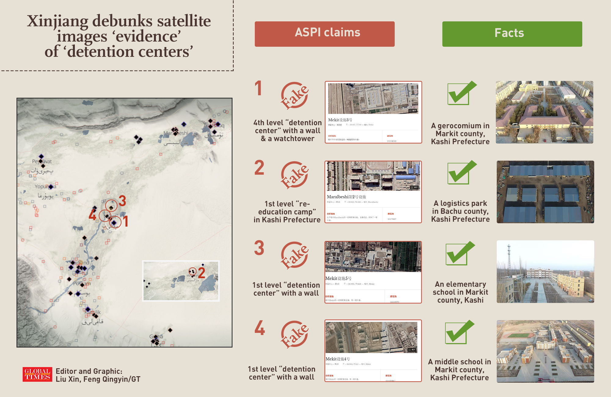

Como você pode ver acima, a mídia ocidental pega fotos desatualizadas da construção de escolas, parques e casas de repousos, e alegam ser "campos de extermínio" para uigures.

Também há um podcast brasileiro no Twitter que fez [propaganda anti-china](https://twitter.com/Opodnext/status/1302610017665810432), o PodNext. Eles postaram imagens de uma prisão comum em Luopu, e um [evento religioso](https://web.archive.org/web/20180821032854/https://baijiahao.baidu.com/s?id=1564669932542581) realizado com a presença das famílias inclusive, e este evento era contra o extremismo religioso da região. Ele também publicou sobre uma mulher que supostamente estaria presa em um campo e estava arrumando um jeito de ver a filha atrás das grades, mas na verdade ela era uma funcionária da saúde que estava lutando contra a COVID. Também há uma imagem de várias pessoas algemadas, vendadas e sentadas no chão. Foi anunciada como uigures sendo transportados, mas na verdade é de uma prisão comum em Kashgar e não tem como saber se são hans, cazaques, uigures ou uma das 53 etnias minoritárias chinesas, e metade das pessoas nessas imagens são policiais. Xinjiang tem mais que o dobro de mesquitas da Turquia, e há 20 anos, haviam apenas 4.000 (crescimento de 1000%).

#### Conclusão e considerações finais sobre os uigures
A mídia não é algo independente do Estado. Em vez disso, o estado e a mídia crescem a partir das relações de propriedade do capitalismo e são controlados pelo capital para garantir a extração de trabalho pela força coercitiva e para propagar a cultura liberal dominante da opinião pública, respectivamente. Este também é apenas um problema em uma guerra de propaganda massiva. Você está constantemente sendo bombardeado por mentiras. Não cometa o erro de pensar que se trata de um caso isolado de manipulação da opinião pública por motivos ocultos. Você não está imune à propaganda. 

Agradeço ao Felipe Durante.

Fontes:
- [Medium | A Reddit AMA Claiming To Be A Uyghur Quickly Exposes A CIA Asset Slandering China](https://medium.com/@bobbyarlan/a-reddit-ama-claiming-to-be-a-uiyghur-quickly-exposes-a-cia-asset-slandering-china-1d667c098b77)
- [Qiao Collective | Xinjiang: A Report and Resource Compilation](https://www.qiaocollective.com/en/education/xinjiang)
- [Global Times | Allegedly ‘missing’ Uyghurs found living normally](https://www.globaltimes.cn/content/1174468.shtml)
- [Forbes | Study Links Nike, Adidas And Apple To Forced Uighur Labor](https://www.forbes.com/sites/siminamistreanu/2020/03/02/study-links-nike-adidas-and-apple-to-forced-uighur-labor/?sh=dbac5ee1003d)
- [Time | If China Is Anti-Islam, Why Are These Chinese Muslims Enjoying a Faith Revival?](https://time.com/3099950/china-muslim-hui-xinjiang-uighur-islam/)
- [IPVM | Hikvision Markets Uyghur Ethnicity Analytics, Now Covers Up](https://ipvm.com/reports/hikvision-uyghur)
- [World Affairs | Uyghur-Xinjiang Explained in Four Minutes](https://thechinawiki.com/2020/10/26/uyghur-xinjiang-explained-in-four-minutes/)
- [Medium | XinJiang: Facts Vs. Fiction](https://leohezhao.medium.com/xinjiang-facts-vs-fiction-bdc2aa403c91)
- [The Jamestown Foundation | Returning Uighur Fighters and China’s National Security Dilemma](https://jamestown.org/program/returning-uighur-fighters-and-chinas-national-security-dilemma/)
- [Al Jazeera | ISIL video threatens China with ‘rivers of bloodshed’](https://www.aljazeera.com/news/2017/3/1/isil-video-threatens-china-with-rivers-of-bloodshed)
- [Medium | U.S. Xinjiang propaganda is about preparing for a Ukraine-style fascist coup in western China](https://rainershea612.medium.com/u-s-xinjiang-propaganda-is-about-preparing-for-a-ukraine-style-fascist-coup-in-eastern-china-733763348058)
- [The Grayzone | China detaining millions of Uyghurs? Serious problems with claims by US-backed NGO and far-right researcher ‘led by God’ against Beijing](https://thegrayzone.com/2019/12/21/china-detaining-millions-uyghurs-problems-claims-us-ngo-researcher/)
- [The Chollima Report | Who is Adrian Zenz? The Christian Fundamentalist Leading the Global Xinjiang Narrative](https://chollima.org/who-is-adrian-zenz-the-christian-fundamentalist-leading-the-global-xinjiang-narrative/)
- [About China | Xinjiang](https://aboutchina.carrd.co/#xinjiang)
- [YouTube - The Grayzone | US "left" aligns with State Department on China Cold War](https://www.youtube.com/watch?v=3JTgnAKWmMA&ab_channel=TheGrayzone)
- [World Affair | Xinjiang and Uyghurs — What You’re Not Being Told](https://worldaffairs.blog/2019/07/05/xinjiang-and-uyghurs-what-youre-not-being-told/amp/)
- [CLASH Podcast: Trouble on the Silk Road (very interesting podcast episode about Xinjiang)](https://www.patreon.com/posts/ep-55-trouble-on-21205934)
- [Why Xinjiang? Why now? - Very good post by Prof. Roland Boer](https://stalinsmoustache.org/2018/11/17/15095/)
- [Full transcript of interview with Xinjiang government chief on counterterrorism, vocational education and training in Xinjiang](http://www.xinhuanet.com/english/2018-10/16/c_137535821.htm)
- [Ajit Singh interviewed by Eugene Puryear (Listen at 40:00-59:00)](https://www.spreaker.com/user/radiosputnik/should-google-be-regulated-western-xenop)
- [China’s Xinjiang Problem made in the USA](https://journal-neo.org/2015/11/10/chinas-xinjiang-problem-made-in-usa/)
- [China’s Uyghur problem: the unmentioned part](https://journal-neo.org/2018/10/05/china-s-uyghur-problem-the-unmentioned-part/)
- [What about the Uyghurs? (By Prof. Roland Boer - brilliant article)](https://stalinsmoustache.org/2018/09/15/what-about-the-uyghurs/)
- [Inside America’s meddling machine: the US funded group that interferes in elections around the globe (MUST WATCH) - see second half for Uyghur section](https://www.youtube.com/watch?v=NzIJ25ob1aA)
- [Xinjiang - the new Great Game (very good)](https://www.counterpunch.org/2018/09/24/xinjiang-the-new-great-game/)
- [From Idlib to Xinjiang - Uyghur fighters trained for terror (excellent read)](https://21stcenturywire.com/2018/09/26/from-idlib-to-xinjiang-uyghur-fighters-trained-for-terror/)
- [Most of what we hear about China is Red Scare, Yellow Peril propaganda](http://armedwithapen.com/anti-china-propaganda/)
- [China launches anti-poverty drive in restive Xinjiang](https://www.aljazeera.com/news/2018/02/china-launches-anti-poverty-drive-restive-xinjiang-180218150517058.html)
- [Fighters from Xinjiang join ISIS](https://www.aljazeera.com/news/2017/03/isil-video-threatens-china-rivers-bloodshed-170301103927503.html)
- [If China Is Anti-Islam, Why Are These Chinese Muslims Enjoying a Faith Revival?](http://time.com/3099950/china-muslim-hui-xinjiang-uighur-islam/)
- [“China is not eradicating Islam” - a thread by Ian Goodrum](https://threadreaderapp.com/thread/1004884261051092993.html)
- [China bans anti-Islam terms from social media](http://www.globaltimes.cn/content/1067405.shtml)
- [No, the UN did not report China has massive internment camps for Uighur Muslims](https://grayzoneproject.com/2018/08/23/un-did-not-report-china-internment-camps-uighur-muslims/)
- [Syria says up to 5,000 Chinese Uighurs fighting in militant groups](https://www.reuters.com/article/uk-mideast-crisis-syria-china/syria-says-up-to-5000-chinese-uighurs-fighting-in-militant-groups-idUSKBN1840UP)
- [Turkey’s misguided Syrian policy fanning Uyghur insurgency against China](http://blogs.timesofisrael.com/turkeys-misguided-syrian-policy-fanning-uyghur-insurgency-against-china/)
- [Chinese Uyghur colonies in Syria a challenge for Beijing](http://www.atimes.com/chinese-uyghur-colonies-syria-challenge-beijing/)
- [Xinjiang, what a wonderful place (article by the Chinese ambassador to Indonesia)](http://www.thejakartapost.com/academia/2018/09/25/xinjiang-what-a-wonderful-place.html)
- [Soft landing in Xinjiang](http://www.globaltimes.cn/content/1123066)

## A Alemanha Oriental
Ao longo de seus 41 anos de existência, a República Democrática Alemã (RDA/GDR/DDR) se viu constantemente no centro da Guerra Fria. O Muro de Berlim, criado para separar Berlim Oriental da Berlim Ocidental controlada pela FRG, rapidamente se tornou o símbolo mais famoso do conflito. Apesar disso, a maioria das pessoas (incluindo a maioria dos socialistas) sabe relativamente pouco sobre esta nação; como sua economia funcionava, que tipo de vida deu ao seu povo, etc. No entanto, à luz dos eventos recentes, como estudos que descobriram que [57% dos alemães orientais têm uma visão positiva da RDA](https://www.spiegel.de/international/germany/homesick-for-a-dictatorship-majority-of-eastern-germans-feel-life-better-under-communism-a-634122.html), muitas pessoas ficaram mais curiosas sobre neste país específico.

### Antecedentes históricos e condições iniciais (Segunda Guerra Mundial e era pré-guerra) da Alemanha Oriental
A Segunda Guerra Mundial deixou a Alemanha uma sombra de seu antigo eu. Cidades foram arrasadas e a economia totalmente devastada. A Alemanha Oriental, em particular, estava em séria desvantagem; na verdade, a disparidade de riqueza entre a Alemanha Oriental e Ocidental já existia muito antes do estabelecimento da RDA. De acordo com um [estudo](https://www.deepdyve.com/lp/ou-press/the-roots-of-economic-failure-what-explains-east-germany-s-falling-A6wSaF2DRj?key=OUP) no European Journal of Economic History:
>A "Grande Divergência" entre Oriente e Ocidente em eficiência industrial não começou em 1948, quando o desenvolvimento institucional das duas partes do país tomou rumos fundamentalmente diferentes. Os principais fatores que contribuem para essa divergência já estavam presentes anteriormente.

A Alemanha Oriental sempre foi muito menos industrializada do que a Alemanha Ocidental e, como tal, dependeu muito do Ocidente para suas necessidades econômicas. De acordo com o [estudo](https://archive.org/details/eastgermanycount00bura_0) da Divisão de Pesquisa Federal dos EUA sobre a Alemanha Oriental:
>Antes da Segunda Guerra Mundial, a área que mais tarde se tornou a Alemanha Oriental não era bem desenvolvida industrialmente. Como essa área carecia de matéria-prima, a indústria pesada geralmente estava localizada em outras partes do estado alemão. Para agravar os problemas para o recém-criado estado da Alemanha Oriental em 1949 estava a destruição maciça durante a Segunda Guerra Mundial da planta industrial que existia lá e o subsequente desmantelamento soviético e remoção das fábricas e equipamentos que haviam sobrevivido à guerra. [...] Durante os anos entre guerras, o território que agora é a Alemanha Oriental era profundamente dependente de laços econômicos externos. Em meados da década de 1930, foi despachado quase metade de sua produção total para outras partes da Alemanha. Esse comércio interno envolvia vendas de produtos agrícolas; têxteis; produtos da indústria leve, como câmeras, máquinas de escrever e equipamentos ópticos; e compras de bens e equipamentos industriais.

Em outras palavras, a Alemanha Oriental dependia totalmente do Ocidente para suas necessidades industriais pesadas e pagava por essas necessidades vendendo seus produtos agrícolas e industriais leves. No entanto, após a guerra, esse equilíbrio entre o Oriente e o Ocidente foi prejudicado. De acordo com a Divisão de Pesquisa Federal dos EUA:
>Grandes deslocamentos ocorreram após a Segunda Guerra Mundial, quando a Alemanha foi dividida em duas seções, uma parte dominada pela União Soviética e a outra pelos Aliados Ocidentais. Por não poder mais contar com seu antigo sistema de comércio interno e externo, a Zona de Ocupação Soviética teve de ser reestruturada e tornada mais autossuficiente por meio da construção de uma indústria básica.

Este não foi um feito pequeno para a RDA incipiente, especialmente visto que ela não recebeu praticamente nenhuma ajuda econômica em grande escala da URSS (que estava ocupada demais se reconstruindo após a Segunda Guerra Mundial para se preocupar em injetar dinheiro na Alemanha Oriental - e a COMECON se parece mais com um Mercosul do que com um Plano Marshall). Além disso, a RDA teve de pagar pesadas indenizações à URSS pelos danos causados ​​durante a Segunda Guerra Mundial. Isso atuou como um grande obstáculo ao desenvolvimento. De acordo com o The East German Economy, 1945-2010, publicado pelo German Historical Institute, as reparações diretas e indiretas pagas pela Alemanha Oriental entre 1946 e 1953 totalizaram $14 bilhões a preços de 1938. Outra declaração sobre isso é encontrada no estudo da Divisão de Pesquisa Federal dos EUA:
>A reorientação e reestruturação da economia da Alemanha Oriental teria sido difícil em qualquer caso. Os substanciais custos de reparação que a União Soviética impôs à sua zona ocupada e, mais tarde, à Alemanha Oriental, tornaram o processo ainda mais difícil. Os pagamentos continuaram no início dos anos 1950, terminando apenas com a morte de Stalin. De acordo com estimativas ocidentais, esses pagamentos totalizaram cerca de 25% da produção total da Alemanha Oriental até 1953.

Isso está em contraste direto com o Ocidente, que recebeu grandes investimentos de ajuda dos Estados Unidos - nada afetado pela Guerra - como parte do Plano Marshall, bem como relações comerciais lucrativas com as nações desenvolvidas.

### Crescimento econômico e desenvolvimento industrial da Alemanha Oriental
Apesar de todas as desvantagens significativas acima mencionadas, a economia da Alemanha Oriental conseguiu superar suas dificuldades e se desenvolver a um ritmo impressionantemente rápido. Embora a RFA tenha uma economia geral maior do que a RDA, há um argumento real de que a RDA alcançou uma taxa de crescimento mais rápida. Talvez o [estudo](https://www.ssoar.info/ssoar/bitstream/handle/document/28587/ssoar-hsrsupp-2009-no_21-heske-volkswirtschaftliche_gesamtrechnung_ddr_1950-1989.pdf) mais extenso sobre esse tópico tenha sido feito por Gerhard Heske, publicado na revista Historical Social Research in Germany; no entanto, visto que este estudo tem cerca de trezentas páginas, citarei um [artigo](http://www.memo.uni-bremen.de/docs/m3309.pdf) de resumo da Universidade de Bremen:
>De 1951 a 1989, a RDA atingiu uma taxa média de crescimento do PIB de 4,5%, a FRG de 4,3%. De 1961 a 1985, essas taxas de crescimento foram maiores na RDA do que na RFA.

A indústria pesada cresceu especialmente rapidamente. De acordo com a Divisão de Pesquisa Federal dos EUA:
>Durante a década de 1950, a Alemanha Oriental fez um progresso econômico significativo, pelo menos conforme indicado pelos números brutos. Em 1960, o investimento havia crescido por um fator de cerca de 4,5, enquanto a produção industrial bruta havia aumentado por um fator de cerca de 2,9. Dentro dessa ampla categoria de produção industrial, os setores básicos, como máquinas e equipamentos de transporte, cresceram de forma especialmente rápida, enquanto os setores de consumo, como os têxteis, ficaram para trás.

Apesar da prioridade dada à indústria pesada, o consumo também aumentou de forma constante neste período:
>O consumo cresceu significativamente nos primeiros anos, embora a partir de uma base muito baixa, e apresentou taxas de crescimento respeitáveis ​​ao longo de toda a década.

No final da década de 1950, alguns analistas temiam uma crise econômica no Oriente, impulsionada pela "fuga de cérebros" do Oriente para o Ocidente; no entanto, isso não ocorreu, e a economia da Alemanha Oriental continuou a crescer de forma impressionante na década de 1960. Relatórios da Divisão de Pesquisa Federal dos EUA:
>No final da década de 1950, o pessimismo sobre o futuro parecia bastante apropriado. Surpreendentemente, no entanto, após a construção do Muro de Berlim e vários anos de consolidação e realinhamento, a Alemanha Oriental entrou em um período de crescimento econômico impressionante que produziu claros benefícios para o povo. Para os anos 1966-1970, o PIB e a renda nacional cresceram a taxas médias anuais de 6,3% e 5,2%, respectivamente. Simultaneamente, o investimento cresceu a uma taxa média anual de 10,7%, o comércio varejista em 4,6% e a renda per capita real de 4,2%.

Esse crescimento continuou ao longo da próxima década:
>A partir de 1970, as taxas de crescimento nos vários setores da economia não diferiam muito daquelas da década anterior. A produção atingiu cerca de 140% a 150% dos níveis da década anterior. As taxas de crescimento da produção resultaram em aumentos substanciais no consumo pessoal. Durante a década de 1970, a economia da Alemanha Oriental como um todo teve um crescimento relativamente forte e estável. Em 1971, o primeiro secretário Honecker declarou que a "elevação do padrão de vida material e cultural" da população era uma "tarefa principal" da economia; o consumo pessoal cresceu a uma taxa média anual de 4,8% de 1971 a 1975 e 4,0% de 1976 a 1980. O Plano Quinquenal de 1976-1980 alcançou uma taxa média de crescimento anual de 4,1%.

A década de 1980 viu algumas dificuldades econômicas para a RDA, à medida que os bancos ocidentais restringiam o crédito para o Leste e a URSS reduzia as entregas de petróleo em 10%. Isso levou a um período de crescimento lento, à medida que a RDA se apressava em aumentar as exportações; apesar disso, a economia conseguiu se recuperar e entregar resultados de crescimento impressionantes durante este período (embora tenha ficado aquém do planejado). Relatórios da Divisão de Pesquisa Federal dos EUA:
>O período do plano de 1981-1985 provou ser um momento difícil para a economia da Alemanha Oriental... No entanto, no final do período, a economia registrou um desempenho geral respeitável, com uma taxa média de crescimento anual de 4,5% (o plano meta tinha sido de 5,1%).

Os impactos gerais da estratégia de industrialização da RDA foram extremamente positivos. Conforme relatado pela Divisão de Pesquisa Federal dos EUA em 1988:
>A indústria é o setor dominante da economia da Alemanha Oriental e é a principal base para um padrão de vida relativamente alto. A Alemanha Oriental está entre as principais nações industrializadas do mundo e, no Comecon, fica atrás apenas da União Soviética.

Um resumo geral do desempenho econômico da Alemanha Oriental também pode ser encontrado no relatório mencionado:
>A economia da República Democrática Alemã (Alemanha Oriental) desenvolveu-se de forma impressionante desde sua fundação em 1949. Por quase todos os indicadores, ela está no topo do mundo socialista em desenvolvimento e desempenho econômico [...] A condição da economia é ainda mais notável quando se considera as circunstâncias em que se desenvolveu. O país foi devastado durante a Segunda Guerra Mundial. Posteriormente, a ocupação soviética do território da Alemanha Oriental sobrecarregou pesadamente a população e os recursos. Além disso, a divisão das terras alemãs após a guerra afetou seriamente a economia. A capacidade da indústria pesada da Alemanha Oriental era muito baixa e seus suprimentos de matéria-prima, com exceção de carvão de linhita (baixo teor) e potássio, eram quase inexistentes. O fato de que o país por muitos anos não teve reconhecimento internacional como um Estado soberano certamente não contribuiu para o crescimento econômico, e sua perda de população antes da construção do Muro de Berlim foi um dreno significativo de recursos de trabalho.

Em um [report](http://hdr.undp.org/sites/default/files/reports/219/hdr_1990_en_complete_nostats.pdf) lançado pela ONU sobre o IDH de cada país no final dos anos 80, considerando: Expectativa de vida, educação e PIB, na página 111, afirma que a RDA era o país socialista mais desenvolvido do mundo, na 20th posição, enquanto os EUA estava na 18th posição e a Alemanha Ocidental estava na 11th posição.

No geral, o sistema socialista na RDA conseguiu industrializar a nação em um ritmo rápido, permitindo que o país se sustentasse sem constantes infusões do Ocidente. Ela fez isso apesar das inúmeras desvantagens acima mencionadas, um feito que deve ser comemorado.

### Aumentos no padrão de vida da Alemanha Oriental
O sistema socialista na RDA não só teve sucesso no desenvolvimento rápido da nação; também proporcionou uma qualidade de vida cada vez maior para as pessoas. Relatórios da Divisão de Pesquisa Federal dos EUA:
>O padrão de vida da Alemanha Oriental melhorou muito desde 1949 [quando a RDA foi criada]. A maioria dos observadores, tanto do Oriente como do Ocidente, concorda que na década de 1980 os alemães orientais desfrutavam do mais alto padrão de vida na Europa Oriental. Grandes melhorias ocorreram, especialmente após 1971, quando o regime de Honecker anunciou seu compromisso de cumprir a "tarefa principal" da economia, que era definida como a melhoria do bem-estar material e cultural de todos os cidadãos.

Este enfoque no aumento da qualidade de vida para todos os cidadãos, ao invés de fornecer lucro para a classe capitalista, é uma característica única do sistema socialista, que proporcionou melhoria contínua dos padrões de vida. A Divisão de Pesquisa Federal dos EUA declara:
>Desde o início do regime, o rendimento mensal do rendimento médio da Alemanha Oriental aumentou de forma constante em termos de poder de compra efetivo. De acordo com o anuário estatístico da Alemanha Oriental de 1986, a renda média mensal dos trabalhadores no setor socializado da economia aumentou de 311 marcos da RDA em 1950 para 555 marcos da RDA em 1960, 755 marcos da RDA em 1970 e 1.130 marcos da RDA em 1985. Porque a maioria dos preços ao consumidor permaneceram estáveis ​​durante esse tempo; os números de 1985 representaram um aumento melhor do que três vezes maior nos últimos 35 anos.

Os subsídios estatais significaram que as necessidades básicas (alimentação, habitação, etc.), serviços públicos (saúde, educação, etc) e até pequenos luxos (refeições em restaurantes, concertos, etc) eram todos notavelmente baratos, especialmente quando comparados com a capitalista Ocidental. Relatórios da Divisão de Pesquisa Federal dos EUA:
>Na Alemanha Oriental, o marco da RDA pode comprar um grande número de bens de primeira necessidade porque o estado subsidia sua produção e distribuição ao povo. Assim, a habitação, que consome uma porção considerável dos rendimentos de uma família média no Ocidente, constituía menos de 3% das despesas de uma família típica de trabalhadores em 1984. Leite, batatas, pão e transporte público também eram relativamente baratos. Muitos serviços, como assistência médica e educação, continuaram disponíveis sem custo para todos, exceto para poucos. Até refeições em restaurantes, shows e selos postais eram baratos para os padrões ocidentais. Em meados da década de 1980, os alemães orientais não tinham dificuldade em obter carne, manteiga, batatas, pão, roupas e muitos outros itens essenciais.

A situação da habitação também melhorou muito:
>Começando na década de 1960, o governo iniciou uma grande campanha para fornecer instalações habitacionais modernas; buscou eliminar a longa escassez de moradias e modernizar totalmente o estoque existente até 1990. No início da década de 1980, o programa havia fornecido quase 2 milhões de unidades novas ou reformadas, e mais 2 milhões deveriam ser acrescentados em 1990. Em 1985, o progresso nesta área parecia ser satisfatório e as metas do plano estavam sendo cumpridas ou excedidas.

A situação em termos de bens de consumo também estava melhorando; a Divisão de Pesquisa Federal dos Estados Unidos relata que, em 1985, na RDA, 99% das famílias tinham geladeira, 92%, máquina de lavar e 93%, televisão. Esses números são comparáveis ​​aos dos Estados Unidos em 2016 (embora a propriedade de máquinas de lavar fosse maior e a de TV ligeiramente menor na RDA).

Os economistas sempre pensaram que o marco da RDA era mais fraco em termos de poder de compra do que o marco da Alemanha Ocidental; no entanto, um estudo do Instituto de Pesquisa Econômica de Berlim Ocidental (conforme relatado pela Divisão de Pesquisa Federal dos EUA) refutou essa ideia:
>Em 1983, o Instituto de Pesquisa Econômica de Berlim Ocidental empreendeu um de seus estudos periódicos em que o poder de compra do marco da RDA era medido em comparação com o marco da Alemanha Ocidental. O Instituto concluiu que, como um todo, o marco da GDR deve ser considerada como tendo 106% do valor do marco da Alemanha Ocidental em poder de compra, um ganho impressionante sobre os 76% estimados para 1960, 86% para 1969 e 100% para 1977. A análise claramente invalidou o opinião comum no Ocidente de que o marco da RDA tinha muito pouco poder de compra.

No geral, o sistema socialista na RDA conseguiu aumentar de forma constante e rápida a qualidade de vida das pessoas, apesar das inúmeras desvantagens que o país enfrentou.

### Saúde na Alemanha Oriental
A RDA ofereceu tratamento médico gratuito ao seu povo. Este sistema permitiu que a Alemanha Oriental acompanhasse a Alemanha Ocidental em termos de condições de saúde, apesar de esta última ser mais rica (em virtude de suas extensas relações comerciais com as nações desenvolvidas). Um [estudo](https://www.ncbi.nlm.nih.gov/pmc/articles/PMC4193657/) publicado na Health Care Financing Review (uma publicação afiliada ao governo dos EUA) relata:
>Em termos de recursos reais destinados aos serviços de saúde e em termos de atividades de serviços de saúde, os dois países parecem ter sido bastante semelhantes. A RDA foi relatada como tendo 2,3 médicos por mil em 1985 (Organização Mundial da Saúde, 1987), em comparação com 2,6 no RFA. Em 1977, a RDA tinha 10,6 leitos hospitalares por mil, em comparação com 11,8 na RFA, e ambos os países tinham níveis semelhantes de dentistas e farmacêuticos por mil. O tempo de internação hospitalar foi relatado como semelhante nos dois países. Dado que os leitos hospitalares por mil eram semelhantes, isso sugere que as taxas de admissão não eram muito diferentes. Finalmente, as taxas de consulta com médicos parecem ter sido semelhantes nos dois países: 9,0 por pessoa na RDA em 1976 e 10,9 por pessoa na RFA em 1975 (Health OECD: Facts and Trends, a ser publicado).

O estudo confirma o custo muito mais baixo dos cuidados de saúde na Alemanha Oriental:
>Se a RDA desfrutava de um volume de serviços de saúde semelhante ao da RFA, mas tinha despesas de saúde per capita muito mais baixas, então os preços dos serviços de saúde deveriam ser muito mais baixos na RDA.

A RDA manteve altos padrões de saúde, que melhoraram continuamente e, em alguns casos, mais rápido do que os do Ocidente (embora começando em um nível inferior; a Alemanha Oriental sempre foi pior em termos de saúde do que o Ocidente). O estudo acima mencionado afirma:
>Quanto ao estado de saúde, em 1987, a expectativa de vida relatada ao nascer no leste da Alemanha, 69,9 anos para homens e 76,0 para mulheres, não ficava muito atrás daquela da Alemanha Ocidental de 72,2 para homens e 78,9 para mulheres. A taxa de mortalidade infantil, que era de 7,2 por 100 em 1950, caiu para 0,92 em 1986. Embora a taxa de mortalidade infantil fosse superior à da Alemanha Ocidental em 1986 (0,85), a queda desde 1950 foi maior.

De modo geral, os padrões de saúde na Alemanha Oriental eram altamente respeitáveis, especialmente quando se lembram das desvantagens que a RDA enfrentava, bem como o fato de que os cuidados de saúde eram gratuitos para todas as pessoas, o que não se pode dizer o mesmo do Ocidente.

### Educação e cuidados infantis na Alemanha Oriental
O sistema educacional na RDA era muito sólido. Por um lado, havia amplo acesso aos serviços de pré-escola e jardim de infância. De acordo com a Divisão de Pesquisa Federal dos EUA:
>A frequência ao jardim de infância não era obrigatória, mas a maioria das crianças de três a seis anos frequentava. O estado considerava os jardins de infância um elemento importante do programa educacional geral. As escolas enfocavam a saúde e a boa forma física, o desenvolvimento de valores socialistas e o ensino de habilidades rudimentares. O regime fez experiências com escolas combinadas de creches e jardins de infância, que introduzem a criança gradualmente em um programa de atividades mais organizado e aliviam as dores do ajuste. Em 1985, havia 13.148 pré-escolas que cuidavam de 788.095 crianças (cerca de 91% das crianças elegíveis para frequentar).

Após o jardim de infância, as crianças entravam na fase obrigatória de educação:
>A educação obrigatória começou aos seis anos, quando todas as crianças ingressaram na escola politécnica geral mista de dez anos. O programa foi dividido em três seções. O estágio primário incluiu da primeira à terceira série, onde as crianças aprenderam as habilidades básicas de leitura, escrita e matemática. O estágio primário também apresentou às crianças os fundamentos da boa cidadania e, de acordo com a lei de educação de 1965, proporcionou-lhes "o primeiro conhecimento e compreensão da natureza, do trabalho e da sociedade socialista". O ensino enfatizou a língua, a literatura e a arte alemãs como meio de desenvolver as habilidades expressivas e linguísticas da criança; cerca de 60% do tempo da sala de aula foi dedicado a este componente. O ensino da matemática representava cerca de 24% do currículo e incluía uma introdução às leis e relações matemáticas fundamentais. Outros 8% eram dedicados à educação física, que compreendia exercícios, jogos e atividades destinadas a desenvolver a coordenação e habilidade física. A instrução politécnica também foi iniciada no nível primário e consistia em jardinagem e artesanato que davam à criança uma apreciação básica da tecnologia, da economia e do trabalhador; cerca de 8% do tempo da sala de aula era destinado a esse tipo de instrução.

Depois de concluir o ensino obrigatório, os alunos tinham várias opções:
>Após a conclusão da escolaridade obrigatória de dez anos, o aluno tinha essencialmente três opções. A opção escolhida com mais frequência foi iniciar um período de formação profissional de dois anos. Em 1985, cerca de 86% dos que haviam concluído o curso de dez anos começaram algum tipo de treinamento vocacional. Durante a formação profissional, o aluno tornou-se aprendiz, geralmente em uma empresa local ou estadual. Os alunos receberam dezoito meses de treinamento em vocações selecionadas e especialização nos últimos seis meses. Em 1985, aproximadamente 6% dos que haviam concluído sua educação politécnica ingressaram em um programa de treinamento vocacional de três anos. Este programa levou ao Abitur, ou exame de fim de ano escolar. A aprovação no Abitur permitia que o aluno se inscrevesse em um instituto técnico ou universitário, embora esse caminho para o ensino superior fosse considerado muito difícil. Em 1985, a Alemanha Oriental tinha um total de 963 escolas profissionais; 719 eram vinculados a indústrias e outros 244 eram escolas profissionais municipais. As escolas profissionais atenderam 377.567 alunos.

Os alunos tiveram um emprego garantido ao completar a escolaridade obrigatória de dez anos:
>O principal objetivo do sistema educacional era produzir pessoal tecnicamente qualificado para atender às necessidades de mão de obra da economia. O governo garantiu emprego para aqueles que concluíram o programa obrigatório de dez anos.

O sistema universitário também era de alta qualidade e a frequência era extremamente barata (embora os requisitos de admissão fossem muito competitivos):
>Em 1985, a Alemanha Oriental tinha 54 universidades e faculdades, com um total de matrículas de 129.628 alunos. As mulheres representavam cerca de 50% da população estudantil. Os cursos de engenharia e tecnologia encabeçam a lista das disciplinas populares. Medicina, economia e educação também foram escolhas populares. Existiam 239 instituições técnicas, com uma população estudantil total de 162.221. Cerca de 61% dos alunos estudavam em tempo integral, enquanto o restante se matriculava em estudos por correspondência ou tinha aulas noturnas. Os três campos de estudo mais populares nos institutos eram medicina e saúde, engenharia e tecnologia e economia. Os cursos na universidade e institutos técnicos consistiam principalmente de palestras e exames. A conclusão do programa confere um diploma ou licença, dependendo da área de estudo.
>
>Em meados da década de 1980, o ensino superior era muito barato e muitos dos livros didáticos eram fornecidos gratuitamente. Assistência financeira total ou parcial na forma de bolsas de estudo estava disponível para a maioria dos alunos, e as despesas de subsistência eram geralmente mínimas porque a maioria dos alunos continuava morando em casa durante os cursos. Os alemães têm grande consideração pela educação, e o regime geralmente tem apoiado os jovens que desejam melhorar seu nível de habilidades por meio de treinamento ou educação.

No geral, o sistema educacional na República Democrática Alemã era de alta qualidade e amplamente acessível a todos.

### Direitos das mulheres na Alemanha Oriental
A RDA teve um histórico notavelmente forte na proteção dos direitos das mulheres, muito mais forte do que o Ocidente capitalista. De acordo com a Divisão de Pesquisa Federal dos EUA:
>O histórico da Alemanha Oriental na área dos direitos das mulheres tem sido bom. As mulheres estão bem representadas no mercado de trabalho, compreendendo cerca de metade da população economicamente ativa. Em 1984, aprox. 80% das mulheres em idade produtiva (entre dezoito e sessenta) estavam empregadas. O estado encorajou as mulheres a procurar trabalho e carreiras e forneceu ajuda às mães que trabalham na forma de centros generosos de benefícios de maternidade.

O acesso das mulheres à educação era muito forte na RDA, novamente muito mais forte do que no Ocidente capitalista:
>O estado também tem feito um esforço concentrado para oferecer oportunidades educacionais para mulheres. O número de mulheres com formação universitária ou técnica tem aumentado ao longo dos anos. Dos alunos matriculados em universidades e faculdades em 1985, cerca de 50% eram mulheres.

O controle da natalidade estava amplamente disponível e gratuito, e o aborto estava disponível mediante solicitação da mulher. Relatórios da Divisão de Pesquisa Federal dos EUA:
>Uma lei liberal de aborto, promulgada em 1972 em meio a protestos de círculos religiosos, permite o aborto a pedido da mãe. Em meados da década de 1980, informações sobre métodos anticoncepcionais estavam disponíveis ao público e as mulheres podiam obter pílulas anticoncepcionais gratuitamente .

Além disso, o estado buscou prestar assistência às mães que trabalham por meio de um sistema de creche altamente desenvolvido:
>Uma elaborada rede de creches cuida da criança enquanto a mãe está trabalhando. Em 1984, havia 6.605 creches durante todo o ano, com capacidade para 296.653 crianças. Essas creches cuidavam de 63% das crianças elegíveis.

No geral, a situação das mulheres na Alemanha Oriental era muito melhor do que na Alemanha Ocidental, e o histórico de direitos das mulheres da RDA era bastante impressionante.

### O desastre de 1989
A maioria das pessoas no Ocidente imagina a queda da RDA como uma época de euforia e liberdade generalizadas; no entanto, para milhões de pessoas na Alemanha Oriental, isso estava longe de ser o caso. Um excelente relato dessa época foi escrito por Bruni de la Motte, uma mulher da Alemanha Oriental que desde então se tornou negociadora sindical britânica. Em seu [artigo](https://www.theguardian.com/commentisfree/2009/nov/08/1989-berlin-wall) (publicado no The Guardian), ela relata que o desemprego generalizado e a miséria ocorreram após a queda do comunismo:
>Pouco se sabe aqui [no Ocidente] sobre o que aconteceu à economia da RDA quando o muro caiu. Assim que a fronteira foi aberta, o governo decidiu estabelecer uma tutela para garantir que as "empresas públicas" (a maioria dos negócios) fossem transferidas para os cidadãos que criaram a riqueza. No entanto, alguns meses antes da unificação, o governo conservador recém-eleito entregou a tutela a nomeados da Alemanha Ocidental, muitos representando interesses de grandes empresas. A ideia de ativos "de propriedade pública" serem transferidos para os cidadãos foi silenciosamente abandonada. Em vez disso, todos os ativos foram privatizados em uma velocidade vertiginosa. Mais de 85% foram comprados por alemães ocidentais e muitos foram fechados logo depois. No campo, 1,7 milhão de hectares de terras agrícolas e florestais foram vendidos e 80% dos trabalhadores agrícolas perderam o emprego.

Outro [artigo](https://www.theguardian.com/world/2015/oct/02/german-reunification-25-years-on-how-different-are-east-and-west-really) do The Guardian relata o impacto de longo prazo que isso teve na economia da Alemanha Oriental, observando que praticamente não houve avanço na taxa de produtividade Ocidente-Oriente desde 1991:
>A produtividade no antigo oriente era 70% da do ocidente em 1991 e subiu para apenas 73% em 2012, em parte um legado do número de fábricas que foram compradas por industriais da Alemanha Ocidental e deliberadamente faliram para a concorrência escassa. Especialistas dizem que o fato de que a maior parte da grande indústria e bases de produção estão no ocidente e que as do oriente são muito menores - com a maioria dos empregadores na agricultura ou nas indústrias de serviços, como processamento de carne e call centers - terá um longo efeito de longo prazo de cada vez mais reter a economia no oriente e garantir que a discrepância salarial permaneça e provavelmente piore.

Bruni de la Motte observa que uma purificação em massa da vida acadêmica e profissional ocorreu após a queda do comunismo:
>Um grande número de trabalhadores comuns perdeu seus empregos, mas também milhares de pesquisadores e acadêmicos. Como resultado do expurgo da academia, dos estabelecimentos de pesquisa e científicos em um processo de veto político, mais de um milhão de indivíduos com diplomas perderam seus empregos. Isso constituía cerca de 50% desse grupo, criando na Alemanha Oriental a maior porcentagem de desemprego profissional do mundo; todos os reitores universitários e diretores de empresas estatais, bem como 75.000 professores, perderam seus empregos e muitos foram colocados na lista negra. Esse processo estava em total contraste com o que aconteceu na Alemanha Ocidental após a guerra, quando poucos ex-nazistas foram tratados dessa maneira.

Uma crise de habitação, bem como a apreensão em massa das casas dos trabalhadores, também ocorreu:
>Na RDA, todos tinham garantia legal de posse e propriedade das propriedades onde moravam. Após a unificação, 2,2 milhões de reclamações de cidadãos não-pertencentes à RDA [e pertencentes à RFA em sua maioria], foram feitas em suas casas. Muitos perderam suas casas em que viveram por décadas; muitos cometeram suicídio em vez de desistir delas. Ironicamente, os pedidos de restituição ao contrário, pelos alemães orientais sobre propriedades no Ocidente, foram rejeitados como "fora do tempo".

Ela observa que, desde a queda do comunismo, muitas pessoas passaram a apreciar os benefícios que o socialismo oferecia:
>Desde o fim da RDA, muitos passaram a reconhecer e lamentar que as "conquistas sociais" genuínas de que desfrutaram foram desmanteladas: igualdade social e de gênero, pleno emprego e falta de medos existenciais, bem como aluguéis subsidiados, transporte público, cultura e instalações desportivas. Infelizmente, o colapso da RDA e do "socialismo de estado" ocorreu pouco antes do colapso do sistema de "livre mercado" no Ocidente.

Isso é apoiado pelo fato de que (como mencionado acima) 57% dos ex-alemães orientais dizem que a vida era melhor sob o comunismo. Para leituras mais profundas de Bruni de la Motte, recomendo seu livro Stasi Hell or Workers' Paradise? Socialism in the GDR - What Can We Learn From It? Este livro apresenta uma avaliação honesta dos sucessos e fracassos da República Democrática Alemã da perspectiva de alguém que realmente cresceu, foi para a escola, trabalhou e criou uma família lá.

### Conclusão sobre a Alemanha Oriental
A República Democrática Alemã não era uma sociedade perfeita e não é sensato fingir que sim; no entanto, proporcionou um alto padrão de vida para seu povo, juntamente com uma forte segurança econômica e social. Garantia de emprego, moradia, saúde e educação, além de subsídios para as necessidades básicas; fortes proteções para os direitos das mulheres e crianças; atividades culturais de baixo custo e amplamente disponíveis, como teatros e concertos; esses são benefícios dos quais muitos milhões de pessoas passaram a sentir muita falta nos anos desde a queda da RDA.

Talvez o melhor resumo desse tópico complexo seja dado por Bruni de la Motte, na conclusão de seu livro Stasi Hell or Workers' Paradise:
>A experiência de socialismo da RDA está em marcante contraste com o desmantelamento do Estado de bem-estar e a concomitante privatização desenfreada de todos os aspectos da vida que agora ocorrem na Europa Ocidental, da cultura à saúde e outros serviços essenciais, bem como à negação do valores e a individualização extrema da vida. Vivemos em uma sociedade atomizada, rapidamente se desintegrando, com pouco etos social e sem objetivos de longo prazo. Muitos hoje, especialmente os jovens, vivem sem esperança ou senso de um futuro seguro. O socialismo ainda pode oferecer um antídoto e uma alternativa. E a experiência de países socialistas como a RDA pode fornecer indicações para um caminho a seguir e ajudar a renovar a esperança.

Em nossa era de capitalismo tardio, mudança climática e fascismo ressurgente, essa mensagem é mais relevante do que nunca.

Fontes:
- [Der Spiegel | Majority of East Germans Defend the GDR](https://www.spiegel.de/international/germany/homesick-for-a-dictatorship-majority-of-eastern-germans-feel-life-better-under-communism-a-634122.html)
- [European Review of Economic History | The Roots of Economic Failure: What Explains East Germany's Falling Behind Between 1945 and 1950?](https://www.deepdyve.com/lp/ou-press/the-roots-of-economic-failure-what-explains-east-germany-s-falling-A6wSaF2DRj?key=OUP)
- [US Federal Research Division | East Germany: A Country Study](https://archive.org/details/eastgermanycount00bura_0)
- [German Historical Institute | The East German Economy: 1945-2010](https://www.cambridge.org/core/books/the-east-german-economy-19452010/C2414E858CB605F6EE9D5AB0A839B24C)
- [Historical Social Research | National Accounts, GDR, 1950-1989](https://www.ssoar.info/ssoar/bitstream/handle/document/28587/ssoar-hsrsupp-2009-no_21-heske-volkswirtschaftliche_gesamtrechnung_ddr_1950-1989.pdf)
- [University of Bremen | Economic Growth in East and West Germany](http://www.memo.uni-bremen.de/docs/m3309.pdf)
- [Health Care Financing Review | Reform of Health Care in Germany](https://www.ncbi.nlm.nih.gov/pmc/articles/PMC4193657/)
- [The Guardian | East Germans Lost Much in 1989](https://www.theguardian.com/commentisfree/2009/nov/08/1989-berlin-wall)
- [The Guardian | German Reunification 25 Years On](https://www.theguardian.com/world/2015/oct/02/german-reunification-25-years-on-how-different-are-east-and-west-really)
- [Artery Publications | Stasi Hell or Workers' Paradise? Socialism in the GDR - What Can We Learn From It?](https://archive.org/details/StasiHellOrWorkersParadise)

## Os naxalitas na Índia
De todos os vários grupos socialistas e comunistas que atualmente travam a luta armada contra o capitalismo e o imperialismo, poucos são mais significativos e conhecidos do que o movimento maoísta da Índia, comumente conhecido como Naxalitas. Frequentemente demonizados e retratados como terroristas, eles continuam a lutar (com notável sucesso, como será mostrado em breve) contra a exploração implacável e o assassinato das pessoas mais pobres da Terra.

Antes de mergulhar na análise difícil, eu recomendo que todos vocês leiam Walking With the Comrades, de Arundhati Roy, uma análise brilhante da situação na Índia, bem como um relato de primeira mão da época em que Roy visitou os maoístas. Ela é uma das autoras mais conhecidas do mundo hoje, e seu trabalho é geralmente aceito e aclamado até mesmo por criadores de tendências liberais; ela até conseguiu ganhar alguma atenção positiva para os naxalitas em publicações convencionais, como a Paris Review:

- [The Paris Review | Arundhati Roy em "Walking With the Comrades"](https://www.theparisreview.org/blog/2011/11/01/arundhati-roy-on-walking-with-the-comrades/)

Se você quiser entender a horrível exploração e o terrorismo de estado que tornaram o movimento Naxalita necessário em primeiro lugar, leia esse livro. Com isso esclarecido, vamos mergulhar nas conquistas do movimento Naxalita.

### Questões econômicas e qualidade de vida (terra, salários, saúde, etc) dos naxalitas
Uma de nossas fontes mais importantes sobre este tópico vem, ironicamente, do próprio governo indiano. Seu relatório, intitulado "Desafios de Desenvolvimento em Áreas Afetadas Pelo Extremismo", nos dá uma grande quantidade de informações sobre o sucesso dos Naxalitas:

- [Indian Planning Commission | Development Challenges in Extremist Affected Areas](https://tribal.nic.in/writereaddata/AnnualReport/DevelopmentChallengesinExtremistAffectedAreas.pdf)

O governo reconhece o imenso problema da distribuição desigual de terras, ao mesmo tempo que admite que os naxalitas fizeram muito para redistribuir terras aos sem-terra:
>Embora não haja estimativas precisas disponíveis, é um fato que em alguns casos o movimento naxalita conseguiu ajudar os sem-terra a ocupar uma extensão substancial das terras do governo, seja para propriedades rurais ou para cultivo. Em Bihar, todos os partidos naxalitas tentaram ajudar, em suas respectivas áreas de influência, os Musahars sem-terra, os mais baixos entre os dalits, a tomar posse de uma extensão considerável dessas terras.

Eles lutaram para acabar com a exploração implacável do trabalho adivasi (indígena):
>Os naxalitas garantiram aumentos na taxa de pagamento pela colheita da folha de tendu, que é usada para rolinhos de plantas, nas áreas florestais de Andhra Pradesh, Chhattisgarh, Orissa, Maharashtra e Jharkhand. Essa era uma fonte muito importante de exploração da mão de obra adivasi e, embora o governo a ignorasse conscientemente, os naxalitas acabaram com ela. A exploração foi tão severa que as taxas aumentaram ao longo dos anos até cinquenta vezes o que os empreiteiros tendu patta costumavam pagar antes dos naxalitas intervirem.

Os naxalitas também têm lutado para aumentar os salários em geral, com sucesso significativo:
>A Lei do Salário Mínimo continua sendo uma lei no papel em grande parte da Índia rural. Nas áreas de sua atividade, é relatado que os naxalitas garantiram o pagamento de salários decentes, embora eles geralmente não tenham seguido os salários mínimos legais. As taxas que eles garantiram são às vezes mais altas e às vezes mais baixas do que a taxa legal. Sua orientação para os direitos em geral não é regida por direitos legais, mas pelo que eles consideram justo e justo, levando em consideração todos os fatores que consideram relevantes.
>
>Existem também grandes áreas de trabalho não regidas pela Lei do Salário Mínimo. Uma vez que os Naxalitas, em qualquer caso, não se importam se existe ou não uma lei que rege o direito que defendem, eles intervieram e determinaram salários justos em suas percepções em todos os processos de trabalho em suas áreas de influência. Isso inclui salários para lavar roupas, fazer potes, cuidar do gado, consertar implementos, etc.

Os naxalitas também lutaram para garantir a proteção da propriedade comum e para evitar sua exploração por proprietários privados:
>O usufruto dos recursos de propriedade comum como um direito tradicional por pastores, comunidades pesqueiras, chapéus de coco, pedreiros, tornou-se vulnerável devido à apropriação desses recursos pelos setores dominantes da sociedade ou pelos demais com seu apoio. Os naxalitas tentaram garantir a proteção desse direito onde quer que estejam ativos.

A pressão dos naxalitas forçou os funcionários do governo nas áreas de saúde e educação a cumprirem adequadamente seus deveres para com o povo:
>Em algumas ocasiões, os naxalitas conseguiram pressionar os administradores de nível inferior para que realizassem seu trabalho com eficácia. A pressão exercida pelo movimento Naxalita teve algum efeito em garantir o atendimento adequado de professores, médicos etc.

Na verdade, os próprios naxalitas conseguiram melhorar os cuidados de saúde nas áreas onde atuam. Em seu livro Hello, Bastar: The Untold Story of India's Maoist Movement, Rahul Pandita (vencedor do Prêmio Internacional da Cruz Vermelha) escreve:
>Também no campo da saúde, os maoístas costumam preencher grandes lacunas deixadas pelo estado. Suas unidades médicas móveis cobrem grandes distâncias para oferecer cuidados básicos de saúde aos tribais ... Vários campos de treinamento são realizados regularmente em medidas preventivas contra doenças como diarreia ou malária. Os médicos de base nas equipes médicas podem administrar vacinas, identificar várias doenças por meio de sintomas e tratar ferimentos que não são graves. Alguns podem até realizar exames de sangue simples para chegar a um diagnóstico. Esta é uma vantagem significativa nessas áreas.

É evidente que os naxalitas fizeram grandes avanços na melhoria da qualidade de vida das pessoas nas áreas em que operam.

### Questões sociais (raça, gênero, trabalho forçado, etc) dos naxalitas
Os naxalitas fizeram conquistas extremamente positivas e importantes em termos de erradicação da discriminação e combate à opressão social. Vamos consultar o relatório do governo indiano para obter mais informações.

Como mencionado acima, os naxalitas lutaram contra a discriminação contra os adivasis (povos indígenas):
>Sempre que houver uma base para discrição por parte dos funcionários do governo, o pessoal florestal teve que ser apaziguado de diferentes maneiras para evitar o assédio. Foi só depois que os naxalitas entraram em cena que os adivasis conseguiram proteção contra esse assédio, que era bem conhecido da administração, mas normalmente ignorado.

Os naxalitas também fizeram muito para combater a opressão de casta e gênero, que continua sendo um grande problema na Índia. Isso inclui acabar com a exploração sexual de mulheres da classe trabalhadora por homens da casta superior:
>Formas de tratamento indelicado a que os dalits foram submetidos, e a proibição de usar roupas e calçados limpos na presença de castas superiores, ou ao passar por suas localidades, e a compulsão de se dirigir a eles como dora ou malik e outros semelhantes práticas opressivas, em geral, foram encerradas em suas áreas de trabalho. A humilhação diária e a exploração sexual de mulheres trabalhadoras de comunidades dalit por homens de casta superior é outra forma de opressão que tem sido combatida com sucesso.
>
>Em Bihar, houve muitos casos em que dalits sofreram opressão social e, recentemente, vítimas dos massacres perpetrados por castas senas como Ranbir Sena. As vítimas receberam essa ajuda dos naxalitas.

Uma de suas conquistas mais importantes é acabar com o trabalho forçado nas comunidades rurais, que floresceu por décadas:
>Não existe nenhuma lei que penalize o trabalho forçado em outras formas. Portanto, floresceu nas formas mais medievais no distrito de Telangana em Karimnagar, e foi necessário um grande aumento liderado pelos naxalitas no final dos anos setenta e início dos anos oitenta do século passado para pôr fim a ele.

Crucialmente, os naxalitas também conseguiram impedir o despejo forçado e a apreensão de recursos naturais pelo governo indiano, bem como por empresas privadas:
>Os habitantes da floresta (estavam) perpetuamente à beira da expulsão de seu próprio habitat. O medo da resistência armada naxalita dissuadiu os movimentos repressivos e depredadores das autoridades.

Talvez a mais inspiradora de todas essas conquistas seja o senso de orgulho, humanidade e poder que os naxalitas incutiram nas pessoas. Isso é reconhecido até pelo governo indiano:
>Além das questões concretas empreendidas pelos naxalitas contra a opressão social, o fato de que o quadro e também a maioria dos líderes locais das organizações naxalitas consistem em aldeões pobres de castas consideradas humildes, dotou os oprimidos de muita força. Uma sensação de impotência é uma característica da constituição psicológica das classes oprimidas. O quadro Naxalita típico, entretanto, é um adolescente confiante (provavelmente empunhando uma arma) dessas mesmas classes. Ver meninos e meninas de suas próprias aldeias e sua própria classe/casta ativa no movimento Naxalita, e exercendo poder sobre os 'grandes' homens da aldeia e o alto e poderoso tahsildar deu um sentimento de empoderamento aos oprimidos que tem valor inestimável.

### Conclusão sobre os naxalitas
Apesar da enorme campanha de propaganda dirigida contra eles, bem como da resposta totalmente perversa e violenta do governo indiano (documentada na obra de Arundhati Roy, já mencionada, Walking With The Comrades), o movimento naxalita conseguiu fazer grandes avanços pelo povo. Talvez isso seja melhor resumido pelo próprio governo indiano, em um comentário do relatório:
>O movimento oferece proteção aos fracos contra os poderosos e leva a sério a segurança e a justiça para os fracos e os socialmente marginais.

Em uma das nações mais pobres e exploradas da Terra, isso em si é uma grande conquista e algo a ser valorizado.

## Os sandinistas na Nicarágua
>O que vemos é um governo diante de enormes problemas, alguns aparentemente insuperáveis, empenhado em uma grande experiência que, embora precária e incompleta em muitos pontos, dá esperança aos setores pobres da sociedade, melhora as condições de educação, alfabetização e saúde, e pela primeira vez oferece ao povo da Nicarágua um mínimo de justiça para todos, em vez de uma sociedade que oferece privilégios exclusivamente aos ricos... e aos poderosos.
>
>-- <cite>Conselho Mundial de Igrejas, Relatório sobre a Nicarágua, 1983.</cite>

### Indicadores econômicos e nutricionais da Nicarágua
A ditadura de Somoza deixou os nicaraguenses atolados em uma pobreza e miséria terríveis. De acordo com o livro [Nicarágua: A Ameaça de um Bom Exemplo](https://oxfamilibrary.openrepository.com/handle/10546/121188?show=full), publicado pela Oxfam America:
>Estudos mostraram que em algumas áreas até 83% das crianças nicaraguenses estavam desnutridas, e a proporção de crianças gravemente desnutridas pode chegar a 45%.

Isso começou a mudar quando os sandinistas assumiram o poder em 1979. Para começar, a produção agrícola aumentou 8% entre 1979 e 1983. Além disso, aumentou o consumo per capita da maioria dos alimentos básicos. A Oxfam America creditou isso diretamente às políticas dos sandinistas:
>Isso foi possibilitado por subsídios do governo e controles rígidos sobre os preços e a distribuição de alimentos básicos. Estabeleceram-se pontos de distribuição especiais para oito produtos básicos: arroz, feijão, milho, farinha, açúcar, sal, óleo de cozinha e sabão. Mais recentemente, a distribuição desses itens básicos pelos grupos de bairro foi reforçada para proteger os interesses dos mais pobres em um momento de escassez crescente e preços crescentes.

Os sandinistas também realizaram uma reforma agrária significativa. De acordo com um [estudo](https://minds.wisconsin.edu/bitstream/handle/1793/56510/ltc122.pdf?sequence=1) da Universidade de Wisconsin-Madison, o programa de reforma agrária fez um grande progresso na melhoria de vida dos trabalhadores agrícolas:
>A reforma agrária da Nicarágua realizou mais durante seu primeiro ano de operação do que a maioria das reformas agrárias alcançou em períodos muito mais longos. [...] Os trabalhadores rurais foram organizados em um sindicato nacional forte e passaram a receber melhores salários e a participar da formulação e implementação de políticas governamentais. [...] Essas conquistas foram ainda mais impressionantes devido à destruição generalizada e à quebra de safra que a Nicarágua enfrentou no final da guerra.

O referido relatório da Oxfam America também discute a questão, observando que a reforma agrária forneceu terras para dezenas de milhares de famílias:
>Os principais beneficiários da reforma agrária e do aumento de cinco vezes no crédito do Estado entre 1979 e 1982 foram os camponeses. Entre outubro de 1981 e agosto de 1984, 49.661 famílias receberam títulos de propriedade.

Desde a reconquista do poder em 2005, os sandinistas conseguiram melhorias significativas na economia e na qualidade de vida da Nicarágua. Segundo [dados da FAO](http://www.fao.org/faostat/en/#country/157), as políticas sandinistas levaram a uma redução drástica da desnutrição. Além disso, dados do Banco Mundial mostram que os sandinistas [reduziram a pobreza pela metade](https://data.worldbank.org/country/nicaragua) na Nicarágua. Essas realizações devem ser apreciadas.

### Conquistas na saúde da Nicarágua
Quando os sandinistas chegaram ao poder, eles herdaram uma nação terrivelmente doente, que havia sido devastada pela ditadura de direita. De acordo com um [artigo](https://journals.sagepub.com/doi/abs/10.1177/089692058901600105) na revista Critical Sociology:
>Quando os sandinistas chegaram ao poder em 1979, enfrentaram uma série de graves problemas de saúde legados pelo antigo regime de Somoza.

Apesar disso, os sandinistas conseguiram obter muitos "ganhos impressionantes na área da saúde", como é demonstrado por um exame das evidências estatísticas. De acordo com um [estudo](https://www.ncbi.nlm.nih.gov/pmc/articles/PMC1651882/pdf/amjph00633-0082.pdf) do American Journal of Public Health:
>Antes da revolução nicaraguense de 1979, o acesso aos serviços de saúde era amplamente limitado aos setores abastados da população urbana e à minoria de trabalhadores com cobertura de seguridade social. Tentativas repetidas de reforma pela medicina organizada foram ineficazes. Desde a revolução, ocorreu uma grande expansão nos serviços de saúde.

O acesso aos cuidados de saúde expandiu-se maciçamente e foi desenvolvido um enfoque nos cuidados preventivos. De acordo com o relatório da Oxfam acima mencionado:
>Enquanto se estima que em 1979 pouco mais de um quarto da população poderia obter serviços médicos, em 1982 cerca de 70% dos nicaraguenses tinham acesso regular aos cuidados de saúde. No processo, houve uma mudança radical de cuidados primordialmente curativos e urbanos para uma minoria privilegiada para uma ênfase na prevenção, o que é particularmente notável na área de cuidados materno-infantis.

Essas políticas levaram a melhorias acentuadas nas condições de saúde da população. De acordo com o [estudo](https://www.ncbi.nlm.nih.gov/pmc/articles/PMC1651882/pdf/amjph00633-0082.pdf) citado:
>A evolução dos serviços de saúde, atividades de prevenção e educação pode estar relacionada a melhorias rápidas no estado de saúde da população desde 1979. Estima-se que, entre 1978 e 1983, a mortalidade infantil diminuiu de 121 para 80,2 por 1.000 nascidos vivos, expectativa de vida ao nascer passou de 52 para 59 anos. O número de casos notificados de malária diminuiu em 50$, os casos de poliomielite não foram notificados durante dois anos, não foram notificados casos de sarampo no primeiro semestre de 1984 e a maioria das outras doenças evitáveis ​​por imunização foram consideravelmente reduzidas.

O sistema de seguridade social também foi amplamente expandido:
>O sistema de seguridade social está se expandindo rapidamente. Desde 1979, a percentagem da população ativa coberta pela segurança social duplicou, de 16% para 32%. Talvez mais importante, a maioria dos grupos recentemente cobertos trabalha nos setores agrícolas anteriormente negligenciados em partes remotas do país. A cobertura do INSS oferece seguro de aposentadoria e indenização trabalhista, entre outros benefícios não médicos.

Essas são conquistas importantes, que representam uma melhoria substancial na qualidade de vida de centenas de milhares (senão milhões) de pessoas.

### Educação e alfabetização na Nicarágua
De acordo com um relatório da UNESCO, a campanha de alfabetização sandinista foi um grande sucesso:
>Os resultados da campanha foram algo para se orgulhar. A Nicarágua deu uma contribuição substancial para a experiência mundial na busca de soluções para erradicar o analfabetismo.

A taxa de alfabetização melhorou dramaticamente, de aprox. 50% a menos de 13%:
>Em cinco meses, 95.582 brigadistas conseguiram ensinar 406.056 nicaraguenses a ler e escrever em espanhol de forma que a taxa de analfabetismo de 50,35% pudesse ser reduzida em 37,39 pontos percentuais para 12,96%. Na região mais industrializada do Pacífico a taxa de analfabetismo foi reduzida de 28,06 para 7,8%, na região montanhosa central de 66,74% para 20,21% e na região menos desenvolvida do Atlântico o salto foi maior com 78,07% para 25,59%.

A campanha foi um grande benefício para o povo marginalizado da Nicarágua:
>Trouxe evidências tangíveis para os grupos mais marginalizados de nicaraguenses de que a sociedade iria incluí-los e o movimento revolucionário mudaria suas vidas para melhor. A campanha foi concebida como parte de um processo de transformação social que visa a redistribuição de poder e riqueza. A campanha ajudou as pessoas a desenvolver habilidades básicas, conhecimentos e atitudes que conduzam a essa transformação.

Esta é uma das expansões mais substanciais da alfabetização que a América Latina já viu e deve ser reconhecida como um modelo de educação revolucionária.

### Política social e igualdade de gênero na Nicarágua
De acordo com o Fórum Econômico Mundial, a igualdade de gênero na Nicarágua melhorou muito sob os sandinistas. Isso é observado em um [estudo](https://ideas.repec.org/p/pra/mprapa/86769.html) da Universidade de Munique:
>Nos últimos cinco anos, o Índice Global de Diferenças de Gênero do Fórum Econômico Mundial tem relatado que a Nicarágua é um dos países com maior igualdade de gênero no mundo. Este é o ápice de um notável aumento na igualdade de gênero na Nicarágua durante a última década, mapeado pelo mesmo índice.

As mulheres também se beneficiaram muito de vários programas sandinistas, como a já mencionada campanha de alfabetização. De acordo com o [relatório da UNESCO](https://unesdoc.unesco.org/ark:/48223/pf0000146007):
>Para muitas mulheres, a campanha de alfabetização representou uma oportunidade de emancipação: 60% dos brigadistas eram mulheres, assim como cerca de 50% dos alfabetizadores. A separação do corpo docente (Exército Popular de Alfabetização) segundo homens e mulheres aumentou as oportunidades de liderança para as brigadistas.

São avanços impressionantes, que deixam clara a dedicação que as revolucionárias sandinistas tiveram para melhorar a condição feminina, assim como seu envolvimento na atividade política e de luta.

### Conclusão sobre a Nicarágua
Embora os sandinistas tenham inegavelmente cometido grandes erros nos últimos anos (como sua crescente afinidade com as políticas neoliberais, austeridade etc.), suas conquistas não podem ser negadas. Isso é especialmente verdadeiro quando consideramos as terríveis condições por que passaram durante a guerra e a hostilidade do governo dos Estados Unidos desde então.

Fontes:
- [Oxfam America | Nicaragua: The Threat of a Good Example?](https://oxfamilibrary.openrepository.com/handle/10546/121188?show=full)
- [University of Wisconsin-Madison | Agrarian Reform in Nicaragua](https://minds.wisconsin.edu/bitstream/handle/1793/56510/ltc122.pdf?sequence=1)
- [Food and Agricultural Organization (UN) | Nicaragua Profile](http://www.fao.org/faostat/en/#country/157)
- [World Bank | Nicaragua](https://data.worldbank.org/country/nicaragua)
- [Critical Sociology | A Report on the Health of the Nicaraguan Revolution](https://journals.sagepub.com/doi/abs/10.1177/089692058901600105)
- [American Journal of Public Health | Health Services Reforms in Revolutionary Nicaragua](https://www.ncbi.nlm.nih.gov/pmc/articles/PMC1651882/pdf/amjph00633-0082.pdf)
- [UNESCO | Nicaragua's Literacy Campaign](https://unesdoc.unesco.org/ark:/48223/pf0000146007)
- [University of Munich | An Investigation Into the Reported Closing of the Nicaraguan Gender Gap](https://ideas.repec.org/p/pra/mprapa/86769.html)

## Os zapatistas no México
Junto com o movimento naxalita da Índia, o Exército Zapatista de Libertação Nacional (mais comumente conhecido como EZLN, ou simplesmente Zapatistas) é sem dúvida a formação socialista revolucionária mais significativa do mundo hoje. Desde o lançamento de sua insurreição em 1º de janeiro de 1994, o EZLN tem servido de inspiração para esquerdistas e indígenas em todo o mundo. Em homenagem ao recente anúncio de que o EZLN está expandindo formalmente seu território, devemos aproveitar esta oportunidade para discutir os zapatistas, suas conquistas e as lições que eles podem nos ensinar. Também podemos estudar os prós e os contras de sua abordagem particular do socialismo revolucionário, que se concentra muito mais na autonomia da comunidade e na democracia direta, em vez de estabelecer uma ditadura do proletariado.

Deve-se notar que, apesar das reivindicações excitadas de numerosos anarquistas, os zapatistas não são um grupo anarquista. Na verdade, eles rejeitam explicitamente o rótulo. Além disso, eles usam imagens da Revolução Cubana (particularmente Che Guevara), e conceitos marxistas aparecem com frequência nos escritos de grandes figuras do movimento zapatista, incluindo o porta-voz de facto do grupo, o Subcomandante Marcos (agora conhecido como Subcomandante Galeano).

### Sistema econômico e padrões de vida zapatistas
Antes da formação do EZLN, o povo de Chiapas era cruelmente explorado pelo sistema capitalista que existia em sua região. Em 2015, o Subcomandante Insurgente Moisés observou:
>Antes da criação do Exército Zapatista de Libertação Nacional, nós indígenas de Chiapas não existíamos para o sistema capitalista; não éramos pessoas para isso; não éramos humanos. Nós nem existíamos como lixo por causa disso. E imaginamos que foi assim para os outros irmãos e irmãs indígenas no resto do nosso país. E é assim que imaginamos que seja em qualquer país onde existam indígenas... Ninguém sabia sobre rodovias, ninguém sabia que havia coisas chamadas clínicas e hospitais, muito menos escolas, ou salas de aula para educação. Nunca houve nenhuma campanha de saúde, programas, bolsas, nada. Fomos esquecidos.

Desde o estabelecimento de suas comunidades autônomas, o EZLN transformou radicalmente o sistema econômico da região. Eles estabeleceram um sistema baseado em cooperativas e propriedades coletivas. A escritora anarquista Hilary Klein escreve:
>Além de saúde e educação, os zapatistas também construíram uma infraestrutura econômica projetada para lidar com o alto nível de pobreza em suas comunidades. Frequentemente chamada de 'economia solidária', a economia autônoma dos zapatistas oferece uma alternativa popular ao capitalismo global [...] As cooperativas econômicas geram recursos que são investidos de volta na comunidade. Devido à divisão do trabalho por gênero, muitas vezes existem cooperativas de homens e mulheres. Os homens, por exemplo, possuem cooperativas de café ou gado, enquanto as mulheres possuem cooperativas de artesanato, cooperativas de criação de galinhas e hortas coletivas. As lojas cooperativas fornecem mercadorias para os membros da comunidade a preços razoáveis, ao mesmo tempo que geram renda. O dinheiro arrecadado pelas cooperativas é usado para cobrir despesas compartilhadas, por exemplo, quando os representantes da comunidade viajam para uma reunião regional.

Este sistema teve algum sucesso no aumento de receitas para a região; no entanto, a recusa do EZLN em assumir o poder estatal limitou a extensão do que eles podem alcançar. Apesar dos ricos recursos naturais da região, o EZLN optou por permanecer primordialmente agrário, abstendo-se de tentativas de extrair e utilizar esses recursos (pelas quais recebeu críticas de muitos marxistas, como Louis Proyect). Isso está ligado tanto à recusa em assumir o poder do Estado quanto ao desejo de preservar os estilos de vida indígenas tradicionais (um aspecto importante da rebelião zapatista).

Em suma, embora o EZLN tenha conseguido se libertar das cadeias do capital internacional e estabelecer um sistema baseado na ajuda mútua e na propriedade comum, eles não estabeleceram uma economia socialista plenamente desenvolvida. Se eles farão isso no futuro, ainda está para ser visto. As verdadeiras conquistas do EZLN estão nas áreas de saúde, educação e política social, como veremos em breve.

### Cuidados de saúde em territórios zapatistas
Antes do levante inicial, as pessoas no atual território do EZLN tinham muito pouco acesso a cuidados de saúde e viviam em condições de saúde realmente péssimas. De acordo com a National University of Ireland, Cork:
>Este descaso com a provisão de serviços de saúde adequados em Chiapas tornou-se um dos principais problemas que levaram o movimento zapatista a vocalizar suas preocupações. Essa visão rapidamente reuniu a comunidade zapatista para iniciar a construção de um sistema de saúde centrado em suas necessidades individuais, costumes e cultura. O sistema de saúde autônomo nasceu e o conceito rapidamente se tornou popular entre todas as comunidades zapatistas.

Desde a revolta do EZLN de 1994, os zapatistas fizeram grandes avanços na área da saúde nos territórios sob seu controle:
>É claro que os esforços investidos pelos zapatistas no estabelecimento de um sistema de saúde totalmente independente usando recursos limitados foram recompensados ​​pelos benefícios de saúde significativos alcançados em centenas de comunidades zapatistas. Os zapatistas testemunharam melhorias na saúde das mulheres e das crianças. Eles também viram os benefícios para a saúde decorrentes da melhoria da higiene como resultado do papel do promotor de saúde e de seu papel na educação da comunidade. A assistência médica autônoma despertou um senso de propósito nos corações e mentes dos habitantes da comunidade, enquanto eles lidam com confiança com os problemas de saúde de suas aldeias. Em essência, a saúde autônoma sem dúvida trouxe benefícios de saúde duradouros para o mundo dos zapatistas.

A Organização Mundial da Saúde declara:
>Existem atualmente cerca de 200 casas de saúde comunitárias e 25 clínicas regionais autônomas, algumas das quais já em funcionamento há 10 anos, e uma clínica odontológica... Se tivermos em mente que quase todas as instalações médicas foram construídas nos locais onde não existia antes, é fácil avaliar a importância de alcançar este objetivo graças ao esforço da comunidade.

A saúde das mulheres melhorou dramaticamente nos territórios zapatistas:
>A saúde autônoma está tendo um efeito positivo na saúde das mulheres e das crianças. Em regiões onde antes havia taxas significativamente altas de mortalidade durante o parto, agora houve um período de oito anos ou mais em que nenhuma morte materna foi registrada. Com a maior disponibilidade de parteiras locais e o conhecimento médico básico fornecido pelo promotor de saúde, as mulheres zapatistas agora estão dando à luz com segurança em suas próprias comunidades, com um risco de morte drasticamente reduzido. Além disso, os exames de câncer e de saúde sexual são realizados com maior frequência, melhorando ainda mais a qualidade de vida das mulheres.

A saúde das crianças também melhorou muito. A National University of Ireland, Cork declara:
>Assim como acontece com as mulheres, a melhora na saúde das crianças também merece destaque. Os zapatistas agora priorizam ativamente a vacinação das crianças, garantindo que o maior número possível de crianças receba a imunização necessária. Os promotores de saúde também são treinados para detectar os sintomas associados à sepse e icterícia em bebês recém-nascidos e, por meio da mídia visual, organizações estrangeiras estão ensinando os promotores de saúde a identificar e tratar essas doenças.

As comunidades zapatistas têm taxas de vacinação mais altas do que as comunidades pró-governo em Chiapas:
>Com a maior disponibilidade de assistência médica autônoma, 84% das comunidades zapatistas recebem vacinas importantes contra doenças como a malária. Nas comunidades pró-governo esse número é de apenas 75%, o que significa que menos desses habitantes da comunidade têm acesso às vacinas necessárias, apesar das promessas de saúde do Estado.

Além disso, os zapatistas reduziram significativamente os níveis de doenças infecciosas em suas comunidades:
>Uma disparidade maior é aparente entre as comunidades pró-governo e as aldeias zapatistas no que diz respeito ao tratamento da tuberculose. Atualmente, 32% dos habitantes zapatistas sofrem de tuberculose, enquanto em grandes porções das comunidades pró-governo, notáveis ​​84% ​​continuam a ter essa infecção respiratória.

Os zapatistas também melhoraram muito a infraestrutura de higiene e saneamento no território sob seu controle:
>Atualmente, 74% das comunidades zapatistas agora têm acesso a banheiros e isso levou a uma grande melhoria na higiene pessoal. Apenas 54% das comunidades pró-governo podem reivindicar acesso a banheiros em suas casas. Isso fornece evidências claras do impacto positivo que o promotor de saúde tem na educação das comunidades sobre saúde e higiene. Também sugere que as comunidades zapatistas têm apetite por conhecimento e estão dispostas a aprender tudo o que é necessário para proteger sua saúde.

Os zapatistas conseguiram até eliminar virtualmente o consumo de álcool em suas comunidades, o que teve um impacto extremamente positivo na saúde pública:
>Proclamada como uma das maiores conquistas de saúde para o movimento zapatista, a erradicação da fabricação e do consumo de álcool melhorou significativamente a saúde de todos os zapatistas. Esta política de não tolerância está diretamente ligada à redução de muitas doenças e infecções, incluindo “úlcera, cirrose, desnutrición y heridas con machete”.

No geral, os zapatistas fizeram uma série de avanços tremendos na área da saúde em suas comunidades. A Universidade Nacional da Irlanda, em Cork, observa:
>É claro, como demonstram esses números, que a saúde zapatista tem um impacto profundo na qualidade de vida de muitos indígenas que frequentam regularmente os serviços de saúde autônoma. A saúde autônoma zapatista tem se mostrado bem-sucedida, em muitos aspectos, na redução de doenças e promoção da independência da comunidade. Esta abordagem à saúde capacita as comunidades a acessar recursos e conhecimentos que abriram oportunidades sem paralelo para a sobrevivência entre comunidades indígenas remotas e isoladas.

A Organização Mundial da Saúde observa:
>Trata-se de um modelo que tem se mostrado capaz de impactar o que se pode denominar de nível primário de atenção à saúde, atuando dentro de uma estrutura de saúde organizada e como parte de um projeto político. Vista sob essa ótica, conseguiu inserir no cenário uma metodologia que o Serviço Nacional de Saúde não pôde ou não quis desenvolver.

Essas conquistas também conseguiram incutir um senso de dignidade e orgulho nessas comunidades, que antes eram tão mal exploradas. A National University of Ireland, Cork declara:
>Como resultado da saúde autônoma, as comunidades agora controlam seus serviços de saúde e, juntas, decidem sobre a política de saúde local e a nomeação de um promotor de saúde adequado. Portanto, é natural que essas comunidades desenvolvam uma autoconfiança e empoderamento não sentidos antes da introdução generalizada da saúde autônoma.

As conquistas da saúde nos territórios zapatistas são algumas das maiores conquistas da revolução.

### Educação em territórios Zapatistas
Além da saúde, o EZLN também melhorou muito a oferta de educação em suas comunidades. Antes da revolta, a educação estava em muito mau estado. A Universidade Nacional da Irlanda, Cork observa:
>A educação em Chiapas era de baixo padrão e muitas das estatísticas a seguir comprovam essa afirmação. Segundo Rovira (2000), 30% das crianças em Chiapas não frequentavam a escola, enquanto 6,5% da população chiapana era considerada analfabeta. Outros críticos, no entanto, colocaram a taxa de analfabetismo em Chiapas muito mais alta, argumentando que cerca de 18% da população do estado não tinha nenhuma forma de educação básica... Além disso, outras estatísticas divulgadas destacam o baixo desempenho de quem tem acesso à educação básica escolaridade. Apenas 10% das crianças indígenas concluem o ensino fundamental em Chiapas. Em contraste direto, 54% das crianças nacionalmente atingem o mesmo padrão de educação

Como mostram as estatísticas acima, as crianças indígenas estavam em particular desvantagem. Isso é especialmente verdadeiro porque a maioria dos professores não falava uma língua indígena, impedindo assim a capacidade de aprendizagem das crianças indígenas. As escolas estaduais costumam ser acusadas de envergonhar crianças indígenas, com resultados desastrosos:
>As famílias ficam revoltadas e frustradas porque a educação do Estado “os envergonha por serem indígenas” e os professores funcionários do Estado os acusam de falar “una lengua de perros”, uma referência degradante ao uso das línguas indígenas nativas pelas crianças. De acordo com Castellanos (2014), o abuso de álcool é prevalente em muitas comunidades pró-governo e esses altos níveis de consumo estão ligados a taxas significativamente altas de suicídio entre jovens adolescentes indígenas. Afirma-se que muitos jovens indígenas dessas comunidades recorrem a níveis excessivos de consumo de álcool como forma de enfrentar a discriminação que vivenciam na escola. Estima-se que, em média, seis tentativas de suicídio ocorram por mês entre essa coorte de jovens indígenas que vivem em comunidades pró-governo.

Em contraste, as escolas zapatistas protegeram e ajudaram os indígenas:
>Muitos observadores do movimento zapatista notaram que o levante indígena de 1994 trouxe uma transformação importante e “ressignificação do que significa ser indígena” no México moderno. Para as comunidades pró-zapatistas, essas “mudanças culturais repentinas” foram experimentadas dentro da estrutura política e social protetora do movimento zapatista. Hoje, a educação autônoma incentiva as comunidades a celebrar suas identidades indígenas e acolhe a “reavaliação de sua cultura e sua língua”. É amplamente aceito que, por meio da educação autônoma, os rebeldes zapatistas “abrigaram jovens zapatistas com mudanças sociais” que tiveram um impacto tão severo sobre aqueles que vivem fora das estruturas protetoras do movimento zapatista.

Os zapatistas expandiram muito o sistema educacional em seus territórios e até começaram a estabelecer um segundo nível em seu sistema educacional:
>Com o passar dos anos, a educação autônoma expandiu seu alcance em toda a região e, como resultado, os rebeldes começaram a desenvolver uma segunda camada no sistema educacional. Este compromisso lento e constante para avançar seu sistema educacional demonstra a posição importante e respeitada que a educação ocupa no projeto mais amplo de autonomia zapatista.

Embora o sistema zapatista continue focado principalmente na educação primária, ele conseguiu melhorar muito o acesso à educação na região. Relatórios da National University of Ireland, Cork:
>Embora a educação primária esteja disponível em todas as comunidades zapatistas, há apenas cinco escolas secundárias em funcionamento na região, uma construída em cada Caracol. Os números divulgados em 2001 indicam que 37% de todos os alunos zapatistas estão agora progredindo continuamente para o segundo nível de educação. No entanto, de acordo com as observações de Barmeyer (2008), a escola primária continua sendo o único serviço educacional disponível em todas as comunidades indígenas do território autônomo. No entanto, apesar de sua infraestrutura rudimentar e salas de aula com poucos recursos, a educação autônoma é um sistema bem ajustado, projetado precisamente para cumprir os objetivos que os zapatistas esperavam dela.

O sistema educacional zapatista não está focado apenas no aprendizado em sala de aula; também ajuda os jovens locais a aprender as habilidades necessárias para administrar e sustentar uma comunidade:
>Os alunos zapatistas frequentam regularmente aulas de agricultura e sustentabilidade ambiental, aprendendo sobre técnicas agrícolas viáveis ​​que ajudam a proteger o meio ambiente e a maximizar os recursos agrícolas limitados dos agricultores locais. Hoje, os jovens agricultores estão aprendendo a plantar videira em seus campos como forma de sufocar e diminuir a disseminação de ervas daninhas em suas terras. É uma prática que devolve nutrientes ao solo e prepara os campos para safras agrícolas consecutivas. Antes da introdução deste método de cultivo único, muitos agricultores não protegiam seus campos e muitas vezes queimavam ervas daninhas, eliminando assim toda a possibilidade de “enriquecer o solo com nutrientes e nitrogênio”. A educação deste tipo é um meio de salvaguardar e assegurar o crescimento de safras vitais, importantes para apoiar os habitantes da comunidade e suas economias locais.

Todas essas informações demonstram que os zapatistas melhoraram muito o acesso à educação em suas comunidades.

### Direitos das mulheres e anti-racismo nas comunidades zapatistas
Outro avanço importante dos zapatistas é a melhoria das relações de gênero em suas comunidades. Um fator importante para isso foi a proibição do álcool, que reduziu muito os níveis de violência doméstica. Relatórios da National University of Ireland, Cork:
>As mulheres eram frequentemente trocadas em troca de álcool e as relações sociais entre os sexos muitas vezes não passavam de homens tratando as mulheres como “animais domésticos”. Agora, com sua rejeição completa ao álcool, os zapatistas podem reivindicar uma melhoria significativa nas relações de gênero, com as mulheres agora desafiando “a ordem tradicional” dos papéis de gênero nas comunidades. Remover o álcool da vida zapatista melhorou a saúde e “suavizou as relações humanas” consideravelmente.

A participação democrática da comunidade também desempenhou um papel, já que as pessoas em cada comunidade são livres para discutir abertamente os problemas das relações de gênero e violência sexual:
>Em um debate sobre saúde comunitária testemunhado pelo autor, Villarreal (2007) afirma que a questão da saúde sexual dominou as discussões em uma assembléia comunitária. Isso demonstra a liberdade que as comunidades têm para lidar com os problemas de saúde enfrentados por sua aldeia e a liberdade de fazê-lo em seus termos.

O EZLN adotou uma abordagem ativa no combate ao patriarcado. Em 2018, os zapatistas organizaram um evento inteiramente por e para as mulheres. Relatórios de não violência:
>“O que queríamos era conhecer muitas mulheres”, disse a Comandante Jenny, que coordenou o evento. “Achamos que apenas algumas mulheres iriam vir, por isso estamos muito felizes em ver quantas de vocês se juntaram a nós aqui.” Embora apenas seus olhos estivessem visíveis, um sorriso foi detectado por trás de seu capuz preto. “Tem sido um trabalho árduo, mas estamos muito satisfeitos em ver que há muitas outras mulheres lutando contra o patriarcado”. [...] O evento não foi apenas uma oportunidade de criar redes educacionais ou profissionais, mas também um espaço para considerar a saúde e o bem-estar de uma mulher na luta pela justiça. As atividades vão desde oficinas, painéis de discussão e exibição de filmes até apresentações de teatro, exposições de arte e eventos esportivos, incluindo partidas de basquete e futebol. Os temas incluíram violência de gênero, autodefesa, autocuidado, sexismo na mídia, direitos sexuais, saúde e educação, misoginia e infância, discriminação contra comunidades LGBTQ indígenas, mulheres defensoras dos direitos ambientais e descolonização. Todas as atividades foram conduzidas e realizadas por mulheres e todas visaram gerar consciência sobre a desigualdade de gênero ou restaurar a autoconfiança e autonomia das mulheres.

O EZLN conecta sua luta contra o patriarcado e o racismo à luta contra o capitalismo:
>“O capitalismo não é apenas colonial, é também patriarcal e racista”, disse Fernanda Esquivel, uma estudante de Guadalajara de 20 anos. “Vir aqui e ver que os zapatistas ainda resistem e resistem há tantos anos é uma grande inspiração para mim. Estar com tantas mulheres e sentir-me unida também me dá esperança de realmente criar uma mudança. Na academia não há nada que possa mostrar a você como é vir aqui, sentir e compartilhar essas experiências na prática.”

Os zapatistas implementaram sua Lei Revolucionária para lutar contra a opressão de gênero e outras formas de intolerância:
>Muitos seguidores da revolução zapatista não estavam cientes dos elementos-chave que formaram o movimento antes de ir a público em 1994. Inegavelmente, uma das principais características que moldaram o movimento foi a "Lei Revolucionária das Mulheres", aprovada pelos comitês zapatistas em 1992.
>
>Para Sylvia Marcos, socióloga e especialista em movimentos indígenas nas Américas, a ênfase nos direitos das mulheres é um fator determinante para a organização. Além disso, ela indica que esses direitos foram reivindicados não apenas para as mulheres como indivíduos, mas estavam "totalmente vinculados e entrelaçados com os direitos coletivos".

De modo geral, é claro que o EZLN adotou uma postura firme contra o patriarcado, o racismo e outras formas de discriminação.

### Conclusão sobre o EZLN
O EZLN conseguiu inúmeras grandes conquistas desde sua revolta em 1994; a recente expansão de seu território dá esperança de que sua revolução cresça e melhore. Embora ainda não tenham conseguido estabelecer o socialismo desenvolvido, suas conquistas já são suficientes para garantir-lhes um lugar na história dos grandes movimentos revolucionários proletários e antiimperialistas.

Fontes:
- [The Nation | The Zapatista Revolution is Not Over](https://www.thenation.com/article/zapatista-chiapas-caracoles/)
- [Enlace Zapatista | Political Economy from the Perspective of the Communities: Words of Subcomandante Insurgente Moises](http://enlacezapatista.ezln.org.mx/2015/05/24/political-economy-from-the-perspective-of-the-communities-i-words-of-subcomandante-insurgente-moises-may-4-2015/)
- [National University of Ireland, Cork | Understanding Zapatista Autonomy: An Analysis of Healthcare and Education](https://www.academia.edu/33163010/Understanding_Zapatista_Autonomy_An_Analysis_of_Healthcare_and_Education)
- [World Health Organisation (WHO) | Health and Autonomy: The Case of Chiapas](https://www.who.int/social_determinants/resources/csdh_media/autonomy_mexico_2007_en.pdf)
- [Waging Nonviolence | Zapatista Women Inspire Fight Against Patriarchy](https://wagingnonviolence.org/2018/04/zapatista-women-inspire-fight-against-patriarchy/)
- [Indigenous Anarchist Federation | Zapatista Response to "The EZLN is NOT Anarchist"](https://iaf-fai.org/2019/05/05/a-zapatista-response-to-the-ezln-is-not-anarchist/)

## A Bolívia
Como todos sabemos, a Venezuela tem dominado as manchetes nos últimos anos, devido à crise econômica e política que assola aquele país. Isso deu uma nova pilha de munição para os liberais e reacionários atirarem contra nós, alegando que "a Venezuela prova que o socialismo não funciona!" Em resposta, devemos dar uma olhada em um país que seguiu políticas semelhantes, com um líder explicitamente socialista, que teve um enorme sucesso. Refiro-me, com convicção, à Bolívia, sob o comando do presidente Evo Morales.

Antes de começar, deve-se notar que nem a Venezuela nem a Bolívia são tecnicamente "socialistas" no sentido marxista do termo; nem existe uma ditadura do proletariado, nem a economia está totalmente sob propriedade pública. No entanto, eles são muito mais esquerdistas do que a maioria dos governos no mundo hoje e se referem explicitamente a si próprios como socialistas. Eles se engajam na nacionalização, na expansão dos sistemas de bem-estar social e em políticas externas anti-imperialistas (como apoiar o governo de Cuba); todas essas conquistas, embora possamos considerá-las insuficientes para a construção do socialismo, devem ser apreciadas.

Como socialistas, é nosso dever solidarizar-nos com os nossos camaradas de todo o mundo, independentemente da forma como decidem construir o socialismo. Além disso, como a Venezuela é atualmente o exemplo favorito de "socialismo" da mídia, parece justo que usemos uma nação semelhante em resposta. Agora, vamos analisar a situação na Bolívia.

### Realizações econômicas, crescimento e redução da pobreza na Bolívia
As políticas econômicas de Evo Morales se concentraram na nacionalização de várias empresas importantes, no aumento dos direitos trabalhistas e do sistema de previdência social e na forte oposição ao FMI e ao Banco Mundial. O The Economist (uma publicação neoliberal) discutiu algumas das políticas de Morales em um artigo sobre o tema:
>Em seu primeiro mandato, o Sr. Morales impôs muitos controles sobre empresas privadas. As telecomunicações e as minas, assim como o gás, foram nacionalizadas. Os preços do gás e de muitos alimentos foram controlados e os produtores de alimentos forçados a vender no mercado local em vez de exportar. Um novo órgão estatal distribuiu alimentos a preços subsidiados.

O artigo também afirma:
>A nacionalização do petróleo e do gás natural por Morales em 2006, junto com os preços mais altos das exportações de gás para o Brasil, deixou seu governo inundado de dinheiro. Ele usou isso para expandir a provisão de bem-estar, incluindo uma pensão não-contributiva por idade e pagamentos às mães, desde que seus filhos estejam na escola e seus bebês sejam levados para exames de saúde. O presidente também distribuiu centenas de tratores gratuitamente.

Essas políticas levaram ao maior crescimento econômico que a Bolívia já viu em décadas, e agora é a economia que mais cresce na América Latina. Isso é demonstrado por um relatório do Centro de Pesquisa Econômica e Política, que afirma que o crescimento sob Morales "tem sido maior do que em qualquer momento nos últimos 30 anos, com uma média de 4,9% ao ano desde que o atual governo assumiu em 2006". 

O relatório também comenta algumas das políticas redistributivas do governo Morales:
>O governo deu início a vários programas dirigidos aos bolivianos mais pobres. Isso inclui pagamentos a famílias pobres para aumentar a matrícula escolar; uma expansão das pensões públicas para reviver a pobreza extrema entre os idosos; e, mais recentemente, pagamentos para mães sem seguro para expandir os cuidados pré e pós-natal, para reduzir a mortalidade infantil.

Um artigo do The Guardian, publicado após a eleição boliviana de 2014, analisa a importância do crescimento econômico da Bolívia e seu efeito na qualidade de vida:
>Os benefícios desse crescimento foram sentidos pelo povo boliviano: sob Morales, a pobreza diminuiu 25% e a pobreza extrema diminuiu 43%; os gastos sociais aumentaram em mais de 45%; o salário mínimo real aumentou 87,7%; e, talvez sem surpresa, a Comissão Econômica para a América Latina e o Caribe elogiou a Bolívia por ser “um dos poucos países que reduziu a desigualdade”.

O artigo termina comentando sobre Morales:
>Ele desafiou a sabedoria convencional que diz que as políticas de esquerda prejudicam o crescimento econômico, que a classe trabalhadora não pode administrar economias de sucesso e que a política não pode ser transformadora - e ele fez tudo isso em face de uma enorme pressão política do FMI, da comunidade empresarial internacional e do governo dos EUA. No sucesso de Morales, lições políticas importantes podem ser encontradas - e talvez todos possamos aprendê-las.

Bolívia, com aproximadamente 40% da economia sob algum tipo de propriedade estatal, fechou 2018 com uma das maiores taxas de crescimento do mundo.

De acordo com um artigo da Telesur, o modelo econômico seguido pela Bolívia é baseado na Produção Social Comunitária, amparado por uma forte participação do Estado em setores estratégicos, o que vai de encontro às recomendações do FMI, que busca a supressão dos subsídios e a redução dos investimentos públicos. A economia boliviana registrou em média um crescimento de 4,9% no período 2006-2017, onde mais de três milhões de pessoas saíram da pobreza. O PIB registrou um crescimento de 4,2% no ano passado, de acordo com o Relatório de Economia da Bolívia 2017.

A desigualdade econômica (medida pelo Índice GINI do Banco Mundial) também reduziu drasticamente sob Morales (ele foi eleito em 2006).

Segundo sua própria Wikipedia:
>Durante a sua presidência, a pobreza extrema na Bolívia foi reduzida de 36,7% a 16,8% entre 2005 e 2015. O Coeficiente de Gini (utilizado para medir a desigualdade de renda) desceu de 0,60 a 0,47. Aumentado imposto sobre a grande indústria boliviana de hidrocarbonetos, ele usou esses novos lucros para criar políticas sociais de combate ao analfabetismo, pobreza, racismo e sexismo. Um crítico do neoliberalismo, buscou reduzir a dependência monetária da Bolívia do FMI e do Banco Mundial, apostando numa economia mista. O PIB boliviano cresceu consideravelmente durante o governo Morales.[] Gozou de alta popularidade durante a primeira década que esteve no poder, sendo reeleito em 2009, em 2014 e, de forma controversa, em 2019. Ainda assim, seu governo foi marcado por acusações de corrupção e abuso de poder, com a Bolívia sendo ranqueada baixo nos índices de democracia global. Na política externa, Morales buscou boas relações com outros líderes de esquerda, como Hugo Chávez, Nicolás Maduro, Luís Inácio Lula da Silva e Cristina Kirchner.

Tudo isso deixa claro que as políticas econômicas do governo Morales têm sido extremamente bem-sucedidas no crescimento da economia e na redução drástica da pobreza, ao mesmo tempo que combate o neoliberalismo e o imperialismo.

### Reformas sociais e conquistas da Bolívia
O governo Morales também conseguiu implementar reformas sociais muito bem-sucedidas, especialmente nas áreas de educação e questões raciais. A Bolívia conseguiu se tornar apenas a terceira nação da América Latina (depois da Venezuela e Cuba) a ser declarada "livre do analfabetismo" pela UNESCO. Isso foi alcançado por meio de programas educacionais inspirados no modelo cubano. Além disso, o governo boliviano fez grandes avanços na luta contra o racismo contra a população indígena da Bolívia (o próprio Morales é o primeiro presidente da Bolívia entre a população indígena). Por isso, eles têm recebido elogios da ONU.

De acordo com um artigo da Telesur, o governo da Bolívia fez "grandes avanços" nos últimos dez anos na luta contra o racismo e a discriminação institucional e estrutural, anunciou terça-feira em nota oficial o Escritório do Alto Comissariado das Nações Unidas para os Direitos Humanos.

O governo também tem procurado combater a violência e a discriminação contra as mulheres e promover a igualdade de gênero.
O governo Morales conseguiu fazer grandes avanços em várias questões sociais na Bolívia.

### Política externa e anti-imperialismo boliviano
O governo Morales sempre se solidarizou com os governos cubano e venezuelano e se opôs ao capitalismo neoliberal e ao imperialismo norte-americano. Em 2005, Morales visitou Cuba, recebendo todas as homenagens de Fidel Castro. Enquanto estava lá, ele assinou um acordo no qual Cuba prometia à Bolívia ajuda em saúde e educação, e Morales se referia a Castro e Hugo Chávez como "os comandantes das forças de libertação das Américas e do mundo".

O governo tem procurado promover o anti-imperialismo, abrindo mesmo uma escola militar explicitamente "anti-imperialista e anticapitalista" para os seus oficiais.

De acordo com um artigo no The Guardian:
>“Se o império ensina a dominação do mundo por meio de suas escolas militares, vamos aprender com essa escola para nos libertar da opressão imperialista”, disse o primeiro presidente indígena do país em uma cerimônia de posse na quarta-feira.
>“Queremos construir um pensamento anticolonial e anticapitalista com esta escola que vincula as forças armadas aos movimentos sociais e neutraliza a influência da Escola das Américas, que sempre viu os indígenas como inimigos internos”, disse ele a uma multidão que incluía os ministros da defesa da Venezuela e da Nicarágua.

No início deste ano, Morales compareceu à posse do presidente venezuelano Nicolas Maduro. Morales declarou seu apoio ao governo sandinista na Nicarágua, referindo-se explicitamente à revolução de 1979. Morales mantém uma relação estreita com o governo cubano. Como mencionado acima, ele recebeu todas as honras de Fidel Castro, assinou um acordo de ajuda com o governo cubano e até viajou a Cuba para tratamento médico (como fez Hugo Chávez).

Hugo Chávez também foi um grande apoiador de Morales. Os dois se conheceram em 2006 e afirmaram sua solidariedade, bem como fecharam um acordo comercial. Morales também denunciou repetidamente o imperialismo americano nas Nações Unidas. O governo de Morales fez grandes avanços para enfrentar o imperialismo dos EUA e o neoliberalismo global, bem como apoiar vários governos de esquerda.

### Conclusão sobre a Bolívia
Embora Morales possa não ser tão esquerdista quanto gostaríamos, fica claro pelo que dissemos que seu governo (assim como o de Hugo Chávez) alcançou uma série de realizações extremamente impressionantes. Suas políticas reduziram a pobreza e a privatização, combateram vários males sociais e se concentraram fortemente no anti-imperialismo e na solidariedade internacional.

Em 2012, John Crabtree e Ann Chaplin descreveram os resultados de suas entrevistas com o povo boliviano, nas quais pediram sua opinião sobre Morales. Eles afirmaram que:
>Para muitos - talvez a maioria - dos bolivianos, este foi um período em que as pessoas comuns sentiram os benefícios da política de uma forma que não acontecia há décadas, ou nunca.

Isso é algo que todos podemos apreciar.

Obs: Apesar da expropriação e nacionalização dos recursos petrolíferos brasileiros em atividade na Bolívia, o governo boliviano pagou uma indenização à Petrobrás.

Fontes:
- [The Guardian | Evo Morales has proved that socialism doesn’t damage economies](https://www.theguardian.com/commentisfree/2014/oct/14/evo-morales-reelected-socialism-doesnt-damage-economies-bolivia)
- [The Guardian | Bolivia opens 'anti-imperialist' military school to counter US foreign policies](https://www.theguardian.com/world/2016/aug/17/bolivia-anti-imperialist-military-school-evo-morales-us)
- [Center for Economic and Policy Research | Bolivia: The Economy During the Morales Administration](https://cepr.net/report/bolivian-economy-during-morales-administration/)
- [The Economist | The explosive apex of Evo's power](https://www.economist.com/the-americas/2009/12/10/the-explosive-apex-of-evos-power)
- [John Crabtreee & Ann Chaplin | Bolivia: Processes of Change](https://www.amazon.com.br/Bolivia-Processes-English-John-Crabtree-ebook/dp/B00CKPAHE2)
- [Wikipedia | Evo Morales](https://pt.wikipedia.org/wiki/Evo_Morales)
- [Mint Press News | Bolivia’s president declares total independence from World Bank, IMF](https://www.mintpressnews.com/bolivias-president-declares-total-independence-world-bank-imf/230062/)
- [Socialism, not neoliberalism, creates stability: Bolivia’s Evo](https://www.telesurtv.net/english/news/Socialism-Not-Neoliberalism-Creates-Stability-Bolivias-Evo-20170315-0038.html)

# Mitos
## Mito sobre a origem do dinheiro
Você alguma vez já ouviu falar que sociedades antigas tinham sua economia baseadas em [escambo](https://pt.wikipedia.org/wiki/Escambo) e que essa forma de troca era muito ineficiente e daí surgiu o dinheiro? Pois bem, é mentira.

Foi ao contrário, o escambo surgiu após a criação do dinheiro. Os povos pré-colombianos consideravam-se uma família (como a maioria das sociedades "primitivas"), consideravam o povo inteiro como uma família única, porque a produção era compartilhada entre TODOS, a propriedade era compartilhada entre TODOS.

O "mito do escambo" surgiu com a tese científica de Adam Smith no qual dizia ACHAR (isso mesmo, EU ACHO em uma tese científica...) que o dinheiro vinha do escambo, mas estudos antropológicos e sociológicos atuais descobriram que o escambo vinha de mercados com economias falidas. No entanto, sobre a criação do dinheiro, há várias hipóteses e controvérsias.

Esse mito é mantido até hoje, porque deslegitimizaria o discurso positivista burguês.

Para mais informações https://www.theatlantic.com/business/archive/2016/02/barter-society-myth/471051/

## Espantalho da religião ser o ópio do povo
"A religião é o ópio do povo" não é uma frase exclusiva de Marx, e ela vem desde Kant, Feuerbach e Hegel. É uma expressão em latim. Aqui a frase completa de Marx:
> O sofrimento religioso é ao mesmo tempo a expressão do sofrimento real e um protesto contra o sofrimento real. A religião é o suspiro da criatura oprimida, o coração de um mundo sem coração e a alma de condições desalmadas. É o ópio do povo.

É fácil atacar tudo fazendo [espantalho](https://pt.wikipedia.org/wiki/Fal%C3%A1cia_do_espantalho)

## O imperialismo no mundo moderno
Há uma noção de que o capitalismo é o estado natural das coisas (não é, o capitalismo existe há apenas algumas centenas de anos) no mundo e que tudo sempre funcionou assim mais ou menos. É claro que qualquer exame completo da história mostra que isso não é verdade - todas as muitas nações do mundo tiveram suas próprias maneiras de se desenvolver, crescer e existir no mundo. No entanto, o imperialismo europeu se propôs a garantir "a maneira como o mundo funciona", se tornando a maneira que os estados mais poderosos da Europa querem, e o capitalismo será instalado com violência e força sob a mira de uma arma. Você pode ver esta expansão violenta e esmagamento forçado de qualquer autodeterminação nacional por potências americanas/europeias na maior parte do mundo: a América massacrando um continente para roubá-lo para si (e, em seguida, reivindicando as ilhas vizinhas - mesmo aquelas na metade do mundo), a Europa colonizando e saqueando a África, as várias empresas de comércio da Índia nas ilhas do Atlântico e do Pacífico, as Guerras do Ópio na China, os franceses transformando o Vietnã em suas próprias plantações de escravos, a Índia britânica, nativos australianos - quase não sobrou nenhum lugar do mundo.

A maior parte deste processo é bastante óbvio e permanece muito claro até cerca de 1918 a 1945, onde é obstruído por dois enormes conflitos (a Primeira Guerra Mundial foi um conflito de Capitalismo Financeiro vs Capitalismo Industrial - cujo sistema viria a dominar o globo, e a Segunda Guerra Mundial foi em grande parte uma guerra imperialista no que diz respeito ao Ocidente - não foi travada (pelo Ocidente) para impedir o genocídio, nem mesmo para honrar tratados - Alemanha e Japão estavam se intrometendo em território britânico e americano - esse era o problema). De acordo com a mitologia tácita do Ocidente, o imperialismo basicamente parou após a 2ª Guerra Mundial, e os europeus pararam de invadir outros países para roubar seus recursos e instalar regimes fantoches porque isso era flagrantemente ruim agora aos olhos do mundo que viu a destruição que Hitler forjou.

Claro, isso nunca impediu europeus e americanos de continuarem a pilhagem sem fim do planeta - apenas os incomodava fazer isso da maneira como antes (lembre-se, o capitalismo é o sistema da coerção). Um dos benefícios do capitalismo é que todas as antigas reivindicações de terras e propriedades (especialmente aquelas sobre os meios de produção) permitem que você devolva à governança de uma nação ao seu povo (por exemplo, EUA) sem realmente devolver às partes importantes do país (por ex, Congo) - aqueles podem permanecer sob propriedade europeia ou americana. Ou fortemente conectado a contratos de negócios europeus/americanos que favorecem fortemente a realização de riqueza no lado euro/americano da fronteira. Portanto, a fábrica continua produzindo, mas os produtos vão para a América ou Europa, junto com grande parte dos lucros. Mas por que qualquer governo concordaria com um acordo como esse, tão prejudicial para seu próprio povo? O que o país ganha em troca? Bem, em grande parte, o pagamento da dívida - muitas vezes dívidas duvidosas, colocadas em prática pelas mesmas potências europeias e americanas durante suas ocupações. Ou dívidas francamente maliciosas e enganosas que foram feitas sem interesse de concessão de crédito, mas por pura usura (isso costumava ser um crime uma vez, e condenado pela Igreja Católica). E como os juros compostos são uma força tão poderosa, essas dívidas continuam a crescer mais rápido do que a capacidade de pagamento do país.

Em muitos casos, os países do terceiro mundo pagaram suas principais dívidas muitas vezes, mas continuam a cair cada vez mais fundo porque os juros crescem mais rápido do que a economia permite. E porque o dinheiro devido é a instituições americanas/europeias, eles conseguem definir os termos de tal arranjo, e ao invés de desenvolver a economia de uma nação a custo, eles optam por despojá-la de seus recursos, até devorando a capacidade econômica de desenvolver a economia. Então, por que as nações não resistem ativamente a esse tipo de coisa? Bem, as tentativas pacíficas de fazê-lo foram facilmente cooptadas, suprimidas e, quando não o foram, foram totalmente destruídas. Isto é o que significa grande parte da intervenção americana (e europeia) ao redor do globo - eliminar violentamente aqueles que desafiariam a classe capitalista. Claro, a resistência genuína a esta opressão emerge dela - estes foram/são os movimentos comunistas dos séculos 20 e 21 ao redor do globo - nações que se recusam a participar neste jogo desonesto e optam por um modelo alternativo de desenvolvimento e para o seu próprio povo. Vietnã e Cuba não se tornaram comunistas porque o alcance soviético foi capaz de se estender de alguma forma ao redor do mundo e eles tiveram que fazer o que Moscou lhes disse. O Vietnã se tornou comunista porque eles descobriram isso e não queriam ser escravos da França até o fim dos tempos. Cuba tornou-se comunista porque a América instalou um ditador brutal sobre eles para extrair a pouca riqueza que eles tinham para enriquecer a riqueza que os americanos investiram na ilha. O Irã era uma democracia próspera na década de 1950, por que a América, "o campeão da democracia" os derrubaria para instalar um ditador? Porque eles ousaram desafiar os interesses comerciais americanos. É para isso que servem o enorme Exército militar americano - é por isso que o orçamento militar dos EUA nunca parou de aumentar quando os soviéticos foram embora.

Estes são os seus milhares e milhares de bombardeios americanos, assassinatos, golpes, intervenções, etc. em todo o mundo - "lutar contra o comunismo" não é uma luta contra os opressores soviéticos do mal - "lutar contra o comunismo" é sobre esmagar qualquer nação ou grupo que pensa não devem ser forçados a jogar pelas regras americanas/europeias que instalaram-se à força no seu país. As mais de 900 bases militares americanas em todo o mundo não estão lá "para ajudar na proteção contra os malfeitores." Tampouco existem bases para atuar como "polícia mundial", mantendo os criminosos à distância. As mais de 900 bases são as armas, muito literais e muito reais, apontadas para as cabeças de todos os países do mundo, armadas e prontas para disparar no momento em que qualquer elemento ou instituição significativa  nesses países fique significativamente fora de linha com os interesses comerciais americanos e ameaçando interromper o processo de extração em curso e interminável - até que toda a riqueza de uma nação seja extraída dele, para o duvidoso benefício dos consumidores da classe média americana e para o benefício significativo de um punhado de investidores já imensamente ricos e proprietários. Há uma razão muito real pela qual os únicos lugares a se desenvolver a partir do terceiro mundo na era do imperialismo são os estados clientes americanos na Ásia, funcionando como uma extensão do Império, ou aqueles que são, ou pelo menos foram, comunistas, e lutaram ativamente para se libertarem do jugo europeu/americano.

É por isso que você vê comunistas "radicais" apoiando ativamente regimes como a Coreia do Norte ou Assad na Síria - não porque Assad seja uma figura comunista heróica ou porque a Coreia do Norte é o modelo para o comunismo - mas porque essas nações têm o direito de dizer não à determinação empresarial americana de suas terras e de seu povo - um direito de não ser depenado até o osso de seus recursos e seu trabalho para fornecer mais lixo e aterro para o consumo americano, de modo que alguns bilionários que fizeram todo o processo acontecer possam obter um pouco mais de lucro.

## O capitalismo não funciona
Antes de tudo, na minha concepção, um sistema econômico que dê certo tem que ter os seguintes atrbutos.

1) Desenvolvimento industrial, algo que pode ser obtido tanto pelo capitalismo como pelo socialismo.
2) Suprir as necessidades básicas de todos, algo que países socialistas pobres conseguem e países capitalistas muito ricos conseguem.
3) Garantir a educação nos moldes do pensamento crítico e do iluminismo, em prol do desenvolvimento científico.

Há evidências significativas de que as políticas capitalistas têm um efeito prejudicial sobre a saúde, especialmente porque resultam em desigualdade. De acordo com um [estudo](https://journals.sagepub.com/doi/10.1177/0020731416653428?icid=int.sj-abstract.similar-articles.1) publicado no International Journal of Health Services, "há uma forte correlação entre a desigualdade de renda e os resultados de saúde [negativos]". Além disso, eles descobriram que "os países que não usam empréstimos do Fundo Monetário Internacional têm melhor desempenho em termos de saúde". Outro [estudo](https://www.sciencedirect.com/science/article/abs/pii/S0277953614008399), este publicado na revista Social Science and Medicine, descobriu que "grandes diferenças de renda têm consequências sociais e de saúde prejudiciais" e que "diminuir a diferença melhorará a saúde e o bem-estar das populações".

[1 em cada 7 cidadãos americanos precisa visitar bancos de alimentos para sobreviver](https://www.usatoday.com/story/news/nation/2014/08/17/hunger-study-food/14195585/), apesar de ter comida suficiente para alimentar [10 bilhões de pessoas](https://www.oxfam.ca/there-enough-food-feed-world). Metade de todos os alimentos produzidos é [jogada fora pelos varejistas](https://www.theguardian.com/environment/2016/jul/13/us-food-waste-ugly-fruit-vegetables-perfect). O desperdício de alimentos em 2018 foi o suficiente para [acabar com a fome mundial 4 vezes](https://reliefweb.int/report/world/food-waste-enough-feed-world-s-hungry-four-times-over). [UNICEF](http://www.unicef.org/sowc06/pdfs/sowc06_chap1.pdf), [RESULTS](https://web.archive.org/web/20080527011602/http://www.results.org/website/article.asp?id=241) e [Bread for the World](http://www.bread.org/hunger/global/facts.html) estimam que **15 milhões** de pessoas em todo o mundo morrem a cada ano de [pobreza evitável](http://archive.is/2CvOW), das quais 11 milhões são crianças menores de cinco anos. Só nos EUA, há [20-40 mil mortes](http://obamacarefacts.com/facts-on-deaths-due-to-lack-of-health-insurance-in-us/) todos os anos devido à falta de seguro/assistência médica. Em média, isso representa 300 mil na última década. [O número de casas vazias superam os números de sem-teto de 6 casas para cada 1 sem-teto](http://archive.today/2014.05.23-032153/http://www.huffingtonpost.com/richard-skip-bronson/post_733_b_692546.html). Execuções hipotecárias de bancos e especuladores imobiliários deixaram 18,9 milhões de casas vazias. [2,5 milhões de crianças sem-teto, ou ~1/30](https://www.newsweek.com/child-homelessness-us-reaches-historic-high-report-says-285052). No Reino Unido, [há 10 vezes mais casas vazias do que famílias sem-teto](http://www.mirror.co.uk/news/ampp3d/housing-crisis-10-empty-homes-5008151).

O aumento dos preços das moradias devido à especulação imobiliária disparou a tal ponto que surgiu uma epidemia de [desabrigados escondidos](https://www.cbsnews.com/news/los-angeles-hidden-homeless-priced-out-cbsn-originals/): famílias que moram em seus carros, ou na rua, mas ainda trabalham. Na maioria das cidades dos EUA, como LA, é ilegal dormir no carro durante a noite. 1/3 de todos os inquilinos pagam metade de sua renda aos proprietários. Até mesmo cidades de médio porte como Boise Idaho estão enfrentando um [surto de desabrigados a partir de 2019](https://www.kivitv.com/news/state-of-208/affordable-housing-crisis-leading-to-rise-in-first-time-homelessness-in-boise). [80% dos trabalhadores americanos vivem de PtP (Paycheck to Paycheck)](https://www.theguardian.com/commentisfree/2018/jul/29/us-economy-workers-paycheck-robert-reich), 40% não podem cobrir uma [emergência de $400](http://theeconomiccollapseblog.com/archives/federal-reserve-more-than-4-out-of-10-americans-do-not-even-have-enough-money-to-cover-an-unexpected-400-expense). A metade inferior dos cidadãos americanos [tem um patrimônio líquido negativo combinado](https://www.timesunion.com/technology/businessinsider/article/One-brutal-sentence-captures-what-a-disaster-13882763.php). Uma família média nos EUA tem uma dívida de mais ou menos $140k. A renda familiar média de apenas $60k. [40% dos millenials vivem com os pais](http://theeconomiccollapseblog.com/archives/goodbye-american-dream-the-average-u-s-household-is-137063-in-debt-and-38-4-of-millennials-live-with-their-parents). As gerações mais jovens, com oportunidades cada vez menores, [sentindo-se descartáveis](https://www.gq-magazine.co.uk/article/hikikomori-japan) e indesejadas sob o capitalismo tardio, sofrem de uma [epidemia de esgotamento](https://www.buzzfeednews.com/article/annehelenpetersen/millennials-burnout-generation-debt-work). Muitos [pararam de buscar relacionamentos românticos](https://www.theguardian.com/world/2013/oct/20/young-people-japan-stopped-having-sex) e de [ter filhos](https://www.curbed.com/2019/7/19/20700379/raising-kids-cities-family-friendly). Mais ou menos 1/4 dos trabalhadores dos EUA estão [presos na economia gig (autônomos e freelancers)](https://www.theguardian.com/commentisfree/2019/jun/02/gig-economy-us-trump-uber-california-robert-reich) desde 2019.

70% dos cidadãos americanos [dizem que estão com dificuldades financeiras](https://www.cbsnews.com/news/70-americans-are-struggling-financially/). [8 homens controlam a mesma riqueza quanto metade da população mundial](https://www.inc.com/melanie-curtin/meet-the-8-men-who-control-half-the-worlds-wealth.html). Alguém quer adivinhar como esse jogo de monopólio termina? Monopólios capitalistas na mídia, alimentos, energia e transporte, [controlados principalmente por cerca de 200 acionistas poderosos](https://imgur.com/a/xgnEp). [Os bilionários ganharam dinheiro suficiente](https://www.newsweek.com/billionaires-money-end-poverty-report-786675) em 2017 para acabar com a pobreza sete vezes.

[A expectativa de vida nos EUA atingiu o pico](https://i.redd.it/6zo861tkn0441.png) em 2014, [está em declínio](https://www.reuters.com/article/us-health-life-expectancy/us-life-expectancy-declining-due-to-more-deaths-in-middle-age-idUSKBN1Y02C7) e agora é [menor do que na China](https://www.businessinsider.com/china-boasts-that-its-healthy-life-expectancy-beats-the-us-is-correct-2018-5). As taxas de suicídio saltaram [mais de 33% nos últimos 20 anos](https://politsturm.com/american-suicide-rate-up-33/) e mais de [25% segundo o CDC](https://edition.cnn.com/2018/06/07/health/suicide-report-cdc/index.html) desde 1999, e vem [aumentando cada vez mais](https://www.washingtonpost.com/news/to-your-health/wp/2018/06/07/u-s-suicide-rates-rise-sharply-across-the-country-new-report-shows/). Os suicídios de adolescentes estão aumentando e [ultrapassando todas as outras faixas etárias](http://archive.is/Ips7C). Uma epidemia de [overdose de drogas e suicídios](https://www.latimes.com/science/story/2019-11-26/life-expectancy-decline-deaths-of-despair) estão alimentando uma diminuição na expectativa de vida.

Os Estados Unidos [cometeram inúmeras atrocidades](https://github.com/dessalines/essays/blob/master/us_atrocities.md), matando milhões diretamente e indiretamente em todo o mundo. Atualmente mantém uma [rede imperialista](https://www.youtube.com/watch?v=Df4R-xdKvpM) de mais de [800 bases militares em 70 países](https://www.politico.com/magazine/story/2015/06/us-military-bases-around-the-world-119321). (Para efeito de comparação, todos os outros países combinados têm apenas 30 bases). [Maioria dos prisioneiros per capita e por total no mundo](https://www.statista.com/statistics/262962/countries-with-the-most-prisoners-per-100-000-inhabitants/). Faz sentido, já que a prisão é a pensão do capitalismo. Os Estados Unidos administram pelo menos [54 campos agrícolas de trabalho escravo](https://en.wikipedia.org/wiki/Prison_farm#In_the_United_States_.28partial_list.29), [34.000 presos em mais de 500 campos de prisioneiros de imigrantes](https://en.wikipedia.org/wiki/U.S._Immigration_and_Customs_Enforcement#Detention_centers) e [cenários de colapso até 2030](https://www.salon.com/2010/12/06/america_collapse_2025/).

Para mais informações, [clique aqui](https://github.com/dessalines/essays/blob/master/us_atrocities.md#workers-and-the-poor).

Qual a sua conclusão? A minha é que isso não funciona, é elitismo, é ganancioso e colapsa dando o prejuízo maior ao trabalhador do que ao empresário.

## O socialismo funciona sim
Cada vez que foi implementado, foi um sucesso; [melhorando drasticamente](http://citeseerx.ist.psu.edu/viewdoc/download?doi=10.1.1.507.8966&rep=rep1&type=pdf) as condições da vasta maioria das vidas das pessoas nesses países, estabelecendo o [sistema educacional](https://en.wikipedia.org/wiki/Likbez) de maior sucesso comprovado, oferecendo o único caminho para as nações [escaparem](https://en.wikipedia.org/wiki/First_Indochina_War) do [imperialismo](#O-imperialismo-no-mundo-moderno), derrubar a ocupação e desenvolver-se e [sair da pobreza](https://xplk.medium.com/three-questions-about-china-and-the-communist-party-of-china-7056e40b40f3) sob condições de exploração, [eliminando o desemprego](http://citeseerx.ist.psu.edu/viewdoc/download?doi=10.1.1.507.8966&rep=rep1&type=pdf), progredindo na [ciência e cultura](#Invenções-soviéticas) mais do que nunca na linha do tempo de existência de sua nação e fornecendo os [sistemas de saúde](https://www.marxists.org/archive/newsholme/1933/red-medicine/index.htm) mais eficientes e bem-sucedidos que o mundo já viu.

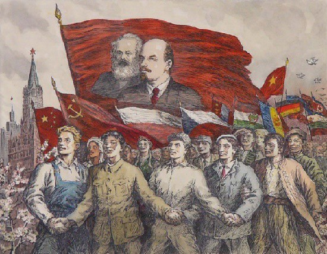

<em>Trabalhadores chineses e soviéticos sob as bandeiras de Marx-Lenin. Artista soviético ucraniano Vasily Kasiyan (1896-1976)</em>

De acordo com um [estudo](https://journals.sagepub.com/doi/abs/10.2190/B2TP-3R5M-Q7UP-DUA2) de Vicente Navarro (Johns Hopkins University), publicado no International Journal of Health Services, “ao contrário da ideologia dominante, o socialismo e as forças socialistas têm sido, em grande parte, mais capazes de melhorar as condições de saúde do que o capitalismo e forças capitalistas. " Ele afirma que “a experiência histórica do socialismo não foi de fracasso. Ao contrário: foi, em grande parte, mais bem-sucedida do que o capitalismo na melhoria das condições de saúde das populações mundiais”.

Um conhecido [estudo](https://www.ncbi.nlm.nih.gov/pmc/articles/PMC1646771/) publicado no American Journal of Public Health descobriu que "os países socialistas geralmente alcançaram melhores resultados de PQL [qualidade de vida física] do que os países capitalistas em níveis equivalentes de desenvolvimento econômico". Esses resultados foram verificados em um [estudo](https://journals.sagepub.com/doi/abs/10.2190/EQUY-ACG8-X59F-AE99) posterior, publicado no International Journal of Health Services, que descobriu que "em geral, as nações com regimes de esquerda fortes têm resultados de saúde mais favoráveis ​​(por exemplo, expectativa de vida mais longa e taxas de mortalidade mais baixas) do que aqueles com regimes de direita fortes."

O economista ganhador do Nobel Amartya Sen (Harvard University) foi o autor de um [estudo](https://onlinelibrary.wiley.com/doi/epdf/10.1111/j.1468-0084.1981.mp43004001.x) que examinou a qualidade de vida em países em desenvolvimento. Ele descobriu que "claramente o desempenho relativo dos países comunistas é superior", levando-o a observar: "Um pensamento que está fadado a ocorrer é que o comunismo é bom para a eliminação da pobreza". Da mesma forma, um [estudo](https://www.jstor.org/stable/2807973?seq=1) publicado na revista Population and Development Review observou "uma associação geral entre comunismo e baixa mortalidade, pelo menos entre os países pobres".

Mesmo as políticas reformistas (embora insuficientes) podem ter um efeito positivo. Um [estudo](https://citeseerx.ist.psu.edu/viewdoc/download?doi=10.1.1.489.8918&rep=rep1&type=pdf) da Texas A&M University descobriu que "os cidadãos acham a vida mais gratificante à medida que aumenta a generosidade do estado de bem-estar", concluindo que "o socialismo... fornece o potencial para melhorar a condição humana, na medida em que concordamos que fazer 'a vida tão satisfatório quanto possível 'é o padrão apropriado de avaliação."

Outro [estudo](https://journals.sagepub.com/doi/10.2190/1GY8-V5QN-A1TA-A9KJ), publicado no International Journal of Health Services, descobriu que "as tradições políticas mais comprometidas com as políticas redistributivas (econômicas e sociais) e as políticas de pleno emprego, como os partidos social-democratas, foram geralmente mais bem-sucedidas na melhoria da saúde de populações."

Continuando até hoje, os governos marxista-leninistas permanecem, em quase todos os casos, o [melhor governo absoluto](https://gowans.blog/2011/12/20/we-lived-better-then/) em todas as histórias de suas respectivas nações - especialmente para os [pobres e as minorias](https://www.theguardian.com/artanddesign/shortcuts/2016/jan/24/racial-harmony-in-a-marxist-utopia-how-the-soviet-union-capitalised-on-us-discrimination-in-pictures) - e fazem uma falta profunda à [maioria das pessoas](https://zen.yandex.ru/media/pozhivomu/92-rossiian-hotiat-vernutsia-v-sssr-mnenie-medvedeva-idealizirovat-sovetskii-soiuz-ne-nado-5de92305ec575b00b19afb17) que viveram sob o comunismo (e não mais), [que também lamentam profundamente o seu fim](https://news.gallup.com/poll/166538/former-soviet-countries-harm-breakup.aspx). Os comunistas [salvaram o mundo](#A-URSS-foi-a-maior-responsável-pela-derrota-dos-nazistas) de Hitler e do fascismo, levaram os [humanos ao espaço](https://en.wikipedia.org/wiki/Yuri_Gagarin); eles uniram e avançaram a China de uma [nação atrasada e subserviente](https://en.wikipedia.org/wiki/Opium_Wars) à posição da próxima superpotência mundial. O comunismo fez de Cuba um [líder internacional na medicina](https://www.who.int/mediacentre/news/releases/2015/mtct-hiv-cuba/en/), que recentemente [salvou a Itália](https://www.theguardian.com/world/2020/may/06/doctor-diplomacy-cuba-seeks-to-make-its-mark-in-europe-amid-covid-19-crisis) muito mais rica durante o COVID-19 - que mesmo com embargos e sendo uma ilha pobre e sem recursos naturais, vai produzir 100.000.000 (100 milhões) de doses de sua vacina e 5 tipos de vacina, uma delas sem necessitar de injeção, enquanto no Brasil estamos chorando por insumos dos EUA e da China - transformou a RPDC em uma [potência nuclear de ponta](https://www.bbc.com/news/world-asia-42162462) e libertou mais partes do planeta dos [impérios mais poderosos do mundo](https://www.globalresearch.ca/us-has-killed-more-than-20-million-people-in-37-victim-nations-since-world-war-ii/5492051) - com mais frequência e mais com sucesso - do que qualquer outra ideologia ou sistema, desde então.

O capitalismo [forçou violentamente](https://www.marxists.org/archive/lenin/works/1916/imp-hsc/) o seu caminho em quase todas as facetas de todos os cantos do mundo, e os estados socialistas são os únicos projetos que já ameaçaram resistir, repelir e derrubar essa dominação (nem os anarquistas conseguiram o mesmo), e apenas os projetos marxistas-leninistas já se aproximaram a realização desse objetivo, até agora, na história. [O comunismo funciona](https://gowans.blog/2012/12/21/do-publicly-owned-planned-economies-work/), e funciona tão eficazmente, o tempo todo, tanto que a única maneira de fazê-lo parar de funcionar é fazer com que [os impérios mais poderosos existentes intervenham](https://en.wikipedia.org/wiki/Allied_intervention_in_the_Russian_Civil_War) em oposição a ele, e mesmo eles só podem orgulhar-se de um sucesso misto. O comunismo sempre funcionou, sempre funcionará e [continua a funcionar](https://streamable.com/x4vgp5) neste exato momento, mesmo que você continue a negá-lo.

A noção de "fracasso" do comunismo é amplamente definida pela propaganda ocidental. É uma tentativa deliberada de qualificar o contexto da rivalidade entre capitalismo e socialismo como uma espécie de competição equilibrada, em que venceu o melhor competidor - especificamente apoiando-se na Guerra Fria e, portanto, com essa vitória, o argumento mais amplo. A noção geral que esse criador de mitos americano tenta colocar em sua cabeça é que a Rússia estava no mesmo nível da Grã-Bretanha ou da América cem anos atrás, tornou-se comunista e depois ficou para trás. Que a Rússia e os Estados Unidos entraram em uma corrida juntos, e os Estados Unidos cruzaram a linha de chegada primeiro e mais rápido, provando para sempre o sucesso do capitalismo e o fracasso do comunismo, e isso é tanta investigação quanto a maioria dos ocidentais já faz neste tópico, juntamente com pontos de discussão aleatórios eles aprendem por osmose de seus vizinhos, amigos e colegas que simpatizam com os fascistas.

Mas isso é, claro, uma inversão de eventos e uma descaracterização do contexto. A Rússia estava bem atrás do Ocidente, ocupada e explorada por ele, até que se tornou comunista e então se libertou e rapidamente alcançou quase a paridade. A "corrida equilibrada" começou com o Ocidente tendo uma enorme vantagem inicial em várias frentes, em recursos, militares, população, desenvolvimento econômico, tecnologia, indústria, igualdade de gênero, igualdade racial, programação social e desenvolvimento, e então ficaram chocados ao ver o surgimento de comunistas vindo de trás, e até mesmo os superando em muitas dessas categorias. Mas mesmo essa analogia de competição falha em descrever com precisão o conflito entre socialismo e capitalismo. Uma metáfora de competição mais precisa seria comparar o comunismo versus capitalismo ao Rei da Colina, onde uma facção dominante controla a colina de uma posição entrincheirada e vantajosa, e as facções rivais, emergindo das massas abaixo, tentam derrubar a velha ordem derrubando os reis reinantes de suas posições de poder e vantagem - e nisso o marxismo-leninismo não tem igual.

E é aí que vem toda a etimologia de primeiro mundo, segundo mundo, terceiro mundo - esse fechamento da lacuna. A Rússia na década de 1910 não estava entre o primeiro mundo; não era uma nação como a Inglaterra, os Estados Unidos ou a Alemanha. Eles não eram uma economia avançada, desenvolvida e industrializada, eles estavam pouco além do feudalismo (e nada além dele em muitos aspectos). Eles eram, qualitativamente, o terceiro mundo - uma nação empobrecida e subdesenvolvida com recursos para ser extraídos, saqueados e consumidos por potências ocidentais e supervisores domésticos. Mas então a revolução comunista aconteceu, e as condições na Rússia melhoraram tanto, tão rápido, que você não podia mais chamar a Rússia de terceiro mundo - eles tiveram que inventar um novo status e esses novos termos - o segundo mundo - para esses países socialistas que fechou a lacuna de forma tão significativa. Foi assim que a URSS conseguiu se tornar a [segunda economia de crescimento mais rápido](https://artir.files.wordpress.com/2016/03/captura-de-pantalla-de-2016-05-26-10-15-23.png) do século 20, e a maior proporcionalmente (mesmo com a estagnação da década de 60 -- por causa das reformas liberais de Kruschev). E quando a União Soviética finalmente caiu, a [Rússia também ficou para trás novamente](https://upload.wikimedia.org/wikipedia/commons/1/11/Soviet_Union_GDP.gif), e grande parte do país (fora, talvez, as partes mais ricas de Moscou ou São Petersburgo) voltou a ser o terceiro mundo, onde muitas das comunidades permanecem até este dia.

>Como o socialismo é?

Esta é uma pergunta comum, especialmente entre esquerdistas emergentes e liberais radicalizados que ainda fazem perguntas sinceras, mas também não marxistas, de mentalidade liberal sobre o comunismo. Ainda tentando se distanciar (e, muitas vezes, ignorar) tentativas reais existentes de estabelecer bases materiais e reais para o socialismo na Terra, eles tentam imaginar uma "cidade sobre uma colina" do comunismo - o melhor resultado de todos os mundos e, em seguida, procurar estabelecer isso. Eles oferecem pouca maneira ou método material para realizá-lo, e todo o seu esforço neste projeto pode ser entendido como, em última análise, uma ilusão, uma vez que não produz nenhum (ou desastroso) resultado material. Idealismo puro! Os marxistas-leninistas têm uma visão inversa disso. Podemos apenas olhar para o material - para o mundo como ele realmente existe, e tirar nossas conclusões de como vemos as coisas funcionando, operando e interagindo ali. E isso produziu muitos sucessos e resultados bem-sucedidos dos quais podemos aproveitar, aprender e usar as idéias novamente para fazer avançar a revolução global mais ampla.

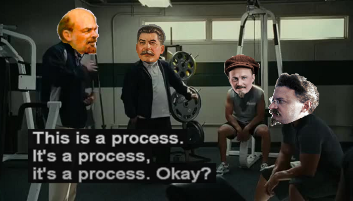

<em>Camarada Lenin explicando o socialismo</em>

Os marxistas-leninistas trabalham de um ponto de vista diferente. Temos que entender e analisar as condições materiais ao nosso redor, para levar em conta o estado atual das coisas e quais mudanças imediatas no material podemos manifestar para criar mudanças no mundo. Não brincamos com desejos elevados sobre como deve ser uma revolução perfeita, temos que nos preocupar em fazer as coisas funcionarem e continuar as operações sociais necessárias no presente. Como discutido em outro lugar, os [marxistas-leninistas não são especificamente utópicos](https://dashthered.medium.com/marxism-for-normal-people-dialectical-materialism-deb5034685a4) e rejeitam noções utópicas de imaginar um mundo perfeito e tentar construí-lo. As alterações marxistas no mundo devem ser mais diretas, mais imediatas e baseadas nas condições materiais, como realmente existem diante deles. O socialismo é o projeto de estabelecer o comunismo, transformando as condições materiais atuais em um modo de produção diferente; incluindo a derrubada da ordem capitalista dominante (realmente o principal obstáculo e principal força antagônica nisso). É um processo. Não é um estado ou categoria especial em que você entra marcando as caixas de seleção de características socialistas desejáveis ​​ou a realização de desejos que você esperava ver em sua sociedade comunista idealizada.

E entender o socialismo como um processo é entendê-lo dialeticamente. Não existe um caminho óbvio ou correto para o comunismo, e quando consideramos algo como socialista, temos que entender essas considerações sobre o mundo, e suas realidades materiais, ao analisar e compreender os movimentos existentes no planeta que tentaram engajar-se nesta transformação socialista. O que eles estão fazendo, o que estão tentando fazer e por quê? Essas são perguntas materiais e precisam de respostas que tratem as pessoas que tomam essas decisões como seres humanos.

Os movimentos proletários que conseguem obter o controle (ou mesmo o controle parcial) de um Estado-nação por meio da revolução ou outros meios não estão automaticamente em posições desejáveis, onde têm carta branca para criar qualquer sociedade ou fazer o que quiserem. Eles ainda estão, de muitas maneiras, amarrados ao sistema que existia antes deles e têm que reter e manter muito do funcionamento dos sistemas realmente existentes (que também podem ter sido interrompidos ou danificados durante a revolução). O socialismo não é uma bruxa que acende e apaga que precisa apenas ser colocada na posição correta, nem mesmo um dimmer que precisa ser aumentado lentamente, mas sim toda a maldita luz, incluindo a substituição do filamento, a fabricação da lâmpada, colocar a fiação nas paredes, e assim por diante - toda a produção e material, bem como todo o tempo e trabalho necessários para fazê-lo. Você não consegue simplesmente focar no destino final sem um mapa e rota de viagem de sua posição atual que pode fisicamente, plausivelmente levá-lo até lá, e assim [todos os estados socialistas do mundo não são compreendidos](https://www.youtube.com/watch?v=uThpIDlfcBQ) se forem analisados ​​com a omissão deste importante contexto dialético.

E aqui está o problema. Nunca foi permitido ao socialismo ter sucesso (ou fracassar) por seus próprios méritos, mas apenas sob o cerco interminável dos imperialistas hostis, que não vão parar por nada para ver todo e qualquer movimento socialista (com qualquer impulso real por trás dele) no mundo esmagado. Mesmo voltando à Guerra Civil Russa, na qual os bolcheviques haviam conquistado o poder e a eliminação da monarquia dominante com apenas um modesto derramamento de sangue, cada último império capitalista do planeta respondeu unindo forças para esmagar o estado socialista emergente. Durante a formação da União Soviética, a própria possibilidade de os trabalhadores se apoderarem dos meios de produção e derrubarem seus opressores, como visto na Rússia, foi um momento gravemente de agarramento de pérolas para as outras nações ocidentais. Tanto que todos eles se juntaram à Guerra Civil Russa e atacaram Lênin. Mesmo que estivessem em guerra e conflito uns contra os outros apenas alguns meses antes, Alemanha, Inglaterra, Estados Unidos, Japão, Canadá, China, França e outros, todos abandonaram o que estavam fazendo e encontraram uma causa comum para [se unirem em uma nova guerra](https://en.wikipedia.org/wiki/Allied_intervention_in_the_Russian_Civil_War) contra a incipiente União Soviética, porque um Estado proletário mesmo existindo, é um desafio muito real às suas reivindicações de poder. Todos eles se juntaram ao ataque global aos trabalhadores para evitar que as massas russas se libertassem - muito antes que quaisquer acusações de repressão ou tirania soviética pudessem se manifestar. A parte ainda mais notável é que Lenin continua a chutar todos os traseiros de qualquer maneira, vencendo a guerra “civil” de forma decisiva. O fim da guerra civil não impediu as incursões ou ameaças do Ocidente.

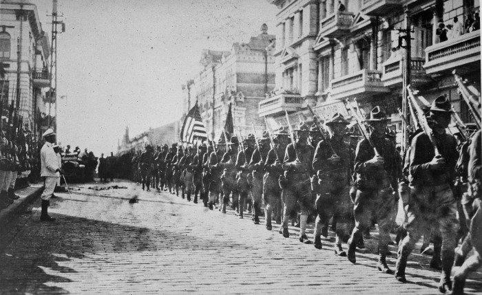

<em>Invasores americanos desfilando diante de seus aliados japoneses imperiais em Vladivostok, 1918. Quantos americanos ignoram sua própria invasão histórica da Rússia socialista?</em>

Vemos isso antes e depois, em cada tentativa de estabelecer o socialismo. Não existem exemplos em que houve um movimento socialista sem oposição capitalista externa e interferência organizando contrarrevoluções e agindo contra eles. Seja por meio de [invasões diretas](https://en.wikipedia.org/wiki/United_States_invasion_of_Grenada), [assassinatos](https://en.wikipedia.org/wiki/Thomas_Sankara), [golpes militares](https://en.wikipedia.org/wiki/1973_Chilean_coup_d%27%C3%A9tat), [bloqueios](http://www.mppre.gob.ve/en/2020/01/19/president-maduro-naval-blockade-venezuela-harm-latin-america-caribbean/), [mentiras](https://pt.wikipedia.org/wiki/Plano_Cohen), [genocídios](https://en.wikipedia.org/wiki/Indonesian_mass_killings_of_1965%E2%80%9366), [embargos](https://en.wikipedia.org/wiki/United_States_embargo_against_Cuba), [sabotagem](https://en.wikipedia.org/wiki/Kampfgruppe_gegen_Unmenschlichkeit), [extorsão](https://newsinfo.inquirer.net/880562/cop-posing-as-npa-nabbed-for-extortion), [contras](https://en.wikipedia.org/wiki/Contras), [fraude eleitoral](https://www.globalresearch.ca/us-meddling-in-1996-russian-elections-in-support-of-boris-yeltsin/5568288), [terrorismo](https://en.wikipedia.org/wiki/Operation_Condor), [sequestros](https://www.theatlantic.com/international/archive/2017/10/the-indonesia-documents-and-the-us-agenda/543534/), [subversão](https://en.wikipedia.org/wiki/PROFUNC) e [quaisquer outros meios](https://github.com/dessalines/essays/blob/master/us_atrocities.md) disponíveis para tentar arruinar, danificar, desacreditar ou destruir qualquer e todos os esforços para estabelecer o socialismo em qualquer lugar do planeta. Assim, os socialistas são forçados não apenas a construir o socialismo, mas simultaneamente a repelir os impérios mais poderosos do mundo, indefinidamente, enquanto tentam construir o socialismo. Se você negligenciar a resistência armada e ativa dos impérios, você acaba rápida e facilmente deposto por suas intervenções externas, ou pior. Isso cria uma contradição bastante sórdida, onde os únicos projetos socialistas bem-sucedidos capazes de manter material e território reais, e manter sua existência por mais de alguns meses, são (forçados a ser) altamente militarizados e construídos para resistir a ataques - tanto materiais quanto ideológicos . O socialismo nunca teve a oportunidade de ficar em paz. Nunca terá a oportunidade de provar que não é molestado. Para o socialismo ter sucesso, ele deve ter sucesso sob o fogo.

[Tentativas pacíficas e totalmente (burguesas) democráticas de estabelecer o socialismo](https://en.wikipedia.org/wiki/Salvador_Allende) (ou mesmo [moderar projetos progressistas](https://www.telesurenglish.net/news/UN-Recognizes-Venezuela-as-Top-Country-for-Right-to-Housing-20190528-0015.html) destinados a aliviar a pobreza ou reduzir a dependência, sem nem mesmo desafiar o capitalismo) encontram a [mesma reação imperialista](https://www.haaretz.com/world-news/asia-and-australia/bolivia-asked-israel-for-help-in-fight-against-leftist-terrorism-in-country-1.8229726) que busca reprimir e extinguir o início do movimento através de qualquer meio mencionado acima está mais facilmente disponível e tem probabilidade de ter sucesso e esmagar os florescentes socialistas. Os únicos projetos de esquerda que conseguem evitar esse retrocesso reacionário forçado são aqueles que se organizam, mobilizam e se [defendem ativamente dos impérios](https://en.wikipedia.org/wiki/Operation_Gideon_(2020)). É profundamente irônico que os estados socialistas históricos sejam frequentemente condenados por sua militarização, organização e mobilização; porque aqueles que carecem de tal militarização são aqueles cujas existências são mais facilmente derrubadas, suprimidas e esquecidas.

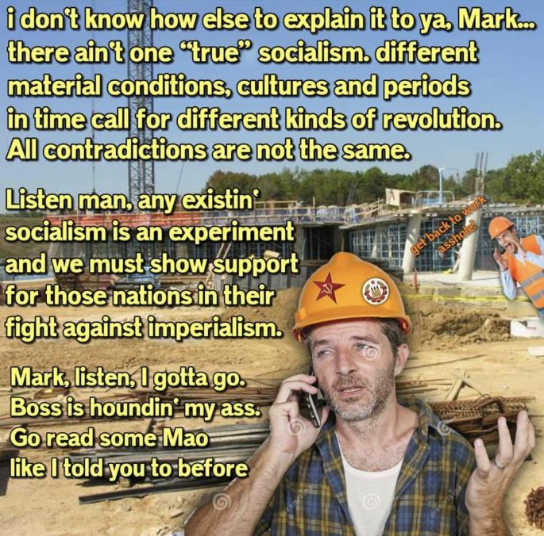

<em>Há uma triste ignorância dos esquerdistas ocidentais de que o marxismo-leninismo (e o -maísmo) são algumas doutrinas absolutistas rígidas, ao invés de metodologias altamente flexíveis e adaptáveis. (este meme e mais, siga @big_truckmemes no instagram)</em>

Talvez o maior engano já vendido seja a breve, mas muitas vezes terminal, frase "O comunismo não funciona". A mídia ocidental tem enchido incessantemente a cabeça de seus cidadãos com propaganda e mensagens, uma narrativa histórica de que o comunismo é mau e nunca funcionou e só pode fazer o mal (afinal, os proprietários dessa mídia têm um investimento bastante significativo na manutenção do status quo capitalista) , e como tal, fará grandes esforços para suprimir, minimizar ou ignorar completamente as muitas conquistas do comunismo - muitas das quais estão entre as maiores conquistas em toda a história humana. Mas quando uma investigação sincera e autêntica é conduzida, torna-se claro que o comunismo tem um histórico inimaginavelmente mais forte do que jamais teve e receberá crédito pela mídia burguesa. O problema não é que o socialismo falhe; o problema para o capitalismo é que o socialismo tem sucesso. Tão fortes são esses sucessos que ameaçam o capitalismo, e os capitalistas são obrigados a usar seus porta-vozes e recursos para suprimir, reprimir e demonizar os comunistas e o comunismo.

Mas para centenas de milhões de pessoas, especialmente aquelas que realmente viveram sob ele - o socialismo funcionou - de forma notável. Para centenas de milhões de humanos realmente existentes, os estados socialistas realmente existentes tomaram pessoas cujas condições materiais eram inadequadas (falta de comida, falta de abrigo, falta de água potável, falta de liberdade (real), falta de medicina, falta de poder político, falta de qualquer tipo de vida com dignidade) e os elevou a um lugar em que suas condições fossem adequadas (onde eles tinham essas coisas). Essa é uma conquista enorme - entre as mais significativas da história da humanidade - e é infinitamente minimizada ou ignorada, especialmente no oeste, porque nossas condições são abundantes desde que conhecemos (o que é em grande parte resultado da pilhagem do terceiro até o osso), portanto, para os ocidentais ricos, adequado parece um passo abaixo - mas para bilhões de pessoas no planeta, adequado seria uma melhoria enorme. Estas são as mudanças significativas nas condições que realmente acontecem sob o socialismo realmente existente. Estas são melhorias reais, demonstráveis, repetíveis, demonstráveis, realmente existentes em condições que alteraram e melhoraram o destino da humanidade por terem existido; algo sobre o qual quase todos os outros esquerdistas e tendências virtualmente não têm direito.

Se comparássemos a Rússia em 1910 a qualquer um dos núcleos capitalistas ao mesmo tempo, veríamos um grande contraste. Se você fizesse um “Global Power Rankings”, a Rússia de 1910 nem chegaria ao Top 5; acabaram de perder uma guerra desastrosa para o Japão, foram uma conquista frequente de potências vizinhas e [foram um pesadelo brutalmente retrógrado e repressivo](https://en.wikipedia.org/wiki/Bloody_Sunday_(1905)). Compare a economia russa de 1910 com a Grã-Bretanha de 1910 ou os Estados Unidos de 1910 - não era industrializada, muito pouca ferrovia, aproximadamente 20% de alfabetização, uma economia totalmente dependente da agricultura, profundamente endividada com a Inglaterra, terrível desigualdade de riqueza, com instituições maciças do feudalismo ainda no lugar. Enquanto muitos operários americanos assistiam a jogos de beisebol e compravam carros, o [russo típico](https://i.pinimg.com/originals/97/83/70/97837028ff0f2469088ab549d318105b.jpg) era um fazendeiro e servo analfabeto, pobre e explorado que vivia em um galpão. Você poderia facilmente dizer que eles estavam 75-80 anos atrás da Grã-Bretanha ou da América, se não mais. Em seguida, compare isso com a Rússia dos anos 1960. Sem ambiguidade, em segundo lugar em qualquer classificação de poder global, [totalmente alfabetizada](https://www.degruyter.com/document/doi/10.1515/sem-2016-0127/html), totalmente industrializada, ferrovia conectando a maior parte do país, [colocando os humanos no espaço](https://en.wikipedia.org/wiki/Yuri_Gagarin), um dos líderes mundiais em ciência, educação integral, saúde para todos os seus cidadãos, [eliminação da falta de moradia](https://en.wikipedia.org/wiki/Homelessness_in_Russia) e algumas das [produções econômicas mais impressionante da história humana](https://artir.files.wordpress.com/2016/03/captura-de-pantalla-de-2016-05-26-10-15-23.png). O [estilo de vida típico da Rússia](https://allthatsinteresting.com/soviet-youth#25) agora parecia muito com o típico americano. Em comparação com a Grã-Bretanha ou a Inglaterra dos anos 1960, eles estavam agora apenas algumas décadas atrás. Mesmo compare a Rússia de 1990 - eles estavam inventando telefones celulares e Tetris, ostentando as maiores taxas de alfabetização do mundo e um PIB per capita impressionante que a Rússia [não veria novamente até perto dos anos 2010](https://pbs.twimg.com/media/D-whk47WkAAebt_.jpg) - eles estavam apenas uma década ou mais atrás dos Estados Unidos ou da Grã-Bretanha. Eles a alcançaram quase completamente.


<em>Se isso é uma "falta de progresso comunista", por que tão raramente vemos um nível semelhante de desenvolvimento e realização de todos os países do mundo que nunca se envolveram com o comunismo?</em>

Sob os regimes marxista-leninistas, fenômenos únicos que parecem nunca acontecer em outros países igualmente pobres e explorados começam a acontecer. Países que nunca foram capazes de se industrializar antes - adivinhe o que acontece sob o socialismo? Eles se industrializam. Países que nunca conseguiram se livrar da influência e ocupação estrangeira - adivinhe o que acontece no socialismo? Eles se libertam da influência, invasão e ocupação estrangeira. Países que viram pouca ou nenhuma melhoria nas vidas de seus cidadãos mais pobres? Adivinha? Suas condições de vida disparam. Tudo isso pode parecer coisas pequenas, sem importância e curiosas para os leitores ricos de língua inglesa nos poucos países que já estão há muito industrializados e desenvolvidos, e que, eles próprios, influenciam, invadem e ocupam, mas para a grande maioria dos países e [a vasta maioria das pessoas neste mundo](https://imgur.com/DPgTCfE), essas mudanças são melhorias radicais em suas existências e vidas. Para as pessoas que carecem dessas coisas básicas, o comunismo tem um histórico incrível de resultados reais - mesmo em países muito pequenos, isolados e pobres como Cuba - enquanto o histórico do capitalismo na maioria dos países mais pobres do planeta foi péssimo, os poucos que o fizeram ousou desafiar e derrubar seus senhores capitalistas, em última análise, se sentiu melhor por ter feito isso. Da modesta amostra de países que flertaram com o socialismo marxista-leninista existente, quase nenhum sistema ou governo nas histórias dessas nações teve um desempenho melhor do que os comunistas. Ao fazer uma lista de cada governo e sistema nas histórias dessas nações, você raramente ou nunca apontará para um governo melhor, mais progressista e mais centrado no homem do que os marxistas-leninistas, quando eles estavam no poder. Na verdade, parece que para quase todos os "estados vermelhos" do passado e do presente do mundo, o marxismo-leninismo foi o auge de seu desenvolvimento político. [Tudo o que aconteceu desde então foi pior](https://www.ft.com/content/27243d36-bf9d-411f-89ed-1d118ae639f8).

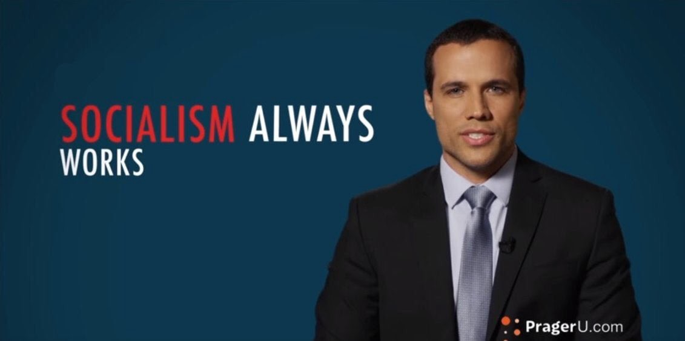

<em>Correto.</em>

Há um argumento particularmente superficial dos capitalistas, culpando os pobres por sua própria pobreza ao criticar sua alfabetização econômica. Mas, para muitos dos pobres do planeta, a alfabetização econômica é impossível porque a alfabetização ainda não foi alcançada. Os sistemas existentes em muitas das nações pobres e controladas capitalistas exploradas do mundo são inadequados para elevar as taxas de alfabetização a um nível mais alto em um ritmo significativo. Assim, muitos humanos que vivem sob o capitalismo não sabem ler e não têm instituições para ajudar. E a alfabetização é um requisito para todo o ensino superior, bem como medidas superiores de educação - é a métrica mais fundamental para medir a educação em uma escala global. E o sistema que provou, repetidamente, ter mais sucesso em fornecer as taxas de alfabetização mais altas do mundo no menor tempo possível é... O comunismo!

A alfabetização é uma medida absolutamente fundamental para o progresso e desenvolvimento de qualquer sociedade. Não pode haver aprendizagem pela Internet, nenhuma visita à biblioteca e nenhuma alfabetização econômica se não houver alfabetização. Ter uma alta pontuação de alfabetização traz consigo implicações adicionais, é claro (é uma estatística bastante potente e carregada), pois também implica pelo menos algum nível de igualdade de gênero (as mulheres aprendem a ler também), desenvolvimento de infraestrutura (a fim de aumentar a alfabetização, você deve ter escolas e métodos para trazer as crianças para a escola e da escola) e o progresso (a alfabetização pode ser considerada como uma medida da capacidade da sociedade de aprender coisas novas, como um todo). Mas não é a riqueza do capitalismo ocidental que produz os melhores resultados no que diz respeito à alfabetização. Na verdade, o comunismo continua sendo o maior marcador global de todos os tempos, com um legado que persiste até uma geração desde a queda da URSS.

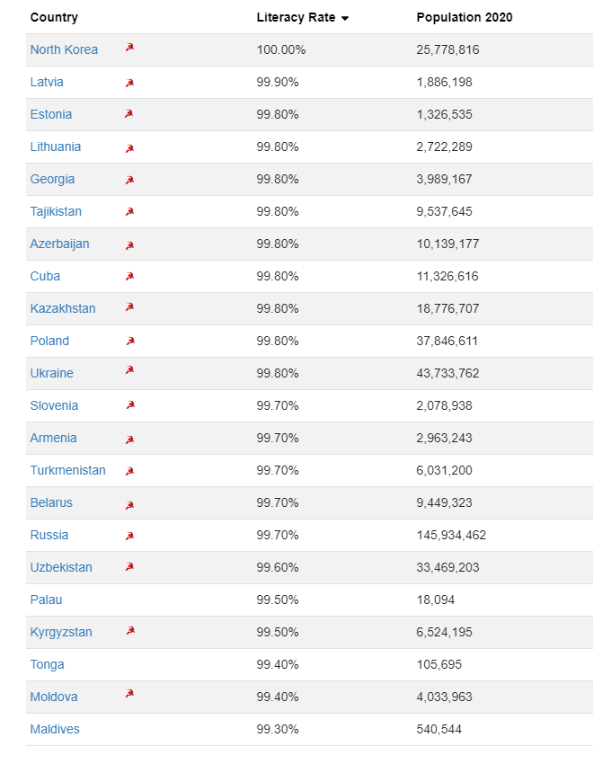

<em>Países com a foice e o martelo são países que são ou já foram comunistas</em>

O comunismo tem um histórico incomparável de [fornecer 90% ou mais taxas de alfabetização](https://ourworldindata.org/wp-content/uploads/2013/03/ourworldindata_rising-education-around-the-world-school-and-literacy.png) em uma geração inteira. Não importa se você é uma grande nação como a China ou a Rússia, uma nação mais rica como a Alemanha Oriental, ou entre as mais pobres do mundo - o comunismo oferece o que há de bom na educação em todos os aspectos. [O maior aumento na alfabetização na história de Burkina Faso](https://www.thomassankara.net/facts-about-thomas-sankara-in-burkina-faso/?lang=en) ocorreu sob o governo (tragicamente derrubado) de curta duração do marxista-leninista Thomas Sankara. Mesmo nações rurais isoladas e sem litoral como a Mongólia, onde mais de um terço da população era nômade na época, foram capazes de quebrar o 90º percentil de alfabetização sob suas administrações socialistas. [Este histórico comprovado](https://unesdoc.unesco.org/ark:/48223/pf0000001300_eng) de fornecer à humanidade a mais útil das ferramentas humanas é em si uma tremenda conquista. [E o sistema era gratuito](https://www.revolutionarydemocracy.org/archive/PubEdUSSR.htm). Não há melhor sistema disponível - especialmente para as nações mais pobres e exploradas do planeta - para melhorar a alfabetização e a educação de sua nação de forma mais rápida e completa do que o socialismo. Mas é claro que a alfabetização é apenas a ponta do iceberg. O sistema educacional soviético produziu muitos dos maiores cientistas, médicos, escritores, engenheiros e pensadores do mundo.

Uma crítica frequente e lamentavelmente imprecisa ao comunismo geralmente envolve uma referência direta ao iPhone e se ele poderia existir sem o capitalismo. Mas, como acontece com quase todas as críticas liberais ao comunismo, é na realidade o completo oposto que é verdadeiro - sem o comunismo não haveria iphone. Foi o engenheiro soviético [Leonid Kupriyanovich](https://en.wikipedia.org/wiki/Leonid_Kupriyanovich) quem inventou o telefone celular, e os cientistas soviéticos por trás do LED, computador pessoal, satélites e muito mais que tornaram os iPhones possíveis.

A noção de que inovação e invenção estagnam sob o socialismo é comprovadamente retrógrada. Para quase todos os estados socialistas passados ​​e presentes do mundo, seu período socialista foi o prolongamento das histórias das nações onde experimentaram o mais rápido avanço e desenvolvimento em campos como a ciência e a medicina. Nações como o Vietnã e a China, que antes eram sociedades agrárias subdesenvolvidas, avançaram para se tornarem líderes mundiais em tecnologia a apenas uma geração e meia de sua libertação socialista contra a ocupação de potências e influências imperiais. Na verdade, se o comunismo está "segurando a China" à medida que [sua tecnologia ultrapassa os Estados Unidos](https://www.cnet.com/news/5g-will-change-the-world-and-china-wants-to-lead-the-way/), então devemos nos perguntar, por que todas as nações não comunistas não passaram a China nos últimos anos? Os soviéticos foram, e continuam sendo, líderes em viagens espaciais, do Sputnik a Yuri Gagarin, continuando até a espaçonave soviética Soyuz, que [continua sendo o principal método de trânsito](https://en.wikipedia.org/wiki/List_of_human_spaceflights_to_the_International_Space_Station) para fora do planeta dos humanos até hoje. E o enorme catálogo de invenções e realizações soviéticas fala por si:

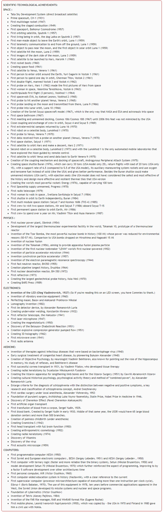

Muitos deles permanecem entre as descobertas mais importantes e pertinentes que definem nossa existência tecnológica moderna, mas nas mentes de muitos liberais inconscientes, não são percebidos como contribuições comunistas para a humanidade. Apesar de ter uma população menor em comparação com os Estados Unidos ou a Europa alinhada pela OTAN, a União Soviética foi capaz de ir de igual para igual em ciência, tecnologia e avanços militares - alcançando rapidamente a quase paridade, apesar de ter começado a partir de um déficit tecnológico em comparação. E em muitas áreas, os soviéticos até ultrapassaram o Ocidente, incluindo a eliminação do sexismo e [trazendo as mulheres para os campos STEM](https://www.smithsonianmag.com/smart-news/soviet-russia-had-a-better-record-of-training-women-in-stem-than-america-does-today-180948141/), algo que o Ocidente ainda luta hoje (e os elementos mais reacionários [tentam demonizar a URSS](https://www.economist.com/europe/2019/07/18/why-half-the-scientists-in-some-eastern-european-countries-are-women) por essa conquista). Não houve “falta de inovação” na União Soviética; na verdade, houve uma abundância dela durante a URSS; [crescimento e progresso tecnológico nunca vistos antes](https://artir.files.wordpress.com/2016/03/captura-de-pantalla-de-2016-05-26-10-15-23.png) e nunca mais nessas partes do mundo.

Claro, os marxistas não traçam linhas arbitrárias de separação entre ciências e ciências sociais - eles são um e o mesmo, e aqui também, os marxistas-leninistas podem se orgulhar de um dos maiores registros da história humana por se posicionar [contra o racismo](https://www.theguardian.com/artanddesign/shortcuts/2016/jan/24/racial-harmony-in-a-marxist-utopia-how-the-soviet-union-capitalised-on-us-discrimination-in-pictures), o sexismo, pobreza, desemprego e falta de moradia. Ao contrário da narrativa cheia de enganos que os ocidentais preferem adotar, a União Soviética teve um histórico de luta contra o racismo, promovendo [um grau significativo de igualdade de gênero](https://en.wikisource.org/wiki/Constitution_of_the_Soviet_Union_(1977,_Unamended)), e conseguiu fazer um trabalho melhor do que quase qualquer outra civilização na história para resolver pobreza, desemprego e falta de moradia.

Os ganhos para as mulheres sob o comunismo estão entre os ganhos mais significativos para as mulheres já feitos no planeta. [Nações nas quais as mulheres eram anteriormente consideradas cidadãs de segunda classe](https://china-cee.eu/2020/04/01/albania-social-briefing-albania-and-gender-inequality/) ou, em alguns casos, [propriedade literal](https://en.wikipedia.org/wiki/Wang_Dingguo), tornaram-se comunistas e consagraram novas leis de igualdade de gênero nunca antes vistas na constituição. Mulheres que antes eram trocadas, compradas e vendidas por capitalistas e senhores feudais podiam fugir para os comunistas, onde encontrariam proteção e aliados, oferecendo a oportunidade de libertação por meio da revolução. Muitos iriam servir aos partidos comunistas de sua nação - e embora essas transições para a plena igualdade de gênero fossem frequentemente imperfeitas ou incompletas, as condições materiais para as mulheres melhoram permanentemente quando os comunistas estão no poder.

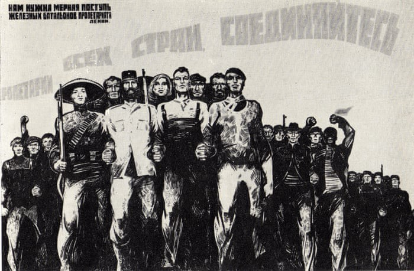
<em>Arquivo Wayland Rudd/Yevgeniy Fiks/Flint (pôster soviético dos anos 1960)</em>

Na verdade, é bastante revelador que quase toda a "propaganda" soviética (você pode realmente chamá-la de propaganda quando diz verdades exatas?) sobre os Estados Unidos se manteve incrivelmente bem ao longo dos anos, e repetidamente provou não ser apenas preciso, mas [preciso](https://imgur.com/MCTKPnV), [comovente](https://www.youtube.com/watch?v=S3ezma9cLEs) e [específico](https://www.reddit.com/r/sendinthetanks/comments/iiicrj/lmao_ussr_calling_out_the_military_industrial/) sobre a [realidade americana](https://www.youtube.com/watch?v=Hf_bQ3BFwao). [Há um vídeo da CIA dos anos 80](https://www.youtube.com/watch?v=n83EdAS1JRc) sobre a visão da URSS sobre o modo de vida americano, que envelheceu muito mal para a CIA e os EUA, mas como um bom vinho para a URSS e os comunistas em todo o mundo. Não há uma única declaração falsa dos soviéticos contida nele. A cena final do vídeo, mostrando um filme soviético em que policiais americanos reprimem e [espancam manifestantes pacíficos](https://streamable.com/u2jzoo), é como [olhar para uma bola de cristal e ver 2020 com perfeita clareza](https://twitter.com/myVPM/status/1267605983641075712). Não é uma coincidência profunda ou uma seleção de dados - ao invés disso, o resultado esperado de uma análise marxista cientificamente correta da América. Daí a precisão.

Uma das características que definem a maior parte do “mundo desenvolvido” é que seus cidadãos têm acesso à saúde. Os EUA são frequentemente considerados a estranha exceção a isso, e o argumento de que todos os outros países desenvolvidos os possuem é frequentemente usado em apoio à saúde universal na América. Claro, o conceito desta linha de raciocínio é que o resto do mundo, onde vive a grande maioria da humanidade, não tem acesso universal a cuidados de saúde adequados (nem se espera que tenham entre os cidadãos ricos do "mundo desenvolvido" - os sistemas de saúde são complicados e caros). No entanto, para as nações que se tornam socialistas, isso geralmente muda dramaticamente.

Entre os sistemas de saúde mais bem-sucedidos já criados estava o pertencente, mais uma vez, à União Soviética, que [tinha o maior número de médicos per capita](https://www.marxists.org/archive/newsholme/1933/red-medicine/index.htm) do mundo. Mais do que o dobro dos Estados Unidos e [significativamente mais](https://www.sciencedirect.com/science/article/abs/pii/0735675784900482) do que qualquer país capitalista - mesmo os muito ricos. Após a revolução de outubro, [a expectativa de vida disparou para os cidadãos da URSS](https://en.wikipedia.org/wiki/Demographics_of_the_Soviet_Union). Uma criança recém-nascida em 1926–27 tinha uma expectativa de vida de 44,4 anos, acima dos 32,3 anos, apenas trinta anos antes. Em 1958-1959, a expectativa de vida dos recém-nascidos subiu para 68,6 anos. Essa melhora foi vista por si mesma como uma prova imediata de que o sistema socialista era superior ao sistema capitalista. Por que nem todas as nações não-comunistas do mundo estão vendo sua expectativa de vida dobrar da mesma forma que os soviéticos? Também vale a pena lembrar o [enorme papel desempenhado pela União Soviética em ajudar a erradicar a varíola](https://www.theguardian.com/commentisfree/2020/jul/28/coronavirus-smallpox-vaccine-eradicated).

Claro, a URSS não está sozinha nesta categoria de conquistas médicas do socialismo. [Cuba está entre os líderes mundiais da ciência médica](https://www.who.int/mediacentre/news/releases/2015/mtct-hiv-cuba/en/) - tendo feito uma das descobertas médicas mais significativas do século. Uma pequena ilha com recursos esgotados, sob um dos maiores e mais longos embargos econômicos de toda a história, de alguma forma atinge maior expectativa de vida e menor mortalidade infantil do que os Estados Unidos. Isso é bastante estranho para uma falha de sistema, não? Se o socialismo é um fracasso, vale a pena perguntar por que a grande maioria dos sistemas capitalistas do mundo não pode atingir esse nível de saúde para seus cidadãos. Na verdade, os Estados Unidos têm dificuldade em acompanhar essa pequena, pobre, com recursos esgotados, cercada e embargada na Ilha do Caribe que tanto frustrou a crueldade global da América.

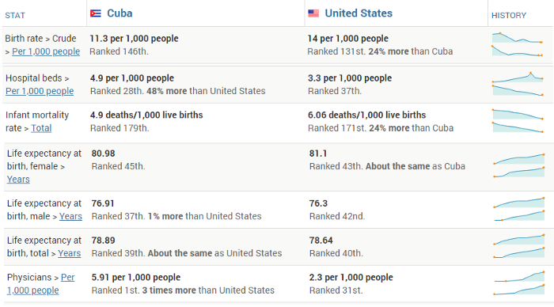

<em>https://www.nationmaster.com/country-info/compare/Cuba/United-States/Health</em>

É, talvez, na mais recente crise global da COVID-19, que o comunismo está novamente tendo seus melhores momentos no campo da medicina. Inicialmente, [o Coronavirus foi vendido aos ocidentais](https://www.nytimes.com/2020/10/13/opinion/trump-china-coronavirus.html) como causador de crise e catástrofe sobre a China e o Oriente, enquanto as [nações capitalistas ocidentais se asseguravam](https://www.theatlantic.com/ideas/archive/2020/02/why-democracies-are-better-fighting-outbreaks/606976/) de que a COVID não seria páreo para sua liberdade e preparação. Em vez disso, o oposto aconteceria. Enquanto as nações mais capitalistas de direita (que se tornaram fascistas) - Brasil, Índia e Estados Unidos - tiveram o pior e mais incompetente tratamento da doença, incluindo os piores e mais desastrosos surtos do mundo; **foram os estados socialistas do mundo que lutaram contra a COVID-19 de maneira mais plena e bem-sucedida do que qualquer outra nação do planeta**. A merda do comunismo funciona, de novo.

Quando a China sofreu um surto rápido, o presidente Xi supervisionou a construção não de um, mas de dois hospitais modernos de tamanho normal (mais de 1.200 leitos) - [fazendo-os aparecer magicamente em duas semanas](https://www.cnbc.com/2020/01/31/pictures-china-builds-two-hospitals-in-days-to-combat-coronavirus.html) para conter o vírus e fornecer cuidados de saúde para os cidadãos chineses necessitados. Este é possivelmente o maior feito da engenharia do século até agora, mas não foi discutido. Os ocidentais adoram apontar para a Nova Zelândia ou Coréia do Sul para sua resposta ao COVID-19, mas são forçados a omitir ou ignorar deliberadamente o [sucesso do Vietnã](https://ourworldindata.org/covid-exemplar-vietnam) em conter o vírus e prevenir mortes, pois ele ofusca a todos. Na verdade, [a maioria dos navios de cruzeiro afetados pelo COVID sofreram níveis semelhantes de baixas](https://www.worldometers.info/coronavirus/) quanto toda a nação do Vietnã, cem milhões de pessoas. Mas talvez a mais heróica das vitórias comunistas contra o COVID-19 venha da Itália, um rico demi-core capitalista, [cujo sistema de saúde quase entrou em colapso](https://edition.cnn.com/2020/03/19/europe/medical-students-coronavirus-intl/index.html) durante o pior da pandemia. Quando a Itália clamou por ajuda, não foram os Estados Unidos, nem a União Europeia que vieram em seu socorro. Não, [foi a minúscula nação-ilha de Cuba](https://www.reuters.com/article/us-health-coronavirus-cuba-idUSKBN219051), mais uma vez com um peso bem acima do seu peso, que enviou as brigadas de médicos para a Itália e tirou o país do abismo. Estas são as histórias de sucesso mais incríveis em um ano incrivelmente sombrio e nenhum meio de comunicação capitalista pode discutir razoavelmente qualquer uma delas, porque todas as vitórias contra COVID-19 pertencem ao comunismo.

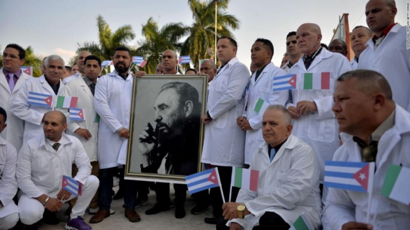

<em>Médicos italianos com seus salvadores cubanos compartilhando palavras de elogio a Fidel Castro.</em>

A ideia de que o capitalismo precisa vender, tanto no mercado interno quanto no exterior, é que o comunismo é um obstáculo ao crescimento nacional. A ideia de que essas nações tolas, imprudentes e descuidadas que se atrevem a mergulhar na jarra do comunismo acabam presas no melado econômico, enquanto as nações capitalistas os envolvem ao longo do curso - é uma ideia que não mapeia bem a realidade. Foi ninguém menos que [a União Soviética que provou ser a segunda economia de crescimento mais rápido](https://artir.files.wordpress.com/2016/03/captura-de-pantalla-de-2016-05-26-10-15-23.png) do século XX, atrás apenas do Japão. Há uma razão pela qual muitas das escolas, bibliotecas, hospitais, edifícios cívicos e infraestrutura nos antigos estados soviéticos foram todos construídos durante o período soviético, e porque tão poucos novos desenvolvimentos nessas categorias surgiram desde a queda do URSS.

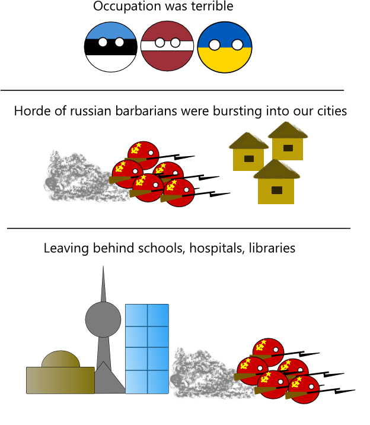

De fato, dois dos mais rápidos e completos períodos em que a pobreza acabou para centenas de milhões de pessoas no mundo nos últimos cem anos ocorrem na União Soviética sob Stalin e na China sob Mao - entre suas maiores conquistas para os ocidentais vai negar eternamente o devido louvor. E para envergonhar os dois, [Xi Jinping está atualmente acabando com a pobreza](https://economictimes.indiatimes.com/news/international/business/china-lifts-over-68-million-people-out-of-poverty-in-5-years-report/articleshow/62863326.cms) em uma escala sem precedentes - a redução da pobreza na China agora é [a redução mais dramática da pobreza](https://news.cgtn.com/news/2019-10-17/Graphics-Ending-China-s-poverty-by-2020-KREfWKGkIU/index.html) para a humanidade em toda a história. Na verdade, se a China for removida da equação, [a pobreza está piorando para a humanidade](https://www.youtube.com/watch?v=YRWt85Xq_OU) - mas o crescimento da China é tão grande que compensa todo o déficit mundial e mais um pouco. Centenas de milhões de pessoas sem casa, sem água potável, sem emprego, sem educação, sem saúde ou remédios - elas agora têm essas coisas, e as têm porque os marxistas-leninistas governam a China. Apesar da gargalhada de liberais cada vez mais desconfortáveis ​​sobre como "[é realmente por causa do capitalismo](https://liberation.neocities.org/site/china.html)" que isso está acontecendo, é preciso perguntar por que toda a prosperidade capitalista está atualmente concentrada nos países comunistas do mundo.

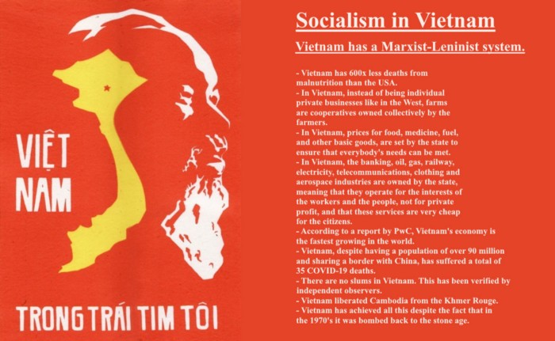

<em>[Mais sobre a história do sucesso do Vietnã](https://journalworker.wordpress.com/2020/07/10/the-tremendous-but-secret-success-of-socialist-vietnam/)</em>

Na verdade, como a fragilidade do sistema capitalista ocidental "hipereficiente" (mas na verdade nem um pouco eficiente, apenas despojado para maximizar os lucros), reduzido pela COVID-19, está agora claramente em exibição para que todos vejam, também é a profundidade e resiliência dos sistemas socialistas no mundo em exibição. Enquanto os países ocidentais entram em recessão e depressão, China, Vietnã, Laos e Coréia do Norte estão passando por períodos de crescimento econômico triunfante. Na verdade, a economia do Vietnã, uma vez dilacerada pela guerra e estagnada, está se desenvolvendo rapidamente. [Cuba emergiu claramente como a joia da coroa das ilhas do Caribe](https://www.theguardian.com/world/2016/may/03/cuba-puerto-rico-us-relations-poverty-debt-corruption-cold-war) (certamente a melhor para se nascer, especialmente se nascido na pobreza, como a maioria dos humanos), e [outros projetos socialistas emergentes](https://www.npr.org/sections/goatsandsoda/2019/11/26/781199250/how-evo-morales-made-bolivia-a-better-place-before-he-was-forced-to-flee), bem como [aqueles que conseguiram escapar da tomada neoliberal do mundo](https://112.international/politics/lukashenko-to-protesters-you-will-become-poor-people-with-outstretched-hands-53938.html) despercebida está descobrindo seu segundo vento, enquanto um sistema capitalista global gaseado luta por ar. Os melhores dias de prosperidade para a ordem mundial capitalista podem ter ficado muito para trás, mas os dias mais brilhantes para o socialismo estão apenas começando a despontar.

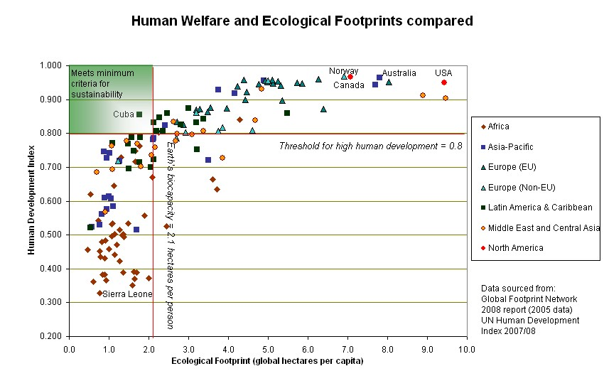

<em>Cuba, fornecendo um modelo de sustentabilidade e desenvolvimento que todo o globo - todas as oito bilhões de pessoas - poderia alcançar adequadamente em um curto espaço de tempo.</em>

“Comunismo significa sem comida.” Esta não é uma declaração feita com análise, investigação, informação ou compreensão. Esta é uma declaração feita para bloquear o debate, para encerrar a discussão. Para interromper qualquer desafio adicional das idéias comunistas e descartar a noção sem sequer pensar duas vezes, ou uma gota de insight. Porque quando a investigação é aplicada, a afirmação não apenas se estilhaça, é, como a maioria das críticas capitalistas, exatamente ao contrário, e comprovadamente. A tentativa dos liberais é associar o comunismo à fome, de modo a tornar a primeira ideia tão desagradável quanto a última. Claro, a grande maioria das fomes ocorre sob os sistemas capitalistas, mas os liberais não têm interesse na análise real - para eles, a fome só conta quando acontece sob o comunismo (sugerindo que eles não se importam com as vítimas da fome, apenas como eles podem usar o evento como um porrete político).

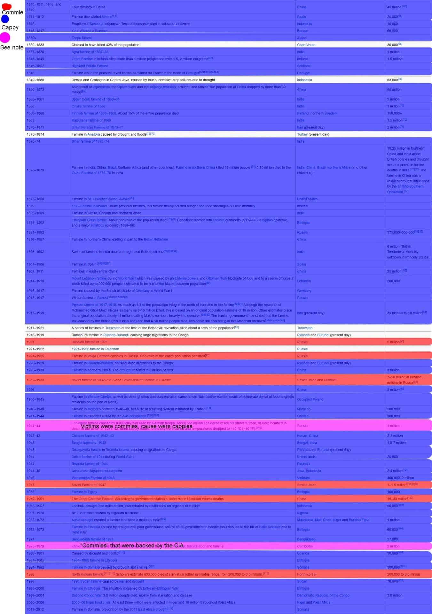

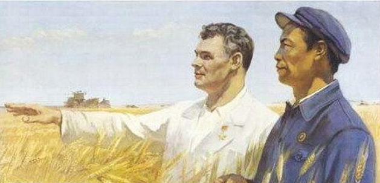

<em>https://www.youtube.com/watch?v=NUO7_SiJCpw</em>

A falsa acusação de que a fome ucraniana de 1930 foi um ato de genocídio é seu próprio assunto para [outro ensaio](#A-fome-ucraniana-holodomor), embora os livros [Blood Lies](http://www.rationalrevolution.net/special/library/tottlefraud.pdf), de Grover Furr, ou [Fraud, Famine and Fascism](http://www.rationalrevolution.net/special/library/tottlefraud.pdf), de Doug Tottle, sejam bons pontos de partida. Além disso, esta foi essencialmente a última fome que a União Soviética veria (havia alguma insegurança alimentar resultante da Segunda Guerra Mundial também - a Armênia tinha fome em todos os regimes anteriores, tendo sido inclusive vítima de genocídio pelo Império Otomano, sob Stalin eles recebiam ALGUMA comida, mesmo durante uma guerra mundial. Com Gorbachev isso mudou de cenário, e AÍ SIM houve fome séria). Na verdade, foram os comunistas que acabaram com a fome, pois, quando os comunistas chegarem ao poder, as nações que antes haviam passado pela fome com frequência e consistência, viram esse ciclo terminar para sempre. É bastante conhecido que, neste ponto, pelo menos entre os comunistas, agora é bem sabido que [a URSS na verdade consumia mais calorias por pessoa](https://www.cia.gov/readingroom/docs/CIA-RDP84B00274R000300150009-5.pdf) do que os EUA (de acordo com a CIA, nada menos).

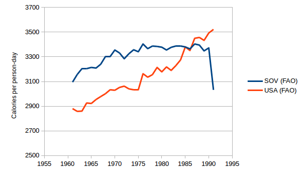

Acontece que o socialismo realmente significa mais comida. Havia problemas de insegurança alimentar sob Kruschev, mas não houve mais fome depois que a URSS se industrializou. Esse é um ponto bastante importante que raramente é trazido para o discurso. Vemos uma história semelhante com a [China de Mao](https://monthlyreview.org/commentary/did-mao-really-kill-millions-in-the-great-leap-forward/).

>Mao Zedong chegou ao poder em 1949. Entre 1900 e 1948, a China tinha em média cerca de 800.000 pessoas morrendo de fome por ano. Isso foi antes de Mao chegar ao poder. Por alguma razão, os críticos capitalistas esperam que Mao seja literalmente capaz de fazer mágica e transformar um país dominado pela fome em um país com segurança alimentar durante a noite. Não é assim que a palavra real funciona. Sim, houve uma fome, mas ocorreu em 1958, apenas uma década após a revolução, e durou cerca de três anos. Ainda era muito cedo na transformação do país antes que ele tivesse totalmente estabelecido a segurança alimentar.
Existem três coisas que devem ser observadas.
Primeiro, esta foi a última fome na história da China. Mao não deve ser visto como a pessoa que causou a fome, mas a pessoa que aboliu a fome industrializando e coletivizando os campos do país. Em segundo lugar, não se deve ignorar a tendência geral acontecendo no momento. Embora em 1958 o país não tivesse se desenvolvido o suficiente para ir além da fome, estava se desenvolvendo em um ritmo incrivelmente rápido. Na verdade, sob Mao, a expectativa de vida da população quase dobrou. Isso leva em consideração as pessoas que morreram de fome, mas o fato é que o país estava se desenvolvendo tão rápido que não compensou essa tendência. Em terceiro lugar, a porcentagem de erro humano em relação aos desastres naturais que contribuiu para isso não muda o fato de que não há evidência de intencionalidade. Mao não matou ninguém. Erros são erros, e retrospectiva é 20/20. Pessoas que chamam Mao de “assassino” ou “açougueiro”, parece ter a implicação de que ele matou milhões intencionalmente, quando na realidade ele estava tentando desenvolver o país o mais rápido possível para que as pessoas não tivessem que viver na pobreza abjeta não mais.
Isso não significa negar que as falhas na política governamental podem ter agravado a fome, sem dúvida isso é verdade. Mas é impossível saber o quão diferente poderia ter sido com políticas diferentes. Os números em si são sempre exagerados para que o número de mortos seja o mais alto possível, e então toda a culpa é colocada em Mao pessoalmente, sem qualquer consideração pelo grande número de desastres naturais acontecendo na época e pela longa história de fome do país, bem como o conhecimento limitado que o próprio Mao tinha.
Quando os capitalistas apontam para a fome, a implicação subjacente é que o capitalismo de alguma forma resolveria a fome, o que é incrivelmente duvidoso. As pessoas ainda lutam contra a fome nos países capitalistas desenvolvidos. Em 1950, a China tinha um PIB per capita de cerca de 7% do Haiti hoje. O Haiti é uma utopia em comparação com o que foi a China. O capitalismo resolveu a fome no Haiti? Claro que não.

Há um mal-entendido fundamental (às vezes deliberado) sobre como o capitalismo, e especialmente o imperialismo funciona. A ideia de que o imperialismo é um golpe único, uma invasão e um ataque para saque rápido - é uma forma severamente retrógrada e incorreta de entender o mundo. O objetivo não é um único saco de tesouro, mas todo o sistema de produção do tesouro nacional - qualquer que seja o tesouro (petróleo, geralmente). As nações ricas estão extraindo mão de obra e recursos do Sul Global. Nós, marxistas, somos materialistas, e examinamos o mundo examinando o que a matéria está fazendo e para onde está indo e toda a matéria está sendo sugada de alguns continentes para outros. É preciso uma mente incrivelmente ingênua e confusa para realmente acreditar que isso é o resultado de alguma inovação geral exclusivamente de um lado ou de alguma má gestão grosseira exclusivamente do outro. O imperialismo não é um saqueador com um saco de saque, mas sim um polvo com muitos tentáculos, que agarra o controle dos sistemas políticos e econômicos, aloja seus tentáculos profundamente na economia nacional e drena seus valiosos recursos e materiais, que podem continuar para se tornarem lucro para seus interesses comerciais ocidentais.

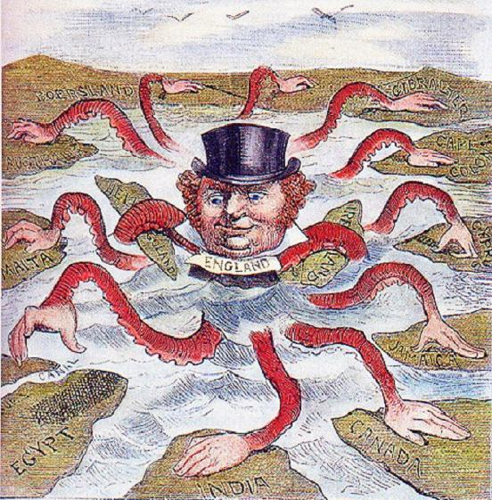

As economias capitalistas são enormes, devorando recursos de todo o mundo para alimentar e capacitar alguns poucos na América, Europa e partes selecionadas da Ásia.

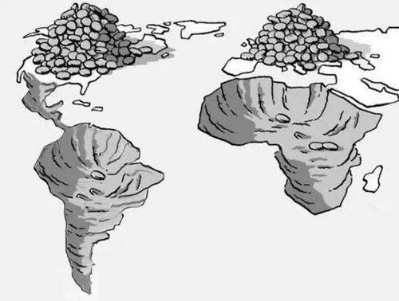

<em>Os recursos e trabalho do terceiro mundo e todos os seus produtos finais sempre acabam no mundo desenvolvido, com comparativamente pouco em termos de trabalho e recursos enviados de volta. Por que existe tanta disparidade no destino de todo o material?</em>

As economias socialistas foram muito mais localizadas e tiveram muito menos alcance do que os Estados Unidos, e seu desenvolvimento se espalhou de maneira muito mais uniforme. A América não produz toda a sua riqueza por meio da boa e velha engenhosidade americana e do trabalho árduo, apesar do que dizem as líderes de torcida do capitalismo de equipe. A força econômica americana vem do imperialismo. Os bancos detêm dívidas de quase todos os países do terceiro mundo do planeta - dívidas de natureza duvidosa e nunca serão saldadas. Como essas nações "devem dinheiro aos EUA ou à UE", os Estados Unidos extraem seus recursos (ou, mais especificamente, as empresas privadas desempenham esse papel, com o apoio do FMI/Banco Mundial, etc). Em troca de basicamente nada (como um parcela insignificante dos juros da dívida). As pessoas do terceiro mundo são então deixadas para viver na miséria, incapazes de encontrar um trabalho significativo a menos que estejam nesse setor de recursos (e mesmo assim seus baixos salários e oportunidades de baixa qualificação), e incapazes de construir ou desenvolver a economia porque todo nação já foi despojada de sua capacidade reprodutiva econômica para compensar os EUA/UE. A acumulação combinada desses bens tomados é então processada (geralmente na China) e distribuída nos mercados americanos como a abundância do capitalismo, ao invés de ser anunciada honestamente como saqueadores do imperialismo.

Se algum desses países em desenvolvimento alguma vez pensar consigo mesmo: "Ei, não deveríamos ter que pagar essas dívidas" ou "[Ei, eles nos devem dinheiro](https://www.colonialismreparation.org/en/compensations/haiti-france.html) - pela escravidão/golpe/exploração/invasão/ocupação/etc. Não o contrário!" [eles rapidamente ficam fora do poder ou mesmo assassinados](https://en.wikipedia.org/wiki/2004_Haitian_coup_d%27%C3%A9tat), e um novo ditador pró-americano/europeu (geralmente) assume o poder. Se você tem observado a Bolívia, recentemente vimos isso acontecer, (apenas para uma agradável surpresa, vimos como é a democracia real, como o povo se afirmou, e [seu compromisso com o socialismo](https://fair.org/home/after-socialist-victory-in-bolivia-media-still-whitewash-coup/), e - por enquanto - retomaram seu país). A maioria das nações tem pouco ou nenhum mecanismo para se libertar ativamente dessa hegemonia capitalista que lhes é imposta, exceto uma via comprovada - a via do socialismo. E nesta via, o marxismo-leninismo é o motor mais eficaz.

A vitória dos aliados na 2ª Guerra Mundial foi um resultado direto da filosofia marxista-leninista, aplicada à URSS durante as décadas de 1920 e 1930, e não é um exagero creditar adequadamente, sim, Joseph Stalin, bem como Marx, Engels e Lenin por ter salvado o mundo do fascismo. Após a Revolução Russa, estava claro que a destruição da União Soviética seria o projeto de longo prazo do Ocidente. A Rússia estava cercada por todos os lados por vizinhos hostis que a haviam atacado antes e planejavam atacar novamente. Com o país ainda se recuperando da Guerra Civil e Lênin agora morto, ocorre a famosa divisão entre Stalin e Trotsky. A incipiente União Soviética percebeu que estava cercada por impérios maiores e hostis em todos os lados e precisava de um plano para sobreviver nas próximas décadas.

O plano de Trotsky para proteger a URSS era a "Revolução Permanente" - a ideia de que o caminho mais seguro para a Rússia socialista sobreviver ao ataque que se aproximava era espalhar e reforçar todas as revoluções emergentes em países ao redor do mundo (como o globo tinha sido um viveiro de revoluções anteriores e posteriores à Primeira Guerra Mundial). Trotsky sentiu que, ao se concentrar em espalhar e exportar a revolução ao redor do mundo, juntamente com a "industrialização leve" (palavras do próprio Trotsky), os novos aliados que se revoltassem manteriam um ciclo de revolução sem fim em andamento, garantindo assim a segurança da Rússia revolucionária em mais e mais países do mundo que se tornam socialistas por meio dessas revoluções sem fim e sempre crescentes.

O plano de Stalin, por outro lado, era "Socialismo em um só país", que muitas vezes é mal utilizado, de forma enganosa, para implicar algum tipo de ultranacionalismo que não existia de fato. “Socialismo em um país” às vezes é traduzido com mais precisão como “Socialismo de cerco” ou “Socialismo sob cerco” em outras línguas. Stalin viu as revoluções em outras partes do mundo sendo violentamente esmagadas por exércitos profissionais treinados, com tanques e aviões e outros produtos da indústria pesada e superpesada, e concluiu que nenhum/poucos novos aliados emergiriam, e o único caminho para uma Rússia socialista para sobreviver seria um plano de intensa industrialização pesada e militarização de uma forma que permitisse à nação se defender da expansão dos militares imperialistas. A ideia era que a Rússia teria que ser autossuficiente porque a ajuda não estava a caminho e os imperialistas logo estariam voltando para outra onda de hostilidades. Toda essa indústria precisaria ser usada para defender a URSS, disse Stalin, para criar, fornecer, equipar e mobilizar o maior exército terrestre da história.

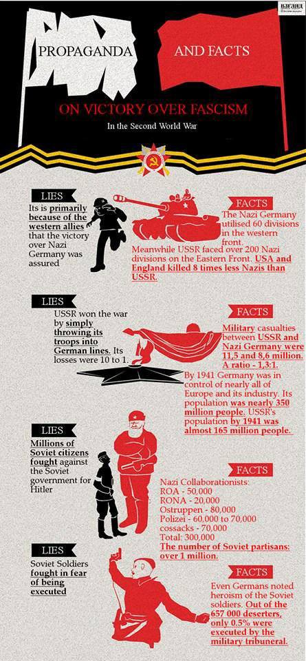

Quando Hitler iniciou a Operação Barbarossa, com a intenção explícita e declarada de [exterminar os povos eslavos](https://en.wikipedia.org/wiki/Lebensraum), sua ideia para derrotar a União Soviética era que "Você só precisa chutar a porta e toda a estrutura podre desabará." Hitler reuniu cerca de 150-200 divisões para tomar a União Soviética, reunidas entre cerca de 360 ​​milhões de pessoas que viviam na Europa controlada pelos nazistas. De toda a sua inteligência superior, conhecimento da Rússia (lembre-se de Weimar, a Alemanha fez uma parceria próxima com os militares russos até 1933), observando o desempenho da Rússia na 1ª Guerra Mundial durante a Guerra de Inverno, eles presumiram que a União Soviética e todos os seus 170 milhões de habitantes seria capaz de alocar cerca de 100 divisões, e talvez mais tarde outras 100 que estariam subequipadas.

Em vez disso, a invasão de Hitler foi enfrentada por nada menos que 400 (e alguns relatos mais de 800) divisões soviéticas totalmente armadas, devidamente equipadas e mobilizadas para defender sua pátria. Ao contrário das mentiras inventadas para o Inimigo nos Portões, os soviéticos não usaram táticas de ondas humanas e não enviaram tropas da linha de frente para a batalha sem armas. Com capacidade industrial absolutamente vasta (incluindo proezas de engenharia como reconstruir fábricas inteiras transportadas de trens nos montes Urais) que estão entre as maiores, mas menos comentadas, realizações da história da humanidade. A força soviética avassaladora, apoiada pela indústria soviética avassaladora, conforme estabelecido em planos materiais deliberados, especificamente de Lenin e Stalin, levou ao maior exército terrestre já reunido, libertando a Europa e esmagando a Alemanha nazista, acabando com a ameaça fascista.

Então, mais uma vez, porque nunca será dito o suficiente até que o capitalismo seja derrubado, obrigado a Karl Marx, Friedrich Engels, Vladimir Lenin, Joseph Stalin, Mao Zedong e aos milhões e milhões de comunistas que contribuíram para a derrota da Alemanha nazista e - sim - salvou o mundo. A porra do planeta inteiro tem uma dívida eterna com os soviéticos, mas por causa do condicionamento cerebral liberal, o mundo ocidental tem dificuldade em admitir essas verdades mais óbvias sobre a 2ª Guerra Mundial. Eles muitas vezes até tentam ridicularizar os soviéticos por seu papel de liderança neste, o mais importante de todas as vitórias humanas. Os liberais não podem nem mesmo pronunciar as palavras em voz alta, mas "Stalin e os comunistas salvaram o mundo e derrotaram Hitler" é um fato histórico e material que nunca pode ser desfeito ou tirado de nós. Foi o comunismo que derrotou o fascismo, mas ainda não foi dado crédito a quem merece, e as lições da história se perderam para os liberais.

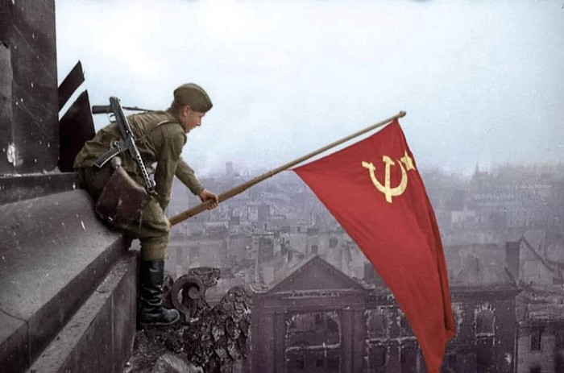

Muitas das ideias apresentadas até agora neste ensaio desejam apresentar a você, leitor, uma perspectiva radicalmente diferente sobre os últimos cem anos ou mais - mas que mapeia com mais precisão a realidade e oferece mais poder explicativo. Mais do que a narrativa liberal que você recebeu. Talvez o mais revelador seja a perspectiva da Guerra Fria. A narrativa ocidental conta uma história (um tanto fictícia) de uma malvada e insaciável União Soviética que tentou forçar o comunismo ao mundo sob a mira de uma arma, e a heróica aliança do bem - as forças da OTAN - uniram-se para conter os soviéticos e, eventualmente, sobreviveram eles (é claro, seu sistema não funciona nesta narrativa) para a vitória do mundo inteiro e o fim da história (ou não).

Aqui está uma perspectiva diferente que você nunca terá permissão para obter de fontes ocidentais "oficiais": a URSS foi a revolução - a mesma que começou em 1917 - ainda está em andamento, ainda está tentando se libertar e a outros do capitalismo global. Após o triunfo heróico sobre os nazistas, a danificada e ensanguentada URSS buscou desesperadamente uma paz com o Ocidente - que o Ocidente rejeitou - [já de olho em outra guerra imperialista para destruir o principal estado proletário mundial](https://en.wikipedia.org/wiki/Operation_Unthinkable).

>No período imediato do pós-guerra, a União Soviética propôs que a Alemanha fosse mantida como um estado totalmente desmilitarizado e convocou eleições imediatas para todos os cargos, a desnazificação completa de todas as instituições públicas e todas as propriedades pertencentes às famílias industriais alemãs (e a quem muito beneficiado com o trabalho escravo dos campos de concentração) deve ser apreendido e democratizado.
Os EUA e a Grã-Bretanha, sendo o que são, recusaram-se a essa ideia e começaram com o agora muito familiar Plano Marshall, reconstruindo todas as instituições capitalistas, sustentando as próprias indústrias (e famílias) responsáveis ​​pela morte de milhões e mantendo o antigo partido nazista membros em muitas posições-chave (nas décadas de 1960 e 1970 havia mais (ex-?) nazistas no governo alemão do que durante o Reich), em um [esforço total para reconstruir o capitalismo](https://www.wilsoncenter.org/sites/default/files/media/documents/publication/CWIHPWP58_maddrell.pdf) em uma Europa devastada pela guerra e impedir a disseminação de socialismo.

Então começamos a ver que a OTAN é uma aliança formada para proteger os nazistas, nunca deixou de se aliar aos nazistas, ajudou a defender e reconstruir movimentos fascistas em todo o mundo e os ajudou a injetar propaganda nazista no discurso ocidental como fato dominante. As fileiras da OTAN estão cheias de nazistas e simpatizantes do nazismo.


<em>A escolha das bandeiras lá atrás do batalhão de Azhov não é uma coincidência infeliz.</em>

A mídia e o governo têm retratado as políticas anticomunistas e anti-soviéticas como respostas defensivas compreensíveis ao engrandecimento soviético. De acordo com a narrativa padrão, a Guerra Fria começou em 1947, quando a Rússia provou ser uma potência expansionista e ameaçadora. Em resposta a esse engrandecimento, os EUA alertaram o público sobre a ameaça soviética. Reagimos a essa ameaça com o escudo da OTAN, armamentos, intervenções em vários países e assim por diante. A Doutrina Truman foi estabelecida, que reorientou a política externa para conter a expansão geopolítica soviética.

No entanto, na década de 80, a American Historical Association publicou um conjunto de documentos que obteve do Departamento de Estado sob a Lei de Liberdade de Informação. Esses [documentos](https://nsarchive.gwu.edu/briefing-book/russia-programs/2017-12-12/nato-expansion-what-gorbachev-heard-western-leaders-early) revelam que o Departamento de Estado **nunca** acreditou que os soviéticos tivessem qualquer intenção, interesse ou capacidade de invadir a Europa Ocidental no final dos anos 1940, 50, 60, 70 ou 80. É claro que isso é alucinante para aqueles que foram criados no pós-guerra e ouviram constantes relatos sobre a ameaça soviética na Europa. Basta perguntar a seus pais. A geração deles fez acreditar que o que precisávamos, acima de tudo, era um escudo da OTAN.

>Os capitalistas, embora clamem, por 'propaganda', sobre a agressividade da União Soviética, não acreditam que ela seja agressiva, porque estão cientes da política pacífica da União Soviética e sabem que ela mesma não atacará os países capitalistas.
>
> -- <cite>Stalin, 1951</cite>

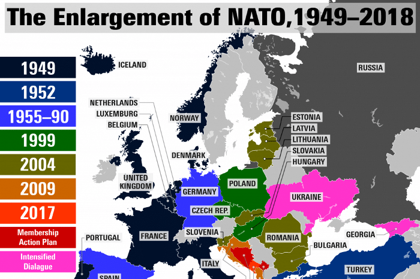

E no final, os soviéticos nunca acabaram agitando-se para a guerra. [Filmes foram feitos sobre como os EUA roubaram os soviéticos](https://en.wikipedia.org/wiki/Bridge_of_Spies_(film)) em acordos comerciais. Os soviéticos honraram constante e consistentemente seus tratados são e foram [os primeiros a recuar durante as tensões e conflitos internacionais](https://en.wikipedia.org/wiki/Cuban_Missile_Crisis#Crisis_ends). E quando a União Soviética acabou, a OTAN não acabou, nem mesmo reduziu os gastos militares. Não, apesar de prometer exatamente o contrário, [a OTAN expandiu-se continuamente e se arrastou até as fronteiras da Rússia](https://www.globalresearch.ca/nato-conquest-eastern-europe/5720668) - exatamente o que [foi prometido não fazer no final da Guerra Fria](https://nsarchive.gwu.edu/briefing-book/russia-programs/2017-12-12/nato-expansion-what-gorbachev-heard-western-leaders-early)! Em algum ponto, os ocidentais precisam ver essa aliança nazista como ela é, e começar a se perguntar quanto que sua perspectiva da Guerra Fria foi infectada.

Este é o ponto de inflexão do ensaio, onde dedico um momento para conceder - embora apenas no menor grau - o ponto que muitos leitores provavelmente já fizeram. Este ensaio apresenta uma descrição muito unilateral dos estados socialistas, com muitas de suas deficiências, erros, fracassos e crimes (sim, alguns) omitidos ou mal discutidos. E isso porque o comunismo é um tópico mais complicado do que até mesmo um ensaio de 10.000 palavras pode explorar, e há muito mais análise e discussão que deveria ir em qualquer investigação sincera dos estados marxista-leninistas do mundo. No entanto, a narrativa que você está recebendo aqui é aquela que você não pode obter da mídia ocidental, as perspectivas que você não ouviu e de onde vem o forte apoio mundial a muitos dos estados socialistas do mundo.

Quer dizer, ninguém precisa glorificar sem ambiguidades os estados socialistas do passado. Este ensaio faz exatamente isso para deixar claro - que há uma perspectiva totalmente ausente da discussão e análise existentes sobre esses países no discurso ocidental. Embora algumas partes ressoem mais fortemente do que outras com leitores diferentes, o fato é que todos esses argumentos se mapeiam muito bem na realidade e oferecem um poder explicativo considerável - algo de que as explicações liberais do mundo muitas vezes são desprovidas. Para que conste, nenhum estado socialista ficou sem seus problemas e críticas. Houve momentos em que eles foram ocasionalmente terríveis, repressivos ou equivocados, mas também estados cujos crimes foram frequentemente exagerados e apresentados de forma altamente enganosa por seus inimigos que controlam a narrativa. E da mesma forma, os sucessos da URSS foram ignorados ou mesmo suprimidos, apesar de estarem entre as maiores realizações da civilização humana. Ser literalmente incapaz de ter uma discussão sincera e honesta sobre a URSS ou o socialismo em nossa sociedade, sem anedotas depreciativas repetidas na TV e na mídia, sem absolutamente nenhum conhecimento real dos eventos ou da história daquela época - é frustrante para dizer o mínimo. Mesmo se você quiser considerar os projetos comunistas do passado uma coisa ruim (o que eu honestamente acho que você não pode, mas mesmo se quiséssemos), certamente deve haver uma maneira de falar sobre como evitar os fracassos e extrair os sucessos. E não estamos falando de batatas pequenas. Coisas como: alfabetização universal, saúde integral para todos, educação integral, pleno emprego, moradia garantida, acabar com os ciclos de fome (har har, mas sim, na verdade), dobrar a expectativa de vida, destruir nazistas e muito mais - essas não são conquistas menores. Estas são algumas das façanhas mais incríveis de qualquer civilização, e estes são todos os lugares onde nossas civilizações "ocidentais" estão falhando e entrando em colapso hoje e passando por crises. Temos soluções possíveis à nossa frente e não podemos nem mesmo falar sobre elas sem que a conversa imediatamente degenere em "Stalin matou 100 milhões, sem comida". Existem muitos esquerdistas que se autoproclamam, que ainda não ouviram os argumentos mais básicos e precisos em defesa do socialismo realmente existente, e ficaram surpresos com a escala de argumentos agora expostos a eles. Sim, todo o seu entendimento liberal do mundo está errado, e de forma prejudicial.

Uma das outras refutações não abordadas de ocidentais chauvinistas quando atacados com uma discussão sobre o comunismo é o seguinte: "Por que você não pergunta a alguém que viveu sob o comunismo?" Claro, eles não fizeram tal coisa e, se o fizessem, não gostariam dos resultados. Há piadas que se tornaram populares nos ex-estados soviéticos nas últimas três décadas, sobre a mudança na vida deles sob o capitalismo.

As pesquisas constatam que as pessoas acham que a vida era melhor sob o socialismo. Na Rússia, algumas pesquisas [mostram que mais de dois terços](https://www.levada.ru/2018/12/19/nostalgiya-po-sssr-2/) ([e em algumas pesquisas mais de 90% da população!](https://zen.yandex.ru/media/pozhivomu/92-rossiian-hotiat-vernutsia-v-sssr-mnenie-medvedeva-idealizirovat-sovetskii-soiuz-ne-nado-5de92305ec575b00b19afb17)) Lamentam a queda da URSS e sentem que a vida era melhor sob o comunismo. Da mesma forma, [72% dos húngaros sentem que a vida era melhor sob o comunismo](https://www.pewresearch.org/fact-tank/2010/04/28/hungary-better-off-under-communism/), [57% dos alemães orientais](http://www.spiegel.de/international/germany/homesick-for-a-dictatorship-majority-of-eastern-germans-feel-life-better-under-communism-a-634122.html) (porém o dado real é bem maior, explico quando estiver falando da Alemanha Oriental) sentem que a vida era melhor sob o comunismo, [81% dos sérvios dizem que a vida era melhor "durante o socialismo"](https://balkaninsight.com/2010/12/24/for-simon-poll-serbians-unsure-who-runs-their-country/), [63% dos romenos voltariam ao comunismo se dada a escolha](http://www.balkanalysis.com/romania/2011/12/27/in-romania-opinion-polls-show-nostalgia-for-communism/), [66% dos eslovacos achavam que a vida era melhor no socialismo](https://robertlindsay.wordpress.com/2010/05/16/nostalgia-for-communism-in-russia-and-eastern-europe/) e [muito mais](https://www.reuters.com/article/us-communism-nostalgia-idUSTRE5A701320091108)! Vemos essa tendência continuar na [República Tcheca](http://archive.is/bFYoy), [Macedônia](www.b92.net/eng/news/region.php?yyyy=2010&mm=11&dd=25&nav_id=71111), [Bósnia e Herzegovina](https://www.b92.net/eng/news/world.php?yyyy=2017&mm=05&dd=26&nav_id=101379), [Eslovênia](https://www.telegraph.co.uk/news/worldnews/1573974/Many-in-Slovenia-yearn-for-old-Yugoslavia.html), [Croácia](https://www.dw.com/sr/za%C5%A1to-su-u-hrvatskoj-jugonostalgi%C4%8Dni/a-18377454), [Montenegro](http://www.kurir.rs/region/crna-gora/2731189/istrazivanje-o-crnogorcima-vecina-govori-srpski-i-zali-za-sfrj), [Moldávia](http://www.hotnews.ro/stiri-esential-16427626-sondaj-aproape-45-dintre-romani-cred-regimul-comunist-insemnat-lucru-bun-pentru-romania-banatenii-cei-mai-reticenti-fata-comunism-moldovenii-cei-mai-favorabili.htm), [Albânia](http://www.osce.org/albania/286821?download=true), bem como [Armênia, Ucrânia, Quirguistão, Bielorrússia e Tadjiquistão](https://news.gallup.com/poll/166538/former-soviet-countries-harm-breakup.aspx)!

Não se trata de crianças que nunca experimentaram o comunismo, tendo equívocos ingênuos e ignorantes sobre uma utopia imaginária - a tendência mostra ser exatamente o oposto. São as pessoas mais velhas que vivem, aquelas que realmente experimentaram o socialismo, que o apóiam mais fortemente, e os jovens liberais que sofreram lavagem cerebral são os que têm maior probabilidade de rejeitá-lo... É verdade que nem todos os estados compartilharam a mesma experiência, e alguns têm, de fato, opiniões menos favoráveis ​​à URSS, mas quando agregados como um todo, é claro que a grande maioria de todas as pessoas que viveram sob o socialismo preferiram isso. Essa popularidade duradoura não se deve às acusações chauvinistas ocidentais de anseio por um status perdido de superpotência. Esse apoio, popularidade e anseio pelo comunismo é porque o comunismo sempre funciona.

O império russo era famoso por ter fome a cada 15 anos, e desde 1949 não houve mais nenhuma crise de fome exceto com as reformas de Gorbachev.

As forças produtivas não foram organizadas para ganho de capital e enriquecimento privado; a propriedade pública dos meios de produção suplantou a propriedade privada. Era ilegal contratar outras pessoas e acumular riqueza pessoal com seu trabalho.

Ela começou no mesmo nível de desenvolvimento econômico e populacional do Brasil em 1920, o que torna as comparações com os Estados Unidos, um país já industrializado na década de 1920, ainda mais espetaculares. A URSS tinha [assistência médica universal gratuita](https://www.marxists.org/archive/newsholme/1933/red-medicine/index.htm) e a maior quantidade de médicos per capita no mundo. 42 médicos por 10.000 habitantes, contra 24 na Dinamarca e na Suécia, e 19 nos EUA. A URSS teve [quase zero desemprego e crescimento econômico contínuo por 70 anos consecutivos](https://homepages.warwick.ac.uk/~syrbe/pubs/FarmtoFactory.pdf). A parte "contínua" deveria fazer sentido - a URSS era uma economia planejada, sem mercado, então quedas de mercado como no capitalismo eram praticamente impossíveis. [Toda a educação](https://www.revolutionarydemocracy.org/archive/PubEdUSSR.htm), inclusive de nível universitário, [era gratuita](https://www.revolutionarydemocracy.org/archive/anglosov.htm). A URSS tinha [99% de alfabetização](https://en.wikipedia.org/wiki/Likbez). A URSS [dobrou a expectativa de vida](https://en.wikipedia.org/wiki/Demographics_of_the_Soviet_Union#Life_expectancy_and_infant_mortality) e [eliminou a pobreza](https://gowans.blog/2011/12/20/we-lived-better-then/). Salvou o mundo do fascismo, enfrentando a maioria das divisões nazistas e matando 7 de cada 10 soldados fascistas. [Suportou o enorme custo de sangue e dor na 2ª Guerra Mundial, com as batalhas mais sangrentas da história da guerra](https://en.wikipedia.org/wiki/Eastern_Front_(World_War_II)#Casualties). Estima-se que 70% das moradias soviéticas foram destruídas pela invasão nazista. Os nazistas recuaram após a batalha de Stalingrado em 1942, 2 anos antes dos EUA desembarcarem tropas na Normandia. [Acabou com a desigualdade sexual](https://en.wikisource.org/wiki/Constitution_of_the_Soviet_Union_(1977,_Unamended)), com salários iguais para homens e mulheres exigidos por lei, mas a desigualdade sexual, embora não tão pronunciada como sob o capitalismo, foi perpetuada nos papéis sociais. Lição muito importante a aprender. Além de [ter acabado com as desigualdades raciais](https://www.theguardian.com/artanddesign/shortcuts/2016/jan/24/racial-harmony-in-a-marxist-utopia-how-the-soviet-union-capitalised-on-us-discrimination-in-pictures). Feudalismo até viagens espaciais em 40 anos. Primeiro satélite, foguete, caminhada no espaço, mulher, homem, animal, estação espacial e sondas na Lua e Marte. A produção de energia soviética per capita em 1990 era maior do que [a da UE, Grã-Bretanha ou China em 2014](https://i.imgur.com/7HIm6qi.png). A moradia era socializada por organizações comunitárias localizadas e praticamente não havia moradores de rua. As casas eram frequentemente compartilhadas por duas famílias ao longo dos anos 20 e 30 - então, ao contrário do capitalismo, não havia casas vazias, mas as casas estavam muito cheias. Nos anos 40 houve a guerra, e nos anos 50 havia vários órfãos da guerra. Os projetos de habitação em massa começaram nos anos 60, foram concluídos nos anos 70 e, nos anos 70, já havia moradores de rua, mas muitas vezes eles tinham problemas reais de saúde mental.

E quando a URSS caiu e adotou o capitalismo, [a expectativa de vida diminuiu drásticamente](https://i.stack.imgur.com/8Fj8E.png) e alcançando [7,7 milhões de mortes em excesso no primeiro ano](http://www.academia.edu/1072631/Review_Red_Plenty_by_Francis_Spufford). [2](https://www.ncbi.nlm.nih.gov/pmc/articles/PMC259165/). O capitalismo para a Rússia [trouxe 75% da população à fome](https://averdade.org.br/2011/09/capitalismo-trouxe-fome-para-75-da-populacao-russa/) e [pobreza para 40%](https://www.wsws.org/en/articles/2003/07/unpo-j28.html). O Produto Interno Bruto (PIB) per capita [caiu quase pela metade](https://upload.wikimedia.org/wikipedia/commons/9/92/Soviet_Union_GDP_per_capita.gif) após a extinção da URSS. [Uma em cada dez crianças agora vive nas ruas](https://www.theglobeandmail.com/news/world/an-epidemic-of-street-kids-overwhelms-russian-cities/article4141933/). [A mortalidade infantil aumentou](https://knoema.com/atlas/Russian-Federation/Nenets-Autonomous-District/topics/Demographics/Mortality/Infant-mortality-rate). Foi de 29,3 em 2003, o que está em torno das (atuais) Síria e Micronésia, 7,9 em 2013. A mortalidade infantil na URSS [era de 1,92](https://www.statista.com/statistics/1042801/russia-all-time-infant-mortality-rate/), literalmente a mais baixa do mundo. Na [eleição de 1996](https://en.wikipedia.org/wiki/Russian_presidential_election,_1996) manipulada pelos EUA, Yeltsin enviou tanques para dispersar o supremo soviete.

Fontes:
- [Reflections on the Overthrow of Communism](https://www.youtube.com/watch?v=z7WmYEoNtPY)
- [Left Anticommunism: the unkindest cut](https://www.greanvillepost.com/2018/10/06/left-anticommunism-the-unkindest-cut/)
- [Do Publicly Owned, Planned Economies Work?](https://www.youtube.com/watch?v=mYf3gZZFa0k&list=PL0-IkmzWbjobDdDbSC_YgZfV94BQiRIB8)
- [Going beyond money by Paul Cockshott](https://www.youtube.com/watch?v=cI01-5zhwdA)

Agradecimentos ao mossalines, dashthered, Yuri Albuquerque e Jones Manoel.

## Por que a educação no socialismo é melhor
Por que o sistema educacional é melhor no socialismo e por que o sistema educacional capitalista é uma piada?

Se você viveu na Europa Oriental/Rússia/outros países soviéticos, e estava vivo há mais de 30-35 anos, você conseguiu ver a qualidade do sistema educacional declinando, os padrões cada vez mais baixos enquanto os estudantes lutavam cada vez mais para se formar. Te digo isso depois de obter o bacharelado em Engenharia, conversando com a maioria dos professores sobre o passado e o presente e trabalhando por dois anos em educação. Mas por que o padrão baixou tanto?

Para entender isso, primeiro precisamos entender as perdas:

1. Embora os salários não fossem iguais, a desigualdade era muito baixa (a relação entre o salário máximo e o mínimo era de cerca de 3 pra 1). Em contraste com o sistema capitalista, os trabalhadores com os trabalhos mais perigosos ou difíceis tinham salários maiores do que as pessoas em posições de liderança (engenheiros, por exemplo)/funcionários do partido, etc. Essa baixa desigualdade financeira levou as pessoas a seguirem aquilo em que são boas (o que elas gostavam) a uma taxa muito mais alta do que no capitalismo.

2. A correlação entre o número de empregos em uma área específica e o número de vagas disponíveis para estudantes nessa área. O que quero dizer com isso? Digamos que o país precisasse de cerca de 1000 engenheiros químicos por ano - haveria cerca de 1000 vagas nas universidades para estudar engenharia química. Isso significava que, uma vez formado, você tinha um valor e um objetivo na sociedade. Com base em seu conjunto de habilidades e no "mercado" de trabalho, eles lhe perguntariam, uma vez formado, onde você quer trabalhar. Então, eles lhe dariam um apartamento/casa naquela cidade/localidade/aldeia.

3. O ensino era sempre gratuito.

Como essas coisas, que eram muito importantes, foram perdidas, hoje em dia, a graduação em 90% das universidades não garante que você realmente conseguirá um emprego na área que estudou e os estudantes sabem disso e não estudam muito.

O que a sociedade admirava eram pessoas instruídas, mas hoje em dia as pessoas preferem ser ricas e sem instrução porque sentem como é ruim ser um escravo assalariado.

O fato da pergunta: "Em que sou realmente bom?" se transformar em "O que compensa no mercado de trabalho de hoje?" é, em minha opinião, o maior problema. Isso faz com que as pessoas não sigam seu talento e por consequência as pessoas mais miseráveis fazem a maioria dos trabalhos.

Além disso, a qualidade dos professores educados no socialismo é surpreendente. A Europa Oriental + ex-URSS ainda tem alguns remanescentes dessa época.

Basta conferir esse vídeo, por exemplo:
https://www.youtube.com/watch?v=qw_M7kV3GLY

## Invenções soviéticas
ESPAÇO:
- Sistema de Desenvolvimento Tata Sky (transmissão direta por satélite)
- Traje espacial principal, CH-1 (1931)
- Primeiro foguete de vários estágios (1947)
- Criação da combustão encenada (1949)
- Primeiro espaçoporto, Baikonur Cosmodrome (1957)
- Primeiro satélite em órbita, Sputnik 1 (1957)
- Primeiro vivente em órbita, a cadela Laika no Sputnik 2 (1957)
- Primeiro objeto feito pelo homem a deixar a órbita da Terra, Luna 1 (1959)
- Primeira comunicação de telemetria de e para o solo, Luna 1 (1959)
- Primeiro objeto a passar perto da lua, e o primeiro objeto na órbita solar Luna 1 (1959)
- O primeiro satélite que atingiu a lua, Luna 2 (1959)
- Primeiras imagens do lado escuro da lua, Luna 3 - (1959)
- Primeiro satélite a ser lançado para Marte, Marsnik 1 (1960)
- Primeiras botas de foguete (1960)
- Criou a comida espacial (1961)
- Primeiro satélite para Vênus, Venera 1 (1961)
- Primeira pessoa a entrar em órbita ao redor da Terra, Yuri Gagarin em Vostok 1 (1961)
- Primeira pessoa a passar um dia em órbita, Gherman Titov, Vostok 2 (1961)
- Primeiro vôo duplo, tripulado Vostok 3 e Vostok 4 (1962)
- Primeira sonda em Marte, Marte 1 (1962) fez as primeiras imagens de Marte do espaço
- Primeira mulher no espa��o, Valentina Tereshkova, Vostok 6 (1963)
- Primeiro vôo Multitripulado (3 pessoas), Voskhod 1 (1964)
- Primeira caminhada no espaço EVA, de Aleksei Leonov, Voskhod 2 (1965)
- Primeira sonda a atingir outro planeta Vênus, Venera 3 (1965)
- Primeira sonda pousando na lua e transmitida de lá, Luna 9 (1966)
- Primeira sonda na órbita lunar, Luna 10 (1966)
- Criação do modelo da nave espacial Soyuz soviética (1967), que é a única maneira pela qual a NASA e a ESA enviam astronautas para o espaço
- Primeiro banheiro no espaço (1967)
- Primeira reunião e atracação não tripulada, Cosmos 186 / Cosmos 188 (1967) até 2006, este feito não foi copiado pelos EUA
- Acoplamento próximo e troca de tripulação em órbita, Soyuz 4 e Soyuz 5 (1969)
- Primeiras amostras extraterrestres devolvidas por Luna 16 (1970)
- Primeiro robô em um corpo celeste, Lunokhod 1 (1970)
- Primeira sonda para Vênus, Venera 7 (1970)
- Primeiros dados recebidos de uma sonda em outro planeta (Vênus), Venera 7 (1970)
- Primeira estação espacial, Salyut 1 (1971)
- Primeiro satélite a orbitar Marte e fazer uma descida, Marte 2 (1971)
- O segundo robô em um corpo celeste, Lunokhod 2 (1973) e com o Lunokhod 1 é o único laboratório móvel automatizado que explorou a Lua guiado por controle remoto
- Primeiro satélite a orbitar Vênus e enviar dados de volta à Terra Venera 9 (1975)
- Criação do mecanismo de acoplamento e ancoragem da nave espacial, Androgynous Peripheral Attach System (1975)
- A criação do ônibus espacial Buran (1976), que pode transportar 30 toneladas (modelo dos EUA apenas 25), voos de retorno com carga de 20 toneladas (EUA apenas 15), com uma taxa de apoio de 6,5 (contra 5,5 do modelo dos EUA), seu sistema auxiliar de manobra de foguetes usa oxigênio e querosene como combustível em vez de sólido (como nos EUA) e dá melhor desempenho. Além disso, a lançadeira Buran poderia realizar missões não tripuladas (os EUA não podem), com assentos ejetáveis ​​(o modelo dos EUA não tem) considerados os mais seguros e eficazes da história e com design de telhas térmicas mais eficazes e resilientes que a versão dos EUA
- Criou o foguete mais poderoso do mundo: Energy (1976), capaz de transportar 100 toneladas
- Fornecimento da primeira nave espacial não tripulada, Progress (1978)
- Primeiro radiotelescópio (1979)
- Primeira mulher a andar no espaço, Svetlana Savitskaja em Salyut 7 (1984)
- Primeira nave em órbita da Terra de forma independente, Buran (1984)
- Primeira estação espacial multimódulo: Salyut 7 e Kosmos 1686 (TKS-4) (1985)
- Primeira tripulação a visitar duas estações espaciais, Mir e Salyut 7 (1986) a bordo do Soyuz T-15
- Primeira estação espacial permanente a orbitar a Terra, Mir (1986)
- Primeira equipe a passar mais de um ano na Mir, Vladimir Titov e Musa Manarov (1987)

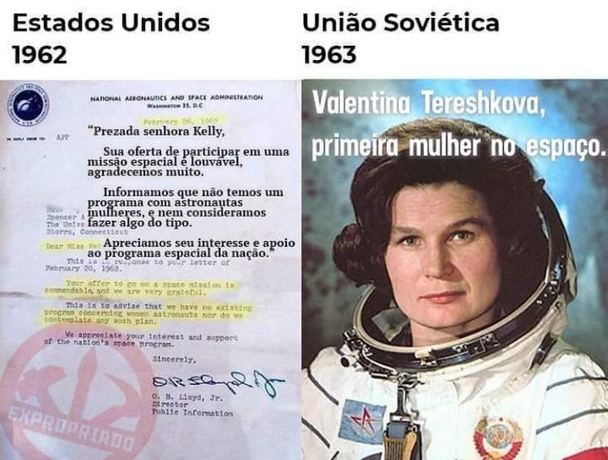

FÍSICA:
- Primeira usina nuclear, Obninsk (1954)
- Desenvolvimento da maior instalação experimental termonuclear do mundo, Tokamak 10, protótipo de reator termonuclear
- Invenção da Tzar Bomba, a bomba nuclear mais poderosa da história (100 Mt), cuja potência foi reduzida por razões ambientais (50-57 Mt). Comparação com as bombas dos EUA lançadas em Hiroshima e Nagasaki 15 Mt
- Invenção da fusão nuclear
- Invenção do Tokamak (1956), com o objetivo de fornecer aparelho de fusão de partícula de plasma
- Invenção do primeiro navio quebra-gelo nuclear "LENIN", o primeiro do mundo movido a energia nuclear (1952)
- Invenção do microtron acelerador de partículas (1944)
- Invenção do acelerador de partículas síncrotron (1957)
- Invenção da espectroscopia de ressonância paramagnética de elétrons (1944)
- Primeiro reator de nêutrons rápido, BN350 (1955)
- Criação mais longa do pipeline mais longo da história, Druzhba (1964)
- Primeiro reator de dessalinização nuclear, BN-350 (1972)
- Primeiro reflectron (1973)
- Criou a maior sonda geotécnica da história, Kola Well (1970)
- Criação da BARS Press (1989)

COMPUTAÇÃO:
- Primeiro computador programável MESM (1950)
- Primeiros computadores eletrônicos soviéticos e europeus, BESM (Sergey Lebedev, 1951) e MESM (Sergey Lebedev, 1958)
- Primeiro computador com lógica ternária (mais rápido e confiável que o sistema binário), Setun (Nikolai Brusentsov, 1958) e desenvolvimento do modelo Setun-70 (Nikolai Brusentsov, 1970) que reforçou ainda mais o aspecto da programação, melhorando por um fator 5 sob o tempo de desenvolvimento de softwares de outras arquiteturas
- Primeiro computador pessoal, MIR (Victor Glushkov, 1965)
- Primeiro sistema de ensino assistido por computador da história (Nastavnik), com uma referência clara ao atual
- Primeiro computador superescalar (microarquitetura de processador capaz de executar mais de uma instrução por ciclo de clock), Elbrus-1 (Boris Babaian, 1970). Fazendo uso deste equipamento em 1978, dez anos antes do surgimento das aplicações comerciais no Ocidente, a União Soviética desenvolveu seus sistemas de mísseis e programas nucleares e espaciais.
- Fundação da cibernética (Victor Glushkov)
- Invenção do Tetris (Alexey Pajitnov, 1984)
- Invenção do gerenciador de arquivos FAR, arquivo de formato RAR e WinRAR (Eugene Roshal)
- O primeiro telefone móvel, Leonid Ivanovich Kupriyanovich (1955), que foi copiado pelos EUA em 1970 e a Finlândia em 1980 deu-lhe um uso civil com a Nokia.

ELETRÔNICA:
- Invenção do LED (Oleg Vladimirovich, 1927) (Se você está lendo isso em uma tela de LED, tem que agradecer aos comunistas.)
- Invenção de equipamento de exercício vibratório (1960)
- Aperfeiçoamento de masers, Basov e Aleksandr Prokhorov Nikolai
- Invenção da lomografia (1982)
- Primeiro detector de mentiras, de Alexander Romanovich Luria
- Criou soldagem subaquática, Konstantin Khrenov (1932)
- Primeiro telescópio refletor, Maksutov (1941)
- Primeiro microfone a laser (1947)
- Criou o magnetotelúrico (1950)
- A descoberta da reação de Belousov-Zhabotinski (1951)
- Criação do fluxo bombeado do gerador de compressão explosiva (1951)
- Criou a holografia 3D (1962)
- Primeiro forno de micro-ondas (1941)
- Primeira antena de rádio

MEDICINA:
- Invenção de terapias contra doenças infecciosas baseadas no vírus bacteriófago (1940)
- Tratamento cirúrgico precoce da doença cardíaca congênita, pelo pioneiro Bukulev Alexander (1948)
- Criação da Psicologia Objetiva, do neurologista Vladimir Bekhterev, também conhecido por apontar o papel do hipocampo na memória, seu estudo dos reflexos e a doença de Bekhterev
- Primeiro transplante de córnea bem-sucedido em 1931, por Vladimir Filatov, que desenvolveu a terapia de tecidos
- Criação de ceratotomia radial por Svyatoslav Nikolayevich Fyodorov
- Criou o aparelho de Ilizarov para alongamento de ossos de membros e para a cirurgia de Ilizarov (1951) por Gavriil Abramovich Ilizarov
- Criou a psicologia histórico-cultural, teoria da atividade psicológica e método do "poder combinado", de Alexander Romanovich Luria
- Ampliou os critérios para o diagnóstico de esquizofrenia com a distinção entre sintomas negativos e positivos, uma pesquisa-chave e classificação do conceito de esquizofrenia, Andrei Snezhnevsky
- Primeira cirurgia cardíaca sob anestesia local, Alexander Vishnevsky, 1953
- Fundação da cirurgia purulenta, Arcebispo Luka Voyno-Yasenetsky, Prêmio Stalin, Prêmio Nobel de Medicina em 1946.
- Descoberta do efeito Cherenkov (Pavel Cherenkov Alekseyecih)
- Primeiro transplante de órgão artificial
- Primeira transfusão de sangue de um cadáver, Sergei Yudin, 1929.
- Primeiro banco de sangue. Criado por Sergei Yudin no início de 1930. Em meados do mesmo ano, a URSS teria 65 grandes centros de doação de sangue e mais de 500 filiais.
- Criação do parto sem dor (sob anestesia)
- Criou a Gramicina S (1942)
- Primeiro transplante de cabeça com função cerebral completa (1950)
- Criou a cosmetologia antropométrica (1952)
- Criou a ceratotomia radial (1974)
- Descoberta de vitaminas
- Descoberta dos vírus
- Primeiro microscópio acústico (1959)
- Primeiro vírus extinto (varíola - 1980)

MILITAR:
- Primeiro lançador de foguetes múltiplos, o lançador de foguetes Katyusha (1939)
- Criou o maior e mais poderoso helicóptero de rotor único do mundo, o Mil Mi-26 (1981)
- Criou o Sikorsky S-64 Skycrane, capaz de levantar mais carga do que qualquer outro na história
- Ekranoplano Creation (1950), semelhante a um avião que usa a influência do "efeito solo" sobre o mar para simplesmente não consumir combustível e transportar 500 toneladas.
- Criou a maior aeronave do mundo, capaz de transportar 225 toneladas, o Antonov 225 (1980)
- Primeiro plano telemecânico
- Primeiro avião de passageiros supersônico, TU-144
- Primeira (e única) aeronave movida por um reator nuclear, TU-119
- Primeira (e única) aeronave de caça espacial construída, o MIG-105, capaz de derrubar lançadores, mísseis e satélites inimigos no espaço e nas costas.
- Criação do jato de combate MIG-25 com recorde absoluto de altitude (37,650m), tempo de subida de 0 a 30 km (3 min 10s), circuito de velocidade 500 km (2981,5 km/h)
- Primeiro (e único) reator mundial em operação de hidroaviões, Beriev BE-200
- Primeiro navio a explorar o Pólo Norte, NS Arktika (1972)
- Criou o biplano mais produzido da história, o Polikarpov Po-2 (1927)
- Criou o Ilyushin Il-2, a aeronave mais produzida da história.
- Primeiro hidrofólio, Raketa (1957)
- Primeiro navio de míssil, Komar (1959)
- Criou o mais rápido e capaz de mergulhar mais fundo na história (1300 m), o submarino nuclear da classe Alpha. Só precisava de uma equipe de 27 pessoas (em comparação com 110 que precisam de um modelo americano, Los Angeles), pois era muito automatizado.
- Criou o maior submarino da história, a classe Typhoon, apenas carrega 5 capacetes (o que o faz suportar vários golpes de torpedo antes de ser nocauteado) e uma único na história em trazer certos luxos como cabine individual, academia, piscina, sauna, lounges, etc.
- Primeiro tanque com armadura composta, o primeiro a incorporar um autoloader, primeiro lançamento de míssil tanque: T64
- Primeiro robô militar; o Tt -26 (1949), um tanque de controle remoto para minimizar as vítimas humanas; equipado com metralhadoras DT, lança-chamas, granadas de fumaça e às vezes com uma bomba entre 200-700 kg que foi lançada perto do refúgio para destruir bunkers inimigos até quatro níveis subterrâneos. Também foi treinado para portar armas químicas, mas não foi usado para segurança e ambientalismo.
- Primeiro tanque lança-chamas da história, KHT-26 (1931)
- Primeiro tanque com asas, Antonov A-40 (1942)
- Criou o melhor e mais produzido tanque da Segunda Guerra Mundial: T-34 (1940)
- Criou o tanque mais produzido da história, T-54/55 (1945)
- Armadura reativa fechada (1960)
- Armadura reativa fechada capaz de proteger contra munição APFSDS (piercing de armadura), 1985
- Primeiro veículo de combate de infantaria da história (BMP-1 criado em 1961), além de proteção NBC, antitanque, capacidade anfíbia e pára-quedas lançável com canhão de 73 mm, lançador de mísseis antitanque e 3 metralhadoras PKT. Foi mal copiado em 1980 (20 anos depois) pelos EUA, para obter o seu primeiro IFV, dando origem ao M2 / M3 Bradley. Era 16,5 toneladas mais pesado que seu homólogo BMP-1 com menos tripulação e com um canhão muito menor (e sem capacidade de mísseis).
- Primeiras forças paraquedistas com uso militar da história em 1930, sendo também totalmente mecanizadas seus paraquedistas com BMD (pára-quedas lançável). Os EUA ainda não têm IFV para apoiar seus pára-quedistas.
- Primeiros bombeiros aéreos (1936)
- Primeiro rifle de assalto moderno, o AK-47 (1947)
- Primeiro planador torpedo de controle remoto, PSN-1
- Primeira reação de torpedo, PRAB-203
- Primeiro torpedo supercavitante, VA -111 Shkval
- Primeiro míssil dirigível
- Primeiro míssil intercontinental (R-7 Semyorka, 1957)
- Primeiro míssil antibalístico (1961)
- Primeiro submarino de mísseis intercontinentais, Vysota R-29 (1969), RD-170 (1987).
- Criou RKKA servindo infravermelho
- Primeiro pára-quedas drogue (1937)
- Criação da arte marcial do sambo por Anatoly Kharlampiev (1938)
- Primeiro rifle de assalto subaquático, o APS (1975)
- Criou o Sistema de Proteção Ativa, Drozd (1978)
- Primeiro batiscafo, Mir (1987). Primeiro a explorar o fundo do mar sob o Pólo Norte
- Realizou pela primeira vez a manobra "Cobra Pugavhev" em 1989
- Primeiro motor ramjet, R-3 (1939)
- A criação do Aerowagon (1917) foi pioneira no Schienenzeppelin alemão, no M-497 Black Beetle USA e no trem turbojato soviético
- Primeiro snowmobile da história, RF-8, baseado no protótipo pré-soviético Aerosani
- Primeira arma anti-satélite (1960)

ARTE:
- Criação da montagem polifônica ou contrapontística, métrica, rítmica, harmônica, melódica. Modalidades audiovisuais conceituais anteriores, incluindo vídeo e clipe, de Sergei Mikhailovich Eisenstein
- Invenção de xerografia
- Criação do croma
- Invenção de Kinopanorama (1956)

POLÍTICAS SOCIAIS:
- Primeiro e totalmente GRATUITO sistema de ensino público, que alcançou as maiores taxas de alfabetização da história nas 15 repúblicas soviéticas com o Likbez. Além disso, as escolas soviéticas ofereciam comida gratuita para os alunos, de modo que o equilíbrio entre a vida pessoal e profissional é muito mais fácil do que hoje nos países capitalistas. Mesmo os jardins de infância também eram gratuitos.
- Primeiro sistema de saúde GRATUITO e universal, que aumentou a expectativa de vida dos soviéticos, menos de 40 anos em 1917, para atingir os níveis ocidentais em 80 (70 anos). As conquistas da erradicação da fome e dos sistemas de saúde também podem ser comparadas com a altura média dos soviéticos em 1917 (1,60 m) a 1980 (1,80 m). Esse sistema de saúde descobriu o parto sem dor e realizou o primeiro transplante de órgão.
- Entre 1945 e 1964, a renda nacional soviética cresceu 570%, em comparação com 55% nos EUA (e lembre-se que a URSS não era um Plano Marshall, para ajudar o país)
- Invenção de estudos noturnos para que os trabalhadores construam carreiras.
- Primeiro país na história onde o aborto era legal e gratuito (desde 1920)
- Primeiro país da história a atingir uma taxa de desemprego de 0%
- Políticas de igualdade, um dos primeiros países a adotar o sufrágio feminino
- Primeira mulher na história a ocupar um cargo no governo (Alexandra Kollontai)

## Países socialistas antes do socialismo
Não existe essa de "restaurar a democracia" em países socialistas, todos esses países socialistas, com exceção da Tchecoslováquia, não eram uma democracia antes do socialismo. 

A Rússia era um regime racista e autocrática controlada por um rei (czar), era chamada de "cativeiro dos povos", pois todos os povos bárbaros e "negros" (definição pra qualquer um que não tenha a mesma cor de pele que os europeus -- os irlandeses só foram ser considerados brancos no final do século 19) que a Europa não gostava (por racismo) viviam lá, oprimidos por uma única etnia grão-russa (não existe um "russo" em abstrato, o que haviam eram 53 etnias vivendo em conflito sob o mesmo "cativeiro" dominado pelos grão-russos)

A Polônia era uma ditadura fascista controlada por Pilsudski (hoje retratado como "herói nacional da Polônia") com seus campos de concentração.

A Albânia era um protetorado fascista italiano desde 1927 e ao final da Segunda Guerra Mundial tinha menos de 20% de alfabetização.

Cuba era uma ditadura financiada pelos EUA, era o paraíso dos ricos com enormes cassinos, mas a pobreza e a desigualdade aumentavam cada vez mais. Tudo o que se via em Havana eram prostitutas, crianças pedindo esmola e pequenos furtos. Os afrodescendentes tinham sua religião perseguida e viviam sob condições de escravidão, alguns cubanos nativos trabalhavam sem ganhar um mínimo centavo por isso.

Lituânia, Hungria, Romênia e Bulgária eram completamente fascistas aliados dos Nazistas na segunda guerra mundial.

No Vietnã, se um francês cometesse alguma injustiça ou crime contra um vietnamita, ele não era nem ao menos julgado, e constantemente haviam estupros e assédios por parte dos franceses, um povo que nem ao menos podia construir uma escola sem os franceses destruírem. No Vietnã do Sul, os EUA proibiu o budismo.

A China antes da revolução era o país mais pobre do mundo, havia crises de fome constantemente, era um país bem grande, que vivia sob o terror de um imperador autocrático que perseguia quem demandasse por reformas, e isso só piorou depois da Guerra do Ópio. Os chineses tinham que comer cascos de árvore e vender seus filhos para pagarem os donos de terra britânicos. Por anos, haviam bairros em Hong Kong proibidos para nativos, somente ingleses podiam se assentar lá.

A Coreia sofreu uma das piores injustiças de todas, são muitas, os japoneses realmente não ligavam se os coreanos eram humanos. Tentaram abolir até o idioma coreano, matavam qualquer um que dissesse uma ÚNICA palavra em coreano. Vilas e aldeias eram constantemente saqueadas, mulheres eram estupradas, havia tortura e massacre generalizado, etc.

Qual democracia eles querem restaurar da China? Subordinada aos americanos, perda de soberania nacional e ataque a tudo de importante que os chineses conquistaram? Qual seria a democracia da Coreia? Se subordinar aos americanos e ao Japão que até hoje NUNCA pediu desculpas aos asiáticos e até hoje não abandonou a bandeira fascista imperial?

## Lenin não era antissemita
Lenin no discurso sobre os pogroms antissemitas realizados pelo czar:
> Anti-semitismo significa espalhar inimizade contra os judeus. Quando a maldita monarquia czarista vivia seus últimos dias, tentou incitar trabalhadores e camponeses ignorantes contra os judeus. A polícia czarista, em aliança com os latifundiários e os capitalistas, organizou pogroms contra os judeus. Os proprietários de terras e capitalistas tentaram desviar o ódio dos trabalhadores e camponeses que foram torturados pela miséria contra os judeus. Em outros países, também, vemos frequentemente os capitalistas fomentando o ódio contra os judeus para cegar os trabalhadores, para desviar sua atenção do verdadeiro inimigo do povo trabalhador, o capital. O ódio aos judeus persiste apenas nos países onde a escravidão aos proprietários de terras e capitalistas criou uma ignorância abismal entre os trabalhadores e camponeses. Somente as pessoas mais ignorantes e oprimidas podem acreditar nas mentiras e calúnias que se espalham sobre os judeus. Isso é uma sobrevivência dos tempos feudais antigos, quando os sacerdotes queimavam hereges na fogueira, quando os camponeses viviam na escravidão e quando o povo era esmagado e desarticulado. Essa antiga ignorância feudal está passando; os olhos do povo estão sendo abertos.
Não são os judeus os inimigos dos trabalhadores. Os inimigos dos trabalhadores são os capitalistas de todos os países. Entre os judeus há trabalhadores e eles constituem a maioria. Eles são nossos irmãos, que, como nós, são oprimidos pelo capital; eles são nossos camaradas na luta pelo socialismo. Entre os judeus existem kulaks, exploradores e capitalistas, assim como entre os russos e entre pessoas de todas as nações. Os capitalistas se esforçam para semear e fomentar o ódio entre trabalhadores de diferentes religiões, diferentes nações e diferentes raças. Aqueles que não trabalham são mantidos no poder pelo poder e força do capital. Judeus ricos, como russos ricos, e os ricos em todos os países, estão em aliança para oprimir, esmagar, roubar e desunir os trabalhadores.
Vergonha do maldito czarismo que torturou e perseguiu os judeus. Vergonha para aqueles que fomentam o ódio aos judeus, que fomentam o ódio às outras nações.
Viva a confiança fraterna e a aliança combativa dos trabalhadores de todas as nações na luta pela derrubada do capital.

Você pode conferir o discurso aqui https://www.youtube.com/watch?v=s7W8isFf86c

## A violência segundo Lenin
Em uma carta, Gorky questiona Lenin sobre a violência do povo revolucionário ao defender o seu país na guerra cívil atacado por 17 potências reacionárias, e Lenin responde assim pra ele:
> Que quer você? (…) Será possível agir humanamente num combate com tal ferocidade sem precedentes? Haverá aqui lugar à brandura e à generosidade? Estamos sob bloqueio da Europa, privados da esperada ajuda do proletariado europeu, vemos por todos os lados a contra-revolução trepar contra nós como um urso. Que devemos fazer? Não devemos, não temos o direito de lutar e resistir? Desculpe, mas não somos tolos. (…) Com que critério avalia a quantidade de golpes necessários e excessivos no combate?

## A origem da teoria da conspiração judaíca-maçom
A teoria da conspiração judaíca-maçom é o principal movimento anti-revolucionário, racista e reacionário contra o comunismo. A Rússia, conhecida como cativeiro dos povos, havia tido seu controle tomado pelos eslavos, judeus e negros (quem não tem a mesma cor dos europeus, como a Irlanda que só foi considerada branca no final do século 19), então com o crescente número de socialistas mundo afora (na época, era um movimento grande que atingia as massas populares) criou-se a teoria de que os judeus e maçons estariam conspirando para tirar os europeus do poder, coisa que os socialistas queriam -- fim da segregação racial, imperialismo, machismo e colonialismo.

Então os europeus ficaram com medo de um dia eles perderem suas colônias, o controle que tinham sob o mundo, que fossem misturados com pobres e negros, que as mulheres governassem o mundo, todo um mundo perfeito mas aos olhos de um conservador cristão, bastante imoral.

Mas o antissemitismo começou bem antes, como Lenin afirma no seu [discurso sobre os pogroms](#Lenin-não-era-antissemita) que o czar era antissemita, e constantemente essa era uma estratégia para cegar os trabalhadores diante do verdadeiro inimigo: O capital. Antes de cair, Nicolau e seus seguidores divulgaram a farsa dos [Protocolos dos Sábios de Sião](https://pt.wikipedia.org/wiki/Os_Protocolos_dos_S%C3%A1bios_de_Si%C3%A3o) que como aponta a Wikipedia, é fake.

## O que realmente é o fascismo e o nazismo
O fascismo é nada mais e nada menos que:
1) Anti-socialismo e contra-revolucionarismo (reacionarismo)
2) Darwinismo social e racismo
3) Colonialismo

Já o nazismo é o fascismo com o colonialismo aplicado contra seu próprio povo (no caso de Hitler, contra os próprios europeus). Formas mais comuns de fascismo também incluem o corporativismo. Quando há uma crise do capitalismo, a tendência é a população ser cada vez mais socialista, então o fascismo aparece mais frequentemente atrelado às crises do capitalismo financiado pelas potências imperialistas para acabar com as esquerdas.

## Mises e Hayek admiravam o fascismo
Mises era um elitista com tendências fascistas, apoiava o colonialismo, era simpatizante do regime apartheid da África do Sul, grande contribuidor do regime austrofascista (conselheiro de Dolfuss), simpatizava com o fascismo europeu e quando o fascismo entrou em decadência, ele disse que o fascismo era coisa de socialista. Tenha apenas em mente, que o liberalismo e o fascismo não são incompatíveis. Fun fact: Como resultado das políticas econômicas de Mises, a Aústria entrou em crise econômica e social, o que facilitou sua anexação pela Alemanha Nazista. Algumas frases de Mises:
> A constatação de que (os fascistas) ainda não puderam desvencilhar-se de modo tão cabal como os bolcheviques, russos, de qualquer consideração por noções e ideias liberais e por tradicionais preceitos éticos, deve ser atribuída, tão somente, ao fato de que os fascistas atuam em países nos quais a herança intelectual e moral de milhares de anos de civilização não pode ser destruída num piscar de olhos e não entre povos bárbaros de ambos os lados dos Urais, cuja relação com a civilização nunca foi mais do que a de habitantes predadores da floresta e do deserto, acostumados a se envolverem, de tempos em tempos, em pilhagem de terras civilizadas, na caça à sua presa.

E ainda:
> Não se pode negar que o fascismo e movimentos semelhantes, visando ao estabelecimento de ditaduras, estejam cheios das melhores intenções e que sua intervenção, até o momento, salvou a civilização europeia. O mérito que, por isso, o fascismo obteve para si estará inscrito na história.

Já Hayek mandava seus alunos (chicago boys) serem os conselheiros econômicos do regime fascista de Pinochet, e eles sabiam que haviam mortes, torturas e perseguições acontecendo nas ruas para impor suas políticas econômicas (chamadas de neoliberais). Hayek disse sobre o fascismo:
> Prefiro um ditador liberal do que uma democracia sem liberalismo

Outro também:
> Se eu pudesse viver sob um regime fascista, eu não tenho nenhuma dúvida que eu preferiria viver em um aquele dirigo pelos ingleses ou americanos do que qualquer outra

## O verdadeiro Winston Churchill
Churchill era um grande amigo de Mussolini e constantemente elogiava Hitler e retratava a ele como "meu amigo", um supremacista e genocida. Aqui uma frase dele sobre Mussolini em 20 de janeiro de 1927:
> Se eu fosse italiano, tenho certeza de que estaria com você de todo o coração, do início ao fim, em sua luta triunfante contra os apetites e paixões bestiais do leninismo.

Churchill elogiando Hitler:
> Sempre disse que, se a Grã-Bretanha fosse derrotada na guerra, esperava que encontrássemos um Hitler que nos conduzisse de volta à nossa posição legítima entre as nações. Lamento, no entanto, que ele não tenha sido suavizado pelo grande sucesso que o acompanhou. O mundo inteiro se regozijaria em ver o Hitler de paz e tolerância, e nada adornaria seu nome na história do mundo tanto quanto atos de magnanimidade e de misericórdia e de piedade para com os desamparados e sem amigos, para os fracos e pobres. Como ele foi bom o suficiente para me dar seus conselhos, me arrisco a retribuir o elogio. Herr Hitler também se mostrou excessivamente sensível a sugestões de que pode haver outras opiniões na Alemanha além da sua. Seria realmente espantoso se, entre 80 milhões de pessoas tão diversas em origem, credo, interesse e condição, houvesse apenas um padrão de pensamento. Não seria natural: é incrível. Que ele tem o poder e, infelizmente! a vontade de suprimir todas as opiniões inconvenientes é sem dúvida verdadeira. Seria muito mais sensato relaxar um pouco e não tentar amedrontar as pessoas por expressarem dúvidas e divergências honestas. Ele está enganado ao pensar que eu não vejo alemães do regime nazista quando eles vêm para este país. Pelo contrário, só este ano vi, a pedido deles, Herr Bohle, Herr Henlein e o Gauleiter de Danzig, e todos eles sabem disso. Como a maioria dos homens e mulheres ingleses, nada gostaria mais do que ver uma grande, feliz e pacífica Alemanha na vanguarda da Europa. Que este grande homem examine seu próprio coração e consciência antes de acusar alguém de ser um guerreiro. Todos os povos do Império Britânico e da República Francesa desejam sinceramente viver em paz lado a lado com a nação alemã. Mas também estão decididos a se colocar em posição de defender seus direitos e civilizações há muito estabelecidas. Eles não significam estar no poder de ninguém. Se os olhos de Herr Hitler caírem nessas palavras, acredito que ele as aceitará com o espírito de franqueza com que foram pronunciadas.

Ainda sobre Hitler em 1937:
> Eu não gosto como o Dr Goebbels me coloca na imprensa como se eu fosse um inimigo da Alemanha. Isso não é verdade.

Sobre a Índia na fome de Bengala de 1943 que as próprias autoridades britânicas criaram:
> Eu odeio hindus. Eles são um povo bestial com uma religião bestial. Com fome ou sem fome, os hindus sempre se reproduzirão como coelhos.

Também perguntou se a Índia estava com fome, por que o Gandhi não morria. Ele disse o seguinte sobre a Índia durante a Segunda Guerra: "vamos adquirir uma dívida de centenas de milhões para defender a Índia apenas para sermos expulsos posteriormente de lá por indianos". Em 1945, Churchill declarou que "a raça hindu é protegida da destruição esperada por sua mera reprodução". A fome de Bengala não foi suficiente para a sede por sangue de Churchill. Seu desejo era que Arthur Harris, seu criminoso de guerra preferido, pudesse tê-los bombardeado". Por toda a Segunda Guerra, a Índia foi obrigada a emprestar dinheiro à Grã-Bretanha. Churchill reclamou dos "credores indianos" o tempo inteiro. A verdade é que Churchill nunca combateu o fascismo. Ele entrou na Segunda Guerra para defender o Império Britânico. Churchill recusou todas as ofertas de envio de ajuda a Bengala: o Canadá ofereceu 10.000 toneladas de arroz, ao passo que os EUA ofereceram US$ 100.000. Churchill se recusou prontamente a permiti-las. Até mesmo o imperialista de direita Leo Amery, que ocupava o cargo de secretário Britânico do Estado da Índia, declarou não ver muita diferença entre a maneira com que Churchill e Hitler enxergavam as coisas. Bengala tinha uma colheita acima da média durante a fome produzida pelos britânicos. O exército britânico tomou milhões de toneladas de arroz de pessoas famintas para enviá-las para o Oriente Médio - onde sequer eram necessárias. 

Churchill sobre a teoria do bolshevismo judaíco (ele não era necessariamente antissemita):
> Não há necessidade de exagerar o papel desempenhado na criação do bolchevismo e na realização real da Revolução Russa, por esses judeus internacionais e em sua maioria ateus; certamente é muito grande; provavelmente supera todos os outros. Com a notável exceção de Lenin, a maioria das principais figuras são judeus. Além disso, a principal inspiração e força motriz vêm dos líderes judeus.

Churchill sobre a China em 1902:
> Acho que teremos de controlar os chineses e regulamentá-los. Eu acredito que conforme as nações civilizadas se tornam mais poderosas, elas se tornarão mais cruéis, e chegará o tempo em que o mundo suportará impacientemente a existência de grandes nações bárbaras que podem a qualquer momento se armar e ameaçar as nações civilizadas. Eu acredito na divisão definitiva da China - quero dizer, definitiva. Espero que não tenhamos que fazer isso em nossos dias. A linhagem ariana está fadada ao triunfo.

Churchill sobre o Exército Britânico ter jogado armas químicas no Iraque em 1920:
> Não entendo esse escrúpulo em relação ao uso do gás. Definitivamente, adotamos a posição na Conferência de Paz de argumentar a favor da retenção de gás como método permanente de guerra. É pura afetação dilacerar um homem com o fragmento venenoso de uma concha que se rompe e ficar estupefato ao fazer seus olhos lacrimejarem por meio do gás lacrimogêneo.
Sou fortemente a favor do uso de gás envenenado contra tribos incivilizadas. O efeito moral deve ser tão bom que a perda de vidas deve ser reduzida ao mínimo. Não é necessário usar apenas os gases mais mortais: podem ser usados gases que causam grande inconveniência e espalhariam um terror vivo, mas não deixariam efeitos permanentes sérios na maioria das pessoas afetadas.

Churchill foi nomeado "Secretário de Estado junto às Colônias" em 1921, formando o "Departamento do Oriente Médio", responsável pelo Iraque. Determinado a ter seu amado império a baixo custo, decidiu que o poder aéreo poderia substituir tropas em terra. A estratégia de bombardear qualquer resistência ao império britânico era empregada agora. Muitas vezes ao longo da década de 20, uma série de grupos na região agora conhecida como Iraque se levantou contra os britânicos. A força aérea foi então colocada em ação, bombardeando áreas civis indiscriminadamente a fim de subjugar a população. Churchill também foi um defensor do uso de gás mostarda e gases venenosos. Enquanto "Secretário da Guerra e da Força Aérea", ele recomendou "a provisão de algum tipo de bomba asfixiante para uso em operações preliminares contra tribos turbulentas", a fim de tomar controle do Iraque. Quando as tribos do Iraque se defenderam, sob o comando de Churchill, os britânicos semearam o terror nos vilarejos de barro, pedra e bambu. O bombardeamento de civis por Churchill na Mesopotâmia (Curdistão e Iraque) foi resumido pelo criminoso de guerra "Bomber" Harris
> Os arábes e curdos agora sabem o que significa um bombardeamento real. Em 45 minutos, um vilarejo de tamanho integral pode ser praticamente varrido do mapa, com um terço de seus habitantes mortos ou feridos por quatro ou cinco máquinas que não lhes oferecem um alvo real, nenhuma oportunidade de glória como guerreiros, nenhum meio efetivo de escape.

Churchill sobre os petróleos do Irã:
> Um prêmio da terra das fadas além de nossos sonhos mais malucos.

Churchill se intrometeu nas questões iranianas por décadas. Ele ajudou a alijar os iranianos de seus recursos naturais e incentivou a pilhagem enquanto a maioria vivia em severa pobreza. Em junho de 1914, Churchill propôs uma lei na Câmara dos Comuns segundo a qual o governo britânico se tornaria o principal acionista da Companhia de Petróleo Anglo-Iraniana. A Companhia viria a deixar de pagar ao Irã sua parte dos dividendos antes de pagar impostos ao erário britânico. Em essência, os britânicos estavam ilegalmente taxando o governo iraniano. Quando o governo nacionalista de Mohammad Mosaddegh ameaçou os "interesses" britânicos no Irã, Churchill estava ali, pronto para protegê-los a qualquer custo - mesmo que isto significasse profanar a democracia. Ele ajudou a organizar um golpe contra Mosaddegh em agosto de 1953. Ele disse ao oficial de operações da CIA que ajudou a levar o plano a cabo:
> Se eu fosse só alguns anos mais novo, não teria amado nada mais do que servir sob seu comando nesta grande empreitada.

Churchill fez com que a BBC enviasse mensagens codificadas para que o Xá do Irã soubesse que estavam derrubando o governo eleito democraticamente. Em vez de a BBC terminar seu noticiário em persa com o tradicional "é meia-noite em Londres", por ordens de Churchill, o programa foi encerrado com a frase "é exatamente meia-noite agora". Em foro privado, Churchill veio a descrever o golpe como "a operação mais perfeita desde o fim da Guerra". Sendo um orgulhoso produto do imperialismo, não possuía nenhum pudor  em derrubar Mosaddegh a fim de que a Grã-Bretanha pudesse continuar sugando as riquezas do Irã.

Churchill descobriu seu amor pela guerra durante seu tempo passado no Afeganistão. Enquanto estava lá, declarou que "todos os que resistirem serão mortos sem clemência" porque os pashtuns precisavam "reconhecer a superioridade racial". Ele acreditava que os pashtuns [grupo etnolinguístico localizado principalmente no leste e no sul do Afeganistão e, no Paquistão] tinham de ser eliminados. Em seus escritos, ele se lembraria de como participou do incêndio de vilarejos e lares de pessoas:
> Nós prosseguimos de forma sistemática, vilarejo por vilarejo, e destruímos as casas, enchemos os poços, derrubamos as torres, cortamos as grandes árvores frondosas, queimamos as plantações e quebramos os reservatórios numa devastação punitiva.

Churchill também escreveria sobre como "todo integrante de tribo capturado era imediatamente morto por lança ou lâmina". Orgulhoso do terror que ele ajudou a infligir nas pessoas do Afeganistão, Churchill estava no caminho correto para se tornar um maníaco genocida.

O exército britânico perpetrou, sob comando de Churchill, um massacre nas ruas de Atenas no mês de dezembro de 1944. 28 manifestantes foram executados a Bala, e outros 128 foram feridos. Os britânicos exigiram que todos os grupos de guerrilha se desarmassem no dia 2 de dezembro de 1944. No dia seguinte, 200.000 pessoas foram às ruas, e foi então que o exército britânico apontou suas armas para o povo. Churchill considerava o  ELAS (Exército para Liberação do Povo Grego) e o EAM (Fronte de Libertação Nacional) "bandidos miseráveis". Estas foram exatamente as pessoas que expulsaram os nazistas. Suas ações em dezembro foram motivadas puramente por ódio e paranoia com o comunismo. Os britânicos apoiaram o governo de direita na Grécia que retornou do exílio após os mesmos guerrilheiros da resistência assassinados a mando de Churchill terem expulsado os invasores nazistas. As forças soviéticas foram bem recebidas na Grécia. Isto preocupou Churchill. profundamente. Ele planejava restaurar a monarquia na Grécia para combater qualquer influência comunista. Os eventos em dezembro foram parte de sua estratégia. Em 1945, Churchill enviou Charles Wickham para Atenas, onde ele estava encarregado de treinar a polícia secreta da Grécia. Wickham aprendera os segredos do ofício na Irlanda ocupada pelos britânicos entre 1922 e 1945, onde ele comandara a RUC colonial, responsável por um terror imensurável.

Em abril de 1945, Churchill declarou que "os colaboradores dos nazistas na Grécia, em muitos casos, fizeram o melhor que podiam para proteger a população da opressão alemã", e prosseguiu dizendo que "os comunistas eram o principal inimigo".

Não só isso, como também os massacres das colônias e o massacre contra os aborígenes na Oceania.

Por outro lado, Churchill era um grande abolicionista. Ao ser preso na África como prisioneiro de guerra, algo fundamentalmente profundo cresceu nele. Churchill a partir daquele momento, reconheceria como uma prisão é horrível e "não desejaria esse mal nem ao pior dos homens" segundo ele mesmo. Ele sempre que podia, usava seu recurso de parlamentar para soltar quem ele podia, e pressionava os parlamentares a usarem esse recurso que eles quase nunca usavam. Churchill tentava sabotar qualquer medida penal britânica.

## O socialismo não matou 100 milhões
Sabe da onde vieram esses 100 milhões? Do livro "o livro negro do comunismo" que tem fixação pelo número 100, que não cita fontes e ainda conta morte na segunda guerra mundial como morte por socialismo. E o próprio autor confessou que tirou que não tem fontes e aumentou os fatos pra ganhar fama. Seriam Stalin e Mao os maiores ocultadores de cadáveres do mundo? Poxa... Esconderam os milhões de corpos em Marte?

Algumas partes das "dificuldades na análise dos dados e nas possibilidades metodológicas" na contagem de "vítimas do comunismo" é mesmo proveniente do fato destes "dados" e "metodologias" serem fruto de propaganda, inclusive de propaganda nazista. A primeira metodologia utilizada para contar as "vítimas" do comunismo nasceu da mente deturpada do colaborador nazista Walter Dushnyck. Robert Conquest, propagandista do MI6, teve como ajudante James Mace, continuador desse "método". As mesmas imbecilidades cometidas por Dushnyck e Mace foram cometidas por Dana Dalrymple e o "método" e "estimativas" dos nazistas e propagandistas foi continuado novamente. Reagan encomendou boa parte dos estudos sobre as "vítimas do comunismo". Quem foi Reagan? O mesmo presidente que agradeceu outro colaborador nazista e líder da Organização Nacionalista Ucraniana, Yoroslav Stetsko. Entre manipulação estatística, saltos lógicos e mentiras abertas que adquiriam verniz de verdade (seguindo a cartilha de Goebbels) por repetição e legitimação midiática, propagandística e governamental, as "vítimas" do comunismo foram de uns tantos nazistas, traidores e guardas brancos ou soldados de outras instituições reacionárias, para populações de nações inteiras. Este é o grande poder da propaganda inimiga, o poder dos nazistas, da CIA e do MI6 que se confundem num único poder: o poder do imperialismo decadente, do fascismo. Devemos dizer algo ainda especificamente sobre o "Livro Negro do Comunismo": sua "metodologia" é tão boa que um dos próprios autores admitiu publicamente estar mentindo. Na "falta de informações", inventam o que querem. É o "método" dos que têm poder de legitimar tudo que dizem.

Outra acusação de genocídio feita pelos anti-comunista refere-se à fome ocorrida na China entre 1958 e 1962, durante o programa de coletivização realizado por Mao Tsé-Tung (o comunismo foi implantado na China em 1951), na qual teriam morrido cerca de 45 milhões de chineses. Ocorre que a China também passara, ao longo dos séculos anteriores, por crises periódicas de fome, como, por exemplo, entre 1936 e 1935, quando morreram cerca de 5 milhões de chineses; entre 1928 e 1930, quando estima-se que morreram 3 milhões pessoas. Entre 1850 e 1873, quando teriam morrido aproximadamente 60 milhões de pessoas; e entre 1810 e 1811, quando o número de mortos teria sido de 45 milhões. Depois dos processos de coletivização e modernização do campo, na URSS e na China, não ocorreram outras crises de fome.

Para mais informações https://en.wikipedia.org/wiki/The_Black_Book_of_Communism#Criticism

## Mitos da revolução russa
Eu iria escrever sobre, mas já há um artigo bem completo sobre o tema https://www.marxismo.org.br/as-10-maiores-mentiras-sobre-a-revolucao-bolchevique/

## Revoluções não são violentas
Ao contrário do que muita gente pensa, revoluções são pouco violentas. John Reed retrata no seu livro "10 dias que abalaram o mundo" que menos de 10 pessoas morreram na revolução bolchevique, e o único ato "brutal" foi a execução da família Romanov (o que é compreensível em caso de revolução -- e Lenin temia que deixá-los vivos poderia dar forças aos exércitos reacionários -- e foi exatamente o que aconteceu), e só começou de fato a morrer gente quando 17 potências reacionárias invadiram a Rússia.

E em outros casos, a revolução não é caos e barbaridade por todos os lados. Por exemplo, na China, era proibido torturar japoneses que haviam sido capturados, mesmo quando os japoneses torturavam os chineses. No Vietnã, era proibido que soldados estuprassem as francesas, mesmo quando o exército francês o fazia com as camponesas vietnamitas.

## Apenas a luta de classes muda a realidade
Como a realidade se transforma? Pelo pensamento? Se sim, você consegue citar um exemplo? O capitalismo se instalou com revoluções liberais e necessidades materiais, e há o grande mito de que a escravidão acabou por causa da Inglaterra boazinha. É mentira, eles continuaram mantendo trabalhadores em condições de trabalho análogas a escravidão em suas colônias, e não deu nenhum suporte para que os negros ascendessem socialmente -- fazendo que eles fossem a parcela mais pobre da população e se instalassem em favelas.

O argumento de que o capitalismo precisava de consumidores é falsa, já que os donos de escravo já consumiam e pagavam pelas necessidades básicas, e muita gente hoje já paga pelas necessidades básicas (e mesmo que hoje os negros tenham mais poder de compra do que antes era oferecido pelos seus donos, o escravagismo era mais eficiente -- aliás, só o trabalho gera lucro - não é à toa que Ludwig von Mises no "6 lições" defende o trabalho infantil, pois era lucrativo). O capital teve que reorganizar sua forma de exploração depois disso. A escravidão acabou porque Louverture libertou os escravos durante a [Revolução Haitiana](https://pt.wikipedia.org/wiki/Revolu%C3%A7%C3%A3o_Haitiana) e isso fez com que muitos movimentos anti-escravidão e negros pelo mundo ascensessem, no Brasil mesmo tivemos o [Dragão Do Mar](https://pt.wikipedia.org/wiki/Francisco_Jos%C3%A9_do_Nascimento) que organizou movimentos pela abolição da escravidão. O sufrágio universal, diminuição da jornada de trabalho e os direitos das mulheres vieram por revoluções e para acalmar os socialistas (a URSS foi o primeiro país a instituir o sufrágio universal em sua constituição), e até as férias de verão foram criadas por socialistas. As descolonização da África começou pelo **MPLA**, **Agostinho Neto**, **Nyerere, Nkrumah**, **Frantz Fanon**, **Samora Machel**, **Amilcar Cabral**, **Che Guevara**, **Lumumba**, apoio da URSS e Cuba na descolonização, etc.

Portanto, também não é possível dizer que tudo é modelado por revoluções -- por exemplo, **Henry Ford** empurrou política favorável a **fim de semana** para as pessoas terem algum tempo livre pra poderem consumir seus produtos.

Numa economia de mercado é interesse dos agentes acumularem capital e poder político, mais poder econômico quer dizer mais poder político, mais poder político é tirania, todas as conquistas de poder político APESAR do poder econômico dos agentes foram graças ao **CONFLITO DE CLASSES**, nenhum jogo de monopoly é infinito, não existe equilíbrio infinito numa economia de mercado, essa ideia é totalmente ilusória, até absurda.

Ganância por poder não é diferente coisa nenhuma de capitalismo, um mercado é DEFINIDO pela necessidade dos agentes de acumular mais capital. É esse O PROPÓSITO, e a minimazação das falhas é feita através do **EMBATE ENTRE AS CLASSES**, não através do interesse puro do mercado, não existe isso de mercado equilibrado, essa ideia não tem compromisso nenhum com a realidade, como é que tu vai taxar poluição se isso não é de interesse dos detentores do poder econômico? Só através de conflito, o conflito não é necessariamente uma guerra, a função original do Estado não era essa, o Estado ganhou essa função a partir do conflito de classes, a função original do Estado era mediar conflitos entre detentores de capital, o Estado moderno não tinha a menor representatividade na sua ascensão, só ver a revolução americana, quem tinha direito ao voto eram homens, brancos, detentores de propriedade, a representatividade só foi conquistada por outras categorias a partir do conflito, da luta.

Engels descreve isso detalhadamente em A Origem da Família, da Propriedade Privada e do Estado, sim, mas não dá pra negar que isso foi resultado de muita luta social pra se conquistar mais direitos dentro do Estado, não é através do "mercado" que a gente vai conseguir avanços sociais, quase nenhum avanço social foi conquistado com o mercado, foi conquistado por conflito social, através de greves, manifestações, desobediência civil, boicotes, e até guerra aberta. As empresas privadas investindo em causas sociais ou é uma coincidência feliz (o que é muito raro), ou é oportunismo (tipo a história do **pink money** ou **black money**), ou é cooptação.

## Mitos da guerra de inverno
A Guerra de Inverno é o nome que se dá ao conflito finlandês-soviético entre 1939 e 1940, e a guerra de continuação de 1941 até 1944. No entanto, muitos acusam essas guerras como sendo parte do "imperialismo soviético", pois buscava conquistar e controlar territórios finlandeses. No entanto, a guerra ocorreu mais por motivos geopolíticos do que imperialistas.

Nesta época, Hitler estava tomando vários territórios na Europa e declarava seu imperialismo e anti-comunismo abertamente (como o pacto anti-comintern de 1936 com o Japão, e o fato de a URSS ser **a única potência a travar uma guerra indireta contra os fascistas** na [Guerra Civil Espanhola](https://pt.wikipedia.org/wiki/Guerra_Civil_Espanhola)) e a grande parte dos países europeus eram fascistas ou proto-fascistas (maioria da população fascista), e a Finlândia não era exceção (perpetrando vários [massacres](https://en.wikipedia.org/wiki/List_of_massacres_in_Finland) contra sua própria população, e com vários pró-fascistas e revisionistas de direita entrando no [Partido Social Democrata da Finlândia](https://en.wikipedia.org/wiki/Social_Democratic_Party_of_Finland)). Stalin temia que a Finlândia recebesse apoio nazista e juntos, os dois começassem uma invasão à URSS, e a fronteira finlandesa ficava a menos de 30 km de Leningrado. Seria uma grande perda logo pro início do conflito.

No entanto, a guerra entre a Finlândia e União Soviética não acabou em 1940. Eles assinaram um armistício. Porém, os [nacionalistas finlandeses](https://en.wikipedia.org/wiki/White_Guard_(Finland)) não queriam só recuperar o território perdido, mas criar uma [Grande Finlândia](https://en.wikipedia.org/wiki/Greater_Finland), além do [Heimosodat](https://en.wikipedia.org/wiki/Heimosodat), grupo de 9.000 voluntários anti-comunistas que atacaram a Rússia durante a [Guerra Civil](https://en.wikipedia.org/wiki/Russian_Civil_War) para tomar seus territórios. Os finlandeses participaram do cerco de Leningrado, posicionaram aviões nazistas em seu território e tinham campos de trabalho civil para cerca de 50.000 cidadãos soviéticos. Também o fato de que a URSS negociou com os finlandeses antes de decidir invadir, ou o fato de que eles compensaram a Finlândia com terras próprias em troca. Na verdade, a única razão pela qual a Finlândia existe é porque Lenin concedeu-lhes soberania nacional

Fontes:
- [War and peace in Finland](https://www.youtube.com/redirect?event=video_description&redir_token=QUFFLUhqa0NheFNrOEYtNHJrbTJtNXhiMzdibmZ1MHE5UXxBQ3Jtc0trbkJvZVhWWnNWdUFxWjBPZHV6TTFWdkhPeHVSWnVGS2cyZU9xZkp6akpCem5zNElBdkxpVnNSczhXa2JwOXl3bVBJektuX3NWdTUtOEg4Ynl1cE1TQVZLSDZ0d3BDQ1owMlpxaE93RnFpTTI3RWM1cw&q=https%3A%2F%2Fia800104.us.archive.org%2F11%2Fitems%2FWarPeaceFinland%2FWar%2520Peace%2520Finland.pdf)
- [Russia, Finland & the Baltic](https://ia600104.us.archive.org/2/items/RussiaFinlandBalticsCoates/Russia%20Finland%20Baltics%20Coates.pdf)
- [The USSR and Finland - Documents and facts](https://www.youtube.com/redirect?event=video_description&redir_token=QUFFLUhqa3BNMExHWTZ5UVZyTXFwZWFfU1JaSVAtUmdNQXxBQ3Jtc0ttejB2MGlJVnoxUXlDV3NBTmZ5Rmh6Ty1OMEhhVVNQTm5ZYVpjcmZOb0lyMkpyeXFhenhBdmduWHU3UDVWYktpdmpobWRVbXV5ZUJiUm80WkdpNzhldEp4eXNTQXRkMWxETmNqaC1WQWF6TlpaOEkzVQ&q=http%3A%2F%2Fciml.250x.com%2Fcountry%2Ffinland%2F1939_the_ussr_and_finland-documents_and_facts-new_york.pdf)
- [The Communist League and Finland](http://ml-review.ca/aml/CommunistLeague/CL-FINLANDWAR90.html)
- [Why Finland allied itself with Nazi Germany](https://www.youtube.com/redirect?event=video_description&redir_token=QUFFLUhqbkgwcDNnMXVEMXo0Y3pVQ1hHSXdKZGtfdDhuZ3xBQ3Jtc0trMnkzTkN4ODBQcnVKeHk1Mi1rZWtQcmF6c1NXUTgzTElyT0JxaWFUb2JHUk9WU2k3OFFLT0R4WDk2ZGlUQkxIelJKQzZKNFdfbExjM0owbXF5QVdaVVNURFZwMnE2OXRrTmRnam05Q192b2UwV0xIdw&q=https%3A%2F%2Fwww.theguardian.com%2Fworld%2F2018%2Ffeb%2F23%2Fwhy-finland-allied-itself-with-nazi-germany)

## Segunda Guerra Mundial
Fun fact: O marechal [Konstantin Rokossovsky](https://en.wikipedia.org/wiki/Konstantin_Rokossovsky) serviu no [Exército Imperial Russo](https://en.wikipedia.org/wiki/Imperial_Russian_Army) durante a [Primeira Guerra Mundial](https://en.wikipedia.org/wiki/First_world_war). Após a guerra, ele se juntou ao [Exército Vermelho](https://en.wikipedia.org/wiki/Red_Army) e lutou com grande distinção durante a [Guerra Civil Russa](https://en.wikipedia.org/wiki/Civil_War,_Russian). Nos anos difíceis da Guerra Civil Russa, a ele foi dado o comando do Regimento de Cavalaria de Volodarsky. Rokossovsky travou uma luta contra um inimigo que tinha a fama de anticomunista cruel, sádico, o [Barão von Ungern](https://en.wikipedia.org/wiki/Roman_von_Ungern-Sternberg), conhecido também como "Barão Sanguinário". Em 1921, Rokossovskiy destruiu as forças do general [Rezuhin](https://sr.wikipedia.org/sr-el/%D0%91%D0%BE%D1%80%D0%B8%D1%81_%D0%A0%D0%B5%D0%B7%D1%83%D1%85%D0%B8%D0%BD), do exército asiático do Barão Sanguinário, entretanto, ele próprio foi ferido gravemente em combate. Pela sua vitória ele recebeu a [Ordem da Estrela Vermelha](https://en.wikipedia.org/wiki/Order_of_the_Red_Star). Ao final da Guerra Civil, em 1923, Rokossovskiy casou-se com Yulia Barminaya, sua primeira e única esposa por toda a vida. Mas a sorte de Rokossovsky viria a mudar em 1937. Após a nomeação do sádico e fanático, [Nikolay Yezhov](https://en.wikipedia.org/wiki/Nikolay_Yezhov) como chefe da [NKVD](https://en.wikipedia.org/wiki/NKVD). Rokossovsky, então, seria vítima do sádico Yezhov, acusado de ser um agente do Japão e da Polônia, ele foi preso pelo NKVD e expulso do [Partido Comunista](https://en.wikipedia.org/wiki/Communist_Party_of_the_Soviet_Union). Uma das principais acusações contra Rokossovsky era a de ter se encontrado com o agente da contra inteligência japonesa em [Harbin](https://en.wikipedia.org/wiki/Harbin), Mititaru Komatsubara. Rokossovsky, na prisão do NKVD, sofreu as piores provações, ele teve dois dentes frontais seus quebrados em um interrogatório, Seus dedos foram quebrados com um martelo, duas costelas suas foram quebradas com socos e ele passou por uma execução simulada com munição de festim. 

Nenhuma das tentativas de forçar Rokossovsky a confessar a sua própria culpa funcionou. Nas palavras de seu neto, toda a acusação era baseada no relato do polonês Adolf Yushkevich, camarada de armas de Rokossovsky durante a Guerra Civil. Mas Rokossovsky sabia, que Yushkevich já havia falecido há muito tempo, e afirmou que concordaria em assinar a confissão caso trouxessem Yushkevich à sua presença. Conquanto iniciaram a busca por Yushkevich, foi constatado que ele já havia morrido. Foi marcado um julgamento para Rokossovsky, porém um dos membros do [Colégio de Justiça Militar](https://en.wikipedia.org/wiki/Military_Collegium_of_the_Supreme_Court_of_the_Soviet_Union). responsáveis pelo seu processo constatou que todas as testemunhas de acusação já haviam morrido. Foi marcada uma segunda audiência, também com acusações obtidas por meios ilícitos. O polaco nem confessou os crimes a ele atribuídos. Em 1940, Rokossovsky foi solto, reabilitado e reintroduzido no partido, enviado para um descanso com a sua família em [Sochi](https://en.wikipedia.org/wiki/Sochi), no [Mar Negro](https://en.wikipedia.org/wiki/Black_Sea), colocado no comando de um corpo motorizado. Após a invasão alemã da União Soviética, Rokossovsky desempenhou papéis-chave na defesa de Moscou e nas contraofensivas em [Stalingrado](https://en.wikipedia.org/wiki/Battle_of_Stalingrad) e Kursk. Ele foi instrumental no planejamento e execução de parte da [Operação Bagration](https://be.wikipedia.org/wiki/%D0%90%D0%BF%D0%B5%D1%80%D0%B0%D1%86%D1%8B%D1%8F_%C2%AB%D0%91%D0%B0%D0%B3%D1%80%D0%B0%D1%86%D1%96%D1%91%D0%BD%C2%BB). Em setembro de 1941, [Stalin](https://en.wikipedia.org/wiki/Joseph_Stalin) nomeou Rokossovsky pessoalmente para o comando do 16º Exército. Ele recebeu ordens de defender as abordagens a [Moscou](https://de.wikipedia.org/wiki/Moskau) e agora estava sob o comando direto do [general Georgy Zhukov](https://en.wikipedia.org/wiki/Georgy_Zhukov), seu ex-subordinado. O 16º Exército desempenhou um papel fundamental na Batalha de Moscou, quando foi implantado ao longo do eixo principal do avanço alemão ao longo da Rodovia Volokolamsk, que era uma junção central da luta armada durante a ofensiva de inverno alemã de 1941. Em 28 de dezembro, Stalin deu a Rokossovsky a tarefa de limpar o cerco de Stalingrado. Ele tinha à sua disposição cerca de 212.000 homens, 6.500 armas, 2.500 tanques e 300 aeronaves, para serem usados ​​contra uma variedade de 200.000 defensores. Em 8 de janeiro de 1943, Rokossovsky ordenou um cessar-fogo e enviou uma delegação para oferecer termos de rendição, mas [Paulus](https://de.wikipedia.org/wiki/Friedrich_Paulus) não respondeu, e a resistência continuou na maior parte do mês. Em 10 de janeiro, o [Don Front](https://ru.wikipedia.org/wiki/%D0%94%D0%BE%D0%BD%D1%81%D0%BA%D0%BE%D0%B9_%D1%84%D1%80%D0%BE%D0%BD%D1%82) lançou a [Operação Koltso](https://en.wikipedia.org/wiki/Operation_Koltso) para reduzir o cerco de Stalingrado, começando com uma barragem de 55 minutos de artilharia. Nos primeiros três dias de operação, as linhas de defesa desmoronaram lentamente, causando 26.000 baixas e destruindo metade dos tanques inimigos. 

Em 16 de janeiro, o principal campo de pouso usado para abastecer o sexto exército sitiado caiu e, depois de uma pausa de alguns dias, a ofensiva foi retomada capturando o último campo de operações e finalmente levando os alemães de volta à cidade em 22 de janeiro. Em 26 de janeiro, os soviéticos haviam cercado os alemães em dois cercos e, em 31 de janeiro, o cerco do sul entrou em colapso e Paulus se rendeu. Tanto o Exército Vermelho quanto a [Wehrmacht](https://it.wikipedia.org/wiki/Wehrmacht) se prepararam para fazer uma ofensiva decisiva no verão de 1943 em [Kursk](https://en.wikipedia.org/wiki/Battle_of_Kursk). Os alemães planejavam lançar duas estocadas, uma através de cada flanco do saliente de Kursk, e uni-las em Kursk a fim de isolar forças soviéticas substanciais, se recuperar da perda estratégica em Stalingrado e restringir o avanço russo. Após o ataque alemão inicial, Rokossovsky ordenou contra-ataques, mas os blindados soviéticos sofreram muito em face dos novos tanques alemães pesados ​​Tiger, e ele voltou para a defensiva. Apesar disso, os alemães logo ficaram atolados no terreno pesadamente minado e nas defesas antitanque, e Rokossovsky foi capaz de contra-atacar.

Após os distúrbios de [Poznan](https://en.wikipedia.org/wiki/Pozna%C5%84) e da "reabilitação" do reformador comunista anteriormente preso [Władysław Gomułka](https://en.wikipedia.org/wiki/W%C5%82adys%C5%82aw_Gomu%C5%82ka) em 1956. Rokossovsky foi forçado a deixar a Polônia. [ Kruschev](https://en.wikipedia.org/wiki/Nikita_Khrushchev) o nomeou Vice-Ministro da Defesa. Em 1958, ele se tornou inspetor-chefe do Ministério, cargo que ocupou até sua aposentadoria em abril de 1962.  Ele morreu em agosto de 1968, aos 71 anos. Suas cinzas foram enterradas na Necrópole do Muro do Kremlin na Praça Vermelha.

### Mitos do pacto Molotov-Ribbentrop
Os poloneses e soviéticos lutaram em uma batalha conhecida como [Batalha de Vilno](https://en.wikipedia.org/wiki/Battle_of_Wilno_(1939)). Vilno é o nome polonês para [Vilnius](https://en.wikipedia.org/wiki/Vilnius), o nome da capital da [Lituânia](https://be-tarask.wikipedia.org/wiki/%D0%9B%D0%B5%D1%82%D1%83%D0%B2%D0%B0), que existia desde a Idade Média. E os poloneses não estão tentando recuperá-los, porque sabem que seria uma coisa ridícula de se fazer; não há chance de eles terem sucesso. A Lituânia não vai entregar sua antiga capital à Polônia. E se você olhar para trás, quando o Império Russo foi dividido, havia um conflito entre a URSS e a Polônia pela fronteira ocidental da URSS. Houve uma guerra lá que a Polônia realmente venceu e, como resultado, eles ocuparam um monte de território que não era deles. E durante esta guerra, a França e a Grã-Bretanha interviram para fazer um acordo, baseado na etnia do povo da região. Essa foi a [Linha Curzon](https://en.wikipedia.org/wiki/Curzon_Line). Era uma fronteira entre o povo polonês e ucraniano e os povos bielorrussos.

Essa fronteira não foi aceita pela Polônia, e eles ocuparam ainda mais território, a leste da Linha Curzon - um pedaço da Lituânia, Vilnius, capital da Lituânia, como mencionado anteriormente. Como resultado, a Lituânia não estabeleceria relações diplomáticas normais durante o período entre guerras. Como eles conseguiram seu capital de volta? Os soviéticos entregaram-no a eles, durante a sua independência. Assim, os soviéticos apenas mudaram a Linha Curzon, a moderna fronteira oriental da Polônia, conforme proposto pela França e pela Grã-Bretanha por volta de 1922. E o que dizer da [anexação dos Sudetos](https://de.wikipedia.org/wiki/Sudetenkrise) na Tchecoslováquia pelos alemães com a ajuda dos franceses e britânicos? Por acaso a Polônia também pegou um pedaço - algo sobre o qual raramente se fala, mas admitido, nenhum historiador necessariamente o negará.

A Grã-Bretanha e a França assinaram um [Pacto de Não Agressão](https://en.wikipedia.org/wiki/Munich_Agreement) com Hitler que "dividiu" a Tchecoslováquia. Esse foi o Acordo de Munique de 30 de setembro de 1938. A Polônia também participou da "partição" da Tchecoslováquia. A Polônia [se apoderou de uma parte da área Cieszyn](https://en.wikipedia.org/wiki/History_of_Cieszyn#After_World_War_I) da Tchecoslováquia, embora tivesse apenas uma minoria da população polonesa. Essa invasão e ocupação nem mesmo estavam no Acordo de Munique. Mas nem a França nem a Grã-Bretanha fizeram nada a respeito. Hitler anexou o restante da Tchecoslováquia em março de 1939. Isso não havia sido previsto no Acordo de Munique. Mas a Grã-Bretanha, a França e a Polônia nada fizeram a respeito.

Portanto, os anticomunistas "Aliados" Grã-Bretanha, França e Polônia realmente participaram da divisão de um Estado sem poder! Talvez seja por isso que a "linha partidária" anticomunista é que a URSS fez o mesmo? Mas seja qual for o motivo dessa mentira, continua sendo uma mentira. A União Soviética assinou o Pacto de Não Agressão com a Alemanha, não para "dividir a Polônia" como os Aliados haviam dividido a Tchecoslováquia, mas para defender a URSS. O Tratado incluía uma linha de interesse soviético dentro da Polônia, além da qual as tropas alemãs não poderiam passar caso a Alemanha derrotasse o exército polonês em uma guerra. A questão aqui era que, se o exército polonês fosse derrotado, ele e o governo polonês poderiam recuar para além da linha de interesse soviético e, assim, encontrar abrigo, já que Hitler concordara em não penetrar mais na Polônia do que essa linha. De lá, eles poderiam fazer as pazes com a Alemanha. A URSS teria um estado-tampão, armado e hostil à Alemanha, entre o Reich e a fronteira soviética. Além de ter dado mais tempo para a URSS se fortalecer.

Portanto, você pode ver as coisas desta forma: A União Soviética na verdade devolveu à Lituânia seu terreno histórico depois que a Polônia o reivindicou para si. A presença dos soviéticos também foi uma proteção geral contra os nazistas e, intencionalmente ou não, garantiu que os nazistas não expandissem seu território, o que sem dúvida complicaria as questões das fronteiras nacionais soviéticas e as questões econômicas de outra forma.

Fontes:
- [Interview of Geoffrey Roberts (Author of Stalin’s Wars)](https://historynewsnetwork.org/article/35305)
- [Molotov-Ribbentrop Pact - the untold story](https://sputniknews.com/politics/201508231026098760-molotov-ribbentrop-pact-untold-story/)
- [Europe-Asia Studies | End of the 'Low, Dishonest Decade': Failure of the Anglo-Franco-Soviet Alliance in 1939](https://www.jstor.org/stable/152863?seq=1)
- [Stalin: History and Criticism of a Black Legend by Domenico Losurdo (incredible book)](https://drive.google.com/drive/folders/1Dg1i8cmId3a-p_Ydz46p1jvPP6Hwc3bm)
- [Another View of Stalin (see relevant section)](https://stalinsocietypk.files.wordpress.com/2013/05/another-view-of-stalin1.pdf)
- [Stalin’s economics: the secret to Soviet success in World War 2?](https://stalinsmoustache.org/2012/05/13/stalins-economics-the-secret-to-soviet-success-in-world-war-ii/)
- [27 million died in Russia because Wall Street built up Hitler’s Wehrmacht to knock out Soviet Union](https://countercurrents.org/2017/08/09/27-million-died-in-russia-because-wall-street-built-up-hitlers-wehrmacht-to-knock-out-soviet-union)
- [The Telegraph | Stalin 'Planned to Send a Million Troops to Stop Hitler if Britain and France Agreed'](https://www.telegraph.co.uk/news/worldnews/europe/russia/3223834/Stalin-planned-to-send-a-million-troops-to-stop-Hitler-if-Britain-and-France-agreed-pact.html)

Lista de países que assinaram contratos com Hitler:

- [O pacto das quatro potências](https://en.wikipedia.org/wiki/Four-Power_Pact) (1933) - Reino Unido, França e Itália
- [Pacto Hitler-Pilsudski](https://en.wikipedia.org/wiki/German%E2%80%93Polish_declaration_of_non-aggression) (1934) - Polônia
- [Acordo Naval Anglo-Germânico](https://en.wikipedia.org/wiki/Anglo-German_Naval_Agreement) (1935) - Reino Unido
- [Pacto anti-comintern](https://en.wikipedia.org/wiki/Anti-Comintern_Pact) (1936) - Japão
- [Pacto de Não-Agressão Germânico-britânico](https://en.wikipedia.org/wiki/Munich_Agreement) (Setembro, 1938) - Reino Unido
- [Pacto de Não-Agressão Germânico-Francês](http://www.oldmagazinearticles.com/Franco-German-Non-Aggression-Treaty) (Dezembro, 1938) - França
- [Tratado comercial Germânico-Romeno](https://en.wikipedia.org/wiki/German%E2%80%93Romanian_Treaty_for_the_Development_of_Economic_Relations_between_the_Two_Countries_(1939)) (Março, 1939) - Romênia
- [Pacto de Não-Agressão com a Lituânia](https://en.wikipedia.org/wiki/German%E2%80%93Latvian_Non-Aggression_Pact) (Março, 1939) - Lituânia
- [Pacto de aço](https://en.wikipedia.org/wiki/Pact_of_Steel) (Maio, 1939) - Itália
- [Pacto de Não-Agressão Germânico-Dinamarquês](https://brill.com/view/journals/ntir/10/1/article-p157_33.xml?language=en) (Maio, 1939) - Dinamarca
- [Pacto de Não-Agressão estoniano](https://en.wikipedia.org/wiki/German%E2%80%93Estonian_Non-Aggression_Pact) (https://en.wikipedia.org/wiki/German%E2%80%93Estonian_Non-Aggression_Pact) (Junho, 1939) - Estônia
- [Pacto de Não-Agressão letoniano](https://en.wikipedia.org/wiki/German%E2%80%93Latvian_Non-Aggression_Pact) (Julho, 1939) - Letônia
- [Pacto de Não-Agressão soviético (Molotov-Ribbentrop)](https://vi.wikipedia.org/wiki/Hi%E1%BB%87p_%C6%B0%E1%BB%9Bc_X%C3%B4-%C4%90%E1%BB%A9c) (Agosto, 1939) - União Soviética

Mas eles apenas te ensinam o pacto Molotov-Ribbentrop.

### Mitos da invasão polonesa
Lev Sotskov desclassificou [documentos](https://www.irishtimes.com/news/russia-declassifies-secret-documents-on-nazi-soviet-pact-1.723486) soviéticos que mostram que Stalin tinha 1 milhão de soldados prontos para atacar Hitler pela Polônia, 2 semanas antes do começo da guerra, mas os britânicos e franceses não responderam. 1 semana depois, Stalin foi obrigado a assinar o pacto Molotov-Ribbentrop para ganhar tempo. O pacto Molotov-Ribbentrop não dizia nada sobre repartir a Polônia, os soviéticos apenas disseram "não passem dessa linha" e manteram certa influência na área, pois eles precisavam de um país nem que fosse fascista no meio, para que Hitler não chegasse às fronteiras soviéticas.

Em 17 de Setembro, foi concluído que o governo polonês havia deixado de existir. Molotov perguntou pro diplomata polonês nesse mesmo dia: "Onde está seu governo?" e ele disse: "Eu não sei onde está meu governo". A [Liga Das Nações](https://en.wikipedia.org/wiki/League_of_Nations) já não reconhecia a Polônia como um Estado. A Polônia Oriental naquele momento era um "país" sem governo. Stalin percebeu que então Hitler tinha como violar o pacto de forma legal de 2 formas, então ele ordena que as tropas anexassem a Polônia e organizassem um novo governo.

O supremo comandante polonês [Rydz-Smigly](https://pl.wikipedia.org/wiki/Edward_%C5%9Amig%C5%82y-Rydz) disse para as tropas polonesas não combaterem os soviéticos, e sim os nazistas. No mesmo dia, o presidente [Ignacy Moscicki](https://en.wikipedia.org/wiki/Ignacy_Mo%C5%9Bcicki) admitiu que a Polônia não tinha mais governo, na Romênia. E o governo romeno também disse o mesmo.

Como resultado, a Romênia e nem a França declararam guerra à URSS, já que eles tinham um pacto de aliança com a Polônia. E nem a Inglaterra exigiu a retirada das tropas, nem a Liga Das Nações declararam que a URSS invadiu um Estado Membro. E todos os países da época aceitaram a neutralidade soviética na guerra.

Fontes:
- [The USSR and Germany Never had a common plan to split Poland (by Finnish Bolshevik)](https://youtu.be/kp5CU3OB2UU)
- [Grover Furr - did the Soviet Union invade Poland in September 1939?](https://www.youtube.com/watch?v=n9z_PlnAf5s)
- [Did the Soviet Union invade Poland in September 1939?](https://msuweb.montclair.edu/~furrg/research/mlg09/did_ussr_invade_poland.html)
- [Another View of Stalin - “Stalin and the Anti-Fascist War - the German-Soviet Pact”](https://stalinsocietypk.files.wordpress.com/2013/05/another-view-of-stalin1.pdf)

### A URSS sabia que Hitler ia atacar
A URSS sabia que Hitler iria atacar, ao longo de anos eles se prepararam, fortaleceram as fronteiras, sabiam do expansionismo e militarismo fascista da Europa Ocidental, sabiam de tudo, e Stalin tinha homens prontos para atacar Hitler a qualquer hora (como revelado acima).

### A URSS foi a maior responsável pela derrota dos nazistas
O Exército Vermelho, oficialmente "Exército Vermelho dos Operários e dos Camponeses", foi o exército da União Soviética, criado pelos bolcheviques em 1918 para defender o país durante a Guerra Civil Russa. Durante a Segunda Guerra Mundial, o Exército Vermelho lutou contra **200 divisões nazistas**. Em comparação, os Estados Unidos e o Reino Unido enfrentaram 10 divisões nazistas. O Exército Vermelho foi responsável por abater **9 de cada 10 soldados nazistas** tombados durante a Segunda Guerra Mundial. **80% de todas as batalhas** travadas pela Alemanha Nazista foram contra o Exército Vermelho. A União Soviética foi o país que mais contribuiu para a derrota dos nazistas, empregando o **maior contingente de combatentes** (2,6 vezes mais do que todos os outros aliados somados). Também foi o país que mais sofreu baixas: **27 milhões de soviéticos foram mortos** durante a guerra, o equivalente a quase 14% da população do país. O mito do "general inverno" não se sustenta, os alemães não saíram de um país tropical, ignorando que o inverno acontece em 1/4 do ano, que os soldados soviéticos também morreram congelados, as armas emperraram, a visão ficou ruim, os tanques atolaram, as bombas até congelaram, etc e não nevou só do lado alemão.

Winston Churchill, em sua mensagem a Joseph Stalin, de 27 de setembro de 1944, escreveu:
>O Exército russo arrancou as entranhas da máquina militar alemã...

No dia 28 de abril de 1942, Franklin D. Roosevelt afirmou em discurso à nação americana:
>As tropas russas destruíram e continuam destruindo mais tropas, aviões, tanques e armas de nossos inimigos, do que todas as outras nações unidas

### O plano era deixar os nazistas massacrarem a URSS
Os aliados não fizeram nada de relevante contra Hitler e Mussolini até 1943, quando o cerco de Stalingrado foi derrubado, e se apressaram em 1944, quando estava claro que os soviéticos estavam conseguindo cuidar sozinhos dos nazistas (depois da operação Balgration e tomada de Minsk) e que eles iriam libertar a Europa toda dos nazistas e manter certa influência até mesmo na França e na Itália, então apressaram os planos de invasão aliada da Europa pela Normandia.

### Hitler não era um grande estrategista
Não, Hitler não era um "grande estrategista militar", era tão burro que os Aliados cancelaram seu plano de assassinato (operação Foxley) pois com Hitler era mais fácil de derrubar a Alemanha. Ele era emocionalmente instável, se alguma coisa desse errado no governo, ele nem fazia declarações públicas. Ele era meio narcisista e só saia da cama por causa da cocaína, sabe o tipo mesquinho que não se contenta com nada? Mas tudo bem, vamos aos fatos:
1. Hitler tinha uma organização militar confusa.
2. Mesmo com chefes da SS, marinha, aeronáutica e forças armadas, Hitler quem tomava a decisão final, e muitas vezes isso burocratizava o sistema e impedia as forças militares de fazerem operações conjuntas.
3. Hitler constantemente caia em armadilhas criadas pelos aliados (como a criada por Eisenhower para resolver o impasse na Normandia).
4. Hitler na França agiu brilhantemente para conquistar território, mas contra a URSS, ele tentava matar o máximo de eslavo possível o que culminou em sabotagem por parte dos civis/partisans e consequentemente, mais mortes para o Império Nazista.
5. Ele não tinha um centro de espionagem eficiente, os britânicos literalmente conseguiam tornar tudo espião alemão em um agente duplo.

Para leituras mais aprofundadas, recomendo o [Arte Da Guerra](https://en.wikipedia.org/wiki/The_Art_of_War) de [Sun Tzu](https://en.wikipedia.org/wiki/Sun_Tzu).

### A família britânica e o nazismo
Para este tópico, recomendo o [artigo](https://camarada-rubio.medium.com/os-esquecidos-carinhos-entre-a-fam%C3%ADlia-real-brit%C3%A2nica-e-os-nazistas-8ed6c095728d) de um amigo

### O mito do massacre de Katyn
O massacre de Katyn, segundo as versões mais comuns, foi um crime de guerra soviético na floresta polonesa Katyn em 1940. Os números de mortos às vezes diverge bastante, mas giram em torno de 12.000 e 22.000.

Primeiramente que nem foram os soviéticos, foram os nazistas, e o [Tribunal de Nuremberg](https://fr.wikipedia.org/wiki/Proc%C3%A8s_de_Nuremberg) e as comissões norte-americanas sabiam disso, nos anos 50. A teoria que os soviéticos cometeram o massacre começa na década de 80 (após a crise do petróleo, o avanço do neoliberalismo, destruição do Estado de bem-estar social (keynesianismo) o que implicou em aumento do movimento fascista e de extrema-direita) insurgente na extrema-direita nacionalista polonesa. Nos anos 90, já estava difundido no senso comum, ainda mais depois dos relatórios de Gorbachev e Yeltsin.

Vamos aos fatos que provam que esses relatórios/documentos de Gorbachev e Yeltsin eram falsos:
1. Stalin nunca assinava um documento com "Stalin".
2. Stalin nunca assinava e NÃO PRECISAVA assinar papéis já assinados pelo Comitê Central.
3. As letras de Stalin estavam exageradamente grandes, como se eles quisessem mostrar pata todo mundo que foi Stalin quem assinou.
4. Beria assinou os papéis com uma máquina de escrever de 1969. O massacre ocorreu em 1943. Os documentos foram liberados em 1990.
5. Não há assinaturas de Beria nos documentos de execução, como se o massacre tivesse sido realizado sem o consentimento das autoridades soviéticas.

Agora vamos ao método de como os poloneses foram mortos:
- Em família
- Fazendo fila
- Tiro na nuca

Todos métodos da SS. Não só isso, todas as fontes sobre Katyn vem de 4 relatórios: Amtliches material (alemão), Comissão Burdenko (soviética), relatórios de Gorbachev/Yeltsin e escavações recentes do governo polonês e ucraniano (financiado pela fundação "Memória às vítimas do comunismo"). Goebbels na época viu como uma grande oportunidade para espalhar propaganda anti-soviética, apoiado pelo governo polonês no exílio (que era cheio de colaboradores da invasão nazista e fascistas assumidos). Foi formada então a Amtliches material, para fazer relatório do que houve em Katyn, e mesmo com Goebbels dizendo para suprimirem a informação, a Amtliches material divulgou que em seu estudo, TODAS as balas eram de origem alemãs.

Já a comissão Burdenko percebeu que os alemães cortaram os bolsos, mas mesmo assim deixaram coisas para trás, inclusive cartas de 40 e 41. A autópsia realizada por médicos alemães que deram depoimento no julgamento de Nuremberg também revelou que os corpos que estavam enterrados, já estavam mortos há pelo menos 1 ano ou 1 ano e meio, o que acaba com toda a cronologia alemã de Vincenzo Mario Palmieri, um médico italiano e simpatizante e colaborador fascista, que fala que foram suprimidos do relatório por algum motivo, que a expectativa do tempo de morte estava errada, era entre 2-3 anos.

Quando Gorbachev levou os documentos para a Polônia, percebeu-se que os arquivos estavam classificados de forma errada, alguns documentos estavam classificados como super secretos mesmo sem a necessidade. Em 2009, Putin estava querendo vender gás pro governo polonês, então ele assume o massacre de Katyn (que ele sabe que é mentira). Logo, surgiu o depoimento de 3 membros da NKVD confirmando uma operação em Katyn, mas eles nunca sequer trabalharam na região.

Recentemente, houveram escavações em Volodymyr-Volynsky, financiadas pelo governo polonês e pela fundação "Memória às vítimas do comunismo", e o governo fez bastante propaganda sobre o caso, até que as pessoas começaram a perceber que o distintivo de policiais da escavação tinham o nome da região quando ela mudou de nome em outubro de 40, mas ele morreu em maio. Depois disso, misteriosamente as escavações foram canceladas. A identificação de corpos também mostrou que algumas pessoas ali deveriam estar há 1200 km, e o caso todo é no mínimo estranho.

Goebbels, em seu diário em 1943 (após estar claro que os soviéticos iriam varrer a Alemanha por toda a Europa até Berlim), disse:
>Infelizmente, teremos que renunciar a Katyn. Os bolchevistas, sem dúvida, logo vão "descobrir" que nós matamos 12 mil militares poloneses. Este episódio nos causará problemas no futuro. Os soviéticos farão o possível para descobrir quantas covas existirem para então nos culpar disso.

Também, o famoso investigador do caso Katyn, Viktor Ilyukhin, morreu de forma misteriosa. Ele havia descoberto que:
1. Culpar o NKVD era de interesse da Alemanha em 1943, quando os poloneses lutavam ativamente contra Hitler, e os alemães e queriam apresentar os bolcheviques como monstros;
2. A suposta autoria pelo NKVD estaria em contradição com a formação do Exército de Anders, por meio do qual prisioneiros de guerra poloneses na União Soviética foram agrupados militarmente e saíram da URSS pela fronteira com o Irã para juntar-se ao Exército Britânico para combater os nazistas na Itália;
3. Houve uma filmagem de oficiais poloneses pelos alemães no outono de 1941, após a ocupação da região de Smolensk pela Wehrmacht;
4. Os poloneses foram executados com armas alemãs;
5. Muitas das vítimas tinham as mãos amarradas com fio de papel, que não era produzido na URSS;
6. A autenticidade do documento assinado por Beria é questionável, pois testes efetuados a pedido do historiador C. Strygina, constatariam que as três primeiras páginas foram produzidas em uma máquina de escrever, e a última página, na qual existem apenas cinco linhas de texto, bem como a suposta assinatura L. Beria, foi produzida por outra máquina de escrever de 1969.

Fontes:
- [The "Official" version of Katyn massacre disproven?](https://msuweb.montclair.edu/~furrg/research/furr_katyn_preprint_0813.pdf)
- [Katyn: 49 signs of falsification of “Closed package no. 1”](https://mythcracker.wordpress.com/2010/07/14/katyn-49-signs-of-falsification-of-%E2%80%9Cclosed-package-no-1%E2%80%9D/)
- [The Katyn Massacre - by Prof. Ella Rule](http://stalinsociety.net/?p=103)
- [The truth about Katyn - report of Special Commission for Ascertaining and Investigating the Circumstances of the Shooting of Polish Officer Prisoners by the German-Fascist Invaders in the Katyn Forest](http://www.revolutionarydemocracy.org/archive/katyn.htm)
- [Evidence that the Katyn Massacre was committed by the Germans](https://espressostalinist.com/the-real-stalin-series/katyn/)
- [Falsification about Nazi aims, then and now](http://www.cpcml.ca/Tmlw2013/W43034.HTM)
- [Yeltsin’s regime falsified Katyn documents](https://www.youtube.com/watch?v=8TgqDVrkREw&app=desktop)

### Sobre os crimes de guerra do Exército Vermelho
Em 19 de Janeiro de 1945, a Ordem Do Dia de Stalin foi:
>Oficiais e homens do Exército Vermelho! Estamos entrando no país do inimigo. A população remanescente nas áreas libertadas, sejam alemães, tchecos ou poloneses, não deve ser submetida à violência. Os perpetradores serão punidos de acordo com as leis da guerra. Nos territórios libertados, as relações sexuais com mulheres não são permitidas. Os perpetradores de violência e estupro serão fuzilados

Em 1961, Browder e Kerensky afirmam:
>No entanto, quatro meses depois, em 12 de julho de 1917, a pena de morte foi restaurada para todos os crimes militares, assassinato, estupro e ofensas contra o estado cometidos durante o tempo de guerra. Esta medida foi adotada pelo governo provisório como resultado da deterioração da situação política e econômica na Rússia devido à sua participação malsucedida na Primeira Guerra Mundial e distúrbios civis associados.

Depois da guerra, os oficiais soviéticos começaram a executar em massa milhares de seus próprios soldados. A razão? Estupro de guerra. Quase todos os historiadores russos da 2ª Guerra Mundial apóiam isso. Um exemplo é Oleg Rzheshevky.
>De acordo com Oleg Rzheshevsky, presidente da Associação Russa de Historiadores da Segunda Guerra Mundial, 4.148 oficiais do Exército Vermelho e muitos soldados foram condenados por atrocidades e punidos com pena de morte, enquanto apenas 69 soldados americanos foram executados
>
>Makhmut Gareev afirma que nunca tinha ouvido falar sobre violência sexual. Ele diz que "ocorreram casos de crueldade, inclusive sexual", e que eles "simplesmente não podiam faltar depois do que os nazistas fizeram" na URSS, mas também afirma que "tais casos foram fortemente reprimidos e punidos", e que "eles não se espalharam." Ele observa que a liderança militar soviética assinou uma ordem executiva em 19 de janeiro de 1945 que exigia a prevenção do tratamento cruel da população local.
>
>-- <cite>https://www.trud.ru/article/21-07-2005/90824_nasilie_nad_faktami/print/</cite>

O mito de que Stalin e outros altos funcionários da época ordenaram o estupro em massa de civis de qualquer nação não é apenas totalmente errado, mas também teve duas origens primárias e uma secundária. As duas origens principais foram Antony Beevor e Goebbels. Goebbels deu início ao mito de que o Exército Vermelho era tão cruel e voraz que estupraria qualquer mulher com idade entre 10 e 70 anos.
>Em todas as aldeias e cidades, todas as mulheres alemãs com idades entre 10 e 70 anos foram submetidas a incontáveis estupros. O comportamento de um soldado soviético pode ser visto como um sistema explícito.

Foi aqui que o mito do estupro de milhões de pessoas começou. Suas provas dos estupros em si começaram com ele usando um estupro não identificado como uma forma de mobilizar civis para se rebelarem contra os, e eu cito, "selvagens mongóis russos". Infelizmente, não tenho mais uma fonte para essa última parte. (já que o link que eu costumava usar não funciona mais) Observe também a declaração "O comportamento dos soldados soviéticos pode ser visto como um sistema explícito." Propaganda direta. Antony deu um passo adiante:
>No entanto, Beevor superou Goebbels. Sem qualquer evidência documental ou pelo menos testemunho não anônimo, ele afirma: "De acordo com as estimativas dos dois principais hospitais de Berlim, o número de soldados soviéticos estuprados varia de 95 a 130 mil pessoas. Um médico concluiu que apenas em Berlim algumas 100.000 mulheres foram estupradas... Aparentemente, muito mais se você levar em conta os 1 milhão e 400 mil estupradas na Prússia Oriental, Pomerânia e Silésia. Parece que cerca de dois milhões de mulheres alemãs foram estupradas.

Sem nenhuma evidência, ele afirmou que dois milhões de pessoas foram estupradas. DOIS MILHÕES... Ele é uma das principais fontes para todos os historiadores ocidentais... Para dar uma ideia de sua validade. Ele é basicamente o grande livro negro do comunismo, mas para o Exército Vermelho. Agora, a fonte secundária é o livro e o indivíduo que iniciou o mito de que Stalin disse a seus soldados para começar a estuprar. O livro e o indivíduo em questão são "Conversations with Stalin", de Milovan Djilas. O livro foi o que primeiro declarou que Stalin e outros oficiais ordenaram o estupro de civis. (O livro em si é tão factual quanto o livro preto). Agora, para dar uma ideia de como Milovan é confiável, ele odiava e caluniava Stalin em qualquer chance que tinha. Ele sentiu que Krushchev era um líder muito mais esperto, astuto, inteligente e capaz. E também tem um livro que elogia Gorbachev a ponto de afirmar que ele não foi apenas um grande líder, mas fez a coisa certa.

Com isso, podemos chegar às conclusões:
1. Stalin e os altos funcionários não eram apenas contra QUALQUER forma de dano aos civis, mas também ordenavam a execução de quaisquer soldados que cometessem tais atos. Quero dizer, considere o quão importante Stalin e o governo soviético foram em relação aos direitos das mulheres. Você honestamente acha que eles permitiriam ou ordenariam o estupro de mulheres e crianças? Não.
2. Os números não estavam na casa dos milhões, ou mesmo centenas de milhares, mas estamos definitivamente na casa das dezenas de milhares. Provavelmente menos de cem mil.
3. Quase todas as fontes nas quais os historiadores ocidentais basearam suas descobertas não são confiáveis. E tem histórias de tentativas de caluniar o Exército Vermelho e a União Soviética. Tentando fazer com que pareçam selvagens. Quer dizer, basta olhar para toda a propaganda contra o Exército Vermelho. Eles supostamente estupraram em massa tudo o que se movia, lutaram sem armas, atiraram em desertores, só lutaram porque seriam fuzilados, cometeram crimes de guerra e atrocidades constantemente, foram indisciplinados, só venceram por meio de arrendamento mercantil, (embora usassem apenas cerca de 10% disso) e venceu apenas jogando soldados contra o inimigo até que eles os subjugassem... Tudo bem, tudo parece verossímil. Portanto, nada disso é confiável. Observe também como o Exército Vermelho era supostamente selvagens vorazes enquanto os soldados americanos cortejavam uma mulher alemã apenas com chocolate. Isso não é por acaso, o namoro com chocolate era frequentemente menos do que consensual.(Há uma grande quantidade de evidências de estupro em massa por americanos).
4. Os estupradores tiveram julgamento e foram fuzilados aos milhares. Agora, não confunda o que estou dizendo como uma justificativa ou defesa dos estupradores do Exército Vermelho. Ou negação de que qualquer estupro tenha acontecido. Mas foram apenas alguns milhares de soldados que cometeram esses atos e a maioria foi baleada. Agora, como um pequeno bônus, darei a você um excelente exemplo da confiabilidade e hipocrisia dos historiadores ocidentais.

[O estupro em massa de civis japoneses por soldados americanos](http://uncensoredhistory.blogspot.com/2012/10/rape-abuse-japanese-women-american-soldiers.html?m=1). O artigo em si é bem elaborado. Embora também espalhe propaganda sobre a União Soviética (pegando um centrista, todos são igualmente terríveis e os soviéticos eram tão ruins quanto a perspectiva nazista), ainda é um ótimo artigo.

Logo após a ocupação do Japão, os estupros em massa por soldados yankees foram tão violentos que depois de 10 dias eles pararam de contar. (e começaram a encobrir, o que pode ser lido no artigo que linkei) Na verdade, "Também houve 1.336 estupros denunciados durante os primeiros 10 dias da ocupação da prefeitura de Kanagawa, após a rendição japonesa."
Apenas uma prefeitura em 10 dias. No entanto, o número de historiadores ocidentais para todo o país (quando eles estão realmente dispostos a admitir que o estupro aconteceu) nunca é superior a dez mil. Embora frequentemente neguem que qualquer estupro tenha acontecido. (Ao contrário dos historiadores soviéticos e russos que admitem que alguns de seus soldados cometeram esses atos.) Mesmo que seja bem documentado com recursos reais e confiáveis. Além disso, os EUA realmente sancionaram o estupro de civis (também no artigo 1 vinculado) ao permitir o estupro deles e ao trabalhar com o imperador para forçar mulheres a confortar os soldados EUA. Além disso, apenas 3 indivíduos foram julgados por estupro, todos os 3 eram negros. (Ao contrário dos 4000-5000 soldados soviéticos que foram julgados e executados.) Eles também silenciaram todos os civis japoneses que tentaram se opor aos seus crimes e tornaram ilegal escrever jornais ou comentar contra sua ocupação ou as bombas até 1952. Há mais, mas isso já é uma parede de texto, então vou parar por enquanto. Mas você também deve investigar o estupro na Alemanha por soldados americanos. Os americanos trabalharam duro para tentar encobrir seus crimes e trabalharam com os ex-nazistas para transformar o Exército Vermelho em selvagens enquanto seus próprios soldados eram heróis. Seus soldados também estupraram em massa, provavelmente muito mais. Termino com esta frase:
>Esta guerra foi iniciada contra nós não pelo povo alemão, não pelos trabalhadores, camponeses e intelectuais alemães, que estão sofrendo todos nós entendemos, mas pela gangue de governantes fascistas sanguinários da Alemanha, que escravizaram franceses, tchecos, poloneses, sérvios, noruegueses, belgas, dinamarqueses, holandeses, gregos e outros povos.
>
>-- <cite>Molotov, 1941</cite>

### Mitos sobre o nazismo
#### O nazismo não era socialista
Os nazistas eram a favor da privatização e se opunham à economia socialista de todas as maneiras que podiam. De acordo com um [estudo](http://piketty.pse.ens.fr/files/capitalisback/CountryData/Germany/Other/Pre1950Series/RefsHistoricalGermanAccounts/BuchheimScherner06.pdf) publicado no The Journal of Economic History (publicado pela Cambridge University Press):
>Independentemente de um desempenho geral bastante ruim, uma característica importante da economia do Terceiro Reich, e uma grande diferença de uma economia planejada centralmente, era o papel que a propriedade privada das empresas estava desempenhando - na prática e na teoria. A economia nazista ideal liberaria a criatividade de uma multidão de empresários privados em uma estrutura predominantemente competitiva gentilmente dirigida pelo Estado para alcançar o maior bem-estar do povo germânico.

Os nazistas desprezavam a nacionalização e, em vez disso, pressionaram por intensas privatizações sempre que tiveram a chance (inclusive, o termo "privatização" foi criado para descrever a série de políticas que Hitler fez em 1937, dando várias empresas estatais para o setor privado, visando alegrar os empresários):
>As fontes disponíveis deixam perfeitamente claro que o regime nazista não queria de forma alguma uma economia alemã com propriedade pública de muitas ou todas as empresas. Portanto, geralmente não tinha nenhuma intenção de nacionalizar empresas privadas ou criar empresas estatais. Pelo contrário, a reprivatização de empresas foi promovida sempre que possível.

Nas raras ocasiões em que foram forçados a usar fábricas estatais, eles incluíram uma opção de contrato permitindo que proprietários privados as comprassem. Além disso, evitaram a criação de empresas estatais sempre que possível, favorecendo o investimento privado:
>As fábricas estatais deveriam ser evitadas sempre que possível. No entanto, às vezes eram necessários quando a indústria privada não estava preparada para realizar um investimento relacionado à guerra por conta própria. Nesses casos, o Reich costumava insistir na inclusão no contrato de uma cláusula de opção segundo a qual a empresa privada que operava a usina tinha o direito de comprá-la. Mesmo o estabelecimento do Reichswerke Hermann Gõring em 1937 não é uma contradição à regra de que o Reich principalmente não queria a propriedade pública das empresas. O Reich, de fato, tentou arduamente convencer a indústria alemã a se envolver no projeto.

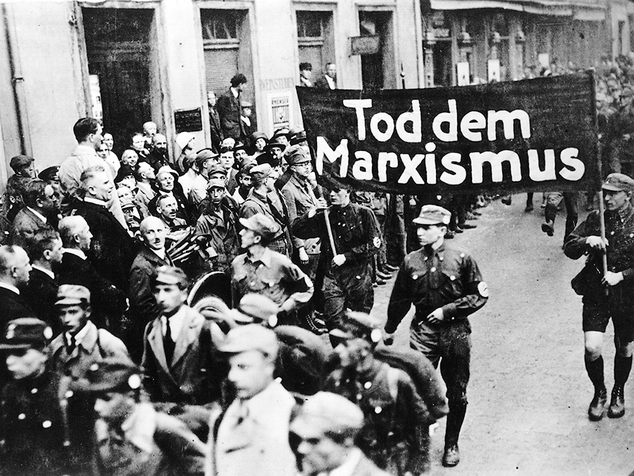

<em>Nazistas dizendo "morte ao marxismo"</em>

Essas descobertas são corroboradas por outro [estudo](http://www.ub.edu/graap/nazi.pdf), este da Universidade de Barcelona. De acordo com este artigo, os nazistas não apenas favoreciam a privatização, eles o fizeram em uma época em que outros governos capitalistas estavam geralmente expandindo a propriedade pública, nacionalizando várias indústrias, etc. A privatização nazista era na verdade "contra o mainstream", como eles a chamam:
>O regime nazista transferiu a propriedade pública e os serviços públicos para o setor privado. Ao fazer isso, eles foram contra as tendências dominantes nos países capitalistas ocidentais, nenhum dos quais sistematicamente reprivatizou empresas durante a década de 1930. A privatização na Alemanha nazista também foi única na transferência para mãos privadas da prestação de serviços públicos anteriormente fornecidos pelo governo. As empresas e os serviços transferidos para a propriedade privada pertenciam a diversos setores.

Quando te disserem que os nazistas eram socialistas, mostre a história de Ernst Thälmann:
>Ernst Thälmann foi um político comunista alemão que foi executado pelo Terceiro Reich neste dia em 1944. Ele foi o líder do Partido Comunista da Alemanha (KPD) de 1925 a 1933. Um stalinista comprometido, Thälmann desempenhou um papel importante durante a política instabilidade da República de Weimar, especialmente em seus anos finais, quando o KPD explicitamente procurou derrubar a democracia liberal da república.
>
:Após o incêndio do Reichstag em 27 de fevereiro de 1933, o Partido Nazista lançou uma nova onda de violência e prisões contra membros do KPD e outros oponentes de esquerda do regime. Isso incluiu Thälmann, que foi preso, torturado e encarcerado em 3 de março daquele ano. Ele foi mantido em confinamento solitário por onze anos, antes de finalmente ser executado no campo de concentração de Buchenwald em 1944. Preso e executado ao lado de Thälmann estava Rudolf Breitscheid, um ex-líder do Partido Social Democrata durante a República de Weimar.
>
>Na prisão de Thälmann, o colega comunista alemão Wilhelm Pieck escreveu "O fato de Ernst Thälmann ter passado seu quinquagésimo aniversário nas prisões do Hitler-Fascismo é um lembrete urgente a todos os antifascistas de todo o mundo que eles devem intensificar para o ao máximo sua campanha pela libertação de Thälmann e dos muitos milhares de vítimas presas do Terror Branco."

Você pode ler alguns dos escritos de Thaelmann [aqui](https://www.marxists.org/deutsch/referenz/thaelmann/index.htm).

Para citar o poema de Martin Niemoller, "Primeiro eles vieram pelos comunistas".

Os nazistas tinham alguns programas sociais, mas apenas para os racialmente puros e apenas como uma forma de manter o apoio da pequena burguesia.

Eles eram violentamente anti-socialistas, matando com gás milhares de comunistas e social-democratas. Eles inventaram o termo "marxismo cultural" e inventaram o conceito de privatizar as indústrias nacionais. Zyklon-B não era o nome químico, era uma MARCA. As primeiras pessoas que os nazistas eliminaram, antes dos homossexuais e muito antes dos judeus e dos ciganos, foram os comunistas. Todos os esquerdistas enfrentaram repressão imediata e constante. Demorou um pouco até que a maior parte do país estivesse bem com prisão e assassinato por motivos raciais, mas os comunistas já eram considerados traidores e eram os únicos grupos que conseguiram lutar em uma capacidade significativa. Hitler gritou algumas coisas anticapitalistas para ganhar o apoio dos trabalhadores. Havia um flanco esquerdo (porém com algumas ideias deturpadas) no NSDAP sob Gregor e Otto Strasser. Strasser era de fato um nazista, com visões nacionalistas e anti-semitas totalmente repreensíveis que ele misturou com algumas idéias econômicas tradicionalmente esquerdistas. E ele era um de alto escalão, comandando o departamento de propaganda do partido e suas operações diárias por um tempo. Mas quaisquer ideias de esquerda que ele tivesse foram, no final da década de 1920, foram [totalmente rejeitadas por Hitler](https://www.simonandschuster.com/books/The-Third-Reich/Thomas-Childers/9781451651140). Strasser renunciou a qualquer posição de autoridade dentro do partido no final de 1932, antes dos nazistas chegarem ao poder em 1933, e ele foi literalmente assassinado pelos nazistas na "Noite das Facas Longas" no início de 1934, quando Hitler tinha centenas de oponentes políticos executados extrajudicialmente - incluindo, crucialmente, toda a ala do partido de Strasser.

Também corre por fóruns de direita e reacionários a suposta frase de Hitler:
>Somos socialistas. Somos inimigos, inimigos mortais, do atual sistema econômico capitalista com sua exploração dos economicamente fracos, com sua injustiça nos salários, com sua avaliação imoral dos indivíduos de acordo com a riqueza e dinheiro em vez de responsabilidade e realização, e estamos determinados sob todos circunstâncias para abolir este sistema!

Porém é fake news. Esta frase é de Gregor Strasser.

O próprio Hitler:
>O socialismo é a ciência que trata do bem-estar comum. Comunismo não é socialismo. Marxismo não é socialismo. Os marxistas roubaram o termo e confundiram seu significado. Vou tirar o socialismo dos socialistas. O socialismo é uma tradição antiga. Instituição ariana e germânica. Nossos ancestrais alemães tinham certas terras em comum. Eles cultivavam a ideia do bem-estar comum. O marxismo não tem o direito de se disfarçar de socialismo. O socialismo, ao contrário do marxismo, não repudia a propriedade privada. Ao contrário do marxismo, não envolve negação da personalidade e, ao contrário do marxismo, é patriótico. Poderíamos ter nos chamado de Partido Liberal. Escolhemos nos chamar de Nacional-Socialistas. Não somos internacionalistas. Nosso socialismo é nacional. Exigimos o cumprimento das justas reivindicações do classes produtivas pelo Estado com base na solidariedade racial. Para nós, Estado e raça são um.

Em outras palavras, ele fez sua própria versão do socialismo, que claramente não tinha nada a ver com os trabalhadores possuindo os meios ou o estado sendo uma ferramenta dos trabalhadores para reprimir a burguesia. Apenas um absurdo nacionalista/racialista (que ele provavelmente inventou na hora na entrevista mencionada; "bem-estar comum", de fato).

Os nazistas só colocaram a palavra Socialista em seu nome porque pensaram que atrairia trabalhadores de esquerda:
>Para aumentar seu apelo a segmentos maiores da população, no mesmo dia do discurso de Hitler em Hofbräuhaus em 24 de fevereiro de 1920, o DAP mudou seu nome para Nationalsozialistische Deutsche Arbeiterpartei ("Partido Nacional Socialista dos Trabalhadores Alemães", ou Partido Nazista). A palavra "socialista" foi acrescentada pelo comitê executivo do partido, apesar das objeções de Hitler, a fim de ajudar a atrair os trabalhadores de esquerda.

Em suma, não, os nazistas não eram socialistas. Agora, vamos refutar rapidamente outro mito.

Fontes:
- [Jacobin | No, the Nazis Were Not Socialists](https://www.jacobinmag.com/2020/10/nazi-socialism-rand-paul-strasser-hitler)
- [Journal of Economic History | The Role of Private Property in the Nazi Economy: The Case of Industry](http://piketty.pse.ens.fr/files/capitalisback/CountryData/Germany/Other/Pre1950Series/RefsHistoricalGermanAccounts/BuchheimScherner06.pdf)

#### Os nazistas não eram sociais-democratas
Eles não eram social-democratas. O partido social-democrata alemão é criado em 1875 e mesclava os ideais marxista e lassaliano. No século 20, eles não se importavam nem um pouco com a revolução e simplesmente queriam estar no poder por meio de eleições para promover políticas de esquerda. Mesmo assim, ainda se viam como socialistas, mesmo quando apoiavam a participação da Alemanha na Primeira Guerra Mundial, o que fez Rosa Luxemburgo criticá-los duramente. Ainda assim, mesmo na revolução de 1918, eles eram o maior partido socialista do país e muito apoiado pelos trabalhadores. Quando a república de Weimar surgiu e eles faziam parte do governo, eram muito odiados pela aristocracia alemã, pelos capitalistas e por quem defendia a velha monarquia militar e burocrática.

Os nazistas, por outro lado, representavam exatamente esse ódio reacionário contra os social-democratas. Eles desprezavam a social-democracia porque os viam como os culpados da derrota da Alemanha na guerra. Não queriam o retorno da monarquia, mas puderam representar os reacionários que, como eles, odiavam a república. Eles tiveram o apoio dos aristocratas, militares e capitalistas que queriam acabar com a social-democracia. Os nazistas não têm absolutamente nada a ver com a social-democracia.

Fontes:
- [Concerning the International Situation](https://www.marxists.org/reference/archive/stalin/works/1924/09/20.htm)

#### Os nazistas não salvaram a Alemanha
Este é um dos favoritos dos apologistas fascistas em todos os lugares. No entanto, na realidade, a economia nazista foi um tremendo fracasso e levou a enormes reduções nos padrões de vida do povo alemão. De acordo com um [estudo](https://www.sciencedirect.com/science/article/pii/S1570677X02000023) publicado na revista Economics and Human Biology:
>Os resultados implicam que a Alemanha experimentou um aumento substancial nas taxas de mortalidade na maioria dos grupos etários em meados da década de 1930, mesmo em relação aos de 1932, o pior ano da Grande Depressão. Além disso, a altura das crianças - um indicador da qualidade da nutrição e saúde - em geral estagnou entre 1933 e 1938, mas aumentou significativamente durante a década de 1920. A perseguição, por si só, não explica um desenvolvimento tão adverso no bem-estar biológico; os segmentos não perseguidos da população alemã também foram afetados.

Esses problemas foram o resultado direto da política econômica nazista:
>A razão para este desenvolvimento adverso foi causado pelo fato de que os gastos militares aumentaram às custas de medidas de saúde pública. Além disso, as importações de alimentos foram reduzidas e os preços de muitos produtos agrícolas controlados. Há ampla evidência de que esse conjunto de políticas econômicas teve um efeito adverso sobre a saúde e o estado nutricional da população.

Fontes:
- [University of Barcelona | Against the Mainstream: Nazi Privatization in 1930s Germany](http://www.ub.edu/graap/nazi.pdf)
- [Economics and Human Biology | Autarchy, Market Disintegration, and Health: The Mortality and Nutritional Crisis in Nazi Germany, 1933-1937](https://sciencedirect.com/science/article/pii/S1570677X02000023)
- [Jewish Telegraphic Agency | Goldmann Warns Against "Distortions" in Charges Against USSR](https://www.jta.org/1965/06/11/archive/goldmann-warns-against-distortions-in-jewish-charges-against-russia)

## A questão Rojava/Curdistão
Rojava não é necessariamente anarquista, eles usam um sistema chamado "confederalismo democrático" de acordo com eles, que é uma mistura de ideologias. O patrocínio americano do SDF e a criação de um estado curdo sírio serve às políticas americanas estratégicas por meio do controle de recursos essenciais, um estado sírio enfraquecido e um estágio do qual contém o Irã. A liderança curda síria explorou essa aliança e o caos da guerra para federalizar unilateralmente (sem referendo nacional). Os dois atores precisam um do outro, mas não devemos confundir qual ator detém o poder. A balcanização se alinha com os interesses curdos, mas a ocupação projeta o domínio americano e enriquece sua classe dominante.

Nesse contexto, você pode ver o Hasakah como não uma aberração ou irrelevância. O SDF lutou contra a SAA pelo controle de um portal importante durante o auge de sua luta contra o ISIS. Relatos de limpeza étnica curda remontam a 2015. Assim, os curdos não estavam apenas se livrando do ISIS, eles estavam em busca de território, recursos e mudanças demográficas. A "guerra civil" produziu condições favoráveis ​​para a secessão e os curdos agiram em busca de seus próprios interesses. Como os EUA apoiaram o SDF com poder aéreo, artilharia e pessoal, não haveria revolução sem o patrocínio americano. Em outra ação pouco notada em 2018, os EUA atiraram contra a SAA em Deir Ezzor, enquanto o SAR tentava recuperar seus recursos de petróleo legítimos. 100 mortos da SAA. Essas ações são vistas isoladamente apenas por causa da mistificação da ocupação americana.

Rojava não está organizada com base na luta de classes. É incorreto dizer que seu estado avançará a luta de classes de alguma forma mais do que a Síria. Um ideal igualitário e a busca pelos direitos de gênero não é uma luta de classes em si. A burguesia curda abandonou Rojava para as cidades ocidentais. O restante é um movimento das classes média e proletária. O componente intermediário tem interesse em manter o Estado como agente do capital global. A questão da luta de classes é subsumida na luta pela identidade curda radical. Inclusive, Abdullah Öcallan que é o fundador do PKK, uma das organizações mais influentes em Rojava, uma vez disse:
>O comunismo fez do governo tudo, mas do ser humano nada. Os Estados Unidos representam desenvolvimento.

A Síria é em si mesma um estado progressista, pluralista e secular, um estado historicamente pós-colonial que protegeu admiravelmente os direitos das minorias. É claro que no Ocidente nunca ouvimos falar dos sucessos da Síria. A Síria é inimiga e implacavelmente demonizada, enquanto a cobertura de Rojava como a "melhor esperança" no Oriente Médio é barulhenta e incessante. Uma campanha de propagandização bem-sucedida alimentada e explorada pela liderança política curda e por nossa classe dominante em busca de seus interesses no Oriente Médio.

Não posso dizer se os curdos tinham opções melhores do que a aliança, mas o resultado é claro. O estado curdo foi conquistado à custa da integridade territorial da Síria e nasceu de uma exploração oportunista do caos de guerra. Rojava, através da ocupação dos EUA agora controla 30% dos campos de grãos e 95% dos campos de petróleo. Os Estados Unidos intermediaram as vendas de petróleo que renderam à Rojava expressivos US$ 10 milhões por mês. É do interesse dos EUA que um estado curdo forneça para seu povo, enquanto a Síria for privada de recursos e lucros essenciais pelos quais poderia se recuperar. Como ainda é política oficial que "Assad deve ir", alia-se uma economia débil incapaz de se recuperar. O povo sírio enfrenta longas filas de combustível e pão e os lucros de Rojava. Esses campos pertencem ao SAR, apreendidos durante a guerra e controlados por ocupantes e clientes americanos.

Para desmistificar Rojava, temos que entender a questão curda. Samir Amin argumentou que os curdos são uma nação contestável. A linguagem é dialeticamente distinta por região. As classes burguesas adotam as línguas do Estado hospedeiro. Os curdos persas falam farsi. Os curdos atuaram como agentes turcos no genocídio assírio e dobraram seu território na apreensão dessas terras. Assírios transferidos para o norte da Síria após o genocídio, vivem em contato próximo com seus agressores históricos. Eles são particularmente amargos e desconfiados do etnonacionalismo expansionista curdo. Nesta guerra, milícias curdas apreenderam casas e propriedades desocupadas, interferiram no currículo escolar e estão implicadas na tentativa de assassinato de um líder político siríaco.

Na Síria, o nacionalismo curdo é um nacionalismo retrógrado. Os curdos representam 7% a 10% da população. Os curdos são uma minoria étnica na Síria, mas nada impede de eles conviverem harmoniosamentecom outras etnias no país, como acontece com os Uighurs na China, tanto é que nem todo curdo é defensor do etno-estado que Rojava pretende construir, assim como existem judeus que são contra o Estado genocida de Israel. Mais importante, o nacionalismo curdo sírio não é uma luta anti-imperialista anticolonial. Ele falha o princípio mais básico do ML ainda, estamos tão confusos com esta situação complexa que vacilamos em relação a Rojava e vacilamos em nosso apoio à Síria, que teve sua soberania barbaramente violada. A Síria é a agredida, não o agressor, não nos esqueçamos disso. A situação atual é uma ocupação americana, provavelmente indefinida, de 30% da Síria. Rojava é um instrumento dessa ocupação. Restam cerca de 4.000 soldados, dez bases e PMC não contabilizados e pessoal de apoio. Dada a primazia do FP para a contenção iraniana, os planejadores militares americanos falaram de um 'Sunnistão' abrangendo o território curdo do Iraque e da Síria. É por meio desses territórios que a América pode conter o Irã, bem como lançar esforços desestabilizadores. É incrivelmente ingênuo acreditar que Rojava exercerá controle sobre as bases americanas, pessoal ou ações anti-Irã. Quanto mais nos distraímos com a discussão do sucesso ou fracasso da revolução em seus próprios méritos, mais mistificamos a agressão e ocupação imperialistas. 

Fontes:
- [Middle East Forum | Abdullah Öcalan: "We Are Fighting Turks Everywhere"](https://www.meforum.org/399/abdullah-ocalan-we-are-fighting-turks-everywhere)
- [Assyrian Confederation Of Europe | Assyrians Under Kurdish Rule: The Situation in Northeastern Syria](https://fanack.com/wp-pdf-reader.php?pdf_src=/wp-content/uploads/ace201701.pdf)
- [Mint Press News | U.S. Coalition Cleansing Raqqa Of Arabs To Expand Kurdish “Autonomous Region”](https://www.mintpressnews.com/u-s-coalition-cleansing-raqqa-of-arabs-to-expand-kurdish-autonomous-region/229054/)
- [Syria Comment | Romancing Rojava: Rhetoric vs. Reality](https://www.joshualandis.com/blog/romancing-rojava-rhetoric-vs-reality/)
- [Voltaire Network | The Kurds: Washington’s Weapon Of Mass Destabilization In The Middle East](https://www.voltairenet.org/article197437.html)
- [Alkarama | SYRIA: 15-YEAR-OLD GIRL ABDUCTED AND FORCIBLY RECRUITED BY THE KURDISH PEOPLE'S PROTECTION UNITS IN DECEMBER 2014 STILL MISSING](https://www.alkarama.org/en/articles/syria-15-year-old-girl-abducted-and-forcibly-recruited-kurdish-peoples-protection-units)
- [Monthly Review | How the U.S. occupied the 30% of Syria containing most of its oil, water and gas](https://mronline.org/2018/04/18/how-the-u-s-occupied-the-30-of-syria-containing-most-of-its-oil-water-and-gas/)
- [Middle East Monitor | Israel businessman working with army has his eye on Syria oil](https://www.middleeastmonitor.com/20190717-israel-businessman-working-with-army-has-his-eye-on-syria-oil/)
- [Gowans Blog | The (Largely Unrecognized) US Occupation of Syria](https://gowans.blog/2018/03/11/the-largely-unrecognized-us-occupation-of-syria/)
- [The Grayzone | All About Syria](https://thegrayzone.com/tag/kurds/)
- [France 24 | In Syria's breadbasket, Kurds and regime battle for wheat](https://www.france24.com/en/20190611-syrias-breadbasket-kurds-regime-battle-wheat)