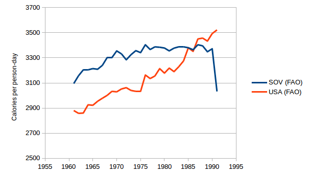
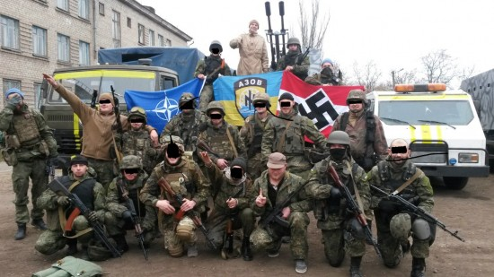

# Essays
* [Mitos](#Mitos)
    * [Mito sobre a origem do dinheiro](#Mito-sobre-a-origem-do-dinheiro)
    * [Espantalho da religião ser o ópio do povo](#Espantalho-da-religião-ser-o-ópio-do-povo)
    * [O imperialismo no mundo moderno](#O-imperialismo-no-mundo-moderno)
    * [O capitalismo não funciona](#O-capitalismo-não-funciona)
    * [O socialismo funciona sim](#O-socialismo-funciona-sim)
    * [Por que a educação no socialismo é melhor](#Por-que-a-educação-no-socialismo-é-melhor)
    * [Invenções soviéticas](#Invenções-soviéticas)
    * [Países socialistas antes do socialismo](#Países-socialistas-antes-do-socialismo)
    * [Lenin não era antissemita](#Lenin-não-era-antissemita)
    * [A violência segundo Lenin](#A-violência-segundo-Lenin)
    * [A origem da teoria da conspiração judaíca-maçom](#A-origem-da-teoria-da-conspiração-judaíca-maçom)
    * [O que realmente é o fascismo e o nazismo](#O-que-realmente-é-o-fascismo-e-o-nazismo)
    * [Mises e Hayek admiravam o fascismo](#Mises-e-Hayek-admiravam-o-fascismo)
    * [O verdadeiro Winston Churchill](#O-verdadeiro-Winston-Churchill)
    * [O socialismo não matou 100 milhões](#O-socialismo-não-matou-100-milhões)
    * [Mitos da revolução russa](#Mitos-da-revolução-russa)
    * [Revoluções não são violentas](#Revoluções-não-são-violentas)
    * [Apenas a luta de classes muda a realidade](#Apenas-a-luta-de-classes-muda-a-realidade)
    * [A União Soviética](#A-União-Soviética)
        * [Revolução, comunismo de guerra e NEP](#Revolução-comunismo-de-guerra-e-NEP)
        * [Desenvolvimento econômico e padrões de vida na era socialista](#Desenvolvimento-econômico-e-padrões-de-vida-na-era-socialista)
        * [Condições de saúde no período socialista](#Condições-de-saúde-no-período-socialista)
        * [A questão Stalin](#A-questão-Stalin)
            * [O grande expurgo](#O-grande-expurgo)
            * [A fome ucraniana (holodomor)](#A-fome-ucraniana-holodomor)
            * [As gulags](#As-gulags)
        * [Trabalhadores na União Soviética](#Trabalhadores-na-União-Soviética)
            * [Participação do trabalhador no local de trabalho](#Participação-do-trabalhador-no-local-de-trabalho)
            * [Participação política na URSS](#Participação-política-na-URSS)
        * [Conclusão sobre os trabalhadores na URSS](#Conclusão-sobre-os-trabalhadores-na-URSS)
        * [Conclusão sobre a URSS](#Conclusão-sobre-a-URSS)
    * [Uma resposta ao bearkunin sobre a URSS](#Uma-resposta-ao-bearkunin-sobre-a-URSS)
    * [Mitos da guerra de inverno](#Mitos-da-guerra-de-inverno)
    * [Segunda Guerra Mundial](#Segunda-Guerra-Mundial)
        * [Mitos do pacto Molotov-Ribbentrop](#Mitos-do-pacto-Molotov-Ribbentrop)
        * [Mitos da invasão polonesa](#Mitos-da-invasão-polonesa)
        * [A URSS sabia que Hitler ia atacar](#A-URSS-sabia-que-Hitler-ia-atacar)
        * [A URSS foi a maior responsável pela derrota dos nazistas](#A-URSS-foi-a-maior-responsável-pela-derrota-dos-nazistas)
        * [O plano era deixar os nazistas massacrarem a URSS](#O-plano-era-deixar-os-nazistas-massacrarem-a-URSS)
        * [Hitler não era um grande estrategista](#Hitler-não-era-um-grande-estrategista)
        * [A família britânica e o nazismo](#A-família-britânica-e-o-nazismo)
        * [O mito do massacre de Katyn](#O-mito-do-massacre-de-Katyn)
        * [Sobre os crimes de guerra do Exército Vermelho](#Sobre-os-crimes-de-guerra-do-Exército-Vermelho)
    * [Adam Smith concordava com Marx](#Adam-Smith-concordava-com-Marx)
    * [Mitos sobre Marx](#Mitos-sobre-Marx)
    * [A constituição soviética era respeitada](#A-constituição-soviética-era-respeitada)
    * [A URSS foi o país que mais cresceu no século XX](#A-URSS-foi-o-país-que-mais-cresceu-no-século-XX)
    * [Vargas não era fascista nem o pai dos pobres](#Vargas-não-era-fascista-nem-o-pai-dos-pobres)
    * [A China não começou a crescer com o livre-mercado](#A-China-não-começou-a-crescer-com-o-livre-mercado)
    * [O comunismo resolveu as fomes](#O-comunismo-resolveu-a-fome)
    * [O mito das religiões no socialismo](#O-mito-das-religiões-no-socialismo)
    * [Não havia um fosso entre os EUA e a URSS](#Não-havia-um-fosso-entre-os-EUA-e-a-URSS)
    * [A farsa do discurso secreto](#A-farsa-do-discurso-secreto)
    * [Mitos sobre Che Guevara e Fidel Castro](#Mitos-sobre-Che-Guevara-e-Fidel-Castro)
    * [Como a Romênia realmente caiu](#Como-a-Romênia-realmente-caiu)
        * [A farsa do julgamento de Ceausescu](#A-farsa-do-julgamento-de-Ceausescu)
    * [Como a URSS realmente colapsou](#Como-a-URSS-realmente-colapsou)
    * [O mito dos uigures](#O-mito-dos-uigures)
    * [O mito dos Falun Gong](#O-mito-dos-Falun-Gong)
    * [O mito de Tiananmen](#O-mito-de-Tiananmen)
    * [Mitos do muro de Berlim](#Mitos-do-muro-de-Berlim)
    * [A Rússia não é imperialista](#A-Rússia-não-é-imperialista)
    * [Mito da opinião sobre o socialismo](#Mito-da-opinião-sobre-o-socialismo)
    * [A farsa do 11 de setembro](#A-farsa-do-11-de-setembro)
    * [O verdadeiro motivo da Guerra do Iraque](#O-verdadeiro-motivo-da-Guerra-do-Iraque)
    * [Fidel sobre a China](#Fidel-sobre-a-China)
    * [Sanções são crimes](#Sanções-são-crimes)
    * [A verdade sobre Putin e Navalny](#A-verdade-sobre-Putin-e-Navalny)
    * [A Venezuela não é socialista](#A-Venezuela-não-é-socialista)
    * [Mitos sobre a China na África](#Mitos-sobre-a-China-na-África)
    * [Mitos sobre a China ambiental](#Mitos-sobre-a-China-ambiental)
    * [Contra-história do liberalismo](#Contra-história-do-liberalismo)
    * [O socialismo não destruiu a América](#O-socialismo-não-destruiu-a-América)
    * [A farsa de Zhang-Zhan](#A-farsa-de-Zhang-Zhan)
    * [Eleições em Cuba](#Eleições-em-Cuba)
    * [Como os ricos ficaram ricos](#Como-os-ricos-ficaram-ricos)
    * [A Globo apoiou a ditadura](#A-Globo-apoiou-a-ditadura)
    * [Os países de esquerda são os que menos tem fome](#Os-países-de-esquerda-são-os-que-menos-tem-fome)
    * [Avanços notáveis de Cuba](#Avanços-notáveis-de-Cuba)
    * [Israel na pandemia](#Israel-na-pandemia)
    * [Ser anti-sionista não é ser antissemita](#Ser-anti-sionista-não-é-ser-antissemita)
    * [Mito dos refugiados cubanos](#Mito-dos-refugiados-cubanos)
    * [Golpe da Bolívia](#Golpe-da-Bolívia)
    * [Guaidó não é o presidente legítimo](#Guaidó-não-é-o-presidente-legítimo)
    * [Mitos sobre a China na quarentena](#Mitos-sobre-a-China-na-quarentena)
    * [A seleção soviética](#A-seleção-soviética)
    * [Democratas e republicanos não sabem o que é socialismo](#Democratas-e-republicanos-não-sabem-o-que-é-socialismo)
    * [Estupros no Haiti](#Estupros-no-Haiti)
    * [Ex-países socialistas hoje](#Ex-países-socialistas-hoje)
    * [Países socialistas na pandemia](#Países-socialistas-na-pandemia)
    * [A falsa afirmação de Li-Meng Yan](#A-falsa-afirmação-de-Li-Meng-Yan)
    * [Pan-africanismo não é anticomunista](#Pan-africanismo-não-é-anticomunista)
    * [O problema do socialismo em países centrais](#O-problema-do-socialismo-em-países-centrais)
    * [O socialismo livrou a África da colonização](#O-socialismo-livrou-a-África-da-colonização)
    * [A natureza do capitalismo](#A-natureza-do-capitalismo)
    * [Os socialistas quem criaram as férias de verão e dia das mulheres](#Os-socialistas-quem-criaram-as-férias-de-verão-e-dia-das-mulheres)
    * [Contra o socialista de iPhone e o pobre de direita](#Contra-o-socialista-de-iPhone-e-o-pobre-de-direita)
    * [O setor público e militar quem criou as maiores tecnologias atualmente](#O-setor-público-e-militar-quem-criou-as-maiores-tecnologias-atualmente)
* [Desmistificando o setor público brasileiro](#Desmistificando-o-setor-público-brasileiro)
    * [O caso Petrobrás](#O-caso-Petrobrás)
    * [Por que a educação brasileira é tão ruim](#Por-que-a-educação-brasileira-é-tão-ruim)
    * [Por que o setor público de saúde é tão ruim](#Por-que-o-setor-público-de-saúde-é-tão-ruim)
* [História](#História)
    * [O que é neoliberalismo](#O-que-é-neoliberalismo)
    * [Crimes americanos e anti-comunistas](#Crimes-americanos-e-anti-comunistas)
        * [Nacionais](#Nacionais)
            * [Eugenia](#Eugenia)
            * [Milhares de americanos ficaram doentes em detrimento de testes de bombas atômicas da operação Plumbbob](#Milhares-de-americanos-ficaram-doentes-em-detrimento-de-testes-de-bombas-atômicas-da-operação-Plumbbob)
            * [Os americanos espalharam 300 mil mosquitos Aedes Aegypti no estado da Georgia em 1955 na operação Big Buzz](#Os-americanos-espalharam-300-mil-mosquitos-Aedes-Aegypti-no-estado-da-Georgia-em-1955-na-operação-Big-Buzz)
            * [Os americanos liberaram vários mosquitos que continham febre amarela na Georgia em 1956 como parte da operação May Day](#Os-americanos-liberaram-vários-mosquitos-que-continham-febre-amarela-na-Georgia-em-1956-como-parte-da-operação-May-Day)
            * [Operação Green Run](#Operação-Green-Run)
            * [Operação LAC](#Operação-LAC)
            * [Os americanos espalharam 600 mil mosquitos na Flórida em 1958 como parte da operação Drop Kick para ver o estrago que eles poderiam causar](#Os-americanos-espalharam-600-mil-mosquitos-na-Flórida-em-1958-como-parte-da-operação-Drop-Kick-para-ver-o-estrago-que-eles-poderiam-causar)
            * [MKULTRA e manuais KUBARK](#MKULTRA-e-manuais-KUBARK)
                * [Operação Midnight Climax](#Operação-Midnight-Climax)
            * [Massacre de Wounded Knee](#Massacre-de-Wounded-Knee)
            * [Experimentos com siflis em negros de Tuskegee](#Experimentos-com-siflis-em-negros-de-Tuskegee)
            * [Massacre de Ludlow](#Massacre-de-Ludlow)
            * [Bombardeio de negros do MOVE na Filadélfia em 1978](#Bombardeio-de-negros-do-MOVE-na-Filadélfia-em-1978)
            * [Teste de armas químicas em sua própria população com a operação Sea-Spray](#Teste-de-armas-químicas-em-sua-própria-população-com-a-operação-Sea-Spray)
            * [Operação Top Hat](#Operação-Top-Hat)
            * [Teste de armas químicas em presos de Holmesburg](#Teste-de-armas-químicas-em-presos-de-Holmesburg)
        * [Grande marcha para o oeste]()
        * [Argentina](#Argentina)
            * [Guerra suja](#Guerra-suja)
        * [Brasil](#Brasil)
            * [Ditadura militar brasileira e operação brother sam](#Ditadura-militar-brasileira-e-operação-brother-sam)
            * [Plano cohen](#Plano-cohen)
        * [Bulgária](#Bulgária)
            * [Terror branco búlgaro](#Terror-branco-búlgaro)
        * [China](#China)
            * [Terror branco chinês](#Terror-branco-chinês)
        * [Coreia](#Coreia)
            * [Massacre de No Gun Ri](#Massacre-de-No-Gun-Ri)
            * [Massacre das Ligas Bodo](#Massacre-das-Ligas-Bodo)
            * [Massacre de Jeju](#Massacre-de-Jeju)
            * [Massacre de Gwangju](#Massacre-de-Gwangju)
        * [Espanha](#Espanha)
            * [Terror branco espanhol](#Terror-branco-espanhol)
        * [Filipinas](#Filipinas)
            * [Massacre de Balangiga](#Massacre-de-Balangiga)
        * [Finlândia](#Finlândia)
            * [Terror branco finlandês](#Terror-branco-finlandês)
        * [França](#França)
            * [Primeiro terror branco](#Primeiro-terror-branco)
            * [Segundo terror branco](#Segundo-terror-branco)
            * [Contaminação de LSD pela CIA em pães de Pont-Saint-Esprit](#Contaminação-de-LSD-pela-CIA-em-pães-de-Pont-Saint-Esprit)
        * [Grécia](#Grécia)
            * [Terror branco grego](#Terror-branco-grego)
        * [Hungria](#Hungria)
            * [Terror branco húngaro](#Terror-branco-húngaro)
        * [Índia](#Índia)
            * [Incidente de Bhopal](#Incidente-de-Bhopal)
        * [Indonésia](#Indonésia)
            * [Tentativa de golpe de 1958](#Tentativa-de-golpe-de-1958)
            * [Massacre de 65](#Massacre-de-65)
        * [Rússia](#Rússia)
            * [Terror branco russo](#Terror-branco-russo)
        * [Taiwan](#Taiwan)
            * [Terror branco taiwanês](#Terror-branco-taiwanês)
        * [Vietnã](#Vietnã)
            * [Massacre de My Lay]()
        * [Operação condor](#Operação-condor)
        * [Operação Gládio]()
        * [Bad Nanndorf]()
        * [Guantánamo]()
        * [Escravidão na Líbia]()
        * [Guerra do Iêmen]()
    * [Chile de Pinochet]()
    * [China hoje]()
    * [Vietnã hoje]()
    * [Líbia de Gaddafi]()
    * [Guerra da Síria]()
* [Economia](#Economia)
    * [Não existe problema do cálculo econômico](#Não-existe-problema-do-cálculo-econômico)
    * [A preferência temporal não refutou o socialismo](#A-preferência-temporal-não-refutou-o-socialismo)
    * [Teorema do segundo melhor](#Teorema-do-segundo-melhor)
    * [Cooperativismo e equilíbrio de Nash](#Cooperativismo-e-equilíbrio-de-Nash)
        * [O que é teoria dos jogos](#O-que-é-teoria-dos-jogos)
    * [Marginalismo é pseudociência](#Marginalismo-é-pseudociência)
    * [Teorema Sonnenschein-Mantel-Debreu](#Teorema-Sonnenschein-Mantel-Debreu)
    * [Refutando o teorema de Okishio](#Refutando-o-teorema-de-Okishio)
    * [Teoremas nem sempre representam a realidade](#Teoremas-nem-sempre-representam-a-realidade)
    * [Refutando a teoria da escolha pública](#Refutando-a-teoria-da-escolha-pública)
    * [Contra as definições liberais](#Contra-as-definições-liberais)
    * [A farsa da liberdade econômica](#A-farsa-da-liberdade-econômica)
    * [Corte de direitos tabalhistas não gera mais emprego](#Corte-de-direitos-tabalhistas-não-gera-mais-emprego)
    * [Provando que a planificação é mais eficiente](#Provando-que-a-planificação-é-mais-eficiente)
    * [Modern Monetary Theory](#Modern-Monetary-Theory)
    * [Economia baseada em recursos](#Economia-baseada-em-recursos)
    * [Planificação econômica](#Planificação-econômica)
        * [Cálculo em espécie](#Cálculo-em-espécie)
        * [Teoria do equilíbrio material](#Teoria-do-equilíbrio-material)
        * [Planificação indicativa](#Planificação-indicativa)
        * [Planificação cibernética](#Planificação-cibernética)
    * [Lista de economistas](#Lista-de-economistas)
* [Geral](#Geral)
    * [Council on Foreign Relations](#Council-on-Foreign-Relations)
    * [Comprar roupas socialistas no Brasil](#Comprar-roupas-socialistas-no-Brasil)
* [Críticas](#Críticas)
    * [Em defesa da pirataria](#Em-defesa-da-pirataria)
    * [Em defesa do keynesianismo](#Em-defesa-do-keynesianismo)
    * [O problema do marxismo ocidental](#O-problema-do-marxismo-ocidental)
    * [Contra o sistema ANCAP](#Contra-o-sistema-ANCAP)
        * [Falhas da ética de primeiro uso](#Falhas-da-ética-de-primeiro-uso)
        * [Paradoxo de Sen](#Paradoxo-de-Sen)
    * [Contra o ecofascismo](#Contra-o-ecofascismo)
    * [Contra o punitivismo e o lado oculto de Churchill](#Contra-o-punitivismo-e-o-lado-oculto-de-Churchill)
* [Realidade capitalista](#Realidade-capitalista)
    * [Acumulação primitiva de capital e o cerceamento de terras](#Acumulação-primitiva-de-capital-e-o-cerceamento-de-terras)
    * [Capitalismo matou 120 milhões de fome em 20 anos](#Capitalismo-matou-120-milhões-de-fome-em-20-anos)
    * [O capitalismo trouxe três quartos dos russos a fome](#O-capitalismo-trouxe-três-quartos-dos-russos-a-fome)
    * [França censura muçulmanos](#França-censura-muçulmanos)
    * [EUA censura cientista por divulgar dados da COVID](#EUA-censura-cientista-por-divulgar-dados-da-COVID)
    * [EUA demite funcionária por não jurar lealdade a Israel](#EUA-demite-funcionária-por-não-jurar-lealdade-a-Israel)
    * [Sedition Act](#Sedition-Act)
    * [Israel hackeia redes sociais](#Israel-hackeia-redes-sociais)
    * [A miséria do pobre é o triunfo do rico](#A-miséria-do-pobre-é-o-triunfo-do-rico)
    * [Falsificação das eleições americanas](#Falsificação-das-eleições-americanas)
    * [Campos de concentração americanos](#Campos-de-concentração-americanos)
    * [Campos de concentração brasileiros](#Campos-de-concentração-brasileiros)
    * [Georgia Senate Bill 202](#Georgia-Senate-Bill-202)
    * [Confissão de Smedley Butler](#Confissão-de-Smedley-Butler)
    * [Gaiolas de Hong Kong](#Gaiolas-de-Hong-Kong)
    * [Realidade sul-coreana e fome](#Realidade-sul-coreana-e-fome)
    * [Modelo eleitoral americano](#Modelo-eleitoral-americano)
    * [A verdade sobre as migrações coreanas](#A-verdade-sobre-as-migrações-coreanas)
    * [Kim Jong-Un tem apoio de 80 por cento na Coreia do Sul](#Kim-Jong-Un-tem-apoio-de-80-por-cento-na-Coreia-do-Sul)
    * [Brasil é o terceiro país com mais terra nas mãos de estrangeiros](#Brasil-é-o-terceiro-país-com-mais-terra-nas-mãos-de-estrangeiros)
    * [EUA tenta impedir programa brasileiro de foguetes](#EUA-tenta-impedir-programa-brasileiro-de-foguetes)
    * [PRISM](#PRISM)
    * [EUA espionava Petrobrás para ganhar vantagens em negociações sobre o pré-sal](#EUA-espionava-Petrobrás-para-ganhar-vantagens-em-negociações-sobre-o-pré-sal)
    * [Alessandra Korap diz que não existe democracia para indígenas no Brasil](#Alessandra-Korap-diz-que-não-existe-democracia-para-indígenas-no-Brasil)
    * [Péssimas condições de trabalho da Amazon]()
    * [EUA esterializou e arrancou úteros de mulheres imigrantes](#EUA-esterializou-e-arrancou-úteros-de-mulheres-imigrantes)
    * [A esquecida oposição do projeto Apollo](#A-esquecida-oposição-do-projeto-Apollo)
    * [Fome americana](#Fome-americana)
    * [Resolução 69 160 da ONU](#Resolução-69-160-da-ONU)
    * [Sempre desconfie da Wikipedia](#Sempre-desconfie-da-Wikipedia)
* [Pedagogia](#Pedagogia)
    * [Dualismo educacional](#Dualismo-educacional)
    * [Montessori](#Montessori)
    * [Vygotsky](#Vygotski)
    * [Makarenko](#Makarenko)
    * [Construtivismo](#Construtivismo)
    * [Freirianismo](#Freirianismo)
* [Sociologia](#Sociologia)
    * [Sociedade do espetáculo](#Sociedade-do-espetáculo)
    * [Sociedade do cansaço](#Sociedade-do-cansaço)
* [Criminologia](#Criminologia)
* [Teoria das relações internacionais](#Teoria-das-relações-internacionais)
* [Teoria crítica](#Teoria-crítica)
    * [Indústria cultural](#Indústria-cultural)
        * [Início da indústria cultural](#Início-da-indústria-cultural)
        * [Época de ouro do capitalismo](#Época-de-ouro-do-capitalismo)
        * [Realismo capitalista e o fim da história](#Realismo-capitalista-e-o-fim-da-história)
* [Teoria verde e ambientalismo](#Teoria-verde-e-ambientalismo)
    * [Conservacionismo vs preservacionismo](#Conservacionismo-vs-preservacionismo)

# Mitos
## Mito sobre a origem do dinheiro
Você alguma vez já ouviu falar que sociedades antigas tinham sua economia baseadas em [escambo](https://pt.wikipedia.org/wiki/Escambo) e que essa forma de troca era muito ineficiente e daí surgiu o dinheiro? Pois bem, é mentira.

Foi ao contrário, o escambo surgiu após a criação do dinheiro. Os povos pré-colombianos consideravam-se uma família (como a maioria das sociedades "primitivas"), consideravam o povo inteiro como uma família única, porque a produção era compartilhada entre TODOS, a propriedade era compartilhada entre TODOS.

O "mito do escambo" surgiu com a tese científica de Adam Smith no qual dizia ACHAR (isso mesmo, EU ACHO em uma tese científica...) que o dinheiro vinha do escambo, mas estudos antropológicos e sociológicos atuais descobriram que o escambo vinha de mercados com economias falidas. No entanto, sobre a criação do dinheiro, há várias hipóteses e controvérsias.

Esse mito é mantido até hoje, porque deslegitimizaria o discurso positivista burguês.

Para mais informações https://www.theatlantic.com/business/archive/2016/02/barter-society-myth/471051/

## Espantalho da religião ser o ópio do povo
"A religião é o ópio do povo" não é uma frase exclusiva de Marx, e ela vem desde Kant, Feuerbach e Hegel. É uma expressão em latim. Aqui a frase completa de Marx:
> O sofrimento religioso é ao mesmo tempo a expressão do sofrimento real e um protesto contra o sofrimento real. A religião é o suspiro da criatura oprimida, o coração de um mundo sem coração e a alma de condições desalmadas. É o ópio do povo.

É fácil atacar tudo fazendo [espantalho](https://pt.wikipedia.org/wiki/Fal%C3%A1cia_do_espantalho)

## O imperialismo no mundo moderno
Há uma noção de que o capitalismo é o estado natural das coisas (não é, o capitalismo existe há apenas algumas centenas de anos) no mundo e que tudo sempre funcionou assim mais ou menos. É claro que qualquer exame completo da história mostra que isso não é verdade - todas as muitas nações do mundo tiveram suas próprias maneiras de se desenvolver, crescer e existir no mundo. No entanto, o imperialismo europeu se propôs a garantir "a maneira como o mundo funciona", se tornando a maneira que os estados mais poderosos da Europa querem, e o capitalismo será instalado com violência e força sob a mira de uma arma. Você pode ver esta expansão violenta e esmagamento forçado de qualquer autodeterminação nacional por potências americanas/europeias na maior parte do mundo: a América massacrando um continente para roubá-lo para si (e, em seguida, reivindicando as ilhas vizinhas - mesmo aquelas na metade do mundo), a Europa colonizando e saqueando a África, as várias empresas de comércio da Índia nas ilhas do Atlântico e do Pacífico, as Guerras do Ópio na China, os franceses transformando o Vietnã em suas próprias plantações de escravos, a Índia britânica, nativos australianos - quase não sobrou nenhum lugar do mundo.

A maior parte deste processo é bastante óbvio e permanece muito claro até cerca de 1918 a 1945, onde é obstruído por dois enormes conflitos (a Primeira Guerra Mundial foi um conflito de Capitalismo Financeiro vs Capitalismo Industrial - cujo sistema viria a dominar o globo, e a Segunda Guerra Mundial foi em grande parte uma guerra imperialista no que diz respeito ao Ocidente - não foi travada (pelo Ocidente) para impedir o genocídio, nem mesmo para honrar tratados - Alemanha e Japão estavam se intrometendo em território britânico e americano - esse era o problema). De acordo com a mitologia tácita do Ocidente, o imperialismo basicamente parou após a 2ª Guerra Mundial, e os europeus pararam de invadir outros países para roubar seus recursos e instalar regimes fantoches porque isso era flagrantemente ruim agora aos olhos do mundo que viu a destruição que Hitler forjou.

Claro, isso nunca impediu europeus e americanos de continuarem a pilhagem sem fim do planeta - apenas os incomodava fazer isso da maneira como antes (lembre-se, o capitalismo é o sistema da coerção). Um dos benefícios do capitalismo é que todas as antigas reivindicações de terras e propriedades (especialmente aquelas sobre os meios de produção) permitem que você devolva à governança de uma nação ao seu povo (por exemplo, EUA) sem realmente devolver às partes importantes do país (por ex, Congo) - aqueles podem permanecer sob propriedade europeia ou americana. Ou fortemente conectado a contratos de negócios europeus/americanos que favorecem fortemente a realização de riqueza no lado euro/americano da fronteira. Portanto, a fábrica continua produzindo, mas os produtos vão para a América ou Europa, junto com grande parte dos lucros. Mas por que qualquer governo concordaria com um acordo como esse, tão prejudicial para seu próprio povo? O que o país ganha em troca? Bem, em grande parte, o pagamento da dívida - muitas vezes dívidas duvidosas, colocadas em prática pelas mesmas potências europeias e americanas durante suas ocupações. Ou dívidas francamente maliciosas e enganosas que foram feitas sem interesse de concessão de crédito, mas por pura usura (isso costumava ser um crime uma vez, e condenado pela Igreja Católica). E como os juros compostos são uma força tão poderosa, essas dívidas continuam a crescer mais rápido do que a capacidade de pagamento do país.

Em muitos casos, os países do terceiro mundo pagaram suas principais dívidas muitas vezes, mas continuam a cair cada vez mais fundo porque os juros crescem mais rápido do que a economia permite. E porque o dinheiro devido é a instituições americanas/europeias, eles conseguem definir os termos de tal arranjo, e ao invés de desenvolver a economia de uma nação a custo, eles optam por despojá-la de seus recursos, até devorando a capacidade econômica de desenvolver a economia. Então, por que as nações não resistem ativamente a esse tipo de coisa? Bem, as tentativas pacíficas de fazê-lo foram facilmente cooptadas, suprimidas e, quando não o foram, foram totalmente destruídas. Isto é o que significa grande parte da intervenção americana (e europeia) ao redor do globo - eliminar violentamente aqueles que desafiariam a classe capitalista. Claro, a resistência genuína a esta opressão emerge dela - estes foram/são os movimentos comunistas dos séculos 20 e 21 ao redor do globo - nações que se recusam a participar neste jogo desonesto e optam por um modelo alternativo de desenvolvimento e para o seu próprio povo. Vietnã e Cuba não se tornaram comunistas porque o alcance soviético foi capaz de se estender de alguma forma ao redor do mundo e eles tiveram que fazer o que Moscou lhes disse. O Vietnã se tornou comunista porque eles descobriram isso e não queriam ser escravos da França até o fim dos tempos. Cuba tornou-se comunista porque a América instalou um ditador brutal sobre eles para extrair a pouca riqueza que eles tinham para enriquecer a riqueza que os americanos investiram na ilha. O Irã era uma democracia próspera na década de 1950, por que a América, "o campeão da democracia" os derrubaria para instalar um ditador? Porque eles ousaram desafiar os interesses comerciais americanos. É para isso que servem o enorme Exército militar americano - é por isso que o orçamento militar dos EUA nunca parou de aumentar quando os soviéticos foram embora.

Estes são os seus milhares e milhares de bombardeios americanos, assassinatos, golpes, intervenções, etc. em todo o mundo - "lutar contra o comunismo" não é uma luta contra os opressores soviéticos do mal - "lutar contra o comunismo" é sobre esmagar qualquer nação ou grupo que pensa não devem ser forçados a jogar pelas regras americanas/europeias que instalaram-se à força no seu país. As mais de 900 bases militares americanas em todo o mundo não estão lá "para ajudar na proteção contra os malfeitores." Tampouco existem bases para atuar como "polícia mundial", mantendo os criminosos à distância. As mais de 900 bases são as armas, muito literais e muito reais, apontadas para as cabeças de todos os países do mundo, armadas e prontas para disparar no momento em que qualquer elemento ou instituição significativa  nesses países fique significativamente fora de linha com os interesses comerciais americanos e ameaçando interromper o processo de extração em curso e interminável - até que toda a riqueza de uma nação seja extraída dele, para o duvidoso benefício dos consumidores da classe média americana e para o benefício significativo de um punhado de investidores já imensamente ricos e proprietários. Há uma razão muito real pela qual os únicos lugares a se desenvolver a partir do terceiro mundo na era do imperialismo são os estados clientes americanos na Ásia, funcionando como uma extensão do Império, ou aqueles que são, ou pelo menos foram, comunistas, e lutaram ativamente para se libertarem do jugo europeu/americano.

É por isso que você vê comunistas "radicais" apoiando ativamente regimes como a Coreia do Norte ou Assad na Síria - não porque Assad seja uma figura comunista heróica ou porque a Coreia do Norte é o modelo para o comunismo - mas porque essas nações têm o direito de dizer não à determinação empresarial americana de suas terras e de seu povo - um direito de não ser depenado até o osso de seus recursos e seu trabalho para fornecer mais lixo e aterro para o consumo americano, de modo que alguns bilionários que fizeram todo o processo acontecer possam obter um pouco mais de lucro.

## O capitalismo não funciona
Antes de tudo, na minha concepção, um sistema econômico que dê certo tem que ter os seguintes atrbutos.

1) Desenvolvimento industrial, algo que pode ser obtido tanto pelo capitalismo como pelo socialismo.
2) Suprir as necessidades básicas de todos, algo que países socialistas pobres conseguem e países capitalistas muito ricos conseguem.
3) Garantir a educação nos moldes do pensamento crítico e do iluminismo, em prol do desenvolvimento científico.

Há evidências significativas de que as políticas capitalistas têm um efeito prejudicial sobre a saúde, especialmente porque resultam em desigualdade. De acordo com um [estudo](https://journals.sagepub.com/doi/10.1177/0020731416653428?icid=int.sj-abstract.similar-articles.1) publicado no International Journal of Health Services, "há uma forte correlação entre a desigualdade de renda e os resultados de saúde [negativos]". Além disso, eles descobriram que "os países que não usam empréstimos do Fundo Monetário Internacional têm melhor desempenho em termos de saúde". Outro [estudo](https://www.sciencedirect.com/science/article/abs/pii/S0277953614008399), este publicado na revista Social Science and Medicine, descobriu que "grandes diferenças de renda têm consequências sociais e de saúde prejudiciais" e que "diminuir a diferença melhorará a saúde e o bem-estar das populações".

[1 em cada 7 cidadãos americanos precisa visitar bancos de alimentos para sobreviver](https://www.usatoday.com/story/news/nation/2014/08/17/hunger-study-food/14195585/), apesar de ter comida suficiente para alimentar [10 bilhões de pessoas](https://www.oxfam.ca/there-enough-food-feed-world). Metade de todos os alimentos produzidos é [jogada fora pelos varejistas](https://www.theguardian.com/environment/2016/jul/13/us-food-waste-ugly-fruit-vegetables-perfect). O desperdício de alimentos em 2018 foi o suficiente para [acabar com a fome mundial 4 vezes](https://reliefweb.int/report/world/food-waste-enough-feed-world-s-hungry-four-times-over). [UNICEF](http://www.unicef.org/sowc06/pdfs/sowc06_chap1.pdf), [RESULTS](https://web.archive.org/web/20080527011602/http://www.results.org/website/article.asp?id=241) e [Bread for the World](http://www.bread.org/hunger/global/facts.html) estimam que **15 milhões** de pessoas em todo o mundo morrem a cada ano de [pobreza evitável](http://archive.is/2CvOW), das quais 11 milhões são crianças menores de cinco anos. Só nos EUA, há [20-40 mil mortes](http://obamacarefacts.com/facts-on-deaths-due-to-lack-of-health-insurance-in-us/) todos os anos devido à falta de seguro/assistência médica. Em média, isso representa 300 mil na última década. [O número de casas vazias superam os números de sem-teto de 6 casas para cada 1 sem-teto](http://archive.today/2014.05.23-032153/http://www.huffingtonpost.com/richard-skip-bronson/post_733_b_692546.html). Execuções hipotecárias de bancos e especuladores imobiliários deixaram 18,9 milhões de casas vazias. [2,5 milhões de crianças sem-teto, ou ~1/30](https://www.newsweek.com/child-homelessness-us-reaches-historic-high-report-says-285052). No Reino Unido, [há 10 vezes mais casas vazias do que famílias sem-teto](http://www.mirror.co.uk/news/ampp3d/housing-crisis-10-empty-homes-5008151).

O aumento dos preços das moradias devido à especulação imobiliária disparou a tal ponto que surgiu uma epidemia de [desabrigados escondidos](https://www.cbsnews.com/news/los-angeles-hidden-homeless-priced-out-cbsn-originals/): famílias que moram em seus carros, ou na rua, mas ainda trabalham. Na maioria das cidades dos EUA, como LA, é ilegal dormir no carro durante a noite. 1/3 de todos os inquilinos pagam metade de sua renda aos proprietários. Até mesmo cidades de médio porte como Boise Idaho estão enfrentando um [surto de desabrigados a partir de 2019](https://www.kivitv.com/news/state-of-208/affordable-housing-crisis-leading-to-rise-in-first-time-homelessness-in-boise). [80% dos trabalhadores americanos vivem de PtP (Paycheck to Paycheck)](https://www.theguardian.com/commentisfree/2018/jul/29/us-economy-workers-paycheck-robert-reich), 40% não podem cobrir uma [emergência de $400](http://theeconomiccollapseblog.com/archives/federal-reserve-more-than-4-out-of-10-americans-do-not-even-have-enough-money-to-cover-an-unexpected-400-expense). A metade inferior dos cidadãos americanos [tem um patrimônio líquido negativo combinado](https://www.timesunion.com/technology/businessinsider/article/One-brutal-sentence-captures-what-a-disaster-13882763.php). Uma família média nos EUA tem uma dívida de mais ou menos $140k. A renda familiar média de apenas $60k. [40% dos millenials vivem com os pais](http://theeconomiccollapseblog.com/archives/goodbye-american-dream-the-average-u-s-household-is-137063-in-debt-and-38-4-of-millennials-live-with-their-parents). As gerações mais jovens, com oportunidades cada vez menores, [sentindo-se descartáveis](https://www.gq-magazine.co.uk/article/hikikomori-japan) e indesejadas sob o capitalismo tardio, sofrem de uma [epidemia de esgotamento](https://www.buzzfeednews.com/article/annehelenpetersen/millennials-burnout-generation-debt-work). Muitos [pararam de buscar relacionamentos românticos](https://www.theguardian.com/world/2013/oct/20/young-people-japan-stopped-having-sex) e de [ter filhos](https://www.curbed.com/2019/7/19/20700379/raising-kids-cities-family-friendly). Mais ou menos 1/4 dos trabalhadores dos EUA estão [presos na economia gig (autônomos e freelancers)](https://www.theguardian.com/commentisfree/2019/jun/02/gig-economy-us-trump-uber-california-robert-reich) desde 2019.

70% dos cidadãos americanos [dizem que estão com dificuldades financeiras](https://www.cbsnews.com/news/70-americans-are-struggling-financially/). [8 homens controlam a mesma riqueza quanto metade da população mundial](https://www.inc.com/melanie-curtin/meet-the-8-men-who-control-half-the-worlds-wealth.html). Alguém quer adivinhar como esse jogo de monopólio termina? Monopólios capitalistas na mídia, alimentos, energia e transporte, [controlados principalmente por cerca de 200 acionistas poderosos](https://imgur.com/a/xgnEp). [Os bilionários ganharam dinheiro suficiente](https://www.newsweek.com/billionaires-money-end-poverty-report-786675) em 2017 para acabar com a pobreza sete vezes.

[A expectativa de vida nos EUA atingiu o pico](https://i.redd.it/6zo861tkn0441.png) em 2014, [está em declínio](https://www.reuters.com/article/us-health-life-expectancy/us-life-expectancy-declining-due-to-more-deaths-in-middle-age-idUSKBN1Y02C7) e agora é [menor do que na China](https://www.businessinsider.com/china-boasts-that-its-healthy-life-expectancy-beats-the-us-is-correct-2018-5). As taxas de suicídio saltaram [mais de 33% nos últimos 20 anos](https://politsturm.com/american-suicide-rate-up-33/) e mais de [25% segundo o CDC](https://edition.cnn.com/2018/06/07/health/suicide-report-cdc/index.html) desde 1999, e vem [aumentando cada vez mais](https://www.washingtonpost.com/news/to-your-health/wp/2018/06/07/u-s-suicide-rates-rise-sharply-across-the-country-new-report-shows/). Os suicídios de adolescentes estão aumentando e [ultrapassando todas as outras faixas etárias](http://archive.is/Ips7C). Uma epidemia de [overdose de drogas e suicídios](https://www.latimes.com/science/story/2019-11-26/life-expectancy-decline-deaths-of-despair) estão alimentando uma diminuição na expectativa de vida.

Os Estados Unidos [cometeram inúmeras atrocidades](https://github.com/dessalines/essays/blob/master/us_atrocities.md), matando milhões diretamente e indiretamente em todo o mundo. Atualmente mantém uma [rede imperialista](https://www.youtube.com/watch?v=Df4R-xdKvpM) de mais de [800 bases militares em 70 países](https://www.politico.com/magazine/story/2015/06/us-military-bases-around-the-world-119321). (Para efeito de comparação, todos os outros países combinados têm apenas 30 bases). [Maioria dos prisioneiros per capita e por total no mundo](https://www.statista.com/statistics/262962/countries-with-the-most-prisoners-per-100-000-inhabitants/). Faz sentido, já que a prisão é a pensão do capitalismo. Os Estados Unidos administram pelo menos [54 campos agrícolas de trabalho escravo](https://en.wikipedia.org/wiki/Prison_farm#In_the_United_States_.28partial_list.29), [34.000 presos em mais de 500 campos de prisioneiros de imigrantes](https://en.wikipedia.org/wiki/U.S._Immigration_and_Customs_Enforcement#Detention_centers) e [cenários de colapso até 2030](https://www.salon.com/2010/12/06/america_collapse_2025/).

Para mais informações, [clique aqui](https://github.com/dessalines/essays/blob/master/us_atrocities.md#workers-and-the-poor).

Qual a sua conclusão? A minha é que isso não funciona, é elitismo, é ganancioso e colapsa dando o prejuízo maior ao trabalhador do que ao empresário.

## O socialismo funciona sim
Cada vez que foi implementado, foi um sucesso; [melhorando drasticamente](http://citeseerx.ist.psu.edu/viewdoc/download?doi=10.1.1.507.8966&rep=rep1&type=pdf) as condições da vasta maioria das vidas das pessoas nesses países, estabelecendo o [sistema educacional](https://en.wikipedia.org/wiki/Likbez) de maior sucesso comprovado, oferecendo o único caminho para as nações [escaparem](https://en.wikipedia.org/wiki/First_Indochina_War) do [imperialismo](#O-imperialismo-no-mundo-moderno), derrubar a ocupação e desenvolver-se e [sair da pobreza](https://xplk.medium.com/three-questions-about-china-and-the-communist-party-of-china-7056e40b40f3) sob condições de exploração, [eliminando o desemprego](http://citeseerx.ist.psu.edu/viewdoc/download?doi=10.1.1.507.8966&rep=rep1&type=pdf), progredindo na [ciência e cultura](#Invenções-soviéticas) mais do que nunca na linha do tempo de existência de sua nação e fornecendo os [sistemas de saúde](https://www.marxists.org/archive/newsholme/1933/red-medicine/index.htm) mais eficientes e bem-sucedidos que o mundo já viu.

<em>Trabalhadores chineses e soviéticos sob as bandeiras de Marx-Lenin. Artista soviético ucraniano Vasily Kasiyan (1896-1976)</em>

De acordo com um [estudo](https://journals.sagepub.com/doi/abs/10.2190/B2TP-3R5M-Q7UP-DUA2) de Vicente Navarro (Johns Hopkins University), publicado no International Journal of Health Services, “ao contrário da ideologia dominante, o socialismo e as forças socialistas têm sido, em grande parte, mais capazes de melhorar as condições de saúde do que o capitalismo e forças capitalistas. " Ele afirma que “a experiência histórica do socialismo não foi de fracasso. Ao contrário: foi, em grande parte, mais bem-sucedida do que o capitalismo na melhoria das condições de saúde das populações mundiais”.

Um conhecido [estudo](https://www.ncbi.nlm.nih.gov/pmc/articles/PMC1646771/) publicado no American Journal of Public Health descobriu que "os países socialistas geralmente alcançaram melhores resultados de PQL [qualidade de vida física] do que os países capitalistas em níveis equivalentes de desenvolvimento econômico". Esses resultados foram verificados em um [estudo](https://journals.sagepub.com/doi/abs/10.2190/EQUY-ACG8-X59F-AE99) posterior, publicado no International Journal of Health Services, que descobriu que "em geral, as nações com regimes de esquerda fortes têm resultados de saúde mais favoráveis ​​(por exemplo, expectativa de vida mais longa e taxas de mortalidade mais baixas) do que aqueles com regimes de direita fortes."

O economista ganhador do Nobel Amartya Sen (Harvard University) foi o autor de um [estudo](https://onlinelibrary.wiley.com/doi/epdf/10.1111/j.1468-0084.1981.mp43004001.x) que examinou a qualidade de vida em países em desenvolvimento. Ele descobriu que "claramente o desempenho relativo dos países comunistas é superior", levando-o a observar: "Um pensamento que está fadado a ocorrer é que o comunismo é bom para a eliminação da pobreza". Da mesma forma, um [estudo](https://www.jstor.org/stable/2807973?seq=1) publicado na revista Population and Development Review observou "uma associação geral entre comunismo e baixa mortalidade, pelo menos entre os países pobres".

Mesmo as políticas reformistas (embora insuficientes) podem ter um efeito positivo. Um [estudo](https://citeseerx.ist.psu.edu/viewdoc/download?doi=10.1.1.489.8918&rep=rep1&type=pdf) da Texas A&M University descobriu que "os cidadãos acham a vida mais gratificante à medida que aumenta a generosidade do estado de bem-estar", concluindo que "o socialismo... fornece o potencial para melhorar a condição humana, na medida em que concordamos que fazer 'a vida tão satisfatório quanto possível 'é o padrão apropriado de avaliação."

Outro [estudo](https://journals.sagepub.com/doi/10.2190/1GY8-V5QN-A1TA-A9KJ), publicado no International Journal of Health Services, descobriu que "as tradições políticas mais comprometidas com as políticas redistributivas (econômicas e sociais) e as políticas de pleno emprego, como os partidos social-democratas, foram geralmente mais bem-sucedidas na melhoria da saúde de populações."

Continuando até hoje, os governos marxista-leninistas permanecem, em quase todos os casos, o [melhor governo absoluto](https://gowans.blog/2011/12/20/we-lived-better-then/) em todas as histórias de suas respectivas nações - especialmente para os [pobres e as minorias](https://www.theguardian.com/artanddesign/shortcuts/2016/jan/24/racial-harmony-in-a-marxist-utopia-how-the-soviet-union-capitalised-on-us-discrimination-in-pictures) - e fazem uma falta profunda à [maioria das pessoas](https://zen.yandex.ru/media/pozhivomu/92-rossiian-hotiat-vernutsia-v-sssr-mnenie-medvedeva-idealizirovat-sovetskii-soiuz-ne-nado-5de92305ec575b00b19afb17) que viveram sob o comunismo (e não mais), [que também lamentam profundamente o seu fim](https://news.gallup.com/poll/166538/former-soviet-countries-harm-breakup.aspx). Os comunistas [salvaram o mundo](#A-URSS-foi-a-maior-responsável-pela-derrota-dos-nazistas) de Hitler e do fascismo, levaram os [humanos ao espaço](https://en.wikipedia.org/wiki/Yuri_Gagarin); eles uniram e avançaram a China de uma [nação atrasada e subserviente](https://en.wikipedia.org/wiki/Opium_Wars) à posição da próxima superpotência mundial. O comunismo fez de Cuba um [líder internacional na medicina](https://www.who.int/mediacentre/news/releases/2015/mtct-hiv-cuba/en/), que recentemente [salvou a Itália](https://www.theguardian.com/world/2020/may/06/doctor-diplomacy-cuba-seeks-to-make-its-mark-in-europe-amid-covid-19-crisis) muito mais rica durante o COVID-19 - que mesmo com embargos e sendo uma ilha pobre e sem recursos naturais, vai produzir 100.000.000 (100 milhões) de doses de sua vacina e 5 tipos de vacina, uma delas sem necessitar de injeção, enquanto no Brasil estamos chorando por insumos dos EUA e da China - transformou a RPDC em uma [potência nuclear de ponta](https://www.bbc.com/news/world-asia-42162462) e libertou mais partes do planeta dos [impérios mais poderosos do mundo](https://www.globalresearch.ca/us-has-killed-more-than-20-million-people-in-37-victim-nations-since-world-war-ii/5492051) - com mais frequência e mais com sucesso - do que qualquer outra ideologia ou sistema, desde então.

O capitalismo [forçou violentamente](https://www.marxists.org/archive/lenin/works/1916/imp-hsc/) o seu caminho em quase todas as facetas de todos os cantos do mundo, e os estados socialistas são os únicos projetos que já ameaçaram resistir, repelir e derrubar essa dominação (nem os anarquistas conseguiram o mesmo), e apenas os projetos marxistas-leninistas já se aproximaram a realização desse objetivo, até agora, na história. [O comunismo funciona](https://gowans.blog/2012/12/21/do-publicly-owned-planned-economies-work/), e funciona tão eficazmente, o tempo todo, tanto que a única maneira de fazê-lo parar de funcionar é fazer com que [os impérios mais poderosos existentes intervenham](https://en.wikipedia.org/wiki/Allied_intervention_in_the_Russian_Civil_War) em oposição a ele, e mesmo eles só podem orgulhar-se de um sucesso misto. O comunismo sempre funcionou, sempre funcionará e [continua a funcionar](https://streamable.com/x4vgp5) neste exato momento, mesmo que você continue a negá-lo.

A noção de "fracasso" do comunismo é amplamente definida pela propaganda ocidental. É uma tentativa deliberada de qualificar o contexto da rivalidade entre capitalismo e socialismo como uma espécie de competição equilibrada, em que venceu o melhor competidor - especificamente apoiando-se na Guerra Fria e, portanto, com essa vitória, o argumento mais amplo. A noção geral que esse criador de mitos americano tenta colocar em sua cabeça é que a Rússia estava no mesmo nível da Grã-Bretanha ou da América cem anos atrás, tornou-se comunista e depois ficou para trás. Que a Rússia e os Estados Unidos entraram em uma corrida juntos, e os Estados Unidos cruzaram a linha de chegada primeiro e mais rápido, provando para sempre o sucesso do capitalismo e o fracasso do comunismo, e isso é tanta investigação quanto a maioria dos ocidentais já faz neste tópico, juntamente com pontos de discussão aleatórios eles aprendem por osmose de seus vizinhos, amigos e colegas que simpatizam com os fascistas.

Mas isso é, claro, uma inversão de eventos e uma descaracterização do contexto. A Rússia estava bem atrás do Ocidente, ocupada e explorada por ele, até que se tornou comunista e então se libertou e rapidamente alcançou quase a paridade. A "corrida equilibrada" começou com o Ocidente tendo uma enorme vantagem inicial em várias frentes, em recursos, militares, população, desenvolvimento econômico, tecnologia, indústria, igualdade de gênero, igualdade racial, programação social e desenvolvimento, e então ficaram chocados ao ver o surgimento de comunistas vindo de trás, e até mesmo os superando em muitas dessas categorias. Mas mesmo essa analogia de competição falha em descrever com precisão o conflito entre socialismo e capitalismo. Uma metáfora de competição mais precisa seria comparar o comunismo versus capitalismo ao Rei da Colina, onde uma facção dominante controla a colina de uma posição entrincheirada e vantajosa, e as facções rivais, emergindo das massas abaixo, tentam derrubar a velha ordem derrubando os reis reinantes de suas posições de poder e vantagem - e nisso o marxismo-leninismo não tem igual.

E é aí que vem toda a etimologia de primeiro mundo, segundo mundo, terceiro mundo - esse fechamento da lacuna. A Rússia na década de 1910 não estava entre o primeiro mundo; não era uma nação como a Inglaterra, os Estados Unidos ou a Alemanha. Eles não eram uma economia avançada, desenvolvida e industrializada, eles estavam pouco além do feudalismo (e nada além dele em muitos aspectos). Eles eram, qualitativamente, o terceiro mundo - uma nação empobrecida e subdesenvolvida com recursos para ser extraídos, saqueados e consumidos por potências ocidentais e supervisores domésticos. Mas então a revolução comunista aconteceu, e as condições na Rússia melhoraram tanto, tão rápido, que você não podia mais chamar a Rússia de terceiro mundo - eles tiveram que inventar um novo status e esses novos termos - o segundo mundo - para esses países socialistas que fechou a lacuna de forma tão significativa. Foi assim que a URSS conseguiu se tornar a [segunda economia de crescimento mais rápido](https://artir.files.wordpress.com/2016/03/captura-de-pantalla-de-2016-05-26-10-15-23.png) do século 20, e a maior proporcionalmente (mesmo com a estagnação da década de 60 -- por causa das reformas liberais de Kruschev). E quando a União Soviética finalmente caiu, a [Rússia também ficou para trás novamente](https://upload.wikimedia.org/wikipedia/commons/1/11/Soviet_Union_GDP.gif), e grande parte do país (fora, talvez, as partes mais ricas de Moscou ou São Petersburgo) voltou a ser o terceiro mundo, onde muitas das comunidades permanecem até este dia.

>Como o socialismo é?

Esta é uma pergunta comum, especialmente entre esquerdistas emergentes e liberais radicalizados que ainda fazem perguntas sinceras, mas também não marxistas, de mentalidade liberal sobre o comunismo. Ainda tentando se distanciar (e, muitas vezes, ignorar) tentativas reais existentes de estabelecer bases materiais e reais para o socialismo na Terra, eles tentam imaginar uma "cidade sobre uma colina" do comunismo - o melhor resultado de todos os mundos e, em seguida, procurar estabelecer isso. Eles oferecem pouca maneira ou método material para realizá-lo, e todo o seu esforço neste projeto pode ser entendido como, em última análise, uma ilusão, uma vez que não produz nenhum (ou desastroso) resultado material. Idealismo puro! Os marxistas-leninistas têm uma visão inversa disso. Podemos apenas olhar para o material - para o mundo como ele realmente existe, e tirar nossas conclusões de como vemos as coisas funcionando, operando e interagindo ali. E isso produziu muitos sucessos e resultados bem-sucedidos dos quais podemos aproveitar, aprender e usar as idéias novamente para fazer avançar a revolução global mais ampla.

<em>Camarada Lenin explicando o socialismo</em>

Os marxistas-leninistas trabalham de um ponto de vista diferente. Temos que entender e analisar as condições materiais ao nosso redor, para levar em conta o estado atual das coisas e quais mudanças imediatas no material podemos manifestar para criar mudanças no mundo. Não brincamos com desejos elevados sobre como deve ser uma revolução perfeita, temos que nos preocupar em fazer as coisas funcionarem e continuar as operações sociais necessárias no presente. Como discutido em outro lugar, os [marxistas-leninistas não são especificamente utópicos](https://dashthered.medium.com/marxism-for-normal-people-dialectical-materialism-deb5034685a4) e rejeitam noções utópicas de imaginar um mundo perfeito e tentar construí-lo. As alterações marxistas no mundo devem ser mais diretas, mais imediatas e baseadas nas condições materiais, como realmente existem diante deles. O socialismo é o projeto de estabelecer o comunismo, transformando as condições materiais atuais em um modo de produção diferente; incluindo a derrubada da ordem capitalista dominante (realmente o principal obstáculo e principal força antagônica nisso). É um processo. Não é um estado ou categoria especial em que você entra marcando as caixas de seleção de características socialistas desejáveis ​​ou a realização de desejos que você esperava ver em sua sociedade comunista idealizada.

E entender o socialismo como um processo é entendê-lo dialeticamente. Não existe um caminho óbvio ou correto para o comunismo, e quando consideramos algo como socialista, temos que entender essas considerações sobre o mundo, e suas realidades materiais, ao analisar e compreender os movimentos existentes no planeta que tentaram engajar-se nesta transformação socialista. O que eles estão fazendo, o que estão tentando fazer e por quê? Essas são perguntas materiais e precisam de respostas que tratem as pessoas que tomam essas decisões como seres humanos.

Os movimentos proletários que conseguem obter o controle (ou mesmo o controle parcial) de um Estado-nação por meio da revolução ou outros meios não estão automaticamente em posições desejáveis, onde têm carta branca para criar qualquer sociedade ou fazer o que quiserem. Eles ainda estão, de muitas maneiras, amarrados ao sistema que existia antes deles e têm que reter e manter muito do funcionamento dos sistemas realmente existentes (que também podem ter sido interrompidos ou danificados durante a revolução). O socialismo não é uma bruxa que acende e apaga que precisa apenas ser colocada na posição correta, nem mesmo um dimmer que precisa ser aumentado lentamente, mas sim toda a maldita luz, incluindo a substituição do filamento, a fabricação da lâmpada, colocar a fiação nas paredes, e assim por diante - toda a produção e material, bem como todo o tempo e trabalho necessários para fazê-lo. Você não consegue simplesmente focar no destino final sem um mapa e rota de viagem de sua posição atual que pode fisicamente, plausivelmente levá-lo até lá, e assim [todos os estados socialistas do mundo não são compreendidos](https://www.youtube.com/watch?v=uThpIDlfcBQ) se forem analisados ​​com a omissão deste importante contexto dialético.

E aqui está o problema. Nunca foi permitido ao socialismo ter sucesso (ou fracassar) por seus próprios méritos, mas apenas sob o cerco interminável dos imperialistas hostis, que não vão parar por nada para ver todo e qualquer movimento socialista (com qualquer impulso real por trás dele) no mundo esmagado. Mesmo voltando à Guerra Civil Russa, na qual os bolcheviques haviam conquistado o poder e a eliminação da monarquia dominante com apenas um modesto derramamento de sangue, cada último império capitalista do planeta respondeu unindo forças para esmagar o estado socialista emergente. Durante a formação da União Soviética, a própria possibilidade de os trabalhadores se apoderarem dos meios de produção e derrubarem seus opressores, como visto na Rússia, foi um momento gravemente de agarramento de pérolas para as outras nações ocidentais. Tanto que todos eles se juntaram à Guerra Civil Russa e atacaram Lênin. Mesmo que estivessem em guerra e conflito uns contra os outros apenas alguns meses antes, Alemanha, Inglaterra, Estados Unidos, Japão, Canadá, China, França e outros, todos abandonaram o que estavam fazendo e encontraram uma causa comum para [se unirem em uma nova guerra](https://en.wikipedia.org/wiki/Allied_intervention_in_the_Russian_Civil_War) contra a incipiente União Soviética, porque um Estado proletário mesmo existindo, é um desafio muito real às suas reivindicações de poder. Todos eles se juntaram ao ataque global aos trabalhadores para evitar que as massas russas se libertassem - muito antes que quaisquer acusações de repressão ou tirania soviética pudessem se manifestar. A parte ainda mais notável é que Lenin continua a chutar todos os traseiros de qualquer maneira, vencendo a guerra “civil” de forma decisiva. O fim da guerra civil não impediu as incursões ou ameaças do Ocidente.

<em>Invasores americanos desfilando diante de seus aliados japoneses imperiais em Vladivostok, 1918. Quantos americanos ignoram sua própria invasão histórica da Rússia socialista?</em>

Vemos isso antes e depois, em cada tentativa de estabelecer o socialismo. Não existem exemplos em que houve um movimento socialista sem oposição capitalista externa e interferência organizando contrarrevoluções e agindo contra eles. Seja por meio de [invasões diretas](https://en.wikipedia.org/wiki/United_States_invasion_of_Grenada), [assassinatos](https://en.wikipedia.org/wiki/Thomas_Sankara), [golpes militares](https://en.wikipedia.org/wiki/1973_Chilean_coup_d%27%C3%A9tat), [bloqueios](http://www.mppre.gob.ve/en/2020/01/19/president-maduro-naval-blockade-venezuela-harm-latin-america-caribbean/), [mentiras](https://pt.wikipedia.org/wiki/Plano_Cohen), [genocídios](https://en.wikipedia.org/wiki/Indonesian_mass_killings_of_1965%E2%80%9366), [embargos](https://en.wikipedia.org/wiki/United_States_embargo_against_Cuba), [sabotagem](https://en.wikipedia.org/wiki/Kampfgruppe_gegen_Unmenschlichkeit), [extorsão](https://newsinfo.inquirer.net/880562/cop-posing-as-npa-nabbed-for-extortion), [contras](https://en.wikipedia.org/wiki/Contras), [fraude eleitoral](https://www.globalresearch.ca/us-meddling-in-1996-russian-elections-in-support-of-boris-yeltsin/5568288), [terrorismo](https://en.wikipedia.org/wiki/Operation_Condor), [sequestros](https://www.theatlantic.com/international/archive/2017/10/the-indonesia-documents-and-the-us-agenda/543534/), [subversão](https://en.wikipedia.org/wiki/PROFUNC) e [quaisquer outros meios](https://github.com/dessalines/essays/blob/master/us_atrocities.md) disponíveis para tentar arruinar, danificar, desacreditar ou destruir qualquer e todos os esforços para estabelecer o socialismo em qualquer lugar do planeta. Assim, os socialistas são forçados não apenas a construir o socialismo, mas simultaneamente a repelir os impérios mais poderosos do mundo, indefinidamente, enquanto tentam construir o socialismo. Se você negligenciar a resistência armada e ativa dos impérios, você acaba rápida e facilmente deposto por suas intervenções externas, ou pior. Isso cria uma contradição bastante sórdida, onde os únicos projetos socialistas bem-sucedidos capazes de manter material e território reais, e manter sua existência por mais de alguns meses, são (forçados a ser) altamente militarizados e construídos para resistir a ataques - tanto materiais quanto ideológicos . O socialismo nunca teve a oportunidade de ficar em paz. Nunca terá a oportunidade de provar que não é molestado. Para o socialismo ter sucesso, ele deve ter sucesso sob o fogo.

[Tentativas pacíficas e totalmente (burguesas) democráticas de estabelecer o socialismo](https://en.wikipedia.org/wiki/Salvador_Allende) (ou mesmo [moderar projetos progressistas](https://www.telesurenglish.net/news/UN-Recognizes-Venezuela-as-Top-Country-for-Right-to-Housing-20190528-0015.html) destinados a aliviar a pobreza ou reduzir a dependência, sem nem mesmo desafiar o capitalismo) encontram a [mesma reação imperialista](https://www.haaretz.com/world-news/asia-and-australia/bolivia-asked-israel-for-help-in-fight-against-leftist-terrorism-in-country-1.8229726) que busca reprimir e extinguir o início do movimento através de qualquer meio mencionado acima está mais facilmente disponível e tem probabilidade de ter sucesso e esmagar os florescentes socialistas. Os únicos projetos de esquerda que conseguem evitar esse retrocesso reacionário forçado são aqueles que se organizam, mobilizam e se [defendem ativamente dos impérios](https://en.wikipedia.org/wiki/Operation_Gideon_(2020)). É profundamente irônico que os estados socialistas históricos sejam freqüentemente condenados por sua militarização, organização e mobilização; porque aqueles que carecem de tal militarização são aqueles cujas existências são mais facilmente derrubadas, suprimidas e esquecidas.

<em>Há uma triste ignorância dos esquerdistas ocidentais de que o marxismo-leninismo (e o -maísmo) são algumas doutrinas absolutistas rígidas, ao invés de metodologias altamente flexíveis e adaptáveis. (este meme e mais, siga @big_truckmemes no instagram)</em>

Talvez o maior engano já vendido seja a breve, mas muitas vezes terminal, frase "O comunismo não funciona". A mídia ocidental tem enchido incessantemente a cabeça de seus cidadãos com propaganda e mensagens, uma narrativa histórica de que o comunismo é mau e nunca funcionou e só pode fazer o mal (afinal, os proprietários dessa mídia têm um investimento bastante significativo na manutenção do status quo capitalista) , e como tal, fará grandes esforços para suprimir, minimizar ou ignorar completamente as muitas conquistas do comunismo - muitas das quais estão entre as maiores conquistas em toda a história humana. Mas quando uma investigação sincera e autêntica é conduzida, torna-se claro que o comunismo tem um histórico inimaginavelmente mais forte do que jamais teve e receberá crédito pela mídia burguesa. O problema não é que o socialismo falhe; o problema para o capitalismo é que o socialismo tem sucesso. Tão fortes são esses sucessos que ameaçam o capitalismo, e os capitalistas são obrigados a usar seus porta-vozes e recursos para suprimir, reprimir e demonizar os comunistas e o comunismo.

Mas para centenas de milhões de pessoas, especialmente aquelas que realmente viveram sob ele - o socialismo funcionou - de forma notável. Para centenas de milhões de humanos realmente existentes, os estados socialistas realmente existentes tomaram pessoas cujas condições materiais eram inadequadas (falta de comida, falta de abrigo, falta de água potável, falta de liberdade (real), falta de medicina, falta de poder político, falta de qualquer tipo de vida com dignidade) e os elevou a um lugar em que suas condições fossem adequadas (onde eles tinham essas coisas). Essa é uma conquista enorme - entre as mais significativas da história da humanidade - e é infinitamente minimizada ou ignorada, especialmente no oeste, porque nossas condições são abundantes desde que conhecemos (o que é em grande parte resultado da pilhagem do terceiro até o osso), portanto, para os ocidentais ricos, adequado parece um passo abaixo - mas para bilhões de pessoas no planeta, adequado seria uma melhoria enorme. Estas são as mudanças significativas nas condições que realmente acontecem sob o socialismo realmente existente. Estas são melhorias reais, demonstráveis, repetíveis, demonstráveis, realmente existentes em condições que alteraram e melhoraram o destino da humanidade por terem existido; algo sobre o qual quase todos os outros esquerdistas e tendências virtualmente não têm direito.

Se comparássemos a Rússia em 1910 a qualquer um dos núcleos capitalistas ao mesmo tempo, veríamos um grande contraste. Se você fizesse um “Global Power Rankings”, a Rússia de 1910 nem chegaria ao Top 5; acabaram de perder uma guerra desastrosa para o Japão, foram uma conquista frequente de potências vizinhas e [foram um pesadelo brutalmente retrógrado e repressivo](https://en.wikipedia.org/wiki/Bloody_Sunday_(1905)). Compare a economia russa de 1910 com a Grã-Bretanha de 1910 ou os Estados Unidos de 1910 - não era industrializada, muito pouca ferrovia, aproximadamente 20% de alfabetização, uma economia totalmente dependente da agricultura, profundamente endividada com a Inglaterra, terrível desigualdade de riqueza, com instituições maciças do feudalismo ainda no lugar. Enquanto muitos operários americanos assistiam a jogos de beisebol e compravam carros, o [russo típico](https://i.pinimg.com/originals/97/83/70/97837028ff0f2469088ab549d318105b.jpg) era um fazendeiro e servo analfabeto, pobre e explorado que vivia em um galpão. Você poderia facilmente dizer que eles estavam 75-80 anos atrás da Grã-Bretanha ou da América, se não mais. Em seguida, compare isso com a Rússia dos anos 1960. Sem ambigüidade, em segundo lugar em qualquer classificação de poder global, [totalmente alfabetizada](https://www.degruyter.com/document/doi/10.1515/sem-2016-0127/html), totalmente industrializada, ferrovia conectando a maior parte do país, [colocando os humanos no espaço](https://en.wikipedia.org/wiki/Yuri_Gagarin), um dos líderes mundiais em ciência, educação integral, saúde para todos os seus cidadãos, [eliminação da falta de moradia](https://en.wikipedia.org/wiki/Homelessness_in_Russia) e algumas das [produções econômicas mais impressionante da história humana](https://artir.files.wordpress.com/2016/03/captura-de-pantalla-de-2016-05-26-10-15-23.png). O [estilo de vida típico da Rússia](https://allthatsinteresting.com/soviet-youth#25) agora parecia muito com o típico americano. Em comparação com a Grã-Bretanha ou a Inglaterra dos anos 1960, eles estavam agora apenas algumas décadas atrás. Mesmo compare a Rússia de 1990 - eles estavam inventando telefones celulares e Tetris, ostentando as maiores taxas de alfabetização do mundo e um PIB per capita impressionante que a Rússia [não veria novamente até perto dos anos 2010](https://pbs.twimg.com/media/D-whk47WkAAebt_.jpg) - eles estavam apenas uma década ou mais atrás dos Estados Unidos ou da Grã-Bretanha. Eles a alcançaram quase completamente.

<em>Se isso é uma "falta de progresso comunista", por que tão raramente vemos um nível semelhante de desenvolvimento e realização de todos os países do mundo que nunca se envolveram com o comunismo?</em>

Sob os regimes marxista-leninistas, fenômenos únicos que parecem nunca acontecer em outros países igualmente pobres e explorados começam a acontecer. Países que nunca foram capazes de se industrializar antes - adivinhe o que acontece sob o socialismo? Eles se industrializam. Países que nunca conseguiram se livrar da influência e ocupação estrangeira - adivinhe o que acontece no socialismo? Eles se libertam da influência, invasão e ocupação estrangeira. Países que viram pouca ou nenhuma melhoria nas vidas de seus cidadãos mais pobres? Adivinha? Suas condições de vida disparam. Tudo isso pode parecer coisas pequenas, sem importância e curiosas para os leitores ricos de língua inglesa nos poucos países que já estão há muito industrializados e desenvolvidos, e que, eles próprios, influenciam, invadem e ocupam, mas para a grande maioria dos países e [a vasta maioria das pessoas neste mundo](https://imgur.com/DPgTCfE), essas mudanças são melhorias radicais em suas existências e vidas. Para as pessoas que carecem dessas coisas básicas, o comunismo tem um histórico incrível de resultados reais - mesmo em países muito pequenos, isolados e pobres como Cuba - enquanto o histórico do capitalismo na maioria dos países mais pobres do planeta foi péssimo, os poucos que o fizeram ousou desafiar e derrubar seus senhores capitalistas, em última análise, se sentiu melhor por ter feito isso. Da modesta amostra de países que flertaram com o socialismo marxista-leninista existente, quase nenhum sistema ou governo nas histórias dessas nações teve um desempenho melhor do que os comunistas. Ao fazer uma lista de cada governo e sistema nas histórias dessas nações, você raramente ou nunca apontará para um governo melhor, mais progressista e mais centrado no homem do que os marxistas-leninistas, quando eles estavam no poder. Na verdade, parece que para quase todos os "estados vermelhos" do passado e do presente do mundo, o marxismo-leninismo foi o auge de seu desenvolvimento político. [Tudo o que aconteceu desde então foi pior](https://www.ft.com/content/27243d36-bf9d-411f-89ed-1d118ae639f8).

<em>Correto.</em>

Há um argumento particularmente superficial dos capitalistas, culpando os pobres por sua própria pobreza ao criticar sua alfabetização econômica. Mas, para muitos dos pobres do planeta, a alfabetização econômica é impossível porque a alfabetização ainda não foi alcançada. Os sistemas existentes em muitas das nações pobres e controladas capitalistas exploradas do mundo são inadequados para elevar as taxas de alfabetização a um nível mais alto em um ritmo significativo. Assim, muitos humanos que vivem sob o capitalismo não sabem ler e não têm instituições para ajudar. E a alfabetização é um requisito para todo o ensino superior, bem como medidas superiores de educação - é a métrica mais fundamental para medir a educação em uma escala global. E o sistema que provou, repetidamente, ter mais sucesso em fornecer as taxas de alfabetização mais altas do mundo no menor tempo possível é... O comunismo!

A alfabetização é uma medida absolutamente fundamental para o progresso e desenvolvimento de qualquer sociedade. Não pode haver aprendizagem pela Internet, nenhuma visita à biblioteca e nenhuma alfabetização econômica se não houver alfabetização. Ter uma alta pontuação de alfabetização traz consigo implicações adicionais, é claro (é uma estatística bastante potente e carregada), pois também implica pelo menos algum nível de igualdade de gênero (as mulheres aprendem a ler também), desenvolvimento de infraestrutura (a fim de aumentar a alfabetização, você deve ter escolas e métodos para trazer as crianças para a escola e da escola) e o progresso (a alfabetização pode ser considerada como uma medida da capacidade da sociedade de aprender coisas novas, como um todo). Mas não é a riqueza do capitalismo ocidental que produz os melhores resultados no que diz respeito à alfabetização. Na verdade, o comunismo continua sendo o maior marcador global de todos os tempos, com um legado que persiste até uma geração desde a queda da URSS.

<em>Países com a foice e o martelo são países que são ou já foram comunistas</em>

O comunismo tem um histórico incomparável de [fornecer 90% ou mais taxas de alfabetização](https://ourworldindata.org/wp-content/uploads/2013/03/ourworldindata_rising-education-around-the-world-school-and-literacy.png) em uma geração inteira. Não importa se você é uma grande nação como a China ou a Rússia, uma nação mais rica como a Alemanha Oriental, ou entre as mais pobres do mundo - o comunismo oferece o que há de bom na educação em todos os aspectos. [O maior aumento na alfabetização na história de Burkina Faso](https://www.thomassankara.net/facts-about-thomas-sankara-in-burkina-faso/?lang=en) ocorreu sob o governo (tragicamente derrubado) de curta duração do marxista-leninista Thomas Sankara. Mesmo nações rurais isoladas e sem litoral como a Mongólia, onde mais de um terço da população era nômade na época, foram capazes de quebrar o 90º percentil de alfabetização sob suas administrações socialistas. [Este histórico comprovado](https://unesdoc.unesco.org/ark:/48223/pf0000001300_eng) de fornecer à humanidade a mais útil das ferramentas humanas é em si uma tremenda conquista. [E o sistema era gratuito](https://www.revolutionarydemocracy.org/archive/PubEdUSSR.htm). Não há melhor sistema disponível - especialmente para as nações mais pobres e exploradas do planeta - para melhorar a alfabetização e a educação de sua nação de forma mais rápida e completa do que o socialismo. Mas é claro que a alfabetização é apenas a ponta do iceberg. O sistema educacional soviético produziu muitos dos maiores cientistas, médicos, escritores, engenheiros e pensadores do mundo.

Uma crítica frequente e lamentavelmente imprecisa ao comunismo geralmente envolve uma referência direta ao iPhone e se ele poderia existir sem o capitalismo. Mas, como acontece com quase todas as críticas liberais ao comunismo, é na realidade o completo oposto que é verdadeiro - sem o comunismo não haveria iphone. Foi o engenheiro soviético [Leonid Kupriyanovich](https://en.wikipedia.org/wiki/Leonid_Kupriyanovich) quem inventou o telefone celular, e os cientistas soviéticos por trás do LED, computador pessoal, satélites e muito mais que tornaram os iPhones possíveis.

A noção de que inovação e invenção estagnam sob o socialismo é comprovadamente retrógrada. Para quase todos os estados socialistas passados ​​e presentes do mundo, seu período socialista foi o prolongamento das histórias das nações onde experimentaram o mais rápido avanço e desenvolvimento em campos como a ciência e a medicina. Nações como o Vietnã e a China, que antes eram sociedades agrárias subdesenvolvidas, avançaram para se tornarem líderes mundiais em tecnologia a apenas uma geração e meia de sua libertação socialista contra a ocupação de potências e influências imperiais. Na verdade, se o comunismo está "segurando a China" à medida que [sua tecnologia ultrapassa os Estados Unidos](https://www.cnet.com/news/5g-will-change-the-world-and-china-wants-to-lead-the-way/), então devemos nos perguntar, por que todas as nações não comunistas não passaram a China nos últimos anos? Os soviéticos foram, e continuam sendo, líderes em viagens espaciais, do Sputnik a Yuri Gagarin, continuando até a espaçonave soviética Soyuz, que [continua sendo o principal método de trânsito](https://en.wikipedia.org/wiki/List_of_human_spaceflights_to_the_International_Space_Station) para fora do planeta dos humanos até hoje. E o enorme catálogo de invenções e realizações soviéticas fala por si:

Muitos deles permanecem entre as descobertas mais importantes e pertinentes que definem nossa existência tecnológica moderna, mas nas mentes de muitos liberais inconscientes, não são percebidos como contribuições comunistas para a humanidade. Apesar de ter uma população menor em comparação com os Estados Unidos ou a Europa alinhada pela OTAN, a União Soviética foi capaz de ir de igual para igual em ciência, tecnologia e avanços militares - alcançando rapidamente a quase paridade, apesar de ter começado a partir de um déficit tecnológico em comparação. E em muitas áreas, os soviéticos até ultrapassaram o Ocidente, incluindo a eliminação do sexismo e [trazendo as mulheres para os campos STEM](https://www.smithsonianmag.com/smart-news/soviet-russia-had-a-better-record-of-training-women-in-stem-than-america-does-today-180948141/), algo que o Ocidente ainda luta hoje (e os elementos mais reacionários [tentam demonizar a URSS](https://www.economist.com/europe/2019/07/18/why-half-the-scientists-in-some-eastern-european-countries-are-women) por essa conquista). Não houve “falta de inovação” na União Soviética; na verdade, houve uma abundância dela durante a URSS; [crescimento e progresso tecnológico nunca vistos antes](https://artir.files.wordpress.com/2016/03/captura-de-pantalla-de-2016-05-26-10-15-23.png) e nunca mais nessas partes do mundo.

Claro, os marxistas não traçam linhas arbitrárias de separação entre ciências e ciências sociais - eles são um e o mesmo, e aqui também, os marxistas-leninistas podem se orgulhar de um dos maiores registros da história humana por se posicionar [contra o racismo](https://www.theguardian.com/artanddesign/shortcuts/2016/jan/24/racial-harmony-in-a-marxist-utopia-how-the-soviet-union-capitalised-on-us-discrimination-in-pictures), o sexismo, pobreza, desemprego e falta de moradia. Ao contrário da narrativa cheia de enganos que os ocidentais preferem adotar, a União Soviética teve um histórico de luta contra o racismo, promovendo [um grau significativo de igualdade de gênero](https://en.wikisource.org/wiki/Constitution_of_the_Soviet_Union_(1977,_Unamended)), e conseguiu fazer um trabalho melhor do que quase qualquer outra civilização na história para resolver pobreza, desemprego e falta de moradia.

Os ganhos para as mulheres sob o comunismo estão entre os ganhos mais significativos para as mulheres já feitos no planeta. [Nações nas quais as mulheres eram anteriormente consideradas cidadãs de segunda classe](https://china-cee.eu/2020/04/01/albania-social-briefing-albania-and-gender-inequality/) ou, em alguns casos, [propriedade literal](https://en.wikipedia.org/wiki/Wang_Dingguo), tornaram-se comunistas e consagraram novas leis de igualdade de gênero nunca antes vistas na constituição. Mulheres que antes eram trocadas, compradas e vendidas por capitalistas e senhores feudais podiam fugir para os comunistas, onde encontrariam proteção e aliados, oferecendo a oportunidade de libertação por meio da revolução. Muitos iriam servir aos partidos comunistas de sua nação - e embora essas transições para a plena igualdade de gênero fossem frequentemente imperfeitas ou incompletas, as condições materiais para as mulheres melhoram permanentemente quando os comunistas estão no poder.

<em>Arquivo Wayland Rudd/Yevgeniy Fiks/Flint (pôster soviético dos anos 1960)</em>

Na verdade, é bastante revelador que quase toda a "propaganda" soviética (você pode realmente chamá-la de propaganda quando diz verdades exatas?) sobre os Estados Unidos se manteve incrivelmente bem ao longo dos anos, e repetidamente provou não ser apenas preciso, mas [preciso](https://imgur.com/MCTKPnV), [comovente](https://www.youtube.com/watch?v=S3ezma9cLEs) e [específico](https://www.reddit.com/r/sendinthetanks/comments/iiicrj/lmao_ussr_calling_out_the_military_industrial/) sobre a [realidade americana](https://www.youtube.com/watch?v=Hf_bQ3BFwao). [Há um vídeo da CIA dos anos 80](https://www.youtube.com/watch?v=n83EdAS1JRc) sobre a visão da URSS sobre o modo de vida americano, que envelheceu muito mal para a CIA e os EUA, mas como um bom vinho para a URSS e os comunistas em todo o mundo. Não há uma única declaração falsa dos soviéticos contida nele. A cena final do vídeo, mostrando um filme soviético em que policiais americanos reprimem e [espancam manifestantes pacíficos](https://streamable.com/u2jzoo), é como [olhar para uma bola de cristal e ver 2020 com perfeita clareza](https://twitter.com/myVPM/status/1267605983641075712). Não é uma coincidência profunda ou uma seleção de dados - ao invés disso, o resultado esperado de uma análise marxista cientificamente correta da América. Daí a precisão.

Uma das características que definem a maior parte do “mundo desenvolvido” é que seus cidadãos têm acesso à saúde. Os EUA são frequentemente considerados a estranha exceção a isso, e o argumento de que todos os outros países desenvolvidos os possuem é frequentemente usado em apoio à saúde universal na América. Claro, o conceito desta linha de raciocínio é que o resto do mundo, onde vive a grande maioria da humanidade, não tem acesso universal a cuidados de saúde adequados (nem se espera que tenham entre os cidadãos ricos do "mundo desenvolvido" - os sistemas de saúde são complicados e caros). No entanto, para as nações que se tornam socialistas, isso geralmente muda dramaticamente.

Entre os sistemas de saúde mais bem-sucedidos já criados estava o pertencente, mais uma vez, à União Soviética, que [tinha o maior número de médicos per capita](https://www.marxists.org/archive/newsholme/1933/red-medicine/index.htm) do mundo. Mais do que o dobro dos Estados Unidos e [significativamente mais](https://www.sciencedirect.com/science/article/abs/pii/0735675784900482) do que qualquer país capitalista - mesmo os muito ricos. Após a revolução de outubro, [a expectativa de vida disparou para os cidadãos da URSS](https://en.wikipedia.org/wiki/Demographics_of_the_Soviet_Union). Uma criança recém-nascida em 1926–27 tinha uma expectativa de vida de 44,4 anos, acima dos 32,3 anos, apenas trinta anos antes. Em 1958-1959, a expectativa de vida dos recém-nascidos subiu para 68,6 anos. Essa melhora foi vista por si mesma como uma prova imediata de que o sistema socialista era superior ao sistema capitalista. Por que nem todas as nações não-comunistas do mundo estão vendo sua expectativa de vida dobrar da mesma forma que os soviéticos? Também vale a pena lembrar o [enorme papel desempenhado pela União Soviética em ajudar a erradicar a varíola](https://www.theguardian.com/commentisfree/2020/jul/28/coronavirus-smallpox-vaccine-eradicated).

Claro, a URSS não está sozinha nesta categoria de conquistas médicas do socialismo. [Cuba está entre os líderes mundiais da ciência médica](https://www.who.int/mediacentre/news/releases/2015/mtct-hiv-cuba/en/) - tendo feito uma das descobertas médicas mais significativas do século. Uma pequena ilha com recursos esgotados, sob um dos maiores e mais longos embargos econômicos de toda a história, de alguma forma atinge maior expectativa de vida e menor mortalidade infantil do que os Estados Unidos. Isso é bastante estranho para uma falha de sistema, não? Se o socialismo é um fracasso, vale a pena perguntar por que a grande maioria dos sistemas capitalistas do mundo não pode atingir esse nível de saúde para seus cidadãos. Na verdade, os Estados Unidos têm dificuldade em acompanhar essa pequena, pobre, com recursos esgotados, cercada e embargada na Ilha do Caribe que tanto frustrou a crueldade global da América.

<em>https://www.nationmaster.com/country-info/compare/Cuba/United-States/Health</em>

É, talvez, na mais recente crise global da COVID-19, que o comunismo está novamente tendo seus melhores momentos no campo da medicina. Inicialmente, [o Coronavirus foi vendido aos ocidentais](https://www.nytimes.com/2020/10/13/opinion/trump-china-coronavirus.html) como causador de crise e catástrofe sobre a China e o Oriente, enquanto as [nações capitalistas ocidentais se asseguravam](https://www.theatlantic.com/ideas/archive/2020/02/why-democracies-are-better-fighting-outbreaks/606976/) de que a COVID não seria páreo para sua liberdade e preparação. Em vez disso, o oposto aconteceria. Enquanto as nações mais capitalistas de direita (que se tornaram fascistas) - Brasil, Índia e Estados Unidos - tiveram o pior e mais incompetente tratamento da doença, incluindo os piores e mais desastrosos surtos do mundo; **foram os estados socialistas do mundo que lutaram contra a COVID-19 de maneira mais plena e bem-sucedida do que qualquer outra nação do planet**a. A merda do comunismo funciona, de novo.

Quando a China sofreu um surto rápido, o presidente Xi supervisionou a construção não de um, mas de dois hospitais modernos de tamanho normal (mais de 1.200 leitos) - [fazendo-os aparecer magicamente em duas semanas](https://www.cnbc.com/2020/01/31/pictures-china-builds-two-hospitals-in-days-to-combat-coronavirus.html) para conter o vírus e fornecer cuidados de saúde para os cidadãos chineses necessitados. Este é possivelmente o maior feito da engenharia do século até agora, mas não foi discutido. Os ocidentais adoram apontar para a Nova Zelândia ou Coréia do Sul para sua resposta ao COVID-19, mas são forçados a omitir ou ignorar deliberadamente o [sucesso do Vietnã](https://ourworldindata.org/covid-exemplar-vietnam) em conter o vírus e prevenir mortes, pois ele ofusca a todos. Na verdade, [a maioria dos navios de cruzeiro afetados pelo COVID sofreram níveis semelhantes de baixas](https://www.worldometers.info/coronavirus/) quanto toda a nação do Vietnã, cem milhões de pessoas. Mas talvez a mais heróica das vitórias comunistas contra o COVID-19 venha da Itália, um rico demi-core capitalista, [cujo sistema de saúde quase entrou em colapso](https://edition.cnn.com/2020/03/19/europe/medical-students-coronavirus-intl/index.html) durante o pior da pandemia. Quando a Itália clamou por ajuda, não foram os Estados Unidos, nem a União Europeia que vieram em seu socorro. Não, [foi a minúscula nação-ilha de Cuba](https://www.reuters.com/article/us-health-coronavirus-cuba-idUSKBN219051), mais uma vez com um peso bem acima do seu peso, que enviou as brigadas de médicos para a Itália e tirou o país do abismo. Estas são as histórias de sucesso mais incríveis em um ano incrivelmente sombrio e nenhum meio de comunicação capitalista pode discutir razoavelmente qualquer uma delas, porque todas as vitórias contra COVID-19 pertencem ao comunismo.

<em>Médicos italianos com seus salvadores cubanos compartilhando palavras de elogio a Fidel Castro.</em>

A ideia de que o capitalismo precisa vender, tanto no mercado interno quanto no exterior, é que o comunismo é um obstáculo ao crescimento nacional. A ideia de que essas nações tolas, imprudentes e descuidadas que se atrevem a mergulhar na jarra do comunismo acabam presas no melado econômico, enquanto as nações capitalistas os envolvem ao longo do curso - é uma ideia que não mapeia bem a realidade. Foi ninguém menos que [a União Soviética que provou ser a segunda economia de crescimento mais rápido](https://artir.files.wordpress.com/2016/03/captura-de-pantalla-de-2016-05-26-10-15-23.png) do século XX, atrás apenas do Japão. Há uma razão pela qual muitas das escolas, bibliotecas, hospitais, edifícios cívicos e infraestrutura nos antigos estados soviéticos foram todos construídos durante o período soviético, e porque tão poucos novos desenvolvimentos nessas categorias surgiram desde a queda do URSS.

De fato, dois dos mais rápidos e completos períodos em que a pobreza acabou para centenas de milhões de pessoas no mundo nos últimos cem anos ocorrem na União Soviética sob Stalin e na China sob Mao - entre suas maiores conquistas para os ocidentais vai negar eternamente o devido louvor. E para envergonhar os dois, [Xi Jinping está atualmente acabando com a pobreza](https://economictimes.indiatimes.com/news/international/business/china-lifts-over-68-million-people-out-of-poverty-in-5-years-report/articleshow/62863326.cms) em uma escala sem precedentes - a redução da pobreza na China agora é [a redução mais dramática da pobreza](https://news.cgtn.com/news/2019-10-17/Graphics-Ending-China-s-poverty-by-2020-KREfWKGkIU/index.html) para a humanidade em toda a história. Na verdade, se a China for removida da equação, [a pobreza está piorando para a humanidade](https://www.youtube.com/watch?v=YRWt85Xq_OU) - mas o crescimento da China é tão grande que compensa todo o déficit mundial e mais um pouco. Centenas de milhões de pessoas sem casa, sem água potável, sem emprego, sem educação, sem saúde ou remédios - elas agora têm essas coisas, e as têm porque os marxistas-leninistas governam a China. Apesar da gargalhada de liberais cada vez mais desconfortáveis ​​sobre como "[é realmente por causa do capitalismo](https://liberation.neocities.org/site/china.html)" que isso está acontecendo, é preciso perguntar por que toda a prosperidade capitalista está atualmente concentrada nos países comunistas do mundo.

<em>[Mais sobre a história do sucesso do Vietnã](https://journalworker.wordpress.com/2020/07/10/the-tremendous-but-secret-success-of-socialist-vietnam/)</em>

Na verdade, como a fragilidade do sistema capitalista ocidental "hipereficiente" (mas na verdade nem um pouco eficiente, apenas despojado para maximizar os lucros), reduzido pela COVID-19, está agora claramente em exibição para que todos vejam, também é a profundidade e resiliência dos sistemas socialistas no mundo em exibição. Enquanto os países ocidentais entram em recessão e depressão, China, Vietnã, Laos e Coréia do Norte estão passando por períodos de crescimento econômico triunfante. Na verdade, a economia do Vietnã, uma vez dilacerada pela guerra e estagnada, está se desenvolvendo rapidamente. [Cuba emergiu claramente como a joia da coroa das ilhas do Caribe](https://www.theguardian.com/world/2016/may/03/cuba-puerto-rico-us-relations-poverty-debt-corruption-cold-war) (certamente a melhor para se nascer, especialmente se nascido na pobreza, como a maioria dos humanos), e [outros projetos socialistas emergentes](https://www.npr.org/sections/goatsandsoda/2019/11/26/781199250/how-evo-morales-made-bolivia-a-better-place-before-he-was-forced-to-flee), bem como [aqueles que conseguiram escapar da tomada neoliberal do mundo](https://112.international/politics/lukashenko-to-protesters-you-will-become-poor-people-with-outstretched-hands-53938.html) despercebida está descobrindo seu segundo vento, enquanto um sistema capitalista global gaseado luta por ar. Os melhores dias de prosperidade para a ordem mundial capitalista podem ter ficado muito para trás, mas os dias mais brilhantes para o socialismo estão apenas começando a despontar.

<em>Cuba, fornecendo um modelo de sustentabilidade e desenvolvimento que todo o globo - todas as oito bilhões de pessoas - poderia alcançar adequadamente em um curto espaço de tempo.</em>

“Comunismo significa sem comida.” Esta não é uma declaração feita com análise, investigação, informação ou compreensão. Esta é uma declaração feita para bloquear o debate, para encerrar a discussão. Para interromper qualquer desafio adicional das idéias comunistas e descartar a noção sem sequer pensar duas vezes, ou uma gota de insight. Porque quando a investigação é aplicada, a afirmação não apenas se estilhaça, é, como a maioria das críticas capitalistas, exatamente ao contrário, e comprovadamente. A tentativa dos liberais é associar o comunismo à fome, de modo a tornar a primeira ideia tão desagradável quanto a última. Claro, a grande maioria das fomes ocorre sob os sistemas capitalistas, mas os liberais não têm interesse na análise real - para eles, a fome só conta quando acontece sob o comunismo (sugerindo que eles não se importam com as vítimas da fome, apenas como eles podem usar o evento como um porrete político).

<em>https://www.youtube.com/watch?v=NUO7_SiJCpw</em>

A falsa acusação de que a fome ucraniana de 1930 foi um ato de genocídio é seu próprio assunto para [outro ensaio](#A-teoria-da-conspiração-do-Holodomor), embora os livros [Blood Lies](http://www.rationalrevolution.net/special/library/tottlefraud.pdf), de Grover Furr, ou [Fraud, Famine and Fascism](http://www.rationalrevolution.net/special/library/tottlefraud.pdf), de Doug Tottle, sejam bons pontos de partida. Além disso, esta foi essencialmente a última fome que a União Soviética veria (havia alguma insegurança alimentar resultante da Segunda Guerra Mundial também - a Armênia tinha fome em todos os regimes anteriores, tendo sido inclusive vítima de genocídio pelo Império Otomano, sob Stalin eles recebiam ALGUMA comida, mesmo durante uma guerra mundial. Com Gorbachev isso mudou de cenário, e AÍ SIM houve fome séria). Na verdade, foram os comunistas que acabaram com a fome, pois, quando os comunistas chegarem ao poder, as nações que antes haviam passado pela fome com frequência e consistência, viram esse ciclo terminar para sempre. É bastante conhecido que, neste ponto, pelo menos entre os comunistas, agora é bem sabido que [a URSS na verdade consumia mais calorias por pessoa](https://www.cia.gov/readingroom/docs/CIA-RDP84B00274R000300150009-5.pdf) do que os EUA (de acordo com a CIA, nada menos).

Acontece que o socialismo realmente significa mais comida. Havia problemas de insegurança alimentar sob Kruschev, mas não houve mais fome depois que a URSS se industrializou. Esse é um ponto bastante importante que raramente é trazido para o discurso. Vemos uma história semelhante com a [China de Mao](https://monthlyreview.org/commentary/did-mao-really-kill-millions-in-the-great-leap-forward/).

>Mao Zedong chegou ao poder em 1949. Entre 1900 e 1948, a China tinha em média cerca de 800.000 pessoas morrendo de fome por ano. Isso foi antes de Mao chegar ao poder. Por alguma razão, os críticos capitalistas esperam que Mao seja literalmente capaz de fazer mágica e transformar um país dominado pela fome em um país com segurança alimentar durante a noite. Não é assim que a palavra real funciona. Sim, houve uma fome, mas ocorreu em 1958, apenas uma década após a revolução, e durou cerca de três anos. Ainda era muito cedo na transformação do país antes que ele tivesse totalmente estabelecido a segurança alimentar.
Existem três coisas que devem ser observadas.
Primeiro, esta foi a última fome na história da China. Mao não deve ser visto como a pessoa que causou a fome, mas a pessoa que aboliu a fome industrializando e coletivizando os campos do país. Em segundo lugar, não se deve ignorar a tendência geral acontecendo no momento. Embora em 1958 o país não tivesse se desenvolvido o suficiente para ir além da fome, estava se desenvolvendo em um ritmo incrivelmente rápido. Na verdade, sob Mao, a expectativa de vida da população quase dobrou. Isso leva em consideração as pessoas que morreram de fome, mas o fato é que o país estava se desenvolvendo tão rápido que não compensou essa tendência. Em terceiro lugar, a porcentagem de erro humano em relação aos desastres naturais que contribuiu para isso não muda o fato de que não há evidência de intencionalidade. Mao não matou ninguém. Erros são erros, e retrospectiva é 20/20. Pessoas que chamam Mao de “assassino” ou “açougueiro”, parece ter a implicação de que ele matou milhões intencionalmente, quando na realidade ele estava tentando desenvolver o país o mais rápido possível para que as pessoas não tivessem que viver na pobreza abjeta não mais.
Isso não significa negar que as falhas na política governamental podem ter agravado a fome, sem dúvida isso é verdade. Mas é impossível saber o quão diferente poderia ter sido com políticas diferentes. Os números em si são sempre exagerados para que o número de mortos seja o mais alto possível, e então toda a culpa é colocada em Mao pessoalmente, sem qualquer consideração pelo grande número de desastres naturais acontecendo na época e pela longa história de fome do país, bem como o conhecimento limitado que o próprio Mao tinha.
Quando os capitalistas apontam para a fome, a implicação subjacente é que o capitalismo de alguma forma resolveria a fome, o que é incrivelmente duvidoso. As pessoas ainda lutam contra a fome nos países capitalistas desenvolvidos. Em 1950, a China tinha um PIB per capita de cerca de 7% do Haiti hoje. O Haiti é uma utopia em comparação com o que foi a China. O capitalismo resolveu a fome no Haiti? Claro que não.

Há um mal-entendido fundamental (às vezes deliberado) sobre como o capitalismo, e especialmente o imperialismo funciona. A ideia de que o imperialismo é um golpe único, uma invasão e um ataque para saque rápido - é uma forma severamente retrógrada e incorreta de entender o mundo. O objetivo não é um único saco de tesouro, mas todo o sistema de produção do tesouro nacional - qualquer que seja o tesouro (petróleo, geralmente). As nações ricas estão extraindo mão de obra e recursos do Sul Global. Nós, marxistas, somos materialistas, e examinamos o mundo examinando o que a matéria está fazendo e para onde está indo e toda a matéria está sendo sugada de alguns continentes para outros. É preciso uma mente incrivelmente ingênua e confusa para realmente acreditar que isso é o resultado de alguma inovação geral exclusivamente de um lado ou de alguma má gestão grosseira exclusivamente do outro. O imperialismo não é um saqueador com um saco de saque, mas sim um polvo com muitos tentáculos, que agarra o controle dos sistemas políticos e econômicos, aloja seus tentáculos profundamente na economia nacional e drena seus valiosos recursos e materiais, que podem continuar para se tornarem lucro para seus interesses comerciais ocidentais.

As economias capitalistas são enormes, devorando recursos de todo o mundo para alimentar e capacitar alguns poucos na América, Europa e partes selecionadas da Ásia.

<em>Os recursos e trabalho do terceiro mundo e todos os seus produtos finais sempre acabam no mundo desenvolvido, com comparativamente pouco em termos de trabalho e recursos enviados de volta. Por que existe tanta disparidade no destino de todo o material?</em>

As economias socialistas foram muito mais localizadas e tiveram muito menos alcance do que os Estados Unidos, e seu desenvolvimento se espalhou de maneira muito mais uniforme. A América não produz toda a sua riqueza por meio da boa e velha engenhosidade americana e do trabalho árduo, apesar do que dizem as líderes de torcida do capitalismo de equipe. A força econômica americana vem do imperialismo. Os bancos detêm dívidas de quase todos os países do terceiro mundo do planeta - dívidas de natureza duvidosa e nunca serão saldadas. Como essas nações "devem dinheiro aos EUA ou à UE", os Estados Unidos extraem seus recursos (ou, mais especificamente, as empresas privadas desempenham esse papel, com o apoio do FMI/Banco Mundial, etc). Em troca de basicamente nada (como um parcela insignificante dos juros da dívida). As pessoas do terceiro mundo são então deixadas para viver na miséria, incapazes de encontrar um trabalho significativo a menos que estejam nesse setor de recursos (e mesmo assim seus baixos salários e oportunidades de baixa qualificação), e incapazes de construir ou desenvolver a economia porque todo nação já foi despojada de sua capacidade reprodutiva econômica para compensar os EUA/UE. A acumulação combinada desses bens tomados é então processada (geralmente na China) e distribuída nos mercados americanos como a abundância do capitalismo, ao invés de ser anunciada honestamente como saqueadores do imperialismo.

Se algum desses países em desenvolvimento alguma vez pensar consigo mesmo: "Ei, não deveríamos ter que pagar essas dívidas" ou "[Ei, eles nos devem dinheiro](https://www.colonialismreparation.org/en/compensations/haiti-france.html) - pela escravidão/golpe/exploração/invasão/ocupação/etc. Não o contrário!" [eles rapidamente ficam fora do poder ou mesmo assassinados](https://en.wikipedia.org/wiki/2004_Haitian_coup_d%27%C3%A9tat), e um novo ditador pró-americano/europeu (geralmente) assume o poder. Se você tem observado a Bolívia, recentemente vimos isso acontecer, (apenas para uma agradável surpresa, vimos como é a democracia real, como o povo se afirmou, e [seu compromisso com o socialismo](https://fair.org/home/after-socialist-victory-in-bolivia-media-still-whitewash-coup/), e - por enquanto - retomaram seu país). A maioria das nações tem pouco ou nenhum mecanismo para se libertar ativamente dessa hegemonia capitalista que lhes é imposta, exceto uma via comprovada - a via do socialismo. E nesta via, o marxismo-leninismo é o motor mais eficaz.

A vitória dos aliados na 2ª Guerra Mundial foi um resultado direto da filosofia marxista-leninista, aplicada à URSS durante as décadas de 1920 e 1930, e não é um exagero creditar adequadamente, sim, Joseph Stalin, bem como Marx, Engels e Lenin por ter salvado o mundo do fascismo. Após a Revolução Russa, estava claro que a destruição da União Soviética seria o projeto de longo prazo do Ocidente. A Rússia estava cercada por todos os lados por vizinhos hostis que a haviam atacado antes e planejavam atacar novamente. Com o país ainda se recuperando da Guerra Civil e Lênin agora morto, ocorre a famosa divisão entre Stalin e Trotsky. A incipiente União Soviética percebeu que estava cercada por impérios maiores e hostis em todos os lados e precisava de um plano para sobreviver nas próximas décadas.

O plano de Trotsky para proteger a URSS era a "Revolução Permanente" - a ideia de que o caminho mais seguro para a Rússia socialista sobreviver ao ataque que se aproximava era espalhar e reforçar todas as revoluções emergentes em países ao redor do mundo (como o globo tinha sido um viveiro de revoluções anteriores e posteriores à Primeira Guerra Mundial). Trotsky sentiu que, ao se concentrar em espalhar e exportar a revolução ao redor do mundo, juntamente com a "industrialização leve" (palavras do próprio Trotsky), os novos aliados que se revoltassem manteriam um ciclo de revolução sem fim em andamento, garantindo assim a segurança da Rússia revolucionária em mais e mais países do mundo que se tornam socialistas por meio dessas revoluções sem fim e sempre crescentes.

O plano de Stalin, por outro lado, era "Socialismo em um só país", que muitas vezes é mal utilizado, de forma enganosa, para implicar algum tipo de ultranacionalismo que não existia de fato. “Socialismo em um país” às vezes é traduzido com mais precisão como “Socialismo de cerco” ou “Socialismo sob cerco” em outras línguas. Stalin viu as revoluções em outras partes do mundo sendo violentamente esmagadas por exércitos profissionais treinados, com tanques e aviões e outros produtos da indústria pesada e superpesada, e concluiu que nenhum/poucos novos aliados emergiriam, e o único caminho para uma Rússia socialista para sobreviver seria um plano de intensa industrialização pesada e militarização de uma forma que permitisse à nação se defender da expansão dos militares imperialistas. A ideia era que a Rússia teria que ser autossuficiente porque a ajuda não estava a caminho e os imperialistas logo estariam voltando para outra onda de hostilidades. Toda essa indústria precisaria ser usada para defender a URSS, disse Stalin, para criar, fornecer, equipar e mobilizar o maior exército terrestre da história.

Quando Hitler iniciou a Operação Barbarossa, com a intenção explícita e declarada de [exterminar os povos eslavos](https://en.wikipedia.org/wiki/Lebensraum), sua ideia para derrotar a União Soviética era que "Você só precisa chutar a porta e toda a estrutura podre desabará." Hitler reuniu cerca de 150-200 divisões para tomar a União Soviética, reunidas entre cerca de 360 ​​milhões de pessoas que viviam na Europa controlada pelos nazistas. De toda a sua inteligência superior, conhecimento da Rússia (lembre-se de Weimar, a Alemanha fez uma parceria próxima com os militares russos até 1933), observando o desempenho da Rússia na 1ª Guerra Mundial durante a Guerra de Inverno, eles presumiram que a União Soviética e todos os seus 170 milhões de habitantes seria capaz de alocar cerca de 100 divisões, e talvez mais tarde outras 100 que estariam subequipadas.

Em vez disso, a invasão de Hitler foi enfrentada por nada menos que 400 (e alguns relatos mais de 800) divisões soviéticas totalmente armadas, devidamente equipadas e mobilizadas para defender sua pátria. Ao contrário das mentiras inventadas para o Inimigo nos Portões, os soviéticos não usaram táticas de ondas humanas e não enviaram tropas da linha de frente para a batalha sem armas. Com capacidade industrial absolutamente vasta (incluindo proezas de engenharia como reconstruir fábricas inteiras transportadas de trens nos montes Urais) que estão entre as maiores, mas menos comentadas, realizações da história da humanidade. A força soviética avassaladora, apoiada pela indústria soviética avassaladora, conforme estabelecido em planos materiais deliberados, especificamente de Lenin e Stalin, levou ao maior exército terrestre já reunido, libertando a Europa e esmagando a Alemanha nazista, acabando com a ameaça fascista.

Então, mais uma vez, porque nunca será dito o suficiente até que o capitalismo seja derrubado, obrigado a Karl Marx, Friedrich Engels, Vladimir Lenin, Joseph Stalin, Mao Zedong e aos milhões e milhões de comunistas que contribuíram para a derrota da Alemanha nazista e - sim - salvou o mundo. A porra do planeta inteiro tem uma dívida eterna com os soviéticos, mas por causa do condicionamento cerebral liberal, o mundo ocidental tem dificuldade em admitir essas verdades mais óbvias sobre a 2ª Guerra Mundial. Eles muitas vezes até tentam ridicularizar os soviéticos por seu papel de liderança neste, o mais importante de todas as vitórias humanas. Os liberais não podem nem mesmo pronunciar as palavras em voz alta, mas "Stalin e os comunistas salvaram o mundo e derrotaram Hitler" é um fato histórico e material que nunca pode ser desfeito ou tirado de nós. Foi o comunismo que derrotou o fascismo, mas ainda não foi dado crédito a quem merece, e as lições da história se perderam para os liberais.

Muitas das ideias apresentadas até agora neste ensaio desejam apresentar a você, leitor, uma perspectiva radicalmente diferente sobre os últimos cem anos ou mais - mas que mapeia com mais precisão a realidade e oferece mais poder explicativo. Mais do que a narrativa liberal que você recebeu. Talvez o mais revelador seja a perspectiva da Guerra Fria. A narrativa ocidental conta uma história (um tanto fictícia) de uma malvada e insaciável União Soviética que tentou forçar o comunismo ao mundo sob a mira de uma arma, e a heróica aliança do bem - as forças da OTAN - uniram-se para conter os soviéticos e, eventualmente, sobreviveram eles (é claro, seu sistema não funciona nesta narrativa) para a vitória do mundo inteiro e o fim da história (ou não).

Aqui está uma perspectiva diferente que você nunca terá permissão para obter de fontes ocidentais "oficiais": a URSS foi a revolução - a mesma que começou em 1917 - ainda está em andamento, ainda está tentando se libertar e a outros do capitalismo global. Após o triunfo heróico sobre os nazistas, a danificada e ensanguentada URSS buscou desesperadamente uma paz com o Ocidente - que o Ocidente rejeitou - [já de olho em outra guerra imperialista para destruir o principal estado proletário mundial](https://en.wikipedia.org/wiki/Operation_Unthinkable).

>No período imediato do pós-guerra, a União Soviética propôs que a Alemanha fosse mantida como um estado totalmente desmilitarizado e convocou eleições imediatas para todos os cargos, a desnazificação completa de todas as instituições públicas e todas as propriedades pertencentes às famílias industriais alemãs (e a quem muito beneficiado com o trabalho escravo dos campos de concentração) deve ser apreendido e democratizado.
Os EUA e a Grã-Bretanha, sendo o que são, recusaram-se a essa ideia e começaram com o agora muito familiar Plano Marshall, reconstruindo todas as instituições capitalistas, sustentando as próprias indústrias (e famílias) responsáveis ​​pela morte de milhões e mantendo o antigo partido nazista membros em muitas posições-chave (nas décadas de 1960 e 1970 havia mais (ex-?) nazistas no governo alemão do que durante o Reich), em um [esforço total para reconstruir o capitalismo](https://www.wilsoncenter.org/sites/default/files/media/documents/publication/CWIHPWP58_maddrell.pdf) em uma Europa devastada pela guerra e impedir a disseminação de socialismo.

Então começamos a ver que a OTAN é uma aliança formada para proteger os nazistas, nunca deixou de se aliar aos nazistas, ajudou a defender e reconstruir movimentos fascistas em todo o mundo e os ajudou a injetar propaganda nazista no discurso ocidental como fato dominante. As fileiras da OTAN estão cheias de nazistas e simpatizantes do nazismo.

<em>A escolha das bandeiras lá atrás do batalhão de Arzhov não é uma coincidência infeliz.</em>

A mídia e o governo têm retratado as políticas anticomunistas e anti-soviéticas como respostas defensivas compreensíveis ao engrandecimento soviético. De acordo com a narrativa padrão, a Guerra Fria começou em 1947, quando a Rússia provou ser uma potência expansionista e ameaçadora. Em resposta a esse engrandecimento, os EUA alertaram o público sobre a ameaça soviética. Reagimos a essa ameaça com o escudo da OTAN, armamentos, intervenções em vários países e assim por diante. A Doutrina Truman foi estabelecida, que reorientou a política externa para conter a expansão geopolítica soviética.

No entanto, na década de 80, a American Historical Association publicou um conjunto de documentos que obteve do Departamento de Estado sob a Lei de Liberdade de Informação. Esses [documentos](https://nsarchive.gwu.edu/briefing-book/russia-programs/2017-12-12/nato-expansion-what-gorbachev-heard-western-leaders-early) revelam que o Departamento de Estado **nunca** acreditou que os soviéticos tivessem qualquer intenção, interesse ou capacidade de invadir a Europa Ocidental no final dos anos 1940, 50, 60, 70 ou 80. É claro que isso é alucinante para aqueles que foram criados no pós-guerra e ouviram constantes relatos sobre a ameaça soviética na Europa. Basta perguntar a seus pais. A geração deles fez acreditar que o que precisávamos, acima de tudo, era um escudo da OTAN.

>Os capitalistas, embora clamem, por 'propaganda', sobre a agressividade da União Soviética, não acreditam que ela seja agressiva, porque estão cientes da política pacífica da União Soviética e sabem que ela mesma não atacará os países capitalistas.
>
> -- <cite>Stalin, 1951</cite>

E no final, os soviéticos nunca acabaram agitando-se para a guerra. [Filmes foram feitos sobre como os EUA roubaram os soviéticos](https://en.wikipedia.org/wiki/Bridge_of_Spies_(film)) em acordos comerciais. Os soviéticos honraram constante e consistentemente seus tratados são e foram [os primeiros a recuar durante as tensões e conflitos internacionais](https://en.wikipedia.org/wiki/Cuban_Missile_Crisis#Crisis_ends). E quando a União Soviética acabou, a OTAN não acabou, nem mesmo reduziu os gastos militares. Não, apesar de prometer exatamente o contrário, [a OTAN expandiu-se continuamente e se arrastou até as fronteiras da Rússia](https://www.globalresearch.ca/nato-conquest-eastern-europe/5720668) - exatamente o que [foi prometido não fazer no final da Guerra Fria](https://nsarchive.gwu.edu/briefing-book/russia-programs/2017-12-12/nato-expansion-what-gorbachev-heard-western-leaders-early)! Em algum ponto, os ocidentais precisam ver essa aliança nazista como ela é, e começar a se perguntar quanto que sua perspectiva da Guerra Fria foi infectada.

Este é o ponto de inflexão do ensaio, onde dedico um momento para conceder - embora apenas no menor grau - o ponto que muitos leitores provavelmente já fizeram. Este ensaio apresenta uma descrição muito unilateral dos estados socialistas, com muitas de suas deficiências, erros, fracassos e crimes (sim, alguns) omitidos ou mal discutidos. E isso porque o comunismo é um tópico mais complicado do que até mesmo um ensaio de 10.000 palavras pode explorar, e há muito mais análise e discussão que deveria ir em qualquer investigação sincera dos estados marxista-leninistas do mundo. No entanto, a narrativa que você está recebendo aqui é aquela que você não pode obter da mídia ocidental, as perspectivas que você não ouviu e de onde vem o forte apoio mundial a muitos dos estados socialistas do mundo.

Quer dizer, ninguém precisa glorificar sem ambigüidades os estados socialistas do passado. Este ensaio faz exatamente isso para deixar claro - que há uma perspectiva totalmente ausente da discussão e análise existentes sobre esses países no discurso ocidental. Embora algumas partes ressoem mais fortemente do que outras com leitores diferentes, o fato é que todos esses argumentos se mapeiam muito bem na realidade e oferecem um poder explicativo considerável - algo de que as explicações liberais do mundo muitas vezes são desprovidas. Para que conste, nenhum estado socialista ficou sem seus problemas e críticas. Houve momentos em que eles foram ocasionalmente terríveis, repressivos ou equivocados, mas também estados cujos crimes foram freqüentemente exagerados e apresentados de forma altamente enganosa por seus inimigos que controlam a narrativa. E da mesma forma, os sucessos da URSS foram ignorados ou mesmo suprimidos, apesar de estarem entre as maiores realizações da civilização humana. Ser literalmente incapaz de ter uma discussão sincera e honesta sobre a URSS ou o socialismo em nossa sociedade, sem anedotas depreciativas repetidas na TV e na mídia, sem absolutamente nenhum conhecimento real dos eventos ou da história daquela época - é frustrante para dizer o mínimo. Mesmo se você quiser considerar os projetos comunistas do passado uma coisa ruim (o que eu honestamente acho que você não pode, mas mesmo se quiséssemos), certamente deve haver uma maneira de falar sobre como evitar os fracassos e extrair os sucessos. E não estamos falando de batatas pequenas. Coisas como: alfabetização universal, saúde integral para todos, educação integral, pleno emprego, moradia garantida, acabar com os ciclos de fome (har har, mas sim, na verdade), dobrar a expectativa de vida, destruir nazistas e muito mais - essas não são conquistas menores. Estas são algumas das façanhas mais incríveis de qualquer civilização, e estes são todos os lugares onde nossas civilizações "ocidentais" estão falhando e entrando em colapso hoje e passando por crises. Temos soluções possíveis à nossa frente e não podemos nem mesmo falar sobre elas sem que a conversa imediatamente degenere em "Stalin matou 100 milhões, sem comida". Existem muitos esquerdistas que se autoproclamam, que ainda não ouviram os argumentos mais básicos e precisos em defesa do socialismo realmente existente, e ficaram surpresos com a escala de argumentos agora expostos a eles. Sim, todo o seu entendimento liberal do mundo está errado, e de forma prejudicial.

Uma das outras refutações não abordadas de ocidentais chauvinistas quando atacados com uma discussão sobre o comunismo é o seguinte: "Por que você não pergunta a alguém que viveu sob o comunismo?" Claro, eles não fizeram tal coisa e, se o fizessem, não gostariam dos resultados. Há piadas que se tornaram populares nos ex-estados soviéticos nas últimas três décadas, sobre a mudança na vida deles sob o capitalismo.

As pesquisas constatam que as pessoas acham que a vida era melhor sob o socialismo. Na Rússia, algumas pesquisas [mostram que mais de dois terços](https://www.levada.ru/2018/12/19/nostalgiya-po-sssr-2/) ([e em algumas pesquisas mais de 90% da população!](https://zen.yandex.ru/media/pozhivomu/92-rossiian-hotiat-vernutsia-v-sssr-mnenie-medvedeva-idealizirovat-sovetskii-soiuz-ne-nado-5de92305ec575b00b19afb17)) Lamentam a queda da URSS e sentem que a vida era melhor sob o comunismo. Da mesma forma, [72% dos húngaros sentem que a vida era melhor sob o comunismo](https://www.pewresearch.org/fact-tank/2010/04/28/hungary-better-off-under-communism/), [57% dos alemães orientais](http://www.spiegel.de/international/germany/homesick-for-a-dictatorship-majority-of-eastern-germans-feel-life-better-under-communism-a-634122.html) (porém o dado real é bem maior, explico quando estiver falando da Alemanha Oriental) sentem que a vida era melhor sob o comunismo, [81% dos sérvios dizem que a vida era melhor "durante o socialismo"](https://balkaninsight.com/2010/12/24/for-simon-poll-serbians-unsure-who-runs-their-country/), [63% dos romenos voltariam ao comunismo se dada a escolha](http://www.balkanalysis.com/romania/2011/12/27/in-romania-opinion-polls-show-nostalgia-for-communism/), [66% dos eslovacos achavam que a vida era melhor no socialismo](https://robertlindsay.wordpress.com/2010/05/16/nostalgia-for-communism-in-russia-and-eastern-europe/) e [muito mais](https://www.reuters.com/article/us-communism-nostalgia-idUSTRE5A701320091108)! Vemos essa tendência continuar na [República Tcheca](http://archive.is/bFYoy), [Macedônia](www.b92.net/eng/news/region.php?yyyy=2010&mm=11&dd=25&nav_id=71111), [Bósnia e Herzegovina](https://www.b92.net/eng/news/world.php?yyyy=2017&mm=05&dd=26&nav_id=101379), [Eslovênia](https://www.telegraph.co.uk/news/worldnews/1573974/Many-in-Slovenia-yearn-for-old-Yugoslavia.html), [Croácia](https://www.dw.com/sr/za%C5%A1to-su-u-hrvatskoj-jugonostalgi%C4%8Dni/a-18377454), [Montenegro](http://www.kurir.rs/region/crna-gora/2731189/istrazivanje-o-crnogorcima-vecina-govori-srpski-i-zali-za-sfrj), [Moldávia](http://www.hotnews.ro/stiri-esential-16427626-sondaj-aproape-45-dintre-romani-cred-regimul-comunist-insemnat-lucru-bun-pentru-romania-banatenii-cei-mai-reticenti-fata-comunism-moldovenii-cei-mai-favorabili.htm), [Albânia](http://www.osce.org/albania/286821?download=true), bem como [Armênia, Ucrânia, Quirguistão, Bielorrússia e Tadjiquistão](https://news.gallup.com/poll/166538/former-soviet-countries-harm-breakup.aspx)!

Não se trata de crianças que nunca experimentaram o comunismo, tendo equívocos ingênuos e ignorantes sobre uma utopia imaginária - a tendência mostra ser exatamente o oposto. São as pessoas mais velhas que vivem, aquelas que realmente experimentaram o socialismo, que o apóiam mais fortemente, e os jovens liberais que sofreram lavagem cerebral são os que têm maior probabilidade de rejeitá-lo... É verdade que nem todos os estados compartilharam a mesma experiência, e alguns têm, de fato, opiniões menos favoráveis ​​à URSS, mas quando agregados como um todo, é claro que a grande maioria de todas as pessoas que viveram sob o socialismo preferiram isso. Essa popularidade duradoura não se deve às acusações chauvinistas ocidentais de anseio por um status perdido de superpotência. Esse apoio, popularidade e anseio pelo comunismo é porque o comunismo sempre funciona.

O império russo era famoso por ter fome a cada 15 anos, e desde 1949 não houve mais nenhuma crise de fome exceto com as reformas de Gorbachev.

As forças produtivas não foram organizadas para ganho de capital e enriquecimento privado; a propriedade pública dos meios de produção suplantou a propriedade privada. Era ilegal contratar outras pessoas e acumular riqueza pessoal com seu trabalho.

Ela começou no mesmo nível de desenvolvimento econômico e populacional do Brasil em 1920, o que torna as comparações com os Estados Unidos, um país já industrializado na década de 1920, ainda mais espetaculares. A URSS tinha [assistência médica universal gratuita](https://www.marxists.org/archive/newsholme/1933/red-medicine/index.htm) e a maior quantidade de médicos per capita no mundo. 42 médicos por 10.000 habitantes, contra 24 na Dinamarca e na Suécia, e 19 nos EUA. A URSS teve [quase zero desemprego e crescimento econômico contínuo por 70 anos consecutivos](https://homepages.warwick.ac.uk/~syrbe/pubs/FarmtoFactory.pdf). A parte "contínua" deveria fazer sentido - a URSS era uma economia planejada, sem mercado, então quedas de mercado como no capitalismo eram praticamente impossíveis. [Toda a educação](https://www.revolutionarydemocracy.org/archive/PubEdUSSR.htm), inclusive de nível universitário, [era gratuita](https://www.revolutionarydemocracy.org/archive/anglosov.htm). A URSS tinha [99% de alfabetização](https://en.wikipedia.org/wiki/Likbez). A URSS [dobrou a expectativa de vida](https://en.wikipedia.org/wiki/Demographics_of_the_Soviet_Union#Life_expectancy_and_infant_mortality) e [eliminou a pobreza](https://gowans.blog/2011/12/20/we-lived-better-then/). Salvou o mundo do fascismo, enfrentando a maioria das divisões nazistas e matando 7 de cada 10 soldados fascistas. [Suportou o enorme custo de sangue e dor na 2ª Guerra Mundial, com as batalhas mais sangrentas da história da guerra](https://en.wikipedia.org/wiki/Eastern_Front_(World_War_II)#Casualties). Estima-se que 70% das moradias soviéticas foram destruídas pela invasão nazista. Os nazistas recuaram após a batalha de Stalingrado em 1942, 2 anos antes dos EUA desembarcarem tropas na Normandia. [Acabou com a desigualdade sexual](https://en.wikisource.org/wiki/Constitution_of_the_Soviet_Union_(1977,_Unamended)), com salários iguais para homens e mulheres exigidos por lei, mas a desigualdade sexual, embora não tão pronunciada como sob o capitalismo, foi perpetuada nos papéis sociais. Lição muito importante a aprender. Além de [ter acabado com as desigualdades raciais](https://www.theguardian.com/artanddesign/shortcuts/2016/jan/24/racial-harmony-in-a-marxist-utopia-how-the-soviet-union-capitalised-on-us-discrimination-in-pictures). Feudalismo até viagens espaciais em 40 anos. Primeiro satélite, foguete, caminhada no espaço, mulher, homem, animal, estação espacial e sondas na Lua e Marte. A produção de energia soviética per capita em 1990 era maior do que [a da UE, Grã-Bretanha ou China em 2014](https://i.imgur.com/7HIm6qi.png). A moradia era socializada por organizações comunitárias localizadas e praticamente não havia moradores de rua. As casas eram freqüentemente compartilhadas por duas famílias ao longo dos anos 20 e 30 - então, ao contrário do capitalismo, não havia casas vazias, mas as casas estavam muito cheias. Nos anos 40 houve a guerra, e nos anos 50 havia vários órfãos da guerra. Os projetos de habitação em massa começaram nos anos 60, foram concluídos nos anos 70 e, nos anos 70, já havia moradores de rua, mas muitas vezes eles tinham problemas reais de saúde mental.

E quando a URSS caiu e adotou o capitalismo, [a expectativa de vida diminuiu drásticamente](https://i.stack.imgur.com/8Fj8E.png) e alcançando [7,7 milhões de mortes em excesso no primeiro ano](http://www.academia.edu/1072631/Review_Red_Plenty_by_Francis_Spufford). [2](https://www.ncbi.nlm.nih.gov/pmc/articles/PMC259165/). O capitalismo para a Rússia [trouxe 75% da população à fome](https://averdade.org.br/2011/09/capitalismo-trouxe-fome-para-75-da-populacao-russa/) e [pobreza para 40%](https://www.wsws.org/en/articles/2003/07/unpo-j28.html). O Produto Interno Bruto (PIB) per capita [caiu quase pela metade](https://upload.wikimedia.org/wikipedia/commons/9/92/Soviet_Union_GDP_per_capita.gif) após a extinção da URSS. [Uma em cada dez crianças agora vive nas ruas](https://www.theglobeandmail.com/news/world/an-epidemic-of-street-kids-overwhelms-russian-cities/article4141933/). [A mortalidade infantil aumentou](https://knoema.com/atlas/Russian-Federation/Nenets-Autonomous-District/topics/Demographics/Mortality/Infant-mortality-rate). Foi de 29,3 em 2003, o que está em torno das (atuais) Síria e Micronésia, 7,9 em 2013. A mortalidade infantil na URSS [era de 1,92](https://www.statista.com/statistics/1042801/russia-all-time-infant-mortality-rate/), literalmente a mais baixa do mundo. Na [eleição de 1996](https://en.wikipedia.org/wiki/Russian_presidential_election,_1996) manipulada pelos EUA, Yeltsin enviou tanques para dispersar o supremo soviete.

Fontes:
- [Reflections on the Overthrow of Communism](https://www.youtube.com/watch?v=z7WmYEoNtPY)
- [Left Anticommunism: the unkindest cut](https://www.greanvillepost.com/2018/10/06/left-anticommunism-the-unkindest-cut/)
- [Do Publicly Owned, Planned Economies Work?](https://www.youtube.com/watch?v=mYf3gZZFa0k&list=PL0-IkmzWbjobDdDbSC_YgZfV94BQiRIB8)
- [Going beyond money by Paul Cockshott](https://www.youtube.com/watch?v=cI01-5zhwdA)

Agradecimentos ao mossalines, dashthered, Yuri Albuquerque e Jones Manoel.

## Por que a educação no socialismo é melhor
Por que o sistema educacional é melhor no socialismo e por que o sistema educacional capitalista é uma piada?

Se você viveu na Europa Oriental/Rússia/outros países soviéticos, e estava vivo há mais de 30-35 anos, você conseguiu ver a qualidade do sistema educacional declinando, os padrões cada vez mais baixos enquanto os estudantes lutavam cada vez mais para se formar. Te digo isso depois de obter o bacharelado em Engenharia, conversando com a maioria dos professores sobre o passado e o presente e trabalhando por dois anos em educação. Mas por que o padrão baixou tanto?

Para entender isso, primeiro precisamos entender as perdas:

1. Embora os salários não fossem iguais, a desigualdade era muito baixa (a relação entre o salário máximo e o mínimo era de cerca de 3 pra 1). Em contraste com o sistema capitalista, os trabalhadores com os trabalhos mais perigosos ou difíceis tinham salários maiores do que as pessoas em posições de liderança (engenheiros, por exemplo)/funcionários do partido, etc. Essa baixa desigualdade financeira levou as pessoas a seguirem aquilo em que são boas (o que elas gostavam) a uma taxa muito mais alta do que no capitalismo.

2. A correlação entre o número de empregos em uma área específica e o número de vagas disponíveis para estudantes nessa área. O que quero dizer com isso? Digamos que o país precisasse de cerca de 1000 engenheiros químicos por ano - haveria cerca de 1000 vagas nas universidades para estudar engenharia química. Isso significava que, uma vez formado, você tinha um valor e um objetivo na sociedade. Com base em seu conjunto de habilidades e no "mercado" de trabalho, eles lhe perguntariam, uma vez formado, onde você quer trabalhar. Então, eles lhe dariam um apartamento/casa naquela cidade/localidade/aldeia.

3. O ensino era sempre gratuito.

Como essas coisas, que eram muito importantes, foram perdidas, hoje em dia, a graduação em 90% das universidades não garante que você realmente conseguirá um emprego na área que estudou e os estudantes sabem disso e não estudam muito.

O que a sociedade admirava eram pessoas instruídas, mas hoje em dia as pessoas preferem ser ricas e sem instrução porque sentem como é ruim ser um escravo assalariado.

O fato da pergunta: "Em que sou realmente bom?" se transformar em "O que compensa no mercado de trabalho de hoje?" é, em minha opinião, o maior problema. Isso faz com que as pessoas não sigam seu talento e por consequência as pessoas mais miseráveis fazem a maioria dos trabalhos.

Além disso, a qualidade dos professores educados no socialismo é surpreendente. A Europa Oriental + ex-URSS ainda tem alguns remanescentes dessa época.

Basta conferir esse vídeo, por exemplo:
https://www.youtube.com/watch?v=qw_M7kV3GLY

## Invenções soviéticas
ESPAÇO:
- Sistema de Desenvolvimento Tata Sky (transmissão direta por satélite)
- Traje espacial principal, CH-1 (1931)
- Primeiro foguete de vários estágios (1947)
- Criação da combustão encenada (1949)
- Primeiro espaçoporto, Baikonur Cosmodrome (1957)
- Primeiro satélite em órbita, Sputnik 1 (1957)
- Primeiro vivente em órbita, a cadela Laika no Sputnik 2 (1957)
- Primeiro objeto feito pelo homem a deixar a órbita da Terra, Luna 1 (1959)
- Primeira comunicação de telemetria de e para o solo, Luna 1 (1959)
- Primeiro objeto a passar perto da lua, e o primeiro objeto na órbita solar Luna 1 (1959)
- O primeiro satélite que atingiu a lua, Luna 2 (1959)
- Primeiras imagens do lado escuro da lua, Luna 3 - (1959)
- Primeiro satélite a ser lançado para Marte, Marsnik 1 (1960)
- Primeiras botas de foguete (1960)
- Criou a comida espacial (1961)
- Primeiro satélite para Vênus, Venera 1 (1961)
- Primeira pessoa a entrar em órbita ao redor da Terra, Yuri Gagarin em Vostok 1 (1961)
- Primeira pessoa a passar um dia em órbita, Gherman Titov, Vostok 2 (1961)
- Primeiro vôo duplo, tripulado Vostok 3 e Vostok 4 (1962)
- Primeira sonda em Marte, Marte 1 (1962) fez as primeiras imagens de Marte do espaço
- Primeira mulher no espaço, Valentina Tereshkova, Vostok 6 (1963)
- Primeiro vôo Multitripulado (3 pessoas), Voskhod 1 (1964)
- Primeira caminhada no espaço EVA, de Aleksei Leonov, Voskhod 2 (1965)
- Primeira sonda a atingir outro planeta Vênus, Venera 3 (1965)
- Primeira sonda pousando na lua e transmitida de lá, Luna 9 (1966)
- Primeira sonda na órbita lunar, Luna 10 (1966)
- Criação do modelo da nave espacial Soyuz soviética (1967), que é a única maneira pela qual a NASA e a ESA enviam astronautas para o espaço
- Primeiro banheiro no espaço (1967)
- Primeira reunião e atracação não tripulada, Cosmos 186 / Cosmos 188 (1967) até 2006, este feito não foi copiado pelos EUA
- Acoplamento próximo e troca de tripulação em órbita, Soyuz 4 e Soyuz 5 (1969)
- Primeiras amostras extraterrestres devolvidas por Luna 16 (1970)
- Primeiro robô em um corpo celeste, Lunokhod 1 (1970)
- Primeira sonda para Vênus, Venera 7 (1970)
- Primeiros dados recebidos de uma sonda em outro planeta (Vênus), Venera 7 (1970)
- Primeira estação espacial, Salyut 1 (1971)
- Primeiro satélite a orbitar Marte e fazer uma descida, Marte 2 (1971)
- O segundo robô em um corpo celeste, Lunokhod 2 (1973) e com o Lunokhod 1 é o único laboratório móvel automatizado que explorou a Lua guiado por controle remoto
- Primeiro satélite a orbitar Vênus e enviar dados de volta à Terra Venera 9 (1975)
- Criação do mecanismo de acoplamento e ancoragem da nave espacial, Androgynous Peripheral Attach System (1975)
- A criação do ônibus espacial Buran (1976), que pode transportar 30 toneladas (modelo dos EUA apenas 25), voos de retorno com carga de 20 toneladas (EUA apenas 15), com uma taxa de apoio de 6,5 (contra 5,5 do modelo dos EUA), seu sistema auxiliar de manobra de foguetes usa oxigênio e querosene como combustível em vez de sólido (como nos EUA) e dá melhor desempenho. Além disso, a lançadeira Buran poderia realizar missões não tripuladas (os EUA não podem), com assentos ejetáveis ​​(o modelo dos EUA não tem) considerados os mais seguros e eficazes da história e com design de telhas térmicas mais eficazes e resilientes que a versão dos EUA
- Criou o foguete mais poderoso do mundo: Energy (1976), capaz de transportar 100 toneladas
- Fornecimento da primeira nave espacial não tripulada, Progress (1978)
- Primeiro radiotelescópio (1979)
- Primeira mulher a andar no espaço, Svetlana Savitskaja em Salyut 7 (1984)
- Primeira nave em órbita da Terra de forma independente, Buran (1984)
- Primeira estação espacial multimódulo: Salyut 7 e Kosmos 1686 (TKS-4) (1985)
- Primeira tripulação a visitar duas estações espaciais, Mir e Salyut 7 (1986) a bordo do Soyuz T-15
- Primeira estação espacial permanente a orbitar a Terra, Mir (1986)
- Primeira equipe a passar mais de um ano na Mir, Vladimir Titov e Musa Manarov (1987)

FÍSICA:
- Primeira usina nuclear, Obninsk (1954)
- Desenvolvimento da maior instalação experimental termonuclear do mundo, Tokamak 10, protótipo de reator termonuclear
- Invenção da Tzar Bomba, a bomba nuclear mais poderosa da história (100 Mt), cuja potência foi reduzida por razões ambientais (50-57 Mt). Comparação com as bombas dos EUA lançadas em Hiroshima e Nagasaki 15 Mt
- Invenção da fusão nuclear
- Invenção do Tokamak (1956), com o objetivo de fornecer aparelho de fusão de partícula de plasma
- Invenção do primeiro navio quebra-gelo nuclear "LENIN", o primeiro do mundo movido a energia nuclear (1952)
- Invenção do microtron acelerador de partículas (1944)
- Invenção do acelerador de partículas síncrotron (1957)
- Invenção da espectroscopia de ressonância paramagnética de elétrons (1944)
- Primeiro reator de nêutrons rápido, BN350 (1955)
- Criação mais longa do pipeline mais longo da história, Druzhba (1964)
- Primeiro reator de dessalinização nuclear, BN-350 (1972)
- Primeiro reflectron (1973)
- Criou a maior sonda geotécnica da história, Kola Well (1970)
- Criação da BARS Press (1989)

COMPUTAÇÃO:
- Primeiro computador programável MESM (1950)
- Primeiros computadores eletrônicos soviéticos e europeus, BESM (Sergey Lebedev, 1951) e MESM (Sergey Lebedev, 1958)
- Primeiro computador com lógica ternária (mais rápido e confiável que o sistema binário), Setun (Nikolai Brusentsov, 1958) e desenvolvimento do modelo Setun-70 (Nikolai Brusentsov, 1970) que reforçou ainda mais o aspecto da programação, melhorando por um fator 5 sob o tempo de desenvolvimento de softwares de outras arquiteturas
- Primeiro computador pessoal, MIR (Victor Glushkov, 1965)
- Primeiro sistema de ensino assistido por computador da história (Nastavnik), com uma referência clara ao atual
- Primeiro computador superescalar (microarquitetura de processador capaz de executar mais de uma instrução por ciclo de clock), Elbrus-1 (Boris Babaian, 1970). Fazendo uso deste equipamento em 1978, dez anos antes do surgimento das aplicações comerciais no Ocidente, a União Soviética desenvolveu seus sistemas de mísseis e programas nucleares e espaciais.
- Fundação da cibernética (Victor Glushkov)
- Invenção do Tetris (Alexey Pajitnov, 1984)
- Invenção do gerenciador de arquivos FAR, arquivo de formato RAR e WinRAR (Eugene Roshal)
- O primeiro telefone móvel, Leonid Ivanovich Kupriyanovich (1955), que foi copiado pelos EUA em 1970 e a Finlândia em 1980 deu-lhe um uso civil com a Nokia.

ELETRÔNICA:
- Invenção do LED (Oleg Vladimirovich, 1927) (Se você está lendo isso em uma tela de LED, tem que agradecer aos comunistas.)
- Invenção de equipamento de exercício vibratório (1960)
- Aperfeiçoamento de masers, Basov e Aleksandr Prokhorov Nikolai
- Invenção da lomografia (1982)
- Primeiro detector de mentiras, de Alexander Romanovich Luria
- Criou soldagem subaquática, Konstantin Khrenov (1932)
- Primeiro telescópio refletor, Maksutov (1941)
- Primeiro microfone a laser (1947)
- Criou o magnetotelúrico (1950)
- A descoberta da reação de Belousov-Zhabotinski (1951)
- Criação do fluxo bombeado do gerador de compressão explosiva (1951)
- Criou a holografia 3D (1962)
- Primeiro forno de micro-ondas (1941)
- Primeira antena de rádio

MEDICINA:
- Invenção de terapias contra doenças infecciosas baseadas no vírus bacteriófago (1940)
- Tratamento cirúrgico precoce da doença cardíaca congênita, pelo pioneiro Bukulev Alexander (1948)
- Criação da Psicologia Objetiva, do neurologista Vladimir Bekhterev, também conhecido por apontar o papel do hipocampo na memória, seu estudo dos reflexos e a doença de Bekhterev
- Primeiro transplante de córnea bem-sucedido em 1931, por Vladimir Filatov, que desenvolveu a terapia de tecidos
- Criação de ceratotomia radial por Svyatoslav Nikolayevich Fyodorov
- Criou o aparelho de Ilizarov para alongamento de ossos de membros e para a cirurgia de Ilizarov (1951) por Gavriil Abramovich Ilizarov
- Criou a psicologia histórico-cultural, teoria da atividade psicológica e método do "poder combinado", de Alexander Romanovich Luria
- Ampliou os critérios para o diagnóstico de esquizofrenia com a distinção entre sintomas negativos e positivos, uma pesquisa-chave e classificação do conceito de esquizofrenia, Andrei Snezhnevsky
- Primeira cirurgia cardíaca sob anestesia local, Alexander Vishnevsky, 1953
- Fundação da cirurgia purulenta, Arcebispo Luka Voyno-Yasenetsky, Prêmio Stalin, Prêmio Nobel de Medicina em 1946.
- Descoberta do efeito Cherenkov (Pavel Cherenkov Alekseyecih)
- Primeiro transplante de órgão artificial
- Primeira transfusão de sangue de um cadáver, Sergei Yudin, 1929.
- Primeiro banco de sangue. Criado por Sergei Yudin no início de 1930. Em meados do mesmo ano, a URSS teria 65 grandes centros de doação de sangue e mais de 500 filiais.
- Criação do parto sem dor (sob anestesia)
- Criou a Gramicina S (1942)
- Primeiro transplante de cabeça com função cerebral completa (1950)
- Criou a cosmetologia antropométrica (1952)
- Criou a ceratotomia radial (1974)
- Descoberta de vitaminas
- Descoberta dos vírus
- Primeiro microscópio acústico (1959)
- Primeiro vírus extinto (varíola - 1980)

MILITAR:
- Primeiro lançador de foguetes múltiplos, o lançador de foguetes Katyusha (1939)
- Criou o maior e mais poderoso helicóptero de rotor único do mundo, o Mil Mi-26 (1981)
- Criou o Sikorsky S-64 Skycrane, capaz de levantar mais carga do que qualquer outro na história
- Ekranoplano Creation (1950), semelhante a um avião que usa a influência do "efeito solo" sobre o mar para simplesmente não consumir combustível e transportar 500 toneladas.
- Criou a maior aeronave do mundo, capaz de transportar 225 toneladas, o Antonov 225 (1980)
- Primeiro plano telemecânico
- Primeiro avião de passageiros supersônico, TU-144
- Primeira (e única) aeronave movida por um reator nuclear, TU-119
- Primeira (e única) aeronave de caça espacial construída, o MIG-105, capaz de derrubar lançadores, mísseis e satélites inimigos no espaço e nas costas.
- Criação do jato de combate MIG-25 com recorde absoluto de altitude (37,650m), tempo de subida de 0 a 30 km (3 min 10s), circuito de velocidade 500 km (2981,5 km/h)
- Primeiro (e único) reator mundial em operação de hidroaviões, Beriev BE-200
- Primeiro navio a explorar o Pólo Norte, NS Arktika (1972)
- Criou o biplano mais produzido da história, o Polikarpov Po-2 (1927)
- Criou o Ilyushin Il-2, a aeronave mais produzida da história.
- Primeiro hidrofólio, Raketa (1957)
- Primeiro navio de míssil, Komar (1959)
- Criou o mais rápido e capaz de mergulhar mais fundo na história (1300 m), o submarino nuclear da classe Alpha. Só precisava de uma equipe de 27 pessoas (em comparação com 110 que precisam de um modelo americano, Los Angeles), pois era muito automatizado.
- Criou o maior submarino da história, a classe Typhoon, apenas carrega 5 capacetes (o que o faz suportar vários golpes de torpedo antes de ser nocauteado) e uma único na história em trazer certos luxos como cabine individual, academia, piscina, sauna, lounges, etc.
- Primeiro tanque com armadura composta, o primeiro a incorporar um autoloader, primeiro lançamento de míssil tanque: T64
- Primeiro robô militar; o Tt -26 (1949), um tanque de controle remoto para minimizar as vítimas humanas; equipado com metralhadoras DT, lança-chamas, granadas de fumaça e às vezes com uma bomba entre 200-700 kg que foi lançada perto do refúgio para destruir bunkers inimigos até quatro níveis subterrâneos. Também foi treinado para portar armas químicas, mas não foi usado para segurança e ambientalismo.
- Primeiro tanque lança-chamas da história, KHT-26 (1931)
- Primeiro tanque com asas, Antonov A-40 (1942)
- Criou o melhor e mais produzido tanque da Segunda Guerra Mundial: T-34 (1940)
- Criou o tanque mais produzido da história, T-54/55 (1945)
- Armadura reativa fechada (1960)
- Armadura reativa fechada capaz de proteger contra munição APFSDS (piercing de armadura), 1985
- Primeiro veículo de combate de infantaria da história (BMP-1 criado em 1961), além de proteção NBC, antitanque, capacidade anfíbia e pára-quedas lançável com canhão de 73 mm, lançador de mísseis antitanque e 3 metralhadoras PKT. Foi mal copiado em 1980 (20 anos depois) pelos EUA, para obter o seu primeiro IFV, dando origem ao M2 / M3 Bradley. Era 16,5 toneladas mais pesado que seu homólogo BMP-1 com menos tripulação e com um canhão muito menor (e sem capacidade de mísseis).
- Primeiras forças paraquedistas com uso militar da história em 1930, sendo também totalmente mecanizadas seus paraquedistas com BMD (pára-quedas lançável). Os EUA ainda não têm IFV para apoiar seus pára-quedistas.
- Primeiros bombeiros aéreos (1936)
- Primeiro rifle de assalto moderno, o AK-47 (1947)
- Primeiro planador torpedo de controle remoto, PSN-1
- Primeira reação de torpedo, PRAB-203
- Primeiro torpedo supercavitante, VA -111 Shkval
- Primeiro míssil dirigível
- Primeiro míssil intercontinental (R-7 Semyorka, 1957)
- Primeiro míssil antibalístico (1961)
- Primeiro submarino de mísseis intercontinentais, Vysota R-29 (1969), RD-170 (1987).
- Criou RKKA servindo infravermelho
- Primeiro pára-quedas drogue (1937)
- Criação da arte marcial do sambo por Anatoly Kharlampiev (1938)
- Primeiro rifle de assalto subaquático, o APS (1975)
- Criou o Sistema de Proteção Ativa, Drozd (1978)
- Primeiro batiscafo, Mir (1987). Primeiro a explorar o fundo do mar sob o Pólo Norte
- Realizou pela primeira vez a manobra "Cobra Pugavhev" em 1989
- Primeiro motor ramjet, R-3 (1939)
- A criação do Aerowagon (1917) foi pioneira no Schienenzeppelin alemão, no M-497 Black Beetle USA e no trem turbojato soviético
- Primeiro snowmobile da história, RF-8, baseado no protótipo pré-soviético Aerosani
- Primeira arma anti-satélite (1960)

ARTE:
- Criação da montagem polifônica ou contrapontística, métrica, rítmica, harmônica, melódica. Modalidades audiovisuais conceituais anteriores, incluindo vídeo e clipe, de Sergei Mikhailovich Eisenstein
- Invenção de xerografia
- Criação do croma
- Invenção de Kinopanorama (1956)

POLÍTICAS SOCIAIS:
- Primeiro e totalmente GRATUITO sistema de ensino público, que alcançou as maiores taxas de alfabetização da história nas 15 repúblicas soviéticas com o Likbez. Além disso, as escolas soviéticas ofereciam comida gratuita para os alunos, de modo que o equilíbrio entre a vida pessoal e profissional é muito mais fácil do que hoje nos países capitalistas. Mesmo os jardins de infância também eram gratuitos.
- Primeiro sistema de saúde GRATUITO e universal, que aumentou a expectativa de vida dos soviéticos, menos de 40 anos em 1917, para atingir os níveis ocidentais em 80 (70 anos). As conquistas da erradicação da fome e dos sistemas de saúde também podem ser comparadas com a altura média dos soviéticos em 1917 (1,60 m) a 1980 (1,80 m). Esse sistema de saúde descobriu o parto sem dor e realizou o primeiro transplante de órgão.
- Entre 1945 e 1964, a renda nacional soviética cresceu 570%, em comparação com 55% nos EUA (e lembre-se que a URSS não era um Plano Marshall, para ajudar o país)
- Invenção de estudos noturnos para que os trabalhadores construam carreiras.
- Primeiro país na história onde o aborto era legal e gratuito (desde 1920)
- Primeiro país da história a atingir uma taxa de desemprego de 0%
- Políticas de igualdade, um dos primeiros países a adotar o sufrágio feminino
- Primeira mulher na história a ocupar um cargo no governo (Alexandra Kollontai)

## Países socialistas antes do socialismo
Não existe essa de "restaurar a democracia" em países socialistas, todos esses países socialistas, com exceção da Tchecoslováquia, não eram uma democracia antes do socialismo. 

A Rússia era um regime racista e autocrática controlada por um rei (czar), era chamada de "cativeiro dos povos", pois todos os povos bárbaros e "negros" (definição pra qualquer um que não tenha a mesma cor de pele que os europeus -- os irlandeses só foram ser considerados brancos no final do século 19) que a Europa não gostava (por racismo) viviam lá, oprimidos por uma única etnia grão-russa (não existe um "russo" em abstrato, o que haviam eram 53 etnias vivendo em conflito sob o mesmo "cativeiro" dominado pelos grão-russos)

A Polônia era uma ditadura fascista controlada por Pilsudski (hoje retratado como "herói nacional da Polônia) com seus campos de concentração.

A Albânia era um protetorado fascista italiano desde 1927 e ao final da Segunda Guerra Mundial tinha menos de 20% de alfabetização.

Cuba era uma ditadura financiada pelos EUA, era o paraíso dos ricos com enormes cassinos, mas a pobreza e a desigualdade aumentavam cada vez mais. Tudo o que se via em Havana eram prostitutas, crianças pedindo esmola e pequenos furtos. Os afrodescendentes tinham sua religião perseguida e viviam sob condições de escravidão, alguns cubanos nativos trabalhavam sem ganhar um mínimo centavo por isso.

Lituânia, Hungria, Romênia e Bulgária eram completamente fascistas aliados dos Nazistas na segunda guerra mundial.

No Vietnã, se um francês cometesse alguma injustiça ou crime contra um vietnamita, ele não era nem ao menos julgado, e constantemente haviam estupros e assédios por parte dos franceses, um povo que nem ao menos podia construir uma escola sem os franceses destruírem. No Vietnã do Sul, os EUA proibiu o budismo.

A China antes da revolução era o país mais pobre do mundo, havia crises de fome constantemente, era um país bem grande, que vivia sob o terror de um imperador autocrático que perseguia quem demandasse por reformas, e isso só piorou depois da Guerra do Ópio. Os chineses tinham que comer cascos de árvore e vender seus filhos para pagarem os donos de terra britânicos. Por anos, haviam bairros em Hong Kong proibidos para nativos, somente ingleses podiam se assentar lá.

A Coreia sofreu uma das piores injustiças de todas, são muitas, os japoneses realmente não ligavam se os coreanos eram humanos. Tentaram abolir até o idioma coreano, matavam qualquer um que dissesse uma ÚNICA palavra em coreano. Vilas e aldeias eram constantemente saqueadas, mulheres eram estupradas, havia tortura e massacre generalizado, etc.

Qual democracia eles querem restaurar da China? Subordinada aos americanos, perda de soberania nacional e ataque a tudo de importante que os chineses conquistaram? Qual seria a democracia da Coreia? Se subordinar aos americanos e ao Japão que até hoje NUNCA pediu desculpas aos asiáticos e até hoje não abandonou a bandeira fascista imperial?

## Lenin não era antissemita
Lenin no discurso sobre os pogroms antissemitas realizados pelo czar:
> Anti-semitismo significa espalhar inimizade contra os judeus. Quando a maldita monarquia czarista vivia seus últimos dias, tentou incitar trabalhadores e camponeses ignorantes contra os judeus. A polícia czarista, em aliança com os latifundiários e os capitalistas, organizou pogroms contra os judeus. Os proprietários de terras e capitalistas tentaram desviar o ódio dos trabalhadores e camponeses que foram torturados pela miséria contra os judeus. Em outros países, também, vemos frequentemente os capitalistas fomentando o ódio contra os judeus para cegar os trabalhadores, para desviar sua atenção do verdadeiro inimigo do povo trabalhador, o capital. O ódio aos judeus persiste apenas nos países onde a escravidão aos proprietários de terras e capitalistas criou uma ignorância abismal entre os trabalhadores e camponeses. Somente as pessoas mais ignorantes e oprimidas podem acreditar nas mentiras e calúnias que se espalham sobre os judeus. Isso é uma sobrevivência dos tempos feudais antigos, quando os sacerdotes queimavam hereges na fogueira, quando os camponeses viviam na escravidão e quando o povo era esmagado e desarticulado. Essa antiga ignorância feudal está passando; os olhos do povo estão sendo abertos.
Não são os judeus os inimigos dos trabalhadores. Os inimigos dos trabalhadores são os capitalistas de todos os países. Entre os judeus há trabalhadores e eles constituem a maioria. Eles são nossos irmãos, que, como nós, são oprimidos pelo capital; eles são nossos camaradas na luta pelo socialismo. Entre os judeus existem kulaks, exploradores e capitalistas, assim como entre os russos e entre pessoas de todas as nações. Os capitalistas se esforçam para semear e fomentar o ódio entre trabalhadores de diferentes religiões, diferentes nações e diferentes raças. Aqueles que não trabalham são mantidos no poder pelo poder e força do capital. Judeus ricos, como russos ricos, e os ricos em todos os países, estão em aliança para oprimir, esmagar, roubar e desunir os trabalhadores.
Vergonha do maldito czarismo que torturou e perseguiu os judeus. Vergonha para aqueles que fomentam o ódio aos judeus, que fomentam o ódio às outras nações.
Viva a confiança fraterna e a aliança combativa dos trabalhadores de todas as nações na luta pela derrubada do capital.

Você pode conferir o discurso aqui https://www.youtube.com/watch?v=s7W8isFf86c

## A violência segundo Lenin
Em uma carta, Gorky questiona Lenin sobre a violência do povo revolucionário ao defender o seu país na guerra cívil atacado por 17 potências reacionárias, e Lenin responde assim pra ele:
> Que quer você? (…) Será possível agir humanamente num combate com tal ferocidade sem precedentes? Haverá aqui lugar à brandura e à generosidade? Estamos sob bloqueio da Europa, privados da esperada ajuda do proletariado europeu, vemos por todos os lados a contra-revolução trepar contra nós como um urso. Que devemos fazer? Não devemos, não temos o direito de lutar e resistir? Desculpe, mas não somos tolos. (…) Com que critério avalia a quantidade de golpes necessários e excessivos no combate?

## A origem da teoria da conspiração judaíca-maçom
A teoria da conspiração judaíca-maçom é o principal movimento anti-revolucionário, racista e reacionário contra o comunismo. A Rússia, conhecida como cativeiro dos povos, havia tido seu controle tomado pelos eslavos, judeus e negros (quem não tem a mesma cor dos europeus, como a Irlanda que só foi considerada branca no final do século 19), então com o crescente número de socialistas mundo afora (na época, era um movimento grande que atingia as massas populares) criou-se a teoria de que os judeus e maçons estariam conspirando para tirar os europeus do poder, coisa que os socialistas queriam -- fim da segregação racial, imperialismo, machismo e colonialismo.

Então os europeus ficaram com medo de um dia eles perderem suas colônias, o controle que tinham sob o mundo, que fossem misturados com pobres e negros, que as mulheres governassem o mundo, todo um mundo perfeito mas aos olhos de um conservador cristão, bastante imoral.

Mas o antissemitismo começou bem antes, como Lenin afirma no seu [discurso sobre os pogroms](#Lenin-não-era-antissemita) que o czar era antissemita, e constantemente essa era uma estratégia para cegar os trabalhadores diante do verdadeiro inimigo: O capital. Antes de cair, Nicolau e seus seguidores divulgaram a farsa dos [Protocolos dos Sábios de Sião](https://pt.wikipedia.org/wiki/Os_Protocolos_dos_S%C3%A1bios_de_Si%C3%A3o) que como aponta a Wikipedia, é fake.

## O que realmente é o fascismo e o nazismo
O fascismo é nada mais e nada menos que:
1) Anti-socialismo e contra-revolucionarismo (reacionarismo)
2) Darwinismo social e racismo
3) Colonialismo

Já o nazismo é o fascismo com o colonialismo aplicado contra seu próprio povo (no caso de Hitler, contra os próprios europeus). Formas mais comuns de fascismo também incluem o corporativismo. Quando há uma crise do capitalismo, a tendência é a população ser cada vez mais socialista, então o fascismo aparece mais frequentemente atrelado às crises do capitalismo financiado pelas potências imperialistas para acabar com as esquerdas.

## Mises e Hayek admiravam o fascismo
Mises era um elitista com tendências fascistas, apoiava o colonialismo, era simpatizante do regime apartheid da África do Sul, grande contribuidor do regime austrofascista (conselheiro de Dolfuss), simpatizava com o fascismo europeu e quando o fascismo entrou em decadência, ele disse que o fascismo era coisa de socialista. Tenha apenas em mente, que o liberalismo e o fascismo não são incompatíveis. Fun fact: Como resultado das políticas econômicas de Mises, a Aústria entrou em crise econômica e social, o que facilitou sua anexação pela Alemanha Nazista. Algumas frases de Mises:
> A constatação de que (os fascistas) ainda não puderam desvencilhar-se de modo tão cabal como os bolcheviques, russos, de qualquer consideração por noções e ideias liberais e por tradicionais preceitos éticos, deve ser atribuída, tão somente, ao fato de que os fascistas atuam em países nos quais a herança intelectual e moral de milhares de anos de civilização não pode ser destruída num piscar de olhos e não entre povos bárbaros de ambos os lados dos Urais, cuja relação com a civilização nunca foi mais do que a de habitantes predadores da floresta e do deserto, acostumados a se envolverem, de tempos em tempos, em pilhagem de terras civilizadas, na caça à sua presa.

E ainda:
> Não se pode negar que o fascismo e movimentos semelhantes, visando ao estabelecimento de ditaduras, estejam cheios das melhores intenções e que sua intervenção, até o momento, salvou a civilização europeia. O mérito que, por isso, o fascismo obteve para si estará inscrito na história.

Já Hayek mandava seus alunos (chicago boys) serem os conselheiros econômicos do regime fascista de Pinochet, e eles sabiam que haviam mortes, torturas e perseguições acontecendo nas ruas para impor suas políticas econômicas (chamadas de neoliberais). Hayek disse sobre o fascismo:
> Prefiro um ditador liberal do que uma democracia sem liberalismo

Outro também:
> Se eu pudesse viver sob um regime fascista, eu não tenho nenhuma dúvida que eu preferiria viver em um aquele dirigo pelos ingleses ou americanos do que qualquer outra

## O verdadeiro Winston Churchill
Churchill era um grande amigo de Mussolini e constantemente elogiava Hitler e retratava a ele como "meu amigo", um supremacista e genocida. Aqui uma frase dele sobre Mussolini em 20 de janeiro de 1927:
> Se eu fosse italiano, tenho certeza de que estaria com você de todo o coração, do início ao fim, em sua luta triunfante contra os apetites e paixões bestiais do leninismo.

Churchill elogiando Hitler:
> Sempre disse que, se a Grã-Bretanha fosse derrotada na guerra, esperava que encontrássemos um Hitler que nos conduzisse de volta à nossa posição legítima entre as nações. Lamento, no entanto, que ele não tenha sido suavizado pelo grande sucesso que o acompanhou. O mundo inteiro se regozijaria em ver o Hitler de paz e tolerância, e nada adornaria seu nome na história do mundo tanto quanto atos de magnanimidade e de misericórdia e de piedade para com os desamparados e sem amigos, para os fracos e pobres.
Como ele foi bom o suficiente para me dar seus conselhos, me arrisco a retribuir o elogio. Herr Hitler também se mostrou excessivamente sensível a sugestões de que pode haver outras opiniões na Alemanha além da sua. Seria realmente espantoso se, entre 80 milhões de pessoas tão diversas em origem, credo, interesse e condição, houvesse apenas um padrão de pensamento. Não seria natural: é incrível. Que ele tem o poder e, infelizmente! a vontade de suprimir todas as opiniões inconvenientes é sem dúvida verdadeira. Seria muito mais sensato relaxar um pouco e não tentar amedrontar as pessoas por expressarem dúvidas e divergências honestas. Ele está enganado ao pensar que eu não vejo alemães do regime nazista quando eles vêm para este país. Pelo contrário, só este ano vi, a pedido deles, Herr Bohle, Herr Henlein e o Gauleiter de Danzig, e todos eles sabem disso.
Como a maioria dos homens e mulheres ingleses, nada gostaria mais do que ver uma grande, feliz e pacífica Alemanha na vanguarda da Europa. Que este grande homem examine seu próprio coração e consciência antes de acusar alguém de ser um guerreiro. Todos os povos do Império Britânico e da República Francesa desejam sinceramente viver em paz lado a lado com a nação alemã. Mas também estão decididos a se colocar em posição de defender seus direitos e civilizações há muito estabelecidas. Eles não significam estar no poder de ninguém. Se os olhos de Herr Hitler caírem nessas palavras, acredito que ele as aceitará com o espírito de franqueza com que foram pronunciadas.

Ainda sobre Hitler em 1937:
> Eu não gosto como o Dr Goebbels me coloca na imprensa como se eu fosse um inimigo da Alemanha. Isso não é verdade.

Sobre a Índia na fome de Bengala de 1943 que as próprias autoridades britânicas criaram:
> Eu odeio hindus. Eles são um povo bestial com uma religião bestial. Com fome ou sem fome, os hindus sempre se reproduzirão como coelhos.

Também perguntou se a Índia estava com fome, por que o Gandhi não morria. Ele disse o seguinte sobre a Índia durante a Segunda Guerra: "vamos adquirir uma dívida de centenas de milhões para defender a Índia apenas para sermos expulsos posteriormente de lá por indianos". Em 1945, Churchill declarou que "a raça hindu é protegida da destruição esperada por sua mera reprodução". A fome de Bengala não foi suficiente para a sede por sangue de Churchill. Seu desejo era que Arthur Harris, seu criminoso de guerra preferido, pudesse tê-los bombardeado". Por toda a Segunda Guerra, a Índia foi obrigada a emprestar dinheiro à Grã-Bretanha. Churchill reclamou dos "credores indianos" o tempo inteiro. A verdade é que Churchill nunca combateu o fascismo. Ele entrou na Segunda Guerra para defender o Império Britânico. Churchill recusou todas as ofertas de envio de ajuda a Bengala: o Canadá ofereceu 10.000 toneladas de arroz, ao passo que os EUA ofereceram US$ 100.000. Churchill se recusou prontamente a permiti-las. Até mesmo o imperialista de direita Leo Amery, que ocupava o cargo de secretário Britânico do Estado da Índia, declarou não ver muita diferença entre a maneira com que Churchill e Hitler enxergavam as coisas. Bengala tinha uma colheita acima da média durante a fome produzida pelos britânicos. O exército britânico tomou milhões de toneladas de arroz de pessoas famintas para enviá-las para o Oriente Médio - onde sequer eram necessárias. 

Churchill sobre a teoria do bolshevismo judaíco (ele não era necessariamente antissemita):
> Não há necessidade de exagerar o papel desempenhado na criação do bolchevismo e na realização real da Revolução Russa, por esses judeus internacionais e em sua maioria ateus; certamente é muito grande; provavelmente supera todos os outros. Com a notável exceção de Lenin, a maioria das principais figuras são judeus. Além disso, a principal inspiração e força motriz vêm dos líderes judeus.

Churchill sobre a China em 1902:
> Acho que teremos de controlar os chineses e regulamentá-los. Eu acredito que conforme as nações civilizadas se tornam mais poderosas, elas se tornarão mais cruéis, e chegará o tempo em que o mundo suportará impacientemente a existência de grandes nações bárbaras que podem a qualquer momento se armar e ameaçar as nações civilizadas. Eu acredito na divisão definitiva da China - quero dizer, definitiva. Espero que não tenhamos que fazer isso em nossos dias. A linhagem ariana está fadada ao triunfo.

Churchill sobre o Exército Britânico ter jogado armas químicas no Iraque em 1920:
> Não entendo esse escrúpulo em relação ao uso do gás. Definitivamente, adotamos a posição na Conferência de Paz de argumentar a favor da retenção de gás como método permanente de guerra. É pura afetação dilacerar um homem com o fragmento venenoso de uma concha que se rompe e ficar estupefato ao fazer seus olhos lacrimejarem por meio do gás lacrimogêneo.
Sou fortemente a favor do uso de gás envenenado contra tribos incivilizadas. O efeito moral deve ser tão bom que a perda de vidas deve ser reduzida ao mínimo. Não é necessário usar apenas os gases mais mortais: podem ser usados gases que causam grande inconveniência e espalhariam um terror vivo, mas não deixariam efeitos permanentes sérios na maioria das pessoas afetadas.

Churchill foi nomeado "Secretário de Estado junto às Colônias" em 1921, formando o "Departamento do Oriente Médio", responsável pelo Iraque. Determinado a ter seu amado império a baixo custo, decidiu que o poder aéreo poderia substituir tropas em terra. A estratégia de bombardear qualquer resistência ao império britânico era empregada agora. Muitas vezes ao longo da década de 20, uma série de grupos na região agora conhecida como Iraque se levantou contra os britânicos. A força aérea foi então colocada em ação, bombardeando áreas civis indiscriminadamente a fim de subjugar a população. Churchill também foi um defensor do uso de gás mostarda e gases venenosos. Enquanto "Secretário da Guerra e da Força Aérea", ele recomendou "a provisão de algum tipo de bomba asfixiante para uso em operações preliminares contra tribos turbulentas", a fim de tomar controle do Iraque. Quando as tribos do Iraque se defenderam, sob o comando de Churchill, os britânicos semearam o terror nos vilarejos de barro, pedra e bambu. O bombardeamento de civis por Churchill na Mesopotâmia (Curdistão e Iraque) foi resumido pelo criminoso de guerra "Bomber" Harris
> Os arábes e curdos agora sabem o que significa um bombardeamento real. Em 45 minutos, um vilarejo de tamanho integral pode ser praticamente varrido do mapa, com um terço de seus habitantes mortos ou feridos por quatro ou cinco máquinas que não lhes oferecem um alvo real, nenhuma oportunidade de glória como guerreiros, nenhum meio efetivo de escape.

Churchill sobre os petróleos do Irã:
> Um prêmio da terra das fadas além de nossos sonhos mais malucos.

Churchill se intrometeu nas questões iranianas por décadas. Ele ajudou a alijar os iranianos de seus recursos naturais e incentivou a pilhagem enquanto a maioria vivia em severa pobreza. Em junho de 1914, Churchill propôs uma lei na Câmara dos Comuns segundo a qual o governo britânico se tornaria o principal acionista da Companhia de Petróleo Anglo-Iraniana. A Companhia viria a deixar de pagar ao Irã sua parte dos dividendos antes de pagar impostos ao erário britânico. Em essência, os britânicos estavam ilegalmente taxando o governo iraniano. Quando o governo nacionalista de Mohammad Mosaddegh ameaçou os "interesses" britânicos no Irã, Churchill estava ali, pronto para protegê-los a qualquer custo - mesmo que isto significasse profanar a democracia. Ele ajudou a organizar um golpe contra Mosaddegh em agosto de 1953. Ele disse ao oficial de operações da CIA que ajudou a levar o plano a cabo:
> Se eu fosse só alguns anos mais novo, não teria amado nada mais do que servir sob seu comando nesta grande empreitada.

Churchill fez com que a BBC enviasse mensagens codificadas para que o Xá do Irã soubesse que estavam derrubando o governo eleito democraticamente. Em vez de a BBC terminar seu noticiário em persa com o tradicional "é meia-noite em Londres", por ordens de Churchill, o programa foi encerrado com a frase "é exatamente meia-noite agora". Em foro privado, Churchill veio a descrever o golpe como "a operação mais perfeita desde o fim da Guerra". Sendo um orgulhoso produto do imperialismo, não possuía nenhum pudor  em derrubar Mosaddegh a fim de que a Grã-Bretanha pudesse continuar sugando as riquezas do Irã.

Churchill descobriu seu amor pela guerra durante seu tempo passado no Afeganistão. Enquanto estava lá, declarou que "todos os que resistirem serão mortos sem clemência" porque os pashtuns precisavam "reconhecer a superioridade racial". Ele acreditava que os pashtuns [grupo etnolinguístico localizado principalmente no leste e no sul do Afeganistão e, no Paquistão] tinham de ser eliminados. Em seus escritos, ele se lembraria de como participou do incêndio de vilarejos e lares de pessoas:
> Nós prosseguimos de forma sistemática, vilarejo por vilarejo, e destruímos as casas, enchemos os poços, derrubamos as torres, cortamos as grandes árvores frondosas, queimamos as plantações e quebramos os reservatórios numa devastação punitiva.

Churchill também escreveria sobre como "todo integrante de tribo capturado era imediatamente morto por lança ou lâmina". Orgulhoso do terror que ele ajudou a infligir nas pessoas do Afeganistão, Churchill estava no caminho correto para se tornar um maníaco genocida.

O exército britânico perpetrou, sob comando de Churchill, um massacre nas ruas de Atenas no mês de dezembro de 1944. 28 manifestantes foram executados a Bala, e outros 128 foram feridos. Os britânicos exigiram que todos os grupos de guerrilha se desarmassem no dia 2 de dezembro de 1944. No dia seguinte, 200.000 pessoas foram às ruas, e foi então que o exército britânico apontou suas armas para o povo. Churchill considerava o  ELAS (Exército para Liberação do Povo Grego) e o EAM (Fronte de Libertação Nacional) "bandidos miseráveis". Estas foram exatamente as pessoas que expulsaram os nazistas. Suas ações em dezembro foram motivadas puramente por ódio e paranoia com o comunismo. Os britânicos apoiaram o governo de direita na Grécia que retornou do exílio após os mesmos guerrilheiros da resistência assassinados a mando de Churchill terem expulsado os invasores nazistas. As forças soviéticas foram bem recebidas na Grécia. Isto preocupou Churchill. profundamente. Ele planejava restaurar a monarquia na Grécia para combater qualquer influência comunista. Os eventos em dezembro foram parte de sua estratégia. Em 1945, Churchill enviou Charles Wickham para Atenas, onde ele estava encarregado de treinar a polícia secreta da Grécia. Wickham aprendera os segredos do ofício na Irlanda ocupada pelos britânicos entre 1922 e 1945, onde ele comandara a RUC colonial, responsável por um terror imensurável.

Em abril de 1945, Churchill declarou que "os colaboradores dos nazistas na Grécia, em muitos casos, fizeram o melhor que podiam para proteger a população da opressão alemã", e prosseguiu dizendo que "os comunistas eram o principal inimigo".

Não só isso, como também os massacres das colônias e o massacre contra os aborígenes na Oceania.

Por outro lado, Churchill era um grande abolicionista. Ao ser preso na África como prisioneiro de guerra, algo fundamentalmente profundo cresceu nele. Churchill a partir daquele momento, reconheceria como uma prisão é horrível e "não desejaria esse mal nem ao pior dos homens" segundo ele mesmo. Ele sempre que podia, usava seu recurso de parlamentar para soltar quem ele podia, e pressionava os parlamentares a usarem esse recurso que eles quase nunca usavam. Churchill tentava sabotar qualquer medida penal britânica.

## O socialismo não matou 100 milhões
Sabe da onde vieram esses 100 milhões? Do livro "o livro negro do comunismo" que tem fixação pelo número 100, que não cita fontes e ainda conta morte na segunda guerra mundial como morte por socialismo. E o próprio autor confessou que tirou que não tem fontes e aumentou os fatos pra ganhar fama. Seriam Stalin e Mao os maiores ocultadores de cadáveres do mundo? Poxa... Esconderam os milhões de corpos em Marte?

Algumas partes das "dificuldades na análise dos dados e nas possibilidades metodológicas" na contagem de "vítimas do comunismo" é mesmo proveniente do fato destes "dados" e "metodologias" serem fruto de propaganda, inclusive de propaganda nazista. A primeira metodologia utilizada para contar as "vítimas" do comunismo nasceu da mente deturpada do colaborador nazista Walter Dushnyck. Robert Conquest, propagandista do MI6, teve como ajudante James Mace, continuador desse "método". As mesmas imbecilidades cometidas por Dushnyck e Mace foram cometidas por Dana Dalrymple e o "método" e "estimativas" dos nazistas e propagandistas foi continuado novamente. Reagan encomendou boa parte dos estudos sobre as "vítimas do comunismo". Quem foi Reagan? O mesmo presidente que agradeceu outro colaborador nazista e líder da Organização Nacionalista Ucraniana, Yoroslav Stetsko. Entre manipulação estatística, saltos lógicos e mentiras abertas que adquiriam verniz de verdade (seguindo a cartilha de Goebbels) por repetição e legitimação midiática, propagandística e governamental, as "vítimas" do comunismo foram de uns tantos nazistas, traidores e guardas brancos ou soldados de outras instituições reacionárias, para populações de nações inteiras. Este é o grande poder da propaganda inimiga, o poder dos nazistas, da CIA e do MI6 que se confundem num único poder: o poder do imperialismo decadente, do fascismo. Devemos dizer algo ainda especificamente sobre o "Livro Negro do Comunismo": sua "metodologia" é tão boa que um dos próprios autores admitiu publicamente estar mentindo. Na "falta de informações", inventam o que querem. É o "método" dos que têm poder de legitimar tudo que dizem.

Outra acusação de genocídio feita pelos anti-comunista refere-se à fome ocorrida na China entre 1958 e 1962, durante o programa de coletivização realizado por Mao Tsé-Tung (o comunismo foi implantado na China em 1951), na qual teriam morrido cerca de 45 milhões de chineses. Ocorre que a China também passara, ao longo dos séculos anteriores, por crises periódicas de fome, como, por exemplo, entre 1936 e 1935, quando morreram cerca de 5 milhões de chineses; entre 1928 e 1930, quando estima-se que morreram 3 milhões pessoas. Entre 1850 e 1873, quando teriam morrido aproximadamente 60 milhões de pessoas; e entre 1810 e 1811, quando o número de mortos teria sido de 45 milhões. Depois dos processos de coletivização e modernização do campo, na URSS e na China, não ocorreram outras crises de fome.

Para mais informações https://en.wikipedia.org/wiki/The_Black_Book_of_Communism#Criticism

## Mitos da revolução russa
Eu iria escrever sobre, mas já há um artigo bem completo sobre o tema https://www.marxismo.org.br/as-10-maiores-mentiras-sobre-a-revolucao-bolchevique/

## Revoluções não são violentas
Ao contrário do que muita gente pensa, revoluções são pouco violentas. John Reed retrata no seu livro "10 dias que abalaram o mundo" que menos de 10 pessoas morreram na revolução bolchevique, e o único ato "brutal" foi a execução da família Romanov (o que é compreensível em caso de revolução -- e Lenin temia que deixá-los vivos poderia dar forças aos exércitos reacionários -- e foi exatamente o que aconteceu), e só começou de fato a morrer gente quando 17 potências reacionárias invadiram a Rússia.

E em outros casos, a revolução não é caos e barbaridade por todos os lados. Por exemplo, na China, era proibido torturar japoneses que haviam sido capturados, mesmo quando os japoneses torturavam os chineses. No Vietnã, era proibido que soldados estuprassem as francesas, mesmo quando o exército francês o fazia com as camponesas vietnamitas.

## Apenas a luta de classes muda a realidade
Como a realidade se transforma? Pelo pensamento? Se sim, você consegue citar um exemplo? O capitalismo se instalou com revoluções liberais e necessidades materiais, e há o grande mito de que a escravidão acabou por causa da Inglaterra boazinha. É mentira, eles continuaram mantendo trabalhadores em condições de trabalho análogas a escravidão em suas colônias, e não deu nenhum suporte para que os negros ascendessem socialmente -- fazendo que eles fossem a parcela mais pobre da população e se instalassem em favelas.

O argumento de que o capitalismo precisava de consumidores é falsa, já que os donos de escravo já consumiam e pagavam pelas necessidades básicas, e muita gente hoje já paga pelas necessidades básicas (e mesmo que hoje os negros tenham mais poder de compra do que antes era oferecido pelos seus donos, o escravagismo era mais eficiente -- aliás, só o trabalho gera lucro - não é à toa que Ludwig von Mises no "6 lições" defende o trabalho infantil, pois era lucrativo). O capital teve que reorganizar sua forma de exploração depois disso. A escravidão acabou porque Louverture libertou os escravos durante a [Revolução Haitiana](https://pt.wikipedia.org/wiki/Revolu%C3%A7%C3%A3o_Haitiana) e isso fez com que muitos movimentos anti-escravidão e negros pelo mundo ascensessem, no Brasil mesmo tivemos o [Dragão Do Mar](https://pt.wikipedia.org/wiki/Francisco_Jos%C3%A9_do_Nascimento) que organizou movimentos pela abolição da escravidão. O sufrágio universal, diminuição da jornada de trabalho e os direitos das mulheres vieram por revoluções e para acalmar os socialistas (a URSS foi o primeiro país a instituir o sufrágio universal em sua constituição), e até as férias de verão foram criadas por socialistas. As descolonização da África começou pelo **MPLA**, **Agostinho Neto**, **Nyerere, Nkrumah**, **Frantz Fanon**, **Samora Machel**, **Amilcar Cabral**, **Che Guevara**, **Lumumba**, apoio da URSS e Cuba na descolonização, etc.

Portanto, também não é possível dizer que tudo é modelado por revoluções -- por exemplo, **Henry Ford** empurrou política favorável a **fim de semana** para as pessoas terem algum tempo livre pra poderem consumir seus produtos.

Numa economia de mercado é interesse dos agentes acumularem capital e poder político, mais poder econômico quer dizer mais poder político, mais poder político é tirania, todas as conquistas de poder político APESAR do poder econômico dos agentes foram graças ao **CONFLITO DE CLASSES**, nenhum jogo de monopoly é infinito, não existe equilíbrio infinito numa economia de mercado, essa ideia é totalmente ilusória, até absurda.

Ganância por poder não é diferente coisa nenhuma de capitalismo, um mercado é DEFINIDO pela necessidade dos agentes de acumular mais capital. É esse O PROPÓSITO, e a minimazação das falhas é feita através do **EMBATE ENTRE AS CLASSES**, não através do interesse puro do mercado, não existe isso de mercado equilibrado, essa ideia não tem compromisso nenhum com a realidade, como é que tu vai taxar poluição se isso não é de interesse dos detentores do poder econômico? Só através de conflito, o conflito não é necessariamente uma guerra, a função original do Estado não era essa, o Estado ganhou essa função a partir do conflito de classes, a função original do Estado era mediar conflitos entre detentores de capital, o Estado moderno não tinha a menor representatividade na sua ascensão, só ver a revolução americana, quem tinha direito ao voto eram homens, brancos, detentores de propriedade, a representatividade só foi conquistada por outras categorias a partir do conflito, da luta.

Engels descreve isso detalhadamente em A Origem da Família, da Propriedade Privada e do Estado, sim, mas não dá pra negar que isso foi resultado de muita luta social pra se conquistar mais direitos dentro do Estado, não é através do "mercado" que a gente vai conseguir avanços sociais, quase nenhum avanço social foi conquistado com o mercado, foi conquistado por conflito social, através de greves, manifestações, desobediência civil, boicotes, e até guerra aberta. As empresas privadas investindo em causas sociais ou é uma coincidência feliz (o que é muito raro), ou é oportunismo (tipo a história do **pink money** ou **black money**), ou é cooptação.

## A União Soviética
A União das Repúblicas Socialistas Soviéticas foi a primeira nação a se declarar um estado socialista, dedicado à construção do comunismo. Ao longo das sete décadas de sua existência, a URSS passou por muitos estágios e fases de desenvolvimento, de uma sociedade feudal semicapitalista a uma nação capitalista de estado durante os anos da NEP, a um país socialista desenvolvido e, finalmente, a um estado revisionista em regressão em direção ao capitalismo. O objetivo deste é examinar as conquistas do socialismo na URSS até o início dos anos 1960, quando as reformas de mercado e a restauração capitalista começaram a surtir efeito. Também examinaremos os efeitos desastrosos que essas reformas tiveram sobre a saúde e o bem-estar do povo soviético.

Este ensaio será composto por três partes. Esta primeira parte é uma discussão sobre as conquistas do socialismo soviético em termos de desenvolvimento econômico, padrão de vida e saúde. A questão de Stalin e a fome na Ucrânia também serão discutidas. A segunda parte será uma discussão sobre os avanços soviéticos nos direitos das mulheres, bem como a oposição ao racismo (tanto internamente como em sua manifestação global do imperialismo). Também discutiremos a natureza da democracia soviética. A terceira parte discutirá a eventual queda da URSS e os efeitos desastrosos da restauração capitalista e do revisionismo na URSS.

### Revolução, comunismo de guerra e NEP
Quando a revolução de 1917 ocorreu, a Rússia era **uma sociedade feudal atrasada e semicapitalista**. O sistema feudal havia sido abolido recentemente e substituído pela forma mais brutal e primitiva de capitalismo. A nação estava terrivelmente subdesenvolvida, sem sinais de melhora no futuro. Não apenas isso, mas o pequeno crescimento que ocorreu levou à enormes desigualdades. De acordo com o professor [Robert Allen](https://nyuad.nyu.edu/en/academics/divisions/social-science/faculty/robert-allen.html) (ex-Oxford University, agora na NYU):
>Não apenas as bases do avanço imperial eram estreitas, mas o processo de crescimento deu origem a mudanças tão desiguais na distribuição de renda que a revolução dificilmente foi uma surpresa. Os salários reais dos trabalhadores urbanos eram estáticos no final do período imperial, apesar de um aumento significativo na produção por trabalhador... A revolução também foi uma revolta camponesa, e os interesses dos camponeses eram diferentes... Como nas cidades, não houve ganho em salários reais.

[Simon Clarke](https://homepages.warwick.ac.uk/~syrbe/), Professor Emérito de Sociologia da Universidade de Warwick, apóia estas afirmações:
>A agricultura havia atingido os níveis de produtividade da América do Norte em 1913 e os preços do trigo despencaram depois de 1914. A expansão das ferrovias havia terminado seu curso e não havia perspectiva de que a indústria leve protegida se tornasse internacionalmente competitiva. Os comparadores apropriados para as perspectivas do capitalismo russo no século XX não são o Japão, mas a Argentina ou mesmo a Índia. Além disso, o desenvolvimento capitalista russo trouxe pouco ou nenhum benefício para a classe trabalhadora urbana e rural, intensificando os conflitos de classe que eclodiram na Revolução.

Com a revolução de 1917 (e depois da sangrenta guerra civil, com sua política de comunismo de guerra), a economia soviética começou a crescer rapidamente. A [Nova Política Econômica](https://en.wikipedia.org/wiki/New_Economic_Policy) (que nacionalizou a indústria em grande escala e redistribuiu a terra, enquanto permitia a venda privada do excedente agrícola) conseguiu transformar a Rússia de uma sociedade semi-capitalista em uma sociedade capitalista de estado em desenvolvimento, estabelecendo as bases para o socialismo. O Professor Clarke afirma:
>Após o comunismo de guerra, a Nova Política Econômica (NEP) procurou desenvolver a economia russa dentro de uma estrutura quase capitalista.

No entanto, as circunstâncias econômicas passaram a exigir a transição para uma economia socialista planejada:
>No entanto, as barreiras institucionais e estruturais ao desenvolvimento econômico russo eram agora agravadas pelas circunstâncias desfavoráveis da economia mundial, de modo que não havia perspectiva de desenvolvimento liderado pelas exportações, enquanto a baixa renda doméstica fornecia apenas um mercado limitado para a indústria doméstica. Sem um programa de investimento coordenado pelo Estado, a economia soviética cairia na armadilha da baixa renda típica do mundo subdesenvolvido.

Assim, as condições materiais da época tornavam a transição para uma economia socialista uma necessidade.

### Desenvolvimento econômico e padrões de vida na era socialista
Em 1928 (depois que Stalin chegou ao poder como chefe do Partido Comunista), a Rússia Soviética instituiu uma economia totalmente planejada e o primeiro [Plano Quinquenal](https://en.wikipedia.org/wiki/Five-year_plans_of_the_Soviet_Union) foi aprovado. Isso resultou em rápido crescimento econômico. De acordo com Robert Allen:
>O PIB soviético aumentou rapidamente com o início do primeiro Plano Quinquenal em 1928... A expansão da indústria pesada e o uso de metas de produção e orçamentos flexíveis para direcionar as empresas eram adequados às condições da década de 1930, eles foram adotados rapidamente, e levaram a um rápido crescimento do investimento e do consumo.

Os economistas burgueses frequentemente alegavam que esse rápido crescimento veio às custas do consumo per capita e dos padrões de vida. No entanto, pesquisas mais recentes mostraram que isso é falso. Allen afirma:
>Não houve nenhum debate de que o "consumo coletivo" (principalmente serviços de educação e saúde) aumentou acentuadamente, mas a visão padrão era que o consumo privado diminuiu. Pesquisas recentes, no entanto, colocam essa conclusão em questão... Embora o investimento certamente tenha aumentado rapidamente, pesquisas recentes mostram que o padrão de vida também aumentou rapidamente.

O consumo de calorias aumentou rapidamente durante este período:
>As calorias são a dimensão mais básica do padrão de vida, e seu consumo era maior no final dos anos 1930 do que nos anos 1920... Em 1895-1910, a disponibilidade de calorias era de apenas 2100 por dia, o que é muito baixo para os padrões modernos. No final da década de 1920, a disponibilidade de calorias avançou para 2.500... No final da década de 1930, a recuperação da agricultura aumentou a disponibilidade de calorias para 2.900 por dia, um aumento significativo em relação ao final da década de 1920. A situação alimentar durante a Segunda Guerra Mundial era grave, mas em 1970 o consumo de calorias aumentou para 3.400, o que estava no mesmo nível da Europa Ocidental.

No geral, o desenvolvimento da economia soviética durante o período socialista foi extremamente impressionante. De acordo com Robert Allen:
>A economia soviética teve um bom desempenho... O planejamento levou a altas taxas de acumulação de capital, rápido crescimento do PIB e aumento do consumo per capita mesmo na década de 1930.

O crescimento da URSS durante o período socialista excedeu o das nações capitalistas:
>A URSS liderou os países não pertencentes à OCDE e, de fato, alcançou uma taxa de crescimento neste período que excedeu a regressão de catch-up da OCDE, bem como a média da OCDE.

Esse sucesso também é atribuído especificamente à revolução e ao sistema socialista. Como afirma Allen:
>Esse sucesso não teria ocorrido sem a revolução de 1917 ou o desenvolvimento planejado da indústria estatal.

Os benefícios do sistema socialista são óbvios após um estudo mais detalhado. Como Simon Clarke coloca:
>...uma economia capitalista não teria criado os empregos industriais necessários para empregar o trabalho excedente, uma vez que os capitalistas só empregariam trabalho enquanto o produto marginal do trabalho excedesse o salário. A industrialização patrocinada pelo Estado não enfrentou tais restrições, uma vez que as empresas foram incentivadas a expandir o emprego de acordo com as demandas do plano.

O crescimento econômico também foi auxiliado pela liberação das mulheres e o conseqüente controle sobre a taxa de natalidade, bem como a participação das mulheres na força de trabalho. Allen afirma:
>O rápido crescimento da renda per capita estava condicionada não apenas sobre a rápida expansão do PIB, mas também sobre o lento crescimento da população. Isso se deveu principalmente a uma rápida transição da fertilidade, e não a um aumento na mortalidade por coletivização, repressão política ou Segunda Guerra Mundial. A queda nas taxas de natalidade deveu-se principalmente à educação e ao emprego das mulheres fora de casa. Essas políticas, por sua vez, foram resultados da ideologia iluminista em sua variante comunista.

As críticas ao trabalho de Allen corroboraram suas declarações. De acordo com Simon Clarke:
>Allen mostra que a estratégia stalinista funcionou, em termos estritamente econômicos, até por volta de 1970... O livro de Allen convincentemente estabelece a superioridade de uma economia planejada sobre uma capitalista em condições de excedente de trabalho (que é a condição na maior parte do tempo).

Outros estudos confirmaram as descobertas de que os padrões de vida da URSS aumentaram rapidamente. De acordo com a economista [Elizabeth Brainerd](https://www.ebrainerd.com/) (ex-Williams College, agora na Brandeis University):
>Melhorias notavelmente grandes e rápidas na altura da criança, estatura adulta e mortalidade infantil foram registradas de aproximadamente 1945 a 1970... As estimativas ocidentais e soviéticas do crescimento do PIB na União Soviética indicam que o PIB per capita cresceu em cada década na era pós-guerra, às vezes ultrapassando de longe as taxas de crescimento das economias ocidentais desenvolvidas... As medidas convencionais de crescimento do PNB e do consumo das famílias indicam uma longa e ininterrupta escalada do padrão de vida soviético de 1928 a 1985; mesmo as estimativas ocidentais dessas medidas apoiam essa visão, embora em uma taxa de crescimento mais lenta do que as medidas soviéticas.

Infelizmente, após a introdução de reformas de mercado e outras políticas revisionistas, os padrões de vida começaram a se deteriorar (embora algumas medidas continuassem a aumentar, embora mais lentamente). Brainerd afirma:
>Três medidas diferentes de saúde da população mostram uma melhoria consistente e grande entre aproximadamente 1945 e 1969: altura da criança, altura do adulto e mortalidade infantil, todas melhoraram significativamente durante este período. Essas três medidas biológicas do padrão de vida também corroboram a evidência de alguma deterioração nas condições de vida a partir de 1970, quando a mortalidade infantil e adulta estava aumentando e a estatura infantil e adulta parou de aumentar e em algumas regiões começou a diminuir.

O crescimento econômico também começou a desacelerar nessa época. De acordo com Robert Allen:
>Após a Segunda Guerra Mundial, a economia soviética voltou a crescer rapidamente. Em 1970, a taxa de crescimento estava caindo e a produção per capita estava estática em 1985.

A Guerra Fria foi outro fator que contribuiu para desacelerar as taxas de crescimento:
>A Guerra Fria foi um fator adicional que reduziu o crescimento soviético depois de 1968. A criação de armamentos de alta tecnologia exigiu uma alocação desproporcional de pessoal e recursos de Pesquisa & Desenvolvimento para os militares. A inovação em máquinas e produtos civis diminuiu em conformidade. Metade da redução na taxa de crescimento do PIB per capita deveu-se ao declínio no crescimento da produtividade, e essa redução fornece um limite superior para o impacto da corrida armamentista com os Estados Unidos.

Em suma, a URSS alcançou resultados econômicos maciçamente positivos até os anos 1970, quando as políticas revisionistas e a Guerra Fria começaram a causar uma estagnação. Agora, vamos passar do desenvolvimento econômico e falar sobre os padrões de saúde da população soviética.

### Condições de saúde no período socialista
As condições de saúde na Rússia czarista eram deploráveis; estava entre as nações menos saudáveis da Europa (possivelmente em todo o mundo). De acordo com o Professor Reiner Dinkel (Universidade de Munique):
>Sem dúvida, a União Soviética era um dos países europeus mais subdesenvolvidos na época da Revolução de Outubro. Em termos de expectativa de vida, ficou atrás dos outros países industrializados da Europa por cerca de 15 anos.

No entanto, após a revolução socialista, as condições de saúde começaram a aumentar rapidamente. No final do período socialista, os padrões de saúde (medidos pela expectativa de vida e taxas de mortalidade) eram superiores aos da Europa Ocidental e dos EUA. O professor Dinkel afirma:
>Um dos avanços mais notáveis do socialismo foi e geralmente era visto como a melhoria na provisão de saúde pública para a população como um todo. De acordo com essa suposição, as taxas de mortalidade na União Soviética diminuíram rapidamente nas primeiras duas décadas após a Segunda Guerra Mundial. Em 1965, a expectativa de vida de homens e mulheres em todas as partes da União Soviética, que ainda incluía vastas regiões subdesenvolvidas com condições de vida desfavoráveis, era tão alta ou até maior do que nos Estados Unidos. Tal desenvolvimento se encaixa perfeitamente no quadro do desenvolvimento industrial emergente e na melhoria geral das condições de vida.

Mesmo os intelectuais reacionários foram forçados a reconhecer essas realizações; de acordo com Nicholas Eberstadt (um consultor de think tank conservador), os padrões de saúde na União Soviética durante o período socialista ultrapassaram os dos EUA e da Europa Ocidental:
>Durante grande parte deste século, a nação na vanguarda da revolução na saúde foi a União Soviética. Em 1897, a Rússia Imperial ofereceu ao seu povo uma expectativa de vida de talvez trinta anos. Na Rússia europeia, pelo que podemos perceber, a mortalidade infantil (ou seja, a morte no primeiro ano) atingiu cerca de uma criança em quatro, e no interior asiático da Rússia o número de mortes foi provavelmente mais próximo de um em três. No entanto, no final da década de 1950, o cidadão soviético médio podia esperar viver 68,7 anos: mais do que seu homólogo americano, que havia começado o século com uma vantagem de dezessete anos. Em 1960, a taxa de mortalidade infantil soviética, mais alta do que qualquer na Europa até os anos 20, era menor do que a da Itália, Áustria ou Alemanha Oriental, e parecia certa reduzir nações como Bélgica e Alemanha Ocidental a qualquer ano.

Ele até observa que essas conquistas fizeram o socialismo parecer quase imbatível:
>Diante dessas e de outras realizações materiais igualmente impressionantes, as afirmações soviéticas sobre a superioridade de seu sistema “socialista”, sua relevância para os países pobres e a inevitabilidade de seu triunfo sobre a ordem capitalista não foram facilmente refutadas.

Embora as condições de saúde tenham começado a declinar após a introdução de políticas revisionistas em meados dos anos 60, as conquistas do sistema socialista na área de saúde permanecem incontestáveis.

### A questão Stalin
Joseph Stalin foi o principal arquiteto do período socialista na URSS. Como resultado, ele foi vítima de talvez a mais extensa campanha de difamação da história moderna. Alegações de que ele matou dezenas de milhões de pessoas, prendeu vítimas sem justa causa e deliberadamente deixou camponeses ucranianos famintos são apenas algumas das acusações de propaganda feitas contra ele. Como tal, é dever de qualquer socialista informado combater esta propaganda.

Antes de tudo, eu recomendo este [artigo](https://cienciaproletarialivre.com/2019/03/06/6-mitos-sobre-stalin-que-voce-provavelmente-ja-acreditou/).

Stalin não era um ditador, este é um mito desatualizado. O poder estava oficialmente investido nas mãos de vários órgãos coletivos de liderança, como o Soviete Supremo, o Presidium, o Sovnarkom, o Comitê Central e o Politburo, todos eleitos, assim como Stalin. Ele não tinha capacidade de tomar decisões individualmente e há inúmeros exemplos de como ele perdeu para a maioria, se você olhar bem. Vou te dar três exemplos:
- Stalin tentou demitir-se do secretário-geral quatro vezes, duas vezes devido ao testamento de Lênin, uma vez devido a um pedido de Kamenev e Zinoviev e uma vez devido à deterioração da saúde, mas o partido não permitiu.
- Quando Beria foi nomeado chefe do NKVD em 1939, Stalin se opôs a isso e preferiu Malenkov, mas o Presidium o derrotou em votos.
- Enquanto a nova constituição soviética estava sendo criada ao longo de 1935 e 1936, Stalin pressionou por eleições multipartidárias contestadas, mas o Comitê Central temia que isso levasse à derrubada do comunismo, de modo que nunca foi implementado. Além do mais, o historiador russo Yuri Zhukov afirma que se Stalin tivesse continuado a pressionar por essas reformas à medida que o Grande Expurgo se intensificou, ele teria sido eliminado, julgado por traição e executado.

Na verdade, até 1941, Stalin nem era o indivíduo mais poderoso do país. Remeto a você esta citação de Sidney Webb:
>Às vezes, afirma-se que, embora a forma possa ser diferente, o fato é que, enquanto o Partido Comunista controla toda a administração, o próprio Partido e, portanto, indiretamente, todo o estado, é governado pela vontade de uma única pessoa, Josef Stalin. Em primeiro lugar, é preciso notar que, ao contrário de Mussolini, Hitler e outros ditadores modernos, Stalin não é investido por lei de qualquer autoridade sobre seus concidadãos, nem mesmo sobre os membros do Partido a que pertence. Ele não tem nem mesmo o amplo poder que o Congresso dos Estados Unidos temporariamente conferiu ao presidente Roosevelt, ou aquele que a Constituição americana confia por quatro anos a cada presidente sucessivo. No que diz respeito ao grau ou dignidade, Stalin não é de forma alguma o mais alto funcionário da URSS, ou mesmo do Partido Comunista. Ele não é, e nunca foi, presidente do Presidium do Comitê Executivo Central do Congresso de União Soviética - um cargo há muito ocupado por Sverdlov e agora por Kalinin, que é comumente tratado como o presidente da URSS. Ele não é (como Lênin era) o presidente do Sovnarkom da RSFSR, o membro dominante da Federação ou da própria URSS, o lugar agora ocupado por Molotov, que pode ser levado para corresponder ao primeiro-ministro de uma democracia parlamentar. Ele nem mesmo é um Comissário do Povo, ou membro do Gabinete, seja da URSS ou de qualquer uma das repúblicas constituintes. Até 1934, ele não ocupou nenhum outro cargo na máquina da constituição além daquele, desde 1930 apenas, de membro (um entre dez) do Comitê de Trabalho e Defesa (STO). Mesmo no Partido Comunista, ele não é o presidente do Comitê Central do Partido, que pode ser considerado o membro mais bem colocado; na verdade, ele nem mesmo é o presidente do presidium deste Comitê Central. Ele é, de fato, apenas o Secretário Geral do Partido, recebendo seu salário dos fundos do Partido e ocupando seu cargo por indicação do Comitê Central do Partido, e, como tal, também um membro (um entre nove) de seus mais importantes subcomitê, o Politburo.

Tudo isso dito e feito, o que é verdade é que Stalin detinha uma enorme influência sobre o partido e o governo, o que significa que era de fato muito mais poderoso do que suas posições oficiais sugeriam no papel. Isso NÃO significa que as pessoas estivessem subordinadas a Stalin por medo da execução, o que significa que Stalin era uma figura ideológica extremamente respeitada e, portanto, as pessoas confiavam nele e estavam mais inclinadas a concordar com ele por causa disso. Refiro-me a esta citação de H.G. Wells:
>Nunca conheci um homem mais franco, justo e honesto, e a essas qualidades, e a nada de oculto e sinistro, ele deve sua tremenda ascendência indiscutível na Rússia. Eu tinha pensado antes de vê-lo que ele poderia estar onde estava porque os homens tinham medo dele, mas eu sei que ele deve sua posição ao fato de que ninguém tem medo dele e todos confiam nele.

Se eu tivesse que avaliar quanto poder individual Stalin tinha, diria que, durante a Segunda Guerra Mundial, foi comparável ao de Winston Churchill e, na verdade, consideravelmente menor do que o do presidente dos Estados Unidos. Remeto para outra citação de Sidney Webb:
>Supondo que aceitemos o significado primário do termo ditador, conforme definido no The New English Dictionary - “um governante ou governador cuja palavra é lei; um governante absoluto do estado - e que prescreve com autoridade um curso de ação ou dita o que deve ser feito ”- Stalin não é um ditador. Em maio de 1941, Stalin até então satisfeito por ser um membro do Presidium, alarmado com a ameaça de um exército alemão vitorioso invadindo a Ucrânia, assumiu, com o consentimento do Presidium, o cargo de primeiro-ministro e ministro da defesa, deixando Molotov como secretário estrangeiro; exatamente da mesma maneira, e por uma razão semelhante - a guerra mundial - que Winston Churchill, com o consentimento da Câmara dos Comuns, tornou-se primeiro-ministro e ministro da defesa com Chamberlain... Nem o primeiro-ministro do gabinete britânico nem o membro que preside o Sovnarkom têm algo parecido com o poder autocrático do presidente dos EUA, que não apenas seleciona seu gabinete, sujeito apenas à aprovação por uma maioria simples do Senado, mas também é comandante-em-chefe das Forças Armadas americanas e, sob a lei Lend Lease, tem o poder de salvaguardar de uma forma ou de outra a chegada de munições e alimentos aos portos britânicos. Ao declarar, em maio de 1941, o estado de emergência nacional ilimitada, o presidente Roosevelt legalmente assume a virtual ditadura dos Estados Unidos. Ele tem o poder de assumir o transporte, de comandar o rádio para fins de propaganda, de controlar as importações em todas as transações de câmbio, de requisitar navios e de suspender as leis que regem o horário de trabalho, e, o mais importante de tudo, decidir sobre as prioridades industriais e, se necessário, para assumir o controle de plantas industriais.

Lembre-se de que a Segunda Guerra Mundial foi o auge dos poderes de Stalin, foi nessa época que ele ocupou simultaneamente cinco diferentes cargos de liderança: secretário-geral do partido, presidente do Sovnarkom, ministro da defesa, presidente do Comitê de Defesa do Estado e presidente do Stavka (alto comando militar). Embora isso tornasse Stalin muito poderoso, ele ainda não conseguia tomar decisões por conta própria e era inteiramente responsável perante o órgão que o elegeu em primeiro lugar, ou seja, o Presidium do Soviete Supremo. Durante o resto do mandato de Stalin, no entanto, ele não foi nem de longe tão poderoso assim. Até 1930, o primeiro-ministro, a presidência e o Politburo eram todos controlados por membros da Oposição de Direita (Rykov, Kalinin, Bukharin, Tomsky etc.), então Stalin não conseguiu o que queria. De 1930-1941, Stalin conseguiu o que queria no sentido de que seu programa político estava sendo executado, mas ele próprio não detinha os cargos de poder, ao contrário, seus aliados como Molotov. O que é importante notar aqui é que o sistema político soviético funcionava quase da mesma maneira que as democracias ocidentais. Stalin conseguiu o que queria não porque fosse um ditador, mas porque seu programa era apoiado pela maioria no parlamento e, por extensão, pelas massas (ver o referendo do partido de 1927, Stalin derrotou Trotsky em uma votação direta entre os dois) Todas as posições de liderança eram eleitos por delegados representativos, que por sua vez eram eleitos a partir de seus Sovietes locais, isto é, conselhos de trabalhadores, e o povo diretamente nas eleições. Ao contrário da crença popular, Stalin não tinha o poder de nomear pessoalmente ninguém, todas as posições de liderança dentro do Partido Comunista foram eleitas e ratificadas nos Congressos do Partido, com a presença de milhares de delegados representando milhões de membros do partido. Além do mais, mesmo se aceitarmos que Stalin tinha controle total sobre o Soviete Supremo (ele não tinha), precisamos dissipar o mito de que o governo central em Moscou tinha controle total sobre o país. Como em qualquer democracia ocidental, as questões relativas a repúblicas sindicais, oblasts autônomos, regiões, municipalidades e locais de trabalho eram tratadas por governos locais, conselhos e sindicatos, é ridículo afirmar que Stalin teve alguma influência sobre isso.

Agora, neste ponto, provavelmente é melhor falarmos um pouco sobre os expurgos. Muitas pessoas acreditam erroneamente que Stalin apenas perseguiu qualquer um que discordasse dele e, portanto, ele era um ditador de fato. Em suma, os expurgos foram um meio necessário para eliminar os conspiradores fascistas do país (especialmente importante na esteira da Segunda Guerra Mundial), mas saíram de controle devido a forças fora do controle de Stalin, eles não tinham nada a ver com a manutenção de um controle individual no poder. Alguns bons historiadores sobre o assunto incluem J Arch Getty, Robert Thurston (ambos liberais) e Grover Furr.

Para uma visão precisa do sistema político soviético e de sua estrutura democrática de baixo para cima, leia Sheila Fitzpatrick (outro liberal) e a [constituição soviética de 1936](https://www.marxists.org/reference/archive/stalin/works/1936/12/05.htm). Também recomendo a leitura de Pat Sloan e Albert Syzmanski.

Só gostaria de esclarecer, não nego que a União Soviética teve muitos elementos burocráticos, ou talvez até antidemocráticos, nem nego que Stalin e a posição de secretário-geral tiveram grande poder e influência sobre o partido, o governo e o país, mas chamar Stalin de ditador é totalmente errado, mesmo os historiadores anticomunistas mais fervorosos não acreditam mais nisso.

A CIA também lançou um [paper](https://www.cia.gov/readingroom/docs/CIA-RDP80-00810A006000360009-0.pdf) sobre as considerações sobre a Era Stalin onde ela afirma que Stalin não era um líder antidemocrático e totalitário como circulava pelo Ocidente.

Em primeiro lugar, devemos lembrar as extensas conquistas discutidas acima, que melhoraram muito a vida de centenas de milhões de pessoas. Essas conquistas foram o resultado do sistema socialista, construído principalmente sob Joseph Stalin. Mesmo os reacionários foram incapazes de negar isso. De acordo com o comentarista de direita Nicholas Ebserstadt:
>Os resultados de Stalin foram incontestáveis. Este é um ponto que muitas vezes esquecemos no Ocidente. Stalin herdou um país que foi a principal vítima da Primeira Guerra Mundial e legou a seus sucessores uma superpotência. É apenas uma medida do sucesso do 'Líder', e sua compreensão da resistência de sua nação, que entre 1940 e 1953... a URSS dobrou sua produção de carvão e aço, triplicou sua produção de cimento e industrial e aumentou sua reserva de mão de obra qualificada por um fator de dez. Essas taxas de crescimento foram geometricamente mais altas do que no Ocidente menos devastado e sem Terror.

Fontes:
- [Soviet Democracy by Pat Sloan](https://mltheory.files.wordpress.com/2017/06/pat-sloan-soviet-democracy-victor-gollancz-1937.pdf)
- [Is the Red Flag Flying? The Political Economy of the Soviet Union by Albert Szymanski](https://archive.org/details/IsTheRedFlagFlying)
- [Stalin and the Struggle for Democratic Reform by Grover Furr](http://marxism.halkcephesi.net/Grover%20Furr/index.htm)
- [The Stalin Era by Anna Louise Strong](https://www.prisoncensorship.info/archive/books/SovietUnion/StalinEra_StrongAL.pdf)
- [Domenico Losurdo: Towards a Critique of Totalitarianism](https://mirror.explodie.org/Losurdo___Critique_of_Totalitarianism_%282004%29.pdf)
- [Stalin and Hitler: Twin Brothers or Mortal Enemies?](http://crisiscritique.org/ccmarch/losurdo.pdf)
- [Stalin: History and Criticism of a Black Legend by Domenico Losurdo](https://drive.google.com/drive/folders/1Dg1i8cmId3a-p_Ydz46p1jvPP6Hwc3bm)
- [A review of Losurdo’s book by scholar Roland Boer](https://stalinsmoustache.org/2014/08/29/losurdo-on-stalin-a-review/)
- [Kruschev Lied by Grover Furr](https://ia902707.us.archive.org/5/items/pdfy-nmIGAXUrq0OJ87zK/Khrushchev%20Lied.pdf)
- [Critical review of Kruschev Lied by Roger Keeran (author of Socialism Betrayed)](https://mltoday.com/khrushchev-lied-but-what-is-the-truth)
- [Grover Furr’s reply to Roger Keeran’s criticism](https://mltoday.com/rejoinder-to-roger-keeran/)
- [Stalin: a Marxist-leninist perspective](https://revolutionaryleftradio.libsyn.com/joseph-mother-fucking-stain)
- [Some points on Stalin and Mao](https://marxistleninist.wordpress.com/2008/09/25/some-points-on-stalin-and-mao/)
- [Anti-Stalinism is left-wing racism: part 1](https://www.fort-russ.com/2018/07/anti-stalinism-is-left-wing-racism-part-1/)
- [Reconstructing J.V. Stalin: exposing the myths, lies and fraud](https://thesanghakommune.org/2017/07/12/reconstructing-jv-stalin-exposing-the-myths-lies-fraud/amp/)
- [The positive achievements of Stalin and his regime](https://barbradozier.wordpress.com/2013/01/25/the-positive-achievements-of-stalin-and-his-regime)
- [The Essential Stalin](http://marxism.halkcephesi.net/trotskyism/the%20essential%20Stalin.htm)
- [Another View of Stalin](https://stalinsocietypk.files.wordpress.com/2013/05/another-view-of-stalin1.pdf)
- [The Real Stalin series by Dennis McKinsey](https://espressostalinist.com/the-real-stalin-series/)
- [The Truth About Stalin by Wilf Dixon](http://www.oneparty.co.uk/index.html?http%3A//www.oneparty.co.uk/html/wilftas.html)
- [Stalin’s place in history - Mao](https://www.marxists.org/reference/archive/mao/selected-works/volume-7/mswv7_467.htm)
- [History of the Communist Party of the Soviet Union (Bolsheviks)](https://www.marxists.org/reference/archive/stalin/works/1939/x01/index.htm)
- [Stalin and the USSR - Myth and Reality](https://youtu.be/v6GO_GxdtZQ)
- [Stalin and the myth of the “Old Bolsheviks”](https://mltheory.wordpress.com/2016/12/20/stalin-the-myth-of-the-old-bolsheviks/)
- [Socialism in one country - what it really means](https://mltheory.wordpress.com/2017/05/25/socialism-in-one-country-what-it-really-means/)
- [On The Question of Stalin (By Mao Tse-tung)](https://www.marxists.org/subject/china/documents/polemic/qstalin.htm)
- [Che Guevara: “I came to Communism because of Stalin”](http://houstoncommunistparty.com/che-guevara-i-came-to-communism-because-of-stalin/)
- [Remorse of a dissident: Alexander Zinoviev on Stalin and the dissolution of the USSR](https://communismgr.blogspot.co.uk/2016/08/the-remorse-of-dissident-alexander.html)
- [Bill Bland: Stalin - the myth and the reality](https://espressostalinist.com/2015/06/20/bill-bland-stalin-the-myth-and-reality/)
- [On Stalin by W.E.B. Du Bois](https://www.marxists.org/reference/archive/stalin/biographies/1953/03/16.htm)
- [Review: Stalin’s Wars: From World War to Cold War 1939-1953](https://mltoday.com/article/51-review-stalins-wars-from-world-war-to-cold-war-19391953/29-books-arts-and-literature)
- [Stalingrad by Antony Beevor: a piece of Nazi war propaganda](http://neodemocracy.blogspot.co.uk/2017/09/stalingrad-by-antony-beevor-piece-of.html)

#### O grande expurgo
Os expurgos do final dos anos 1930 são uma marca negra definitiva no legado do socialismo soviético; isso não pode ser negado. Dito isto, eles foram objeto de décadas de distorções e exageros injustificados e intoleráveis por parte dos acadêmicos burgueses, necessitando de uma resposta completa.

Em primeiro lugar, vamos estabelecer os fatos de quantas pessoas realmente morreram nos expurgos. Embora os ocidentais sejam frequentemente tratados com números que variam de 20 a 50 milhões, os números verdadeiros (embora ruins o suficiente por si só) estão longe de ser tão altos. De acordo com o Professor [J. Arch Getty](https://history.ucla.edu/faculty/j-arch-getty):
>De 1921 até a morte de Stalin, em 1953, cerca de 800.000 pessoas foram condenadas à morte e fuziladas, 85% delas nos anos do Grande Terror de 1937-1938. De 1934 até a morte de Stalin, mais de um milhão morreram nos campos do gulag.

A esses números deve ser acrescentada uma ressalva importante: ao contrário da opinião popular, a grande maioria dos presos do gulag não eram presos políticos inocentes. O professor Getty observa que os condenados por "crimes contra-revolucionários" representavam entre 12 e 33 por cento (dependendo do ano) da população do gulag, sendo o restante condenado por crimes comuns. Ele também rejeita a alegação comum de que as nacionalidades não russas foram visadas de forma desproporcional. Para citar seu artigo na American Historical Review:
>A tão esperada evidência de arquivo sobre a repressão no período dos Grandes Expurgos mostra que os níveis de prisões, prisioneiros políticos, execuções e populações em geral dos campos tendem a confirmar as ordens de magnitude indicadas por aqueles rotulados como "revisionistas" e ridicularizados por aqueles propondo altas estimativas... inferências de que o terror caiu especialmente em nacionalidades não russas não são corroboradas pelos dados da população do campo da década de 1930. A afirmação frequente de que a maioria dos prisioneiros do campo era "política" também parece não ser verdade.

Esses números são confirmados em um [relatório da CIA sobre o assunto](https://www.cia.gov/readingroom/docs/CIA-RDP80T00246A032000400001-1.pdf).

Além disso, os campos gulag não eram campos da morte como os dos nazistas; eram prisões, embora severas. Até mesmo estudiosos anticomunistas notáveis (como aqueles que trabalharam no infame Livro Negro do Comunismo) admitiram isso. Para citar novamente o Professor Getty:
>Os campos de Stalin eram diferentes dos de Hitler. Dezenas de milhares de prisioneiros eram libertados todos os anos após o cumprimento de suas sentenças. Agora sabemos que antes da Segunda Guerra Mundial mais presos escapavam anualmente dos campos soviéticos do que morriam lá. [...] Werth, um conceituado especialista francês sobre a União Soviética, cujas seções do Livro Negro sobre os comunistas soviéticos são sóbrios e contundentes, disse ao Le Monde: "Não existiam campos de extermínio na União Soviética".

Também deve ser notado que, ao contrário da concepção popular da URSS de Stalin como um lugar de "terror total" (para citar Hannah Arendt), a maioria da população não se sentiu ameaçada pelos expurgos. Referindo-se à época do Grande Expurgo, o professor [Robert Thurston](http://miamioh.edu/cas/academics/departments/history/about/faculty/emeriti-faculty/thurston/index.html) observa que "minhas evidências sugerem que o medo generalizado não existia no caso em questão". Ele também observa que o Grande Expurgo foi um acontecimento excepcional, que não pode ser usado para caracterizar a era stalinista como um todo:
>Não vou simplesmente sugerir, mas declarar abertamente que a Ezhovshchina (Grande Expurgo) foi uma aberração. A tortura era incomum até agosto de 1937, quando se tornou a norma; terminou abruptamente com a ascensão de Beria à chefia do NKVD no final de 1938. Prisões em massa seguiram o mesmo padrão... Uma campanha por procedimentos judiciais mais regulares, justos e sistêmicos que começou em 1933-1934 foi interrompida e oprimida pelo Terror em 1937. Foi retomado na primavera de 1938, com mais força e eficácia do que antes. Assim, mais de uma tendência foi quebrada pela Ezhovshchina, apenas para reaparecer depois dela.

Ele também aponta que algumas prisões que ocorreram durante o Grande Expurgo foram baseadas em crimes anteriormente ignorados (embora indiscutivelmente ainda legítimos) contra o estado soviético, como lutar com as forças reacionárias durante a Guerra Civil:
>Pessoas foram repentinamente presas em 1937 por coisas que aconteceram muitos anos antes, mas foram ignoradas desde, por exemplo, servindo em um exército branco.

Surge a pergunta: por que prender ex-soldados do Exército Branco, entre outros? A resposta está no medo geral da contra-revolução que permeou o partido naquela época. De acordo com o professor [James Harris](https://ahc.leeds.ac.uk/history/staff/64/professor-james-harris):
>Em meados da década de 1930, a ascensão dos nazistas na Alemanha e dos militaristas no Japão, ambos estridentemente anticomunistas, representou uma ameaça muito real para a URSS. A guerra estava então no horizonte, e Stalin sentiu que não tinha escolha a não ser tomar uma ação preventiva contra o que ele via como uma potencial quinta coluna - um grupo que minaria o coletivo maior.

Lembre-se que desde o momento de sua fundação (ainda um evento recente, nesta época), a União Soviética havia sido [invadida por múltiplas potências capitalistas](https://www.warhistoryonline.com/world-war-i/the-day-that-the-usa-invaded-russia-and-fought-with-the-red-army-x.html) (incluindo os Estados Unidos) no início da década de 1920, e também tinha sido objeto de espionagem e espionagem interna. sabotar. Combinado com a iminente ameaça de guerra com uma Alemanha nazista cada vez mais poderosa, não é de surpreender que esses fatores se juntaram para formar uma atmosfera de paranóia, que se prestou ao tipo de excesso violento visto durante o expurgo. Isso coincide com a interpretação do professor Thurston dos eventos, de seu livro Life and Terror in Stalin's Russia:
>...entre 1934 e 1936, a prática policial e judicial relaxou significativamente. Então, uma série de eventos, junto com a situação internacional tensa e as memórias da atividade real do inimigo durante a selvagem Guerra Civil Russa, combinaram-se para empurrar os líderes e as pessoas em uma caçada histérica por supostos 'destruidores'. Depois do final de 1938, no entanto, a polícia e os tribunais tornaram-se dramaticamente mais brandos.

Essa atmosfera geral de medo (não dos expurgos, mas dos inimigos externos e internos) é provavelmente o motivo pelo qual a maioria do povo soviético parecia apoiar as ações do governo durante o período de expurgo. De acordo com o professor Thurston:
>As várias reações à prisão catalogadas acima sugerem que o medo geral não existia na URSS em qualquer momento no final dos anos 1930... As pessoas que permaneceram em liberdade muitas vezes sentiram que algum evento nos antecedentes dos indivíduos detidos justificava suas prisões. A sensação de que alguém poderia ser o próximo, a base de sistemas teóricos de terror, raramente aparece.

No geral, talvez o resumo mais sucinto desta questão seja aquele fornecido no livro do Professor Thurston, no qual ele afirma:
>Nunca houve um longo período de stalinismo sem uma séria ameaça estrangeira, grande deslocamento interno ou ambos, o que torna impossível identificar sua verdadeira natureza.

Como marxistas, devemos estar bem cientes de que as condições materiais moldam as estruturas ideológicas e políticas. A selvageria da Guerra Civil Russa, as múltiplas invasões das potências capitalistas e a crescente ameaça de uma guerra contra o fascismo tornam a atmosfera paranóica do final dos anos 1930 compreensível, se não tolerável; no entanto, mesmo enquanto discutimos as causas genuínas do Expurgo e rejeitamos o histérico jogo de lama anticomunista dos Guerreiros Frios, ainda devemos reconhecer a marca negra que o Expurgo deixou no legado de Stalin.

Fontes:
- [Origins of Great Purges by J Arch Getty](https://books.google.com.br/books/about/Origins_of_the_Great_Purges.html?id=R5zx54LB-A4C&redir_esc=y)
- [Life & Terror in Stalin's Russia - 1934-1941 by Robert Thurston](https://www.amazon.com.br/Life-Terror-Stalins-Russia-1934-1941/dp/0300064012)
- [Yezhov vs Stalin: The causes of the mass repressions of 1937-1938 in the USSR by Grover Furr](https://msuweb.montclair.edu/~furrg/research/furr_yezhov_jls17.pdf)
- [The Moscow Trials (Part 3: the Great Purge) by Finnish Bolshevik](https://www.youtube.com/watch?v=NrrDMyAz1SU&t=1894s)
- [The Purges and Repressions in the USSR by Tovarishch Endymion](https://www.youtube.com/watch?v=RbEmfzJeY48&t=2s)

#### A fome ucraniana (holodomor)
Talvez a acusação mais perniciosa contra Stalin seja que ele orquestrou a terrível fome do início dos anos 1930 para esmagar uma revolta nacionalista ucraniana. Essa calúnia desprezível (que é propagada em grande parte por grupos nacionalistas e neofascistas ucranianos) é facilmente refutada pelo exame do consenso histórico.

A fome de 1931-1932, não foi causada pelo Estado soviético, nem foi planejada ou premeditada por Stalin. Primeiro, porque não morreram apenas ucranianos, mas também russos, bielorrussos e cazaques. Os camponeses ricos da Ucrânia, que exploravam a mão de obra  do campesinato local, opondo-se à coletivização. Os próprios kulaks, que haviam enriquecido com a NEP de Lenin, recusaram-se a colher os frutos e grãos, principalmente depois que muitos camponeses sem-terra optaram por migrar para outras regiões da União Soviética, trabalhando em fazendas coletivas (as kolkhoses), em vez de ficar naquela região, sendo explorados, fora que quando o preço dos grãos caiam, eles faziam açambarcamento das mercadorias e se recusavam a vendê-los, a URSS não podia continuar se submetendo às vontades do livre-mercado, senão ocorreria outra crise das tesouras. Grupos de extrema-direita anti-comunistas, como a Organização Militar Ucraniana, atearam fogo nas suas plantações, atiraram nos rebanhos, matando animais, visando sabotar o processo de coletivização. Haviam, à época, 10 milhões de “kulaks”, para uma população camponesa total de 120 milhões de pessoas. Cerca de 1 milhão e 800 mil deles, por causa da pressão dos kulaks, optaram por migrar. Toda mentira sobre o Holodomor começou quando William Randolph Hearst, magnata da imprensa estadunidense, conhecido antes da Segunda Guerra como "o fascista nº1 da América", viajou para Alemanha em 1934, cerca de 1 ano depois da ascensão de Hitler ao poder. Nessa viagem ele travou contato principalmente com Alfred Rosenberg, ideólogo do Partido Nazista, que, terminada a Segunda Guerra (1945), acabou  julgado e executado no Tribunal de Nuremberg por crimes contra a humanidade. No ano seguinte à viagem (1935), os jornais de Hearst começaram a espalhar a farsa do “holocausto ucraniano”. Hearst havia começado sua vida como empresário em 1887 após assumir o controle do jornal The San Francisco Examiner, que era do seu pai.

Douglas Tottle ressalta em Fraud, Famine and Fascism, p. 49-51:
>É uma questão de algum significado que as alegações do cardeal Innitzer de fome-genocídio foram amplamente promovidas ao longo da década de 1930, não apenas pelo principal propagandista de Hitler, Goebbels, mas também pelos fascistas americanos.
>Devemos relembrar que Hearst deu início à sua campanha contra a fome com uma transmissão de rádio baseada principalmente em material do "comitê de ajuda" do cardeal Innitzer. Em Organized Anti-Semitism in America, o livro de 1941 expondo grupos e atividades nazistas nos Estados Unidos antes da guerra, Donald Strong observa que o líder fascista americano, padre Coughlin, usou extensivamente o material de propaganda nazista. Isso incluía acusações nazistas de "atrocidades cometidas por judeus comunistas" e porções textuais de um discurso de Goebbels referindo-se ao "apelo de Innitzer de julho de 1934, de que milhões de pessoas estavam morrendo de fome em toda a União Soviética".

Se mudando para Nova Iorque, Hearst comprou o The New York Journal e criou então a noção de "imprensa marrom", sendo por isso considerado "o pai do sensacionalismo". Neste ínterim, entrou em uma guerra de negócios com Joseph Pulitzer, dono do New York World. Porém, foi Walter Dushnyck, um colaborador dos nazistas e terrorista da “Organização Militar Ucraniana” (que apoiou os nazistas quando estes ocuparam parte da Ucrània em 1941), o homem por trás da farsa. Dushnyck refugiou-se nos EUA após a II Guerra. Dushnyck publicou o livro "50 anos atrás: o Holocausto de Fome na Ucrânia" (50 Years Ago: The Famine Holocaust in Ukraine, 1983), um panfleto repleto de referências nazistas, incluindo a capa, como uma caveira branca sob uma foice e um martelo vermelhos. Este livro continha as fotos do "genocídio ucraniano” publicadas originalmente no jornal de Hitler, o “Völkischer Beobachter” e nos de seu apoiador americano, William Randolph Hearst (cuja vida inspirou o filme Cidadão Kane). Cabe lembrar que Hearst tinha estreita relação com o senador  Joseph McCarthy, sendo um dos nomes fortes por trás do movimento de  "caça  aos comunistas" iniciado por ele na década de 1950, no que ficou conhecido como Macarthismo. Por meio do Comitê de Atividades Anti-Americanas, McCarthy liderou um comitiva inquisitorial que perseguiu qualquer que tivesse a mínima conexão com o marxismo, como o roteirista Dalton Trumbo, os diretores Edward Dmytryk, John Huston, além de Orson Welles (que Hearst fez de tudo para derrubar quando este lançou Cidadão Kane), e dos atores Humphrey Bogart, Lauren Bacall, Gregory Peck, Katharine Hepburn, Kirk Douglas, Burt Lancaster, Gene Kelly e até mesmo Frank Sinatra. Outro responsável por disseminar essas mentiras sobre a URSS foi o escritor Robert Conquest (homenageado por George W. Bush), nos livros O Grande Terror (The Great Terror, 1968) e Colheita Amarga (The Harvest of Sorrow, 1986). O que poucos sabem é que Conquest trabalhou até meados da década de 50 para o Information Research Department (Departamento de Pesquisa de Informação), um organismo secreto do Foreign Office (Ministério dos Negócios Estrangeiros) criado em 1948 pelo governo britânico para estudar o comunismo e combater ativamente a sua influência interna e externamente, promovendo um eficaz relacionamento com jornalistas dos principais jornais, dirigentes sindicais, etc. Datam desse tempo os seus primeiros textos sobre a União Soviética. Holodomor nem é a grafia correta, e sim haladamor ou golodomor, mas colocaram holodo- para parecer-se com o holocausto e assim difamar a URSS. Não morreram 4 milhões de cazaques pela fome, já que o número de cazaques na época era 3,9 milhões. Muitos fugiram e se tornaram indetectáveis. As estimativas reais são de apenas quase 2 mil mortes.

)

Robert Conquest, para escrever seu livro, teve como ajudante James Mace que, assim como  Nicolas Werth (organizador do "Livro negro do comunismo”), adotaram um método estatístico cientificamente falho criado por Dushnyck para "medir" a quantidade de mortos na fome de 1931-32. O método de Dushnyck pode ser avaliado pelo seguinte trecho de seu livro:
>Tomando os dados do censo de 1926 e os do censo de 1939 e a média de aumento [da população] antes da coletivização (2.36% ao ano), podemos calcular que a Ucrânia perdeu 7 milhões e 500 mil pessoas entre os dois censos.

Logo, ele conclui, aleatóriamente, que esses seriam os mortos de fome entre 1932 e 1933. Não tem provas, apenas convicções. O método de Dushnyck tem outras falhas:
1) Ignora que uma parte da população que no censo de 1926 era classificada como ucraniana – cerca de 2 a 3 milhões de cossacos – foi, no censo de 1939, reclassificada como russa, pela simples razão de que viviam da Rússia e não na Ucrânia.
2) Pressupõe que, entre 1926 e 1939 ninguém morreu de outra causa que não a fome, como frio, pneumonia, velhice, etc.
3) Ignora que na URSS e outros países, durante esse período, ocorreram duas grandes epidemias tifo (200.000 casos) e malária (6 milhões de casos), ambas sem tratamento conhecido na época, além de consumo de trigo infectada pela ferrugem conduzindo sintomas similares à fome, micotoxicose e a morte.
4) Pressupõe que o número de mulheres na idade reprodutiva e com vida sexual ativa tivesse se mantido inalterado no período.
5) Ignora as mortes na guerra e as quedas nas taxas de natalidade e fecundidade entre 1914 (início da I Guerra Mundial) e 1921 (fim da Guerra Civil).
6) Pressupõe que a taxa de natalidade permaneceu constante durante os 13 anos em que a URSS passou por uma extraordinária transformação, com industrialização pesada sendo realizada, a reforma agrária por meio da coletivização da agricultura além da preparação da defesa do país para a guerra, passos indispensáveis para a construção do socialismo.

Ou seja, pelo método de Dushnyck, adotado por outros autores como Robert Conquest e Nicolas Werth, a transformação da União Soviética, de país agrário a potencia industrial, bem com a passagem pela Guerra Civil (1918-1921) e pela Segunda Guerra Mundial (1939-1945) não teriam afetado a taxa de natalidade. Em conseqüência dessa falha metodológica pessoas que nunca nasceram foram considerados mortas em genocídio que nunca se provou. Pois a taxa de natalidade, evidentemente, caiu entre 1926 e 1939 – e caiu significativamente. Segundo Dushynck e os seguidores de seu método, teriam morrido 10 milhões de pessoas na fome de 1931-1932. Todavia, Rússia, Ucrânia e muitos países do mundo, até meados do século XX, quando se consolidou a chamada "Revolução Verde", enfrentavam crises periódicas de fome.

Entre 1891 e 1892, no Império Russo, governado pelo czarismo, a fome matou entre 13 e 35 milhões de pessoas, em decorrência, além das técnicas precárias de cultivo, do rigoroso inverno no qual as temperaturas chegaram a -31º C.

[Alexander Dallin](https://creees.stanford.edu/events/alexander-dallin-lecture-russian-east-european-and-eurasian-affairs), da Universidade de Stanford, escreve:
>Não há provas de que foi intencionalmente dirigido contra os ucranianos... isso estaria totalmente em desacordo com o que sabemos - não faz sentido.

[Moshe Lewin](https://www.upenn.edu/emeritus/memoriam/Lewin.html), da Universidade da Pensilvânia, declarou:
>Isso é uma porcaria, uma besteira... Eu sou um anti-Stalinista, mas não vejo como essa campanha [genocídio] acrescenta ao nosso conhecimento. É adicionar horrores, adicionar horrores, até que se torne uma patologia.

[Lynne Viola](https://history.utoronto.ca/people/lynne-viola), da Universidade de Toronto, escreve:
>Eu o rejeito absolutamente... Por que, em nome de Deus, esse governo paranóico conscientemente produziria uma fome quando eles estavam apavorados com a guerra [com a Alemanha]?

[Mark Tauger](https://history.wvu.edu/faculty-and-staff/faculty/mark-b-tauger), professor de história da West Virginia University (revisando o trabalho de [Stephen Wheatcroft](https://pursuit.unimelb.edu.au/individuals/professor-stephen-wheatcroft) e [R.W. Davies](https://www.birmingham.ac.uk/staff/profiles/gov/davies-bob.aspx)) tem a dizer:
>A mídia popular e a maioria dos historiadores por décadas descreveram a grande fome que atingiu a maior parte da URSS no início dos anos 1930 como "causada pelo homem", muitas vezes até mesmo um "genocídio" que Stalin perpetrou intencionalmente contra os ucranianos e às vezes outros grupos nacionais para destruí-los como nações... Essa perspectiva, entretanto, está errada. A fome que ocorreu não se limitou à Ucrânia ou mesmo às áreas rurais da URSS, não foi fundamentalmente ou exclusivamente causada pelo homem e estava longe da intenção de Stalin e outros na liderança soviética criar um desastre. Uma pequena mas crescente literatura baseada em novos documentos de arquivo e uma abordagem crítica de outras fontes mostrou as falhas na interpretação “genocídio” ou “intencionalista” da fome e desenvolveu uma interpretação alternativa.

Pesquisas mais recentes descobriram causas naturais para a fome na Ucrânia. Notas de Tauger:
>...a URSS experimentou um desastre ambiental incomum em 1932: clima extremamente úmido que deu origem a graves infestações de doenças de plantas, especialmente ferrugem. A Ucrânia teve o dobro ou o triplo das chuvas normais em 1932. Tanto as condições climáticas quanto a ferrugem se espalharam do Leste Europeu, como documentaram os fitopatologistas da época. Patologistas de plantas soviéticos, em particular, estimaram que a ferrugem e outras doenças fúngicas reduziram a colheita potencial em 1932 em quase nove milhões de toneladas, que é a maior perda de colheita documentada por qualquer causa na história soviética.

Anna Louise Strong diz:
>PERGUNTA: É verdade que durante 1932-33 vários milhões de pessoas morreram de fome na Ucrânia e no Norte do Cáucaso porque eram politicamente hostis aos soviéticos?
>
>RESPOSTA: Não é verdade. Visitei vários lugares nessas regiões durante esse período. Houve uma séria escassez de grãos na safra de 1932 devido principalmente às ineficiências do período organizacional da nova agricultura mecanizada em grande escala entre os camponeses não acostumados com as máquinas. A isso foi adicionada a sabotagem por kulaks despossuídos, a saída das fazendas por 11 milhões de trabalhadores que foram para novas indústrias, o efeito cumulativo da crise mundial em deprimir o valor das exportações agrícolas soviéticas e uma seca em cinco regiões de grãos básicos em 1931 .
>
>A colheita de 1932 foi melhor do que a de 1931, mas não foi toda colhida; por conta de promessas superotimistas dos distritos rurais, Moscou descobriu a situação real apenas em dezembro, quando uma quantidade considerável de grãos estava sob a neve.

Não foi um genocídio:
- A maioria dos administradores governamentais da URSS eram Ucrânianos étnicos.
- Ucrânia era uma área multiétnica.
- O governo soviético deu um total de 13.000.000 para os cuidados de saúde e sistemas sociais Ucranianos entre 1929 e 1934.

Em 1987, Hans Blumenfeld ressalta:
>em 1920, quando a NEP foi implementada e a União Soviética passou do comunismo de guerra para um estágio temporário onde existia um mercado livre, as temidas consequências do mercado tornaram-se evidentes. Apesar da reforma agrária anterior, quase 3 milhões de camponeses, rapidamente ficaram novamente sem terra, porque os kulaks os levaram à falência e compraram suas terras por um preço baixo. Isso resultou em 10 ou 11 por cento da população (kulaks) possuindo tanta terra e também cavalos e maquinários em comparação com o resto da população camponesa que eles produziram 56 por cento dos alimentos comercializados. Em grande parte, os kulaks decidiriam se as cidades receberiam alimentos ou não. A especulação de Kulak no mercado de alimentos causou uma escassez já em 1927, quando a parcela de grãos comercializada era de apenas um terço dos anos anteriores à guerra, embora a produção tivesse excedido os números anteriores à guerra. Essa ineficácia foi o que deu início à ideia de coletivização, com Lenin escrevendo a ideia básica antes de sua morte e Stalin elaborando os planos e implementando-os. Entre as muitas ações do programa de coletivização estava o confisco de terras agrícolas e das máquinas e animais que estavam sobre elas (propriedade privada, NÃO propriedade pessoal). No entanto, houve alguns problemas;
>
>“A coletivização não foi um processo ordenado, seguindo regras burocráticas. Consistia em ações dos camponeses pobres, incentivados pelo Partido. Os camponeses pobres estavam ansiosos para expropriar os “kulaks”, mas menos ansiosos para organizar uma economia cooperativa. Em 1930 o Partido já havia enviado quadros para conter e corrigir os excessos ... Depois de ter exercido a contenção em 1930, o Partido voltou a se movimentar em 1932. Como resultado, naquele ano a economia kulak deixou de produzir, e o novo coletivo economia ainda não produzia totalmente.

Neste período, houve o dilúvio do rio Volga, incêndios florestais, seca e os administradores da RSSC e a RSSU não denunciaram o mal gerenciamento dos bens coletivos na época, o que complicou a reação do governo central, então eles continuaram exportando normalmente a quantidade de colheitas.

O governo do Stalin reagiu:
- Investindo nos sistemas de saúde afetados;
- Importando e distribuindo colheitas;
- Desenvolvendo e melhorando o sistema Sovkhoz.

Em The Stalin Era, Anna comenta sobre o fim da fome:
>A conquista do pão foi alcançada naquele verão, uma vitória arrebatada de um grande desastre. A safra de 1933 superou a de 1930, que até então detinha o recorde. Desta vez, o novo recorde não foi feito por uma explosão de semi-organizados entusiasmo, mas por eficiência crescente e organização permanente... Esta cooperação nacional venceu a seca de 1934, garantindo uma safra total para a URSS igual ao máximo de todos os tempos de 1933.

>O Bureau Político acredita que a escassez de grãos na Ucrânia é muitas vezes pior do que o que foi descrito no telegrama do camarada Kosior; portanto, o Bureau Político recomenda que o Comitê Central do Partido Comunista da Ucrânia tome todas as medidas ao seu alcance para evitar a ameaça de não semear [safras] na Ucrânia.
>
><cite>Assinado: Secretário do Comitê Central - J. STALIN Do Arquivo do Presidente da Federação Russa. Fond 3, Record Series 40, File 80, Page 58.</cite>

Deve-se notar que isso não isenta o Estado soviético de toda e qualquer responsabilidade pelo sofrimento ocorrido; pode-se acusar o governo de resposta insuficientemente rápida e observar que os relatórios iniciais costumam ser minimizados para evitar balançar o barco. Mas está claro que a fome não foi deliberada, não foi um genocídio e (para citar Tauger) "não foi fundamentalmente ou exclusivamente causada pelo homem".

Fontes:
- [A “grande fome” na Ucrânia (Holodomor): um dos maiores mitos do século XX](https://andrezasantana-11112.medium.com/a-grande-fome-na-ucr%C3%A2nia-holodomor-um-dos-maiores-mitos-do-s%C3%A9culo-xx-22b1be62d6b6)
- [What about Stalin, the purges, the holodomor, etc? A revleft podcast.](https://revolutionaryleftradio.libsyn.com/joseph-mother-fucking-stain)
- [Fraud, Famine and Fascism by Doug Tottle](http://rationalrevolution.net/special/library/tottlefraud.pdf)
- [The 1932 Harvest and the Famine of 1933 by Mark Tauger](https://drive.google.com/file/d/0B-eTgjCs2lzpQllPVzQ2UFd3aWM/view?usp=sharing)
- [Natural Disaster and Human Actions in the Soviet Famine of 1931-1933 by Mark Tauger](https://drive.google.com/file/d/0B-eTgjCs2lzpNExnSEVhMjBLRlE/view?usp=sharing)
- [The Years of Hunger: Soviet Agriculture, 1931-1933 by Davies and Wheatcroft](http://gen.lib.rus.ec/book/index.php?md5=32DAA2871728468189A57E0233492A3A)
- [Lies concerning the History of the Soviet Union by Mario Sousa](http://www.mariosousa.se/LiesconcerningthehistoryoftheSovietUnion.html)
- [The Soviet famine of 1932-1933 reconsidered](http://www.tandfonline.com/doi/abs/10.1080/09668130801999912)
- [Archive of writings of Professor Mark Tauger on the famine scourges of the early years of the Soviet Union](https://www.newcoldwar.org/archive-of-writings-of-professor-mark-tauger-on-the-famine-scourges-of-the-early-years-of-the-soviet-union/)
- [Blood Lies by Grover Furr](http://www.readmarxeveryday.ml/bloodlies/index.html)
- [Pages 95-111 of Another View of Stalin by Ludo Martens - Collectivization and the ‘Ukrainian Holocaust’](https://stalinsocietypk.files.wordpress.com/2013/05/another-view-of-stalin1.pdf)
- [J Arch Getty reviews “Harvest of Sorrow”](https://www.lrb.co.uk/v09/n02/j-arch-getty/starving-the-ukraine)
- [Mark Tauger reviews The Years of Hunger by Davies and Wheatcroft](https://eh.net/book_reviews/the-years-of-hunger-soviet-agriculture-1931-1933/)
- [Stop spreading Nazi propaganda: on Holodomor](https://socialistmlmusings.wordpress.com/2017/02/15/stop-spreading-nazi-propaganda/)
- [The Holodomor Hoax: Joseph Stalin’s crime that never took place](http://www.greanvillepost.com/2015/08/10/the-holodomor-hoax-joseph-stalins-crime-that-never-took-place/)
- [Real Stalin series: famine of 1932](https://espressostalinist.com/the-real-stalin-series/famine-of-1932/)
- [In search of a Soviet Holocaust: A 55 year old famine feeds the Right](https://msuweb.montclair.edu/~furrg/vv.html)
- [The Ukrainian famine: only evidence can disclose the truth](https://www.counterpunch.org/2017/03/31/the-ukrainian-famine-only-evidence-can-disclose-the-truth/)
- [The “Holodomor” and the film “Bitter Harvest” are Fascist lies](https://www.counterpunch.org/2017/03/03/the-holodomor-and-the-film-bitter-harvest-are-fascist-lies/)
- [Holodomor Hoax: the anatomy of a lie invented by West’s propaganda machine](https://sputniknews.com/politics/201510191028730561-holodomor-hoax-invented-hitler-west)
- [The famine of 1932-33 in Ukraine the eyes of historians, the language of documents](http://www.archives.gov.ua/Sections/Famine/Publicat/Fam-Pyrig-1932.php)
- [How many people did Joseph Stalin really kill?](https://anti-imperialism.org/2016/02/16/how-many-people-did-joseph-stalin-really-kill/)
- [Evidence that Stalin was unaware of conditions in the Ukraine and tried to relieve the situation when he was informed](http://www.stalinsociety.org/2015/10/03/fighting-the-holodomor-myth-archival-evidence-that-stalin-was-unaware-of-conditions-in-the-ukraine-and-tried-to-relieve-the-situation-when-he-was-informed/)
- [Why the Holodomor narrative is wrong](https://www.youtube.com/watch?v=mUEi7v2TMpQ)
- [Holodomor series - part 1 - fraudulent photos](https://www.youtube.com/watch?v=QzXFXdOz_8Q)
- [Food shortages and problems in the USSR](https://www.youtube.com/watch?v=NUO7_SiJCpw)
- [Did Stalin continue to export grain as Ukraine starved?](https://youtu.be/SMBJ_nQ4sTA)
- [Famines are always because of Communism](https://i.redd.it/j22mvokwzo1z.jpg)
- [Soviet Agriculture, 1977](https://archive.org/details/SovietAgricultureMorozov)

Também recomendo a leitura dos livros **Stalin: um novo olhar** de Ludo Martens, **Stalin: a história crítica de uma lenda negra** de Domenico Losurdo e **Um Stalin desconhecido** pela família Medvedev (que é liberal e anti-stalin, mas rejeita a narrativa mitíca que se tem sobre Stalin). Também recomendo o prof. Mark Tauger é um dos pesquisadores mais respeitados do mundo no tema história da agricultura soviética,  prof. Annie Lacroix-Riz, acadêmica da universidade Paris VII - Denis Diderot, que defende ser o "holodomor" um cavalo de batalha anticomunista.

#### As gulags
Toda a retórica que se vê hoje sobre gulags partem do livro de caráter sensacionalista, beirando a ficção, "Arquipélago Gulag", mas ok, vamos aos fatos:
1. Gulag era um nome de sistema prisional
2. Gulags não foram feitas por Lenin ou Stalin, e sim pelo czar
3. A grande maioria das pessoas no Gulag eram criminosos condenados, não prisioneiros políticos
4. Os presos políticos incluíam conspiradores contra o governo. Houveram conspirações contra o governo por trotskistas, direitistas e muitos oficiais militares.
5. A maior parte das pessoas que entraram na gulag, saíram vivas
6. O relato de Solzhenitsyn sobre o Gulag foi altamente ficcional. O estado real do Gulag dependia do nível de segurança envolvido, da gravidade da ofensa, da turma de trabalho e, em muitos casos, da personalidade dos funcionários da prisão. Isso é típico da vida na prisão em qualquer lugar. Alguns guardas são sádicos, outros não.
7. Apenas uma pequena porcentagem da população soviética estava na Gulag.
8. Os prisioneiros eram pagos. Recompensas e bônus dados por trabalho duro.

Com isso, podemos fazer a síntese de que era um sistema totalmente complexo, e nenhuma gulag era igual à outra, elas eram diferentes com bases nas necessidades e realidades materiais de cada região. Recomendo os escritos sobre as gulags de Stalin, são bem complexas -- melhor que a proposta de Trotsky que até hoje quem lê entende umas 5 coisas diferentes, não cumpria com as demandas e realidade soviética e por isso não foi escolhida pelo povo.

Na década de 50, a CIA analisou todo o caso das gulags secretamente e concluiu que:
1. Até 1952, os presos recebiam comida em quantidade garantida, além de comida extra pelo cumprimento excessivo das cotas
2. De 1952 em diante, o sistema Gulag operou com "responsabilidade econômica" de forma que quanto mais os prisioneiros trabalhavam, mais eles eram pagos.
3. Cumprindo as normas em 105%, um dia de sentença era contado como dois, reduzindo assim o tempo gasto no Gulag em um dia a cada dia.
4. Além disso, por causa da reconstrução socialista pós-guerra, o governo soviético tinha mais fundos e então aumentou o suprimento de comida dos prisioneiros.
5. Até 1954, os presos trabalhavam 10 horas por dia, enquanto os trabalhadores 8 horas por dia. De 1954 em diante, tanto prisioneiros quanto trabalhadores trabalhavam 8 horas por dia.
6. Um estudo da CIA de um campo de amostragem mostrou que 95% dos prisioneiros eram criminosos tradicionais.
7. Em 1953, a anistia foi concedida a 70% dos "criminosos comuns" de um campo de amostragem estudado pela CIA. Nos 3 meses seguintes, a maioria deles foi presa novamente por cometer novos crimes.

Paper da CIA: https://www.cia.gov/readingroom/docs/CIA-RDP80T00246A032000400001-1.pdf

O trabalho, no entanto, realmente era forçado, mas era remunerado. Pagos a partir de 1952 e pagos com mais comida antes de 1952. De acordo com as fantasias burguesas, o “regime” soviético procurou deliberadamente matar de fome as populações do Gulag. No entanto, na verdade, houve esforços soviéticos para aumentar o suprimento de alimentos dos prisioneiros, após a Segunda Guerra Mundial.

Em Triumph of Evil, p. 77-78:
>Como os mitos de milhões de execuções, os contos de fadas de que Stalin fez com que dezenas de milhões de pessoas fossem presas e permanentemente lançadas em prisões ou campos de trabalho forçados para morrer no intervalo 1930-1953 (Conquest, 1990) parecem ser falsos. Em particular, os arquivos soviéticos indicam que o número de pessoas em prisões, gulags e campos de trabalho soviéticos nas décadas de 1930, 1940 e 1950 era em média de 2 milhões, dos quais 20-40% eram libertados a cada ano, (Getty, Rittersporn, e Zemskov, 1993). Essa média, que inclui anos desesperadores da Segunda Guerra Mundial, é semelhante ao número de presos nos Estados Unidos na década de 1990 (Catalinotto, 1998a) e é apenas ligeiramente maior como porcentagem da população. Deve-se notar também que a taxa anual de mortalidade da população soviética internada era de cerca de 4%, o que incorpora o efeito das execuções de prisioneiros (Getty, Rittersporn e Zemskov, 1993). Excluindo os desesperados anos da Segunda Guerra Mundial, a taxa de mortalidade nas prisões, gulags e campos de trabalho soviéticos era de apenas 2,5% (Getty, Ritterspom e Zemskov, 1993), que é ainda inferior à média dos cidadãos "livres" capitalistas Rússia sob o czar em tempo de paz em 1913 (Wheatcroft, 1993). Esta descoberta não é muito surpreendente, dado que cerca de 1/3 das pessoas confinadas nem sequer eram obrigadas a trabalhar (Bacon, 1994), e dado que a semana de trabalho máxima era de 84 horas, mesmo nos campos de trabalho soviéticos mais difíceis durante o período mais desesperador anos de guerra (Rummel, 1990). A última semana de trabalho máxima (e incomum) na verdade se compara favoravelmente às semanas de trabalho de 100 horas que existiam mesmo para crianças "gratuitas" de 6 anos durante o tempo de paz na revolução industrial capitalista (Marx e Engels, 1988b), embora possa parecer alto em comparação com a jornada de 7 horas trabalhada pelo típico cidadão soviético sob Stalin (Davies, 1997). Além disso, também deve ser mencionado que a maioria das prisões sob Stalin foram motivadas por uma tentativa de erradicar crimes civis como banditismo, roubo, uso indevido de cargo público para ganho pessoal, contrabando e estelionatos, com menos de 10% de as prisões durante o governo de Stalin foram por motivos políticos ou questões de polícia secreta (Getty, Ritterspom e Zemskov, 1993). Os arquivos soviéticos revelam muito mais dissidência política permitida na União Soviética de Stalin (incluindo uma quantidade generalizada de críticas às políticas governamentais individuais e aos líderes locais) do que normalmente se percebe no Ocidente (Davies, 1997). Dado que a polícia regular, a polícia política ou secreta, os guardas prisionais, algumas tropas da guarda nacional e os bombeiros (que estavam no mesmo ministério da polícia) representavam apenas 0,2% da população soviética sob Stalin (Thurston, 1996), grave a repressão teria sido impossível mesmo se a União Soviética quisesse exercê-la. Em comparação, os EUA hoje têm muitas vezes mais policiais como porcentagem da população (cerca de 1%, sem mencionar guardas prisionais, tropas da guarda nacional e bombeiros incluídos nos números usados ​​para calcular a proporção muito menor de 0,2% para os soviéticos União).

Também:
>Comecemos com a questão da natureza do sistema penal soviético. Depois de 1930, o sistema penal soviético incluiu prisões, campos de trabalho, as colônias de trabalho do gulag, zonas abertas especiais e obrigação de pagar multas. Quem quer que fosse detido em prisão preventiva era geralmente enviado para uma prisão normal enquanto ocorriam as investigações para estabelecer se ele era inocente e, portanto, poderia ser posto em liberdade ou se deveria ir a julgamento. Um acusado em julgamento pode ser considerado inocente (e posto em liberdade) ou culpado. Se for considerado culpado, ele poderá ser condenado a pagar multa, pena de prisão ou, o que é mais incomum, ser executado. Uma multa pode ser uma determinada porcentagem de seu salário por um determinado período de tempo. Os condenados a penas de prisão podem ser colocados em diferentes tipos de prisão, dependendo do tipo de crime envolvido.
>
>Para os campos de trabalho do gulag foram enviados aqueles que cometeram crimes graves (homicídio, roubo, estupro, crimes econômicos, etc.), bem como uma grande proporção dos condenados por atividades contra-revolucionárias. Outros criminosos condenados a penas superiores a 3 anos também podem ser enviados para campos de trabalho forçado. Depois de passar algum tempo em um campo de trabalhos forçados, um prisioneiro pode ser movido para uma colônia de trabalho ou para uma zona aberta especial.
>
>Os campos de trabalho eram áreas muito grandes onde os prisioneiros viviam e trabalhavam sob estreita supervisão. Para eles, trabalhar e não ser um fardo para a sociedade era obviamente necessário. Nenhuma pessoa saudável sobreviveu sem trabalhar. É possível que hoje em dia as pessoas pensem que isso foi uma coisa terrível, mas é assim que as coisas são. O número de campos de trabalhos forçados existentes em 1940 era de 53.
>
>Havia 425 colônias de trabalho de gulag. Essas unidades eram muito menores do que os campos de trabalho, com um regime mais livre e menos supervisão. Para eles, foram enviados prisioneiros com penas de prisão mais curtas - pessoas que cometeram crimes menos graves ou crimes políticos. Trabalhavam em liberdade nas fábricas ou no campo e faziam parte da sociedade civil. Na maioria dos casos, todo o salário que recebia com seu trabalho pertencia ao prisioneiro, que, a esse respeito, era tratado da mesma forma que qualquer outro trabalhador.
>
>As zonas abertas especiais eram geralmente áreas agrícolas para aqueles que haviam sido exilados, como os kulaks que foram expropriados durante a coletivização. Outras pessoas consideradas culpadas de delitos criminais ou políticos menores também podem cumprir suas penas nessas áreas.

Fontes:
- [Another View of Stalin (section on the Gulag)](https://stalinsocietypk.files.wordpress.com/2013/05/another-view-of-stalin1.pdf)
- [Solzhenitsyn's Archipelago of Lies (1974 scanned book)](https://archive.org/details/ArchipelagoOfLies)
- [The Soviet Union had a progressive penal system](https://espressostalinist.com/the-real-stalin-series/gulag/)
- [Re-education?](http://moufawad-paul.blogspot.com/2012/03/re-education.html)
- [Lies concerning the history of the Soviet Union](http://www.northstarcompass.org/nsc9912/lies.htm)
- [The Gulag archipelago shouldn’t be taken seriously](https://mltheory.wordpress.com/2017/05/08/the-gulag-archipelago-shouldnt-be-taken-seriously/)
- [Original documents on the death rate of prisoners in the Gulag system 1930-1956](http://www.alexanderyakovlev.org/fond/issues-doc/1009320)
- [Victims of the Soviet Penal System in the Pre-War Years: a first approach on the basis of archival evidence (by J. Arch Getty, Gábor T. Rittersporn, Viktor N. Zemskov)](http://www.cercec.fr/materiaux/doc_membres/Gabor%20RITTERSPORN/Victims%20of%20the%20Gulag.pdf)
- [What were the chances to be sent to the Gulag?](http://www.northstarcompass.org/nsc0901/gulag.htm)

### Trabalhadores na União Soviética
Uma das alegações mais comuns levantadas contra a URSS (e os estados socialistas em geral) por anticomunistas de esquerda é que não era "socialismo real", porque os trabalhadores não tinham controle direto sobre a produção. Essa afirmação pode ser encontrada nos escritos de Noam Chomsky, Murray Bookchin, Alexander Berkman, Emma Goldman e vários outros esquerdistas anti-soviéticos. Alega-se que os ganhos indiscutíveis obtidos pela classe trabalhadora nos estados socialistas (como [grandes melhorias em sua saúde e bem-estar](https://journals.sagepub.com/doi/abs/10.2190/B2TP-3R5M-Q7UP-DUA2)) são irrelevantes, porque essas revoluções foram "burocráticas" e, portanto, ilegítimas.

#### Participação do trabalhador no local de trabalho
Ao discutir este tópico, é útil começar no nível do local de trabalho individual. O professor Robert Thurston (Miami University em Ohio) afirma que "nos níveis mais baixos da sociedade, nos assuntos do dia-a-dia e na implementação de políticas, [o sistema soviético] era participativo". Ele observa que os trabalhadores eram frequentemente incentivados a participar da tomada de decisões:
>O regime regularmente instava seu povo a criticar as condições locais e seus líderes, pelo menos abaixo de um certo nível exaltado. Por exemplo, em março de 1937, Stalin enfatizou a importância dos "laços do partido com as massas". Para mantê-los, era necessário "ouvir atentamente a voz das massas, a voz dos membros da base do partido, a voz dos chamados 'pequenos', a voz do povo comum".

Não eram palavras vazias ou propaganda barata; embora houvesse limites para as críticas, o professor Thurston observa que "tais limites permitiam muitas coisas que eram profundamente significativas para os trabalhadores, incluindo alguns aspectos das normas de produção, taxas e classificações salariais, segurança no trabalho, moradia e tratamento por parte dos administradores". Os trabalhadores tiveram voz em diversos órgãos oficiais e, em geral, tiveram suas demandas atendidas:
>O Comissariado da Justiça também ouviu e respondeu aos apelos dos trabalhadores. Em agosto de 1935, o promotor da cidade de Saratov relatou que de 118 casos relacionados a salários recentemente administrados por seu escritório, 90, ou 73,6%, haviam sido resolvidos em favor dos trabalhadores.

Os trabalhadores também participaram da supervisão direta dos gerentes:
>Os trabalhadores participaram às centenas de milhares em inspetorias especiais, comissões e brigadas que fiscalizavam o trabalho de gestores e instituições. Essas agências às vezes detinham um poder significativo.

Os direitos dos trabalhadores soviéticos foram freqüentemente observados em relatos posteriores da era socialista:
>Um emigrado lembrou que sua madrasta, uma operária de fábrica, 'muitas vezes repreendia o patrão' e também reclamava das condições de vida, mas nunca foi presa. John Scott, um americano empregado por anos no final dos anos 1930 como soldador em Magnitogorsk, participou de uma reunião em uma fábrica de Moscou em 1940, onde os trabalhadores puderam 'criticar o diretor da fábrica, fazer sugestões sobre como aumentar a produção, aumentar a qualidade, e custos mais baixos.'

Esses fatos são ainda mais impressionantes quando lembramos o estado sombrio dos direitos dos trabalhadores nas nações capitalistas neste momento:
>Isso ocorreu em uma época em que os trabalhadores americanos, em particular, lutavam por um reconhecimento sindical básico, que mesmo quando conquistado não proporcionava muita influência formal no local de trabalho.

Thurston faz a seguinte observação:
>Longe de basear seu domínio nos meios negativos de coerção, o regime soviético no final dos anos 1930 promoveu um papel político limitado, mas positivo para a população... Conceitos anteriores do estado soviético requerem repensar: os trabalhadores que destituíram os administradores, alcançaram a prisão de seus alvos, e ganhou a reintegração nas fábricas o fez por meio de organizações que constituíam parte do aparelho de estado e exerciam poderes de estado.

Ele também observa que "não existia nenhuma divisão nítida entre o Estado e a sociedade", embora diferentes níveis do Estado exerçam diferentes poderes.

Em suma, embora a União Soviética tivesse elementos autoritários (como era inevitável dadas as condições; a URSS havia sido devastada pela guerra civil e invadida por várias nações capitalistas), havia também um forte elemento de controle dos trabalhadores, dando à URSS uma reivindicação legítima de ser um Estado operário.

#### Participação política na URSS
Os trabalhadores não tinham apenas o direito de participar na tomada de decisões no local de trabalho; eles também tinham voz nas decisões de política nacional. O professor [Kazuko Kawamoto](https://researchmap.jp/read0148263/?lang=english) (Universidade Hitotsubashi) afirma que a URSS tinha "uma face mais democrática do que normalmente se imagina, especialmente entre os ocidentais". Como eles dizem:
>O regime soviético era democrático em seu próprio sentido da palavra... a participação por meio do envio de cartas e da participação em discussões deu ao autogoverno uma certa realidade e ajudou a legitimar o regime soviético. Portanto, ouvir as pessoas era uma obrigação importante para as autoridades... o governo incentivou as pessoas a enviarem cartas às autoridades e usou ativamente as discussões de todas as pessoas.

Essas discussões de todas as pessoas existiam desde os primeiros dias da União Soviética e tinham grande significado (ao contrário das suposições dos estudiosos ocidentais):
>Embora a primeira discussão geral tenha sido conduzida com a aprovação da constituição de Stalin de 1936 com base no fato de que as antigas classes dominantes não existiam mais, a publicação e a discussão pública de projetos de lei eram comuns antes da constituição em nome da participação das massas. Os estudiosos ocidentais geralmente interpretam isso como uma tentativa de dar uma cara de legitimidade ao processo, entendendo as discussões como uma mera formalidade. No entanto, esse não é o caso dos Princípios aqui discutidos. As discussões não foram um disfarce nem uma mera formalidade.

Os legisladores participaram diretamente dessas reuniões, alterando os projetos de lei de acordo com a opinião popular. O professor Kawamoto afirma que “é importante ressaltar que os membros do subcomitê participaram ativamente da discussão, reescrevendo o rascunho ao mesmo tempo”.

Também se observou que os cidadãos soviéticos "acreditavam que tinham o direito de exigir mudanças nas políticas, e os redatores dos projetos, incluindo especialistas, funcionários e deputados, sentiram-se obrigados a responder a essas demandas". O processo de coleta de opinião pública foi intenso o suficiente para muitas vezes desacelerar o processo de legislação:
>Com relação ao processo de criação dos Princípios, a participação direta funcionou amplamente conforme o esperado na ideologia da democracia soviética, embora tenha demorado muitos anos.

Como diz o professor Kawamoto, "a razão pela qual demorou tanto estava profundamente enraizada nas idéias da democracia soviética". Compare isso com a democracia burguesa, onde os [legisladores normalmente desconsideram a opinião das massas](https://scholar.princeton.edu/sites/default/files/mgilens/files/gilens_and_page_2014_-testing_theories_of_american_politics.doc.pdf). Isso pode acelerar o processo legislativo, mas resulta em [níveis extremamente altos de descontentamento popular](https://www.washingtonpost.com/news/rampage/wp/2015/09/23/americans-have-grown-to-really-really-hate-their-government/).

Além dos meios de participação popular já mencionados, as autoridades soviéticas também viajaram por todo o país para reunir informações sobre a opinião popular. Usando o desenvolvimento da lei da família soviética como exemplo, o Professor Kawamoto afirma:
>Os fabricantes de rascunhos não eram apenas destinatários passivos de cartas, mas também viajavam por toda a União Soviética para ouvir o povo. Quando o trabalho nas Comissões de Propostas Legislativas estava chegando ao fim, membros da subcomissão e funcionários que trabalhavam para eles visitaram várias repúblicas sindicais de abril a junho de 1962 para pesquisar a prática do direito de família e coletar opiniões sobre normas importantes no projeto do Princípios... Depois dessas viagens de pesquisa, a comissão concluiu o esboço e o apresentou ao Comitê Central do Partido em julho.

Embora a democracia soviética tivesse suas falhas (como mencionado, o processo era frequentemente bastante lento e havia limites para a extensão das críticas), seria altamente impreciso descrever a URSS como uma sociedade "totalitária", sem estruturas democráticas ; pelo contrário, a URSS praticava sua própria forma de democracia, e o fazia de maneira bastante eficaz.

### Conclusão sobre os trabalhadores na URSS

A União Soviética se desenvolveu sob condições de extrema pressão, enfrentando a invasão das potências capitalistas, a invasão nazista e a espionagem do Ocidente. Dadas as dificuldades que enfrentou, é notável que a URSS tenha conseguido desempenhar um papel político positivo para os trabalhadores, especialmente em um momento em que os trabalhadores do mundo capitalista ainda lutavam por direitos sindicais básicos.

A URSS era um Estado operário legítimo, no qual o proletariado detinha o poder no local de trabalho e exercia uma influência significativa nas decisões de política nacional. Compare isso com a total falta de influência popular nos estados burgueses, e isso é ainda mais fácil de avaliar.

Fontes:
- [University of Oxford | Farm to Factory: A Reassessment of the Soviet Industrial Revolution](https://citeseerx.ist.psu.edu/viewdoc/download?doi=10.1.1.507.8966&rep=rep1&type=pdf)
- [Williams College | Reassessing the Standard of Living in the Soviet Union: An Analysis Using Archival and Anthropometric Data](https://web.williams.edu/Economics/brainerd/papers/ussr_july08.pdf)
- [University of Warwick | Review of "Farm to Factory"](https://www.jstor.org/stable/25149595)
- [Oxford University Press | The Health Crisis in the USSR](https://academic.oup.com/ije/article/35/6/1384/660149)
- [University of Munich | Declining Life Expectancy in a Highly Developed Nation: Paradox or Statistical Artifact?](https://link.springer.com/chapter/10.1007%2F978-3-642-95874-8_22)
- [University of Melbourne | The Scale and Nature of German and Soviet Mass Killings and Repressions](http://sovietinfo.tripod.com/WCR-German_Soviet.pdf)
- [American Historical Review | Victims of the Soviet Penal System in the Pre-War Years](http://sovietinfo.tripod.com/GTY-Penal_System.pdf)
- [CIA (Freedom of Information Act) | Report on Soviet Gulags](https://www.cia.gov/readingroom/docs/CIA-RDP80T00246A032000400001-1.pdf)
- [CIA (Freedom of Information Act) | Report on Stalin](https://www.cia.gov/readingroom/docs/CIA-RDP80-00810A006000360009-0.pdf)
- [Yale University Press | Life and Terror in Stalin's Russia, 1934-1941](https://www.jstor.org/stable/j.ctt32bw0h)
- [Slavic Review (Cambridge University Press) | On Desk-Bound Parochialism, Commonsense Perspectives, and Lousy Evidence: A Response to Robert Conquest on the USSR](https://www.jstor.org/stable/2499177?seq=1#metadata_info_tab_contents)
- [Slavic Review | Fear and Belief in the USSR's "Great Terror": Response to Arrest, 1935-1939](https://www.cambridge.org/core/journals/slavic-review/article/fear-and-belief-in-the-ussrs-great-terror-response-to-arrest-19351939/748662F55C0CCEE8096BDA2BB2CCCEE0)
- [History News Network | Historian James Harris Says Russian Archives Show We've Misunderstood Stalin](https://historynewsnetwork.org/article/163498)
- [Village Voice | In Search of a Soviet Holocaust: A Fifty Year-Old Famine Feeds the Right](https://msuweb.montclair.edu/~furrg/vv.html)
- [EH Reviews | The Years of Hunger: Soviet Agriculture, 1931-1933](https://eh.net/book_reviews/the-years-of-hunger-soviet-agriculture-1931-1933/)
- [International Council for Central and East European Studies | Reassessing the History of Soviet Workers: Opportunities to Criticize and Participate in Decision-Making, 1935-1941](https://www.docdroid.net/t9gG4jQ/thurston-robert-reassessing-the-history-of-soviet-workers-opportunities-to-criticize-and-participate-in-decision-making.pdf)
- [Japanese Political Science Review | Rethinking Soviet Democracy](http://jpsa-web.org/eibun_zassi/data/pdf/JPSA_Kawamoto_final_July_9_2014.pdf)

### Conclusão sobre a URSS
Durante seu período socialista, a União Soviética fez algumas das conquistas mais impressionantes da história moderna. O sistema socialista transformou uma nação de camponeses analfabetos e famintos em uma superpotência, com uma das economias de crescimento mais rápido da Terra, uma das populações mais educadas e saudáveis do mundo e algumas das conquistas industriais e tecnológicas mais impressionantes até hoje. Forneceu um modelo a ser seguido pelos oprimidos do mundo, como foi mostrado na China, Cuba, Vietnã e muitas outras nações.

## Uma resposta ao bearkunin sobre a URSS
O @bearkunin no medium, escreveu um [artigo contestando conquistas soviéticas](https://medium.com/@bearkunin/soviet-union-facts-and-fictions-part-1-the-economy-2a79ff1013a7) detalhadas abaixo:

Primeiramente, o que eu tenho a dizer é que: Fiquem longe de posts como esses, parece argumento tirado do 4chan com tanta desinformação que há. Vou fazer um resumo dos argumentos centrais dele.

>2ª economia de crescimento mais rápido do século 20 (cresceu durante a Grande Depressão)
>
>**Errado**. Este argumento geralmente se refere a esta fonte, mas este enredo só se preocupa com o período de 1928 a 1970.

A razão pela qual desconsideramos os dados de 1970 em diante é porque, a essa altura, a URSS tinha basicamente revertido para uma economia capitalista. Em 1965, as reformas Kosygin descentralizaram e privatizaram a economia, o que coincidiu com a estagnação econômica.

>Se você considerar o período de 1928 a 1989, a Coréia do Sul, Japão, Taiwan, Portugal, Finlândia, Cingapura, Itália, Noruega e Tailândia cresceram mais rápido do que a URSS.

Todos esses países se beneficiaram com o financiamento dos EUA por meio do Plano Marshall. A Finlândia estava economicamente muito mais perto da URSS através do Tratado YYA do que do Ocidente. A Finlândia só mudou economicamente para um foco ocidental por volta de 1985, quando a EEC estava crescendo em importância econômica e o setor soviético estava começando a desmoronar.  É preciso lembrar que a economia da URSS foi afetada negativamente pelo isolamento, pelos danos da guerra e pelo financiamento de países socialistas em todo o mundo. Além disso, a URSS não se beneficiou da exploração imperialista do terceiro mundo da mesma forma que o Ocidente.

>0% desemprego
>
>**Semi-errado**. Havia desemprego, mas o que eles faziam quando o desemprego estava alto era que "os empregadores preferiam cortar salários, reduzir horas de trabalho e dar aos funcionários férias sem vencimento, uma reminiscência das táticas da era soviética quando o desemprego estava praticamente fora da lei e mascarando o verdadeiro estado do mercado de trabalho."

Mais uma vez, essa pessoa usa evidências do período dos anos 1970 e 1980 para justificar essa afirmação, ou seja, quando a economia havia sido em grande parte revertida ao capitalismo e as empresas operavam de acordo com a motivação do lucro. Durante a era Stalin, a URSS literalmente teve desemprego NEGATIVO, dezenas de milhares de ocidentais emigraram durante a industrialização, enquanto seus próprios países ficaram presos no meio da Grande Depressão. Além disso, reduzir os salários das pessoas para erradicar o desemprego é melhor do que ter desemprego em massa em primeiro lugar, como é o caso cada vez mais nos países capitalistas. Finalmente, não apenas o desemprego na URSS era completamente minúsculo e baseado inteiramente em evidências anedóticas, a maior parte, senão tudo, era desemprego friccional (mudança de emprego). Esta é uma distinção importante, porque difere significativamente do desemprego em massa no Ocidente, onde simplesmente não há empregos suficientes em primeiro lugar. As fontes de suas reivindicações foram um artigo do Telegraph e um artigo do JSTOR. O artigo do Telegraph é francamente uma merda de propaganda imperialista anti-Rússia. É um daqueles artigos que tentam afirmar que a Rússia moderna é secretamente a URSS para torná-la mais assustadora. Não vejo fontes para isso. Eu também folheei o artigo e nem mesmo diz o que o artigo do Telegraph diz. A pessoa que escreveu esse post é provavelmente um cracker presunçoso que simplesmente escolhe o primeiro artigo no JSTOR com as palavras "desemprego" e "URSS" e diz "veja, há pessoas que concordam comigo". O artigo do JSTOR também é uma merda. Pelo que entendi, afirma que os economistas soviéticos apenas reconhecem o desemprego friccional. Outras pessoas que não têm emprego são consideradas pela URSS aquelas que rejeitaram uma oferta de emprego. Ele nem mesmo tenta argumentar contra isso. O artigo então diz que a URSS e os EUA têm definições diferentes de "desemprego". Passou a utilizar dados de entrevistas e estimar o número de pessoas que não trabalharam por determinado período, e considerou todas desempregadas. Se os empregos estavam disponíveis ou não; se essas pessoas rejeitaram a oferta de emprego não foram atendidas. O mais importante é que a URSS foi capaz de escapar completamente das crises periódicas que levaram a picos massivos de desemprego freqüentemente vistos no mundo capitalista.

>Além disso, é enganoso porque estar desempregado era um crime na URSS que poderia levar à prisão.

O emprego obrigatório é melhor do que o desemprego involuntário.

>0% sem-teto
>
>**Errado**. [Fonte](https://np.reddit.com/r/AskHistorians/comments/4ljfhy/were_there_homeless_people_in_the_ussr/d3ofuqb)

Essa pessoa até admite que a falta de moradia foi erradicada sob Kruschev, mas rebate dizendo que a moradia era "insatisfatória", então basicamente apertada e de baixa qualidade. Bem, pelos padrões do Ocidente, ele provavelmente está certo. Mas pelos padrões do resto do mundo? Tenho certeza que as pessoas na África e na América Latina ficariam mais do que satisfeitas com as condições de vida soviéticas. Esse é o ponto, não estou interessado em comparar os padrões de vida dos países socialistas com os do Ocidente, porque é bastante óbvio que o resto do mundo nunca poderia ser tão rico quanto eles. Essa pessoa então passa a fazer referência à era capitalista dos anos 70 e 80 NOVAMENTE, eu não acho que preciso continuar explicando por que esse não é um bom argumento, sem mencionar que qualquer evidência anedótica de sem-teto na União Soviética que essas pessoas encontram ainda está minúsculo em comparação com a maioria dos países capitalistas. Finalmente, também vale a pena mencionar que 50% das casas soviéticas foram totalmente queimadas durante a Segunda Guerra Mundial.

>salvou o mundo da Alemanha nazista
>
>...depois de se aliar a Hitler e invadir a Polônia, Finlândia e o Báltico.

Que desvio de merda. Em primeiro lugar, "aliar-se a Hitler" não muda o fato de que os soviéticos realmente salvaram o mundo da Alemanha nazista, é um fato indiscutível, 80-90% das baixas nazistas foram infligidas na Frente Oriental. Em segundo lugar, ele não se aliou a Hitler, o que é simplesmente falso, ele assinou um pacto de não agressão com os nazistas depois que todos os outros países da Europa já haviam feito o mesmo. Foram a Grã-Bretanha e a França, portanto, aliadas de Hitler? NÃO! Na verdade, pela sua própria lógica, a Grã-Bretanha era mais aliada de Hitler do que a União Soviética, já que eles deixaram os nazistas tomarem a Áustria, a Tchecoslováquia e a Polônia Ocidental antes de decidirem intervir. A propósito, os soviéticos apenas assinaram o pacto com Hitler COMO ÚLTIMO RECURSO, eles já haviam tentado formar uma aliança antifascista com a Grã-Bretanha e a França POR ANOS. Na verdade, os soviéticos foram os únicos que se preocuparam em ajudar a prevenir a propagação do fascismo, enviando suprimentos para a Espanha republicana e a China nacionalista quando ninguém mais o fez. Aqui está uma pequena lição de história. Pouco antes de Stalin assinar o pacto com Hitler, ele ofereceu enviar um milhão de soldados através da Polônia para a fronteira alemã, se a Grã-Bretanha e a França TAMBÉM atacassem a Alemanha pelo oeste. Adivinha o que aconteceu? Grã-Bretanha, França e Polônia recusaram a oferta porque odiavam o comunismo tanto quanto o nazismo, eles queriam que a Alemanha e a União Soviética se destruíssem antes de intervir. Portanto, os EUA e o Reino Unido atrasaram a abertura de uma segunda frente para 3 anos, altura em que o Exército Vermelho sofreu milhões de baixas. Até o próprio Harry Truman disse que "se a Alemanha estiver ganhando, vamos ajudar a Rússia, se a Rússia estiver ganhando, vamos ajudar a Alemanha, vamos deixá-los se destruírem". Agora, neste ponto, entre na pele dos soviéticos. Eles não tinham aliados, só haviam começado sua industrialização uma década antes e estavam completamente despreparados para um conflito com os nazistas, que presumiam que poderiam atacá-los a qualquer momento. Diante de tudo isso, o pacto com Hitler era basicamente a única opção que restava. Esses 2 anos extras fora do conflito deram-lhes tempo para organizar e preparar o exército, terminar a industrialização e, o mais importante, evacuar todas as fábricas para a Sibéria. O Exército Vermelho estava, sem dúvida, completamente despreparado em 1939, tudo que você precisa fazer é olhar para a Guerra de Inverno, onde os finlandeses mataram os soviéticos na proporção de 10/1, para ver isso. Se os nazistas tivessem invadido a União Soviética em 1939, é provável que Hitler tivesse vencido. No que diz respeito aos soviéticos que anexaram a Polônia oriental, a Finlândia e o Báltico, eles tinham razões justificáveis ​​para fazê-lo. Não apenas criou uma barreira entre os nazistas, mas também significou que milhões de judeus nesses países escaparam da perseguição nazista.

>Inventou viagem espacial
>
>**Verdadeiro**. Devo acrescentar que eles fizeram isso por motivos militares.

Não é um argumento, eu poderia dizer o mesmo sobre o celular, que foi desenvolvido principalmente no setor estatal com vários componentes-chave desenvolvidos pelos militares dos EUA (como bateria de ion-lítio, touchscreen, GPS e internet), mas acho que isso desmascararia a gloriosa inovação do livre-mercado, lol.

>Acabou com o ciclo de séculos de fome na Europa Oriental
>
>**Verdadeiro**. Houve fomes até 1947.

Referir-se à fome de 1947 é extremamente hipócrita, considerando que a fome em particular foi causada quase inteiramente pelos danos da guerra. A União Soviética encerrou o ciclo de fome em 1934, e naquele ponto a coletivização dobrou a produção de grãos, com o suficiente em reservas de emergência estaduais para alimentar o país por dois anos no caso de outra escassez.

>Maior consumo calórico diário do que nos EUA
>
>**Errado**.

Eu realmente não tenho nada a acrescentar aqui, esta pessoa está alegando que a FAO inflou os dados soviéticos e que a CIA mentiu em seu report secreto de 1983. De qualquer forma, está bastante claro que o cidadão médio do Bloco Oriental não estava lutando por comida, como afirma a narrativa burguesa desonesta. Direi que comparar a União Soviética, um país isolado e dilacerado pela guerra, aos Estados Unidos, sem dúvida o maior império econômico global da história mundial, não é exatamente justo.

>Acabou com a desigualdade racial
>
>**Errado**. [Fonte](https://en.wikipedia.org/wiki/Racism_in_the_Soviet_Union)

Lol, a porra de um artigo da Wikipedia que cita a porra do Robert Conquest de todas as pessoas, que patético. A URSS garantia igualdade de poder político para todas as etnias por meio do Soviete de Nacionalidades. Além disso, muitos afro-americanos realmente desertaram para a União Soviética a fim de obter maiores direitos civis. Paul Robeson, um negro americano e voz da versão em inglês do hino da URSS, disse que a primeira vez que pisou em solo soviético, foi a primeira vez que se sentiu um “ser humano completo”. Em relação ao artigo da Wikipedia e sua lista de suposta "limpeza étnica" na União Soviética, ele se refere à fome do Holodomor (mito da propaganda nazista), várias operações do NKVD durante o Grande Expurgo (cometido por Yezhov, que mais tarde foi executado por seus crimes, pelas costas de Stalin), perseguição de judeus (nenhuma evidência de que isso foi motivado por intenções anti-semitas) e deportações em massa durante a Segunda Guerra Mundial (cometidas por razões não raciais a fim de evacuar civis da zona de guerra, e porque vários grupos foram considerados culpados de colaborar com os nazistas). É importante mencionar que vários países realizaram deportações durante a Segunda Guerra Mundial, nomeadamente a América, que colocou 100.000 cidadãos nipo-americanos em campos de concentração literais. As etnias deportadas na União Soviética não foram presas ou fuziladas, elas foram reassentadas, há uma grande diferença.

>Acabou com a desigualdade de gênero
>
>Isso **depende** do que eles querem dizer com desigualdade de gênero

Não é um argumento. O fato é que os direitos das mulheres na União Soviética eram significativamente mais avançados do que no resto do mundo. Acho que você pode apontar para a criminalização do aborto sob Stalin, que é um argumento legítimo, mas essa proibição foi suspensa em 1955 e, independentemente, a União Soviética foi o primeiro país a permitir o aborto em todas as circunstâncias.

>Educação gratuita em todos os níveis
>
>**Verdadeiro**. No entanto, isso não significa que a educação foi tão boa quanto a ocidental.

Ele fornece absolutamente nenhuma evidência para esta afirmação. Eu já expliquei na secção [O socialismo funciona sim](#O-socialismo-funciona-sim). Por exemplo, Cuba é elogiada por ter as melhores escolas médicas do mundo e atualmente há 20.000 estudantes internacionais de todo o mundo matriculados na Escola Latino-Americana de Medicina. Além disso, na Alemanha pós-Segunda Guerra Mundial, milhões de alemães ocidentais obtiveram educação superior no leste antes de emigrar para o oeste em busca de salários mais altos.

>Taxa de alfabetização de 99%
>
>**É verdade** que as repúblicas da ex-URSS ainda têm altas taxas de alfabetização, apesar do capitalismo.

Ok, e? A taxa de alfabetização ainda caiu após a restauração capitalista, e os países historicamente comunistas sempre tiveram taxas de alfabetização mais altas do que o resto do mundo.

>A maioria dos médicos per capita do mundo
>
>**Verdadeiro**. "Em 1985, durante a era soviética, havia 3,9 médicos para cada 1.000 pessoas. No mesmo ano, nos Estados Unidos, eram 1,7, enquanto no Japão o número era 1,5." Mas os cuidados de saúde nem sempre eram gratuitos: "Também contrariamente ao seu projeto, os cuidados de saúde soviéticos não são gratuitos. Os pacientes tratados no sistema público muitas vezes são obrigados a pagar médicos e enfermeiras por baixo da mesa para garantir que os medicamentos sejam administrados ou que uma operação seja realizada. Um jornal soviético publicou recentemente alguns amostra “preços”: 500 rublos para uma operação ou entrega (o salário médio mensal na URSS é de 200 rublos), 300 rublos para uma internação de 20 dias, 25 rublos ou a doação de uma unidade de sangue por um parente para garantir admissão ao hospital. A maioria dos pacientes deve adquirir medicamentos e eletrodomésticos a preços que incluem “sobretaxas” exigidas pelos vendedores que conseguem superar os obstáculos burocráticos e a falta de suprimentos.” [Fonte](https://nintil.com/the-soviet-union-healthcare/)

Eu não posso comentar sobre o quão precisa esta fonte é, mas PELA MILÉSIMA VEZ, essa pessoa está escolhendo informações do período de reforma capitalista dos anos 1980.

>Eliminou a pobreza
>
>**Errado**. “A URSS conseguiu reduzir a desigualdade e a pobreza em relação aos tempos pré-revolucionários e conseguiu trazer um nível de igualdade comparável ao dos países nórdicos. No entanto, não teve sucesso em eliminar a pobreza, as desigualdades entre as repúblicas, as diferenças entre as áreas urbanas e rurais, e até mesmo as 'distinções entre trabalho físico e mental'." [Fonte](https://nintil.com/2017/03/14/the-soviet-union-poverty-and-inequality)

Então, basicamente, eles não alcançaram o comunismo pleno, o que ninguém nega. A URSS eliminou a pobreza no sentido de que todos tivessem suas necessidades básicas, isso é um fato inegável. Devo também mencionar que essa pessoa usou a mesma fonte duas vezes seguidas e, imagine meu choque, ele usou dados exclusivamente da década de 70.

>Mudança para o capitalismo em 1991
>
>**Na minha opinião**, o período após a URSS pode ser dividido em duas épocas: a transição de 1991-1999 e a posterior. Os pró-URSS só olham para a fase de transição em que o capital estava deixando o país em massa, [com cerca de U$ 150 bilhões saindo entre 1992 e 1999](https://www.investopedia.com/articles/investing/012116/russian-economy-collapse-soviet-union.asp). As coisas realmente pioraram naquela época, mas depois que o mundo viu que a ex-URSS não voltou a ser socialista, [o capital estava indo para os estados da ex-URSS e tudo ficou melhor](https://static.businessinsider.com/image/4eaf0d346bb3f7f10900000e/image.jpg) do que na época da URSS. A expectativa de vida cresceu 10 anos em 20 anos, enquanto quase estagnou na URSS desde o final dos anos 1960 ([Fonte](https://en.actualitix.com/chart/est/estonia-life-expectancy-at-birth.png)). O PIB PC cresceu exponencialmente ([Fonte](https://en.wikipedia.org/wiki/Economy_of_the_Soviet_Union#/media/File:FormerUSSRRepublicsGDPPC.svg)), etc etc

Ele literalmente postou um gráfico da Estônia. A Estônia não é a URSS. Se você olhar a expectativa de vida de todas as outras repúblicas pós-soviéticas, o aumento na expectativa de vida foi mínimo. Uma em cada 15 repúblicas conseguiu que sua expectativa de vida não diminuísse tanto quanto as outras - isso não ajuda em nada seu argumento. Fora a quantidade de emprego e a qualidade de vida nos ex-estados soviéticos (onde ainda há muita nostalgia de sua época soviética).

O resto do post é basicamente uma tentativa de refutar as estatísticas pró-URSS citando a Wikipedia, o que não vale o meu tempo.

## Mitos da guerra de inverno
A Guerra de Inverno é o nome que se dá ao conflito finlandês-soviético entre 1939 e 1940, e a guerra de continuação de 1941 até 1944. No entanto, muitos acusam essas guerras como sendo parte do "imperialismo soviético", pois buscava conquistar e controlar territórios finlandeses. No entanto, a guerra ocorreu mais por motivos geopolíticos do que imperialistas.

Nesta época, Hitler estava tomando vários territórios na Europa e declarava seu imperialismo e anti-comunismo abertamente (como o pacto anti-comintern de 1936 com o Japão, e o fato de a URSS ser **a única potência a travar uma guerra indireta contra os fascistas** na [Guerra Civil Espanhola](https://pt.wikipedia.org/wiki/Guerra_Civil_Espanhola)) e a grande parte dos países europeus eram fascistas ou proto-fascistas (maioria da população fascista), e a Finlândia não era exceção (perpetrando vários [massacres](https://en.wikipedia.org/wiki/List_of_massacres_in_Finland) contra sua própria população, e com vários pró-fascistas e revisionistas de direita entrando no [Partido Social Democrata da Finlândia](https://en.wikipedia.org/wiki/Social_Democratic_Party_of_Finland)). Stalin temia que a Finlândia recebesse apoio nazista e juntos, os dois começassem uma invasão à URSS, e a fronteira finlandesa ficava a menos de 30 km de Leningrado. Seria uma grande perda logo pro início do conflito.

No entanto, a guerra entre a Finlândia e União Soviética não acabou em 1940. Eles assinaram um armistício. Porém, os [nacionalistas finlandeses](https://en.wikipedia.org/wiki/White_Guard_(Finland)) não queriam só recuperar o território perdido, mas criar uma [Grande Finlândia](https://en.wikipedia.org/wiki/Greater_Finland), além do [Heimosodat](https://en.wikipedia.org/wiki/Heimosodat), grupo de 9.000 voluntários anti-comunistas que atacaram a Rússia durante a [Guerra Civil](https://en.wikipedia.org/wiki/Russian_Civil_War) para tomar seus territórios. Os finlandeses participaram do cerco de Leningrado, posicionaram aviões nazistas em seu território e tinham campos de trabalho civil para cerca de 50.000 cidadãos soviéticos. Também o fato de que a URSS negociou com os finlandeses antes de decidir invadir, ou o fato de que eles compensaram a Finlândia com terras próprias em troca. Na verdade, a única razão pela qual a Finlândia existe é porque Lenin concedeu-lhes soberania nacional

Fontes:
- [War and peace in Finland](https://www.youtube.com/redirect?event=video_description&redir_token=QUFFLUhqa0NheFNrOEYtNHJrbTJtNXhiMzdibmZ1MHE5UXxBQ3Jtc0trbkJvZVhWWnNWdUFxWjBPZHV6TTFWdkhPeHVSWnVGS2cyZU9xZkp6akpCem5zNElBdkxpVnNSczhXa2JwOXl3bVBJektuX3NWdTUtOEg4Ynl1cE1TQVZLSDZ0d3BDQ1owMlpxaE93RnFpTTI3RWM1cw&q=https%3A%2F%2Fia800104.us.archive.org%2F11%2Fitems%2FWarPeaceFinland%2FWar%2520Peace%2520Finland.pdf)
- [Russia, Finland & the Baltic](https://ia600104.us.archive.org/2/items/RussiaFinlandBalticsCoates/Russia%20Finland%20Baltics%20Coates.pdf)
- [The USSR and Finland - Documents and facts](https://www.youtube.com/redirect?event=video_description&redir_token=QUFFLUhqa3BNMExHWTZ5UVZyTXFwZWFfU1JaSVAtUmdNQXxBQ3Jtc0ttejB2MGlJVnoxUXlDV3NBTmZ5Rmh6Ty1OMEhhVVNQTm5ZYVpjcmZOb0lyMkpyeXFhenhBdmduWHU3UDVWYktpdmpobWRVbXV5ZUJiUm80WkdpNzhldEp4eXNTQXRkMWxETmNqaC1WQWF6TlpaOEkzVQ&q=http%3A%2F%2Fciml.250x.com%2Fcountry%2Ffinland%2F1939_the_ussr_and_finland-documents_and_facts-new_york.pdf)
- [The Communist League and Finland](http://ml-review.ca/aml/CommunistLeague/CL-FINLANDWAR90.html)
- [Why Finland allied itself with Nazi Germany](https://www.youtube.com/redirect?event=video_description&redir_token=QUFFLUhqbkgwcDNnMXVEMXo0Y3pVQ1hHSXdKZGtfdDhuZ3xBQ3Jtc0trMnkzTkN4ODBQcnVKeHk1Mi1rZWtQcmF6c1NXUTgzTElyT0JxaWFUb2JHUk9WU2k3OFFLT0R4WDk2ZGlUQkxIelJKQzZKNFdfbExjM0owbXF5QVdaVVNURFZwMnE2OXRrTmRnam05Q192b2UwV0xIdw&q=https%3A%2F%2Fwww.theguardian.com%2Fworld%2F2018%2Ffeb%2F23%2Fwhy-finland-allied-itself-with-nazi-germany)

## Segunda Guerra Mundial
Fun fact: O marechal [Konstantin Rokossovsky](https://en.wikipedia.org/wiki/Konstantin_Rokossovsky) serviu no [Exército Imperial Russo](https://en.wikipedia.org/wiki/Imperial_Russian_Army) durante a [Primeira Guerra Mundial](https://en.wikipedia.org/wiki/First_world_war). Após a guerra, ele se juntou ao [Exército Vermelho](https://en.wikipedia.org/wiki/Red_Army) e lutou com grande distinção durante a [Guerra Civil Russa](https://en.wikipedia.org/wiki/Civil_War,_Russian). Nos anos difíceis da Guerra Civil Russa, a ele foi dado o comando do Regimento de Cavalaria de Volodarsky. Rokossovsky travou uma luta contra um inimigo que tinha a fama de anticomunista cruel, sádico, o [Barão von Ungern](https://en.wikipedia.org/wiki/Roman_von_Ungern-Sternberg), conhecido também como "Barão Sanguinário". Em 1921, Rokossovskiy destruiu as forças do general [Rezuhin](https://sr.wikipedia.org/sr-el/%D0%91%D0%BE%D1%80%D0%B8%D1%81_%D0%A0%D0%B5%D0%B7%D1%83%D1%85%D0%B8%D0%BD), do exército asiático do Barão Sanguinário, entretanto, ele próprio foi ferido gravemente em combate. Pela sua vitória ele recebeu a [Ordem da Estrela Vermelha](https://en.wikipedia.org/wiki/Order_of_the_Red_Star). Ao final da Guerra Civil, em 1923, Rokossovskiy casou-se com Yulia Barminaya, sua primeira e única esposa por toda a vida. Mas a sorte de Rokossovsky viria a mudar em 1937. Após a nomeação do sádico e fanático, [Nikolay Yezhov](https://en.wikipedia.org/wiki/Nikolay_Yezhov) como chefe da [NKVD](https://en.wikipedia.org/wiki/NKVD). Rokossovsky, então, seria vítima do sádico Yezhov, acusado de ser um agente do Japão e da Polônia, ele foi preso pelo NKVD e expulso do [Partido Comunista](https://en.wikipedia.org/wiki/Communist_Party_of_the_Soviet_Union). Uma das principais acusações contra Rokossovsky era a de ter se encontrado com o agente da contra inteligência japonesa em [Harbin](https://en.wikipedia.org/wiki/Harbin), Mititaru Komatsubara. Rokossovsky, na prisão do NKVD, sofreu as piores provações, ele teve dois dentes frontais seus quebrados em um interrogatório, Seus dedos foram quebrados com um martelo, duas costelas suas foram quebradas com socos e ele passou por uma execução simulada com munição de festim. 

Nenhuma das tentativas de forçar Rokossovsky a confessar a sua própria culpa funcionou. Nas palavras de seu neto, toda a acusação era baseada no relato do polonês Adolf Yushkevich, camarada de armas de Rokossovsky durante a Guerra Civil. Mas Rokossovsky sabia, que Yushkevich já havia falecido há muito tempo, e afirmou que concordaria em assinar a confissão caso trouxessem Yushkevich à sua presença. Conquanto iniciaram a busca por Yushkevich, foi constatado que ele já havia morrido. Foi marcado um julgamento para Rokossovsky, porém um dos membros do [Colégio de Justiça Militar](https://en.wikipedia.org/wiki/Military_Collegium_of_the_Supreme_Court_of_the_Soviet_Union). responsáveis pelo seu processo constatou que todas as testemunhas de acusação já haviam morrido. Foi marcada uma segunda audiência, também com acusações obtidas por meios ilícitos. O polaco nem confessou os crimes a ele atribuídos. Em 1940, Rokossovsky foi solto, reabilitado e reintroduzido no partido, enviado para um descanso com a sua família em [Sochi](https://en.wikipedia.org/wiki/Sochi), no [Mar Negro](https://en.wikipedia.org/wiki/Black_Sea), colocado no comando de um corpo motorizado. Após a invasão alemã da União Soviética, Rokossovsky desempenhou papéis-chave na defesa de Moscou e nas contraofensivas em [Stalingrado](https://en.wikipedia.org/wiki/Battle_of_Stalingrad) e Kursk. Ele foi instrumental no planejamento e execução de parte da [Operação Bagration](https://be.wikipedia.org/wiki/%D0%90%D0%BF%D0%B5%D1%80%D0%B0%D1%86%D1%8B%D1%8F_%C2%AB%D0%91%D0%B0%D0%B3%D1%80%D0%B0%D1%86%D1%96%D1%91%D0%BD%C2%BB). Em setembro de 1941, [Stalin](https://en.wikipedia.org/wiki/Joseph_Stalin) nomeou Rokossovsky pessoalmente para o comando do 16º Exército. Ele recebeu ordens de defender as abordagens a [Moscou](https://de.wikipedia.org/wiki/Moskau) e agora estava sob o comando direto do [general Georgy Zhukov](https://en.wikipedia.org/wiki/Georgy_Zhukov), seu ex-subordinado. O 16º Exército desempenhou um papel fundamental na Batalha de Moscou, quando foi implantado ao longo do eixo principal do avanço alemão ao longo da Rodovia Volokolamsk, que era uma junção central da luta armada durante a ofensiva de inverno alemã de 1941. Em 28 de dezembro, Stalin deu a Rokossovsky a tarefa de limpar o cerco de Stalingrado. Ele tinha à sua disposição cerca de 212.000 homens, 6.500 armas, 2.500 tanques e 300 aeronaves, para serem usados ​​contra uma variedade de 200.000 defensores. Em 8 de janeiro de 1943, Rokossovsky ordenou um cessar-fogo e enviou uma delegação para oferecer termos de rendição, mas [Paulus](https://de.wikipedia.org/wiki/Friedrich_Paulus) não respondeu, e a resistência continuou na maior parte do mês. Em 10 de janeiro, o [Don Front](https://ru.wikipedia.org/wiki/%D0%94%D0%BE%D0%BD%D1%81%D0%BA%D0%BE%D0%B9_%D1%84%D1%80%D0%BE%D0%BD%D1%82) lançou a [Operação Koltso](https://en.wikipedia.org/wiki/Operation_Koltso) para reduzir o cerco de Stalingrado, começando com uma barragem de 55 minutos de artilharia. Nos primeiros três dias de operação, as linhas de defesa desmoronaram lentamente, causando 26.000 baixas e destruindo metade dos tanques inimigos. 

Em 16 de janeiro, o principal campo de pouso usado para abastecer o sexto exército sitiado caiu e, depois de uma pausa de alguns dias, a ofensiva foi retomada capturando o último campo de operações e finalmente levando os alemães de volta à cidade em 22 de janeiro. Em 26 de janeiro, os soviéticos haviam cercado os alemães em dois cercos e, em 31 de janeiro, o cerco do sul entrou em colapso e Paulus se rendeu. Tanto o Exército Vermelho quanto a [Wehrmacht](https://it.wikipedia.org/wiki/Wehrmacht) se prepararam para fazer uma ofensiva decisiva no verão de 1943 em [Kursk](https://en.wikipedia.org/wiki/Battle_of_Kursk). Os alemães planejavam lançar duas estocadas, uma através de cada flanco do saliente de Kursk, e uni-las em Kursk a fim de isolar forças soviéticas substanciais, se recuperar da perda estratégica em Stalingrado e restringir o avanço russo. Após o ataque alemão inicial, Rokossovsky ordenou contra-ataques, mas os blindados soviéticos sofreram muito em face dos novos tanques alemães pesados ​​Tiger, e ele voltou para a defensiva. Apesar disso, os alemães logo ficaram atolados no terreno pesadamente minado e nas defesas antitanque, e Rokossovsky foi capaz de contra-atacar.

Após os distúrbios de [Poznan](https://en.wikipedia.org/wiki/Pozna%C5%84) e da "reabilitação" do reformador comunista anteriormente preso [Władysław Gomułka](https://en.wikipedia.org/wiki/W%C5%82adys%C5%82aw_Gomu%C5%82ka) em 1956. Rokossovsky foi forçado a deixar a Polônia. [ Kruschev](https://en.wikipedia.org/wiki/Nikita_Khrushchev) o nomeou Vice-Ministro da Defesa. Em 1958, ele se tornou inspetor-chefe do Ministério, cargo que ocupou até sua aposentadoria em abril de 1962.  Ele morreu em agosto de 1968, aos 71 anos. Suas cinzas foram enterradas na Necrópole do Muro do Kremlin na Praça Vermelha.

### Mitos do pacto Molotov-Ribbentrop
Os poloneses e soviéticos lutaram em uma batalha conhecida como [Batalha de Vilno](https://en.wikipedia.org/wiki/Battle_of_Wilno_(1939)). Vilno é o nome polonês para [Vilnius](https://en.wikipedia.org/wiki/Vilnius), o nome da capital da [Lituânia](https://be-tarask.wikipedia.org/wiki/%D0%9B%D0%B5%D1%82%D1%83%D0%B2%D0%B0), que existia desde a Idade Média. E os poloneses não estão tentando recuperá-los, porque sabem que seria uma coisa ridícula de se fazer; não há chance de eles terem sucesso. A Lituânia não vai entregar sua antiga capital à Polônia. E se você olhar para trás, quando o Império Russo foi dividido, havia um conflito entre a URSS e a Polônia pela fronteira ocidental da URSS. Houve uma guerra lá que a Polônia realmente venceu e, como resultado, eles ocuparam um monte de território que não era deles. E durante esta guerra, a França e a Grã-Bretanha interviram para fazer um acordo, baseado na etnia do povo da região. Essa foi a [Linha Curzon](https://en.wikipedia.org/wiki/Curzon_Line). Era uma fronteira entre o povo polonês e ucraniano e os povos bielorrussos.

Essa fronteira não foi aceita pela Polônia, e eles ocuparam ainda mais território, a leste da Linha Curzon - um pedaço da Lituânia, Vilnius, capital da Lituânia, como mencionado anteriormente. Como resultado, a Lituânia não estabeleceria relações diplomáticas normais durante o período entre guerras. Como eles conseguiram seu capital de volta? Os soviéticos entregaram-no a eles, durante a sua independência. Assim, os soviéticos apenas mudaram a Linha Curzon, a moderna fronteira oriental da Polônia, conforme proposto pela França e pela Grã-Bretanha por volta de 1922. E o que dizer da [anexação dos Sudetos](https://de.wikipedia.org/wiki/Sudetenkrise) na Tchecoslováquia pelos alemães com a ajuda dos franceses e britânicos? Por acaso a Polônia também pegou um pedaço - algo sobre o qual raramente se fala, mas admitido, nenhum historiador necessariamente o negará.

A Grã-Bretanha e a França assinaram um [Pacto de Não Agressão](https://en.wikipedia.org/wiki/Munich_Agreement) com Hitler que "dividiu" a Tchecoslováquia. Esse foi o Acordo de Munique de 30 de setembro de 1938. A Polônia também participou da "partição" da Tchecoslováquia. A Polônia [se apoderou de uma parte da área Cieszyn](https://en.wikipedia.org/wiki/History_of_Cieszyn#After_World_War_I) da Tchecoslováquia, embora tivesse apenas uma minoria da população polonesa. Essa invasão e ocupação nem mesmo estavam no Acordo de Munique. Mas nem a França nem a Grã-Bretanha fizeram nada a respeito. Hitler anexou o restante da Tchecoslováquia em março de 1939. Isso não havia sido previsto no Acordo de Munique. Mas a Grã-Bretanha, a França e a Polônia nada fizeram a respeito.

Portanto, os anticomunistas "Aliados" Grã-Bretanha, França e Polônia realmente participaram da divisão de um Estado sem poder! Talvez seja por isso que a "linha partidária" anticomunista é que a URSS fez o mesmo? Mas seja qual for o motivo dessa mentira, continua sendo uma mentira. A União Soviética assinou o Pacto de Não Agressão com a Alemanha, não para "dividir a Polônia" como os Aliados haviam dividido a Tchecoslováquia, mas para defender a URSS. O Tratado incluía uma linha de interesse soviético dentro da Polônia, além da qual as tropas alemãs não poderiam passar caso a Alemanha derrotasse o exército polonês em uma guerra. A questão aqui era que, se o exército polonês fosse derrotado, ele e o governo polonês poderiam recuar para além da linha de interesse soviético e, assim, encontrar abrigo, já que Hitler concordara em não penetrar mais na Polônia do que essa linha. De lá, eles poderiam fazer as pazes com a Alemanha. A URSS teria um estado-tampão, armado e hostil à Alemanha, entre o Reich e a fronteira soviética. Além de ter dado mais tempo para a URSS se fortalecer.

Portanto, você pode ver as coisas desta forma: A União Soviética na verdade devolveu à Lituânia seu terreno histórico depois que a Polônia o reivindicou para si. A presença dos soviéticos também foi uma proteção geral contra os nazistas e, intencionalmente ou não, garantiu que os nazistas não expandissem seu território, o que sem dúvida complicaria as questões das fronteiras nacionais soviéticas e as questões econômicas de outra forma.

Fontes:
- [Interview of Geoffrey Roberts (Author of Stalin’s Wars)](https://historynewsnetwork.org/article/35305)
- [Molotov-Ribbentrop Pact - the untold story](https://sputniknews.com/politics/201508231026098760-molotov-ribbentrop-pact-untold-story/)
- [Stalin: History and Criticism of a Black Legend by Domenico Losurdo (incredible book)](https://drive.google.com/drive/folders/1Dg1i8cmId3a-p_Ydz46p1jvPP6Hwc3bm)
- [Another View of Stalin (see relevant section)](https://stalinsocietypk.files.wordpress.com/2013/05/another-view-of-stalin1.pdf)
- [Stalin’s economics: the secret to Soviet success in World War 2?](https://stalinsmoustache.org/2012/05/13/stalins-economics-the-secret-to-soviet-success-in-world-war-ii/)
- [27 million died in Russia because Wall Street built up Hitler’s Wehrmacht to knock out Soviet Union](https://countercurrents.org/2017/08/09/27-million-died-in-russia-because-wall-street-built-up-hitlers-wehrmacht-to-knock-out-soviet-union)

Lista de países que assinaram contratos com Hitler:

- [O pacto das quatro potências](https://en.wikipedia.org/wiki/Four-Power_Pact) (1933) - Reino Unido, França e Itália
- [Pacto Hitler-Pilsudski](https://en.wikipedia.org/wiki/German%E2%80%93Polish_declaration_of_non-aggression) (1934) - Polônia
- [Acordo Naval Anglo-Germânico](https://en.wikipedia.org/wiki/Anglo-German_Naval_Agreement) (1935) - Reino Unido
- [Pacto anti-comintern](https://en.wikipedia.org/wiki/Anti-Comintern_Pact) (1936) - Japão
- [Pacto de Não-Agressão Germânico-britânico](https://en.wikipedia.org/wiki/Munich_Agreement) (Setembro, 1938) - Reino Unido
- [Pacto de Não-Agressão Germânico-Francês](http://www.oldmagazinearticles.com/Franco-German-Non-Aggression-Treaty) (Dezembro, 1938) - França
- [Tratado comercial Germânico-Romeno](https://en.wikipedia.org/wiki/German%E2%80%93Romanian_Treaty_for_the_Development_of_Economic_Relations_between_the_Two_Countries_(1939)) (Março, 1939) - Romênia
- [Pacto de Não-Agressão com a Lituânia](https://en.wikipedia.org/wiki/German%E2%80%93Latvian_Non-Aggression_Pact) (Março, 1939) - Lituânia
- [Pacto de aço](https://en.wikipedia.org/wiki/Pact_of_Steel) (Maio, 1939) - Itália
- [Pacto de Não-Agressão Germânico-Dinamarquês](https://brill.com/view/journals/ntir/10/1/article-p157_33.xml?language=en) (Maio, 1939) - Dinamarca
- [Pacto de Não-Agressão estoniano](https://en.wikipedia.org/wiki/German%E2%80%93Estonian_Non-Aggression_Pact) (https://en.wikipedia.org/wiki/German%E2%80%93Estonian_Non-Aggression_Pact) (Junho, 1939) - Estônia
- [Pacto de Não-Agressão letoniano](https://en.wikipedia.org/wiki/German%E2%80%93Latvian_Non-Aggression_Pact) (Julho, 1939) - Letônia
- [Pacto de Não-Agressão soviético (Molotov-Ribbentrop)](https://vi.wikipedia.org/wiki/Hi%E1%BB%87p_%C6%B0%E1%BB%9Bc_X%C3%B4-%C4%90%E1%BB%A9c) (Agosto, 1939) - União Soviética

Mas eles apenas te ensinam o pacto Molotov-Ribbentrop.

### Mitos da invasão polonesa
Lev Sotskov desclassificou [documentos](https://www.irishtimes.com/news/russia-declassifies-secret-documents-on-nazi-soviet-pact-1.723486) soviéticos que mostram que Stalin tinha 1 milhão de soldados prontos para atacar Hitler pela Polônia, 2 semanas antes do começo da guerra, mas os britânicos e franceses não responderam. 1 semana depois, Stalin foi obrigado a assinar o pacto Molotov-Ribbentrop para ganhar tempo. O pacto Molotov-Ribbentrop não dizia nada sobre repartir a Polônia, os soviéticos apenas disseram "não passem dessa linha" e manteram certa influência na área, pois eles precisavam de um país nem que fosse fascista no meio, para que Hitler não chegasse às fronteiras soviéticas.

Em 17 de Setembro, foi concluído que o governo polonês havia deixado de existir. Molotov perguntou pro diplomata polonês nesse mesmo dia: "Onde está seu governo?" e ele disse: "Eu não sei onde está meu governo". A [Liga Das Nações](https://en.wikipedia.org/wiki/League_of_Nations) já não reconhecia a Polônia como um Estado. A Polônia Oriental naquele momento era um "país" sem governo. Stalin percebeu que então Hitler tinha como violar o pacto de forma legal de 2 formas, então ele ordena que as tropas anexassem a Polônia e organizassem um novo governo.

O supremo comandante polonês [Rydz-Smigly](https://pl.wikipedia.org/wiki/Edward_%C5%9Amig%C5%82y-Rydz) disse para as tropas polonesas não combaterem os soviéticos, e sim os nazistas. No mesmo dia, o presidente [Ignacy Moscicki](https://en.wikipedia.org/wiki/Ignacy_Mo%C5%9Bcicki) admitiu que a Polônia não tinha mais governo, na Romênia. E o governo romeno também disse o mesmo.

Como resultado, a Romênia e nem a França declararam guerra à URSS, já que eles tinham um pacto de aliança com a Polônia. E nem a Inglaterra exigiu a retirada das tropas, nem a Liga Das Nações declararam que a URSS invadiu um Estado Membro. E todos os países da época aceitaram a neutralidade soviética na guerra.

Fontes:
- [The USSR and Germany Never had a common plan to split Poland (by Finnish Bolshevik)](https://youtu.be/kp5CU3OB2UU)
- [Grover Furr - did the Soviet Union invade Poland in September 1939?](https://www.youtube.com/watch?v=n9z_PlnAf5s)
- [Did the Soviet Union invade Poland in September 1939?](https://msuweb.montclair.edu/~furrg/research/mlg09/did_ussr_invade_poland.html)
- [Another View of Stalin - “Stalin and the Anti-Fascist War - the German-Soviet Pact”](https://stalinsocietypk.files.wordpress.com/2013/05/another-view-of-stalin1.pdf)

### A URSS sabia que Hitler ia atacar
A URSS sabia que Hitler iria atacar, ao longo de anos eles se prepararam, fortaleceram as fronteiras, sabiam do expansionismo e militarismo fascista da Europa Ocidental, sabiam de tudo, e Stalin tinha homens prontos para atacar Hitler a qualquer hora (como revelado acima).

### A URSS foi a maior responsável pela derrota dos nazistas
O Exército Vermelho, oficialmente "Exército Vermelho dos Operários e dos Camponeses", foi o exército da União Soviética, criado pelos bolcheviques em 1918 para defender o país durante a Guerra Civil Russa. Durante a Segunda Guerra Mundial, o Exército Vermelho lutou contra **200 divisões nazistas**. Em comparação, os Estados Unidos e o Reino Unido enfrentaram 10 divisões nazistas. O Exército Vermelho foi responsável por abater **9 de cada 10 soldados nazistas** tombados durante a Segunda Guerra Mundial. **80% de todas as batalhas** travadas pela Alemanha Nazista foram contra o Exército Vermelho. A União Soviética foi o país que mais contribuiu para a derrota dos nazistas, empregando o **maior contingente de combatentes** (2,6 vezes mais do que todos os outros aliados somados). Também foi o país que mais sofreu baixas: **27 milhões de soviéticos foram mortos** durante a guerra, o equivalente a quase 14% da população do país. O mito do "general inverno" não se sustenta, os alemães não saíram de um país tropical, ignorando que o inverno acontece em 1/4 do ano, que os soldados soviéticos também morreram congelados, as armas emperraram, a visão ficou ruim, os tanques atolaram, as bombas até congelaram, etc e não nevou só do lado alemão.

Winston Churchill, em sua mensagem a Joseph Stalin, de 27 de setembro de 1944, escreveu:
>O Exército russo arrancou as entranhas da máquina militar alemã...

No dia 28 de abril de 1942, Franklin D. Roosevelt afirmou em discurso à nação americana:
>As tropas russas destruíram e continuam destruindo mais tropas, aviões, tanques e armas de nossos inimigos, do que todas as outras nações unidas

### O plano era deixar os nazistas massacrarem a URSS
Os aliados não fizeram nada de relevante contra Hitler e Mussolini até 1943, quando o cerco de Stalingrado foi derrubado, e se apressaram em 1944, quando estava claro que os soviéticos estavam conseguindo cuidar sozinhos dos nazistas (depois da operação Balgration e tomada de Minsk) e que eles iriam libertar a Europa toda dos nazistas e manter certa influência até mesmo na França e na Itália, então apressaram os planos de invasão aliada da Europa pela Normandia.

### Hitler não era um grande estrategista
Não, Hitler não era um "grande estrategista militar", era tão burro que os Aliados cancelaram seu plano de assassinato (operação Foxley) pois com Hitler era mais fácil de derrubar a Alemanha. Ele era emocionalmente instável, se alguma coisa desse errado no governo, ele nem fazia declarações públicas. Ele era meio narcisista e só saia da cama por causa da cocaína, sabe o tipo mesquinho que não se contenta com nada? Mas tudo bem, vamos aos fatos:
1. Hitler tinha uma organização militar confusa.
2. Mesmo com chefes da SS, marinha, aeronáutica e forças armadas, Hitler quem tomava a decisão final, e muitas vezes isso burocratizava o sistema e impedia as forças militares de fazerem operações conjuntas.
3. Hitler constantemente caia em armadilhas criadas pelos aliados (como a criada por Eisenhower para resolver o impasse na Normandia).
4. Hitler na França agiu brilhantemente para conquistar território, mas contra a URSS, ele tentava matar o máximo de eslavo possível o que culminou em sabotagem por parte dos civis/partisans e consequentemente, mais mortes para o Império Nazista.
5. Ele não tinha um centro de espionagem eficiente, os britânicos literalmente conseguiam tornar tudo espião alemão em um agente duplo.

Para leituras mais aprofundadas, recomendo o [Arte Da Guerra](https://en.wikipedia.org/wiki/The_Art_of_War) de [Sun Tzu](https://en.wikipedia.org/wiki/Sun_Tzu).

### A família britânica e o nazismo
Para este tópico, recomendo o [artigo](https://camarada-rubio.medium.com/os-esquecidos-carinhos-entre-a-fam%C3%ADlia-real-brit%C3%A2nica-e-os-nazistas-8ed6c095728d) de um amigo

### O mito do massacre de Katyn
O massacre de Katyn, segundo as versões mais comuns, foi um crime de guerra soviético na floresta polonesa Katyn em 1940. Os números de mortos às vezes diverge bastante, mas giram em torno de 12.000 e 22.000.

Primeiramente que nem foram os soviéticos, foram os nazistas, e o [Tribunal de Nuremberg](https://fr.wikipedia.org/wiki/Proc%C3%A8s_de_Nuremberg) e as comissões norte-americanas sabiam disso, nos anos 50. A teoria que os soviéticos cometeram o massacre começa na década de 80 (após a crise do petróleo, o avanço do neoliberalismo, destruição do Estado de bem-estar social (keynesianismo) o que implicou em aumento do movimento fascista e de extrema-direita) insurgente na extrema-direita nacionalista polonesa. Nos anos 90, já estava difundido no senso comum, ainda mais depois dos relatórios de Gorbachev e Yeltsin.

Vamos aos fatos que provam que esses relatórios/documentos de Gorbachev e Yeltsin eram falsos:
1. Stalin nunca assinava um documento com "Stalin".
2. Stalin nunca assinava e NÃO PRECISAVA assinar papéis já assinados pelo Comitê Central.
3. As letras de Stalin estavam exageradamente grandes, como se eles quisessem mostrar pata todo mundo que foi Stalin quem assinou.
4. Beria assinou os papéis com uma máquina de escrever de 1969. O massacre ocorreu em 1943. Os documentos foram liberados em 1990.
5. Não há assinaturas de Beria nos documentos de execução, como se o massacre tivesse sido realizado sem o consentimento das autoridades soviéticas.

Agora vamos ao método de como os poloneses foram mortos:
- Em família
- Fazendo fila
- Tiro na nuca

Todos métodos da SS. Não só isso, todas as fontes sobre Katyn vem de 4 relatórios: Amtliches material (alemão), Comissão Burdenko (soviética), relatórios de Gorbachev/Yeltsin e escavações recentes do governo polonês e ucraniano (financiado pela fundação "Memória às vítimas do comunismo"). Goebbels na época viu como uma grande oportunidade para espalhar propaganda anti-soviética, apoiado pelo governo polonês no exílio (que era cheio de colaboradores da invasão nazista e fascistas assumidos). Foi formada então a Amtliches material, para fazer relatório do que houve em Katyn, e mesmo com Goebbels dizendo para suprimirem a informação, a Amtliches material divulgou que em seu estudo, TODAS as balas eram de origem alemãs.

Já a comissão Burdenko percebeu que os alemães cortaram os bolsos, mas mesmo assim deixaram coisas para trás, inclusive cartas de 40 e 41. A autópsia realizada por médicos alemães que deram depoimento no julgamento de Nuremberg também revelou que os corpos que estavam enterrados, já estavam mortos há pelo menos 1 ano ou 1 ano e meio, o que acaba com toda a cronologia alemã de Vincenzo Mario Palmieri, um médico italiano e simpatizante e colaborador fascista, que fala que foram suprimidos do relatório por algum motivo, que a expectativa do tempo de morte estava errada, era entre 2-3 anos.

Quando Gorbachev levou os documentos para a Polônia, percebeu-se que os arquivos estavam classificados de forma errada, alguns documentos estavam classificados como super secretos mesmo sem a necessidade. Em 2009, Putin estava querendo vender gás pro governo polonês, então ele assume o massacre de Katyn (que ele sabe que é mentira). Logo, surgiu o depoimento de 3 membros da NKVD confirmando uma operação em Katyn, mas eles nunca sequer trabalharam na região.

Recentemente, houveram escavações em Volodymyr-Volynsky, financiadas pelo governo polonês e pela fundação "Memória às vítimas do comunismo", e o governo fez bastante propaganda sobre o caso, até que as pessoas começaram a perceber que o distintivo de policiais da escavação tinham o nome da região quando ela mudou de nome em outubro de 40, mas ele morreu em maio. Depois disso, misteriosamente as escavações foram canceladas. A identificação de corpos também mostrou que algumas pessoas ali deveriam estar há 1200 km, e o caso todo é no mínimo estranho.

Goebbels, em seu diário em 1943 (após estar claro que os soviéticos iriam varrer a Alemanha por toda a Europa até Berlim), disse:
>Infelizmente, teremos que renunciar a Katyn. Os bolchevistas, sem dúvida, logo vão "descobrir" que nós matamos 12 mil militares poloneses. Este episódio nos causará problemas no futuro. Os soviéticos farão o possível para descobrir quantas covas existirem para então nos culpar disso.

Também, o famoso investigador do caso Katyn, Viktor Ilyukhin, morreu de forma misteriosa. Ele havia descoberto que:
1. Culpar o NKVD era de interesse da Alemanha em 1943, quando os poloneses lutavam ativamente contra Hitler, e os alemães e queriam apresentar os bolcheviques como monstros;
2. A suposta autoria pelo NKVD estaria em contradição com a formação do Exército de Anders, por meio do qual prisioneiros de guerra poloneses na União Soviética foram agrupados militarmente e saíram da URSS pela fronteira com o Irã para juntar-se ao Exército Britânico para combater os nazistas na Itália;
3. Houve uma filmagem de oficiais poloneses pelos alemães no outono de 1941, após a ocupação da região de Smolensk pela Wehrmacht;
4. Os poloneses foram executados com armas alemãs;
5. Muitas das vítimas tinham as mãos amarradas com fio de papel, que não era produzido na URSS;
6. A autenticidade do documento assinado por Beria é questionável, pois testes efetuados a pedido do historiador C. Strygina, constatariam que as três primeiras páginas foram produzidas em uma máquina de escrever, e a última página, na qual existem apenas cinco linhas de texto, bem como a suposta assinatura L. Beria, foi produzida por outra máquina de escrever de 1969.

Fontes:
- [The "Official" version of Katyn massacre disproven?](https://msuweb.montclair.edu/~furrg/research/furr_katyn_preprint_0813.pdf)
- [Katyn: 49 signs of falsification of “Closed package no. 1”](https://mythcracker.wordpress.com/2010/07/14/katyn-49-signs-of-falsification-of-%E2%80%9Cclosed-package-no-1%E2%80%9D/)
- [The Katyn Massacre - by Prof. Ella Rule](http://stalinsociety.net/?p=103)
- [The truth about Katyn - report of Special Commission for Ascertaining and Investigating the Circumstances of the Shooting of Polish Officer Prisoners by the German-Fascist Invaders in the Katyn Forest](http://www.revolutionarydemocracy.org/archive/katyn.htm)
- [Evidence that the Katyn Massacre was committed by the Germans](https://espressostalinist.com/the-real-stalin-series/katyn/)
- [Falsification about Nazi aims, then and now](http://www.cpcml.ca/Tmlw2013/W43034.HTM)
- [Yeltsin’s regime falsified Katyn documents](https://www.youtube.com/watch?v=8TgqDVrkREw&app=desktop)

### Sobre os crimes de guerra do Exército Vermelho
Em 19 de Janeiro de 1945, a Ordem Do Dia de Stalin foi:
>Oficiais e homens do Exército Vermelho! Estamos entrando no país do inimigo. A população remanescente nas áreas libertadas, sejam alemães, tchecos ou poloneses, não deve ser submetida à violência. Os perpetradores serão punidos de acordo com as leis da guerra. Nos territórios libertados, as relações sexuais com mulheres não são permitidas. Os perpetradores de violência e estupro serão fuzilados

Em 1961, Browder e Kerensky afirmam:
>No entanto, quatro meses depois, em 12 de julho de 1917, a pena de morte foi restaurada para todos os crimes militares, assassinato, estupro e ofensas contra o estado cometidos durante o tempo de guerra. Esta medida foi adotada pelo governo provisório como resultado da deterioração da situação política e econômica na Rússia devido à sua participação malsucedida na Primeira Guerra Mundial e distúrbios civis associados.

Depois da guerra, os oficiais soviéticos começaram a executar em massa milhares de seus próprios soldados. A razão? Estupro de guerra. Quase todos os historiadores russos da 2ª Guerra Mundial apóiam isso. Um exemplo é Oleg Rzheshevky.
>De acordo com Oleg Rzheshevsky, presidente da Associação Russa de Historiadores da Segunda Guerra Mundial, 4.148 oficiais do Exército Vermelho e muitos soldados foram condenados por atrocidades e punidos com pena de morte, enquanto apenas 69 soldados americanos foram executados
>
>Makhmut Gareev afirma que nunca tinha ouvido falar sobre violência sexual. Ele diz que "ocorreram casos de crueldade, inclusive sexual", e que eles "simplesmente não podiam faltar depois do que os nazistas fizeram" na URSS, mas também afirma que "tais casos foram fortemente reprimidos e punidos", e que "eles não se espalharam." Ele observa que a liderança militar soviética assinou uma ordem executiva em 19 de janeiro de 1945 que exigia a prevenção do tratamento cruel da população local.
>
>-- <cite>https://www.trud.ru/article/21-07-2005/90824_nasilie_nad_faktami/print/</cite>

O mito de que Stalin e outros altos funcionários da época ordenaram o estupro em massa de civis de qualquer nação não é apenas totalmente errado, mas também teve duas origens primárias e uma secundária. As duas origens principais foram Antony Beevor e Goebbels. Goebbels deu início ao mito de que o Exército Vermelho era tão cruel e voraz que estupraria qualquer mulher com idade entre 10 e 70 anos.
>Em todas as aldeias e cidades, todas as mulheres alemãs com idades entre 10 e 70 anos foram submetidas a incontáveis estupros. O comportamento de um soldado soviético pode ser visto como um sistema explícito.

Foi aqui que o mito do estupro de milhões de pessoas começou. Suas provas dos estupros em si começaram com ele usando um estupro não identificado como uma forma de mobilizar civis para se rebelarem contra os, e eu cito, "selvagens mongóis russos". Infelizmente, não tenho mais uma fonte para essa última parte. (já que o link que eu costumava usar não funciona mais) Observe também a declaração "O comportamento dos soldados soviéticos pode ser visto como um sistema explícito." Propaganda direta. Antony deu um passo adiante:
>No entanto, Beevor superou Goebbels. Sem qualquer evidência documental ou pelo menos testemunho não anônimo, ele afirma: "De acordo com as estimativas dos dois principais hospitais de Berlim, o número de soldados soviéticos estuprados varia de 95 a 130 mil pessoas. Um médico concluiu que apenas em Berlim algumas 100.000 mulheres foram estupradas... Aparentemente, muito mais se você levar em conta os 1 milhão e 400 mil estupradas na Prússia Oriental, Pomerânia e Silésia. Parece que cerca de dois milhões de mulheres alemãs foram estupradas.

Sem nenhuma evidência, ele afirmou que dois milhões de pessoas foram estupradas. DOIS MILHÕES... Ele é uma das principais fontes para todos os historiadores ocidentais... Para dar uma ideia de sua validade. Ele é basicamente o grande livro negro do comunismo, mas para o Exército Vermelho. Agora, a fonte secundária é o livro e o indivíduo que iniciou o mito de que Stalin disse a seus soldados para começar a estuprar. O livro e o indivíduo em questão são "Conversations with Stalin", de Milovan Djilas. O livro foi o que primeiro declarou que Stalin e outros oficiais ordenaram o estupro de civis. (O livro em si é tão factual quanto o livro preto). Agora, para dar uma ideia de como Milovan é confiável, ele odiava e caluniava Stalin em qualquer chance que tinha. Ele sentiu que Krushchev era um líder muito mais esperto, astuto, inteligente e capaz. E também tem um livro que elogia Gorbachev a ponto de afirmar que ele não foi apenas um grande líder, mas fez a coisa certa.

Com isso, podemos chegar às conclusões:
1. Stalin e os altos funcionários não eram apenas contra QUALQUER forma de dano aos civis, mas também ordenavam a execução de quaisquer soldados que cometessem tais atos. Quero dizer, considere o quão importante Stalin e o governo soviético foram em relação aos direitos das mulheres. Você honestamente acha que eles permitiriam ou ordenariam o estupro de mulheres e crianças? Não.
2. Os números não estavam na casa dos milhões, ou mesmo centenas de milhares, mas estamos definitivamente na casa das dezenas de milhares. Provavelmente menos de cem mil.
3. Quase todas as fontes nas quais os historiadores ocidentais basearam suas descobertas não são confiáveis. E tem histórias de tentativas de caluniar o Exército Vermelho e a União Soviética. Tentando fazer com que pareçam selvagens. Quer dizer, basta olhar para toda a propaganda contra o Exército Vermelho. Eles supostamente estupraram em massa tudo o que se movia, lutaram sem armas, atiraram em desertores, só lutaram porque seriam fuzilados, cometeram crimes de guerra e atrocidades constantemente, foram indisciplinados, só venceram por meio de arrendamento mercantil, (embora usassem apenas cerca de 10% disso) e venceu apenas jogando soldados contra o inimigo até que eles os subjugassem... Tudo bem, tudo parece verossímil. Portanto, nada disso é confiável. Observe também como o Exército Vermelho era supostamente selvagens vorazes enquanto os soldados americanos cortejavam uma mulher alemã apenas com chocolate. Isso não é por acaso, o namoro com chocolate era frequentemente menos do que consensual.(Há uma grande quantidade de evidências de estupro em massa por americanos).
4. Os estupradores tiveram julgamento e foram fuzilados aos milhares. Agora, não confunda o que estou dizendo como uma justificativa ou defesa dos estupradores do Exército Vermelho. Ou negação de que qualquer estupro tenha acontecido. Mas foram apenas alguns milhares de soldados que cometeram esses atos e a maioria foi baleada. Agora, como um pequeno bônus, darei a você um excelente exemplo da confiabilidade e hipocrisia dos historiadores ocidentais.

[O estupro em massa de civis japoneses por soldados americanos](http://uncensoredhistory.blogspot.com/2012/10/rape-abuse-japanese-women-american-soldiers.html?m=1). O artigo em si é bem elaborado. Embora também espalhe propaganda sobre a União Soviética (pegando um centrista, todos são igualmente terríveis e os soviéticos eram tão ruins quanto a perspectiva nazista), ainda é um ótimo artigo.

Logo após a ocupação do Japão, os estupros em massa por soldados yankees foram tão violentos que depois de 10 dias eles pararam de contar. (e começaram a encobrir, o que pode ser lido no artigo que linkei) Na verdade, "Também houve 1.336 estupros denunciados durante os primeiros 10 dias da ocupação da prefeitura de Kanagawa, após a rendição japonesa."
Apenas uma prefeitura em 10 dias. No entanto, o número de historiadores ocidentais para todo o país (quando eles estão realmente dispostos a admitir que o estupro aconteceu) nunca é superior a dez mil. Embora frequentemente neguem que qualquer estupro tenha acontecido. (Ao contrário dos historiadores soviéticos e russos que admitem que alguns de seus soldados cometeram esses atos.) Mesmo que seja bem documentado com recursos reais e confiáveis. Além disso, os EUA realmente sancionaram o estupro de civis (também no artigo 1 vinculado) ao permitir o estupro deles e ao trabalhar com o imperador para forçar mulheres a confortar os soldados EUA. Além disso, apenas 3 indivíduos foram julgados por estupro, todos os 3 eram negros. (Ao contrário dos 4000-5000 soldados soviéticos que foram julgados e executados.) Eles também silenciaram todos os civis japoneses que tentaram se opor aos seus crimes e tornaram ilegal escrever jornais ou comentar contra sua ocupação ou as bombas até 1952. Há mais, mas isso já é uma parede de texto, então vou parar por enquanto. Mas você também deve investigar o estupro na Alemanha por soldados americanos. Os americanos trabalharam duro para tentar encobrir seus crimes e trabalharam com os ex-nazistas para transformar o Exército Vermelho em selvagens enquanto seus próprios soldados eram heróis. Seus soldados também estupraram em massa, provavelmente muito mais. Termino com esta frase:
>Esta guerra foi iniciada contra nós não pelo povo alemão, não pelos trabalhadores, camponeses e intelectuais alemães, que estão sofrendo todos nós entendemos, mas pela gangue de governantes fascistas sanguinários da Alemanha, que escravizaram franceses, tchecos, poloneses, sérvios, noruegueses, belgas, dinamarqueses, holandeses, gregos e outros povos.
>
>-- <cite>Molotov, 1941</cite>